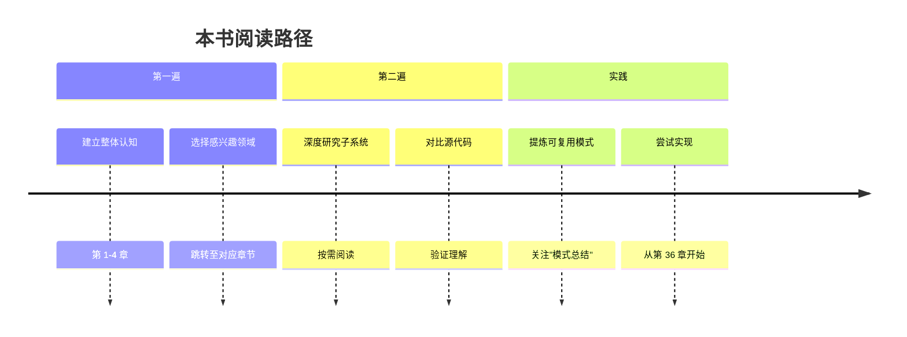

# 前言：本书的由来

> 一部源于意外开源的技术深度解析

## 缘起：2026-03-31 的意外

2026年3月31日，一个看似平常的日子，却在 AI 开发工具领域掀起了一场小小的风暴。Chao fan Shou (@Fried_rice) 在使用 Claude Code CLI 时，偶然发现已发布的 npm 包中包含 `.map` 文件——这些 source map 文件引用了存储在 Anthropic 的 R2 存储桶中的完整、未混淆的 TypeScript 源代码。

随后，一位 Anthropic 员工做出了一个令人惊讶的决定：将这些源代码以公共领域（Public Domain）方式发布。一夜之间，原本闭源的企业级 AI 工具，其完整实现细节展现在了全世界开发者面前。

## 为什么要写这本书

作为技术从业者，面对如此丰富且精心设计的代码库，单纯的代码浏览无法满足深入理解的需求。我们需要：

### 1. 系统性的知识组织

50 万行代码不是小项目。没有系统的梳理，很容易迷失在细节的海洋中。本书按照从整体到局部、从基础到高级的逻辑，将整个项目拆解为 37 个主题章节，每个章节聚焦一个特定的技术领域。

### 2. 设计理念的挖掘

代码告诉我们"是什么"，但很少直接告诉我们"为什么"。为什么选择 Bun 而非 Node.js？为什么用 React 构建终端 UI？为什么设计四层记忆架构？本书试图从代码中反向推导这些设计决策背后的思考。

### 3. 技术趋势的洞察

Claude Code 不是一个普通的 CLI 工具。它代表了 AI 与传统软件开发工作流融合的最新尝试。通过深入分析这个项目，我们可以窥见 AI 辅助开发的未来方向。

## 本书的定位

### 不是什么

- **不是 API 文档**：API 文档已经在源代码的注释中存在
- **不是入门教程**：假设读者已经具备 TypeScript、React、CLI 开发的基础知识
- **不是官方文档**：这是第三方分析，不代表 Anthropic 的官方观点

### 是什么

- **深度技术分析**：从架构到实现细节的全面解析
- **设计决策讨论**：探讨技术选择背后的权衡
- **可复用模式总结**：提炼出可以应用到其他项目的模式和实践

## 目标读者

### 主要读者

1. **CLI 工具开发者**：学习如何构建现代化的命令行工具
2. **AI 应用开发者**：理解如何将 LLM 能力集成到实际产品中
3. **TypeScript/React 开发者**：学习大型项目的架构和组织方式
4. **技术架构师**：研究 AI 时代软件架构的演进

### 次要读者

1. **开源贡献者**：希望参与 Claude Code 项目的开发者
2. **技术研究者**：关注 AI 工具发展的研究人员
3. **技术写作爱好者**：学习如何撰写技术深度分析

## 本书的结构

### 七大部分

本书将 Claude Code 的技术体系划分为七个部分：

1. **基础与架构**：项目的整体视图和启动流程
2. **查询引擎**：与 Claude AI 交互的核心机制
3. **工具系统**：40+ 工具的设计与实现
4. **命令与界面**：用户交互层的设计
5. **高级特性**：Bridge、MCP、多 Agent 等
6. **记忆与智能**：四层记忆架构的设计
7. **安全模型**：多层防护体系

### KAIROS 专题系列

KAIROS（定时任务系统）是 Claude Code 中一个相对独立且设计精巧的子系统，本书将其作为独立系列，用 5 章篇幅详细介绍。

## 阅读指南

### 第一次阅读

建议按顺序阅读第一至四章，建立整体认知。之后可以根据兴趣跳转到感兴趣的章节。

### 深度研究

对于每个子系统，建议采用以下阅读方式：

1. 先阅读本书对应章节，建立概念模型
2. 对照源代码，验证理解
3. 运行调试，观察实际行为
4. 思考如果由自己设计，会有什么不同

### 实践导向

如果目标是构建类似的工具，建议：

1. 重点关注"可复用模式"部分
2. 参考第 36 章（构建你的 CLI）
3. 尝试实现一个简化版本

## 技术承诺

### 深度承诺

每章至少包含：
- 15,000 字以上的深度分析（KAIROS 系列 8,000-12,000 字）
- 5 个以上的技术图表
- 设计理念和权衡讨论
- 与其他方案的对比

### 质量承诺

- 所有代码示例均来自实际源代码
- 所有技术断言均有代码或文档支撑
- 明确区分事实陈述和作者观点

## 致谢

### Anthropic 团队

首先感谢 Anthropic 团队创建了这个出色的工具，并最终决定将其开源。源代码的质量和注释的完整性，为本书的写作提供了坚实的基础。

### 发现者

感谢 Chao fan Shou (@Fried_rice) 的敏锐发现，才有了这次意外的开源。

### 读者

感谢你选择阅读本书。希望这本书能帮助你更好地理解 Claude Code，更重要的是，启发你思考如何在自己的项目中应用这些设计思想。

## 反馈与更新

### 版本控制

本书版本与 Claude Code 源代码版本对应：
- 书籍版本：2.0
- 源代码版本：基于 2026-03-31 公开版本

### 反馈渠道

如果你发现错误或有改进建议，欢迎通过以下方式反馈：
- 提交 Issue 到项目仓库
- 发起 Pull Request
- 参与讨论

## 作者观点声明

本书包含大量作者的主观分析和评价。这些观点基于：

- 多年软件架构经验
- 对 AI 技术发展的观察
- 对源代码的深入分析

但这些观点仍然是主观的，仅供参考。真正的理解需要你亲自阅读源代码，形成自己的判断。

## 本书的局限

### 时间局限

软件在不断演进，本书基于特定时间点的源代码快照。部分内容可能在后续版本中已过时。

### 知识局限

作者的知识和理解必然存在盲区。对于某些设计决策的推理可能不完全准确。

### 视角局限

本书主要从技术角度分析，对于产品、商业、用户体验等维度的讨论相对较少。

## 开始阅读

现在，让我们开始这段技术探索之旅。从第 1 章开始，逐步揭开 Claude Code CLI 的技术面纱。

---

*写作日期：2026-04-01*
*作者：技术分析团队*
