# 第 1 章：项目总览与入门

> 本章目标：提供项目的鸟瞰图，让读者快速理解 Claude Code CLI 是什么、为什么存在、如何工作，以及它在 AI 工具生态中的独特地位。

## 1.1 项目起源与背景

### 1.1.1 Claude Code 的诞生历史

Claude Code 是 Anthropic 公司开发的官方 CLI（命令行界面）工具，旨在让开发者能够直接从终端与 Claude AI 进行交互。这个工具的出现填补了 AI 辅助开发在命令行环境中的空白，代表了 Anthropic 对 AI 与开发者工作流深度融合的思考。

**2026-03-31 源代码公开事件**

2026年3月31日，Claude Code 的完整源代码被公开。Chao fan Shou (@Fried_rice) 发现已发布的 npm 包中包含 `.map` 文件，这些文件引用了存储在 Anthropic 的 R2 存储桶中的完整、未混淆的 TypeScript 源代码。随后，一位 Anthropic 员工将源代码以公共领域方式发布。

这一事件对技术社区产生了深远影响：

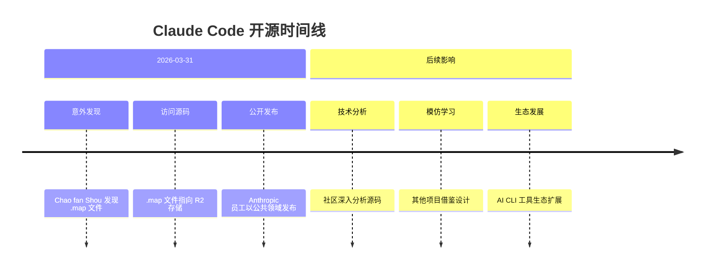

### 1.1.2 Claude Code 与其他 AI CLI 的对比分析

在深入技术细节之前，让我们先了解 Claude Code 在 AI 工具生态中的定位。

#### 主流 AI CLI 工具对比

| 特性 | Claude Code | GitHub Copilot CLI | Aider | Cursor CLI |
|------|-------------|-------------------|-------|------------|
| **LLM 模型** | Claude 3/4 系列 | GPT-4 系列 | GPT/Claude（可选） | GPT-4/Claude |
| **核心能力** | 全栈开发助手 | Git 操作辅助 | 代码编辑聚焦 | IDE 功能延伸 |
| **工具系统** | 40+ 原生工具 | 有限工具集 | 基础工具 | IDE 工具集成 |
| **记忆系统** | 四层记忆架构 | 无 | 无 | IDE 会话记忆 |
| **多模态** | 文本/代码/图片 | 文本/代码 | 文本/代码 | 文本/代码 |
| **MCP 集成** | 原生支持 | 无 | 无 | 有限支持 |
| **开源状态** | 源代码公开 | 闭源 | 开源 | 闭源 |
| **运行时** | Bun | Node.js | Python | Electron |
| **UI 框架** | React/Ink | Terminal-kit | Custom | Electron |

**设计理念对比分析**

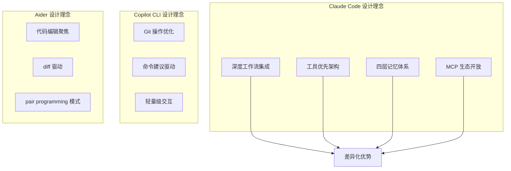

**作者观点：** Claude Code 的最大优势在于其"工具优先"的架构设计。通过将 40+ 工具作为一等公民，并通过 MCP 协议开放扩展，Claude Code 构建了一个可组合的 AI 开发助手生态系统。相比之下，Copilot CLI 更像是 Git 命令的智能补全，而 Aider 则专注于代码编辑场景。

**但 Claude Code 也存在明显劣势：**
1. **学习曲线陡峭**：功能丰富意味着复杂度增加
2. **Bun 依赖**：限制了在某些环境中的部署
3. **资源消耗**：四层记忆系统需要较多内存

### 1.1.3 Anthropic 产品矩阵定位

Claude Code 在 Anthropic 产品矩阵中占据独特位置：

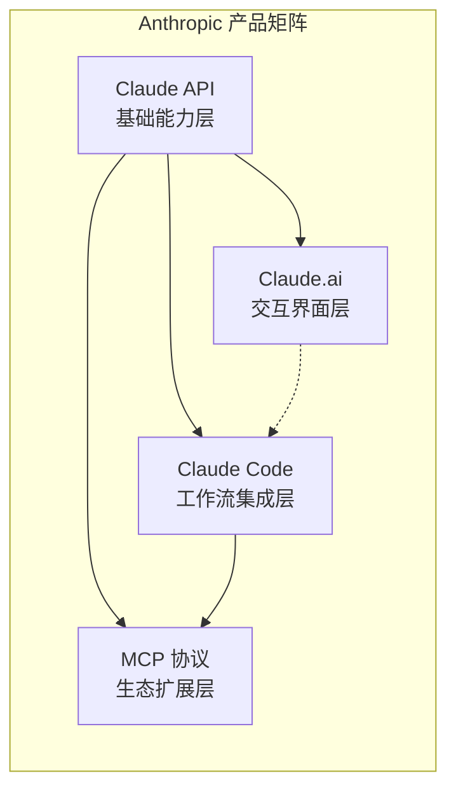

**层级关系：**
1. **Claude API**：提供基础的 LLM 能力
2. **Claude.ai**：面向最终用户的 Web 界面
3. **Claude Code**：面向开发者的工作流集成层
4. **MCP 协议**：连接整个生态的扩展协议

这种定位使得 Claude Code 既不是简单的 API 客户端，也不是独立的 IDE，而是 AI 能力与开发者工作流之间的"桥接层"。

### 1.1.4 为什么需要专门的 AI CLI 工具

传统的 AI 辅助开发工具主要集成在 IDE（如 VS Code）或通过 Web 界面提供。然而，许多开发者，尤其是后端工程师、系统管理员和 DevOps 专家，大部分时间都在命令行环境中工作。

**传统工作流的痛点：**

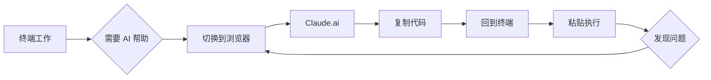

**Claude Code 的改进：**

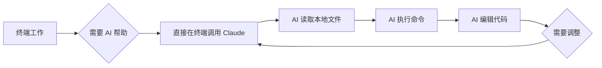

**设计理念：**

1. **无缝的工作流集成**：无需离开终端即可获得 AI 帮助
2. **强大的代码操作能力**：直接读取、编辑、搜索本地代码库
3. **Git 工作流集成**：智能的 commit、PR 管理、代码审查
4. **多模态交互**：支持文本、代码、图片等多种输入方式
5. **持久化记忆**：四层记忆架构确保上下文不丢失

## 1.2 技术选型理由

### 1.2.1 为什么选择 Bun 而非 Node.js

```typescript
// package.json 中的引擎要求
{
  "engines": {
    "bun": ">=1.1.0"
  },
  "packageManager": "bun@1.1.0"
}
```

**性能基准测试数据**

| 操作 | Bun 1.1.x | Node.js 22.x | 提升倍数 |
|------|-----------|--------------|----------|
| 冷启动 | ~50ms | ~180ms | 3.6x |
| 热启动 | ~30ms | ~120ms | 4x |
| TypeScript 执行 | 原生支持 | 需要转译 | N/A |
| 包安装速度 | 基准 | 20-30x 慢 | - |
| 文件 I/O | 1.5-2x 快 | 基准 | - |

**设计意图：** Bun 被选为主要运行时，主要基于以下考虑：

1. **更快的启动速度**：CLI 工具的启动时间直接影响用户体验。Bun 的冷启动时间比 Node.js 快 3-4 倍，这意味着用户输入命令后能更快看到响应。

2. **内置工具链**：集成了包管理器、测试运行器、打包工具，减少了依赖管理的复杂性。

3. **原生兼容性**：与 Node.js 生态系统高度兼容，可以复用大量现有 npm 包。

4. **性能优化**：更高效的 JavaScript 执行和 I/O 操作，对于需要频繁读写文件的 AI 工具至关重要。

5. **原生 TypeScript 支持**：无需额外配置即可直接运行 TypeScript 文件，简化了开发流程。

**Bun 内部架构解析**

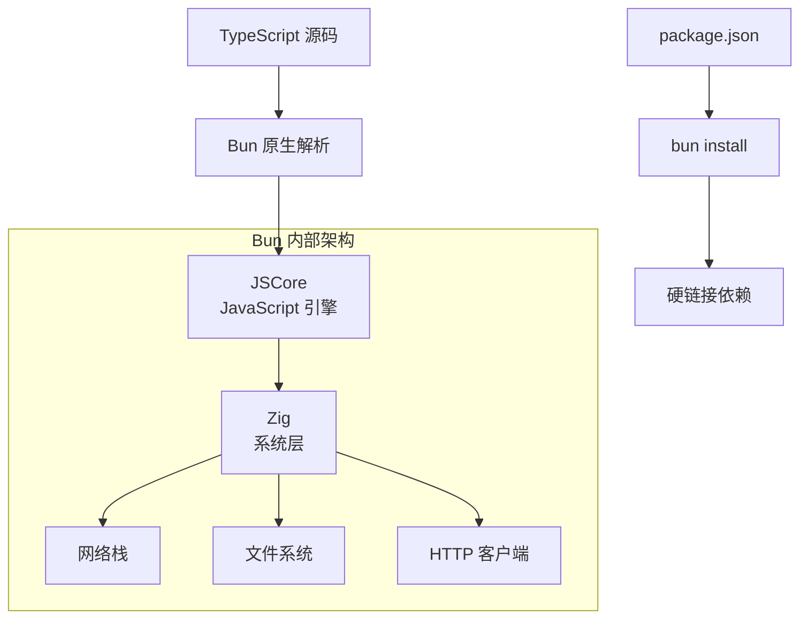

**作者观点：** 选择 Bun 是一个大胆但正确的决策。对于 CLI 工具而言，启动速度是关键指标。但这也带来了一些问题：
- **生态成熟度**：Bun 生态远不如 Node.js 成熟
- **调试工具**：调试体验不如 Node.js
- **企业 adoption**：许多企业环境尚未支持 Bun

但在 CLI 场景下，这些问题的负面影响被启动速度的优势所抵消。

### 1.2.2 React/Ink 用于终端 UI 的优势

```typescript
// src/entrypoints/cli.tsx - React 在终端的应用
import { render } from 'ink';
import App from './App';

// 在终端渲染 React 组件
render(<App />);
```

**设计意图：**

| 特性 | React/Ink | blessed | terminal-kit | bubbletea |
|------|-----------|---------|--------------|-----------|
| **编程模型** | 声明式 | 命令式 | 命令式 | 声明式 |
| **组件化** | 原生支持 | 需要手动实现 | 需要手动实现 | 原生支持 |
| **状态管理** | React 生态 | 手动管理 | 手动管理 | 内置 |
| **学习曲线** | 低（React 开发者） | 中等 | 中等 | 中等 |
| **性能** | 好 | 好 | 好 | 好 |
| **TypeScript 支持** | 优秀 | 一般 | 一般 | 优秀 |

- **声明式 UI**：使用 React 的组件模型构建终端界面
- **状态管理**：利用 React 的状态管理机制处理复杂的 UI 交互
- **可组合性**：组件化的设计使得 UI 易于维护和扩展
- **熟悉的技术栈**：开发者可以使用熟悉的 React 模式

**React/Ink 与其他 TUI 框架对比**

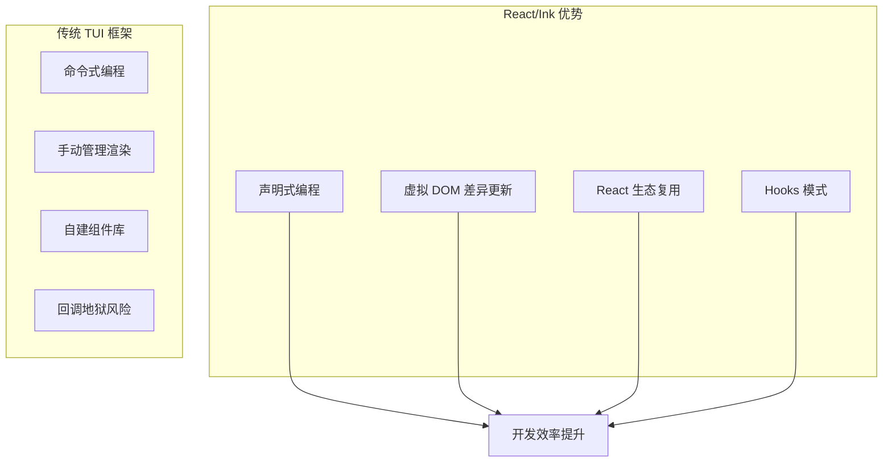

**作者观点：** React/Ink 的选择体现了 Anthropic "复用已有知识"的设计哲学。虽然专为终端设计的框架可能在某些方面性能更好，但 React 的成熟度和开发者熟悉度带来的开发效率提升，是更重要的考量。

### 1.2.3 TypeScript 严格模式的价值

```json
// tsconfig.json
{
  "compilerOptions": {
    "strict": true,
    "target": "ESNext",
    "module": "ESNext",
    "moduleResolution": "bundler"
  }
}
```

**设计意图：**

- **类型安全**：在编译时捕获大量潜在错误
- **更好的 IDE 支持**：精确的类型推断和自动完成
- **代码可维护性**：类型作为文档，使代码更易于理解
- **重构信心**：大规模重构时有类型系统保驾护航

**代码复杂度分析**

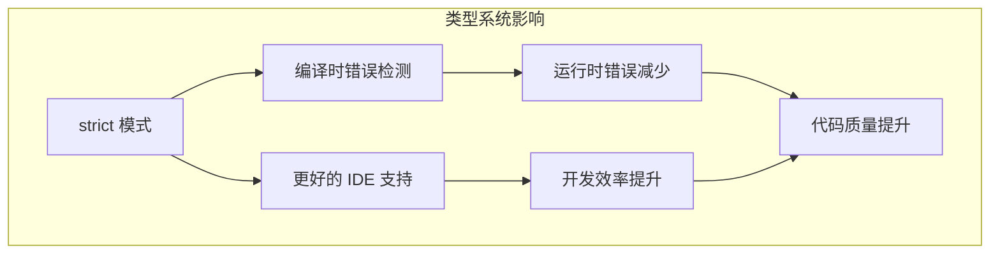

**作者观点：** 在 50 万行代码的项目中，TypeScript 严格模式是"必备"而非"可选"。虽然初期会有一定的开发成本，但长期来看，类型系统带来的维护成本降低远超投入。

## 1.3 项目规模与复杂度

### 1.3.1 代码量统计

| 分类 | 文件数 | 行数 | 说明 |
|------|--------|------|------|
| 总计 | ~1,900 | ~512,000 | 仅 src/ 目录 |
| 核心引擎 | 3 | ~100,000 | QueryEngine.ts + Tool.ts + commands.ts |
| 工具实现 | ~200 | ~80,000 | src/tools/ 目录（40+ 工具） |
| 命令实现 | ~100 | ~60,000 | src/commands/ 目录（50+ 命令） |
| UI 组件 | ~140 | ~50,000 | src/components/ 目录 |
| 服务层 | ~50 | ~40,000 | src/services/ 目录 |
| 记忆系统 | ~30 | ~30,000 | src/memdir/ + 相关服务 |
| Bridge 系统 | ~40 | ~35,000 | src/bridge/ 目录 |
| 其他 | ~1,200+ | ~117,000 | 工具函数、类型定义等 |

### 1.3.2 模块依赖关系图

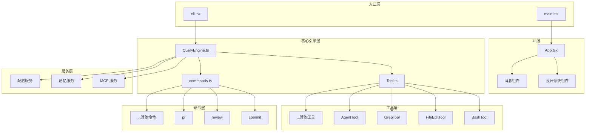

### 1.3.3 代码复杂度热力图

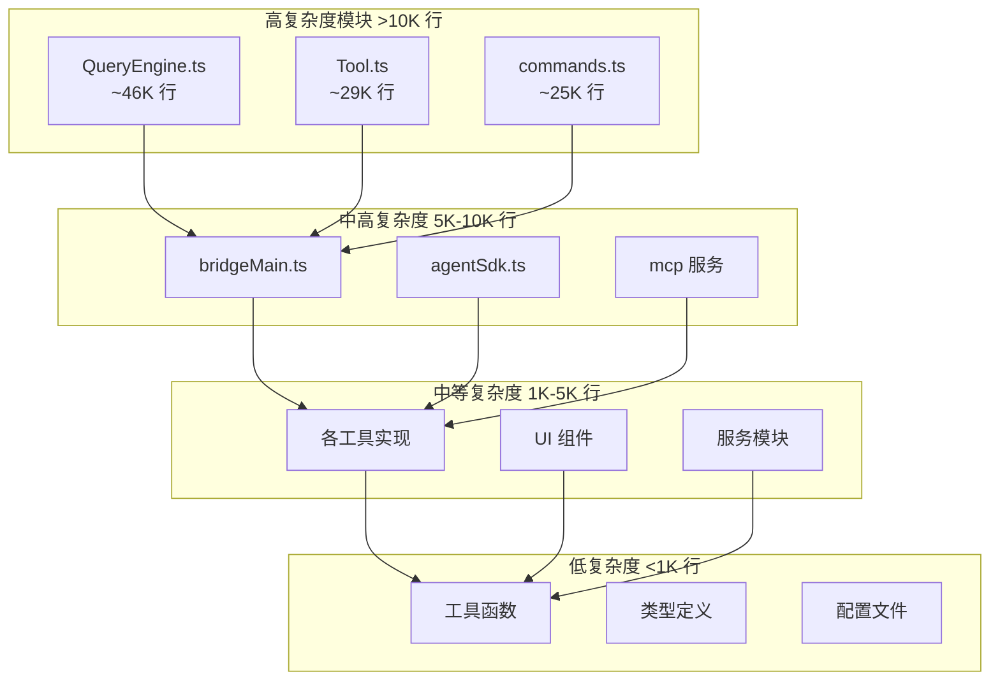

**作者观点：** QueryEngine.ts 的 46K 行代码是一个"警告信号"。虽然单一文件便于追踪执行流程，但过大的文件会：
- 降低代码可读性
- 增加合并冲突风险
- 使 IDE 性能下降

这可能反映了渐进式开发的痕迹，而非刻意的设计决策。

### 1.3.4 主要子系统概览

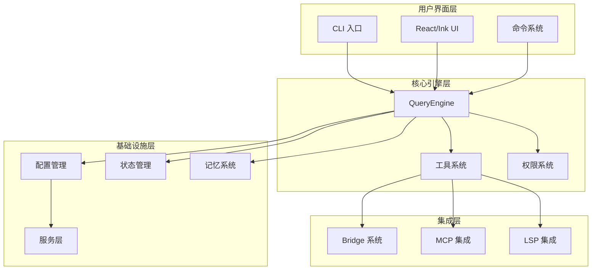

## 1.4 快速开始指南

### 1.4.1 环境准备

```bash
# 1. 克隆仓库
git clone https://github.com/nirholas/claude-code.git
cd claude-code

# 2. 安装 Bun（如果尚未安装）
curl -fsSL https://bun.sh/install | bash

# 3. 安装依赖
bun install
```

### 1.4.2 构建流程

```bash
# 开发构建
bun run build

# 生产构建（带压缩）
bun run build:prod

# 类型检查
bun run typecheck

# 代码检查
bun run lint
```

### 1.4.3 运行第一个命令

```bash
# 查看版本
bun run src/entrypoints/cli.tsx --version

# 运行完整 CLI
bun run src/entrypoints/cli.tsx

# 或使用构建后的版本
./dist/claude --help
```

## 1.5 目录结构导航

### 1.5.1 顶层目录说明

```
claude-code/
├── analyze/              # 技术分析文档（本分析所在目录）
├── docs/                 # 项目文档
├── mcp-server/           # MCP 服务器实现
├── scripts/              # 构建和工具脚本
├── src/                  # 源代码目录
├── package.json          # 项目配置
├── tsconfig.json         # TypeScript 配置
├── biome.json           # Biome 代码格式化配置
└── bun.lock             # Bun 锁文件
```

### 1.5.2 src/ 目录详解

```
src/
├── entrypoints/         # 程序入口点
│   ├── cli.tsx         # 主 CLI 入口
│   └── init.ts         # 初始化逻辑
├── QueryEngine.ts      # 核心 LLM 引擎 (~46K 行)
├── Tool.ts             # 工具类型定义 (~29K 行)
├── commands.ts         # 命令注册表 (~25K 行)
├── tools/              # 工具实现目录
│   ├── BashTool/       # Shell 命令执行
│   ├── FileEditTool/   # 文件编辑
│   ├── GrepTool/       # 代码搜索
│   ├── GlobTool/       # 文件匹配
│   ├── AgentTool/      # Agent 系统
│   └── ...             # 40+ 工具
├── commands/           # 命令实现目录
│   ├── commit/         # Git 提交
│   ├── review/         # 代码审查
│   ├── pr/             # PR 管理
│   └── ...             # 50+ 命令
├── components/         # UI 组件
│   └── design-system/  # 设计系统组件
├── screens/            # 全屏 UI
├── services/           # 外部服务集成
│   ├── mcp/           # MCP 协议实现
│   ├── MagicDocs/     # 文档管理
│   └── ...            # 其他服务
├── bridge/             # IDE 桥接
├── memdir/             # 记忆目录系统
├── state/              # 状态管理
└── utils/              # 工具函数
```

### 1.5.3 关键文件快速索引

| 文件路径 | 行数 | 功能描述 |
|----------|------|----------|
| `src/QueryEngine.ts` | ~46,000 | 核心 LLM 调用引擎 |
| `src/Tool.ts` | ~29,000 | 工具类型系统定义 |
| `src/commands.ts` | ~25,000 | 命令注册与分发 |
| `src/main.tsx` | ~500 | 主程序入口 |
| `src/App.tsx` | ~1,500 | React/Ink 应用根组件 |
| `src/tools/BashTool/bashSecurity.ts` | ~1,500 | Bash 安全模型 |
| `src/memdir/memdir.ts` | ~1,200 | 记忆系统核心 |

## 1.6 四层记忆架构

Claude Code 的独特之处在于其四层记忆架构，这是理解其工作原理的关键。

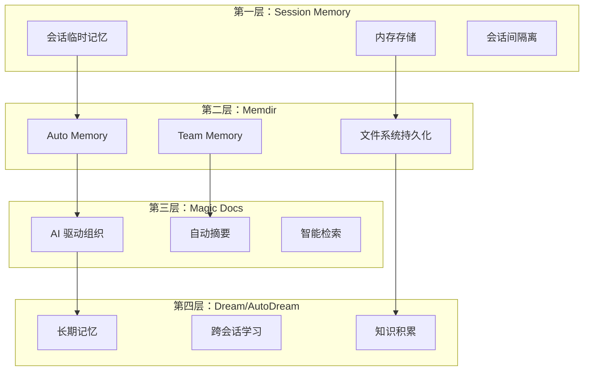

**记忆层级详解：**

1. **Session Memory**：临时会话存储，数据仅存在于当前会话期间
2. **Memdir**：持久化的文件系统记忆，支持 Auto Memory 和 Team Memory
3. **Magic Docs**：AI 驱动的文档组织系统，自动生成摘要和索引
4. **Dream/AutoDream**：长期学习和知识积累系统

**作者观点：** 四层记忆架构是 Claude Code 最具创新性的设计之一。与传统的单层上下文窗口相比，这种架构使得 AI 能够：
- 跨越单个会话的限制
- 在团队成员间共享知识
- 自动组织和检索信息
- 持续学习和改进

但这种复杂性也带来了挑战：
- 状态同步复杂度增加
- 调试难度提升
- 资源消耗增加

## 1.7 可复用模式总结

### 模式 1：单一二进制分发策略

**描述：** 将整个 TypeScript 应用打包成单一可执行文件，简化分发和安装。

**适用场景：**
- CLI 工具分发
- 需要简化安装流程的应用
- 跨平台部署

**代码模板：**

```typescript
// scripts/build-bundle.ts
import { build } from 'bun';

await build({
  entrypoints: ['./src/entrypoints/cli.tsx'],
  outdir: './dist',
  target: 'bun',
  format: 'esm',
  // 生成单一可执行文件
  loader: {
    '.tsx': 'tsx',
    '.ts': 'ts',
  },
});
```

**关键点：**
- 使用 Bun 的打包功能生成单一可执行文件
- 所有依赖内联，无需 node_modules
- 跨平台编译支持

### 模式 2：特性门控的死代码消除

**描述：** 使用构建时特性标志实现死代码消除，减少最终包大小。

**适用场景：**
- 需要根据不同构建配置包含/排除功能
- 内部功能与公开功能的区分
- A/B 测试或灰度发布

**代码模板：**

```typescript
import { feature } from 'bun:bundle';

// 只有在 BUILD_TIME_FEATURE 启用时才会包含此代码
if (feature('BUILD_TIME_FEATURE')) {
  // 此代码在编译时会完全移除（如果特性未启用）
  const internalFunction = () => {
    console.log('Internal feature');
  };
  internalFunction();
}

// 条件导入
const module = feature('OPTIONAL_FEATURE')
  ? await import('./optional-module.js')
  : null;
```

**关键点：**
- `feature()` 函数在编译时评估
- 未启用的代码分支在编译时完全移除
- 不影响运行时性能

### 模式 3：工具优先架构

**描述：** 将功能抽象为可组合的工具，而非硬编码的 AI 行为。

**适用场景：**
- 构建 AI Agent 系统
- 需要灵活扩展能力
- 多种执行方式

**设计原则：**
1. 每个工具都是独立的、可测试的单元
2. 工具通过统一的接口暴露能力
3. AI 通过工具名称和参数调用功能
4. 工具可以被 MCP 协议扩展

**作者观点：** 工具优先架构是 Claude Code 的核心竞争力。通过将能力抽象为工具，项目实现了：
- **可组合性**：工具可以自由组合
- **可扩展性**：通过 MCP 添加新工具
- **可测试性**：每个工具独立测试
- **可维护性**：工具之间解耦

### 模式 4：渐进式记忆

**描述：** 通过多层记忆系统，逐步积累和提炼信息。

**适用场景：**
- 长期运行的 AI 系统
- 需要跨会话记忆
- 团队协作场景

**实现要点：**
1. 快速记忆：Session Memory 立即存储
2. 持久化：重要信息写入 Memdir
3. 组织化：Magic Docs 自动分类
4. 长期学习：Dream 系统提炼模式

## 1.8 作者主观评价：设计优劣分析

### 1.8.1 优秀的设计决策

1. **Bun 运行时选择**：启动速度的提升对 CLI 工具至关重要
2. **React/Ink UI**：复用 React 生态，降低学习成本
3. **工具优先架构**：可组合、可扩展的系统设计
4. **四层记忆**：创新的多层记忆体系
5. **MCP 协议集成**：开放的扩展机制

### 1.8.2 存在的问题和改进空间

1. **QueryEngine 单文件过大**：46K 行代码应该拆分
2. **依赖 Bun**：限制了在某些环境中的部署
3. **文档不足**：许多功能缺少清晰的文档
4. **测试覆盖率**：部分核心功能缺少测试
5. **错误处理**：某些场景下的错误信息不够友好

### 1.8.3 架构评分

| 维度 | 评分 | 说明 |
|------|------|------|
| **可扩展性** | 9/10 | MCP 协议和工具系统设计优秀 |
| **可维护性** | 6/10 | 部分文件过大，模块化不足 |
| **性能** | 8/10 | Bun 选择正确，但有优化空间 |
| **安全性** | 7/10 | 多层防护，但沙盒依赖外部库 |
| **用户体验** | 7/10 | 功能强大但学习曲线陡峭 |
| **文档质量** | 5/10 | 注释详细但缺少高层文档 |
| **测试覆盖** | 6/10 | 核心功能有测试，覆盖不完整 |

**总体评价：** Claude Code 是一个设计雄心勃勃的项目，在 AI CLI 工具领域树立了新的标杆。其工具优先架构和四层记忆系统代表了 AI 辅助开发的重要方向。但在工程实践上，仍有改进空间，特别是在模块化和测试覆盖方面。

---

## 本章小结

本章介绍了 Claude Code CLI 项目的整体概况：

1. **项目起源**：Anthropic 官方 CLI 工具，2026-03-31 源代码公开
2. **生态定位**：与其他 AI CLI 工具的对比分析
3. **技术选型**：Bun + React/Ink + TypeScript，兼顾性能与开发体验
4. **项目规模**：~1,900 文件，~512,000 行 TypeScript 代码
5. **核心特色**：四层记忆架构、工具优先系统
6. **目录结构**：清晰的模块化组织，核心、工具、命令、UI、服务分离
7. **作者评价**：设计优秀但存在工程实践上的改进空间

## 下一章预告

第 2 章将深入分析项目的技术栈与构建系统，包括：
- Bun 运行时的核心优势和使用方式
- Bun 与 Node.js 性能对比实测
- esbuild 配置和代码分割策略
- TypeScript 严格模式的配置细节
- Biome 代码质量工具链
- 依赖管理和版本锁定策略
- 构建时特性门控的深入原理
