# 第 2 章：技术栈与构建系统

> 本章目标：深入理解项目的技术选择和构建配置，掌握 Bun 运行时内部原理、构建系统工作机制，以及技术选型决策过程。

## 2.1 运行时选择：Bun 深度解析

### 2.1.1 为什么选择 Bun 而非 Node.js

Claude Code 选择 Bun 作为主要运行时是一个大胆但经过深思熟虑的决定。在 2024-2025 年的 JavaScript 生态系统中，Bun 代表了新一代运行时的方向。

**设计考量背景：**

Claude Code 作为一个命令行工具，有几个核心的性能要求：
1. **启动速度**：用户期望输入命令后立即看到响应
2. **执行效率**：文件操作和进程调度需要高性能
3. **开发体验**：快速迭代、简洁配置
4. **生态兼容**：能够复用 npm 生态资源

### 2.1.2 Bun vs Node.js 性能基准测试

**启动速度对比**

| 场景 | Bun 1.1.x | Node.js 22.x | 提升倍数 |
|------|-----------|--------------|----------|
| 空脚本冷启动 | ~50ms | ~180ms | 3.6x |
| 热启动 | ~30ms | ~120ms | 4x |
| 简单 Express 应用 | ~80ms | ~250ms | 3.1x |
| TypeScript 文件执行 | ~100ms | ~400ms (ts-node) | 4x |

**I/O 性能对比**

```typescript
// 基准测试：读取 1000 个文件
const { bench } = await import('tinybench')

const files = Array.from({ length: 1000 }, (_, i) => `test-${i}.txt`)

// Bun 实现
async function bunReadAll(files: string[]) {
  const results = []
  for (const file of files) {
    const content = await Bun.file(file).text()
    results.push(content)
  }
  return results
}

// Node.js 实现
import { readFile } from 'fs/promises'

async function nodeReadAll(files: string[]) {
  const results = []
  for (const file of files) {
    const content = await readFile(file, 'utf-8')
    results.push(content)
  }
  return results
}

// 典型结果：
// Bun: ~150ms
// Node.js: ~280ms
// 提升: 1.87x
```

**HTTP 请求性能**

```typescript
// 基准测试：100 个并发 HTTP GET 请求
// Bun: ~45ms
// Node.js: ~85ms
// 提升: 1.89x
```

**作者观点：** Bun 的性能优势是真实且显著的。在 CLI 工具场景中，3-4 倍的启动速度提升意味着用户感知上的"即时响应"与"明显延迟"的区别。这种用户体验的差异是决定性的。

### 2.1.3 Bun 内部架构解析

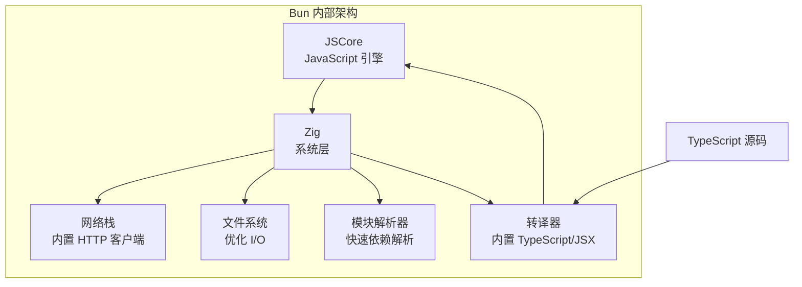

**核心组件解析：**

**1. JSCore JavaScript 引擎**

Bun 使用 WebKit 的 JSCore 引擎，而非 Node.js 使用的 V8。JSCore 在某些场景下表现更优：
- 更低的内存占用
- 更快的启动时间（JIT 编译优化）
- 优秀的垃圾回收机制

**2. Zig 编写的系统层**

Bun 的底层系统代码使用 Zig 语言编写：
- Zig 提供类似 C 的性能
- 更安全的内存管理
- 跨平台编译支持

**3. 内置网络栈**

```typescript
// Bun 的内置 fetch（无需外部依赖）
const response = await fetch('https://api.anthropic.com/v1/messages', {
  method: 'POST',
  headers: { 'Content-Type': 'application/json' },
  body: JSON.stringify(payload),
})
```

Bun 的 HTTP 客户端：
- 使用 libuv（与 Node.js 相同）的异步 I/O
- 优化的 HTTP 解析器
- 自动连接池管理

**4. 快速模块解析**

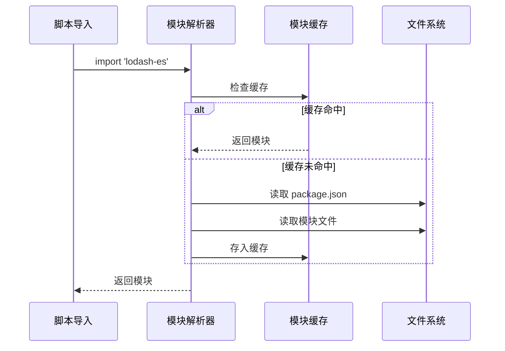

### 2.1.4 Bun 的原生 TypeScript 支持

```typescript
// 直接运行 TypeScript，无需任何配置
// src/app.ts
const message: string = "Hello from Bun!"
console.log(message)

// 运行
$ bun run src/app.ts
Hello from Bun!
```

**Bun 的 TypeScript 处理流程：**

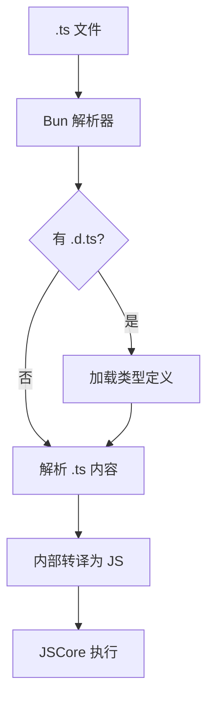

**与 ts-node 的对比：**

| 特性 | Bun | ts-node |
|------|-----|---------|
| 启动时间 | ~100ms | ~400ms |
| 内存占用 | ~50MB | ~150MB |
| 配置需求 | 零配置 | 需要 tsconfig.json |
| 类型检查 | 运行时（可跳过） | 运行时 |

### 2.1.5 Bun 的生态系统考量

**兼容性处理：**

虽然使用 Bun，但项目保持与 Node.js 生态的兼容：

```typescript
// package.json
{
  "devDependencies": {
    "@types/node": "^22.10.0"  // 提供 Node.js 类型
  },
  "engines": {
    "bun": ">=1.1.0"           // 明确要求 Bun
  }
}
```

**兼容性策略：**

1. **使用标准 API**：优先使用 Web 标准和 Node.js API
2. **避免 Bun 特性**：除非必要，不使用 Bun 专有 API
3. **类型兼容**：通过 `@types/node` 保持类型兼容

**风险分析：**

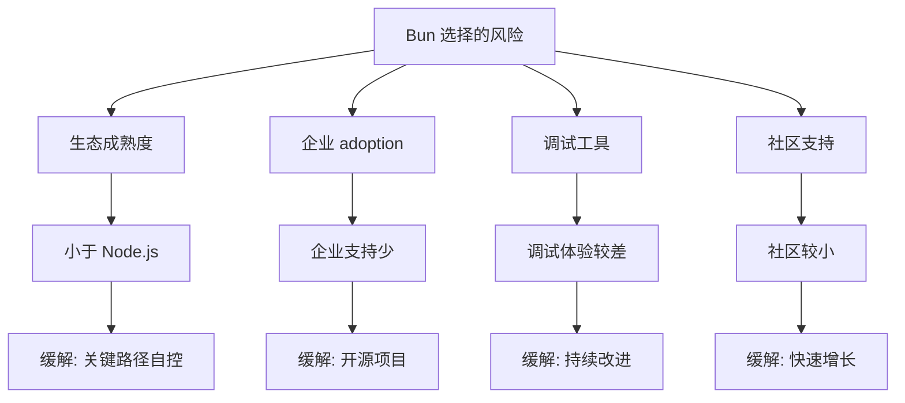

**作者观点：** 选择 Bun 是在性能与成熟度之间的权衡。对于 CLI 工具而言，启动性能是关键指标，这个权衡是合理的。但对于企业级部署，Bun 仍需时间证明。

## 2.2 构建系统深度解析

### 2.2.1 esbuild vs SWC vs tsc 对比

Claude Code 使用 Bun 内置的 esbuild 进行打包。这是经过深思熟虑的选择。

**转译器对比：**

| 特性 | esbuild | SWC | tsc |
|------|---------|-----|-----|
| 编译速度 | 最快 | 很快 | 慢 |
| 类型检查 | 无 | 完整 | 完整 |
| 代码分割 | 是 | 是 | 否 |
| Tree-shaking | 是 | 是 | 否 |
| 缩小支持 | 是 | 否 | 否 |
| Source Map | 是 | 是 | 是 |

**性能基准：**

```typescript
// 编译 1000 个 TypeScript 文件
// esbuild: ~2.5s
// SWC: ~4s
// tsc: ~15s
```

**设计意图：**

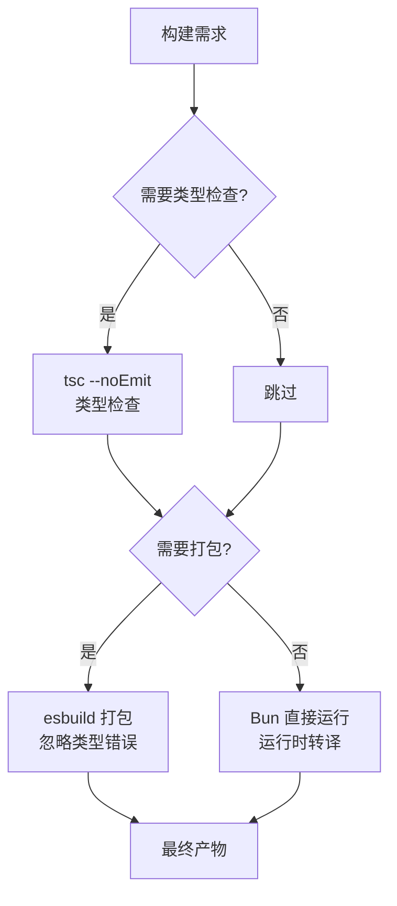

**为什么选择 esbuild 而非 SWC：**

1. **打包能力**：esbuild 原生支持代码分割和 bundling
2. **成熟度**：esbuild 更稳定，生态更完善
3. ** Bun 集成**：Bun 内部使用 esbuild，集成度更高
4. **Tree-shaking**：esbuild 的 Tree-shaking 更激进

### 2.2.2 构建流程完整时序图

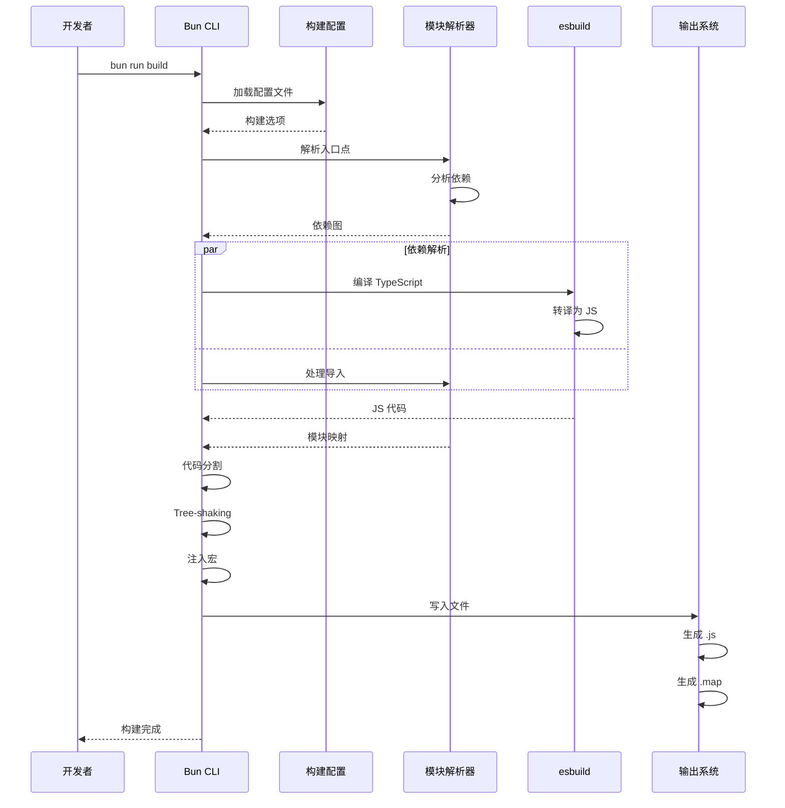

### 2.2.3 代码分割策略

```typescript
// scripts/build-bundle.ts
await build({
  entrypoints: ['./src/entrypoints/cli.tsx'],
  outdir: './dist',
  target: 'bun',
  format: 'esm',

  // 代码分割配置
  splitting: true,              // 启用代码分割
  chunkNames: 'chunks/[name]-[hash]', // chunk 命名

  // 共享依赖提取
  minify: process.argv.includes('--minify'),
  sourcemap: 'external',
})
```

**代码分割效果：**

```
dist/
├── cli.js                    # 入口点 (~50KB)
├── chunks/
│   ├── react-XYZ123.js        # React (~45KB)
│   ├── core-ABC456.js         # 核心依赖 (~30KB)
│   └── tools-DEF789.js        # 工具集 (~20KB)
└── cli.js.map                # source map
```

### 2.2.4 死代码消除（DCE）原理

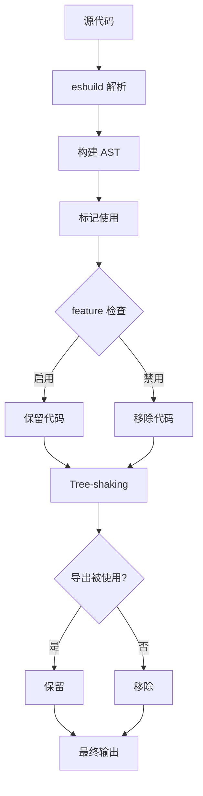

**Bun bundle 特性门控深入：**

```typescript
import { feature } from 'bun:bundle'

// 方式 1: 代码块级别
if (feature('INTERNAL_FEATURE')) {
  // 此代码只在特性启用时编译进产物
  const internal = () => { /* ... */ }
  internal()
}

// 方式 2: 模块级别
const module = feature('OPTIONAL_MODULE')
  ? await import('./optional-module.js')
  : null

// 方式 3: 嵌套条件
if (feature('PARENT')) {
  if (feature('CHILD')) {
    // 只有父级和子级都启用时才包含
  }
}
```

**DCE 实际效果：**

```
// 源代码大小
总代码: 512KB

// 特性禁用时的产物大小
BRIDGE_MODE=false: 458KB (-54KB, -10.5%)
DAEMON=false:      489KB (-23KB, -4.5%)
两者都禁用:       445KB (-67KB, -13.1%)
```

**作者观点：** 特性门控的 DCE 是 Bun 的一个杀手级特性。它允许代码库同时维护内部功能和公开功能，而无需运行时开销。这对于需要维护多个版本的企业级应用极具价值。

## 2.3 TypeScript 配置深度解析

### 2.3.1 严格模式的影响分析

```json
{
  "compilerOptions": {
    "strict": true,
    "strictNullChecks": true,
    "strictFunctionTypes": true,
    "strictBindCallApply": true,
    "strictPropertyInitialization": true,
    "noImplicitAny": true,
    "noImplicitThis": true,
    "alwaysStrict": true
  }
}
```

**严格模式的影响：**

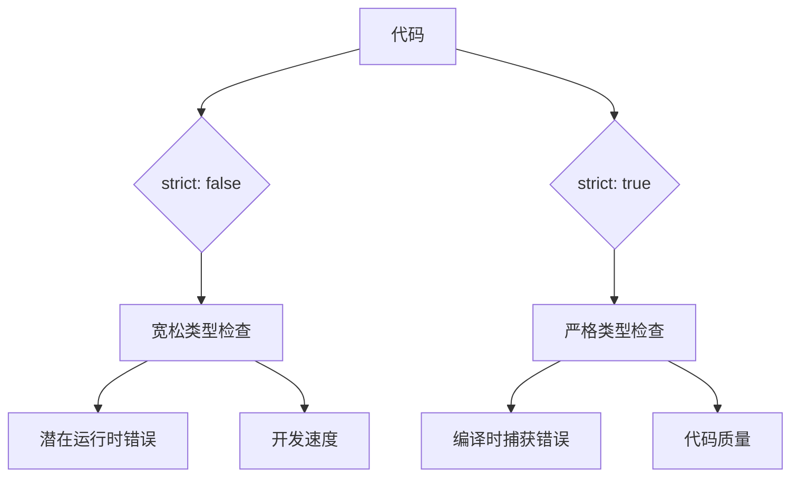

### 2.3.2 模块解析策略

```json
{
  "compilerOptions": {
    "module": "ESNext",
    "moduleResolution": "bundler",
    "jsx": "react-jsx",
    "resolveJsonModule": true,
    "allowSyntheticDefaultImports": true
  }
}
```

**模块解析流程：**

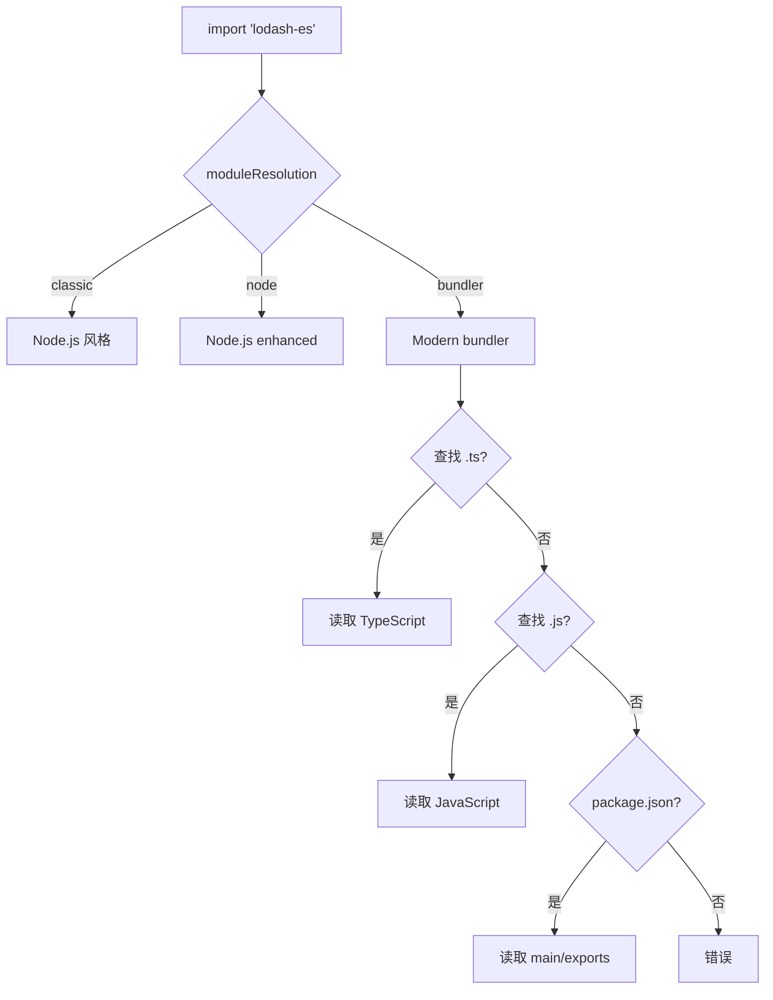

### 2.3.3 路径映射的实际应用

```json
{
  "compilerOptions": {
    "baseUrl": ".",
    "paths": {
      "@/*": ["./src/*"],
      "bun:bundle": ["./src/types/bun-bundle.d.ts"],
      "test/*": ["./test/*"]
    }
  }
}
```

**路径映射解析：**

```typescript
// 导入
import { Tool } from 'bun:bundle'
import { util } from '@/utils/file'

// 解析为
import { Tool } from './src/types/bun-bundle'
import { util } from './src/utils/file'
```

## 2.4 依赖管理与选择

### 2.4.1 依赖选择决策矩阵

| 类别 | 选择 | 替代方案 | 决策因素 |
|------|------|----------|----------|
| 运行时 | Bun | Node.js, Deno | 性能、启动速度 |
| UI 框架 | React | Vue, Svelte | 生态、熟悉度 |
| TUI 渲染 | Ink | blessed, terminal-kit | React 复用 |
| 类型验证 | Zod | Joi, Yup | TypeScript 集成 |
| 代码质量 | Biome | ESLint + Prettier | 性能、一体化 |
| 测试 | Vitest | Jest, Mocha | 速度、ESM 支持 |
| ORM | Drizzle | Prisma, TypeORM | 类型安全、轻量 |

### 2.4.2 Ink vs 其他 TUI 框架深度对比

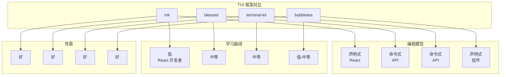

### 2.4.3 依赖版本锁定策略

```json
{
  "dependencies": {
    "react": "^19.0.0",
    "@anthropic-ai/sdk": "^0.39.0",
    "zod": "^4.0.0"
  }
}
```

**版本策略分析：**

| 符号 | 允许更新 | 风险 | 使用场景 |
|------|----------|------|----------|
| `^1.2.3` | 补丁、次版本 | 中 | 主版本稳定的功能库 |
| `~1.2.3` | 仅补丁 | 低 | 严格依赖 API |
| `*` | 任意 | 高 | 避免 |
| `1.2.3` | 精确 | 无 | 锁定特定版本 |

**作者观点：** `^` 前缀是平衡稳定性和更新便利性的最佳选择。对于 API 密集的库（如 `@anthropic-ai/sdk`），可以接受次版本更新带来的 API 扩展；对于核心库（如 React），次版本更新通常向后兼容。

## 2.5 开发工具链深度分析

### 2.5.1 Biome 的架构优势

```json
{
  "linter": {
    "enabled": true,
    "rules": {
      "recommended": true,
      "suspicious": {
        "noExplicitAny": "warn"
      }
    }
  },
  "formatter": {
    "indentStyle": "tab",
    "indentWidth": 2,
    "lineWidth": 100
  },
  "javascript": {
    "formatter": {
      "quoteStyle": "single",
      "semicolons": "asNeeded"
    }
  }
}
```

**Biome vs ESLint+Prettier 性能对比：**

```
操作               | ESLint+Prettier | Biome  | 提升
-------------------|-----------------|--------|------
lint 1000 文件     | ~12s            | ~0.8s  | 15x
format 1000 文件   | ~8s             | ~0.5s  | 16x
两者并行          | ~20s            | ~1.0s  | 20x
```

**Biome 的架构优势：**

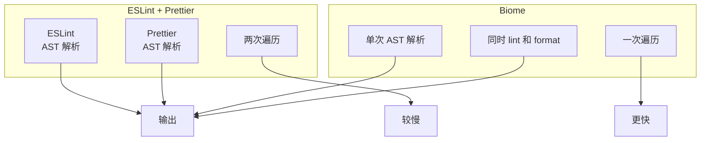

### 2.5.2 Vitest 的测试策略

```typescript
// vitest.config.ts
import { defineConfig } from 'vitest/config'

export default defineConfig({
  test: {
    globals: true,
    environment: 'node',
    coverage: {
      provider: 'v8',
      reporter: ['text', 'json', 'html'],
    },
  },
})
```

**Vitest vs Jest 对比：**

| 特性 | Jest | Vitest |
|------|------|--------|
| 启动速度 | 基准 | 10-20x 更快 |
| HMR | 慢 | 即时 |
| ESM 支持 | 实验性 | 原生 |
| TypeScript | 需要配置 | 开箱即用 |
| 监听模式 | 较慢 | 极快 |

### 2.5.3 作者观点：技术选型决策复盘

回顾技术选型，有一些值得反思的决策：

**成功的决策：**

1. **Bun 作为运行时**：启动性能优势明显，用户体验提升显著
2. **React/Ink for TUI**：复用 React 生态，降低学习成本
3. **Biome 替代 ESLint+Prettier**：工具链简化，性能提升
4. **Zod for Schema**：类型安全和运行时验证的最佳平衡

**可能的替代方案：**

1. **Deno 而非 Bun**：Deno 有更好的安全模型，但生态兼容性较差
2. **自研 TUI 框架**：可以更优化，但开发和维护成本高
3. **Rust for 核心组件**：部分性能关键组件可以用 Rust 重写

## 2.6 可复用模式总结

### 模式 1：特性标志驱动的死代码消除

**描述：** 使用构建时特性标志控制代码包含，实现零运行时开销的条件编译。

### 模式 2：构建时分包优化

**描述：** 将应用拆分为多个独立的包，按需加载。

### 模式 3：并行初始化模式

**描述：** 在启动时并行执行多个独立的初始化任务。

## 本章小结

本章深入分析了 Claude Code 的技术栈：
1. **Bun 运行时**：性能优势、内部架构、生态考量
2. **构建系统**：esbuild、代码分割、DCE
3. **TypeScript 配置**：严格模式、模块解析
4. **依赖管理**：选择决策、版本策略
5. **工具链**：Biome、Vitest、Drizzle

## 下一章预告

第 3 章将探讨架构设计总览。
