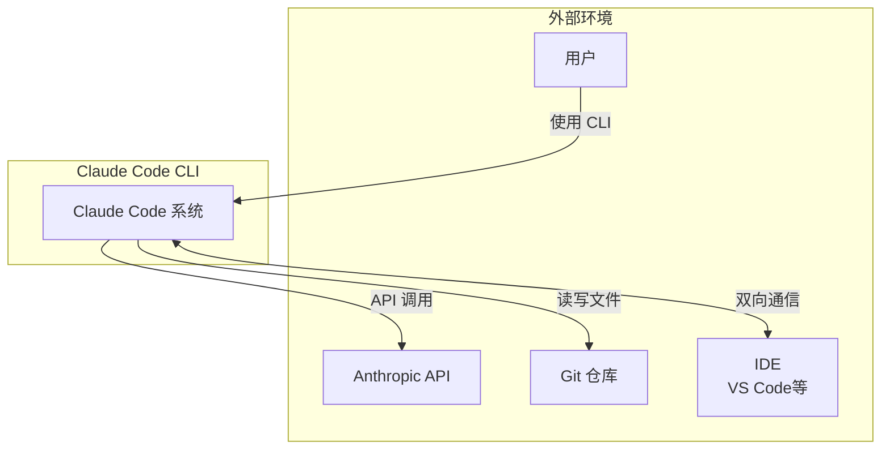
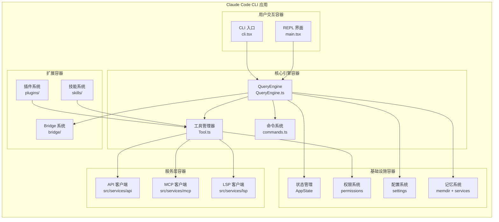
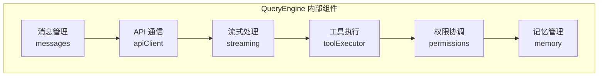
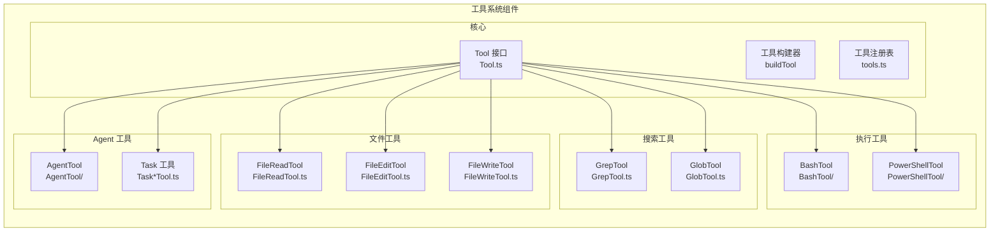
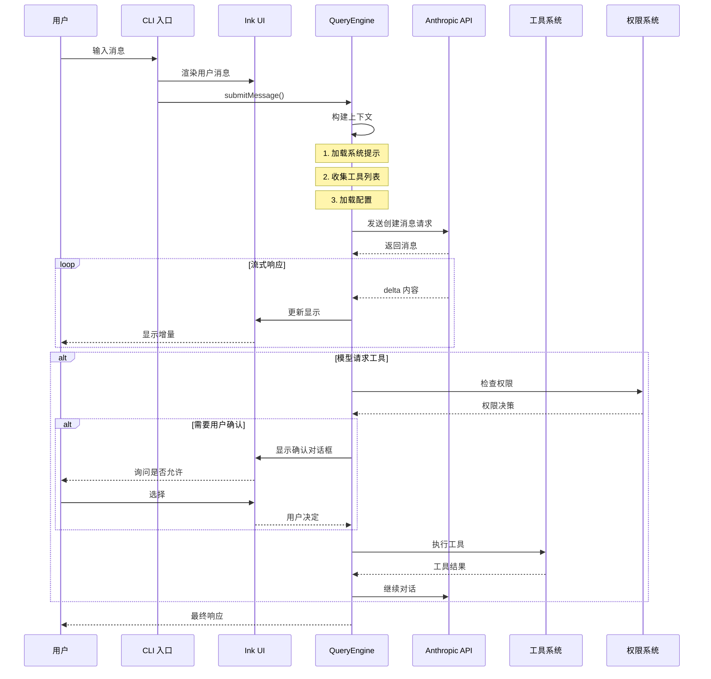
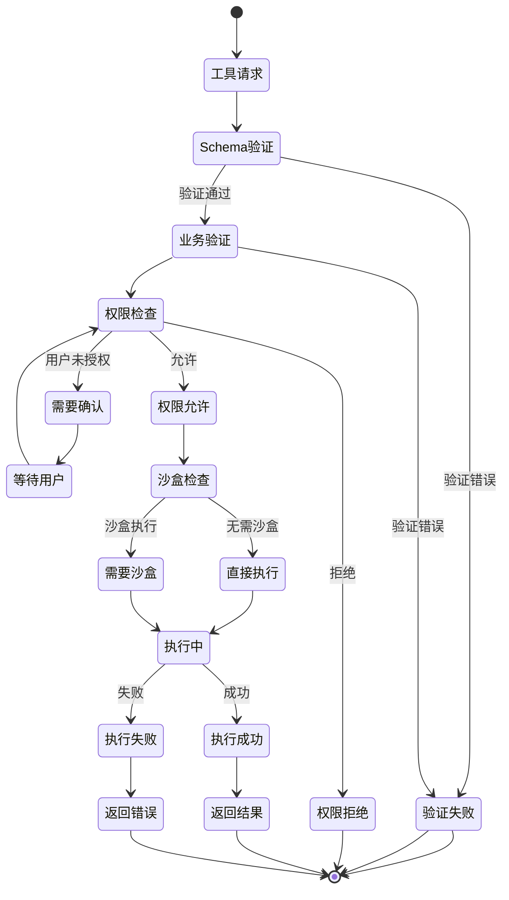
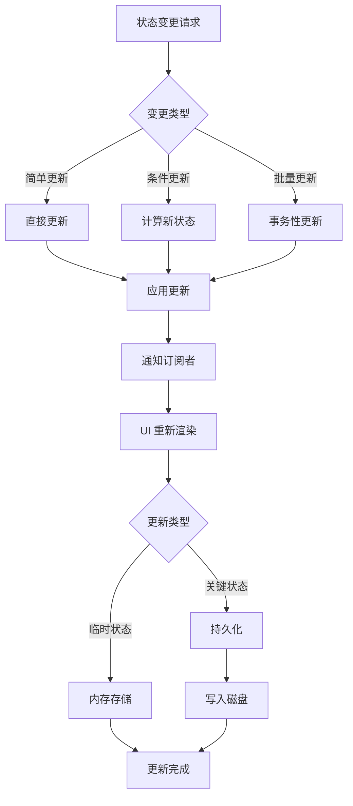
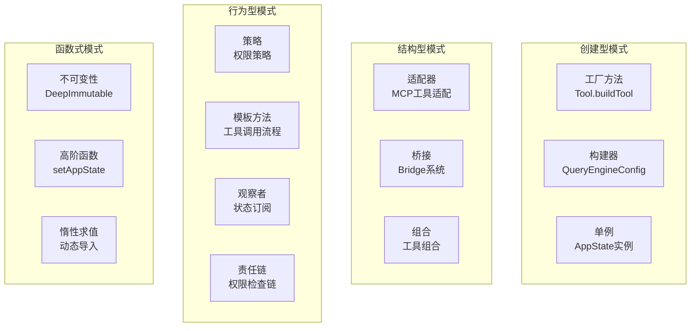
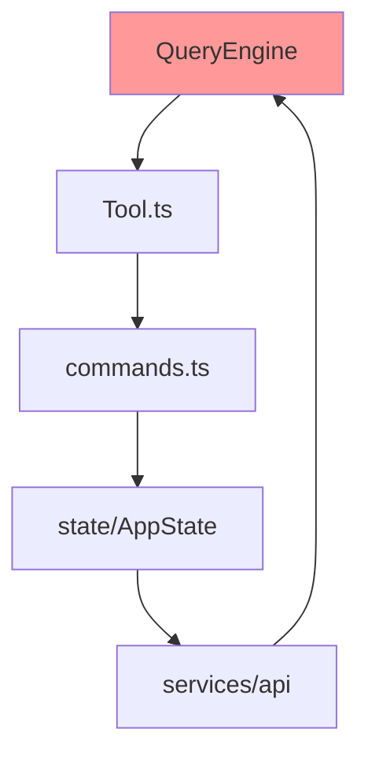

# 第 3 章：架构设计总览

> 本章目标：全面理解 Claude Code 的系统架构，掌握 C4 模型、设计模式应用、数据流追踪和设计理念分析。

## 3.1 C4 模型：从系统到代码

### 3.1.1 C4 模型简介

C4 模型是一种简洁的架构图方法，通过四个层次描述软件系统：
1. **Context**：系统上下文
2. **Containers**：容器级别
3. **Components**：组件级别
4. **Code**：代码级别

### 3.1.2 Level 1: System Context（系统上下文）



**系统上下文描述：**

Claude Code 是一个 AI 驱动的命令行开发工具，与以下外部实体交互：
- **用户**：开发者通过 CLI 与 AI 交互
- **Anthropic API**：Claude AI 能力来源
- **Git 仓库**：代码版本控制
- **IDE**：通过 Bridge 系统与 IDE 集成

### 3.1.3 Level 2: Containers（容器视图）



**容器描述：**

| 容器 | 技术实现 | 职责 |
|------|----------|------|
| CLI 入口 | `cli.tsx` | 命令行参数解析、快速路径 |
| REPL 界面 | `main.tsx` | Ink UI 渲染、用户输入处理 |
| QueryEngine | `QueryEngine.ts` | AI 对话管理、工具协调 |
| 工具管理器 | `Tool.ts` | 工具接口定义、注册表 |
| 命令系统 | `commands.ts` | 斜杠命令注册、分发 |
| API 客户端 | `services/api/` | Anthropic API 通信 |
| MCP 客户端 | `services/mcp/` | MCP 协议实现 |
| LSP 客户端 | `services/lsp/` | 语言服务器协议 |
| 状态管理 | `state/` | 应用状态管理 |
| 权限系统 | `utils/permissions/` | 权限检查、规则引擎 |
| 配置系统 | `utils/settings/` | 配置加载、合并、验证 |
| 记忆系统 | `memdir/` + 服务 | 四层记忆架构 |
| Bridge 系统 | `bridge/` | IDE 集成 |
| 插件系统 | - | 用户扩展 |
| 技能系统 | `skills/` | 可复用工作流 |

### 3.1.4 Level 3: Components（组件视图）

**QueryEngine 组件分解：**



**工具系统组件分解：**



### 3.1.5 Level 4: Code（代码结构）

**关键文件的代码组织：**

```
src/
├── QueryEngine.ts          # 46,000 行 - 核心 LLM 引擎
├── Tool.ts                 # 29,000 行 - 工具类型系统
├── commands.ts             # 25,000 行 - 命令注册表
├── main.tsx                # ~500 行 - 应用入口
├── entrypoints/
│   └── cli.tsx            # CLI 入口
├── tools/                  # 40+ 工具
│   ├── BashTool/
│   ├── FileReadTool/
│   ├── GrepTool/
│   └── ...
├── services/               # 外部服务
├── state/                  # 状态管理
└── utils/                  # 工具函数
```

## 3.2 数据流完整追踪

### 3.2.1 用户消息处理流程



### 3.2.2 工具执行详细流程



### 3.2.3 状态更新流程



## 3.3 设计模式全景分析

### 3.3.1 设计模式应用热力图



### 3.3.2 SOLID 原则应用实例

**单一职责原则（SRP）：**

| 类/模块 | 职责 | 不负责的事 |
|---------|------|-------------|
| `QueryEngine` | 管理对话生命周期 | UI 渲染、工具实现 |
| `Tool.ts` | 定义工具抽象 | 具体工具实现 |
| `BashTool` | Bash 命令执行 | Git 操作（有专门的工具） |
| `GrepTool` | 文件内容搜索 | 文件读写 |

```typescript
// 良好的 SRP 示例：权限检查分离
class PermissionChecker {
  async check(tool: Tool, input: unknown): Promise<PermissionDecision> {
    // 只负责权限检查
  }
}

class ToolExecutor {
  async execute(tool: Tool, input: unknown) {
    // 只负责工具执行
    const result = await tool.call(input)
    return result
  }
}

class ToolOrchestrator {
  private checker: PermissionChecker
  private executor: ToolExecutor

  async runTool(tool: Tool, input: unknown) {
    // 组合使用
    const decision = await this.checker.check(tool, input)
    if (!decision.allowed) {
      throw new PermissionDeniedError()
    }
    return await this.executor.execute(tool, input)
  }
}
```

**开闭原则（OCP）：**

```typescript
// 工具系统通过接口开放扩展，通过 buildTool 封闭修改
export const MyTool = buildTool({
  name: 'my-tool',
  get inputSchema() {
    return z.object({ /* ... */ })
  },
  async call(input, context) {
    // 实现细节
  },
})

// 新增工具无需修改核心代码
// 工具注册自动发现新工具
```

**依赖倒置原则（DIP）：**

```typescript
// 高层模块不依赖低层模块，都依赖于抽象
interface APIClient {
  createMessage(params): Promise<Message>
  streamMessage(params): AsyncGenerator<Message>
}

class AnthropicAPIClient implements APIClient {
  // 具体实现
  async createMessage(params) { /* ... */ }
  async *streamMessage(params) { /* ... */ }
}

class QueryEngine {
  constructor(private api: APIClient) {
    // 依赖抽象接口
  }
}
```

### 3.3.3 关键设计模式深度解析

**模式 1：依赖注入容器**

```typescript
// QueryEngine 配置即依赖注入
export type QueryEngineConfig = {
  cwd: string
  tools: Tools
  commands: Command[]
  mcpClients: MCPServerConnection[]
  agents: AgentDefinition[]
  canUseTool: CanUseToolFn
  getAppState: () => AppState
  setAppState: (f: (prev: AppState) => AppState) => void
  getFileReadCache: () => FileStateCache
  abortController: AbortController
}

// 所有依赖通过构造函数注入
class QueryEngine {
  constructor(private config: QueryEngineConfig) {
    this.mutableMessages = config.initialMessages ?? []
    this.abortController = config.abortController ?? createAbortController()
    this.readFileState = config.readFileCache
    // ...
  }
}
```

**设计意图：**
1. **可测试性**：所有依赖都可以被 mock
2. **灵活性**：可以替换任何依赖的实现
3. **解耦合**：模块间通过接口通信

**模式 2：状态机模式**

```typescript
// 会话状态机
type SessionState =
  | { status: 'idle' }
  | { status: 'thinking' }
  | { status: 'awaiting_tool', toolUseId: string }
  | { status: 'streaming', delta: string }
  | { status: 'completed' }

function transition(state: SessionState, event: SessionEvent): SessionState {
  switch (state.status) {
    case 'idle':
      if (event.type === 'user_message') {
        return { status: 'thinking' }
      }
      break
    case 'thinking':
      if (event.type === 'start_streaming') {
        return { status: 'streaming' }
      }
      if (event.type === 'tool_use_requested') {
        return { status: 'awaiting_tool', toolUseId: event.toolUseId }
      }
      break
    case 'awaiting_tool':
      if (event.type === 'tool_completed') {
        return { status: 'thinking' }
      }
      break
    case 'streaming':
      if (event.type === 'end_stream') {
        return { status: 'completed' }
      }
      break
    case 'completed':
      if (event.type === 'user_message') {
        return { status: 'thinking' }
      }
      break
  }
  return state
}
```

**模式 3：责任链模式**

```typescript
// 权限检查责任链
interface PermissionNode {
  check(tool: Tool, input: unknown): Promise<PermissionDecision>
  setNext(node: PermissionNode): void
}

class DenyRuleNode implements PermissionNode {
  private next: PermissionNode | null = null

  constructor(private rules: DenyRule[]) {}

  async check(tool: Tool, input: unknown): Promise<PermissionDecision> {
    // 1. 检查拒绝规则
    for (const rule of this.rules) {
      if (this.matches(rule, tool, input)) {
        return { decision: 'deny', reason: rule.reason }
      }
    }

    // 2. 传递到下一个节点
    if (this.next) {
      return await this.next.check(tool, input)
    }

    return { decision: 'allow' }
  }

  setNext(node: PermissionNode) {
    this.next = node
  }

  private matches(rule: DenyRule, tool: Tool, input: unknown): boolean {
    // 匹配逻辑
    return false
  }
}

// 构建责任链
const chain = new DenyRuleNode(denyRules)
chain.setNext(new AllowRuleNode(allowRules))
chain.setNext(new AskRuleNode())
```

## 3.4 作者评价：架构优缺点分析

### 3.4.1 架构优势

1. **清晰的分层**：六层架构（用户交互、表示、核心引擎、服务、基础设施、扩展）
2. **工具优先设计**：高度可扩展的工具系统
3. **类型安全**：TypeScript 严格模式全覆盖
4. **函数式状态管理**：不可变状态、可追溯变更
5. **插件化扩展**：MCP 协议、技能系统

### 3.4.2 架构问题

**问题 1：单文件过大**

```
QueryEngine.ts: 46,000 行
```

**影响：**
- IDE 性能下降
- 代码导航困难
- 合并冲突风险
- 测试覆盖难度

**建议重构：**

```typescript
// 拆分建议
src/queryEngine/
├── QueryEngine.ts          # 主类 (~2000 行)
├── MessageManager.ts        # 消息管理 (~5000 行)
├── APIClient.ts             # API 通信 (~4000 行)
├── ToolExecutor.ts          # 工具执行 (~6000 行)
├── StreamingManager.ts      # 流式处理 (~3000 行)
├── PermissionManager.ts     # 权限管理 (~4000 行)
├── MemoryManager.ts          # 记忆管理 (~3000 行)
└── types.ts                 # 类型定义 (~2000 行)
```

**问题 2：循环依赖风险**



**缓解措施：**
1. 使用依赖注入打破循环
2. 延迟加载（动态 import）
3. 事件驱动解耦

### 3.4.3 架构评分

| 维度 | 评分 | 说明 |
|------|------|------|
| **可扩展性** | 9/10 | 工具和插件系统优秀 |
| **可维护性** | 5/10 | 单文件过大影响 |
| **可测试性** | 7/10 | 依赖注入良好，但复杂度高 |
| **性能** | 8/10 | Bun 选择正确，有优化空间 |
| **安全性** | 7/10 | 多层防护，权限系统完善 |
| **代码组织** | 6/10 | 模块化良好，但单文件问题 |
| **文档** | 4/10 | 注释详细，缺少高层文档 |

## 本章小结

本章全面介绍了 Claude Code 的架构设计：
1. **C4 模型**：从系统上下文到代码结构
2. **数据流**：消息处理、工具执行、状态更新
3. **设计模式**：应用热力图、SOLID 原则、关键模式
4. **作者评价**：优势与问题分析、重构建议

## 下一章预告

第 4 章将深入分析 CLI 入口与启动流程。
