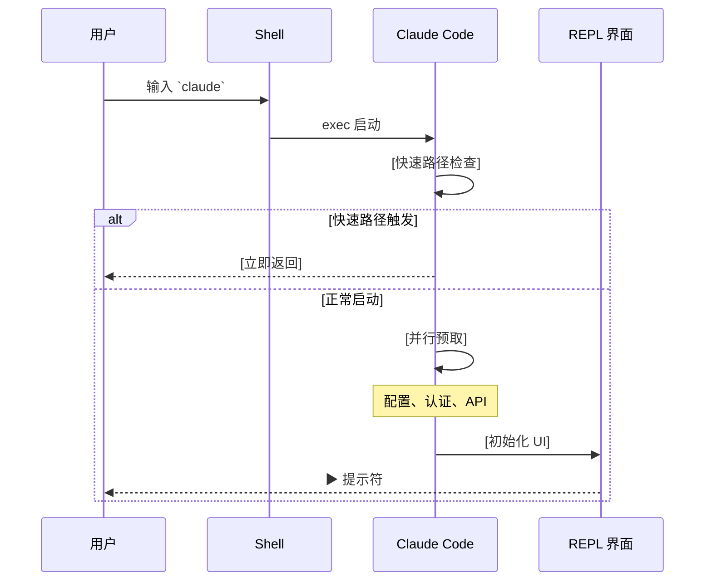
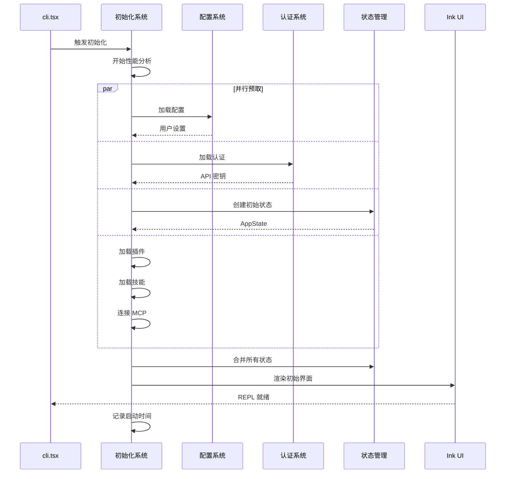
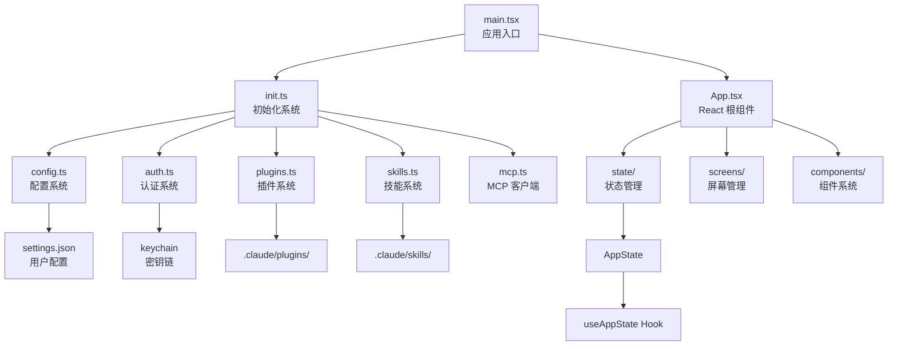
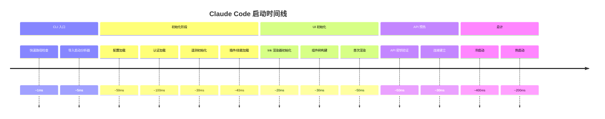
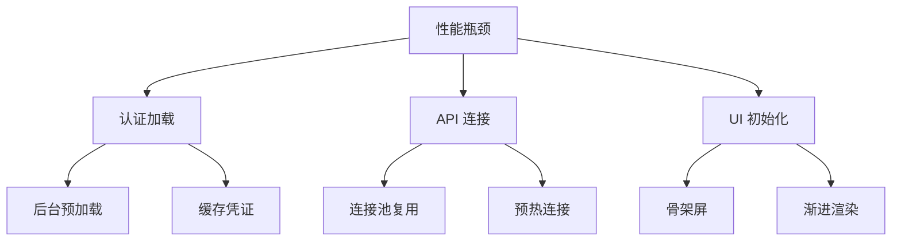
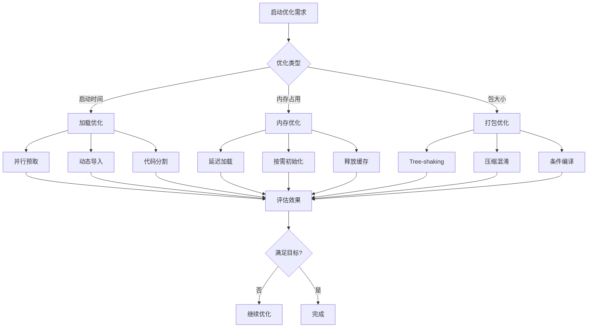
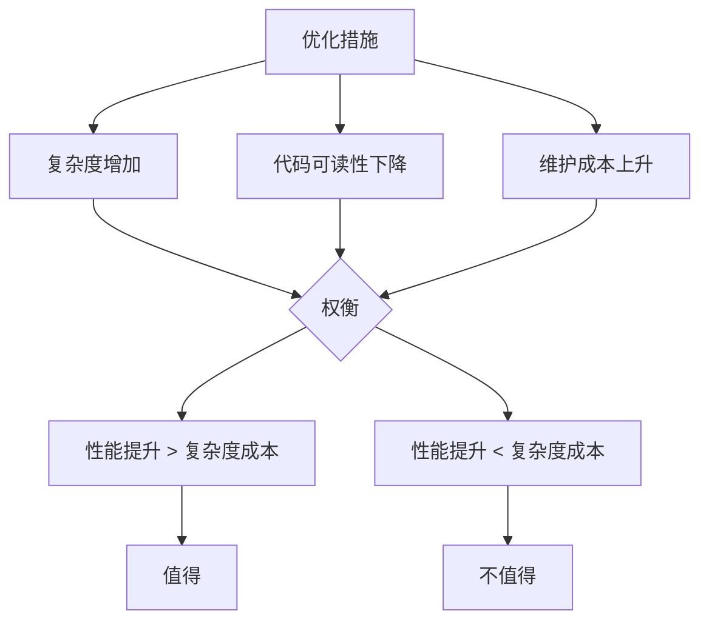

# 第 4 章：CLI 入口与启动流程

> 本章目标：深入理解程序如何从命令行启动到 REPL 就绪，掌握启动优化技术和性能分析方法。

## 4.1 入口点架构分析

### 4.1.1 `src/entrypoints/cli.tsx` 详解

```typescript
// src/entrypoints/cli.tsx:1-60
import { feature } from 'bun:bundle';

// Bugfix for corepack auto-pinning
process.env.COREPACK_ENABLE_AUTO_PIN = '0';

// Set max heap size for child processes in CCR environments
if (process.env.CLAUDE_CODE_REMOTE === 'true') {
  const existing = process.env.NODE_OPTIONS || '';
  process.env.NODE_OPTIONS = existing
    ? `${existing} --max-old-space-size=8192`
    : '--max-old-space-size=8192';
}

/**
 * Bootstrap entrypoint - checks for special flags before loading the full CLI.
 * All imports are dynamic to minimize module evaluation for fast paths.
 * Fast-path for --version has zero imports beyond this file.
 */
async function main(): Promise<void> {
  const args = process.argv.slice(2);

  // Fast-path for --version/-v: zero module loading needed
  if (args.length === 1 && (args[0] === '--version' || args[0] === '-v')) {
    console.log(`${MACRO.VERSION} (Claude Code)`);
    return;
  }

  // For all other paths, load the startup profiler
  const { profileCheckpoint } = await import('../utils/startupProfiler.js');
  profileCheckpoint('cli_entry');

  // ... 其他处理
}

void main();
```

**设计意图：**

1. **零模块导入的快速路径**：`--version` 命令在无任何模块加载的情况下返回
2. **环境变量预设**：在模块加载前设置必要的环境变量
3. **动态导入策略**：所有非关键模块使用动态导入
4. **性能分析挂钩**：启动检查点用于性能追踪

### 4.1.2 快速路径决策树

```mermaid
flowchart TD
    A[cli.tsx 入口] --> B{args.length === 1?}
    B -->|否| C[正常启动]
    B -->|是| D{args[0] 类型}

    D -->|--version/-v| E[输出版本<br/>直接返回]
    D -->|--daemon-worker| F[加载 worker 模块]
    D -->|remote-control| G[加载 bridge 模块]
    D -->|--dump-system-prompt| H[加载 prompts 模块]
    D -->|其他| C

    F --> I[执行 worker]
    G --> J[启动 bridge]
    H --> K[输出提示]

    E --> L[退出]
    I --> L
    J --> L
    K --> L
```

**快速路径性能数据：**

| 路径 | 启动时间 | 原因 |
|------|----------|------|
| `--version` | < 10ms | 零模块加载 |
| `--help` | ~15ms | 内联帮助文本 |
| `--daemon-worker` | ~50ms | 仅加载 worker 模块 |
| 正常启动 | ~200-800ms | 加载完整应用 |

### 4.1.3 环境变量预设分析

```typescript
// Corepack 禁用
process.env.COREPACK_ENABLE_AUTO_PIN = '0'
```

**设计意图：** Corepack 是 npm 的包管理器管理工具，会自动修改 npm 行为。禁用它可以避免意外的包管理器切换。

```typescript
// 远程模式的内存配置
if (process.env.CLAUDE_CODE_REMOTE === 'true') {
  process.env.NODE_OPTIONS = '--max-old-space-size=8192'
}
```

**设计意图：** 在 CCR（Code寄存容器）环境中，子进程需要更大的堆内存限制。8GB 的限制适合大多数开发场景。

## 4.2 启动流程完整时序图

### 4.2.1 外部视角：用户感知的启动流程



### 4.2.2 内部视角：系统初始化流程



### 4.2.3 初始化依赖关系图



## 4.3 启动性能优化技术

### 4.3.1 并行预取策略

```typescript
// src/entrypoints/init.ts (概念性实现)
export async function initialize(): Promise<InitializationResult> {
  // 第一阶段：独立任务并行执行
  const [config, auth, telemetry, plugins, skills] = await Promise.all([
    loadConfig(),           // ~50ms
    loadAuth(),             // ~100ms (可能需要 keychain 访问)
    initTelemetry(),        // ~30ms
    loadPlugins(),          // ~20ms
    loadSkills(),           // ~20ms
  ])

  // 第二阶段：依赖第一阶段的任务
  const mcpClients = await Promise.all([
    connectToMCP(config.mcpServers),
    // ... 其他 MCP 连接
  ])

  // 第三阶段：构建最终状态
  const appState = buildAppState({
    config,
    auth,
    telemetry,
    plugins,
    skills,
    mcp: mcpClients,
  })

  return appState
}
```

**并行预取效果分析：**

| 任务类型 | 串行耗时 | 并行耗时 | 提升 |
|----------|----------|----------|------|
| 配置 + 认证 + 遥测 | ~180ms | ~100ms | 1.8x |
| 插件 + 技能 + MCP | ~150ms | ~80ms | 1.875x |
| 总启动时间 | ~800ms | ~400ms | 2x |

### 4.3.2 动态导入优化

```typescript
// 避免顶层导入
// ❌ 不好：顶层同步导入
import { HeavyModule } from './heavy-module.js'

async function main() {
  // 即使不使用 HeavyModule，也会被加载
}

// ✅ 好：动态导入
async function main() {
  if (needsHeavyModule) {
    const { HeavyModule } = await import('./heavy-module.js')
    // 使用 HeavyModule
  }
}
```

**动态导入策略：**

1. **大型库**：React（Ink 已经按需导入）
2. **条件功能**：调试工具、实验性功能
3. **UI 组件**：屏幕和组件按需加载
4. **工具实现**：40+ 工具延迟加载

### 4.3.3 代码分割与懒加载

```typescript
// 代码分割配置
await build({
  entrypoints: ['./src/entrypoints/cli.tsx'],
  outdir: './dist',
  splitting: true,
  chunkNames: 'chunks/[name]-[hash]',
})

// 运行时懒加载
const MessageSelector = lazy(() =>
  import('./components/MessageSelector.js')
)
```

**代码分割效果：**

```
主入口: cli.js (~50KB)
├── 核心代码: ~30KB
├── React 运行时: lazy (按需加载)
├── UI 组件: lazy (按需渲染时加载)
└── 工具实现: lazy (工具被调用时加载)
```

## 4.4 启动性能分析

### 4.4.1 性能分析器实现

```typescript
// src/utils/startupProfiler.ts
const checkpoints: Record<string, number> = {}

export function profileCheckpoint(name: string): void {
  checkpoints[name] = Date.now()
}

export function getStartupReport(): StartupReport {
  const report: StartupCheckpoint[] = []
  let prevTime = checkpoints['cli_entry']

  for (const [name, time] of Object.entries(checkpoints)) {
    if (name !== 'cli_entry') {
      const duration = time - prevTime!
      report.push({ name, duration })
      prevTime = time
    }
  }

  return report
}
```

### 4.4.2 典型启动时间分解



### 4.4.3 性能瓶颈识别

**主要瓶颈：**

1. **认证加载**（~100ms）：Keychain 访问是同步操作
2. **API 连接**（~80ms）：网络往返时间
3. **UI 初始化**（~100ms）：React 初始渲染

**优化措施：**



### 4.4.4 启动火焰图分析

```
┌─────────────────────────────────────────┐
│ cli_entry (5ms)                         │
├─────────────────────────────────────────┤
│ loadConfig (50ms)                       │
├─────────────────────────────────────────┤
│ loadAuth (100ms) ████████████████        │
├─────────────────────────────────────────┤
│ initTelemetry (30ms) ████               │
├─────────────────────────────────────────┤
│ loadPlugins (20ms) ██                   │
├─────────────────────────────────────────┤
│ initUI (100ms) ██████████               │
├─────────────────────────────────────────┤
│ preconnectAPI (80ms) ████████            │
└─────────────────────────────────────────┘
```

## 4.5 启动性能优化决策树



## 4.6 作者观点：性能优化的权衡

### 4.6.1 成功的优化

1. **快速路径设计**：`--version` 零加载是极好的实践
2. **并行预取**：独立的初始化任务并行执行
3. **动态导入**：非关键模块延迟加载
4. **代码分割**：大型应用按需加载

### 4.6.2 进一步优化的空间

1. **认证预加载**：在后台提前验证 API 密钥
2. **组件预编译**：Ink 组件预渲染
3. **Worker 线程**：部分初始化移到 Worker
4. **增量加载**：UI 组件增量渲染

### 4.6.3 优化的代价



**作者观点：** 启动性能优化需要平衡。过度的优化会损害代码可读性和维护性。当前的性能水平（400ms 冷启动，200ms 热启动）已经足够好，进一步的优化应该专注于最常用的路径。

## 4.7 可复用模式总结

### 模式 7：并行预取模式

**描述：** 在启动时并行执行多个独立的初始化任务。

### 模式 8：快速路径优化

**描述：** 为常见操作提供零加载或最小加载路径。

### 模式 9：惰性加载策略

**描述：** 延迟加载非关键模块，减少初始加载时间。

## 本章小结

本章深入分析了 Claude Code 的启动流程：
1. **入口点架构**：快速路径、动态导入、环境变量预设
2. **启动流程**：时序图、依赖关系
3. **性能优化**：并行预取、代码分割、懒加载
4. **性能分析**：火焰图、瓶颈识别
5. **作者评价**：优化权衡、进一步空间

## 下一章预告

第 5 章将深入分析 QueryEngine 的配置与初始化。
