# 第 5 章：QueryEngine 核心（一）：配置与初始化

> 本章目标：深入理解 QueryEngine 的配置和初始化机制，掌握依赖注入模式在大型 LLM 应用中的应用。

## 5.1 QueryEngine 类设计

### 5.1.1 类架构概览

```typescript
// src/QueryEngine.ts:175-207
/**
 * QueryEngine owns the query lifecycle and session state for a conversation.
 * It extracts the core logic from ask() into a standalone class that can be
 * used by both the headless/SDK path and (in a future phase) the REPL.
 *
 * One QueryEngine per conversation. Each submitMessage() call starts a new
 * turn within the same conversation. State (messages, file cache, usage, etc.)
 * persists across turns.
 */
export class QueryEngine {
  private config: QueryEngineConfig
  private mutableMessages: Message[]
  private abortController: AbortController
  private permissionDenials: SDKPermissionDenial[]
  private totalUsage: NonNullableUsage
  private hasHandledOrphanedPermission = false
  private readFileState: FileStateCache
  private discoveredSkillNames = new Set<string>()
  private loadedNestedMemoryPaths = new Set<string>()

  constructor(config: QueryEngineConfig) {
    this.config = config
    this.mutableMessages = config.initialMessages ?? []
    this.abortController = config.abortController ?? createAbortController()
    this.permissionDenials = []
    this.readFileState = config.readFileCache
    this.totalUsage = EMPTY_USAGE
  }

  async *submitMessage(
    prompt: string | ContentBlockParam[],
    options?: { uuid?: string; isMeta?: boolean },
  ): AsyncGenerator<SDKMessage, void, unknown> {
    // 核心查询逻辑
  }
}
```

**设计意图：**

1. **会话隔离**：每个 QueryEngine 实例对应一个对话会话
   - 一个会话 = 一个 QueryEngine 实例
   - 消息历史在会话内保持
   - 不同会话完全隔离

2. **状态持久化**：状态在 `submitMessage` 调用间保持
   - `mutableMessages`：对话历史
   - `totalUsage`：Token 使用统计
   - `readFileState`：文件内容缓存

3. **依赖注入**：所有依赖通过构造函数传入
   - 便于测试
   - 灵活配置
   - 松耦合设计

4. **可测试性**：私有状态便于单元测试
   - 可以创建模拟配置
   - 可以验证内部状态

### 5.1.2 类职责边界

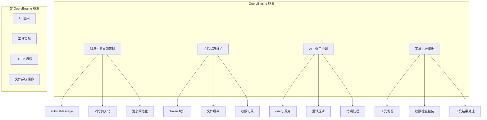

**单一职责原则应用：**

| 职责 | QueryEngine | 其他模块 |
|------|-------------|----------|
| 消息格式化 | ✓ | messages.ts |
| UI 渲染 | ✗ | Ink 组件 |
| 工具实现 | ✗ | tools/*.ts |
| HTTP 通信 | ✗ | api/client.ts |
| 权限检查 | 包装器实现 | permissions/ |

### 5.1.3 类图：QueryEngine 与协作模块

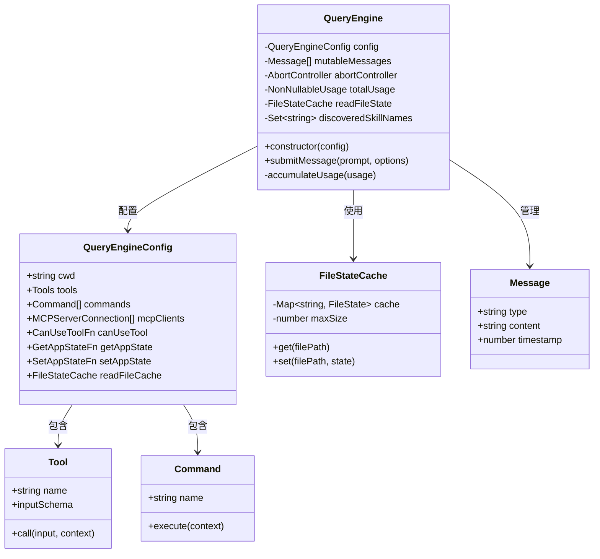

## 5.2 配置系统深度解析

### 5.2.1 QueryEngineConfig 类型定义

```typescript
// src/QueryEngine.ts:130-173
export type QueryEngineConfig = {
  // ===== 工作环境 =====
  cwd: string                                          // 工作目录

  // ===== 工具和命令 =====
  tools: Tools                                         // 可用工具列表
  commands: Command[]                                  // 可用命令列表
  mcpClients: MCPServerConnection[]                    // MCP 服务器连接
  agents: AgentDefinition[]                            // Agent 定义

  // ===== 权限和状态 =====
  canUseTool: CanUseToolFn                             // 权限检查函数
  getAppState: () => AppState                          // 获取应用状态
  setAppState: (f: (prev: AppState) => AppState) => void  // 更新应用状态

  // ===== 初始状态 =====
  initialMessages?: Message[]                          // 初始消息
  readFileCache: FileStateCache                        // 文件读取缓存

  // ===== 提示配置 =====
  customSystemPrompt?: string                          // 自定义系统提示
  appendSystemPrompt?: string                          // 追加系统提示

  // ===== 模型配置 =====
  userSpecifiedModel?: string                          // 用户指定的模型
  fallbackModel?: string                               // 回退模型
  thinkingConfig?: ThinkingConfig                      // Thinking 配置

  // ===== 限制配置 =====
  maxTurns?: number                                    // 最大轮数
  maxBudgetUsd?: number                                // 最大预算（美元）
  taskBudget?: { total: number }                       // 任务预算

  // ===== 其他配置 =====
  jsonSchema?: Record<string, unknown>                 // JSON Schema
  verbose?: boolean                                    // 详细输出
  replayUserMessages?: boolean                         // 重放用户消息
  handleElicitation?: ToolUseContext['handleElicitation']  // URL 请求处理
  includePartialMessages?: boolean                     // 包含部分消息
  setSDKStatus?: (status: SDKStatus) => void           // 设置 SDK 状态

  // ===== 控制和错误处理 =====
  abortController?: AbortController                    // 中止控制器
  orphanedPermission?: OrphanedPermission              // 孤立权限
  snipReplay?: (yieldedSystemMsg: Message, store: Message[]) =>
    { messages: Message[]; executed: boolean } | undefined  // Snip 重放
}
```

**配置分类：**

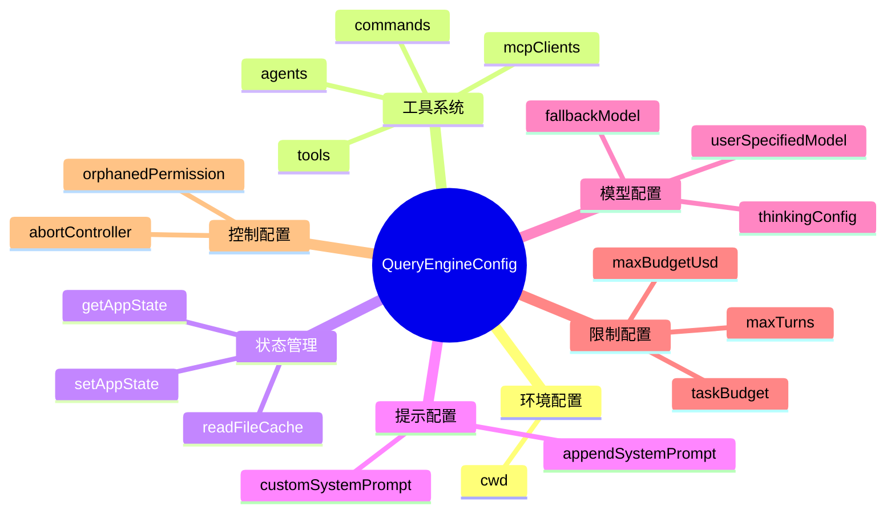

### 5.2.2 配置验证机制

```typescript
// 配置验证（概念性实现）
export function validateQueryEngineConfig(
  config: Partial<QueryEngineConfig>
): ValidationResult<QueryEngineConfig> {
  const errors: string[] = []

  // 必需字段检查
  if (!config.cwd) {
    errors.push('cwd is required')
  }
  if (!config.tools) {
    errors.push('tools is required')
  }
  if (!config.canUseTool) {
    errors.push('canUseTool is required')
  }
  if (!config.getAppState) {
    errors.push('getAppState is required')
  }
  if (!config.setAppState) {
    errors.push('setAppState is required')
  }
  if (!config.readFileCache) {
    errors.push('readFileCache is required')
  }

  if (errors.length > 0) {
    return {
      valid: false,
      errors,
    }
  }

  // 默认值应用
  return {
    valid: true,
    value: {
      cwd: config.cwd!,
      tools: config.tools!,
      commands: config.commands ?? [],
      mcpClients: config.mcpClients ?? [],
      agents: config.agents ?? [],
      canUseTool: config.canUseTool!,
      getAppState: config.getAppState!,
      setAppState: config.setAppState!,
      initialMessages: config.initialMessages ?? [],
      readFileCache: config.readFileCache!,
      customSystemPrompt: config.customSystemPrompt,
      appendSystemPrompt: config.appendSystemPrompt,
      userSpecifiedModel: config.userSpecifiedModel,
      fallbackModel: config.fallbackModel,
      thinkingConfig: config.thinkingConfig,
      maxTurns: config.maxTurns,
      maxBudgetUsd: config.maxBudgetUsd,
      taskBudget: config.taskBudget,
      jsonSchema: config.jsonSchema,
      verbose: config.verbose ?? false,
      replayUserMessages: config.replayUserMessages ?? false,
      handleElicitation: config.handleElicitation,
      includePartialMessages: config.includePartialMessages ?? false,
      setSDKStatus: config.setSDKStatus,
      abortController: config.abortController,
      orphanedPermission: config.orphanedPermission,
      snipReplay: config.snipReplay,
    },
  }
}
```

**验证流程图：**

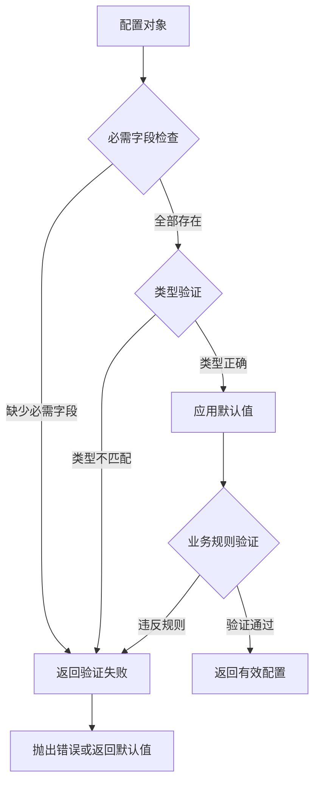

### 5.2.3 默认值策略

```typescript
// 默认值配置（概念性实现）
const DEFAULT_CONFIG: Partial<QueryEngineConfig> = {
  // 集合类型：空数组
  commands: [],
  mcpClients: [],
  agents: [],
  initialMessages: [],

  // 布尔类型：false
  verbose: false,
  replayUserMessages: false,
  includePartialMessages: false,

  // 可选类型：undefined
  customSystemPrompt: undefined,
  appendSystemPrompt: undefined,
  userSpecifiedModel: undefined,
  fallbackModel: undefined,
  thinkingConfig: undefined,
  maxTurns: undefined,
  maxBudgetUsd: undefined,
  taskBudget: undefined,
  jsonSchema: undefined,
  handleElicitation: undefined,
  setSDKStatus: undefined,
  abortController: undefined,
  orphanedPermission: undefined,
  snipReplay: undefined,
}

// 默认值应用策略
function applyDefaults(
  userConfig: Partial<QueryEngineConfig>
): QueryEngineConfig {
  return {
    ...DEFAULT_CONFIG,
    ...userConfig,

    // 确保必需字段存在（TypeScript 编译时保证）
    cwd: userConfig.cwd!,
    tools: userConfig.tools!,
    canUseTool: userConfig.canUseTool!,
    getAppState: userConfig.getAppState!,
    setAppState: userConfig.setAppState!,
    readFileCache: userConfig.readFileCache!,
  }
}
```

**默认值决策表：**

| 配置项 | 默认值 | 决策理由 |
|--------|--------|----------|
| `commands` | `[]` | 无命令时系统仍可运行 |
| `mcpClients` | `[]` | MCP 是可选扩展 |
| `agents` | `[]` | Agent 是可选功能 |
| `verbose` | `false` | 避免日志污染 |
| `replayUserMessages` | `false` | SDK 默认不重放 |
| `includePartialMessages` | `false` | 默认只返回完整消息 |
| `maxTurns` | `undefined` | 无限制（由 API 决定） |
| `maxBudgetUsd` | `undefined` | 无预算限制 |

## 5.3 初始化流程深度解析

### 5.3.1 初始化流程图

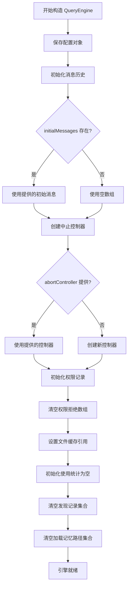

### 5.3.2 AbortController 设置

```typescript
// src/utils/abortController.ts
export function createAbortController(): AbortController {
  return new AbortController()
}

// 在 QueryEngine 中使用
constructor(config: QueryEngineConfig) {
  // ...
  // 使用提供的控制器或创建新的
  this.abortController = config.abortController ?? createAbortController()
}

// 取消操作
cancel(): void {
  this.abortController.abort()
}

// 检查是否已取消
isAborted(): boolean {
  return this.abortController.signal.aborted
}
```

**AbortController 使用场景：**

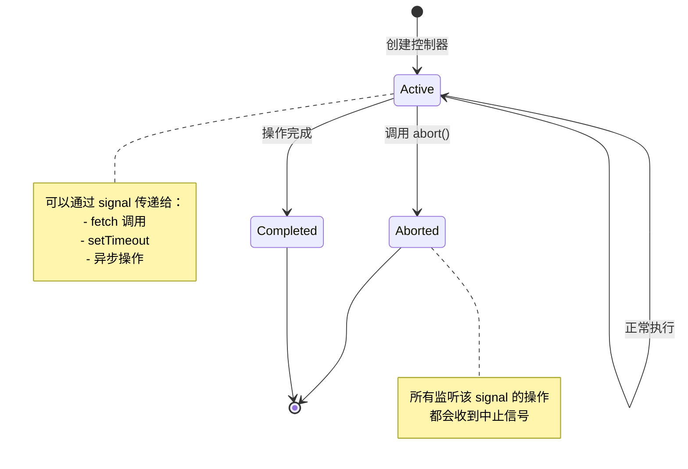

**设计意图：**
1. **允许外部控制中止**：调用者可以传入自己的 AbortController
2. **支持超时取消**：可以设置超时自动中止
3. **清理资源**：中止时可以清理正在进行的操作

### 5.3.3 FileStateCache 初始化

```typescript
// src/utils/fileStateCache.ts
export interface FileState {
  content: string
  mtime: number           // 修改时间
  size: number            // 文件大小
  hash?: string           // 内容哈希
}

export class FileStateCache {
  private cache: Map<string, FileState>
  private maxSize: number
  private accessOrder: string[]  // LRU 访问顺序

  constructor(maxSize = 1000) {
    this.cache = new Map()
    this.maxSize = maxSize
    this.accessOrder = []
  }

  get(filePath: string): FileState | undefined {
    const state = this.cache.get(filePath)
    if (state) {
      // 更新 LRU 顺序
      this.updateAccessOrder(filePath)
    }
    return state
  }

  set(filePath: string, state: FileState): void {
    // 如果是新文件且已满，执行 LRU 淘汰
    if (!this.cache.has(filePath) && this.cache.size >= this.maxSize) {
      const lruKey = this.accessOrder.shift()!
      this.cache.delete(lruKey)
    }

    this.cache.set(filePath, state)
    this.updateAccessOrder(filePath)
  }

  private updateAccessOrder(filePath: string): void {
    // 移除旧位置
    const index = this.accessOrder.indexOf(filePath)
    if (index !== -1) {
      this.accessOrder.splice(index, 1)
    }
    // 添加到末尾（最新访问）
    this.accessOrder.push(filePath)
  }

  clear(): void {
    this.cache.clear()
    this.accessOrder = []
  }

  size(): number {
    return this.cache.size
  }
}
```

**缓存策略分析：**

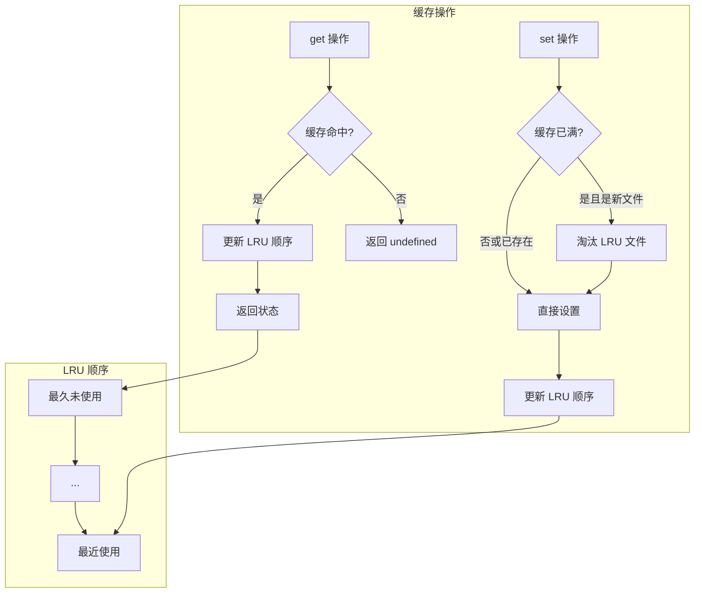

### 5.3.4 消息历史恢复

```typescript
// 从会话恢复（概念性实现）
constructor(config: QueryEngineConfig) {
  // ...

  // 优先级：initialMessages > 会话恢复 > 空数组
  this.mutableMessages = config.initialMessages ?? (() => {
    if (config.resumeFromSession) {
      // 从持久化存储恢复
      const saved = loadSession(config.resumeFromSession)
      return saved?.messages ?? []
    }
    return []
  })()
}

// 会话存储（概念性实现）
interface SessionStorage {
  save(sessionId: string, messages: Message[]): Promise<void>
  load(sessionId: string): Promise<{ messages: Message[] } | null>
  list(): Promise<SessionInfo[]>
}

// 文件系统实现
class FileSystemSessionStorage implements SessionStorage {
  constructor(private sessionsDir: string) {}

  async save(sessionId: string, messages: Message[]): Promise<void> {
    const filePath = path.join(this.sessionsDir, `${sessionId}.json`)
    const data = {
      id: sessionId,
      timestamp: Date.now(),
      messages,
    }
    await fs.writeFile(filePath, JSON.stringify(data, null, 2))
  }

  async load(sessionId: string): Promise<{ messages: Message[] } | null> {
    const filePath = path.join(this.sessionsDir, `${sessionId}.json`)
    try {
      const content = await fs.readFile(filePath, 'utf-8')
      return JSON.parse(content)
    } catch {
      return null
    }
  }

  async list(): Promise<SessionInfo[]> {
    const files = await fs.readdir(this.sessionsDir)
    const sessions: SessionInfo[] = []

    for (const file of files) {
      if (file.endsWith('.json')) {
        const filePath = path.join(this.sessionsDir, file)
        const content = JSON.parse(await fs.readFile(filePath, 'utf-8'))
        sessions.push({
          id: content.id,
          timestamp: content.timestamp,
          messageCount: content.messages.length,
        })
      }
    }

    return sessions.sort((a, b) => b.timestamp - a.timestamp)
  }
}
```

## 5.4 依赖注入模式深度解析

### 5.4.1 canUseTool 注入

```typescript
// 权限检查函数签名
export type CanUseToolFn = (
  tool: Tool,
  input: Record<string, unknown>,
  context: ToolUseContext,
  assistantMessage: AssistantMessage,
  toolUseID: string,
  forceDecision?: 'allow' | 'deny',
) => Promise<PermissionResult>

// PermissionResult 结果类型
export type PermissionResult =
  | { behavior: 'allow' }
  | { behavior: 'deny'; message: string }
  | { behavior: 'ask'; message: string; suggestedToolUseId?: string }

// 在 QueryEngine 中包装使用
async *submitMessage(
  prompt: string | ContentBlockParam[],
  options?: { uuid?: string; isMeta?: boolean },
): AsyncGenerator<SDKMessage, void, unknown> {
  // ...

  // 包装 canUseTool 以跟踪权限拒绝
  const wrappedCanUseTool: CanUseToolFn = async (
    tool,
    input,
    toolUseContext,
    assistantMessage,
    toolUseID,
    forceDecision,
  ) => {
    const result = await this.config.canUseTool(
      tool,
      input,
      toolUseContext,
      assistantMessage,
      toolUseID,
      forceDecision,
    )

    // 跟踪拒绝（用于 SDK 报告）
    if (result.behavior !== 'allow') {
      this.permissionDenials.push({
        tool_name: sdkCompatToolName(tool.name),
        tool_use_id: toolUseID,
        tool_input: input,
      })
    }

    return result
  }

  // 在 query 中使用 wrappedCanUseTool
  // ...
}
```

**包装器模式时序图：**

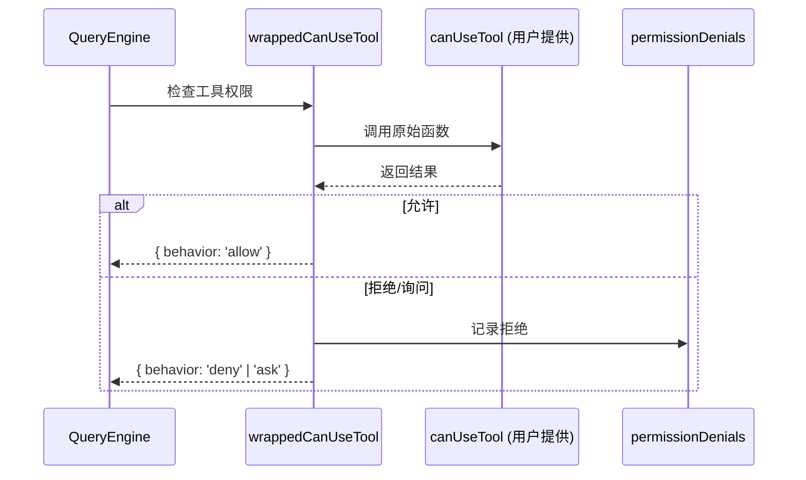

### 5.4.2 getAppState/setAppState 注入

```typescript
// 状态访问函数类型
export type GetAppStateFn = () => AppState
export type SetAppStateFn = (f: (prev: AppState) => AppState) => void

// AppState 简化定义
export type AppState = {
  statusLineText?: string
  toolPermissionContext: ToolPermissionContext
  fileHistory: FileHistoryState
  attribution: AttributionState
  // ... 其他状态
}

// 在 QueryEngine 中使用
const currentAppState = this.config.getAppState()

// 更新状态
this.config.setAppState(prev => ({
  ...prev,
  statusLineText: 'Processing...',
}))
```

**不可变状态更新模式：**

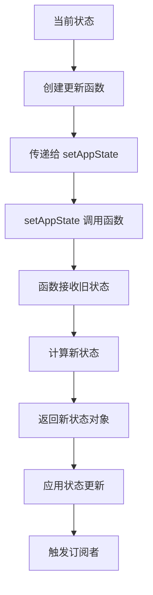

### 5.4.3 工具和命令注册

```typescript
// 工具类型定义
export type Tools = readonly Tool[]

// 通过配置注入
const config: QueryEngineConfig = {
  // ...
  tools: [
    new FileReadTool(),
    new FileWriteTool(),
    new FileEditTool(),
    new BashTool(),
    new GrepTool(),
    new GlobTool(),
    // ... 40+ 工具
  ],
  commands: [
    new CommitCommand(),
    new ReviewCommand(),
    new CompactCommand(),
    new ModelCommand(),
    // ... 50+ 命令
  ],
}

// 工具发现和注册（概念性实现）
class ToolRegistry {
  private tools: Map<string, Tool> = new Map()

  register(tool: Tool): void {
    if (this.tools.has(tool.name)) {
      throw new Error(`Tool ${tool.name} already registered`)
    }
    this.tools.set(tool.name, tool)
  }

  get(name: string): Tool | undefined {
    return this.tools.get(name)
  }

  getAll(): Tools {
    return Array.from(this.tools.values())
  }

  // 按模式查找工具
  find(pattern: string): Tool[] {
    const regex = new RegExp(pattern)
    return this.getAll().filter(tool => regex.test(tool.name))
  }
}

// 使用注册表
const registry = new ToolRegistry()
for (const tool of config.tools) {
  registry.register(tool)
}
```

## 5.5 代码示例深度解析

### 5.5.1 核心代码片段（带注释）

```typescript
// src/QueryEngine.ts:209-280 (关键部分)
async *submitMessage(
  prompt: string | ContentBlockParam[],
  options?: { uuid?: string; isMeta?: boolean },
): AsyncGenerator<SDKMessage, void, unknown> {
  // ===== 阶段 1：配置解构 =====
  const {
    cwd,
    commands,
    tools,
    mcpClients,
    verbose = false,
    thinkingConfig,
    maxTurns,
    maxBudgetUsd,
    taskBudget,
    canUseTool,
    customSystemPrompt,
    appendSystemPrompt,
    userSpecifiedModel,
    fallbackModel,
    jsonSchema,
    getAppState,
    setAppState,
    replayUserMessages = false,
    includePartialMessages = false,
    agents = [],
    setSDKStatus,
    orphanedPermission,
  } = this.config

  // ===== 阶段 2：轮次级别初始化 =====
  // 清空轮次级别的跟踪集合
  this.discoveredSkillNames.clear()
  setCwd(cwd)

  // 持久化会话标志
  const persistSession = !isSessionPersistenceDisabled()
  const startTime = Date.now()

  // ===== 阶段 3：包装 canUseTool =====
  const wrappedCanUseTool: CanUseToolFn = async (
    tool,
    input,
    toolUseContext,
    assistantMessage,
    toolUseID,
    forceDecision,
  ) => {
    const result = await canUseTool(
      tool,
      input,
      toolUseContext,
      assistantMessage,
      toolUseID,
      forceDecision,
    )

    // 跟踪 SDK 报告的拒绝
    if (result.behavior !== 'allow') {
      this.permissionDenials.push({
        tool_name: sdkCompatToolName(tool.name),
        tool_use_id: toolUseID,
        tool_input: input,
      })
    }

    return result
  }

  // ===== 阶段 4：获取初始状态 =====
  const initialAppState = getAppState()
  const initialMainLoopModel = userSpecifiedModel
    ? parseUserSpecifiedModel(userSpecifiedModel)
    : getMainLoopModel()

  const initialThinkingConfig: ThinkingConfig = thinkingConfig
    ? thinkingConfig
    : shouldEnableThinkingByDefault() !== false
      ? { type: 'adaptive' }
      : { type: 'disabled' }

  // ===== 阶段 5：获取系统提示 =====
  headlessProfilerCheckpoint('before_getSystemPrompt')
  const customPrompt =
    typeof customSystemPrompt === 'string' ? customSystemPrompt : undefined
  const {
    defaultSystemPrompt,
    userContext: baseUserContext,
    systemContext,
  } = await fetchSystemPromptParts({
    tools,
    mainLoopModel: initialMainLoopModel,
    additionalWorkingDirectories: Array.from(
      initialAppState.toolPermissionContext.additionalWorkingDirectories.keys(),
    ),
    mcpClients,
    customSystemPrompt: customPrompt,
  })
  headlessProfilerCheckpoint('after_getSystemPrompt')

  // ===== 阶段 6：构建完整系统提示 =====
  const systemPrompt = asSystemPrompt([
    ...(customPrompt !== undefined ? [customPrompt] : defaultSystemPrompt),
    ...(appendSystemPrompt ? [appendSystemPrompt] : []),
  ])

  // ... 继续处理用户输入和查询
}
```

**设计意图说明：**

1. **异步生成器**：逐步生成消息，支持流式响应
   ```typescript
   async *submitMessage(): AsyncGenerator<SDKMessage, void, unknown>
   ```
   - 流式输出：逐步生成消息
   - 可取消：生成器可以被中断
   - 内存效率：不需要在内存中保存所有消息

2. **配置解构**：便于访问配置项
   ```typescript
   const { cwd, commands, tools, ... } = this.config
   ```
   - 清晰的依赖声明
   - 便于调试
   - 支持默认值

3. **包装函数**：添加额外行为
   ```typescript
   const wrappedCanUseTool: CanUseToolFn = async (...) => {
     const result = await canUseTool(...)
     if (result.behavior !== 'allow') {
       this.permissionDenials.push(...)
     }
     return result
   }
   ```
   - 不修改原始函数
   - 添加跟踪逻辑
   - 保持单一职责

4. **状态快照**：捕获初始状态
   ```typescript
   const initialAppState = getAppState()
   const initialMainLoopModel = userSpecifiedModel
     ? parseUserSpecifiedModel(userSpecifiedModel)
     : getMainLoopModel()
   ```
   - 避免中间变更影响
   - 一致的会话状态

### 5.5.2 关键决策点解释

**决策 1：为什么使用 AsyncGenerator？**

```typescript
async *submitMessage(): AsyncGenerator<SDKMessage, void, unknown>
```

| 选项 | 优点 | 缺点 |
|------|------|------|
| **AsyncGenerator** (采用) | 流式输出、可取消、内存效率 | 稍微复杂 |
| Promise<Message[]> | 简单 | 必须等待全部完成、无法流式 |
| Callback | 兼容性好 | 回调地狱、难以取消 |

**决策 2：为什么包装 canUseTool？**

```typescript
const wrappedCanUseTool: CanUseToolFn = async (...) => {
  const result = await canUseTool(...)
  if (result.behavior !== 'allow') {
    this.permissionDenials.push(...)
  }
  return result
}
```

- **添加跟踪逻辑**：记录拒绝的权限
- **不修改原始函数**：保持原始函数纯洁性
- **单一职责**：权限检查 vs 跟踪

**决策 3：为什么清空 discoveredSkillNames？**

```typescript
this.discoveredSkillNames.clear()
```

- **防止跨轮次累积**：避免内存泄漏
- **每轮重新发现**：确保技能发现准确
- **轮次隔离**：每个 submitMessage 调用是独立的

**决策 4：为什么使用解构赋值？**

```typescript
const { cwd, commands, tools, ... } = this.config
```

- **清晰的依赖声明**：一眼看出使用了哪些配置
- **便于调试**：可以在解构时打印
- **支持默认值**：`verbose = false`

## 5.6 作者观点：配置系统的设计权衡

### 5.6.1 优点

1. **类型安全**：TypeScript 类型定义确保配置正确性
2. **可测试性**：所有依赖都可以被 mock
3. **灵活性**：可以通过配置控制行为
4. **可扩展性**：新增配置项不影响现有代码

### 5.6.2 缺点

1. **配置对象过大**：20+ 配置项，难以记忆
2. **可选参数多**：需要大量 `??` 和默认值处理
3. **类型复杂**：`QueryEngineConfig` 类型定义复杂

### 5.6.3 改进建议

1. **配置分组**：将相关配置项分组
   ```typescript
   type QueryEngineConfig = {
     env: EnvironmentConfig
     tools: ToolsConfig
     state: StateConfig
     prompts: PromptsConfig
     limits: LimitsConfig
   }
   ```

2. **构建器模式**：使用构建器创建配置
   ```typescript
   const config = new QueryEngineConfigBuilder()
     .withCwd(process.cwd())
     .withTools(tools)
     .withCommands(commands)
     .build()
   ```

3. **配置验证**：运行时验证配置
   ```typescript
   const result = validateQueryEngineConfig(config)
   if (!result.valid) {
     throw new ConfigError(result.errors)
   }
   ```

## 5.7 性能考虑

### 5.7.1 初始化性能分析

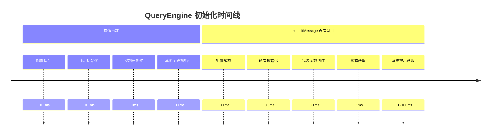

### 5.7.2 内存占用分析

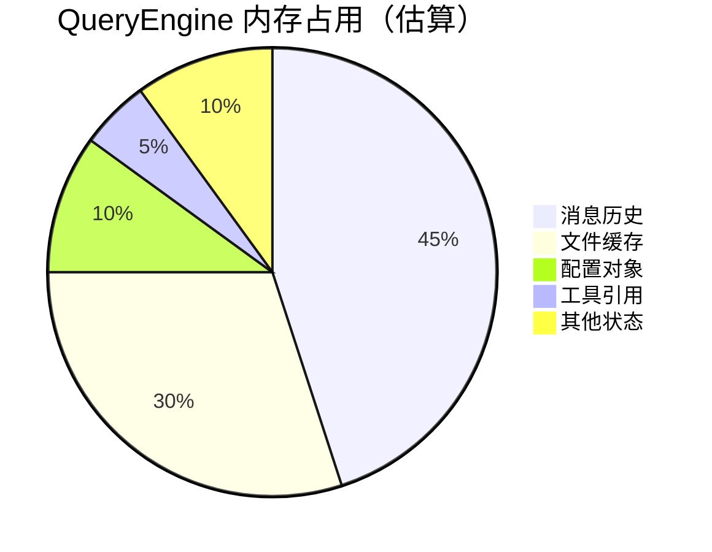

## 5.8 可复用模式总结

### 模式 10：配置对象模式

**描述：** 使用单一配置对象传递所有依赖，而非多个参数。

**适用场景：**
- 构造函数参数多
- 参数可能扩展
- 需要参数验证

**代码模板：**

```typescript
// 定义配置类型
type Config = {
  required: string
  optional?: number
  callback: () => void
}

// 使用默认值
const defaultConfig: Partial<Config> = {
  optional: 42,
}

// 验证和合并
function useConfig(config: Config) {
  // 验证必需字段
  if (!config.required) {
    throw new Error('required is missing')
  }

  // 应用默认值
  const final = { ...defaultConfig, ...config }
  return final
}
```

**关键点：**
1. 集中定义配置类型
2. 使用 Partial<T> 定义默认值
3. 验证必需字段
4. 清晰的参数来源

### 模式 11：依赖注入容器

**描述：** 将所有依赖通过构造函数注入，而非硬编码。

**适用场景：**
- 需要可测试性
- 需要灵活性
- 复杂依赖关系

**代码模板：**

```typescript
// 定义依赖
interface Dependencies {
  logger: Logger
  database: Database
  cache: Cache
}

// 注入依赖
class Service {
  private deps: Dependencies

  constructor(deps: Dependencies) {
    this.deps = deps
  }

  async doSomething() {
    this.deps.logger.log('Doing something')
    const data = await this.deps.database.get('key')
    await this.deps.cache.set('key', data)
  }
}

// 使用
const service = new Service({
  logger: new ConsoleLogger(),
  database: new PostgreSQLDatabase(),
  cache: new RedisCache(),
})
```

**关键点：**
1. 定义依赖接口
2. 通过构造函数注入
3. 便于 mock 测试
4. 灵活替换实现

### 模式 18：包装器模式

**描述：** 包装现有函数以添加额外行为，不修改原函数。

**适用场景：**
- 需要添加跟踪
- 需要添加验证
- 需要添加日志

**代码模板：**

```typescript
// 原始函数
async function original(input: string): Promise<Result> {
  // ...
}

// 包装函数
async function wrapped(input: string): Promise<Result> {
  // 前置处理
  console.log(`Calling with input: ${input}`)

  // 调用原始函数
  const result = await original(input)

  // 后置处理
  console.log(`Got result: ${result}`)

  return result
}
```

**关键点：**
1. 不修改原始函数
2. 保持函数签名一致
3. 添加额外的横切关注点

## 本章小结

本章深入分析了 QueryEngine 的配置与初始化：

1. **类设计**：会话隔离、状态持久化、依赖注入
2. **配置系统**：20+ 配置项、验证机制、默认值策略
3. **初始化流程**：AbortController、FileStateCache、消息历史恢复
4. **依赖注入**：canUseTool、状态访问、工具注册
5. **代码分析**：异步生成器、包装函数、决策点
6. **作者评价**：优缺点分析、改进建议
7. **性能考虑**：初始化时间线、内存占用

## 下一章预告

第 6 章将分析 QueryEngine 的消息处理与 API 交互机制。
