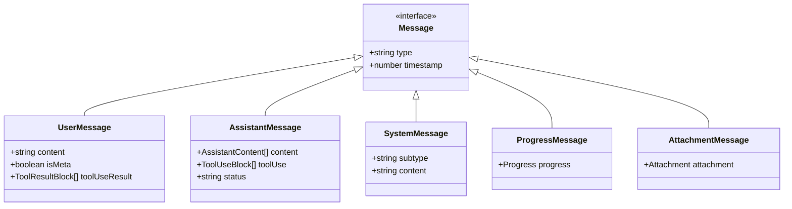
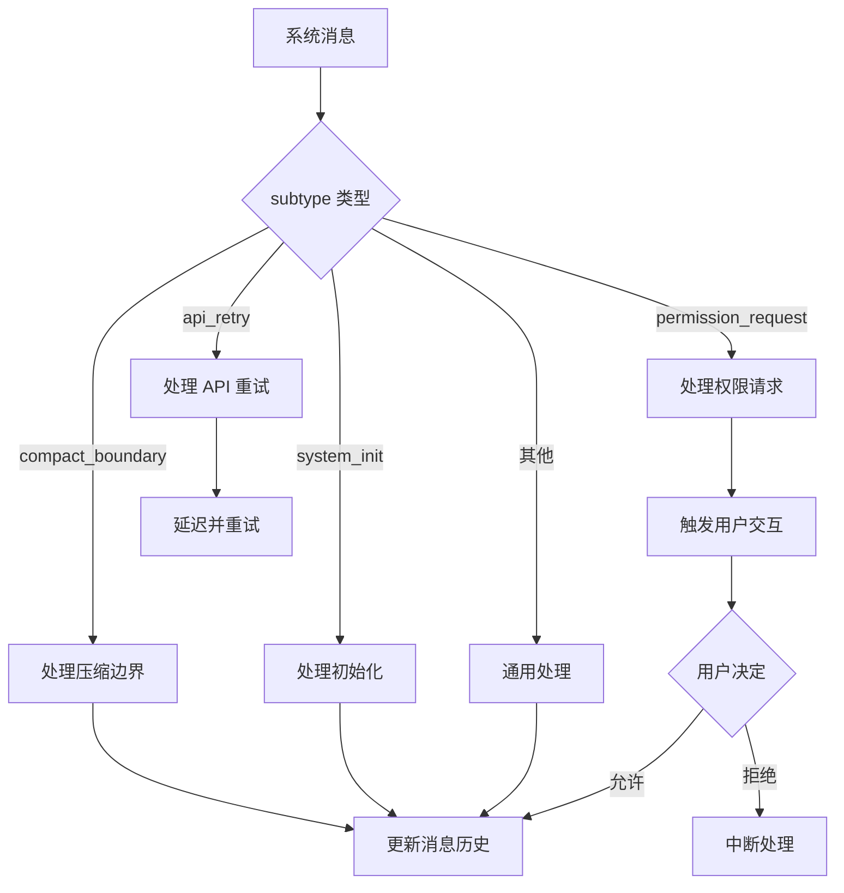
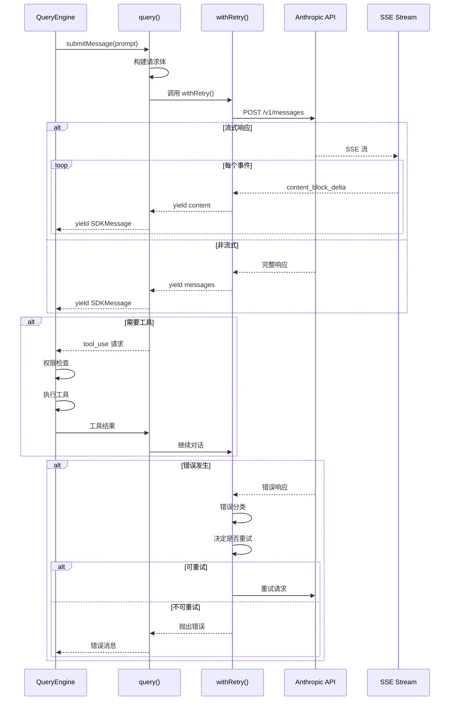
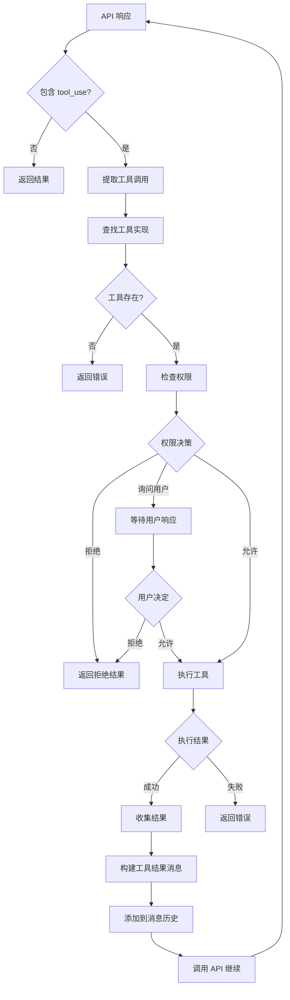
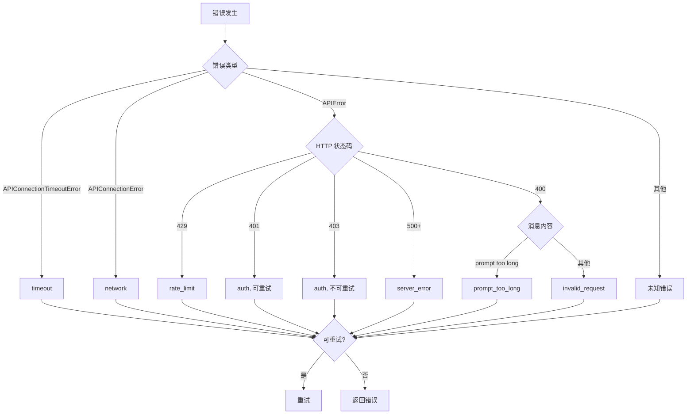
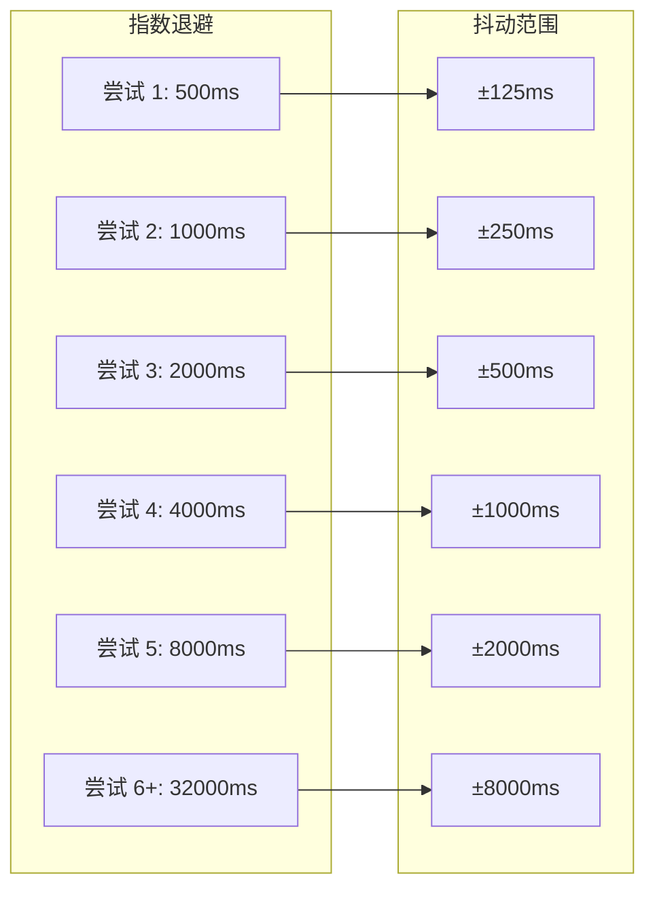
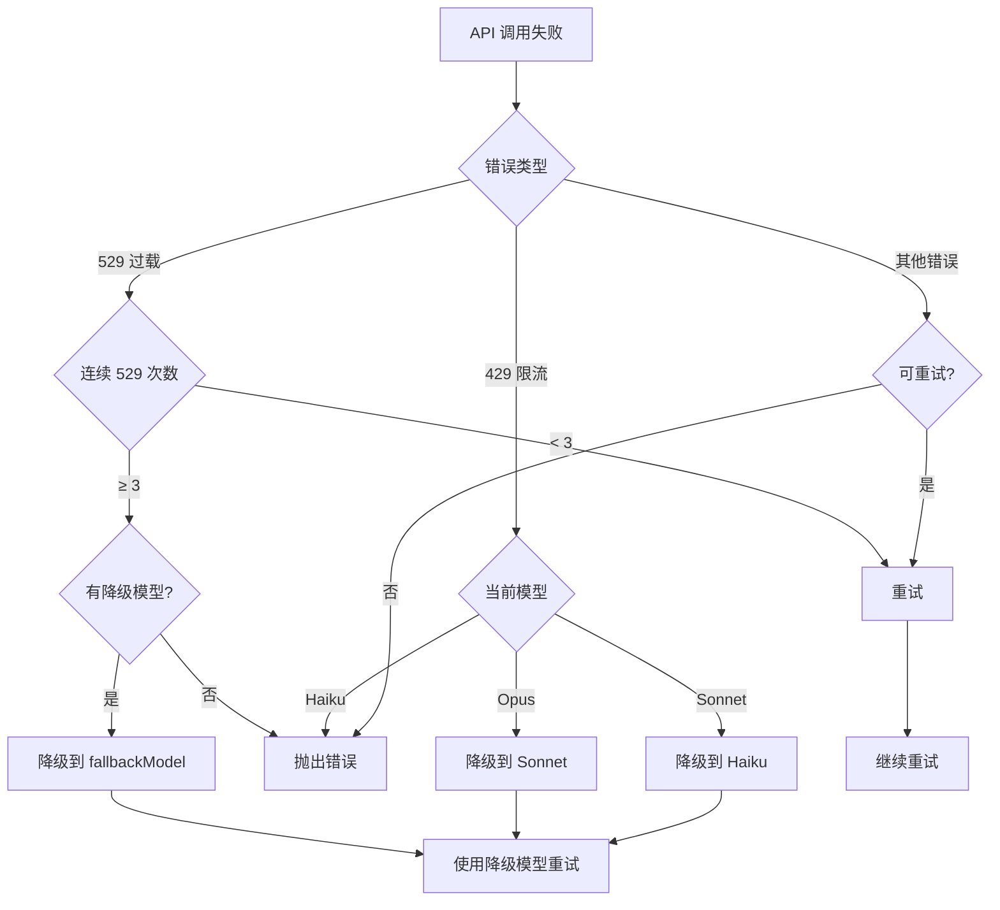
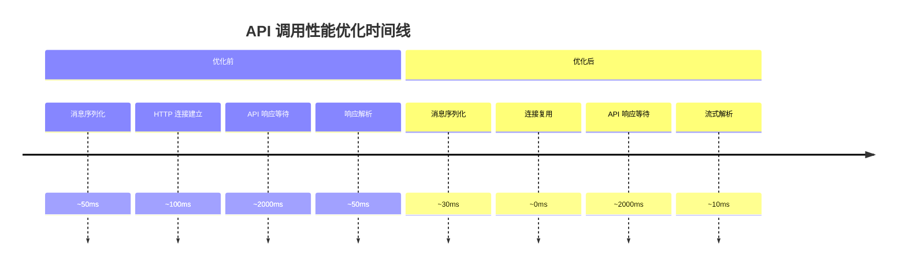

# 第 6 章：QueryEngine 核心（二）：消息处理与 API 交互

> 本章目标：深入理解 QueryEngine 如何处理消息、与 Anthropic API 交互，以及完整的错误处理和重试机制。

## 6.1 submitMessage 方法详解

### 6.1.1 方法签名分析

```typescript
// src/QueryEngine.ts:209-212
async *submitMessage(
  prompt: string | ContentBlockParam[],
  options?: { uuid?: string; isMeta?: boolean },
): AsyncGenerator<SDKMessage, void, unknown>
```

**参数说明：**
- `prompt`: 用户输入，可以是纯文本或结构化内容块
  ```typescript
  // 纯文本输入
  submitMessage("帮我分析这个文件")

  // 结构化内容块输入
  submitMessage([
    { type: "text", text: "分析这张图片" },
    { type: "image", source: { type: "base64", data: "..." } }
  ])
  ```
- `options.uuid`: 可选的消息 UUID（用于幂等性）
- `options.isMeta`: 是否为元消息（不显示给用户）

**返回值：**
```typescript
type SDKMessage =
  | { type: 'user'; message: UserMessage }
  | { type: 'assistant'; message: AssistantMessage }
  | { type: 'system'; subtype: string; message: SystemMessage }
  | { type: 'permission_request'; tool_use_id: string }
  | { type: 'permission_decision'; decision: 'allow' | 'deny' }
  // ... 更多类型
```

### 6.1.2 参数处理流程

```mermaid
flowchart TD
    A[submitMessage 调用] --> B{prompt 类型}
    B -->|字符串| C[转换为文本内容块]
    B -->|ContentBlockParam[]| D[直接使用]
    C --> E[处理用户输入]
    D --> E
    E --> F[斜杠命令处理]
    F --> G{有斜杠命令?}
    G -->|是| H[执行命令]
    G -->|否| I[构建消息数组]
    H --> I
    I --> J[持久化会话]
    J --> K[调用 query]
```

**用户输入处理示例：**

```typescript
// 输入转换
function normalizePrompt(
  prompt: string | ContentBlockParam[]
): ContentBlockParam[] {
  if (typeof prompt === 'string') {
    // 纯文本转换为文本块
    return [{ type: 'text', text: prompt }]
  }
  // 已经是结构化格式
  return prompt
}

// 斜杠命令检测
function detectSlashCommand(
  prompt: string | ContentBlockParam[]
): string | null {
  const text = typeof prompt === 'string'
    ? prompt
    : prompt.find(b => b.type === 'text')?.text ?? ''

  const match = text.match(/^\/(\w+)/)
  return match ? match[1] : null
}
```

### 6.1.3 返回值设计（AsyncGenerator）

```typescript
// 使用异步生成器的原因
async *submitMessage(): AsyncGenerator<SDKMessage, void, unknown> {
  // 1. 可以逐步生成消息
  yield { type: 'status', status: 'processing' }

  // 2. 支持流式输出
  for await (const chunk of apiStream) {
    yield { type: 'content', content: chunk }
  }

  // 3. 可以被中断
  if (abortController.signal.aborted) {
    return
  }

  // 4. 完成返回
  yield { type: 'done' }
}
```

**设计意图：**

| 特性 | AsyncGenerator | Promise |
|------|----------------|---------|
| 流式输出 | ✓ 原生支持 | ✗ 需要额外实现 |
| 可取消 | ✓ 通过 abort() | ✗ 需要额外实现 |
| 内存效率 | ✓ 逐步产生 | ✗ 需要缓存全部 |
| 错误处理 | ✓ 标准机制 | ✓ 标准机制 |

**异步生成器使用示例：**

```typescript
// 消费者使用异步生成器
async function consumeMessages(engine: QueryEngine, prompt: string) {
  const generator = engine.submitMessage(prompt)

  for await (const message of generator) {
    switch (message.type) {
      case 'user':
        console.log('User:', message.message.content)
        break
      case 'assistant':
        console.log('Assistant:', message.message.content)
        break
      case 'permission_request':
        // 处理权限请求
        const decision = await askUser(message.tool_use_id)
        if (decision === 'allow') {
          // 继续处理
        } else {
          // 中断
          generator.return()
        }
        break
    }
  }
}
```

## 6.2 消息规范化

### 6.2.1 Message 类型体系

```typescript
// src/types/message.ts
export type Message =
  | UserMessage
  | AssistantMessage
  | SystemMessage
  | ProgressMessage
  | AttachmentMessage

export type UserMessage = {
  type: 'user'
  content: string
  timestamp?: number
  isMeta?: boolean
  toolUseResult?: ToolResultBlock[]
  // ...
}

export type AssistantMessage = {
  type: 'assistant'
  content: AssistantContent[]
  timestamp?: number
  toolUse?: ToolUseBlock[]
  status?: 'pending' | 'in_progress' | 'completed'
  // ...
}

export type SystemMessage = {
  type: 'system'
  subtype?: 'compact_boundary' | 'system_init' | 'permission_request'
  content: string
  timestamp?: number
}
```

**消息类型层次结构：**



### 6.2.2 消息转换逻辑

```typescript
// src/utils/queryHelpers.ts
export function normalizeMessage(
  message: unknown,
): Message {
  // 字符串转用户消息
  if (typeof message === 'string') {
    return {
      type: 'user',
      content: message,
      timestamp: Date.now(),
    }
  }

  // 验证消息结构
  if (isValidMessage(message)) {
    return message
  }

  // 默认用户消息
  return {
    type: 'user',
    content: String(message),
    timestamp: Date.now(),
  }
}

function isValidMessage(msg: unknown): msg is Message {
  if (typeof msg !== 'object' || msg === null) {
    return false
  }

  const m = msg as Record<string, unknown>

  // 检查必需字段
  if (typeof m.type !== 'string') {
    return false
  }

  // 根据类型检查特定字段
  switch (m.type) {
    case 'user':
      return typeof m.content === 'string'
    case 'assistant':
      return Array.isArray(m.content)
    case 'system':
      return typeof m.content === 'string'
    default:
      return false
  }
}
```

### 6.2.3 系统消息处理

```typescript
// 系统消息的特殊处理
export function processSystemMessage(
  message: SystemMessage,
  context: ProcessContext,
): ProcessResult {
  switch (message.subtype) {
    case 'compact_boundary':
      // 压缩边界，用于会话压缩
      return handleCompactBoundary(message, context)

    case 'system_init':
      // 系统初始化消息
      return handleSystemInit(message, context)

    case 'permission_request':
      // 权限请求消息
      return handlePermissionRequest(message, context)

    case 'api_retry':
      // API 重试消息
      return handleAPIRetry(message, context)

    default:
      // 其他系统消息
      return handleGenericSystemMessage(message, context)
  }
}

// 压缩边界处理
function handleCompactBoundary(
  message: SystemMessage,
  context: ProcessContext,
): ProcessResult {
  // 压缩边界消息包含之前对话的摘要
  // 模型可以看到这个摘要，但完整的历史被移除

  const summary = message.content
  const { messages, executed } = context.snipReplay?.(message, context.messages) ?? {
    messages: context.messages,
    executed: false,
  }

  return {
    messages,
    modified: executed,
  }
}
```

**系统消息类型处理流程：**



## 6.3 API 调用流程

### 6.3.1 API 调用时序图



### 6.3.2 query() 函数分析

```typescript
// src/query.ts (简化版)
export async function* query(
  params: QueryParams,
): AsyncGenerator<QueryResult, void, unknown> {
  const {
    messages,
    tools,
    model,
    system,
    signal,
  } = params

  // 1. 构建请求体
  const requestBody: MessageCreateParams = {
    model,
    messages: normalizeMessagesForAPI(messages),
    system,
    tools: tools.length > 0 ? buildToolsForAPI(tools) : undefined,
    stream: true,
    max_tokens: calculateMaxTokens(messages),
  }

  // 2. 调用 API（带重试）
  const response = await withRetry(
    () => getAPIClient(),
    async (client) => {
      return await client.messages.create(requestBody)
    },
    {
      signal,
      model,
      thinkingConfig: params.thinkingConfig,
      querySource: params.querySource,
    }
  )

  // 3. 处理流式响应
  if (requestBody.stream) {
    for await (const event of response) {
      switch (event.type) {
        case 'content_block_start':
          yield { type: 'block_start', data: event }
          break

        case 'content_block_delta':
          if (event.delta.type === 'text_delta') {
            yield {
              type: 'content_delta',
              text: event.delta.text
            }
          } else if (event.delta.type === 'thinking_delta') {
            yield {
              type: 'thinking_delta',
              thinking: event.delta.thinking
            }
          }
          break

        case 'content_block_stop':
          yield { type: 'block_stop', data: event }
          break

        case 'message_stop':
          return // 消息完成
      }
    }
  }
}
```

### 6.3.3 流式响应处理

```typescript
// 处理 Server-Sent Events
async function*processSSEStream(
  stream: ReadableStream<Uint8Array>,
): AsyncGenerator<SSEEvent> {
  const reader = stream.getReader()
  const decoder = new TextDecoder()

  let buffer = ''

  while (true) {
    const { done, value } = await reader.read()
    if (done) break

    buffer += decoder.decode(value, { stream: true })

    // 按行分割
    const lines = buffer.split('\n')
    buffer = lines.pop() || ''

    for (const line of lines) {
      if (line.startsWith('data: ')) {
        const data = line.slice(6)
        if (data === '[DONE]') return

        try {
          yield JSON.parse(data) as SSEEvent
        } catch (e) {
          console.error('Failed to parse SSE:', e)
        }
      }
    }
  }
}
```

**SSE 解析流程：**

```mermaid
flowchart TD
    A[原始字节流] --> B[UTF-8 解码]
    B --> C[累积到缓冲区]
    C --> D[按换行符分割]
    D --> E{行以 data: 开头?}
    E -->|否| D
    E -->|是| F[提取 JSON 数据]
    F --> G{数据是 [DONE]?}
    G -->|是| H[结束解析]
    G -->|否| I[解析 JSON]
    I --> J{解析成功?}
    J -->|是| K[yield 事件]
    J -->|否| L[记录错误]
    K --> M[继续下一行]
    L --> M
    M --> D
```

## 6.4 工具调用循环

### 6.4.1 工具使用检测

```typescript
// 检测响应中的工具使用
function detectToolUse(
  content: ContentBlock[],
): ToolUseBlock[] {
  return content.filter(
    (block): block is ToolUseBlock => block.type === 'tool_use'
  )
}

// 工具使用示例
const toolUseBlock: ToolUseBlock = {
  type: 'tool_use',
  id: 'toolu_abc123',
  name: 'Bash',
  input: {
    command: 'ls -la',
    timeout: 10000,
  }
}
```

### 6.4.2 工具执行协调



### 6.4.3 结果反馈循环

```typescript
// 工具调用循环实现（简化版）
async function*toolCallLoop(
  initialMessages: Message[],
  tools: Tools,
  context: ToolUseContext,
): AsyncGenerator<QueryResult> {
  let messages = [...initialMessages]

  while (true) {
    // 调用 API
    const response = await callAPI(messages, tools)
    yield { type: 'assistant', content: response.content }

    // 检查工具使用
    const toolUses = extractToolUses(response)

    if (toolUses.length === 0) {
      // 没有工具调用，返回结果
      yield { type: 'done', stopReason: response.stop_reason }
      return
    }

    // 执行工具
    const toolResults: ToolResultBlock[] = []

    for (const toolUse of toolUses) {
      yield { type: 'tool_use_start', toolUse }

      const tool = findTool(tools, toolUse.name)
      if (!tool) {
        toolResults.push({
          type: 'tool_result',
          tool_use_id: toolUse.id,
          content: `Tool ${toolUse.name} not found`,
          is_error: true,
        })
        continue
      }

      // 检查权限
      const permission = await canUseTool(tool, toolUse.input, context)

      if (permission.behavior !== 'allow') {
        toolResults.push({
          type: 'tool_result',
          tool_use_id: toolUse.id,
          content: permission.message,
          is_error: true,
        })
        continue
      }

      // 执行工具
      try {
        const result = await tool.call(toolUse.input, context)
        toolResults.push({
          type: 'tool_result',
          tool_use_id: toolUse.id,
          content: result.content,
        })
        yield { type: 'tool_result', toolUse, result }
      } catch (error) {
        toolResults.push({
          type: 'tool_result',
          tool_use_id: toolUse.id,
          content: errorMessage(error),
          is_error: true,
        })
      }
    }

    // 构建工具结果消息
    const resultMessage: Message = {
      role: 'user',
      content: toolResults,
    }

    messages.push(resultMessage)
  }
}
```

## 6.5 错误处理与重试

### 6.5.1 错误分类系统

```typescript
// src/services/api/errors.ts (简化版)
export type APIErrorType =
  | 'rate_limit'           // 速率限制
  | 'timeout'              // 超时
  | 'network'              // 网络错误
  | 'api'                  // API 错误
  | 'auth'                 // 认证错误
  | 'server_error'         // 服务器错误
  | 'prompt_too_long'      // 提示过长
  | 'invalid_request'      // 无效请求
  | 'overloaded'           // 服务器过载

export type CategorizedAPIError = {
  type: APIErrorType
  originalError: unknown
  retryable: boolean
  delay?: number
  message: string
}

export function categorizeAPIError(error: unknown): CategorizedAPIError {
  // SDK 超时错误
  if (error instanceof APIConnectionTimeoutError) {
    return {
      type: 'timeout',
      originalError: error,
      retryable: true,
      message: 'Request timed out',
    }
  }

  // SDK 连接错误
  if (error instanceof APIConnectionError) {
    return {
      type: 'network',
      originalError: error,
      retryable: true,
      message: 'Connection failed',
    }
  }

  // SDK API 错误
  if (error instanceof APIError) {
    // 速率限制 (429)
    if (error.status === 429) {
      const retryAfter = error.headers?.get('retry-after')
      return {
        type: 'rate_limit',
        originalError: error,
        retryable: true,
        delay: retryAfter ? parseInt(retryAfter, 10) * 1000 : undefined,
        message: error.message,
      }
    }

    // 认证错误 (401, 403)
    if (error.status === 401 || error.status === 403) {
      return {
        type: 'auth',
        originalError: error,
        retryable: error.status === 401,  // 401 可重试（刷新 token），403 不可重试
        message: error.message,
      }
    }

    // 服务器错误 (5xx)
    if (error.status >= 500) {
      return {
        type: 'server_error',
        originalError: error,
        retryable: true,
        message: error.message,
      }
    }

    // 提示过长
    if (error.status === 400 &&
        error.message.toLowerCase().includes('prompt is too long')) {
      return {
        type: 'prompt_too_long',
        originalError: error,
        retryable: false,
        message: error.message,
      }
    }

    // 其他 4xx 错误
    return {
      type: 'invalid_request',
      originalError: error,
      retryable: false,
      message: error.message,
    }
  }

  // 未知错误
  return {
    type: 'api',
    originalError: error,
    retryable: false,
    message: String(error),
  }
}
```

**错误分类决策树：**



### 6.5.2 重试策略

```typescript
// src/services/api/withRetry.ts (核心逻辑)
export async function* withRetry<T>(
  getClient: () => Promise<Anthropic>,
  operation: (
    client: Anthropic,
    attempt: number,
    context: RetryContext,
  ) => Promise<T>,
  options: RetryOptions,
): AsyncGenerator<SystemAPIErrorMessage, T> {
  const maxRetries = options.maxRetries ?? getDefaultMaxRetries()
  let consecutive529Errors = options.initialConsecutive529Errors ?? 0

  for (let attempt = 1; attempt <= maxRetries + 1; attempt++) {
    // 检查中止信号
    if (options.signal?.aborted) {
      throw new APIUserAbortError()
    }

    try {
      // 执行操作
      const client = await getClient()
      return await operation(client, attempt, retryContext)

    } catch (error) {
      // 分类错误
      const categorized = categorizeAPIError(error)

      // 检查是否可以重试
      if (attempt > maxRetries || !categorized.retryable) {
        throw new CannotRetryError(error, retryContext)
      }

      // 连续 529 错误处理
      if (categorized.type === 'overloaded') {
        consecutive529Errors++
        if (consecutive529Errors >= MAX_529_RETRIES) {
          // 触发降级
          if (options.fallbackModel) {
            throw new FallbackTriggeredError(
              options.model,
              options.fallbackModel
            )
          }
        }
      }

      // 计算延迟
      const delayMs = getRetryDelay(attempt, categorized.delay)

      // 通知用户
      yield createSystemAPIErrorMessage(error, delayMs, attempt, maxRetries)

      // 等待
      await sleep(delayMs, options.signal, { abortError })
    }
  }

  throw new CannotRetryError(lastError, retryContext)
}

// 指数退避 + 抖动
function getRetryDelay(
  attempt: number,
  retryAfterHeader?: string | null,
  maxDelayMs = 32000,
): number {
  // 优先使用 Retry-After 头
  if (retryAfterHeader) {
    const seconds = parseInt(retryAfterHeader, 10)
    if (!isNaN(seconds)) {
      return seconds * 1000
    }
  }

  // 指数退避
  const baseDelay = Math.min(
    BASE_DELAY_MS * Math.pow(2, attempt - 1),
    maxDelayMs,
  )

  // 添加抖动（±25%）
  const jitter = Math.random() * 0.25 * baseDelay

  return baseDelay + jitter
}
```

**重试延迟策略：**



### 6.5.3 降级机制

```typescript
// 模型降级
async function callWithFallback(
  model: string,
  params: APIParams,
): Promise<APIResponse> {
  try {
    return await callAPI(model, params)
  } catch (error) {
    const categorized = categorizeAPIError(error)

    // 速率限制：降级到更小的模型
    if (categorized.type === 'rate_limit' || categorized.type === 'overloaded') {
      if (model.includes('opus') && fallbackModel) {
        console.warn(`Rate limited on ${model}, falling back to ${fallbackModel}`)
        return await callAPI(fallbackModel, params)
      }
    }

    throw error
  }
}

// 529 错误特殊处理
const MAX_529_RETRIES = 3

if (categorized.type === 'overloaded') {
  consecutive529Errors++

  if (consecutive529Errors >= MAX_529_RETRIES) {
    if (fallbackModel) {
      logEvent('tengu_api_opus_fallback_triggered', {
        original_model: model,
        fallback_model: fallbackModel,
      })

      throw new FallbackTriggeredError(model, fallbackModel)
    }

    // 无降级模型，抛出特殊错误
    throw new Error(REPEATED_529_ERROR_MESSAGE)
  }
}
```

**降级策略流程：**



## 6.6 作者观点：错误处理的权衡

### 6.6.1 优点

1. **全面的错误分类**：覆盖所有 API 错误类型
2. **智能重试**：根据错误类型决定是否重试
3. **降级机制**：在容量不足时自动降级
4. **用户反馈**：通过 SystemAPIErrorMessage 通知用户

### 6.6.2 缺点

1. **复杂度高**：重试逻辑复杂，难以理解
2. **降级风险**：自动降级可能影响输出质量
3. **重试风暴**：多个客户端可能同时重试
4. **状态不一致**：降级后状态可能不一致

### 6.6.3 改进建议

1. **简化重试逻辑**：使用成熟的重试库
   ```typescript
   import { retry } from '@lifeomatic/async-retry'

   const result = await retry(
     async (bail) => {
       try {
         return await callAPI()
       } catch (error) {
         if (!isRetryable(error)) {
           bail(error)
         }
         throw error
       }
     },
     {
       retries: 3,
       maxTimeout: 30000,
     }
   )
   ```

2. **断路器模式**：在持续失败时停止尝试
   ```typescript
   class CircuitBreaker {
     private failures = 0
     private lastFailTime = 0
     private state: 'closed' | 'open' | 'half-open' = 'closed'

     async execute(fn: () => Promise) {
       if (this.state === 'open') {
         if (Date.now() - this.lastFailTime > this.resetTimeout) {
           this.state = 'half-open'
         } else {
           throw new Error('Circuit breaker is open')
         }
       }

       try {
         const result = await fn()
         this.onSuccess()
         return result
       } catch (error) {
         this.onFailure()
         throw error
       }
     }
   }
   ```

3. **可配置降级策略**：让用户控制是否降级
   ```typescript
   interface RetryOptions {
     enableFallback?: boolean
     fallbackBehavior?: 'error' | 'wait' | 'fallback'
     fallbackModel?: string
   }
   ```

## 6.7 性能优化

### 6.7.1 API 调用优化



### 6.7.2 批量优化策略

```typescript
// 批量工具调用优化
async function executeToolsInBatches(
  toolUses: ToolUseBlock[],
  context: ToolUseContext,
): Promise<ToolResultBlock[]> {
  // 将工具调用分组
  const batches = groupToolUses(toolUses)

  const results: ToolResultBlock[] = []

  // 并行执行每组
  for (const batch of batches) {
    const batchResults = await Promise.all(
      batch.map(async (toolUse) => {
        return await executeTool(toolUse, context)
      })
    )
    results.push(...batchResults)
  }

  return results
}

function groupToolUses(toolUses: ToolUseBlock[]): ToolUseBlock[][] {
  // 可以并行执行的工具类型
  const parallelizable = new Set(['Read', 'Grep', 'Glob'])

  const batches: ToolUseBlock[][] = []
  let currentBatch: ToolUseBlock[] = []

  for (const toolUse of toolUses) {
    if (currentBatch.length === 0) {
      currentBatch.push(toolUse)
    } else {
      // 检查是否可以与当前批次并行
      const canParallel = currentBatch.every(t =>
        parallelizable.has(t.name) && parallelizable.has(toolUse.name)
      )

      if (canParallel) {
        currentBatch.push(toolUse)
      } else {
        batches.push(currentBatch)
        currentBatch = [toolUse]
      }
    }
  }

  if (currentBatch.length > 0) {
    batches.push(currentBatch)
  }

  return batches
}
```

## 6.8 可复用模式总结

### 模式 12：异步生成器模式

**描述：** 使用异步生成器逐步产生结果，支持流式处理。

**适用场景：**
- LLM 流式响应
- 大文件处理
- 需要取消的操作

**代码模板：**

```typescript
async function*processItems<T, R>(
  items: T[],
  processor: (item: T) => Promise<R>,
  signal?: AbortSignal,
): AsyncGenerator<R> {
  for (const item of items) {
    // 检查取消
    if (signal?.aborted) {
      break
    }

    // 处理并生成结果
    const result = await processor(item)
    yield result
  }
}
```

**关键点：**
1. 使用 `async function*` 定义
2. 使用 `yield` 生成结果
3. 支持中途取消
4. 内存效率高

### 模式 13：工具调用循环模式

**描述：** 持续调用 API 直到没有工具使用为止。

**适用场景：**
- Agent 系统
- 多步任务
- 工具链调用

**代码模板：**

```typescript
async function*agentLoop(
  initialMessage: string,
  tools: Tool[],
): AsyncGenerator<AgentResponse> {
  let messages: Message[] = [
    { role: 'user', content: initialMessage }
  ]

  while (true) {
    // 调用 LLM
    const response = await callLLM(messages, tools)
    yield { type: 'response', content: response.content }

    // 检查工具使用
    const toolUses = response.content.filter(c => c.type === 'tool_use')

    if (toolUses.length === 0) {
      break // 没有工具，结束
    }

    // 执行工具
    for (const toolUse of toolUses) {
      const result = await executeTool(toolUse)
      messages.push({ role: 'user', content: result })
      yield { type: 'tool_result', tool: toolUse.name, result }
    }
  }
}
```

**关键点：**
1. 循环直到没有工具调用
2. 积累消息历史
3. 逐步产生中间结果
4. 明确的终止条件

### 模式 14：错误分类与重试模式

**描述：** 将错误分类并根据类型决定是否重试。

**适用场景：**
- 外部 API 调用
- 网络请求
- 不稳定操作

**代码模板：**

```typescript
type ErrorCategory =
  | { type: 'retryable'; delay: number }
  | { type: 'fatal' }

function categorizeError(error: unknown): ErrorCategory {
  if (error instanceof NetworkError) {
    return { type: 'retryable', delay: 1000 }
  }
  if (error instanceof AuthError) {
    return { type: 'fatal' }
  }
  return { type: 'retryable', delay: 5000 }
}

async function retryOnError<T>(
  fn: () => Promise<T>,
  maxRetries = 3,
): Promise<T> {
  for (let attempt = 0; attempt < maxRetries; attempt++) {
    try {
      return await fn()
    } catch (error) {
      const category = categorizeError(error)

      if (category.type === 'fatal') {
        throw error
      }

      if (attempt === maxRetries - 1) {
        throw error
      }

      await sleep(category.delay * (attempt + 1))
    }
  }
  throw new Error('Unreachable')
}
```

**关键点：**
1. 明确的错误分类
2. 区分可重试和致命错误
3. 指数退避
4. 最大重试次数

## 本章小结

本章深入分析了 QueryEngine 的消息处理与 API 交互：

1. **submitMessage**：异步生成器设计、参数处理、返回值设计
2. **消息规范化**：Message 类型体系、转换逻辑、系统消息处理
3. **API 调用**：query() 函数、流式/非流式响应、SSE 解析
4. **工具调用循环**：工具检测、执行协调、结果反馈
5. **错误处理**：错误分类、重试策略、降级机制
6. **作者评价**：优缺点分析、改进建议
7. **性能优化**：API 调用优化、批量工具执行

## 下一章预告

第 7 章将分析 QueryEngine 的流式响应与特殊功能。
