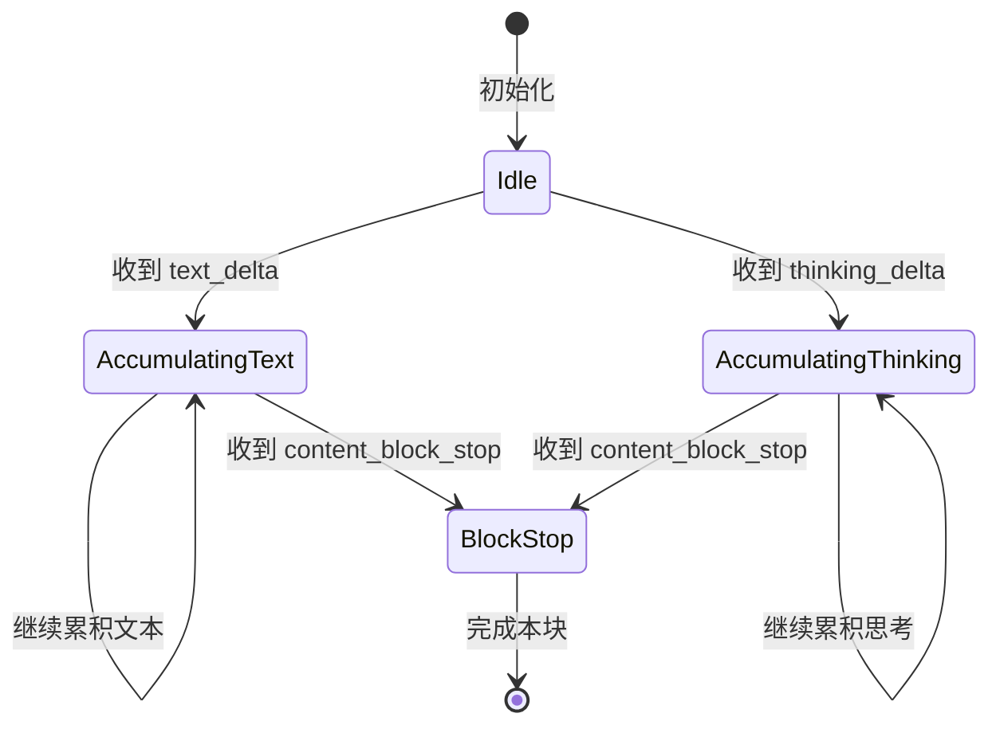
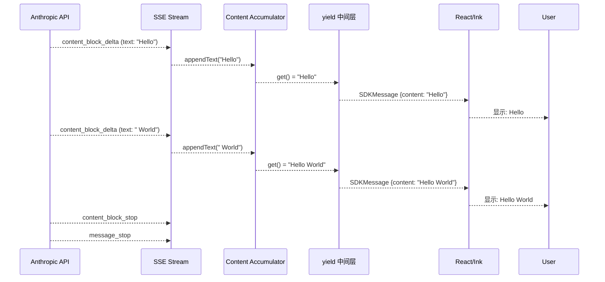
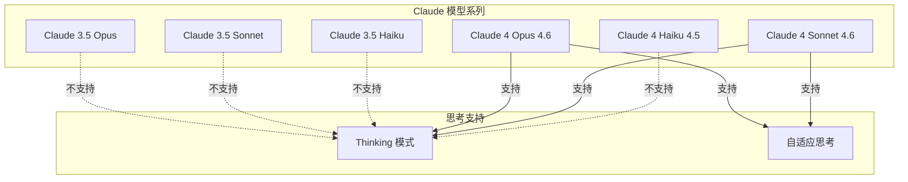
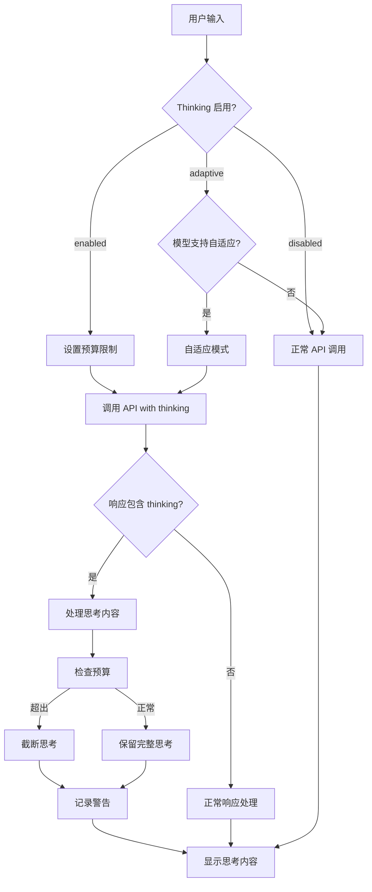
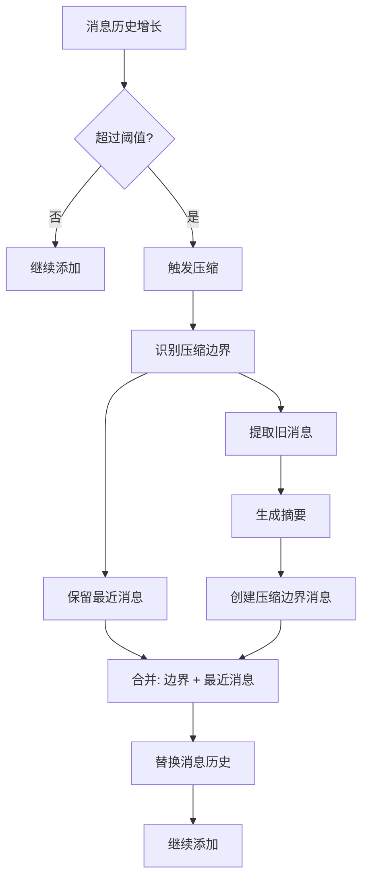

# 第 7 章：QueryEngine 核心（三）：流式响应与特殊功能

> 本章目标：深入理解流式处理机制、Thinking 模式、Token 计数、上下文管理等高级功能。

## 7.1 流式响应处理

### 7.1.1 SSE 解析器实现

```typescript
// Server-Sent Events 解析器
class SSEParser {
  private buffer = ''
  private eventBuffer: Partial<SSEEvent> = {}

  parse(chunk: string): SSEEvent[] {
    this.buffer += chunk
    const lines = this.buffer.split('\n')
    this.buffer = lines.pop() || ''

    const events: SSEEvent[] = []

    for (const line of lines) {
      if (line === '') {
        // 空行表示事件结束
        if (this.eventBuffer.data) {
          events.push(this.finalizeEvent())
          this.eventBuffer = {}
        }
        continue
      }

      if (line.startsWith(':')) {
        // 注释，跳过
        continue
      }

      const [field, ...valueParts] = line.split(':')
      const value = valueParts.join(':').trim()

      if (field === 'data') {
        this.eventBuffer.data = this.eventBuffer.data
          ? this.eventBuffer.data + '\n' + value
          : value
      } else if (field === 'event') {
        this.eventBuffer.event = value
      } else if (field === 'id') {
        this.eventBuffer.id = value
      } else if (field === 'retry') {
        this.eventBuffer.retry = parseInt(value, 10)
      }
    }

    return events
  }

  private finalizeEvent(): SSEEvent {
    return {
      event: this.eventBuffer.event || 'message',
      data: this.eventBuffer.data ? JSON.parse(this.eventBuffer.data) : null,
      id: this.eventBuffer.id,
      retry: this.eventBuffer.retry,
    }
  }
}
```

**SSE 事件格式：**

```
event: message
data: {"type":"content_block_start",...}

data: {"type":"content_block_delta", "delta":{"type":"text_delta","text":"Hello"}}

data: {"type":"content_block_stop", ...}

event: message_stop
data: [DONE]
```

### 7.1.2 增量内容累积

```typescript
// 内容累积器
class ContentAccumulator {
  private content = ''
  private thinkingContent = ''

  appendText(delta: string): void {
    this.content += delta
  }

  appendThinking(delta: string): void {
    this.thinkingContent += delta
  }

  getText(): string {
    return this.content
  }

  getThinking(): string {
    return this.thinkingContent
  }

  clear(): void {
    this.content = ''
    this.thinkingContent = ''
  }
}

// 在流式处理中使用
const accumulator = new ContentAccumulator()

for await (const event of sseStream) {
  if (event.type === 'content_block_delta') {
    if (event.delta.type === 'text_delta') {
      accumulator.appendText(event.delta.text)
    } else if (event.delta.type === 'thinking_delta') {
      accumulator.appendThinking(event.delta.thinking)
    }

    yield {
      type: 'content',
      content: accumulator.getText(),
      thinking: accumulator.getThinking(),
    }
  }
}
```

**内容累积状态机：**



### 7.1.3 UI 更新协调



**React 组件中的流式更新：**

```typescript
// 使用 React Hook 管理流式状态
function StreamingResponse() {
  const [content, setContent] = useState('')
  const [isStreaming, setIsStreaming] = useState(false)
  const generatorRef = useRef<AsyncGenerator<SDKMessage> | null>(null)

  const startStream = useCallback(async (prompt: string) => {
    const engine = getQueryEngine()
    const generator = engine.submitMessage(prompt)
    generatorRef.current = generator

    setIsStreaming(true)
    setContent('')

    try {
      for await (const message of generator) {
        if (message.type === 'assistant' && message.message.content) {
          setContent(message.message.content)
        }
      }
    } finally {
      setIsStreaming(false)
      generatorRef.current = null
    }
  }, [])

  // 取消流式传输
  const cancelStream = useCallback(() => {
    generatorRef.current?.return()
    setIsStreaming(false)
  }, [])

  return (
    <Box>
      <Text>{content || '等待响应...'}</Text>
      {isStreaming && <Spinner />}
      <Button onPress={cancelStream}>取消</Button>
    </Box>
  )
}
```

## 7.2 Thinking 模式

### 7.2.1 扩展思考机制

```typescript
// src/utils/thinking.ts
export type ThinkingConfig =
  | { type: 'disabled' }          // 禁用思考
  | { type: 'adaptive'; budgetTokens?: number }  // 自适应思考
  | { type: 'enabled'; budgetTokens?: number }     // 强制启用思考

// 检查模型是否支持思考
export function modelSupportsThinking(model: string): boolean {
  const supported3P = get3PModelCapabilityOverride(model, 'thinking')
  if (supported3P !== undefined) {
    return supported3P
  }

  const canonical = getCanonicalName(model)
  const provider = getAPIProvider()

  // 1P 和 Foundry: Claude 4+ 模型
  if (provider === 'foundry' || provider === 'firstParty') {
    return !canonical.includes('claude-3-')
  }

  // 3P (Bedrock/Vertex): Opus 4+ 和 Sonnet 4+
  return canonical.includes('sonnet-4') || canonical.includes('opus-4')
}

// 检查模型是否支持自适应思考
export function modelSupportsAdaptiveThinking(model: string): boolean {
  const supported3P = get3PModelCapabilityOverride(model, 'adaptive_thinking')
  if (supported3P !== undefined) {
    return supported3P
  }

  const canonical = getCanonicalName(model)

  // Opus 4.6 和 Sonnet 4.6 支持
  if (canonical.includes('opus-4-6') || canonical.includes('sonnet-4-6')) {
    return true
  }

  // 排除已知旧模型
  if (canonical.includes('opus') || canonical.includes('sonnet')) {
    return false
  }

  // 新模型默认支持（1P 和 Foundry）
  const provider = getAPIProvider()
  return provider === 'firstParty' || provider === 'foundry'
}

// 默认启用思考
export function shouldEnableThinkingByDefault(): boolean {
  if (process.env.MAX_THINKING_TOKENS) {
    return parseInt(process.env.MAX_THINKING_TOKENS, 10) > 0
  }

  const { settings } = getSettingsWithErrors()
  if (settings.alwaysThinkingEnabled === false) {
    return false
  }

  // 默认启用
  return true
}
```

**思考模式支持矩阵：**



### 7.2.2 思考预算管理

```typescript
// Thinking token 预算管理
class ThinkingBudget {
  private used = 0
  private budget: number
  private readonly maxBudget: number

  constructor(budget: number = 20000, maxBudget: number = 20000) {
    this.budget = budget
    this.maxBudget = maxBudget
  }

  canUse(tokens: number): boolean {
    return this.used + tokens <= this.budget
  }

  use(tokens: number): void {
    this.used += tokens
  }

  remaining(): number {
    return Math.max(0, this.budget - this.used)
  }

  reset(): void {
    this.used = 0
  }

  utilization(): number {
    return this.budget > 0 ? this.used / this.budget : 0
  }

  increaseBudget(additional: number): void {
    this.budget = Math.min(this.maxBudget, this.budget + additional)
  }
}

// 思考内容处理
function processThinkingContent(
  content: string,
  budget: ThinkingBudget,
): ThinkingResult {
  // 计算思考的 token 数量
  const tokens = estimateTokens(content)

  // 检查预算
  if (!budget.canUse(tokens)) {
    return {
      status: 'exceeded_budget',
      truncated: true,
      content: truncateContent(content, budget.remaining()),
    }
  }

  budget.use(tokens)

  return {
    status: 'success',
    truncated: false,
    content,
  }
}

function truncateContent(content: string, maxTokens: number): string {
  // 简单截断：假设 1 token ≈ 4 字符
  const maxChars = maxTokens * 4
  if (content.length <= maxChars) {
    return content
  }

  // 尝试在句子边界截断
  const truncated = content.slice(0, maxChars)
  const lastPeriod = truncated.lastIndexOf('.')
  const lastNewline = truncated.lastIndexOf('\n')

  const cutAt = Math.max(lastPeriod, lastNewline)
  if (cutAt > 0) {
    return content.slice(0, cutAt + 1)
  }

  return truncated + '...'
}
```

### 7.2.3 Thinking 模式集成



**Thinking 内容显示：**

```typescript
// UI 中显示思考内容
function ThinkingDisplay({ thinking }: { thinking: string }) {
  // 检测是否包含 ultrathink 关键字
  const hasUltrathink = hasUltrathinkKeyword(thinking)

  if (hasUltrathink) {
    // 高亮 ultrathink 关键字
    const positions = findThinkingTriggerPositions(thinking)
    let lastIndex = 0
    const parts = []

    for (const pos of positions) {
      // 添加普通文本
      parts.push(thinking.slice(lastIndex, pos.start))
      // 添加高亮关键字
      parts.push(
        <Text color="yellow" bold>{thinking.slice(pos.start, pos.end)}</Text>
      )
      lastIndex = pos.end
    }

    parts.push(thinking.slice(lastIndex))

    return (
      <Box borderStyle="round" borderColor="gray">
        <Text color="gray">Thinking:</Text>
        {parts}
      </Box>
    )
  }

  return (
    <Box borderStyle="round" borderColor="gray">
      <Text color="gray">Thinking:</Text>
      <Text>{thinking}</Text>
    </Box>
  )
}
```

## 7.3 Token 计数与成本跟踪

### 7.3.1 Token 估算策略

```typescript
// Token 估算（基于 Claude 的 tokenizer）
export function estimateTokens(text: string): number {
  let charCount = 0
  let chineseCount = 0

  for (const char of text) {
    if (/[\u4e00-\u9fff]/.test(char)) {
      chineseCount++
    } else {
      charCount++
    }
  }

  // Claude tokenizer 的大致规则：
  // - 英文/数字：~4 字符/token
  // - 中文：~1.5-2 字符/token
  // - 标点符号：通常与前面的字符一起处理

  const tokensFromChars = Math.ceil(charCount / 4)
  const tokensFromChinese = Math.ceil(chineseCount / 1.5)

  return tokensFromChars + tokensFromChinese
}

// 更精确的估算（基于常见模式）
export function estimateTokensPrecise(text: string): number {
  let tokens = 0

  // 按行处理
  const lines = text.split('\n')
  for (const line of lines) {
    // 空行 = 1 token
    if (line.length === 0) {
      tokens += 1
      continue
    }

    // 估算行 token
    tokens += estimateTokens(line)

    // 换行符 = 1 token
    tokens += 1
  }

  return tokens
}

// API 调用 token 计算
export function calculateMessageTokens(
  messages: Message[],
  systemPrompt?: string,
): { inputTokens: number; outputTokens: number } {
  let inputTokens = 0

  // 系统提示
  if (systemPrompt) {
    inputTokens += estimateTokens(systemPrompt)
  }

  // 消息历史
  for (const message of messages) {
    const content = JSON.stringify(message.content)
    inputTokens += estimateTokens(content)

    // 每个消息的开销
    inputTokens += 4
  }

  // 输出 token 是在响应时计算的
  return { inputTokens, outputTokens: 0 }
}
```

**Token 估算对比：**

| 方法 | 精度 | 速度 | 用途 |
|------|------|------|------|
| 字符/4 | ±30% | 极快 | 粗略估算 |
| 中文字符/1.5 | ±20% | 快 | 中文优化 |
| 完整 tokenizer | ±5% | 慢 | 精确计算 |

### 7.3.2 成本计算

```typescript
// 价格表（每百万 tokens，2025年）
const PRICING: Record<string, { input: number; output: number; cacheWrite: number; cacheRead: number }> = {
  // Claude 4 系列
  'claude-opus-4-6': { input: 15.0, output: 75.0, cacheWrite: 15.0, cacheRead: 0.30 },
  'claude-sonnet-4-6': { input: 3.0, output: 15.0, cacheWrite: 3.0, cacheRead: 0.30 },
  'claude-haiku-4-5': { input: 0.80, output: 4.0, cacheWrite: 0.80, cacheRead: 0.30 },

  // Claude 3.5 系列
  'claude-3-5-opus-20240620': { input: 15.0, output: 75.0, cacheWrite: 15.0, cacheRead: 0.30 },
  'claude-3-5-sonnet-20240620': { input: 3.0, output: 15.0, cacheWrite: 3.0, cacheRead: 0.30 },
  'claude-3-5-haiku-20240307': { input: 1.0, output: 5.0, cacheWrite: 1.0, cacheRead: 0.30 },
}

export function calculateCost(
  model: string,
  usage: { prompt: number; completion: number },
): number {
  const pricing = PRICING[model]
  if (!pricing) return 0

  const inputCost = (usage.prompt / 1_000_000) * pricing.input
  const outputCost = (usage.completion / 1_000_000) * pricing.output

  return inputCost + outputCost
}

// 带缓存的成本计算
export function calculateCostWithCache(
  model: string,
  usage: {
    prompt: number
    completion: number
    cacheWriteTokens?: number
    cacheReadTokens?: number
  },
): number {
  const pricing = PRICING[model]
  if (!pricing) return 0

  let cost = 0

  // 输入
  cost += (usage.prompt / 1_000_000) * pricing.input

  // 输出
  cost += (usage.completion / 1_000_000) * pricing.output

  // 缓存写入
  if (usage.cacheWriteTokens) {
    cost += (usage.cacheWriteTokens / 1_000_000) * pricing.cacheWrite
  }

  // 缓存读取
  if (usage.cacheReadTokens) {
    cost += (usage.cacheReadTokens / 1_000_000) * pricing.cacheRead
  }

  return cost
}
```

**成本对比（Opus 4.6）：**

```
输入 10K tokens: $0.15
输出 1K tokens: $0.075
总计: $0.225

带缓存（假设 50% 命中）:
- 缓存写入 5K: $0.075
- 缓存读取 5K: $0.0015
- 总计: $0.2265 (几乎相同)

无缓存（10K 输入）:
$0.15

结论: 对于会话型应用，prompt 缓存价值有限
```

### 7.3.3 用量累积

```typescript
// QueryEngine 中的用量跟踪
export class QueryEngine {
  private totalUsage: NonNullableUsage = EMPTY_USAGE

  private accumulateUsage(usage: Usage): void {
    this.totalUsage = {
      prompt: this.totalUsage.prompt + usage.prompt,
      completion: this.totalUsage.completion + usage.completion,
      total: this.totalUsage.total + usage.total,
    }

    // 更新全局统计
    updateUsage(this.totalUsage)

    // 检查预算
    if (this.config.maxBudgetUsd) {
      const model = this.config.userSpecifiedModel || getMainLoopModel()
      const cost = calculateCost(model, this.totalUsage)

      if (cost > this.config.maxBudgetUsd) {
        throw new BudgetExceededError(
          `Budget exceeded: $${cost.toFixed(2)} > $${this.config.maxBudgetUsd}`
        )
      }
    }

    // 检查任务预算
    if (this.config.taskBudget) {
      const { total } = this.config.taskBudget
      const used = this.totalUsage.total

      if (used > total) {
        throw new TaskBudgetExceededError(
          `Task budget exceeded: ${used} > ${total} tokens`
        )
      }
    }
  }

  getTotalCost(): number {
    const model = this.config.userSpecifiedModel || getMainLoopModel()
    return calculateCost(model, this.totalUsage)
  }

  getUsageSummary(): UsageSummary {
    return {
      promptTokens: this.totalUsage.prompt,
      completionTokens: this.totalUsage.completion,
      totalTokens: this.totalUsage.total,
      cost: this.getTotalCost(),
    }
  }
}
```

## 7.4 上下文管理

### 7.4.1 对话历史维护

```typescript
// 历史管理策略
type HistoryStrategy =
  | 'keep_all'          // 保留所有历史
  | 'last_n'            // 保留最近 N 条消息
  | 'token_budget'      // 根据 token 预算截断
  | 'compact'           // 使用压缩

interface HistoryManager {
  shouldInclude(message: Message, context: ManagementContext): boolean
  onBeforeAdd(message: Message, context: ManagementContext): void
  onOverflow(context: ManagementContext): OverflowResolution
}

// token 预算策略
class TokenBudgetHistoryManager implements HistoryManager {
  constructor(
    private maxTokens: number,
    private tokenEstimator: (text: string) => number,
  ) {}

  shouldInclude(message: Message, context: ManagementContext): boolean {
    // 总是包含最近的消息
    return true
  }

  onBeforeAdd(message: Message, context: ManagementContext): void {
    // 在添加前检查
    const currentTokens = this.estimateCurrentTokens(context.messages)

    if (currentTokens > this.maxTokens * 0.9) {
      // 接近限制，触发压缩
      this.compact(context)
    }
  }

  onOverflow(context: ManagementContext): OverflowResolution {
    // 压缩历史
    return this.compact(context)
  }

  private estimateCurrentTokens(messages: Message[]): number {
    let tokens = 0

    for (const message of messages) {
      const content = JSON.stringify(message.content)
      tokens += this.tokenEstimator(content)
    }

    return tokens
  }

  private compact(context: ManagementContext): OverflowResolution {
    // 1. 识别压缩点
    const compactPoint = this.findCompactPoint(context.messages)

    // 2. 保留最近消息
    const recent = context.messages.slice(compactPoint)

    // 3. 生成摘要
    const summary = this.summarize(
      context.messages.slice(0, compactPoint)
    )

    // 4. 返回新的消息列表
    return {
      messages: [
        { type: 'system', subtype: 'compact_boundary', content: summary },
        ...recent,
      ],
      compacted: true,
    }
  }

  private findCompactPoint(messages: Message[]): number {
    // 从旧到新找到第一个可以压缩的点
    let accumulated = 0
    const threshold = this.maxTokens * 0.7

    for (let i = 0; i < messages.length; i++) {
      const content = JSON.stringify(messages[i].content)
      accumulated += this.tokenEstimator(content)

      if (accumulated > threshold) {
        return i
      }
    }

    return messages.length
  }

  private summarize(messages: Message[]): string {
    // 生成对话摘要
    const summaryLines: string[] = []

    for (const message of messages) {
      if (message.type === 'user') {
        summaryLines.push(`User: ${message.content.slice(0, 100)}...`)
      } else if (message.type === 'assistant') {
        summaryLines.push(`Assistant: ${this.summarizeAssistantContent(message)}`)
      }
    }

    return summaryLines.join('\n')
  }

  private summarizeAssistantContent(message: Message): string {
    // 助手消息可能包含工具调用
    const content = message.content
    if (Array.isArray(content)) {
      const toolUses = content.filter(c => c.type === 'tool_use')
      if (toolUses.length > 0) {
        return `Used tools: ${toolUses.map(t => t.name).join(', ')}`
      }
      const textBlocks = content.filter(c => c.type === 'text')
      return textBlocks.map(t => (t as any).text?.slice(0, 100)).join(' ') + '...'
    }
    return String(content).slice(0, 100) + '...'
  }
}
```

### 7.4.2 上下文压缩



### 7.4.3 消息去重

```typescript
// 消息去重
function deduplicateMessages(messages: Message[]): Message[] {
  const seen = new Map<string, Message>()
  const result: Message[] = []

  for (const message of messages) {
    // 生成消息哈希（只哈希内容，忽略时间戳等）
    const hash = hashMessage(message)

    const existing = seen.get(hash)
    if (!existing || shouldReplace(existing, message)) {
      seen.set(hash, message)
      result.push(message)
    }
  }

  return result
}

function hashMessage(message: Message): string {
  // 只哈希关键内容
  const content = JSON.stringify({
    type: message.type,
    role: (message as any).role,
    content: message.content,
  }))

  return createHash('md5').update(content).digest('hex')
}

function shouldReplace(existing: Message, newer: Message): boolean {
  // 如果新消息有更多信息，替换旧消息
  if (existing.timestamp && newer.timestamp) {
    return newer.timestamp > existing.timestamp
  }

  return false
}
```

## 7.5 特殊场景处理

### 7.5.1 孤立权限处理

```typescript
// 处理孤立权限请求（无 UI 的子 Agent）
async function handleOrphanedPermission(
  orphaned: OrphanedPermission,
  tools: Tools,
  messages: Message[],
  context: ProcessUserInputContext,
): AsyncGenerator<SDKMessage> {
  // 1. 创建权限请求消息
  const permissionMessage: Message = {
    type: 'system',
    subtype: 'permission_request',
    content: `Orphaned permission request for tool: ${orphaned.tool_name}`,
    metadata: orphaned,
  }

  // 2. 添加到消息历史
  messages.push(permissionMessage)

  // 3. 返回通知
  yield {
    type: 'notification',
    level: 'warning',
    message: `Permission request from background agent: ${orphaned.tool_name}`,
  }

  // 4. 检查权限模式
  const mode = context.options.toolPermissionContext.mode

  if (mode === 'auto') {
    // 自动批准
    yield {
      type: 'permission_decision',
      decision: 'allow',
      tool_name: orphaned.tool_name,
    }
  } else if (mode === 'always-allow') {
    // 总是允许
    yield {
      type: 'permission_decision',
      decision: 'allow',
      tool_name: orphaned.tool_name,
    }
  } else {
    // 询问用户（在 SDK 中，这会传递给调用者）
    yield {
      type: 'permission_request',
      tool_name: orphaned.tool_name,
      tool_input: orphaned.tool_input,
    }
  }
}
```

### 7.5.2 会话持久化

```typescript
// 会话存储
export async function saveSession(session: Session): Promise<void> {
  const filePath = getSessionFilePath(session.id)

  const data = {
    id: session.id,
    timestamp: Date.now(),
    title: generateSessionTitle(session.messages),
    messages: session.messages,
    usage: session.usage,
    cwd: session.cwd,
    model: session.model,
  }

  await writeFile(filePath, JSON.stringify(data, null, 2))
}

export async function loadSession(sessionId: string): Promise<Session | null> {
  const filePath = getSessionFilePath(sessionId)

  try {
    const content = await readFile(filePath, 'utf-8')
    const data = JSON.parse(content) as SessionData

    return {
      id: data.id,
      timestamp: data.timestamp,
      title: data.title,
      messages: data.messages,
      usage: data.usage,
      cwd: data.cwd,
      model: data.model,
    }
  } catch (error) {
    if ((error as NodeJS.ErrnoException).code === 'ENOENT') {
      return null
    }
    throw error
  }
}

// 会话标题生成
function generateSessionTitle(messages: Message[]): string {
  // 使用第一条用户消息的前 50 个字符
  for (const message of messages) {
    if (message.type === 'user') {
      const content = message.content
      return content.slice(0, 50) + (content.length > 50 ? '...' : '')
    }
  }

  return 'New Conversation'
}
```

## 7.6 作者观点：流式处理的权衡

### 7.6.1 优点

1. **实时反馈**：用户立即看到输出，体验更好
2. **内存效率**：不需要缓存全部响应
3. **可取消性**：用户可以中途取消
4. **灵活性**：可以逐步处理内容

### 7.6.2 缺点

1. **复杂度高**：SSE 解析、状态管理复杂
2. **错误处理**：流式中断难以处理
3. **UI 同步**：需要小心协调 UI 更新
4. **调试困难**：流式过程难以调试

### 7.6.3 改进建议

1. **简化流式处理**：使用成熟库
   ```typescript
   import { fetchEventSource } from '@microsoft/fetch-event-source'

   for await (const event of fetchEventSource('/api/stream')) {
     console.log(event.data)
   }
   ```

2. **错误恢复**：增强流式错误处理
3. **状态快照**：定期保存状态用于恢复

## 7.7 可复用模式总结

### 模式 15：流式处理模式

**描述：** 使用异步生成器逐步产生结果，支持实时更新。

**适用场景：**
- LLM 响应流
- 实时数据流
- 大文件处理

**代码模板：**

```typescript
async function*streamProcessor<T, R>(
  source: AsyncIterable<T>,
  processor: (item: T) => R,
): AsyncGenerator<R> {
  for await (const item of source) {
    yield processor(item)
  }
}
```

**关键点：**
1. 使用 AsyncIterable 作为输入
2. 逐步处理和产生结果
3. 支持背压控制
4. 可取消操作

### 模式 16：预算管理模式

**描述：** 管理有限的资源预算，支持使用量跟踪和限制。

**适用场景：**
- Token 预算管理
- API 速率限制
- 成本控制

**代码模板：**

```typescript
class BudgetManager<T> {
  private used = 0
  private readonly limit: number

  canAfford(item: T): boolean {
    return true // 简化版
  }

  spend(item: T): void {
    // 检查并扣减预算
  }

  remaining(): number {
    return this.limit - this.used
  }
}
```

### 模式 17：上下文窗口管理

**描述：** 管理有限上下文窗口，支持压缩和截断策略。

**适用场景：**
- LLM 上下文
- 消息历史
- 缓存管理

**代码模板：**

```typescript
class ContextWindowManager<T> {
  private items: T[] = []

  add(item: T): void {
    this.items.push(item)
    this.trim()
  }

  private trim(): void {
    while (this.currentSize() > this.maxSize) {
      this.items.shift()
    }
  }
}
```

## 本章小结

本章分析了 QueryEngine 的流式响应与特殊功能：

1. **流式响应**：SSE 解析、内容累积、UI 更新协调
2. **Thinking 模式**：预算管理、思考内容处理
3. **Token 计数**：估算策略、成本计算、用量累积
4. **上下文管理**：历史维护、压缩、去重
5. **特殊场景**：孤立权限、会话持久化
6. **作者评价**：优缺点分析、改进建议

## 下一章预告

第 8 章将深入分析 QueryEngine 的高级特性：扩展思考、上下文窗口管理、成本优化、错误恢复。
