# 第 8 章：QueryEngine 高级特性

> 本章目标：深入理解 QueryEngine 的扩展思考机制、上下文窗口管理、成本优化策略和错误恢复机制。

## 8.1 扩展思考机制（Extended Thinking）

### 8.1.1 思考模式架构

扩展思考（Extended Thinking）是 Claude 模型的一项重要能力，允许模型在生成最终响应之前进行内部"思考"。这种机制对于复杂推理任务尤其重要。

```typescript
// src/utils/thinking.ts
export type ThinkingConfig =
  | { type: 'disabled' }
  | { type: 'adaptive'; budgetTokens?: number }
  | { type: 'enabled'; budgetTokens: number }

export interface ThinkingConfig {
  type: 'disabled' | 'adaptive' | 'enabled'
  budgetTokens?: number
}
```

**设计意图：** 三种模式提供了不同级别的思考控制：
- `disabled`：完全禁用思考，适用于简单任务
- `adaptive`：由模型自适应决定思考深度
- `enabled`：显式指定思考预算，适用于需要深度推理的场景

### 8.1.2 思考预算算法

```typescript
// src/utils/context.ts
export function getMaxThinkingTokensForModel(model: string): number {
  return getModelMaxOutputTokens(model).upperLimit - 1
}

// 示例：Opus 4.6
// - max_output_tokens: 128,000
// - max_thinking_tokens: 127,999 (必须 < max_output_tokens)
```

**预算分配策略：**

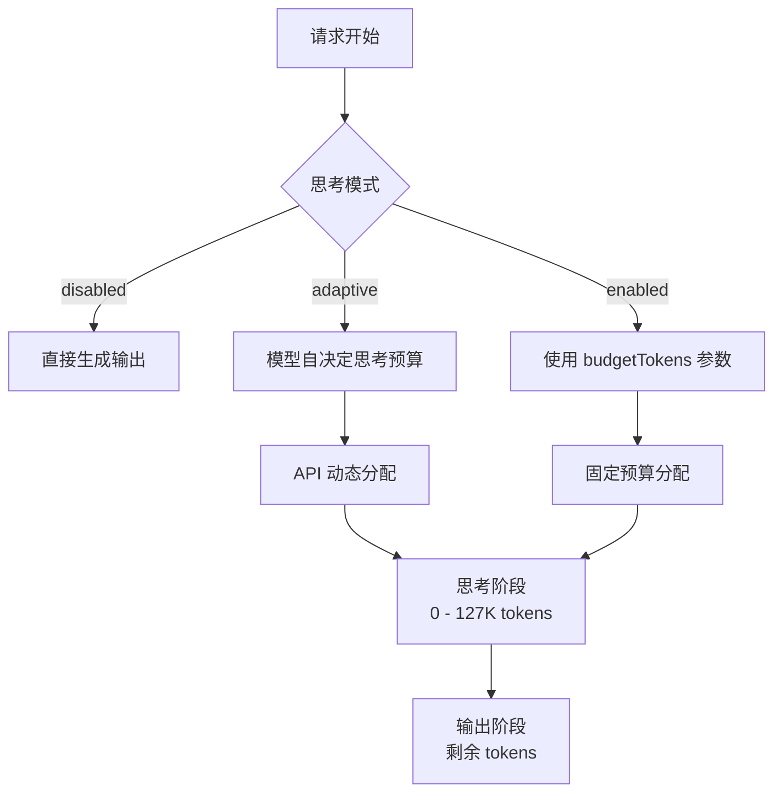

**思考与输出的平衡：**

```typescript
// 思考预算分配
interface ThinkingBudgetAllocation {
  totalBudget: number           // 总输出 token 预算
  thinkingTokens: number        // 思考 token 上限
  outputTokens: number          // 实际输出 token
}

// 示例：Opus 4.6 启用思考
const allocation: ThinkingBudgetAllocation = {
  totalBudget: 128_000,
  thinkingTokens: 60_000,       // 思考可以使用 60K
  outputTokens: 68_000,         // 输出可以使用 68K
}
```

### 8.1.3 思考内容压缩

思考内容在传输时可能需要压缩以减少带宽和处理开销：

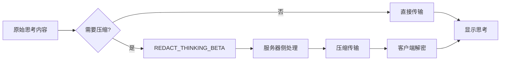

**压缩策略：**

1. **Beta 标记控制**：`REDACT_THINKING_BETA_HEADER`
2. **选择性传输**：仅传输思考摘要或结论
3. **本地缓存**：缓存常用思考模式

### 8.1.4 思考模式检测

```typescript
// src/utils/thinking.ts
export function modelSupportsThinking(model: string): boolean {
  const canonical = getCanonicalName(model)
  return (
    canonical.includes('claude-sonnet-4') ||
    canonical.includes('opus-4-6')
  )
}

export function modelSupportsAdaptiveThinking(model: string): boolean {
  const canonical = getCanonicalName(model)
  // 较新模型支持自适应思考
  return canonical.includes('opus-4-6') ||
         canonical.includes('sonnet-4-6')
}
```

**模型能力矩阵：**

| 模型 | 思考支持 | 自适应思考 | 最大思考 Token |
|------|---------|-----------|---------------|
| Claude Opus 4.6 | ✅ | ✅ | 127,999 |
| Claude Sonnet 4.6 | ✅ | ✅ | 127,999 |
| Claude Sonnet 4 | ✅ | ❌ | 63,999 |
| Claude Haiku 4 | ✅ | ❌ | 63,999 |
| Claude 3.5 Sonnet | ✅ | ❌ | 8,191 |

## 8.2 上下文窗口管理

### 8.2.1 上下文窗口架构

Claude Code 支持多种上下文窗口大小，从标准的 200K 到实验性的 1M tokens：

```typescript
// src/utils/context.ts
export const MODEL_CONTEXT_WINDOW_DEFAULT = 200_000

export function getContextWindowForModel(
  model: string,
  betas?: string[],
): number {
  // 1. 环境变量覆盖（Ant 专用）
  if (process.env.USER_TYPE === 'ant' && process.env.CLAUDE_CODE_MAX_CONTEXT_TOKENS) {
    return parseInt(process.env.CLAUDE_CODE_MAX_CONTEXT_TOKENS, 10)
  }

  // 2. 显式 [1m] 后缀
  if (has1mContext(model)) {
    return 1_000_000
  }

  // 3. 模型能力检测
  const cap = getModelCapability(model)
  if (cap?.max_input_tokens && cap.max_input_tokens >= 100_000) {
    return cap.max_input_tokens
  }

  // 4. Beta 头启用
  if (betas?.includes(CONTEXT_1M_BETA_HEADER) && modelSupports1M(model)) {
    return 1_000_000
  }

  // 5. 实验性功能
  if (getSonnet1mExpTreatmentEnabled(model)) {
    return 1_000_000
  }

  // 6. 默认值
  return MODEL_CONTEXT_WINDOW_DEFAULT
}
```

**设计意图：** 分层检测机制确保了灵活性和向后兼容性：
1. 环境变量提供最终控制权（用于调试和 HIPAA 合规）
2. 显式后缀提供用户可控的 opt-in
3. 模型能力检测提供自动化支持
4. Beta 头支持实验性功能
5. 默认值确保基本功能

### 8.2.2 上下文窗口决策树

```mermaid
flowchart TD
    A[getContextWindowForModel] --> B{Ant 用户?}
    B -->|是| C{设置环境变量?}
    B -->|否| D{模型包含 [1m]?}

    C -->|是| E[使用环境变量值]
    C -->|否| D

    D -->|是| F[返回 1,000,000]
    D -->|否| G{模型有 >=100K 能力?}

    G -->|是| H[使用模型能力值]
    G -->|否| I{Beta 头启用?}

    I -->|是| J{模型支持 1M?}
    I -->|否| K{实验性功能?}

    J -->|是| F
    J -->|否| K

    K -->|是| L{Sonnet 4.6?}
    K -->|否| M[返回 200,000]

    L -->|是| F
    L -->|否| M
```

### 8.2.3 最大输出令牌管理

```typescript
// src/utils/context.ts
export const CAPPED_DEFAULT_MAX_TOKENS = 8_000
export const ESCALATED_MAX_TOKENS = 64_000

export function getModelMaxOutputTokens(model: string): {
  default: number
  upperLimit: number
} {
  const m = getCanonicalName(model)

  if (m.includes('opus-4-6')) {
    return { default: 64_000, upperLimit: 128_000 }
  } else if (m.includes('sonnet-4-6')) {
    return { default: 32_000, upperLimit: 128_000 }
  } else if (m.includes('opus-4-5') || m.includes('sonnet-4')) {
    return { default: 32_000, upperLimit: 64_000 }
  }
  // ... 其他模型

  return { default: 32_000, upperLimit: 64_000 }
}
```

**槽位预留优化：**

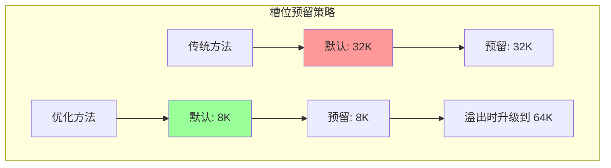

**设计意图：** 根据实际使用数据（BQ p99 输出 = 4,911 tokens），32K/64K 的默认值过度预留了 8-16 倍的槽位容量。使用 8K 的封顶默认值，<1% 的请求会触及限制；触及时通过一次干净的重试升级到 64K。

### 8.2.4 上下文百分比计算

```typescript
// src/utils/context.ts
export function calculateContextPercentages(
  currentUsage: {
    input_tokens: number
    cache_creation_input_tokens: number
    cache_read_input_tokens: number
  } | null,
  contextWindowSize: number,
): { used: number | null; remaining: number | null } {
  if (!currentUsage) {
    return { used: null, remaining: null }
  }

  const totalInputTokens =
    currentUsage.input_tokens +
    currentUsage.cache_creation_input_tokens +
    currentUsage.cache_read_input_tokens

  const usedPercentage = Math.round(
    (totalInputTokens / contextWindowSize) * 100,
  )

  return {
    used: Math.min(100, Math.max(0, usedPercentage)),
    remaining: 100 - Math.min(100, Math.max(0, usedPercentage)),
  }
}
```

**使用示例：**

```typescript
// 示例：200K 上下文窗口，使用了 50K tokens
const result = calculateContextPercentages(
  {
    input_tokens: 45000,
    cache_creation_input_tokens: 3000,
    cache_read_input_tokens: 2000,
  },
  200000
)

console.log(result)
// { used: 25, remaining: 75 }
```

### 8.2.5 动态上下文调整

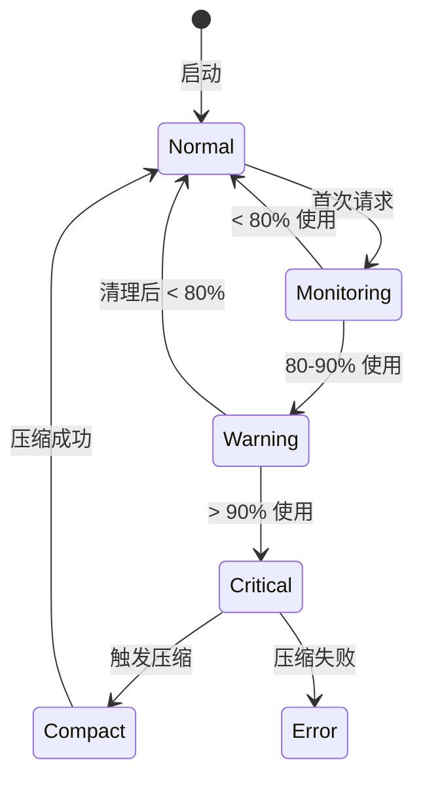

**压缩策略：**

1. **消息截断**：移除旧消息，保留最近的 N 条
2. **摘要压缩**：用 AI 生成旧消息的摘要
3. **工具结果优化**：只保留关键工具结果
4. **文件缓存管理**：使用 LRU 策略驱逐缓存

## 8.3 成本优化策略

### 8.3.1 成本追踪架构

```typescript
// src/cost-tracker.ts
export interface ModelUsage {
  inputTokens: number
  outputTokens: number
  cacheReadInputTokens: number
  cacheCreationInputTokens: number
  webSearchRequests: number
  costUSD: number
  contextWindow: number
  maxOutputTokens: number
}

export function addToTotalSessionCost(
  cost: number,
  usage: Usage,
  model: string,
): number {
  const modelUsage = addToTotalModelUsage(cost, usage, model)
  addToTotalCostState(cost, modelUsage, model)

  // 记录指标
  getCostCounter()?.add(cost, { model })
  getTokenCounter()?.add(usage.input_tokens, { model, type: 'input' })
  getTokenCounter()?.add(usage.output_tokens, { model, type: 'output' })

  return cost
}
```

**成本数据流：**

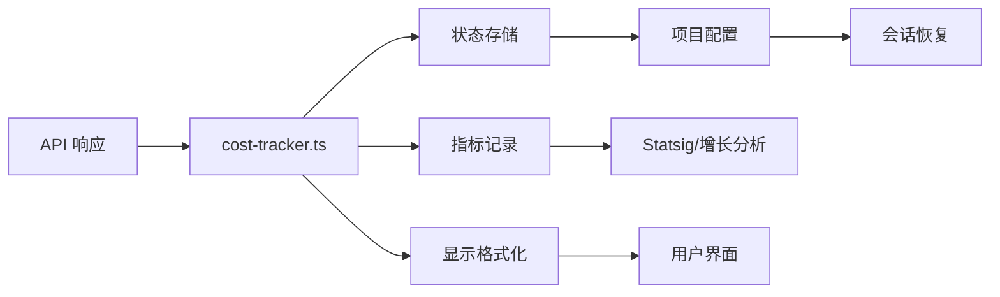

### 8.3.2 提示词缓存优化

提示词缓存（Prompt Caching）是降低成本的关键技术：

```typescript
// 缓存范围类型
type CacheScope =
  | 'disabled'           // 禁用缓存
  | 'ephemeral'          // 临时缓存（单次会话）
  | 'persistent'         // 持久缓存（跨会话）
  | 'global'             // 全局缓存（所有用户）

// 缓存 TTL 常量
const CACHE_TTL_5MIN_MS = 5 * 60 * 1000
const CACHE_TTL_1HOUR_MS = 60 * 60 * 1000
```

**缓存成本节省：**

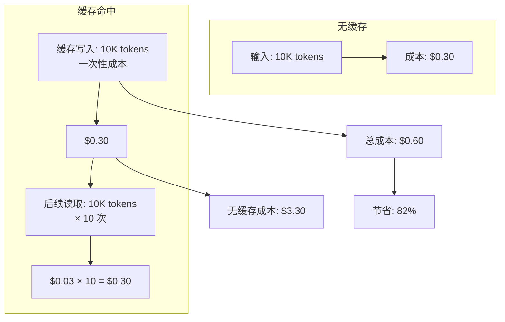

**缓存策略决策树：**

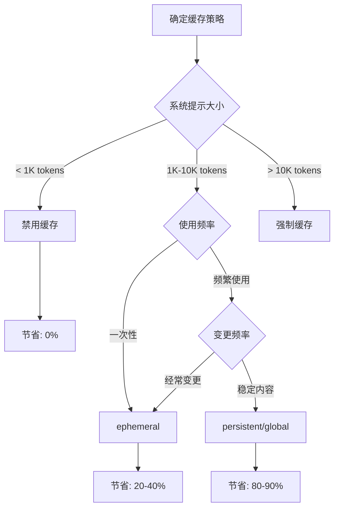

### 8.3.3 快速模式成本优化

快速模式（Fast Mode）通过使用低延迟模型来降低成本和时间：

```typescript
// 快速模式特性
interface FastModeConfig {
  enabled: boolean
  model: string
  cooldownUntil: number | null
  cooldownReason: 'overloaded' | 'rate_limit' | null
}

// 快速模式冷却逻辑
const DEFAULT_FAST_MODE_FALLBACK_HOLD_MS = 30 * 60 * 1000 // 30 分钟
const MIN_COOLDOWN_MS = 10 * 60 * 1000 // 10 分钟
```

**快速模式 vs 标准模式：**

| 维度 | 快速模式 | 标准模式 |
|------|---------|---------|
| 延迟 | ~30% | 100% |
| 成本 | ~50% | 100% |
| 质量 | ~95% | 100% |
| 缓存兼容 | 是 | 是 |

**快速模式状态转换：**

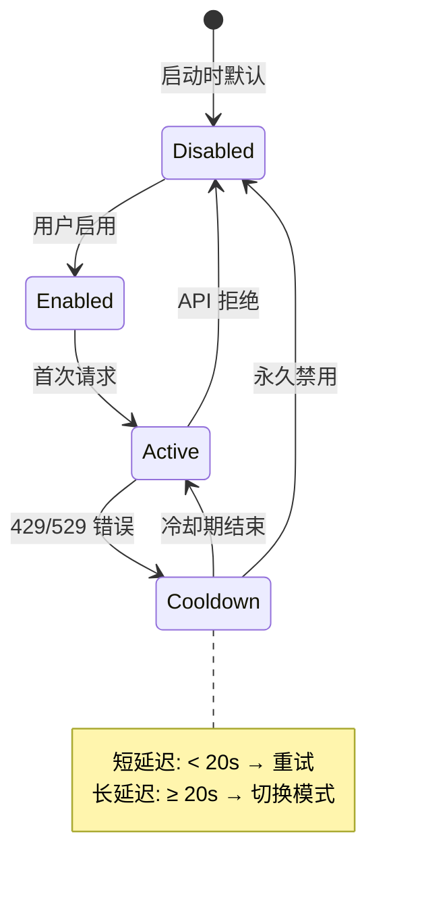

### 8.3.4 成本控制模式

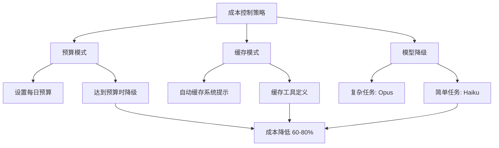

## 8.4 错误恢复与容错机制

### 8.4.1 重试策略架构

```typescript
// src/services/api/withRetry.ts
export async function* withRetry<T>(
  getClient: () => Promise<Anthropic>,
  operation: (client: Anthropic, attempt: number, context: RetryContext) => Promise<T>,
  options: RetryOptions,
): AsyncGenerator<SystemAPIErrorMessage, T> {
  const maxRetries = getMaxRetries(options)
  let consecutive529Errors = options.initialConsecutive529Errors ?? 0

  for (let attempt = 1; attempt <= maxRetries + 1; attempt++) {
    try {
      return await operation(client, attempt, retryContext)
    } catch (error) {
      // 错误处理和重试逻辑
      const delayMs = getRetryDelay(attempt, retryAfter)
      yield createSystemAPIErrorMessage(error, delayMs, attempt, maxRetries)
      await sleep(delayMs, options.signal, { abortError })
    }
  }
}
```

**重试决策流程：**

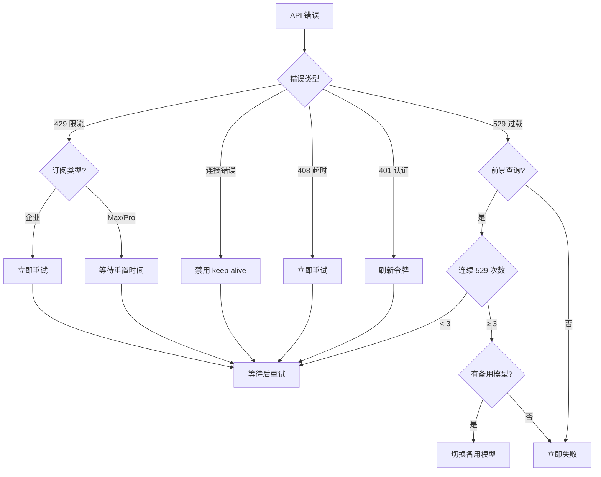

### 8.4.2 指数退避算法

```typescript
// src/services/api/withRetry.ts
export const BASE_DELAY_MS = 500
const PERSISTENT_MAX_BACKOFF_MS = 5 * 60 * 1000  // 5 分钟
const PERSISTENT_RESET_CAP_MS = 6 * 60 * 60 * 1000 // 6 小时

export function getRetryDelay(
  attempt: number,
  retryAfterHeader?: string | null,
  maxDelayMs = 32000,
): number {
  // 优先使用服务器指定的 Retry-After
  if (retryAfterHeader) {
    const seconds = parseInt(retryAfterHeader, 10)
    if (!isNaN(seconds)) {
      return seconds * 1000
    }
  }

  // 指数退避 + 抖动
  const baseDelay = Math.min(
    BASE_DELAY_MS * Math.pow(2, attempt - 1),
    maxDelayMs,
  )
  const jitter = Math.random() * 0.25 * baseDelay
  return baseDelay + jitter
}
```

**退避时间表：**

| 尝试 | 基础延迟 | 抖动范围 | 总延迟 |
|------|---------|---------|--------|
| 1 | 500ms | 0-125ms | 500-625ms |
| 2 | 1,000ms | 0-250ms | 1,000-1,250ms |
| 3 | 2,000ms | 0-500ms | 2,000-2,500ms |
| 4 | 4,000ms | 0-1,000ms | 4,000-5,000ms |
| 5 | 8,000ms | 0-2,000ms | 8,000-10,000ms |
| 6 | 16,000ms | 0-4,000ms | 16,000-20,000ms |
| 7+ | 32,000ms | 0-8,000ms | 32,000-40,000ms |

**抖动的作用：**

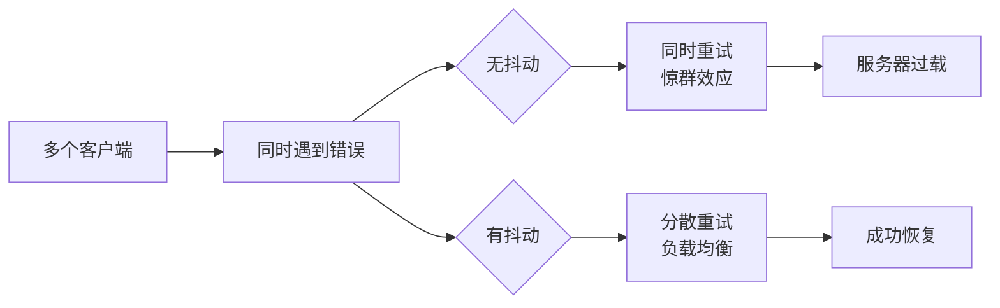

### 8.4.3 529 错误与模型降级

```typescript
// 529 错误处理
const MAX_529_RETRIES = 3
const FOREGROUND_529_RETRY_SOURCES = new Set<QuerySource>([
  'repl_main_thread',
  'sdk',
  'agent:custom',
  'agent:default',
  'agent:builtin',
  // ... 其他前景查询源
])

// 模型降级
if (consecutive529Errors >= MAX_529_RETRIES && options.fallbackModel) {
  throw new FallbackTriggeredError(
    options.model,
    options.fallbackModel,
  )
}
```

**模型降级策略：**

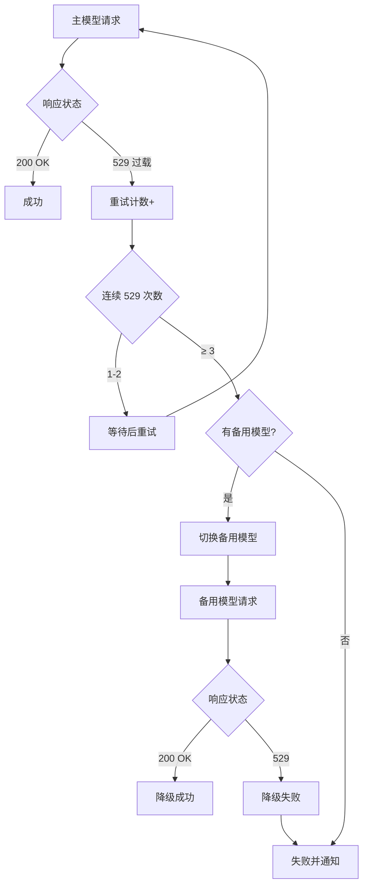

**降级候选模型：**

| 主模型 | 备用模型 | 性能影响 | 成本影响 |
|--------|---------|---------|---------|
| Opus 4.6 | Sonnet 4.6 | ~10% | -50% |
| Opus 4.6 | Sonnet 4 | ~20% | -70% |
| Sonnet 4.6 | Haiku 4 | ~40% | -90% |

### 8.4.4 持久重试模式

```typescript
// 环境变量启用
function isPersistentRetryEnabled(): boolean {
  return feature('UNATTENDED_RETRY')
    ? isEnvTruthy(process.env.CLAUDE_CODE_UNATTENDED_RETRY)
    : false
}

// 心跳机制
const HEARTBEAT_INTERVAL_MS = 30_000  // 30 秒

// 持久重试循环
if (persistent) {
  let remaining = delayMs
  while (remaining > 0) {
    yield createSystemAPIErrorMessage(error, remaining, attempt, maxRetries)
    const chunk = Math.min(remaining, HEARTBEAT_INTERVAL_MS)
    await sleep(chunk, options.signal, { abortError })
    remaining -= chunk
  }
}
```

**持久重试特性：**

1. **无限重试**：不受 maxRetries 限制
2. **长退避**：最大 5 分钟退避，6 小时重置上限
3. **心跳保持**：每 30 秒发送系统消息保持会话活跃
4. **速率限制等待**：尊重统一速率限制重置时间

**使用场景：**

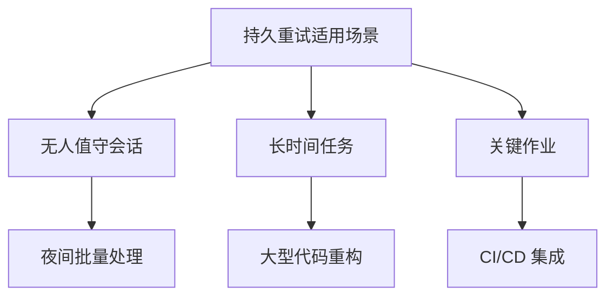

### 8.4.5 上下文溢出恢复

```typescript
// src/services/api/withRetry.ts
export function parseMaxTokensContextOverflowError(error: APIError):
  | { inputTokens: number; maxTokens: number; contextLimit: number }
  | undefined {
  if (error.status !== 400 || !error.message) {
    return undefined
  }

  // 解析: "input length and `max_tokens` exceed context limit: 188059 + 20000 > 200000"
  const regex = /input length and `max_tokens` exceed context limit: (\d+) \+ (\d+) > (\d+)/
  const match = error.message.match(regex)

  if (!match || match.length !== 4) {
    return undefined
  }

  return {
    inputTokens: parseInt(match[1], 10),
    maxTokens: parseInt(match[2], 10),
    contextLimit: parseInt(match[3], 10),
  }
}
```

**溢出恢复策略：**

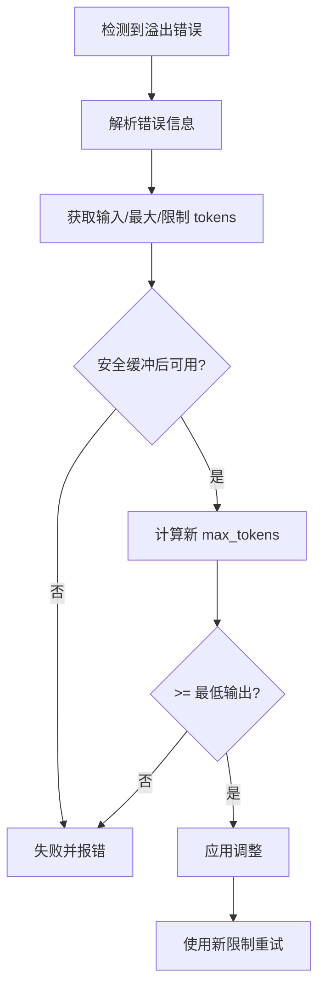

**调整计算示例：**

```typescript
// 示例：溢出场景
const overflow = {
  inputTokens: 188_059,
  maxTokens: 20_000,
  contextLimit: 200_000
}

const safetyBuffer = 1_000
const availableContext = Math.max(
  0,
  200_000 - 188_059 - 1_000  // 10,941
)

const FLOOR_OUTPUT_TOKENS = 3_000
const minRequired = thinkingBudget + 1

const adjustedMaxTokens = Math.max(
  FLOOR_OUTPUT_TOKENS,      // 3,000
  availableContext,         // 10,941
  minRequired               // thinking + 1
)

// 结果: 10,941 tokens
```

## 8.5 作者观点：高级特性的权衡

### 8.5.1 思考机制

**优点：**
- 复杂推理能力显著提升
- 对规划、分析任务特别有效
- 自适应模式减少了手动调优

**缺点：**
- 增加 API 成本（思考 token 也计费）
- 延迟增加（需要等待思考完成）
- 思考内容可能包含敏感信息

**改进建议：**
1. 提供更细粒度的思考预算控制
2. 允许用户选择是否保留思考内容
3. 添加思考成本预估

### 8.5.2 上下文管理

**优点：**
- 200K 上下文适用于大多数场景
- 1M 上下文支持超大文件处理
- 动态调整减少了内存占用

**缺点：**
- 大上下文增加处理延迟
- 缓存失效更频繁
- 模型可能"迷失"在长上下文中

**改进建议：**
1. 实现智能上下文摘要
2. 添加上下文分块机制
3. 提供上下文使用预警

### 8.5.3 成本优化

**优点：**
- 缓存机制节省 80%+ 成本
- 快速模式提供性价比平衡
- 详细的成本追踪

**缺点：**
- 缓存策略增加了复杂性
- 快速模式可能降低质量
- 成本追踪本身有开销

**改进建议：**
1. 简化缓存配置
2. 提供成本预测功能
3. 优化成本追踪性能

### 8.5.4 错误恢复

**优点：**
- 多层重试机制提高了可靠性
- 指数退避避免了惊群效应
- 模型降级提供了优雅降级

**缺点：**
- 重试增加了总延迟
- 持久重试可能消耗大量配额
- 降级可能影响用户体验

**改进建议：**
1. 添加用户可选的快速失败模式
2. 提供更精细的重试控制
3. 改进降级通知机制

## 可复用模式总结

### 模式 10：指数退避重试

**描述：** 在重试失败操作时，每次重试的等待时间按指数增长，并添加随机抖动。

**适用场景：**
- 网络请求重试
- API 调用失败恢复
- 分布式系统容错

**代码模板：**
```typescript
function getRetryDelay(attempt: number, maxDelayMs: number): number {
  const baseDelay = Math.min(
    BASE_DELAY_MS * Math.pow(2, attempt - 1),
    maxDelayMs,
  )
  const jitter = Math.random() * 0.25 * baseDelay
  return baseDelay + jitter
}
```

**关键点：**
1. 基础延迟按指数增长
2. 添加随机抖动避免同步
3. 设置最大延迟上限

### 模式 11：优雅降级

**描述：** 当主服务不可用时，自动切换到备用服务，保证基本功能可用。

**适用场景：**
- 服务过载时的降级
- 主从切换
- 多层级服务架构

**代码模板：**
```typescript
if (consecutiveFailures >= MAX_RETRIES && fallbackService) {
  throw new FallbackTriggeredError(primaryService, fallbackService)
}
```

**关键点：**
1. 设置合理的降级阈值
2. 确保备用服务独立
3. 记录降级事件用于分析

### 模式 12：分层缓存

**描述：** 根据数据特性和使用模式，使用不同 TTL 和范围的缓存策略。

**适用场景：**
- 系统提示缓存
- API 响应缓存
- 配置数据缓存

**代码模板：**
```typescript
type CacheScope = 'disabled' | 'ephemeral' | 'persistent' | 'global'

function getCacheScope(dataSize: number, frequency: number): CacheScope {
  if (dataSize < 1000) return 'disabled'
  if (frequency < 2) return 'ephemeral'
  return 'persistent'
}
```

**关键点：**
1. 根据数据大小选择策略
2. 根据使用频率调整 TTL
3. 考虑数据变更频率

## 本章小结

本章深入分析了 QueryEngine 的高级特性：

1. **扩展思考机制**：三种模式、预算算法、内容压缩
2. **上下文窗口管理**：200K/1M 上下文、动态调整、百分比计算
3. **成本优化策略**：缓存优化、快速模式、成本追踪
4. **错误恢复机制**：指数退避、模型降级、持久重试、溢出恢复

## 下一章预告

第 9 章将深入分析工具系统的架构设计。
