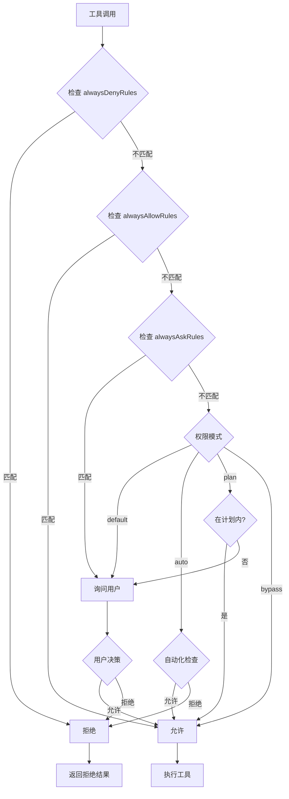
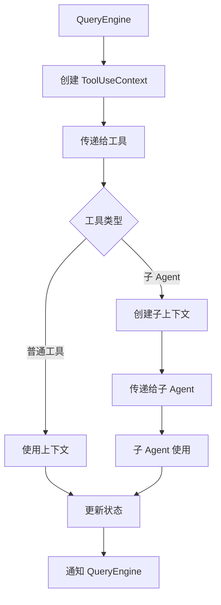

# 第 8 章：工具系统架构（一）：Tool 类型与注册

> 本章目标：理解工具系统的类型定义和注册机制。

## 8.1 Tool 类型体系

### Tool 接口定义

```typescript
// src/Tool.ts:362-500
export type Tool<
  Input extends AnyObject = AnyObject,
  Output = unknown,
  P extends ToolProgressData = ToolProgressData,
> = {
  /**
   * Optional aliases for backwards compatibility when a tool is renamed.
   * The tool can be looked up by any of these names in addition to its primary name.
   */
  aliases?: string[]

  /**
   * One-line capability phrase used by ToolSearch for keyword matching.
   * Helps the model find this tool via keyword search when it's deferred.
   * 3–10 words, no trailing period.
   * Prefer terms not already in the tool name (e.g. 'jupyter' for NotebookEdit).
   */
  searchHint?: string

  /**
   * 核心方法：执行工具
   */
  call(
    args: z.infer<Input>,
    context: ToolUseContext,
    canUseTool: CanUseToolFn,
    parentMessage: AssistantMessage,
    onProgress?: ToolCallProgress<P>,
  ): Promise<ToolResult<Output>>

  /**
   * 生成工具描述
   */
  description(
    input: z.infer<Input>,
    options: {
      isNonInteractiveSession: boolean
      toolPermissionContext: ToolPermissionContext
      tools: Tools
    },
  ): Promise<string>

  /**
   * 输入参数 schema (Zod)
   */
  readonly inputSchema: Input

  /**
   * 输入参数 JSON Schema (用于 MCP 工具)
   */
  readonly inputJSONSchema?: ToolInputJSONSchema

  /**
   * 输出 schema
   */
  outputSchema?: z.ZodType<unknown>

  /**
   * 参数等价性检查
   */
  inputsEquivalent?(a: z.infer<Input>, b: z.infer<Input>): boolean

  /**
   * 并发安全性检查
   */
  isConcurrencySafe(input: z.infer<Input>): boolean

  /**
   * 是否启用
   */
  isEnabled(): boolean

  /**
   * 是否只读操作
   */
  isReadOnly(input: z.infer<Input>): boolean

  /**
   * 是否为破坏性操作
   */
  isDestructive?(input: z.infer<Input>): boolean

  /**
   * 中断行为
   */
  interruptBehavior?(): 'cancel' | 'block'

  /**
   * 搜索或读取命令检测
   */
  isSearchOrReadCommand?(input: z.infer<Input>): {
    isSearch: boolean
    isRead: boolean
    isList?: boolean
  }

  /**
   * 开放世界检测（是否访问外部资源）
   */
  isOpenWorld?(input: z.infer<Input>): boolean

  /**
   * 是否需要用户交互
   */
  requiresUserInteraction?(): boolean

  /**
   * 是否为 MCP 工具
   */
  isMcp?: boolean

  /**
   * 是否为 LSP 工具
   */
  isLsp?: boolean

  /**
   * 是否延迟加载
   */
  readonly shouldDefer?: boolean

  /**
   * 是否始终加载
   */
  readonly alwaysLoad?: boolean

  /**
   * MCP 工具信息
   */
  mcpInfo?: { serverName: string; toolName: string }

  /**
   * 工具名称
   */
  readonly name: string

  /**
   * 最大结果大小（字符数）
   */
  maxResultSizeChars: number

  /**
   * 严格模式
   */
  readonly strict?: boolean

  /**
   * 填充可观察输入
   */
  backfillObservableInput?(input: Record<string, unknown>): void

  /**
   * 输入验证
   */
  validateInput?(
    input: z.infer<Input>,
    context: ToolUseContext,
  ): Promise<ValidationResult>

  /**
   * 权限检查
   */
  checkPermissions(
    input: z.infer<Input>,
    context: ToolUseContext,
  ): PermissionResult

  /**
   * 工具进度类型
   */
  readonly progressType?: P
}
```

### ToolInputJSONSchema 设计

```typescript
// src/Tool.ts:15-21
export type ToolInputJSONSchema = {
  [x: string]: unknown
  type: 'object'
  properties?: {
    [x: string]: unknown
  }
}

// 使用示例
const fileReadToolSchema: ToolInputJSONSchema = {
  type: 'object',
  properties: {
    filePath: {
      type: 'string',
      description: 'The file to read'
    },
    offset: {
      type: 'number',
      description: 'The line number to start reading from'
    },
    limit: {
      type: 'number',
      description: 'The maximum number of lines to read'
    }
  },
  required: ['filePath']
}
```

### 工具元数据结构

```typescript
// 工具元数据
export type ToolMetadata = {
  name: string
  displayName: string
  description: string
  category: ToolCategory
  enabled: boolean
  readonly?: boolean
  dangerous?: boolean
  requiresApproval?: string[]
}

// 工具分类
export type ToolCategory =
  | 'file'        // 文件操作
  | 'search'      // 搜索
  | 'execution'   // 命令执行
  | 'agent'       // Agent 管理
  | 'mode'        // 模式切换
  | 'system'      // 系统操作
  | 'mcp'         // MCP 工具
```

## 8.2 工具注册机制

### tools.ts 注册表

```typescript
// src/tools.ts:199-250
export function getAllBaseTools(): Tools {
  return [
    // 文件工具
    FileReadTool,
    FileWriteTool,
    FileEditTool,
    NotebookEditTool,

    // 搜索工具
    GrepTool,
    GlobTool,
    WebSearchTool,
    WebFetchTool,

    // 执行工具
    BashTool,
    // PowerShellTool (条件加载)
    ...(isPowerShellToolEnabled() ? [PowerShellTool()] : []),

    // Agent 工具
    AgentTool,

    // 模式工具
    EnterPlanModeTool,
    ExitPlanModeV2Tool,
    EnterWorktreeTool,
    ExitWorktreeTool,

    // 任务工具
    TaskCreateTool,
    TaskUpdateTool,
    TaskGetTool,
    TaskListTool,
    TaskOutputTool,
    TaskStopTool,

    // 命令工具
    ConfigTool,
    BriefTool,

    // 技能工具
    SkillTool,

    // 特性门控工具
    ...(feature('PROACTIVE') || feature('KAIROS') ? [SleepTool] : []),
    ...(feature('AGENT_TRIGGERS') ? cronTools : []),
    ...(feature('MONITOR_TOOL') ? [MonitorTool] : []),

    // MCP 工具
    MCPTool,
    ListMcpResourcesTool,
    ReadMcpResourceTool,

    // LSP 工具
    LSPTool,

    // 工具搜索
    ToolSearchTool,

    // 用户交互
    AskUserQuestionTool,

    // 团队工具（延迟加载）
    // TeamCreateTool, TeamDeleteTool, SendMessageTool

    // 其他...
    TodoWriteTool,
    SYNTHETIC_OUTPUT_TOOL_NAME,
  ].filter(tool => tool.isEnabled())
}
```

### 动态工具发现

```typescript
// MCP 工具动态发现
async function discoverMCPTools(
  mcpClients: MCPServerConnection[],
): Promise<Tools> {
  const tools: Tools = []

  for (const client of mcpClients) {
    // 调用 MCP 服务器的 tools/list 方法
    const response = await client.listTools()

    for (const tool of response.tools) {
      tools.push(createMCPTool(client, tool))
    }
  }

  return tools
}

// 创建 MCP 工具包装器
function createMCPTool(
  client: MCPServerConnection,
  toolDefinition: MCPToolDefinition,
): Tool {
  return {
    name: `${client.name}/${toolDefinition.name}`,
    call: async (args, context) => {
      return await client.callTool(toolDefinition.name, args)
    },
    description: async () => toolDefinition.description,
    inputSchema: toolDefinition.inputSchema,
    isMcp: true,
    mcpInfo: {
      serverName: client.name,
      toolName: toolDefinition.name,
    },
    // ... 其他方法
  }
}
```

### 工具覆盖与扩展

```typescript
// 插件工具注册
export function registerPluginTools(
  plugin: LoadedPlugin,
): Tools {
  const tools: Tools = []

  if (plugin.manifest.tools) {
    for (const toolDef of plugin.manifest.tools) {
      const tool = createPluginTool(plugin, toolDef)
      tools.push(tool)
    }
  }

  return tools
}

// 技能工具注册
export function registerSkillTools(
  skills: Skill[],
): Tools {
  const tools: Tools = []

  for (const skill of skills) {
    if (skill.tools) {
      for (const toolDef of skill.tools) {
        tools.push(createSkillTool(skill, toolDef))
      }
    }
  }

  return tools
}

// 工具覆盖
export function overrideTool(
  baseTools: Tools,
  overrides: Partial<Tool>[],
): Tools {
  const overrideMap = new Map(overrides.map(o => [o.name, o]))

  return baseTools.map(tool => {
    const override = overrideMap.get(tool.name)
    return override ? { ...tool, ...override } : tool
  })
}
```

## 8.3 工具权限模型

### PermissionContext 设计

```typescript
// src/Tool.ts:123-138
export type ToolPermissionContext = DeepImmutable<{
  // 权限模式
  mode: PermissionMode

  // 额外工作目录
  additionalWorkingDirectories: Map<string, AdditionalWorkingDirectory>

  // 始终允许规则
  alwaysAllowRules: ToolPermissionRulesBySource

  // 始终拒绝规则
  alwaysDenyRules: ToolPermissionRulesBySource

  // 始终询问规则
  alwaysAskRules: ToolPermissionRulesBySource

  // 是否可用绕过权限模式
  isBypassPermissionsModeAvailable: boolean

  // 是否可用自动模式
  isAutoModeAvailable?: boolean

  // 已剥离危险规则
  strippedDangerousRules?: ToolPermissionRulesBySource

  // 是否应避免权限提示
  shouldAvoidPermissionPrompts?: boolean

  // 是否在对话框前等待自动化检查
  awaitAutomatedChecksBeforeDialog?: boolean

  // Plan mode 之前的权限模式
  prePlanMode?: PermissionMode
}>
```

### 权限规则类型

```typescript
// src/types/permissions.ts
export type PermissionRule =
  | string                    // 简单通配符模式
  | {
      tool?: string           // 工具名称模式
      input?: InputRule       // 输入匹配规则
    }

export type InputRule =
  | string                    // JSON 路径通配符
  | {
      path?: string           // JSON 路径
      pattern?: string        // 正则表达式
      value?: unknown         // 精确值匹配
    }

export type ToolPermissionRulesBySource = {
  [source: string]: PermissionRule[]
}

// 示例
const rules: ToolPermissionRulesBySource = {
  user: [
    // 允许读取任何 .ts 文件
    { tool: 'FileRead', input: { path: '$.filePath', pattern: '.*\\.ts$' } },

    // 允许读取 package.json
    { tool: 'FileRead', input: { path: '$.filePath', value: 'package.json' } },

    // 拒绝删除操作
    { tool: 'Bash', input: { pattern: '^(rm|del).*' } },
  ],
  organization: [
    // 组织级规则
  ],
}
```

### 权限检查流程



## 8.4 工具执行上下文

### ToolUseContext 详解

```typescript
// src/Tool.ts:158-300
export type ToolUseContext = {
  // 选项
  options: {
    commands: Command[]
    debug: boolean
    mainLoopModel: string
    tools: Tools
    verbose: boolean
    thinkingConfig: ThinkingConfig
    mcpClients: MCPServerConnection[]
    mcpResources: Record<string, ServerResource[]>
    isNonInteractiveSession: boolean
    agentDefinitions: AgentDefinitionsResult
    maxBudgetUsd?: number
    customSystemPrompt?: string
    appendSystemPrompt?: string
    querySource?: QuerySource
    refreshTools?: () => Tools
  }

  // 中止控制器
  abortController: AbortController

  // 文件读取缓存
  readFileState: FileStateCache

  // 状态访问
  getAppState(): AppState
  setAppState(f: (prev: AppState) => AppState): void

  // 会话作用域的状态更新（用于后台任务）
  setAppStateForTasks?: (f: (prev: AppState) => AppState) => void

  // URL 请求处理
  handleElicitation?: (
    serverName: string,
    params: ElicitRequestURLParams,
    signal: AbortSignal,
  ) => Promise<ElicitResult>

  // JSX 设置
  setToolJSX?: SetToolJSXFn

  // 通知
  addNotification?: (notif: Notification) => void

  // 系统消息
  appendSystemMessage?: (
    msg: Exclude<SystemMessage, SystemLocalCommandMessage>,
  ) => void

  // OS 级通知
  sendOSNotification?: (opts: {
    message: string
    notificationType: string
  }) => void

  // 嵌套内存触发器
  nestedMemoryAttachmentTriggers?: Set<string>
  loadedNestedMemoryPaths?: Set<string>

  // 动态技能目录
  dynamicSkillDirTriggers?: Set<string>

  // 发现的技能名称
  discoveredSkillNames?: Set<string>

  // 用户修改标记
  userModified?: boolean

  // 进行中的工具 ID
  setInProgressToolUseIDs: (f: (prev: Set<string>) => Set<string>) => void

  // 可中断工具标记
  setHasInterruptibleToolInProgress?: (v: boolean) => void

  // 响应长度
  setResponseLength: (f: (prev: number) => number) => void

  // API 指标
  pushApiMetricsEntry?: (ttftMs: number) => void

  // 流模式
  setStreamMode?: (mode: SpinnerMode) => void

  // 压缩进度
  onCompactProgress?: (event: CompactProgressEvent) => void

  // SDK 状态
  setSDKStatus?: (status: SDKStatus) => void

  // 消息选择器
  openMessageSelector?: () => void

  // 文件历史更新
  updateFileHistoryState: (
    updater: (prev: FileHistoryState) => FileHistoryState,
  ) => void

  // 归因状态更新
  updateAttributionState: (
    updater: (prev: AttributionState) => AttributionState,
  ) => void

  // 会话 ID 设置
  setConversationId?: (id: UUID) => void

  // Agent ID（仅子 Agent）
  agentId?: AgentId

  // Agent 类型
  agentType?: string

  // 强制 canUseTool
  requireCanUseTool?: boolean

  // 消息历史
  messages: Message[]

  // 文件读取限制
  fileReadingLimits?: {
    maxTokens?: number
    maxSizeBytes?: number
  }

  // Glob 限制
  globLimits?: {
    maxResults?: number
  }

  // 工具决策缓存
  toolDecisions?: Map<
    string,
    {
      source: string
      decision: 'accept' | 'reject'
      timestamp: number
    }
  >

  // 查询跟踪
  queryTracking?: QueryChainTracking

  // 权限请求
  requestPrompt?: (
    sourceName: string,
    toolInputSummary?: string | null,
  ) => (request: PromptRequest) => Promise<PromptResponse>

  // 工具使用 ID
  toolUseId?: string

  // 关键系统提醒
  criticalSystemReminder_EXPERIMENTAL?: string

  // 保留工具结果
  preserveToolUseResults?: boolean

  // 本地拒绝跟踪
  localDenialTracking?: DenialTrackingState

  // 内容替换状态
  contentReplacementState?: ContentReplacementState

  // 渲染的系统提示
  renderedSystemPrompt?: SystemPrompt
}
```

### 上下文传递机制



```typescript
// 子 Agent 上下文创建
export function createSubagentContext(
  parentContext: ToolUseContext,
  options: {
    agentId: AgentId
    agentType: string
    preserveToolUseResults?: boolean
  },
): ToolUseContext {
  return {
    ...parentContext,
    agentId: options.agentId,
    agentType: options.agentType,
    preserveToolUseResults: options.preserveToolUseResults ?? false,

    // 子 Agent 不直接更新父状态
    setAppState: () => {},  // no-op

    // 但可以通过 setAppStateForTasks 更新会话级状态
    setAppStateForTasks: parentContext.setAppStateForTasks ?? parentContext.setAppState,

    // 继承消息历史
    messages: [...parentContext.messages],

    // 继承文件缓存
    readFileState: cloneFileStateCache(parentContext.readFileState),
  }
}
```

## 8.5 工具进度报告

### ToolProgressData 设计

```typescript
// src/types/tools.ts
export type ToolProgressData =
  | BashProgress
  | AgentToolProgress
  | MCPProgress
  | REPLToolProgress
  | SkillToolProgress
  | TaskOutputProgress
  | WebSearchProgress

// Bash 进度
export type BashProgress = {
  type: 'bash'
  status: 'running' | 'completed' | 'error'
  command: string
  output?: string
  error?: string
}

// Agent 进度
export type AgentToolProgress = {
  type: 'agent'
  agentId: string
  agentType: string
  status: 'running' | 'completed' | 'error'
  message?: string
}

// MCP 进度
export type MCPProgress = {
  type: 'mcp'
  serverName: string
  toolName: string
  status: 'running' | 'completed' | 'error'
  result?: unknown
  error?: string
}

// 任务进度
export type TaskOutputProgress = {
  type: 'task'
  taskId: string
  status: 'running' | 'completed' | 'error'
  output?: string
  error?: string
}
```

### 进度更新机制

```typescript
// 进度更新
export type ToolProgress<P extends ToolProgressData> = {
  toolUseID: string
  data: P
}

export type ToolCallProgress<P extends ToolProgressData> = (
  progress: ToolProgress<P>,
) => void

// 在工具中使用
async function callTool(
  tool: Tool,
  input: unknown,
  onProgress?: ToolCallProgress<ToolProgressData>,
): Promise<ToolResult> {
  // 报告开始
  onProgress?.({
    toolUseID: generateId(),
    data: { type: 'bash', status: 'running', command: input.command },
  })

  try {
    const result = await tool.call(input, context)

    // 报告完成
    onProgress?.({
      toolUseID: generateId(),
      data: { type: 'bash', status: 'completed' },
    })

    return result
  } catch (error) {
    // 报告错误
    onProgress?.({
      toolUseID: generateId(),
      data: { type: 'bash', status: 'error', error: String(error) },
    })

    throw error
  }
}
```

### UI 渲染协调

```typescript
// React 组件中的进度渲染
function ToolProgress({ toolUseId }: { toolUseId: string }) {
  const progress = useAppState(state =>
    state.progressMessages.find(p => p.toolUseId === toolUseId)
  )

  if (!progress) return null

  switch (progress.data.type) {
    case 'bash':
      return <BashSpinner status={progress.data.status} />
    case 'agent':
      return <AgentSpinner agentId={progress.data.agentId} />
    case 'mcp':
      return <MCPSpinner server={progress.data.serverName} />
    default:
      return <Spinner />
  }
}
```

## 8.6 可复用模式总结

### 模式 18：类型驱动的工具系统

**描述：** 使用 TypeScript 类型定义工具接口，确保类型安全和代码提示。

**适用场景：**
- 需要严格类型检查的系统
- 复杂的工具接口
- 多种工具类型

**代码模板：**

```typescript
// 定义基础类型
type ToolInput<Args extends z.ZodType> = z.infer<Args>
type ToolOutput = unknown

// 定义工具接口
interface Tool<I extends z.ZodType, O = ToolOutput> {
  name: string
  inputSchema: I
  outputSchema?: z.ZodType<O>
  call(args: ToolInput<I>, context: Context): Promise<ToolResult<O>>
  description(args: ToolInput<I>): string
}

// 工具构建器
function defineTool<I extends z.ZodType, O = ToolOutput>(
  config: {
    name: string
    inputSchema: I
    outputSchema?: z.ZodType<O>
    call: (args: ToolInput<I>, ctx: Context) => Promise<ToolResult<O>>
    description: (args: ToolInput<I>) => string
  }
): Tool<I, O> {
  return {
    name: config.name,
    inputSchema: config.inputSchema,
    outputSchema: config.outputSchema,
    call: config.call,
    description: config.description,
  }
}

// 使用
const FileReadTool = defineTool(
  z.object({
    filePath: z.string(),
    offset: z.number().optional(),
    limit: z.number().optional(),
  }),
  {
    call: async (args, ctx) => {
      return { data: await readFile(args.filePath) }
    },
    description: (args) => `Read file ${args.filePath}`,
  }
)
```

**关键点：**
1. 使用 Zod 定义输入 schema
2. 类型推断自动生成
3. 严格的类型检查
4. 完整的代码提示

### 模式 19：基于模式匹配的权限控制

**描述：** 使用模式匹配规则来控制工具权限，支持通配符和复杂条件。

**适用场景：**
- 复杂的权限控制需求
- 规则化权限管理
- 策略驱动的安全

**代码模板：**

```typescript
// 权限规则类型
type PermissionRule =
  | string                              // 简单通配符
  | { tool?: string; input?: InputRule }  // 结构化规则

type InputRule =
  | string
  | { path?: string; pattern?: string; value?: unknown }

// 规则匹配器
class PermissionMatcher {
  match(rule: PermissionRule, tool: string, input: unknown): boolean {
    // 简单字符串规则
    if (typeof rule === 'string') {
      return this.matchWildcard(rule, tool)
    }

    // 结构化规则
    if (rule.tool && !this.matchWildcard(rule.tool, tool)) {
      return false
    }

    if (rule.input && input) {
      return this.matchInput(rule.input, input)
    }

    return true
  }

  private matchWildcard(pattern: string, value: string): boolean {
    // 实现通配符匹配
    const regex = new RegExp(
      '^' + pattern.replace(/\*/g, '.*').replace(/\?/g, '.') + '$'
    )
    return regex.test(value)
  }

  private matchInput(rule: InputRule, input: unknown): boolean {
    if (typeof rule === 'string') {
      // JSONPath 匹配
      return this.matchJSONPath(rule, input)
    }

    if (rule.pattern) {
      // 正则匹配
      return new RegExp(rule.pattern).test(String(input))
    }

    if (rule.value !== undefined) {
      // 精确匹配
      return input === rule.value
    }

    return true
  }

  private matchJSONPath(path: string, obj: unknown): boolean {
    // 简化的 JSONPath 实现
    const parts = path.split('.')
    let current: unknown = obj

    for (const part of parts) {
      if (current == null || typeof current !== 'object') {
        return false
      }
      current = (current as Record<string, unknown>)[part]
    }

    return current !== undefined
  }
}

// 使用
const matcher = new PermissionMatcher()

const rules: PermissionRule[] = [
  'File*',                    // 所有以 File 开头的工具
  { tool: 'Bash', input: { path: '$.command', pattern: '^git.*' } },  // git 命令
]

const allowed = rules.some(rule => matcher.match(rule, 'FileRead', { filePath: 'test.txt' }))
```

**关键点：**
1. 灵活的规则语法
2. 通配符支持
3. 输入内容匹配
4. JSONPath 支持

---

## 本章小结

本章分析了工具系统的类型定义和注册机制：

1. **Tool 类型体系**：完整的接口定义、JSON Schema、元数据
2. **工具注册**：tools.ts 注册表、动态发现、覆盖扩展
3. **权限模型**：PermissionContext、规则类型、检查流程
4. **执行上下文**：ToolUseContext、传递机制、子 Agent 上下文
5. **进度报告**：ToolProgressData、更新机制、UI 协调
6. **可复用模式**：类型驱动工具系统、模式匹配权限控制

## 下一章预告

第 9 章将深入分析文件操作工具的实现。
