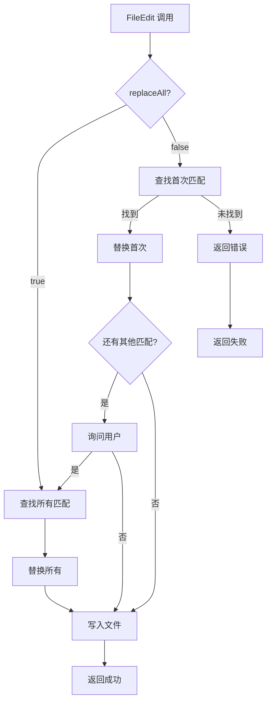

# 第 9 章：工具系统架构（二）：文件操作工具

> 本章目标：深入分析文件读写编辑工具的实现。

## 9.1 FileReadTool 详解

### 文件读取实现

```typescript
// src/tools/FileReadTool/FileReadTool.ts
import { buildTool } from '../../Tool.js'
import { z } from 'zod/v4'

export const FileReadTool = buildTool({
  // 工具名称
  name: FILE_READ_TOOL_NAME,

  // 输入 schema
  inputSchema: z.object({
    filePath: z.string().describe('The file to read'),
    offset: z.number().optional().describe('The line number to start reading from'),
    limit: z.number().optional().describe('The maximum number of lines to read'),
  }),

  // 执行方法
  call: async (args, context) => {
    const { filePath, offset, limit } = args

    // 1. 路径验证
    const resolvedPath = expandPath(filePath, context.options.cwd)

    // 2. 权限检查
    const permission = await checkReadPermissionForTool(resolvedPath, context)
    if (permission.behavior !== 'allow') {
      return {
        data: '',
        newMessages: [{
          type: 'system',
          content: permission.message,
        }],
      }
    }

    // 3. 读取文件
    try {
      const content = await readFileInRange(resolvedPath, { offset, limit })
      return { data: content }
    } catch (error) {
      if (isENOENT(error)) {
        // 文件不存在
        const suggestion = await findSimilarFile(filePath, context)
        return {
          data: FILE_NOT_FOUND_CWD_NOTE,
          newMessages: [{
            type: 'system',
            content: `File not found: ${filePath}${suggestion ? `\nDid you mean: ${suggestion}?` : ''}`,
          }],
        }
      }
      throw error
    }
  },

  // 描述生成
  description: async (input) => {
    const { filePath } = input
    return `Read the file ${filePath}`
  },

  // 只读操作
  isReadOnly: () => true,

  // 是否启用
  isEnabled: () => true,

  // 最大结果大小
  maxResultSizeChars: Infinity,  // 不持久化大结果

  // 其他方法...
})
```

### 图片处理逻辑

```typescript
// src/tools/FileReadTool/imageProcessor.ts
export async function processImageFile(
  filePath: string,
  limits: FileReadingLimits,
): Promise<ImageResult> {
  // 1. 读取文件
  const buffer = await readFileAsync(filePath)

  // 2. 检测格式
  const format = detectImageFormatFromBuffer(buffer)

  // 3. 获取尺寸
  const dimensions = await getImageDimensions(buffer)

  // 4. 压缩（如果需要）
  let processedBuffer = buffer
  const estimatedTokens = roughTokenCountEstimationForFileType(
    filePath,
    buffer.length,
  )

  if (estimatedTokens > limits.maxTokens) {
    processedBuffer = await compressImageBufferWithTokenLimit(
      buffer,
      limits.maxTokens,
      format,
    )
  }

  // 5. 创建图片元数据
  const metadata = createImageMetadataText({
    format,
    originalSize: buffer.length,
    compressedSize: processedBuffer.length,
    dimensions,
  })

  // 6. 转换为 base64
  const base64 = processedBuffer.toString('base64')

  return {
    type: 'image',
    mediaType: `image/${format}`,
    source: {
      type: 'base64',
      media_type: `image/${format}`,
      data: base64,
    },
    metadata,
  }
}
```

### PDF 解析

```typescript
// src/utils/pdf.ts
export async function readPDF(
  filePath: string,
  options?: {
    pages?: string | number[]  // 页码或页码范围
    extractImages?: boolean
  },
): Promise<PDFResult> {
  // 1. 获取总页数
  const totalPages = await getPDFPageCount(filePath)

  // 2. 解析页码范围
  const pagesToExtract = options?.pages
    ? parsePDFPageRange(options.pages, totalPages)
    : Array.from({ length: totalPages }, (_, i) => i + 1)

  // 3. 提取文本
  const extracted = await extractPDFPages(filePath, {
    pages: pagesToExtract,
    extractImages: options?.extractImages ?? false,
  })

  return {
    text: extracted.text,
    pages: extracted.pages,
    images: extracted.images,
    totalPages,
    extractedPages: pagesToExtract.length,
  }
}

// 页面范围解析
function parsePDFPageRange(
  pages: string | number[],
  totalPages: number,
): number[] {
  if (Array.isArray(pages)) {
    return pages
  }

  // 支持 "1-5", "1,3,5", "1-3,5-7" 等格式
  const ranges = pages.split(',')
  const result: number[] = []

  for (const range of ranges) {
    const [start, end] = range.split('-').map(Number)

    if (end === undefined) {
      result.push(start)
    } else {
      for (let i = start; i <= end; i++) {
        result.push(i)
      }
    }
  }

  // 验证范围
  return result.filter(p => p >= 1 && p <= totalPages)
}
```

### Jupyter Notebook 支持

```typescript
// src/utils/notebook.ts
export async function readNotebook(
  filePath: string,
  options?: {
    cells?: number[]
    format?: 'text' | 'json'
  },
): Promise<NotebookResult> {
  // 1. 读取 notebook 文件
  const content = await readFileAsync(filePath, 'utf-8')
  const notebook = JSON.parse(content) as Notebook

  // 2. 选择要读取的 cell
  const cellsToRead = options?.cells
    ? options.cells.map(i => notebook.cells[i])
    : notebook.cells

  // 3. 格式化输出
  if (options?.format === 'json') {
    return {
      format: 'json',
      cells: cellsToRead,
    }
  }

  // 默认文本格式
  const lines: string[] = []

  for (const cell of cellsToRead) {
    lines.push(`# ${cell.cell_type.toUpperCase()} CELL`)
    lines.push('')

    if (cell.source) {
      const source = Array.isArray(cell.source)
        ? cell.source.join('')
        : cell.source
      lines.push(source)
    }

    if (cell.outputs) {
      for (const output of cell.outputs) {
        if (output.text) {
          const text = Array.isArray(output.text)
            ? output.text.join('')
            : output.text
          lines.push(`# OUTPUT: ${text}`)
        }
      }
    }

    lines.push('')
  }

  return {
    format: 'text',
    content: lines.join('\n'),
  }
}
```

## 9.2 FileWriteTool 详解

### 文件创建/覆盖逻辑

```typescript
// src/tools/FileWriteTool/FileWriteTool.ts
export const FileWriteTool = buildTool({
  name: 'FileWrite',
  inputSchema: z.object({
    filePath: z.string(),
    content: z.string(),
  }),

  call: async (args, context) => {
    const { filePath, content } = args

    // 1. 路径验证
    const resolvedPath = expandPath(filePath, context.options.cwd)

    // 2. 检查文件是否存在
    const exists = await fileExists(resolvedPath)

    if (exists) {
      // 文件已存在 - 需要确认
      const decision = await context.requestPrompt?.('FileWrite')({
        type: 'confirmation',
        message: `File ${filePath} already exists. Overwrite?`,
      })

      if (decision !== 'yes') {
        return { data: 'Write cancelled' }
      }
    }

    // 3. 创建备份（如果配置了）
    if (exists && context.options.autoBackup) {
      await createBackup(resolvedPath)
    }

    // 4. 写入文件
    await writeFileAtomic(resolvedPath, content)

    return {
      data: `Successfully wrote ${filePath}`,
      newMessages: [{
        type: 'system',
        content: `File written: ${filePath}`,
      }],
    }
  },

  isReadOnly: () => false,
  isDestructive: () => true,
  maxResultSizeChars: 1000,
})
```

### 原子性保证

```typescript
// 原子性写入
async function writeFileAtomic(
  filePath: string,
  content: string,
): Promise<void> {
  // 1. 创建临时文件
  const tempPath = `${filePath}.tmp.${randomUUID()}`

  try {
    // 2. 写入临时文件
    await writeFile(tempPath, content, 'utf-8')

    // 3. 同步到磁盘
    await fsync(tempPath)

    // 4. 重命名（原子操作）
    await rename(tempPath, filePath)
  } catch (error) {
    // 5. 清理临时文件
    await unlink(tempPath).catch(() => {})
    throw error
  }
}

// 备份创建
async function createBackup(filePath: string): Promise<void> {
  const backupPath = `${filePath}.backup.${Date.now()}`
  await copyFile(filePath, backupPath)

  // 清理旧备份
  const backups = await glob(`${filePath}.backup.*`)
  if (backups.length > 5) {
    backups
      .sort((a, b) => a.localeCompare(b))
      .slice(0, backups.length - 5)
      .forEach(async (old) => await unlink(old))
  }
}
```

### 错误处理

```typescript
// 文件写入错误处理
type FileWriteError =
  | { type: 'permission_denied'; path: string }
  | { type: 'directory_not_found'; path: string }
  | { type: 'disk_full'; path: string }
  | { type: 'unknown'; error: Error }

async function writeFileWithErrorHandling(
  filePath: string,
  content: string,
): Promise<FileWriteResult | FileWriteError> {
  try {
    await writeFileAtomic(filePath, content)
    return { type: 'success', path: filePath }
  } catch (error) {
    const code = (error as NodeJS.ErrnoException).code

    if (code === 'EACCES' || code === 'EPERM') {
      return { type: 'permission_denied', path: filePath }
    }

    if (code === 'ENOENT') {
      // 父目录不存在
      return { type: 'directory_not_found', path: filePath }
    }

    if (code === 'ENOSPC') {
      return { type: 'disk_full', path: filePath }
    }

    return { type: 'unknown', error: error as Error }
  }
}
```

## 9.3 FileEditTool 详解

### 字符串替换算法

```typescript
// src/tools/FileEditTool/FileEditTool.ts
export const FileEditTool = buildTool({
  name: 'FileEdit',
  inputSchema: z.object({
    filePath: z.string(),
    oldString: z.string().describe('The exact string to replace'),
    newString: z.string().describe('The replacement string'),
    replaceAll: z.boolean().optional().describe('Replace all occurrences'),
  }),

  call: async (args, context) => {
    const { filePath, oldString, newString, replaceAll } = args

    // 1. 读取文件
    const content = await readFile(filePath, 'utf-8')

    // 2. 查找 oldString
    let newContent: string
    let replacedCount: number

    if (replaceAll) {
      // 全局替换
      const occurrences = (content.match(new RegExp(escapeRegex(oldString), 'g')) || []).length
      newContent = content.split(oldString).join(newString)
      replacedCount = occurrences
    } else {
      // 首次替换
      const index = content.indexOf(oldString)
      if (index === -1) {
        return {
          data: 'String not found',
          newMessages: [{
            type: 'system',
            content: `The string "${oldString.slice(0, 50)}..." was not found in ${filePath}`,
          }],
        }
      }

      newContent =
        content.slice(0, index) +
        newString +
        content.slice(index + oldString.length)
      replacedCount = 1
    }

    // 3. 验证唯一性
    if (!replaceAll) {
      const remainingCount = (newContent.match(new RegExp(escapeRegex(oldString), 'g')) || []).length
      if (remainingCount > 0) {
        // 还有其他匹配
        const decision = await context.requestPrompt?.('FileEdit')({
          type: 'confirmation',
          message: `Found ${remainingCount + 1} occurrences. Replace all?`,
        })

        if (decision === 'yes') {
          newContent = content.split(oldString).join(newString)
          replacedCount = remainingCount + 1
        }
      }
    }

    // 4. 写入文件
    await writeFileAtomic(filePath, newContent)

    return {
      data: `Replaced ${replacedCount} occurrence(s)`,
    }
  },

  isReadOnly: () => false,
  isDestructive: () => true,
  maxResultSizeChars: 500,
})
```

### 唯一性验证

```typescript
// 验证替换字符串的唯一性
export function validateReplacementUniqueness(
  content: string,
  oldString: string,
  replaceAll: boolean,
): ValidationWarning | null {
  const matches = content.split(oldString).length - 1

  if (matches === 0) {
    return {
      type: 'not_found',
      message: `String "${oldString.slice(0, 50)}..." not found in file`,
    }
  }

  if (!replaceAll && matches > 1) {
    return {
      type: 'multiple_matches',
      count: matches,
      message: `Found ${matches} occurrences of the string. Use replaceAll=true to replace all.`,
    }
  }

  return null
}
```

### 全局替换支持



### Diff 生成

```typescript
// 生成 diff
export function generateDiff(
  original: string,
  modified: string,
  filePath: string,
): string {
  const diffLines: string[] = []

  // 使用 diff 库
  const diff = diffLines(original.split('\n'), modified.split('\n'))

  for (const part of diff) {
    for (const line of part) {
      if (line.added) {
        diffLines.push(`+ ${line.value}`)
      } else if (line.removed) {
        diffLines.push(`- ${line.value}`)
      } else {
        diffLines.push(`  ${line.value}`)
      }
    }
  }

  return `Diff for ${filePath}:\n${diffLines.join('\n')}`
}
```

## 9.4 NotebookEditTool 详解

### Notebook 结构处理

```typescript
// src/tools/NotebookEditTool/NotebookEditTool.ts
export const NotebookEditTool = buildTool({
  name: 'NotebookEdit',
  inputSchema: z.object({
    filePath: z.string(),
    cellNumber: z.number().describe('The cell index to edit'),
    newContent: z.string().describe('The new cell content'),
    cellType: z.enum(['code', 'markdown']).optional().describe('Cell type'),
  }),

  call: async (args, context) => {
    const { filePath, cellNumber, newContent, cellType } = args

    // 1. 读取 notebook
    const content = await readFile(filePath, 'utf-8')
    const notebook = JSON.parse(content) as Notebook

    // 2. 验证 cell 索引
    if (cellNumber < 0 || cellNumber >= notebook.cells.length) {
      throw new Error(`Cell ${cellNumber} out of range (0-${notebook.cells.length - 1})`)
    }

    // 3. 更新 cell
    const cell = notebook.cells[cellNumber]

    if (cellType !== undefined && cell.cell_type !== cellType) {
      // 改变 cell 类型
      cell.cell_type = cellType
      cell.outputs = []  // 清空输出
    }

    cell.source = newContent

    // 4. 写回文件
    const updatedContent = JSON.stringify(notebook, null, 2)
    await writeFileAtomic(filePath, updatedContent)

    return {
      data: `Updated cell ${cellNumber} in ${filePath}`,
    }
  },

  isReadOnly: () => false,
  isDestructive: () => true,
  maxResultSizeChars: 500,
})
```

### Cell 操作实现

```typescript
// Cell 操作类型
type NotebookCellOperation =
  | { type: 'edit'; cellNumber: number; content: string }
  | { type: 'insert'; cellNumber: number; cellType: 'code' | 'markdown'; content: string }
  | { type: 'delete'; cellNumber: number }
  | { type: 'move'; from: number; to: number }

// 执行 cell 操作
export async function executeCellOperation(
  notebook: Notebook,
  operation: NotebookCellOperation,
): Notebook {
  const newNotebook = { ...notebook, cells: [...notebook.cells] }

  switch (operation.type) {
    case 'edit':
      newNotebook.cells[operation.cellNumber] = {
        ...newNotebook.cells[operation.cellNumber],
        source: operation.content,
      }
      break

    case 'insert':
      newNotebook.cells.splice(operation.cellNumber, 0, {
        cell_type: operation.cellType,
        source: operation.content,
        metadata: {},
        outputs: [],
      })
      break

    case 'delete':
      newNotebook.cells.splice(operation.cellNumber, 1)
      break

    case 'move':
      const [cell] = newNotebook.cells.splice(operation.from, 1)
      newNotebook.cells.splice(operation.to, 0, cell)
      break
  }

  return newNotebook
}
```

## 9.5 文件操作安全

### 路径验证

```typescript
// 路径安全验证
export function validatePathSafety(
  filePath: string,
  cwd: string,
): { safe: true; resolved: string } | { safe: false; reason: string } {
  // 1. 解析路径
  const resolved = resolve(filePath, cwd)

  // 2. 检查是否超出工作目录
  const relative = relative(cwd, resolved)
  if (relative.startsWith('..')) {
    return { safe: false, reason: 'Path escapes working directory' }
  }

  // 3. 检查符号链接
  try {
    const realPath = realpathSync(resolved)
    const realRelative = relative(realpathSync(cwd), realPath)
    if (realRelative.startsWith('..')) {
      return { safe: false, reason: 'Symlink target escapes working directory' }
    }
  } catch {
    // 文件不存在，暂时跳过
  }

  // 4. 检查危险路径
  if (isDangerousPath(resolved)) {
    return { safe: false, reason: 'Dangerous system path' }
  }

  return { safe: true, resolved }
}

// 危险路径列表
const DANGEROUS_PATHS = new Set([
  '/dev/zero',
  '/dev/random',
  '/dev/urandom',
  '/dev/full',
  '/dev/stdin',
  '/dev/tty',
  '/etc/passwd',
  '/etc/shadow',
  // ...
])

function isDangerousPath(path: string): boolean {
  return DANGEROUS_PATHS.has(path) ||
    path.startsWith('/proc/') ||
    path.startsWith('/sys/')
}
```

### 权限检查

```typescript
// 文件权限检查
export async function checkFilePermissions(
  filePath: string,
  operation: 'read' | 'write' | 'delete',
  context: ToolUseContext,
): Promise<{ allowed: boolean; reason?: string }> {
  // 1. 检查文件系统权限
  try {
    await access(filePath, operation === 'read' ? constants.R_OK : constants.W_OK)
  } catch {
    return { allowed: false, reason: 'Permission denied' }
  }

  // 2. 检查规则权限
  const rule = matchingRuleForInput(
    context.toolPermissionContext,
    'FileRead',
    { filePath },
  )

  if (rule?.behavior === 'deny') {
    return { allowed: false, reason: 'Blocked by permission rule' }
  }

  // 3. 检查只读模式
  if (operation !== 'read' && context.options.isReadOnlyMode) {
    return { allowed: false, reason: 'Read-only mode enabled' }
  }

  return { allowed: true }
}
```

### 危险操作警告

```typescript
// 危险命令警告
export async function warnDangerousOperation(
  operation: 'delete' | 'overwrite',
  filePath: string,
  context: ToolUseContext,
): Promise<boolean> {
  const message = {
    delete: `Are you sure you want to delete ${filePath}?`,
    overwrite: `Are you sure you want to overwrite ${filePath}?`,
  }[operation]

  const result = await context.requestPrompt?.('FileOperation')({
    type: 'confirmation',
    message,
    dangerous: true,
  })

  return result === 'yes'
}
```

## 9.6 可复用模式总结

### 模式 20：文件操作工具模板

**描述：** 标准化的文件操作工具实现模板。

**适用场景：**
- 实现文件读写工具
- 需要安全验证的文件操作
- 原子性文件操作

**代码模板：**

```typescript
function createFileOperationTool<T extends z.ZodType>(
  config: {
    name: string
    inputSchema: T
    operation: (args: z.infer<T>, context: Context) => Promise<FileOperationResult>
    validatePath?: (path: string, cwd: string) => boolean
    checkPermissions?: (path: string, context: Context) => Promise<boolean>
  }
): Tool<T> {
  return {
    name: config.name,
    inputSchema: config.inputSchema,
    call: async (args, context) => {
      const filePath = args.filePath as string

      // 1. 路径验证
      const resolved = resolvePath(filePath, context.options.cwd)
      if (config.validatePath && !config.validatePath(resolved, context.options.cwd)) {
        return { data: 'Invalid path' }
      }

      // 2. 权限检查
      if (config.checkPermissions && !await config.checkPermissions(resolved, context)) {
        return { data: 'Permission denied' }
      }

      // 3. 执行操作
      try {
        const result = await config.operation(args, context)
        return { data: result.message }
      } catch (error) {
        return {
          data: `Error: ${error.message}`,
          newMessages: [{
            type: 'system',
            content: `Failed to ${config.name}: ${error.message}`,
          }],
        }
      }
    },
    description: async (args) => `${config.name}: ${args.filePath}`,
    isReadOnly: () => config.name === 'FileRead',
    isEnabled: () => true,
    maxResultSizeChars: 5000,
  }
}
```

**关键点：**
1. 标准化的路径处理
2. 可插拔的验证器
3. 统一的错误处理
4. 清晰的结果格式

### 模式 21：安全路径验证模式

**描述：** 防止路径遍历攻击的安全验证模式。

**适用场景：**
- 处理用户提供的路径
- 限制访问范围
- 符号链接安全

**代码模板：**

```typescript
class SafePathResolver {
  constructor(
    private readonly allowedRoots: string[],
    private readonly followSymlinks: boolean = false,
  ) {}

  resolve(userPath: string, cwd: string): { success: true; path: string } | { success: false; error: string } {
    // 1. 解析路径
    let resolved = resolve(userPath, cwd)

    // 2. 规范化
    resolved = normalize(resolved)

    // 3. 检查是否在允许的根目录下
    const isAllowed = this.allowedRoots.some(root => {
      const relative = relative(root, resolved)
      return !relative.startsWith('..')
    })

    if (!isAllowed) {
      return { success: false, error: 'Path not in allowed directory' }
    }

    // 4. 检查符号链接
    if (!this.followSymlinks) {
      try {
        const realPath = realpathSync(resolved)
        const realRelative = relative(realpathSync(cwd), realPath)
        if (realRelative.startsWith('..')) {
          return { success: false, error: 'Symlink escapes allowed directory' }
        }
      } catch {
        // 文件不存在
      }
    }

    // 5. 检查危险路径
    if (this.isDangerousPath(resolved)) {
      return { success: false, error: 'Dangerous system path' }
    }

    return { success: true, path: resolved }
  }

  private isDangerousPath(path: string): boolean {
    const dangerous = [
      '/dev', '/proc', '/sys',
      '/etc/passwd', '/etc/shadow',
    ]

    return dangerous.some(d => path.startsWith(d))
  }
}

// 使用
const resolver = new SafePathResolver([
  process.cwd(),
  '/tmp/allowed',
])

const result = resolver.resolve(userPath, process.cwd())
if (result.success) {
  await writeFile(result.path, content)
} else {
  console.error(result.error)
}
```

**关键点：**
1. 允许多个根目录
2. 规范化路径
3. 符号链接检查
4. 危险路径黑名单

---

## 本章小结

本章分析了文件操作工具的实现：

1. **FileReadTool**：文件读取、图片处理、PDF 解析、Notebook 支持
2. **FileWriteTool**：创建/覆盖逻辑、原子性保证、错误处理
3. **FileEditTool**：字符串替换、唯一性验证、全局替换、Diff 生成
4. **NotebookEditTool**：Notebook 结构、Cell 操作
5. **文件安全**：路径验证、权限检查、危险操作警告
6. **可复用模式**：文件操作模板、安全路径验证

## 下一章预告

第 10 章将分析搜索与查询工具的实现。
