# 第 9 章：工具系统架构总论

> 本章目标：全面理解 Claude Code 工具系统的设计理念、类型架构、注册机制、执行流程和扩展能力，掌握如何构建企业级 AI 工具系统。

## 9.1 工具系统设计理念

### 9.1.1 为什么选择工具优先架构

在传统的 AI 应用设计中，功能往往被硬编码到 AI 的行为逻辑中。例如，"读取文件"可能直接在代码中调用文件读取 API。这种设计的局限在于：

1. **功能耦合**：AI 行为与具体实现紧密绑定
2. **扩展困难**：添加新功能需要修改核心代码
3. **测试复杂**：难以独立测试各个功能
4. **权限控制**：无法细粒度控制 AI 能访问哪些功能

Claude Code 采用了"工具优先"（Tool-First）的架构，将所有 AI 可执行的操作抽象为独立的"工具"（Tool）。这种设计的核心思想是：

**AI 不直接执行操作，而是通过调用工具来完成任务。**

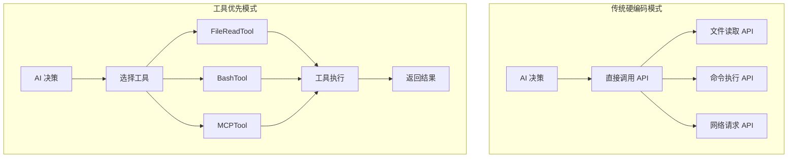

### 9.1.2 工具系统的核心价值

#### 可组合性（Composability）

工具是独立的、可组合的单元。AI 可以自由组合多个工具来完成复杂任务：

```typescript
// AI 可以在一次调用中组合多个工具
const tools = [
  { name: 'GrepTool', input: { pattern: 'function', path: './src' } },
  { name: 'FileReadTool', input: { file_path: './src/main.ts' } },
  { name: 'BashTool', input: { command: 'npm test' } },
]
```

#### 可扩展性（Extensibility）

通过 MCP（Model Context Protocol）协议，用户可以添加自定义工具，无需修改核心代码：

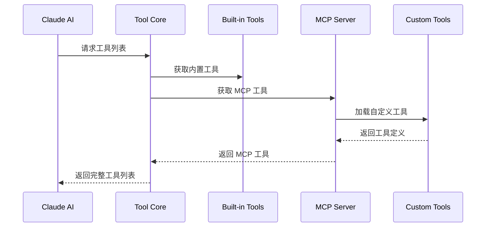

#### 可测试性（Testability）

每个工具都是独立的、可测试的单元：

```typescript
// 工具的输入验证是独立的
const result = await FileEditTool.validateInput({
  file_path: './test.txt',
  old_string: 'hello',
  new_string: 'world',
})

// 工具的执行是独立的
const output = await FileEditTool.call(input, context)
```

### 9.1.3 与其他工具系统的对比

| 特性 | Claude Code | LangChain Tools | OpenAI Tools | Custom AI Agent |
|------|-------------|-----------------|--------------|-----------------|
| **工具定义** | TypeScript Schema | Python Class | JSON Schema | 各种方式 |
| **类型安全** | 编译时 | 运行时 | 无 | 取决于实现 |
| **权限控制** | 细粒度规则 | 基础 | 无 | 自定义 |
| **扩展协议** | MCP 原生 | 插件系统 | 无 | 各种方式 |
| **沙盒执行** | 内置支持 | 无 | 无 | 取决于实现 |
| **UI 集成** | 深度集成 | 无 | 无 | 取决于实现 |

**作者观点：** Claude Code 的工具系统在设计上是最完整的。类型安全、权限控制、沙盒执行、UI 集成都是开箱即用的。相比之下，LangChain Tools 更像是一个库而不是完整的系统，OpenAI Tools 则是最基础的接口。

## 9.2 工具类型系统深度解析

### 9.2.1 类型驱动的工具定义

Claude Code 使用 Zod Schema 来定义工具的输入输出类型：

```typescript
// FileEditTool 的输入 Schema
const inputSchema = z.strictObject({
  file_path: z.string().describe('The file to edit'),
  old_string: z.string().describe('The string to replace'),
  new_string: z.string().describe('The replacement string'),
  replace_all: z.boolean().optional().describe('Replace all occurrences'),
})

// FileEditTool 的输出 Schema
const outputSchema = z.object({
  filePath: z.string(),
  oldString: z.string(),
  newString: z.string(),
  originalFile: z.string(),
  structuredPatch: z.any(),
  userModified: z.boolean(),
  replaceAll: z.boolean(),
})
```

**Schema 的多重用途：**

1. **运行时验证**：确保输入数据符合预期
2. **AI Prompt 生成**：自动生成工具使用说明
3. **UI 渲染**：生成表单和输入组件
4. **文档生成**：自动生成工具文档

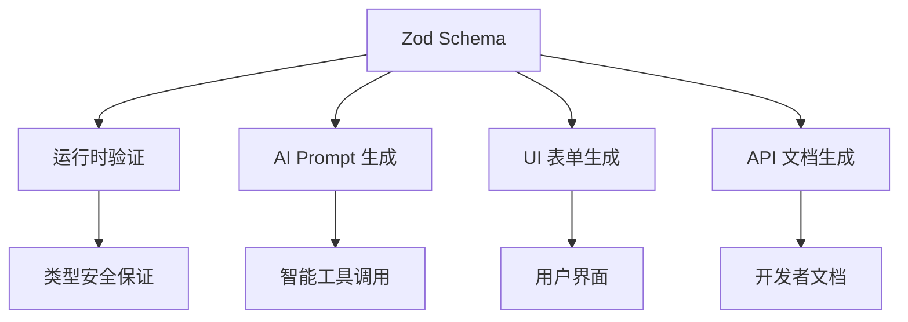

### 9.2.2 工具接口定义

每个工具都实现 `ToolDef` 接口：

```typescript
interface ToolDef<TInput, TOutput> {
  // 工具标识
  name: string
  searchHint?: string

  // Schema 定义
  get inputSchema(): z.ZodType<TInput>
  get outputSchema(): z.ZodType<TOutput>

  // 描述信息
  description(): string | Promise<string>
  prompt(): string | Promise<string>
  userFacingName(): string

  // 验证
  validateInput(input: TInput): ValidationResult | Promise<ValidationResult>

  // 权限检查
  checkPermissions(input: TInput, context: ToolUseContext): PermissionDecision | Promise<PermissionDecision>

  // 执行
  call(input: TInput, context: ToolCallContext): Promise<ToolResult<TOutput>>

  // UI 渲染
  renderToolUseMessage(input: TInput): string
  renderToolResultMessage(output: TOutput): string
  renderToolUseErrorMessage(error: Error): string

  // 元数据
  isConcurrencySafe(): boolean
  isReadOnly(): boolean
  getPath?(input: TInput): string
}
```

### 9.2.3 构建器模式

`buildTool` 函数用于创建工具实例：

```typescript
export const GrepTool = buildTool({
  name: GREP_TOOL_NAME,
  searchHint: 'search file contents with regex (ripgrep)',
  maxResultSizeChars: 20_000,
  strict: true,

  async description() {
    return 'Search for a pattern in files'
  },

  userFacingName() {
    return 'Search'
  },

  get inputSchema() {
    return inputSchema()
  },

  get outputSchema() {
    return outputSchema()
  },

  isConcurrencySafe() {
    return true
  },

  isReadOnly() {
    return true
  },

  async call(input, context) {
    // 实现搜索逻辑
  },
})
```

**设计意图：**
- **一致性**：所有工具使用相同的创建模式
- **类型推断**：TypeScript 可以自动推断输入输出类型
- **元数据**：支持工具级别的配置（maxResultSizeChars、strict 等）

## 9.3 工具发现与注册

### 9.3.1 工具注册流程

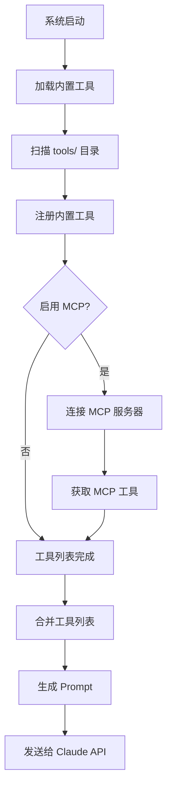

### 9.3.2 内置工具发现

内置工具通过静态导入注册：

```typescript
// src/Tool.ts
import { FileEditTool } from './tools/FileEditEditTool/index.js'
import { GrepTool } from './tools/GrepTool/index.js'
import { BashTool } from './tools/BashTool/index.js'
// ... 40+ 工具

export const DEFAULT_TOOLS: Tools = {
  [FileEditTool.name]: FileEditTool,
  [GrepTool.name]: GrepTool,
  [BashTool.name]: BashTool,
  // ...
}
```

### 9.3.3 MCP 工具集成

MCP（Model Context Protocol）是 Claude Code 的扩展协议：

```typescript
// MCP 工具动态加载
async function loadMCPTools(mcpClients: MCPServerConnection[]) {
  const mcpTools: Tools = {}

  for (const client of mcpClients) {
    const tools = await client.listTools()
    for (const tool of tools.tools) {
      mcpTools[tool.name] = buildMCPTool(tool, client)
    }
  }

  return mcpTools
}

// 将 MCP 工具转换为内部工具格式
function buildMCPTool(tool: MCPTool, client: MCPServerConnection) {
  return buildTool({
    name: tool.name,
    async description() {
      return tool.description
    },
    get inputSchema() {
      return convertJSONSchemaToZod(tool.inputSchema)
    },
    async call(input, context) {
      return client.callTool(tool.name, input)
    },
  })
}
```

**MCP 工具的优势：**
1. **动态加载**：运行时添加新工具
2. **远程执行**：工具可以在远程服务器上执行
3. **权限隔离**：MCP 工具有自己的权限系统
4. **语言无关**：可以用任何语言实现

### 9.3.4 工具覆盖机制

工具可以被覆盖：

```typescript
// 用户可以通过配置覆盖内置工具
const toolOverrides = {
  GrepTool: customGrepTool, // 用户自定义的 Grep 工具
}

const finalTools = {
  ...DEFAULT_TOOLS,
  ...toolOverrides,
}
```

**覆盖场景：**
1. **自定义行为**：用户想要修改工具的行为
2. **性能优化**：针对特定场景优化工具
3. **功能扩展**：添加额外的功能

## 9.4 工具执行流程

### 9.4.1 完整执行流程

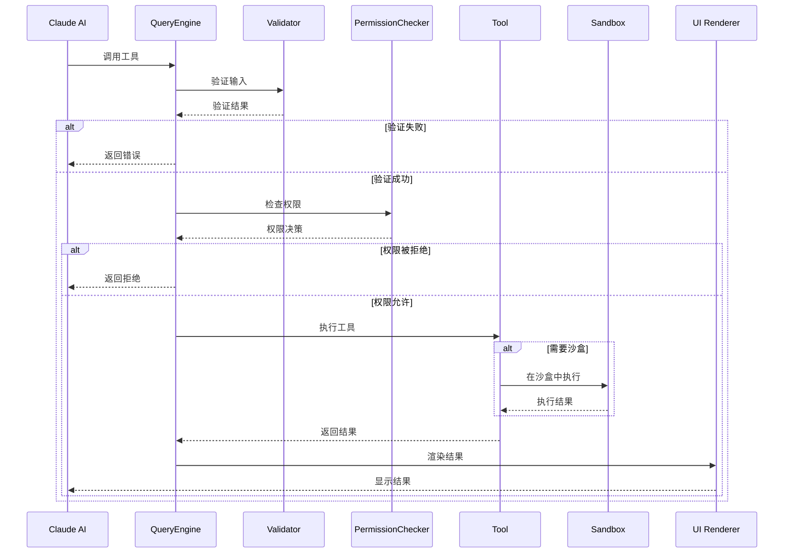

### 9.4.2 输入验证

输入验证是多阶段的：

```typescript
// 阶段 1：Schema 验证（Zod）
const schemaResult = inputSchema.safeParse(input)
if (!schemaResult.success) {
  return { result: false, message: schemaResult.error.message }
}

// 阶段 2：业务逻辑验证
const businessResult = await tool.validateInput(input, context)
if (!businessResult.result) {
  return businessResult
}

// 阶段 3：权限验证
const permResult = await tool.checkPermissions(input, context)
if (permResult.decision === 'deny') {
  return { result: false, message: 'Permission denied' }
}
```

**验证层次：**

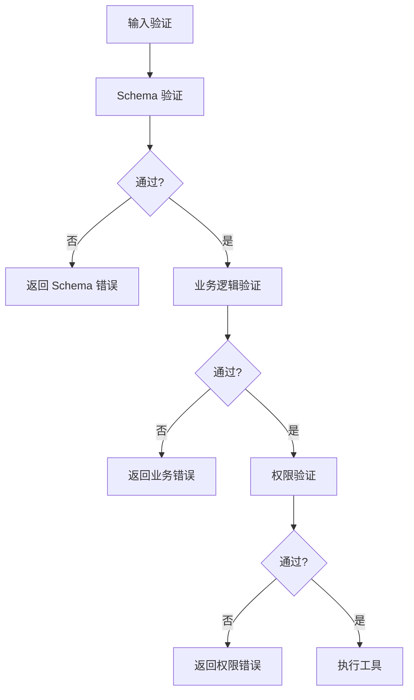

### 9.4.3 权限检查

权限系统支持细粒度控制：

```typescript
interface ToolPermissionContext {
  mode: PermissionMode  // 'default' | 'auto' | 'always-allow'
  alwaysAllowRules: ToolPermissionRulesBySource
  alwaysDenyRules: ToolPermissionRulesBySource
  alwaysAskRules: ToolPermissionRulesBySource
  additionalWorkingDirectories: Map<string, AdditionalWorkingDirectory>
}

// 权限规则示例
const rules = {
  bash: {
    'read-only': {
      mode: 'always-allow',
      commands: ['git status', 'git diff', 'ls'],
    },
    'dangerous': {
      mode: 'always-deny',
      commands: ['rm -rf', 'dd', 'mkfs'],
    },
  },
}
```

### 9.4.4 并发执行

多个工具可以并发执行：

```typescript
// AI 可以在一次请求中调用多个工具
const toolCalls = [
  { name: 'GrepTool', input: { pattern: 'import', path: './src' } },
  { name: 'FileReadTool', input: { file_path: './package.json' } },
  { name: 'BashTool', input: { command: 'git status' } },
]

// 系统会并发执行这些工具
const results = await Promise.all(
  toolCalls.map(call => executeTool(call.name, call.input))
)
```

**并发安全标识：**

```typescript
isConcurrencySafe() {
  // BashTool 不安全（可能改变工作目录）
  return false

  // GrepTool 安全（只读操作）
  return true
}
```

## 9.5 工具与 AI 的交互

### 9.5.1 Prompt 生成

工具的描述会自动转换为 AI Prompt：

```typescript
// 工具定义
const GrepTool = buildTool({
  name: 'grep',
  async description() {
    return 'Search for a pattern in files using ripgrep'
  },
  get inputSchema() {
    return z.object({
      pattern: z.string().describe('Regex pattern to search'),
      path: z.string().optional().describe('Directory to search'),
    })
  },
})

// 生成的 Prompt（发送给 Claude API）
const prompt = `
## Available Tools

### grep
Search for a pattern in files using ripgrep

Parameters:
- pattern (string, required): Regex pattern to search
- path (string, optional): Directory to search

Example usage:
<function_calls>
<invoke name="grep">
<parameter name="pattern">function name</parameter>
<parameter name="path">./src</parameter>
</invoke>
</function_calls>
`
```

### 9.5.2 工具调用解析

Claude API 返回的工具调用需要被解析：

```typescript
// API 返回的格式
const apiResponse = {
  content: [
    {
      type: 'tool_use',
      id: 'toolu_01',
      name: 'grep',
      input: {
        pattern: 'function',
        path: './src',
      },
    },
  ],
}

// 解析并执行
for (const block of apiResponse.content) {
  if (block.type === 'tool_use') {
    const tool = tools[block.name]
    const result = await tool.call(block.input, context)
    // 发送结果回 API
  }
}
```

## 9.6 可复用模式总结

### 模式 1：工具优先架构

**描述：** 将所有 AI 可执行的操作抽象为独立的工具。

**适用场景：**
- 构建 AI Agent 系统
- 需要灵活扩展能力
- 多种执行方式

**设计原则：**
1. 每个工具都是独立的、可测试的单元
2. 工具通过统一的接口暴露能力
3. AI 通过工具名称和参数调用功能
4. 工具可以被 MCP 协议扩展

**代码模板：**

```typescript
import { buildTool } from './Tool.js'
import { z } from 'zod'

const MyTool = buildTool({
  name: 'my-tool',
  searchHint: 'brief description for search',

  async description() {
    return 'Full tool description for the AI'
  },

  userFacingName() {
    return 'My Tool'
  },

  get inputSchema() {
    return z.strictObject({
      param1: z.string().describe('Parameter description'),
      param2: z.number().optional().describe('Optional parameter'),
    })
  },

  get outputSchema() {
    return z.object({
      result: z.string(),
      metadata: z.record(z.unknown()).optional(),
    })
  },

  async validateInput(input) {
    // 自定义验证逻辑
    if (input.param1 === '') {
      return {
        result: false,
        message: 'param1 cannot be empty',
        errorCode: 1,
      }
    }
    return { result: true }
  },

  async checkPermissions(input, context) {
    // 权限检查逻辑
    const appState = context.getAppState()
    return checkPermissions(input, appState.toolPermissionContext)
  },

  async call(input, context) {
    // 工具执行逻辑
    return {
      data: {
        result: 'success',
        metadata: {},
      },
    }
  },

  isConcurrencySafe() {
    return true
  },

  isReadOnly() {
    return true
  },
})

export { MyTool }
```

### 模式 2：Schema 驱动的工具定义

**描述：** 使用 Zod Schema 定义工具的输入输出，自动获得验证、类型推断、文档生成等能力。

**适用场景：**
- 需要强类型保证
- 自动生成文档
- 运行时验证

**关键点：**
1. 使用 Zod 的 `.describe()` 添加文档
2. 使用 `z.strictObject()` 禁止额外属性
3. 使用 `z.optional()` 标记可选参数
4. 使用 `z.discriminatedUnion()` 处理联合类型

### 模式 3：多层验证

**描述：** 通过多层验证确保工具调用的安全性和正确性。

**验证层次：**
1. Schema 验证：数据结构和类型
2. 业务逻辑验证：业务规则
3. 权限验证：访问控制

**代码模板：**

```typescript
async function validateAndCall(tool, input, context) {
  // 第一层：Schema 验证
  const schemaResult = tool.inputSchema.safeParse(input)
  if (!schemaResult.success) {
    return {
      success: false,
      error: 'Schema validation failed',
      details: schemaResult.error,
    }
  }

  // 第二层：业务逻辑验证
  const businessResult = await tool.validateInput(input, context)
  if (!businessResult.result) {
    return {
      success: false,
      error: 'Business validation failed',
      details: businessResult,
    }
  }

  // 第三层：权限验证
  const permResult = await tool.checkPermissions(input, context)
  if (permResult.decision === 'deny') {
    return {
      success: false,
      error: 'Permission denied',
      details: permResult,
    }
  }

  // 全部通过，执行工具
  return await tool.call(input, context)
}
```

## 9.7 作者观点：工具系统的优缺点

### 优点

1. **类型安全**：编译时和运行时双重保证
2. **可扩展性**：MCP 协议让扩展变得简单
3. **可测试性**：每个工具都是独立的测试单元
4. **用户体验**：权限控制、进度显示、错误处理都很完善

### 缺点

1. **学习曲线**：理解工具系统需要时间
2. **Schema 维护**：复杂的工具 Schema 定义繁琐
3. **性能开销**：多层验证带来一定的性能损失
4. **文档不足**：某些高级功能缺少文档

### 改进建议

1. **Schema 生成**：从代码自动生成 Schema
2. **工具模板**：提供更多工具创建模板
3. **性能优化**：缓存验证结果
4. **文档完善**：提供最佳实践指南

## 本章小结

本章深入分析了 Claude Code 的工具系统：

1. **设计理念**：工具优先架构将所有操作抽象为工具
2. **类型系统**：Zod Schema 提供类型安全和验证
3. **工具发现**：内置工具 + MCP 工具的混合模式
4. **执行流程**：多层验证和权限检查
5. **AI 交互**：自动 Prompt 生成和工具调用解析
6. **可复用模式**：工具优先、Schema 驱动、多层验证

## 下一章预告

第 10 章将深入分析文件工具，包括：
- FileReadTool 的多媒体处理能力
- FileEditTool 的 diff 算法实现
- FileWriteTool 的原子写入机制
- NotebookEditTool 的 Jupyter 支持

## 9.6 工具渲染系统

### 9.6.1 渲染方法体系

工具系统的 UI 集成是其最强大的特性之一。每个工具都实现了多个渲染方法，用于在不同场景下显示工具调用和结果。

```typescript
// 完整的渲染方法接口
interface ToolRendering {
  // 工具调用消息（开始执行时）
  renderToolUseMessage(input, options): ReactNode

  // 工具结果消息（执行完成后）
  renderToolResultMessage(output, options): ReactNode | null

  // 工具错误消息（执行失败时）
  renderToolUseErrorMessage(error, options): ReactNode | null

  // 工具进度消息（执行过程中）
  renderToolUseProgressMessage(progress, options): ReactNode | null

  // 工具标签（附加元数据）
  renderToolUseTag(input): ReactNode | null

  // 工具拒绝消息（权限被拒绝时）
  renderToolUseRejectedMessage(input, options): ReactNode | null

  // 工具排队消息（等待执行时）
  renderToolUseQueuedMessage(): ReactNode | null
}
```

**渲染流程：**

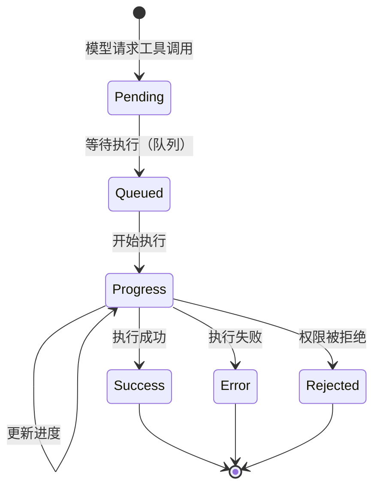

### 9.6.2 用户友好的名称

工具可以提供面向用户的名称和背景色：

```typescript
// BashTool 的用户友好名称
userFacingName(input?: { command?: string }): string {
  if (input?.command) {
    const firstWord = input.command.split(' ')[0]
    return firstWord // 'npm', 'git', 'ls' 等
  }
  return 'Bash'
}

userFacingNameBackgroundColor(): keyof Theme {
  return 'bash' // 对应主题中的 bash 颜色
}
```

**颜色编码系统：**

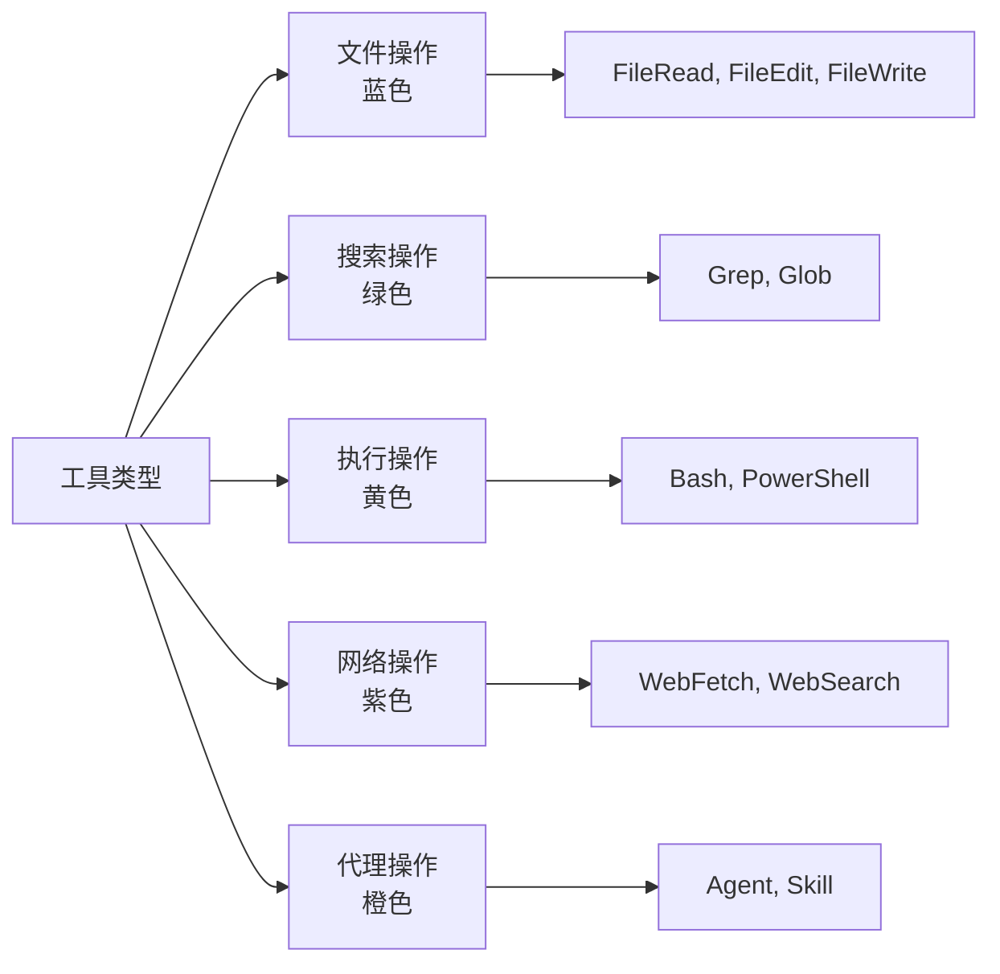

### 9.6.3 工具分组渲染

当多个相同工具的调用并发执行时，可以分组渲染：

```typescript
// 分组渲染接口
renderGroupedToolUse?(toolUses: Array<{
  param: ToolUseBlockParam
  isResolved: boolean
  isError: boolean
  isInProgress: boolean
  progressMessages: ProgressMessage<P>[]
  result?: { param: ToolResultBlockParam; output: unknown }
}>, options: {
  shouldAnimate: boolean
  tools: Tools
}): ReactNode | null
```

**分组渲染示例：**

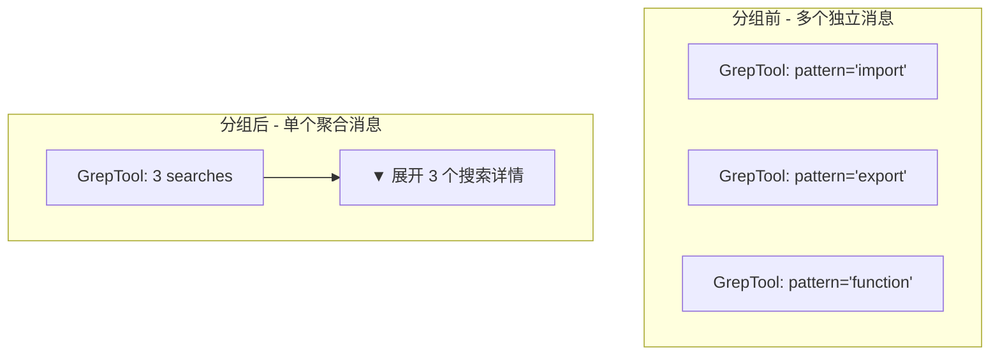

**设计意图：** 分组渲染减少了终端中的视觉混乱，特别是当 AI 并发调用多个相同工具时（如同时搜索多个文件）。

## 9.7 工具进度报告系统

### 9.7.1 进度数据类型

每个工具可以定义自己的进度数据类型：

```typescript
// Bash 工具的进度数据
interface BashProgress extends ToolProgressData {
  type: 'bash'
  command: string
  cwd?: string
  stdout: string
  stderr: string
  exitCode: number | null
}

// Agent 工具的进度数据
interface AgentToolProgress extends ToolProgressData {
  type: 'agent'
  subagent_type: string
  prompt: string
  status: 'starting' | 'thinking' | 'in_progress' | 'completed'
  steps: Array<{ name: string; status: 'pending' | 'in_progress' | 'completed' }>
}

// Web 搜索的进度数据
interface WebSearchProgress extends ToolProgressData {
  type: 'web_search'
  query: string
  status: 'searching' | 'reading' | 'completed'
  results_found: number
}
```

### 9.7.2 进度回调机制

```typescript
// 工具调用时传入进度回调
async call(
  input: z.infer<Input>,
  context: ToolUseContext,
  canUseTool: CanUseToolFn,
  parentMessage: AssistantMessage,
  onProgress?: ToolCallProgress<P>,  // 进度回调
): Promise<ToolResult<Output>> {
  // 工具可以在执行过程中调用 onProgress
  onProgress?.({
    toolUseID: context.toolUseId!,
    data: {
      type: 'bash',
      command: input.command,
      stdout: '部分输出...',
      stderr: '',
      exitCode: null,
    },
  })
}
```

**进度报告流程：**

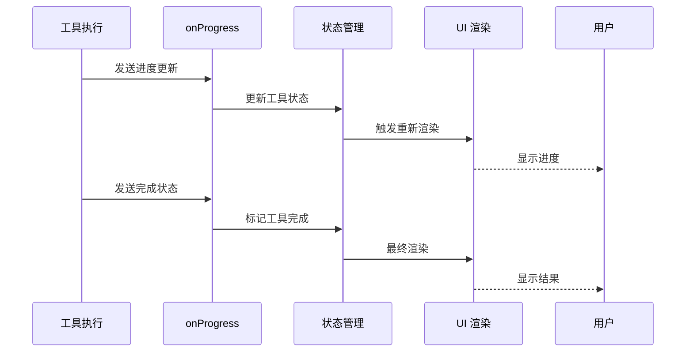

### 9.7.3 背景任务提示

对于长时间运行的任务，工具可以显示"后台运行"提示：

```typescript
// AgentTool 的后台提示逻辑
const PROGRESS_THRESHOLD_MS = 2000  // 2秒后显示提示

async call(input, context, onProgress) {
  const startTime = Date.now()

  // 发送初始进度
  onProgress?.({
    toolUseID: context.toolUseId!,
    data: { type: 'agent', status: 'starting', ... }
  })

  // 如果任务运行超过阈值，显示后台提示
  setTimeout(() => {
    if (isStillRunning) {
      onProgress?.({
        toolUseID: context.toolUseId!,
        data: { type: 'agent', status: 'in_progress', background: true }
      })
    }
  }, PROGRESS_THRESHOLD_MS)
}
```

**后台提示 UI：**

```
[Running in background] Task: "Analyze codebase" (Agent: code-reviewer)
└─ Use TaskOutputTool to check progress
```

## 9.8 工具安全深度分析

### 9.8.1 安全威胁模型

工具系统面临多种安全威胁：

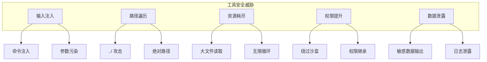

### 9.8.2 输入验证层次

```typescript
// 多层输入验证
async function validateToolInput(tool, input, context) {
  // 第 1 层：类型验证（Zod Schema）
  const schemaResult = tool.inputSchema.safeParse(input)
  if (!schemaResult.success) {
    return { valid: false, reason: 'Invalid schema', errors: schemaResult.error.errors }
  }

  // 第 2 层：格式验证（工具自定义）
  if (tool.validateInput) {
    const customResult = await tool.validateInput(schemaResult.data, context)
    if (!customResult.result) {
      return { valid: false, reason: 'Custom validation failed', message: customResult.message }
    }
  }

  // 第 3 层：语义验证（业务逻辑）
  if (tool.getPath) {
    const path = tool.getPath(input)
    if (isDangerousPath(path)) {
      return { valid: false, reason: 'Dangerous path', path }
    }
  }

  // 第 4 层：权限验证（访问控制）
  const permission = await canUseTool(tool, input)
  if (permission.behavior === 'deny') {
    return { valid: false, reason: 'Permission denied', rule: permission.reason }
  }

  return { valid: true }
}
```

### 9.8.3 路径遍历防护

```typescript
// FileReadTool 的路径防护
async function validateFilePath(filePath: string): Promise<ValidationResult> {
  // 规范化路径
  const normalized = path.normalize(filePath)

  // 检查是否超出工作目录
  const cwd = getCwd()
  const resolved = path.resolve(cwd, normalized)
  if (!resolved.startsWith(cwd)) {
    return {
      result: false,
      message: 'Path outside working directory',
      errorCode: 'PATH_TRAVERSAL',
    }
  }

  // 检查是否为设备文件
  if (BLOCKED_DEVICE_PATHS.has(resolved)) {
    return {
      result: false,
      message: 'Cannot read device file',
      errorCode: 'DEVICE_FILE',
    }
  }

  return { result: true }
}
```

### 9.8.4 资源限制

```typescript
// 资源限制配置
interface ResourceLimits {
  // 文件读取限制
  fileReading: {
    maxTokens?: number       // 最大 token 数
    maxSizeBytes?: number    // 最大字节数
  }

  // 搜索结果限制
  glob: {
    maxResults?: number      // 最大结果数
  }

  // 工具结果限制
  tool: {
    maxResultSizeChars?: number  // 最大结果字符数
  }
}

// 应用限制
const DEFAULT_LIMITS: ResourceLimits = {
  fileReading: {
    maxTokens: 100_000,
    maxSizeBytes: 10 * 1024 * 1024,  // 10MB
  },
  glob: {
    maxResults: 10_000,
  },
  tool: {
    maxResultSizeChars: 100_000,
  },
}
```

## 9.9 工具性能优化

### 9.9.1 结果大小限制

```typescript
// 工具结果大小控制
export const FileReadTool = buildTool({
  name: 'read_file',
  maxResultSizeChars: 100_000,  // 100K 字符限制

  async call(input, context) {
    let content = await readFile(input.file_path, 'utf-8')

    // 如果超过限制，截断并保存到文件
    if (content.length > this.maxResultSizeChars) {
      const preview = content.slice(0, this.maxResultSizeChars)
      const truncated = content.length - this.maxResultSizeChars

      // 保存到临时文件
      const tempPath = saveToTempFile(content)
      content = `${preview}\n\n[... ${truncated} more characters saved to ${tempPath} ...]`
    }

    return { data: content }
  },
})
```

**大小限制策略：**

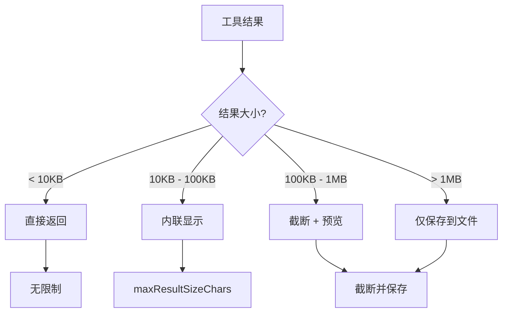

### 9.9.2 并发控制

```typescript
// 并发安全的工具可以并行执行
const isConcurrencySafe = (tool: Tool, input: unknown): boolean => {
  // 检查工具声明
  if (!tool.isConcurrencySafe(input)) {
    return false
  }

  // 检查输入是否冲突
  if (tool.getPath) {
    const path = tool.getPath(input)
    return !isPathLocked(path)
  }

  return true
}

// 并发执行策略
async function executeToolsConcurrently(toolCalls: ToolCall[]) {
  // 分离并发安全和并发不安全的调用
  const [safe, unsafe] = partition(toolCalls, call =>
    isConcurrencySafe(call.tool, call.input)
  )

  // 并发执行安全的调用
  const safeResults = await Promise.all(
    safe.map(call => executeTool(call))
  )

  // 串行执行不安全的调用
  const unsafeResults = []
  for (const call of unsafe) {
    const result = await executeTool(call)
    unsafeResults.push(result)
  }

  return [...safeResults, ...unsafeResults]
}
```

### 9.9.3 缓存策略

```typescript
// 文件读取缓存
interface FileReadCache {
  get(path: string): Promise<string | null>
  set(path: string, content: string): Promise<void>
  invalidate(path: string): Promise<void>
}

// LRU 缓存实现
class LRUCache {
  private cache = new Map<string, { content: string; timestamp: number }>()
  private maxSize = 100

  get(path: string): string | null {
    const entry = this.cache.get(path)
    if (entry) {
      // LRU: 移动到末尾
      this.cache.delete(path)
      this.cache.set(path, entry)
      return entry.content
    }
    return null
  }

  set(path: string, content: string): void {
    // 移除最老的项
    if (this.cache.size >= this.maxSize) {
      const firstKey = this.cache.keys().next().value
      this.cache.delete(firstKey)
    }
    this.cache.set(path, { content, timestamp: Date.now() })
  }
}
```

## 9.10 工具搜索与延迟加载

### 9.10.1 工具搜索机制

当工具数量超过阈值时，系统启用工具搜索：

```typescript
// src/utils/toolSearch.ts
export function isToolSearchEnabled(
  builtInTools: Tools,
  mcpTools: Tools,
): boolean {
  const totalTools = builtInTools.length + mcpTools.length
  const threshold = getFeatureValue_CACHED_MAY_BE_STALE(
    'tengu_tool_search_threshold',
    50  // 默认阈值：50 个工具
  )
  return totalTools >= threshold
}
```

**搜索提示优化：**

```typescript
// 工具提供搜索提示
export const NotebookEditTool = buildTool({
  name: 'edit_notebook',
  searchHint: 'jupyter ipynb notebook',  // 帮助模型找到此工具

  async description(input) {
    return `Edit Jupyter notebook cell at ${input.file_path}`
  },
})

// 搜索提示使用场景
// 1. 工具名称不常用（如 NotebookEdit）
// 2. 工具有多个同义词（如 "cron", "schedule", "periodic"）
// 3. 工具属于特定领域（如 "jupyter", "docker", "kubernetes"）
```

### 9.10.2 延迟加载策略

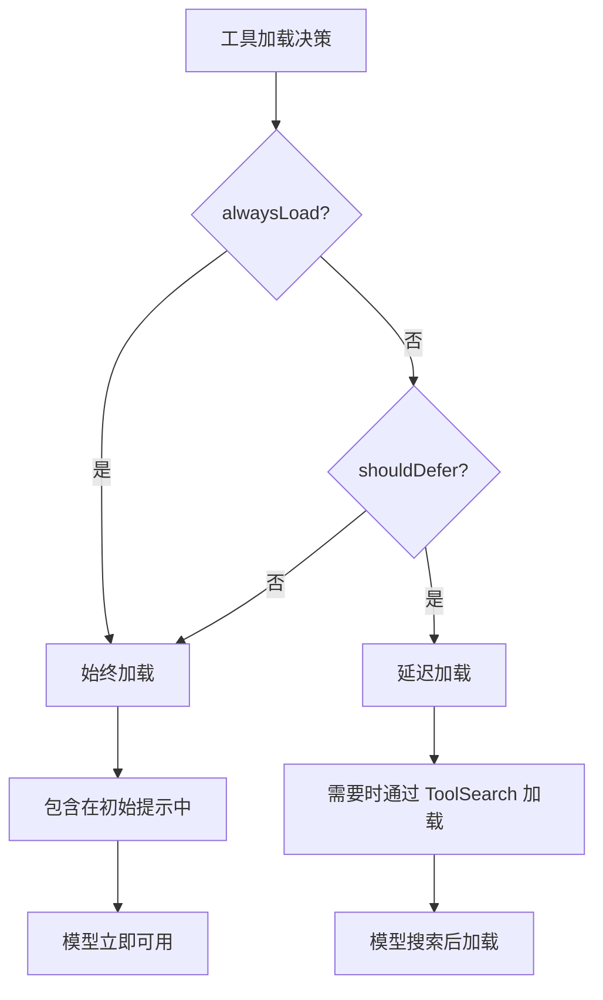

**延迟加载示例：**

```typescript
// 核心工具：始终加载
export const FileReadTool = buildTool({
  name: 'read_file',
  alwaysLoad: true,  // 模型始终能看到此工具
})

// 专用工具：延迟加载
export const CronCreateTool = buildTool({
  name: 'schedule_cron',
  shouldDefer: true,  // 通过 ToolSearch 加载
  searchHint: 'cron schedule periodic task',
})
```

## 9.11 MCP 工具适配器

### 9.11.1 MCP 协议转换

```typescript
// MCP 工具适配器
function adaptMCPTool(
  mcpTool: MCPToolDefinition,
  client: MCPServerConnection
): Tool {
  return buildTool({
    name: `mcp__${mcpTool.serverName}__${mcpTool.name}`,
    mcpInfo: {
      serverName: mcpTool.serverName,
      toolName: mcpTool.name,
    },

    async description() {
      return mcpTool.description || ''
    },

    get inputSchema() {
      // JSON Schema → Zod 转换
      return convertJSONSchemaToZod(mcpTool.inputSchema)
    },

    async call(input, context) {
      // 调用 MCP 工具
      const result = await client.callTool(mcpTool.name, input)
      return { data: result.content }
    },

    // MCP 工具默认为不安全（保守策略）
    isConcurrencySafe: () => false,
    isReadOnly: () => mcpTool.annotation?.readOnly ?? false,
  })
}
```

### 9.11.2 MCP 工具权限

```typescript
// MCP 工具同样受权限系统控制
function filterMCPToolsByPermissions(
  tools: MCPTool[],
  permissionContext: ToolPermissionContext
): MCPTool[] {
  return tools.filter(tool => {
    // 检查服务器级别的拒绝规则
    const serverRule = permissionContext.alwaysDenyRules[`mcp__${tool.serverName}`]
    if (serverRule) {
      return false
    }

    // 检查工具级别的拒绝规则
    const toolRule = permissionContext.alwaysDenyRules[`mcp__${tool.serverName}__${tool.name}`]
    if (toolRule) {
      return false
    }

    return true
  })
}
```

## 9.12 高级模式总结

### 模式 13：渲染策略模式

**描述：** 根据场景使用不同的渲染策略。

**适用场景：**
- 需要在终端和 IDE 中显示不同格式
- 需要支持简洁和详细两种模式
- 需要支持进度显示

**代码模板：**

```typescript
const MyTool = buildTool({
  name: 'my_tool',

  // 简洁模式渲染
  renderToolUseMessage(input, { verbose }) {
    if (verbose) {
      return <div>MyTool called with {JSON.stringify(input)}</div>
    }
    return <div>MyTool: {input.param}</div>
  },

  // 进度渲染
  renderToolUseProgressMessage(progress, options) {
    const { data } = progress[0]!
    return <div>Progress: {data.percent}%</div>
  },

  // 错误渲染
  renderToolUseErrorMessage(error, options) {
    return <div>Error: {error.message}</div>
  },
})
```

### 模式 14：观察者模式（进度报告）

**描述：** 工具通过回调函数报告进度，UI 订阅进度更新。

**适用场景：**
- 长时间运行的任务
- 需要实时反馈的操作
- 后台任务

**代码模板：**

```typescript
async function executeWithProgress(
  input: Input,
  onProgress?: ToolCallProgress<MyProgress>
): Promise<Output> {
  // 发送初始进度
  onProgress?.({
    toolUseID: generateId(),
    data: { type: 'my_progress', status: 'starting', percent: 0 },
  })

  // 执行过程中更新进度
  for (let i = 0; i < 100; i += 10) {
    await doWork(i)
    onProgress?.({
      toolUseID: generateId(),
      data: { type: 'my_progress', status: 'in_progress', percent: i },
    })
  }

  // 发送完成进度
  onProgress?.({
    toolUseID: generateId(),
    data: { type: 'my_progress', status: 'completed', percent: 100 },
  })

  return result
}
```

### 模式 15：责任链模式（权限检查）

**描述：** 权限检查通过一系列验证器链式传递。

**适用场景：**
- 多层权限验证
- 渐进式权限提升
- 复杂权限逻辑

**代码模板：**

```typescript
class PermissionChain {
  private validators: PermissionValidator[] = []

  add(validator: PermissionValidator): this {
    this.validators.push(validator)
    return this
  }

  async check(tool, input, context): Promise<PermissionResult> {
    for (const validator of this.validators) {
      const result = await validator.validate(tool, input, context)
      if (result.behavior !== 'passthrough') {
        return result
      }
    }
    return { behavior: 'allow' }
  }
}

// 使用
const chain = new PermissionChain()
  .add(new SchemaValidator())
  .add(new BusinessValidator())
  .add(new PermissionRuleValidator())
  .add(new AutoModeValidator())

const result = await chain.check(tool, input, context)
```

## 本章小结

本章全面介绍了 Claude Code 工具系统的架构设计：

1. **设计理念**：工具优先架构将所有操作抽象为工具
2. **类型系统**：Zod Schema 提供类型安全和验证
3. **工具发现**：内置工具 + MCP 工具的混合模式
4. **执行流程**：多层验证和权限检查
5. **渲染系统**：完整的 UI 集成和进度报告
6. **性能优化**：结果限制、并发控制、缓存策略
7. **工具搜索**：延迟加载和智能发现
8. **可复用模式**：13 种设计模式和最佳实践

## 下一章预告

第 10 章将深入分析文件工具的实现细节。
