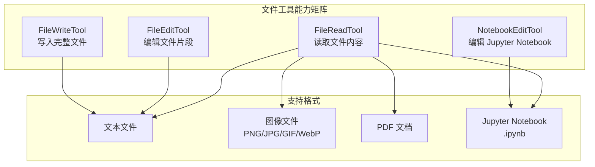
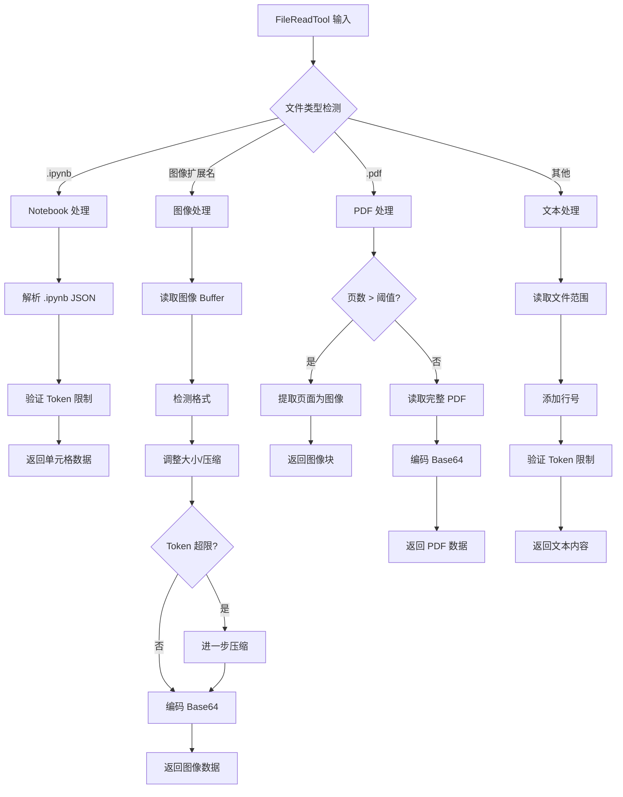
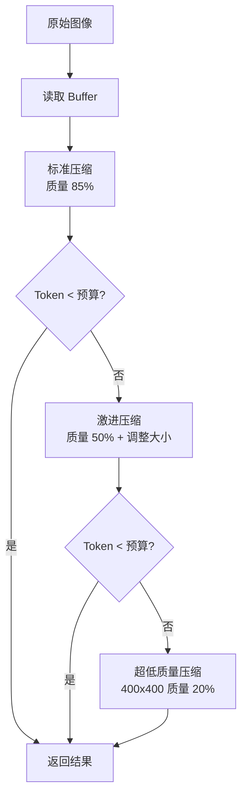
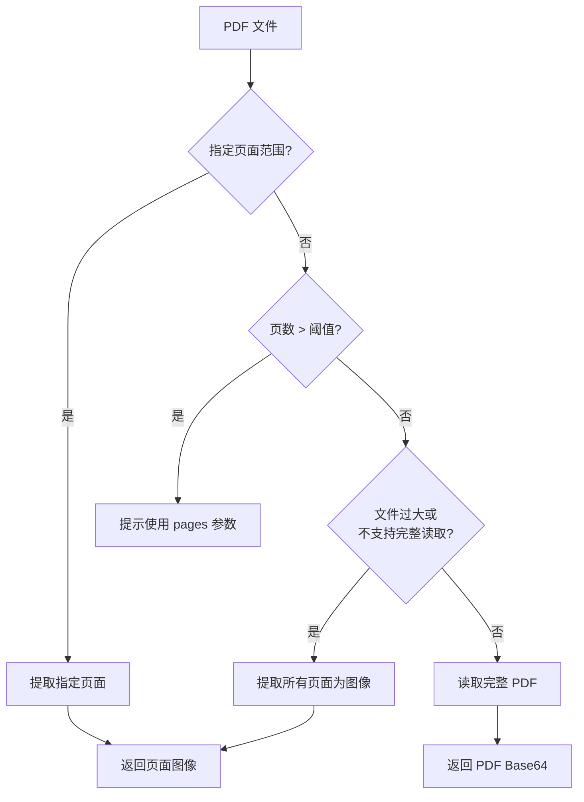
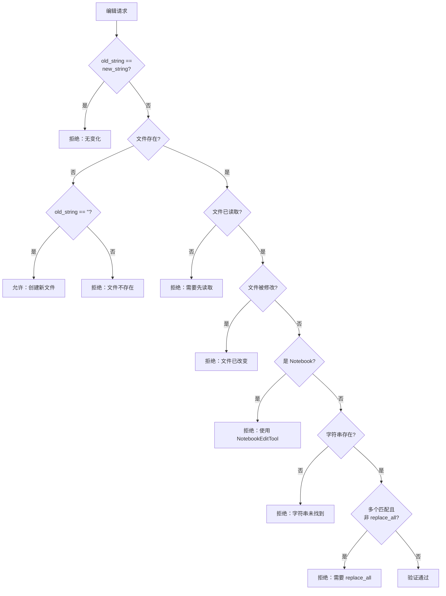

# 第 10 章：文件工具深度分析

> 本章目标：深入理解 Claude Code 文件工具的设计与实现，包括 FileReadTool、FileEditTool、FileWriteTool 和 NotebookEditTool 的内部机制。

## 10.1 文件工具架构概览

Claude Code 的文件工具系统是其最核心的功能之一，提供了对文件系统的全面访问能力。这四个工具共同构成了完整的文件操作能力矩阵：



### 10.1.1 工具职责划分

| 工具 | 主要职责 | 典型场景 |
|------|----------|----------|
| **FileReadTool** | 读取文件内容 | 查看代码、分析文档、处理图像 |
| **FileEditTool** | 替换文件中的字符串 | 修改函数、更新配置、bug 修复 |
| **FileWriteTool** | 创建或覆写完整文件 | 新建文件、完全重写 |
| **NotebookEditTool** | 编辑 Jupyter Notebook 单元格 | 数据科学工作流 |

**设计意图：** 这种职责划分遵循了单一职责原则，每个工具专注于特定场景，避免了"瑞士军刀"式的设计。

## 10.2 FileReadTool 深度剖析

FileReadTool 是最复杂的文件工具之一，支持多种文件格式和处理策略。

### 10.2.1 多格式支持架构



### 10.2.2 图像处理管道

FileReadTool 的图像处理是其最复杂的特性之一：

```typescript
// 图像处理完整流程
async function readImageWithTokenBudget(
  filePath: string,
  maxTokens: number,
): Promise<ImageResult> {
  // 步骤 1: 读取原始文件（限制大小避免 OOM）
  const imageBuffer = await readFileBytes(filePath, maxBytes)
  const originalSize = imageBuffer.length

  // 步骤 2: 检测图像格式
  const detectedMediaType = detectImageFormatFromBuffer(imageBuffer)
  const detectedFormat = detectedMediaType.split('/')[1] || 'png'

  // 步骤 3: 标准调整大小
  const resized = await maybeResizeAndDownsampleImageBuffer(
    imageBuffer,
    originalSize,
    detectedFormat,
  )

  // 步骤 4: 检查 Token 预算
  const estimatedTokens = Math.ceil(resized.buffer.length * 0.125)
  if (estimatedTokens > maxTokens) {
    // 步骤 5: 激进压缩
    const compressed = await compressImageBufferWithTokenLimit(
      imageBuffer,
      maxTokens,
      detectedMediaType,
    )
    return {
      type: 'image',
      file: {
        base64: compressed.base64,
        type: compressed.mediaType,
        originalSize,
      },
    }
  }

  return {
    type: 'image',
    file: {
      base64: resized.buffer.toString('base64'),
      type: resized.mediaType,
      originalSize,
      dimensions: resized.dimensions,
    },
  }
}
```

**图像压缩策略：**



**作者观点：** 这种分层的压缩策略是一个很好的设计。它优先保证图像质量，只在必要时才进行更激进的压缩。但最终的 400x400 质量 20% 的保底方案可能会导致图像几乎不可用。

### 10.2.3 PDF 处理机制

PDF 处理采用了智能分页策略：

```typescript
// PDF 处理流程
if (isPDFExtension(ext)) {
  // 场景 1: 用户指定了页面范围
  if (pages) {
    const extractResult = await extractPDFPages(resolvedFilePath, parsedRange)
    // 返回提取的页面图像
    return extractResult
  }

  // 场景 2: PDF 页数过多
  const pageCount = await getPDFPageCount(resolvedFilePath)
  if (pageCount > PDF_AT_MENTION_INLINE_THRESHOLD) {
    throw new Error(
      `This PDF has ${pageCount} pages. Use the pages parameter (e.g., "1-5").`
    )
  }

  // 场景 3: 文件过大或 PDF 支持不可用
  const stats = await fs.stat(resolvedFilePath)
  const shouldExtractPages = !isPDFSupported() || stats.size > PDF_EXTRACT_SIZE_THRESHOLD

  if (shouldExtractPages) {
    const extractResult = await extractPDFPages(resolvedFilePath)
    return extractResult
  }

  // 场景 4: 直接读取完整 PDF
  const readResult = await readPDF(resolvedFilePath)
  return readResult
}
```

**PDF 处理决策树：**



### 10.2.4 Token 预算管理

FileReadTool 实现了精细的 Token 预算控制：

```typescript
// Token 验证流程
async function validateContentTokens(
  content: string,
  ext: string,
  maxTokens?: number,
): Promise<void> {
  const effectiveMaxTokens = maxTokens ?? DEFAULT_MAX_TOKENS

  // 快速估算（避免 API 调用）
  const tokenEstimate = roughTokenCountEstimationForFileType(content, ext)
  if (!tokenEstimate || tokenEstimate <= effectiveMaxTokens / 4) {
    return
  }

  // 精确计算（通过 API）
  const tokenCount = await countTokensWithAPI(content)
  if (tokenCount > effectiveMaxTokens) {
    throw new MaxFileReadTokenExceededError(tokenCount, effectiveMaxTokens)
  }
}
```

**优化策略：**
1. **快速路径**：如果估算 Token 低于 1/4 阈值，跳过验证
2. **精确验证**：大文件使用 API 进行精确计数
3. **友好错误**：提供具体的超限信息和替代方案

### 10.2.5 文件读取去重

为了避免重复读取相同文件，FileReadTool 实现了去重机制：

```typescript
// 去重检查
const existingState = readFileState.get(fullFilePath)
if (existingState && !existingState.isPartialView && existingState.offset !== undefined) {
  const rangeMatch = existingState.offset === offset && existingState.limit === limit
  if (rangeMatch) {
    const mtimeMs = await getFileModificationTimeAsync(fullFilePath)
    if (mtimeMs === existingState.timestamp) {
      // 文件未改变，返回存根
      return {
        type: 'file_unchanged',
        file: { filePath: file_path },
      }
    }
  }
}
```

**去重条件：**
1. 相同文件路径
2. 相同读取范围（offset 和 limit）
3. 文件修改时间未变化

**性能影响：** 根据内部数据，约 18% 的 Read 调用是相同文件的重复读取，去重机制显著节省了 Token。

## 10.3 FileEditTool 深度剖析

FileEditTool 实现了精确的字符串替换编辑功能。

### 10.3.1 编辑验证流程

FileEditTool 的验证是其最复杂的部分：



### 10.3.2 引号归一化处理

FileEditTool 实现了智能的引号归一化：

```typescript
// 查找实际的字符串（处理引号变化）
function findActualString(file: string, search: string): string | null {
  // 直接匹配
  if (file.includes(search)) {
    return search
  }

  // 尝试引号变化
  const variations = [
    search.replace(/"/g, '"'), // 左双引号 → 普通引号
    search.replace(/"/g, '"'), // 右双引号 → 普通引号
    search.replace(/'/g, "'"), // 左单引号 → 普通引号
    search.replace(/'/g, "'"), // 右单引号 → 普通引号
  ]

  for (const variation of variations) {
    if (file.includes(variation)) {
      return variation
    }
  }

  return null
}
```

**设计意图：** AI 模型有时会使用不同的引号字符，归一化处理提高了编辑的成功率。

### 10.3.3 原子写入保证

FileEditTool 实现了原子写入，确保并发安全：

```typescript
async call(input: FileEditInput, context: ToolCallContext) {
  const absoluteFilePath = expandPath(input.file_path)

  // 1. 确保父目录存在（在临界区之外）
  await fs.mkdir(dirname(absoluteFilePath))

  // 2. 文件历史备份（在临界区之外）
  if (fileHistoryEnabled()) {
    await fileHistoryTrackEdit(updateFileHistoryState, absoluteFilePath, uuid)
  }

  // === 临界区开始：避免异步操作 ===
  const { content: originalFileContents, encoding, lineEndings } = readFileForEdit(absoluteFilePath)

  // 3. 确认文件未被修改
  const lastWriteTime = getFileModificationTime(absoluteFilePath)
  const lastRead = readFileState.get(absoluteFilePath)
  if (lastWriteTime > lastRead.timestamp) {
    throw new Error(FILE_UNEXPECTEDLY_MODIFIED_ERROR)
  }

  // 4. 查找实际字符串
  const actualOldString = findActualString(originalFileContents, input.old_string)

  // 5. 应用编辑
  const { updatedFile } = getPatchForEdit({
    filePath: absoluteFilePath,
    fileContents: originalFileContents,
    oldString: actualOldString,
    newString: input.new_string,
    replaceAll: input.replace_all,
  })

  // 6. 原子写入
  writeTextContent(absoluteFilePath, updatedFile, encoding, lineEndings)

  // 7. 更新读取状态
  readFileState.set(absoluteFilePath, {
    content: updatedFile,
    timestamp: getFileModificationTime(absoluteFilePath),
  })
  // === 临界区结束 ===
}
```

**原子性保证：**
1. 在临界区内不执行任何异步操作
2. 先读取、再验证、最后写入
3. 使用文件修改时间检测并发修改

### 10.3.4 Diff 生成

FileEditTool 为每次编辑生成结构化的 diff：

```typescript
// Diff 生成
function getPatchForEdit(params: EditParams): { patch: Patch[]; updatedFile: string } {
  const { fileContents, oldString, newString, replaceAll } = params

  const updatedFile = replaceAll
    ? fileContents.replaceAll(oldString, newString)
    : fileContents.replace(oldString, newString)

  // 生成统一格式 diff
  const patch = generateUnifiedDiff({
    originalContent: fileContents,
    modifiedContent: updatedFile,
    filePath: params.filePath,
  })

  return { patch, updatedFile }
}
```

## 10.4 FileWriteTool 深度剖析

FileWriteTool 提供创建和覆写文件的完整能力。

### 10.4.1 创建与更新检测

```typescript
async call({ file_path, content }, context: ToolCallContext) {
  const fullFilePath = expandPath(file_path)
  const dir = dirname(fullFilePath)

  // 确保父目录存在
  await fs.mkdir(dir)

  // 读取现有内容
  let meta: FileMetadata | null = null
  try {
    meta = readFileSyncWithMetadata(fullFilePath)
  } catch (e) {
    if (isENOENT(e)) {
      meta = null  // 文件不存在
    }
  }

  const oldContent = meta?.content ?? null
  const enc = meta?.encoding ?? 'utf8'

  // 写入新内容
  writeTextContent(fullFilePath, content, enc, 'LF')

  // 返回结果
  if (oldContent) {
    return {
      type: 'update',
      filePath: file_path,
      content,
      structuredPatch: generatePatch(oldContent, content),
      originalFile: oldContent,
    }
  }

  return {
    type: 'create',
    filePath: file_path,
    content,
    structuredPatch: [],
    originalFile: null,
  }
}
```

### 10.4.2 换行符处理策略

```typescript
// FileWriteTool 的换行符处理
// AI 明确指定了换行符，应该保留
writeTextContent(fullFilePath, content, enc, 'LF')
//                                  ^^^
//                                  始终使用 LF，不保留原始文件的换行符
```

**设计意图：** AI 生成的内容使用显式换行符，保留这些换行符是正确的。之前的策略是"保留文件换行符"或"从仓库采样"，但这会在 Linux 上破坏 bash 脚本（引入 \r）。

**作者观点：** 这是一个正确的修复。AI 模型知道应该使用什么换行符，强制统一可能会破坏语义。

## 10.5 NotebookEditTool 深度剖析

NotebookEditTool 专门用于编辑 Jupyter Notebook 文件。

### 10.5.1 Notebook 结构解析

```typescript
// Jupyter Notebook 结构
interface Notebook {
  cells: NotebookCell[]
  metadata: Record<string, unknown>
  nbformat: number
  nbformat_minor: number
}

interface NotebookCell {
  cell_type: 'code' | 'markdown' | 'raw'
  source: string | string[]
  metadata: Record<string, unknown>
  outputs?: CellOutput[]
  execution_count?: number
}
```

### 10.5.2 单元格操作

```typescript
// NotebookEditTool 支持的操作
interface NotebookEditInput {
  editMode: 'insert' | 'delete' | 'replace'
  file_path: string
  cell_id?: string
  cells?: NotebookCell[]
  position?: 'before' | 'after'
}
```

**操作类型：**
1. **insert**：在指定位置插入新单元格
2. **delete**：删除指定单元格
3. **replace**：替换单元格内容

### 10.5.3 与 FileEditTool 的区别

| 特性 | NotebookEditTool | FileEditTool |
|------|-----------------|--------------|
| **文件格式** | .ipynb (JSON) | 任何文本文件 |
| **编辑单位** | 单元格 | 字符串 |
| **结构感知** | 是 | 否 |
| **执行状态** | 保留 | N/A |

**设计意图：** Notebook 是结构化文档，需要专门的工具来处理其语义。使用 FileEditTool 编辑 .ipynb 文件会破坏 JSON 结构。

## 10.6 文件工具的安全考虑

### 10.6.1 路径安全

```typescript
// UNC 路径检查（防止 NTLM 凭证泄露）
if (fullFilePath.startsWith('\\\\') || fullFilePath.startsWith('//')) {
  return { result: true }  // 跳过文件系统操作
}

// 设备文件检查（防止无限输出或阻塞）
const BLOCKED_DEVICE_PATHS = new Set([
  '/dev/zero',    // 无限输出
  '/dev/random',  // 随机输出
  '/dev/stdin',   // 阻塞输入
  '/dev/tty',     // 阻塞终端
  // ...
])
```

### 10.6.2 Token 限制保护

```typescript
// 防止读取过大的文件
const DEFAULT_MAX_TOKENS = 50_000

if (tokenCount > maxTokens) {
  throw new MaxFileReadTokenExceededError(tokenCount, maxTokens)
}
```

### 10.6.3 二进制文件保护

```typescript
// 二进制文件检查
const ext = path.extname(fullFilePath).toLowerCase()
if (hasBinaryExtension(fullFilePath) && !isPDFExtension(ext) && !IMAGE_EXTENSIONS.has(ext.slice(1))) {
  return {
    result: false,
    message: `Cannot read binary ${ext} files. Use appropriate tools.`,
  }
}
```

## 10.7 可复用模式总结

### 模式 1：分层压缩

**描述：** 通过多级压缩策略平衡质量和性能。

**适用场景：**
- 图像/视频处理
- 数据压缩
- Token 限制场景

**代码模板：**

```typescript
async function compressWithFallback(input: Input, budget: number) {
  // 第一级：标准压缩
  const standard = await standardCompress(input)
  if (standard.size <= budget) return standard

  // 第二级：激进压缩
  const aggressive = await aggressiveCompress(input)
  if (aggressive.size <= budget) return aggressive

  // 第三级：保底压缩
  return await fallbackCompress(input)
}
```

### 模式 2：原子写入

**描述：** 确保文件操作的原子性，避免并发冲突。

**适用场景：**
- 文件编辑
- 配置更新
- 状态持久化

**代码模板：**

```typescript
async function atomicWrite(filePath: string, newContent: string) {
  // 1. 读取当前状态（临界区外）
  const current = await readFile(filePath)

  // 2. 验证（临界区外）
  await validateChanges(current, newContent)

  // === 临界区开始 ===
  // 3. 再次读取和验证
  const latest = readFileSync(filePath)
  if (latest !== current) {
    throw new Error('File was modified')
  }

  // 4. 写入
  writeFileSync(filePath, newContent)
  // === 临界区结束 ===
}
```

### 模式 3：智能去重

**描述：** 通过缓存和时间戳检测避免重复操作。

**适用场景：**
- 文件读取
- API 调用
- 计算密集操作

**代码模板：**

```typescript
function deduplicatedOperation(key: string, operation: () => Promise<Result>) {
  const cached = cache.get(key)
  if (cached && !isStale(cached)) {
    return cached
  }

  const result = await operation()
  cache.set(key, result)
  return result
}
```

## 本章小结

本章深入分析了 Claude Code 的文件工具系统：

1. **FileReadTool**：多格式支持（文本/图像/PDF/Notebook），智能压缩，去重机制
2. **FileEditTool**：精确字符串替换，引号归一化，原子写入保证
3. **FileWriteTool**：创建和覆写文件，智能换行符处理
4. **NotebookEditTool**：Jupyter Notebook 专用编辑
5. **安全考虑**：路径安全、Token 限制、二进制保护

## 下一章预告

第 11 章将深入分析搜索工具，包括：
- GrepTool 的 ripgrep 集成
- GlobTool 的模式匹配
- 搜索结果分页和排序
- 性能优化技巧
