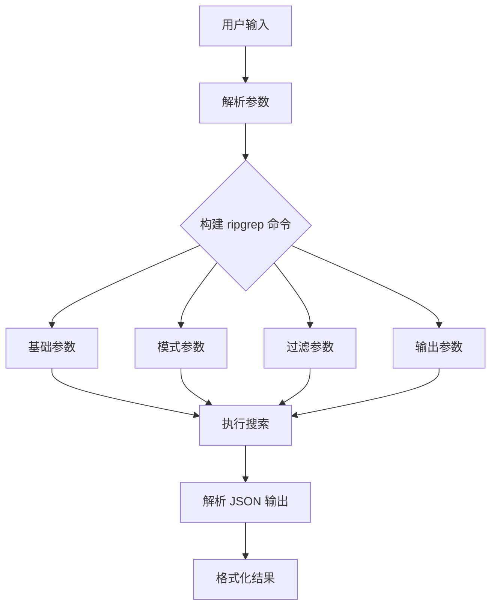
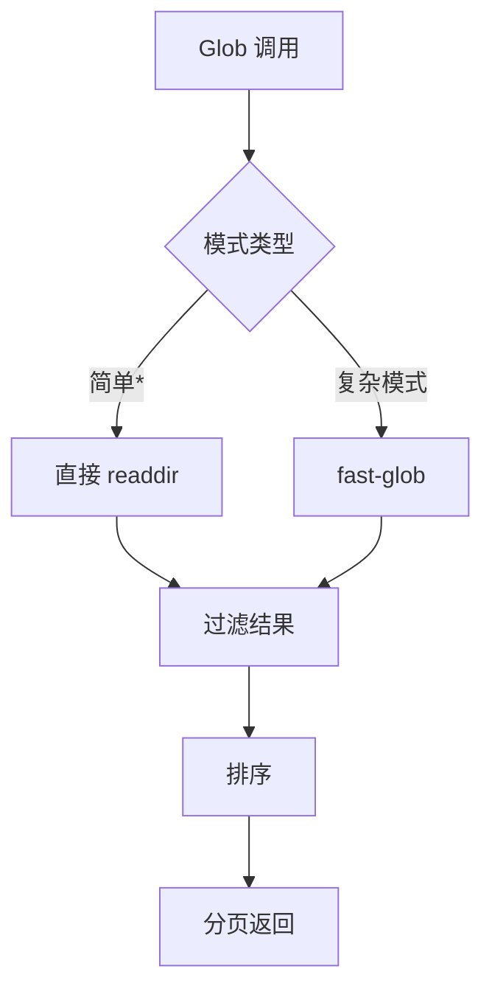

# 第 10 章：工具系统架构（三）：搜索与查询工具

> 本章目标：分析代码搜索和文件查找工具。

## 10.1 GrepTool 详解

### ripgrep 集成

```typescript
// src/tools/GrepTool/GrepTool.ts
import { buildTool } from '../../Tool.js'
import { z } from 'zod/v4'
import { execa } from 'execa'

export const GrepTool = buildTool({
  name: 'GrepTool',
  inputSchema: z.object({
    pattern: z.string().describe('The regex pattern to search for'),
    path: z.string().optional().describe('The directory to search in'),
    glob: z.string().optional().describe('File pattern to filter'),
    contextLines: z.number().optional().describe('Number of context lines'),
    ignoreCase: z.boolean().optional().describe('Case-insensitive search'),
  }),

  call: async (args, context) => {
    const { pattern, path = '.', glob, contextLines = 2, ignoreCase = false } = args

    // 1. 构建命令参数
    const rgArgs = [
      pattern,
      path,
      '--json',              // JSON 输出
      '--line-number',
      `--context=${contextLines}`,
      ignoreCase ? '--ignore-case' : '--case-sensitive',
    ]

    if (glob) {
      rgArgs.push('--glob', glob)
    }

    // 2. 执行 ripgrep
    const { stdout } = await execa('rg', rgArgs, {
      reject: false,  // 不在非零退出时抛出
      cwd: context.options.cwd,
    })

    // 3. 解析结果
    if (!stdout) {
      return { data: 'No matches found' }
    }

    const results = stdout
      .split('\n')
      .filter(line => line.trim())
      .map(line => {
        try {
          return JSON.parse(line) as RipgrepResult
        } catch {
          return null
        }
      })
      .filter((r): r is RipgrepResult => r !== null)

    // 4. 格式化输出
    const formatted = formatGrepResults(results, contextLines)

    return {
      data: formatted,
      metadata: {
        matchCount: results.length,
        fileCount: new Set(results.map(r => r.path)).size,
      },
    }
  },

  description: async (args) => {
    const { pattern, path } = args
    return `Search for "${pattern}" in ${path || '.'}`
  },

  isReadOnly: () => true,
  isSearchOrReadCommand: () => ({ isSearch: true, isRead: true }),
  isEnabled: () => true,
  maxResultSizeChars: 50000,
})
```

### 搜索参数构建



```typescript
// ripgrep 参数构建器
class RipgrepArgsBuilder {
  private args: string[] = []

  pattern(pattern: string): this {
    this.args.push(pattern)
    return this
  }

  path(path: string): this {
    this.args.push(path)
    return this
  }

  context(lines: number): this {
    this.args.push(`--context=${lines}`)
    return this
  }

  beforeContext(lines: number): this {
    this.args.push(`--before-context=${lines}`)
    return this
  }

  afterContext(lines: number): this {
    this.args.push(`--after-context=${lines}`)
    return this
  }

  ignoreCase(enabled: boolean): this {
    if (enabled) {
      this.args.push('--ignore-case')
    }
    return this
  }

  glob(pattern: string): this {
    this.args.push('--glob', pattern)
    return this
  }

  exclude(pattern: string): this {
    this.args.push('--glob', `!${pattern}`)
    return this
  }

  maxResults(count: number): this {
    this.args.push('--max-count', String(count))
    return this
  }

  jsonOutput(): this {
    this.args.push('--json')
    return this
  }

  build(): string[] {
    return [...this.args]
  }
}

// 使用
const args = new RipgrepArgsBuilder()
  .pattern('TODO')
  .path('.')
  .context(2)
  .ignoreCase(true)
  .glob('*.ts')
  .exclude('node_modules')
  .jsonOutput()
  .build()
```

### 结果解析

```typescript
// ripgrep JSON 结果类型
type RipgrepResult = {
  type: 'match' | 'context' | 'end'
  data: {
    path: {
      text: string
    }
    lines: {
      text: string
    }
    line_number: number
    absolute_offset: number
    submatches?: Array<{
      match: { text: string }
      start: number
      end: number
    }>
  }?
}

// 解析和聚合结果
function aggregateGrepResults(results: RipgrepResult[]): GrepMatches {
  const matchesByFile = new Map<string, FileMatch[]>()

  for (const result of results) {
    if (result.type !== 'match' || !result.data) continue

    const { path, lines, line_number, submatches } = result.data
    const filePath = path.text

    if (!matchesByFile.has(filePath)) {
      matchesByFile.set(filePath, [])
    }

    matchesByFile.get(filePath)!.push({
      line: lines.text,
      lineNumber: line_number,
      matches: submatches?.map(m => ({
        text: m.match.text,
        start: m.start,
        end: m.end,
      })) || [],
    })
  }

  return {
    totalMatches: results.length,
    files: Array.from(matchesByFile.entries()).map(([path, matches]) => ({
      path,
      matchCount: matches.length,
      matches,
    })),
  }
}
```

### 上下文行控制

```typescript
// 上下文行控制
export function formatGrepResults(
  results: RipgrepResult[],
  contextLines: number,
): string {
  const output: string[] = []
  let currentFile: string | null = null
  let contextBuffer: string[] = []

  for (const result of results) {
    if (result.type === 'end') {
      // 文件结束，输出缓冲内容
      if (contextBuffer.length > 0) {
        output.push(...contextBuffer)
        contextBuffer = []
      }
      continue
    }

    const data = result.data
    if (!data) continue

    const filePath = data.path.text

    // 新文件
    if (filePath !== currentFile) {
      // 输出前一个文件的缓冲
      if (contextBuffer.length > 0) {
        output.push(...contextBuffer)
        contextBuffer = []
      }

      currentFile = filePath
      output.push(`\n${filePath}:`)
    }

    // 格式化行
    const linePrefix = result.type === 'match' ? '>>' : '  '
    const formatted = `${linePrefix} ${data.line_number}:${data.lines.text}`

    if (result.type === 'match') {
      // 匹配行：先输出缓冲的上下文
      output.push(...contextBuffer)
      contextBuffer = []
      output.push(formatted)
    } else {
      // 上下文行：添加到缓冲
      contextBuffer.push(formatted)
      // 限制缓冲大小
      if (contextBuffer.length > contextLines * 2) {
        contextBuffer.shift()
      }
    }
  }

  // 输出剩余缓冲
  output.push(...contextBuffer)

  return output.join('\n')
}
```

## 10.2 GlobTool 详解

### 文件模式匹配

```typescript
// src/tools/GlobTool/GlobTool.ts
export const GlobTool = buildTool({
  name: 'GlobTool',
  inputSchema: z.object({
    pattern: z.string().describe('The glob pattern'),
    path: z.string().optional().describe('The directory to search in'),
    includeDirs: z.boolean().optional().describe('Include directories'),
  }),

  call: async (args, context) => {
    const { pattern, path = '.', includeDirs = false } = args

    // 1. 使用 fast-glob 进行匹配
    const fg = await import('fast-glob')

    const options = {
      cwd: resolve(path, context.options.cwd),
      onlyFiles: !includeDirs,
      absolute: false,
      ignore: ['**/node_modules/**', '**/dist/**', '**/.git/**'],
    }

    const matches = await fg.default(pattern, options)

    // 2. 排序结果
    const sorted = matches.sort()

    // 3. 限制结果数量
    const maxResults = context.globLimits?.maxResults ?? 1000
    const limited = sorted.slice(0, maxResults)

    return {
      data: limited.join('\n'),
      metadata: {
        matchCount: matches.length,
        truncated: matches.length > limited.length,
      },
    }
  },

  description: async (args) => {
    const { pattern, path } = args
    return `Find files matching ${pattern} in ${path || '.'}`
  },

  isReadOnly: () => true,
  isSearchOrReadCommand: () => ({ isSearch: true, isRead: false }),
  isEnabled: () => true,
  maxResultSizeChars: 50000,
})
```

### 结果排序

```typescript
// 文件排序策略
export function sortFiles(
  files: string[],
  strategy: 'name' | 'modified' | 'size' = 'name',
): string[] {
  switch (strategy) {
    case 'name':
      return files.sort()

    case 'modified':
      return files.sort(async (a, b) => {
        const statA = await stat(a)
        const statB = await stat(b)
        return statB.mtimeMs - statA.mtimeMs
      })

    case 'size':
      return files.sort(async (a, b) => {
        const statA = await stat(a)
        const statB = await stat(b)
        return statB.size - statA.size
      })
  }
}
```

### 性能优化



```typescript
// 优化的 glob 实现
export async function globOptimized(
  pattern: string,
  options: {
    cwd: string
    maxResults?: number
  },
): Promise<string[]> {
  // 1. 检查是否是简单模式
  if (isSimplePattern(pattern)) {
    return await simpleGlob(pattern, options)
  }

  // 2. 使用 fast-glob
  const { default: fg } = await import('fast-glob')
  return await fg.default(pattern, {
    cwd: options.cwd,
    onlyFiles: true,
    absolute: false,
    ignore: DEFAULT_IGNORES,
  })
}

// 简单模式检查（更快）
function isSimplePattern(pattern: string): boolean {
  // 简单模式：*.ts, **/*.js 等
  return /^[*a-zA-Z0-9/_-]+$/.test(pattern)
}

// 简单 glob 实现
async function simpleGlob(
  pattern: string,
  options: { cwd: string },
): Promise<string[]> {
  const dir = opendirSync(options.cwd)
  const results: string[] = []

  for await (const entry of dir) {
    if (entry.name.match(pattern)) {
      results.push(entry.name)
    }
  }

  return results
}
```

## 10.3 WebSearchTool 详解

### 搜索 API 集成

```typescript
// src/tools/WebSearchTool/WebSearchTool.ts
export const WebSearchTool = buildTool({
  name: 'WebSearchTool',
  inputSchema: z.object({
    query: z.string().describe('The search query'),
    numResults: z.number().optional().describe('Number of results to return'),
  }),

  call: async (args, context) => {
    const { query, numResults = 10 } = args

    // 1. 调用搜索 API
    const response = await fetch('https://api.search.example.com/search', {
      method: 'POST',
      headers: {
        'Content-Type': 'application/json',
        'Authorization': `Bearer ${context.options.searchApiKey}`,
      },
      body: JSON.stringify({
        query,
        num_results: numResults,
      }),
    })

    if (!response.ok) {
      throw new Error(`Search API error: ${response.status}`)
    }

    const data = await response.json() as SearchResult[]

    // 2. 格式化结果
    const formatted = formatSearchResults(data)

    return {
      data: formatted,
      metadata: {
        resultCount: data.length,
        query,
      },
    }
  },

  description: async (args) => {
    return `Search the web for "${args.query}"`
  },

  isReadOnly: () => true,
  isOpenWorld: () => true,
  isEnabled: () => true,
  maxResultSizeChars: 10000,
})
```

### 结果格式化

```typescript
// 搜索结果类型
type SearchResult = {
  title: string
  url: string
  snippet: string
  publishedDate?: string
  source?: string
}

// 格式化搜索结果
function formatSearchResults(results: SearchResult[]): string {
  if (results.length === 0) {
    return 'No results found'
  }

  const lines: string[] = []
  lines.push(`Found ${results.length} results:\n`)

  for (let i = 0; i < results.length; i++) {
    const result = results[i]
    lines.push(`${i + 1}. ${result.title}`)
    lines.push(`   ${result.url}`)

    if (result.snippet) {
      lines.push(`   ${result.snippet}`)
    }

    if (result.source) {
      lines.push(`   Source: ${result.source}`)
    }

    lines.push('')
  }

  return lines.join('\n')
}
```

### 来源引用

```typescript
// 来源引用格式
export function formatSearchWithCitations(
  results: SearchResult[],
): { content: string; citations: Map<string, SearchResult> } {
  const citations = new Map<string, SearchResult>()
  const lines: string[] = []

  for (let i = 0; i < results.length; i++) {
    const result = results[i]
    const citationId = `[${i + 1}]`
    citations.set(citationId, result)

    lines.push(`${citationId} ${result.title}`)
    lines.push(`    ${result.snippet}`)
  }

  return {
    content: lines.join('\n'),
    citations,
  }
}

// 在文本中使用引用
export function injectCitations(text: string, citations: string[]): string {
  // 将 [1]、[2] 等引用转换为链接
  return text.replace(/\[(\d+)\]/g, (match, id) => {
    const index = parseInt(id, 10) - 1
    const citation = citations[index]
    if (citation) {
      return `[${citation}]`
    }
    return match
  })
}
```

## 10.4 WebFetchTool 详解

### URL 获取实现

```typescript
// src/tools/WebFetchTool/WebFetchTool.ts
export const WebFetchTool = buildTool({
  name: 'WebFetchTool',
  inputSchema: z.object({
    url: z.string().url().describe('The URL to fetch'),
    maxWidth: z.number().optional().describe('Maximum page width'),
  }),

  call: async (args, context) => {
    const { url, maxWidth } = args

    // 1. 验证 URL
    if (!isSafeURL(url)) {
      return {
        data: 'Unsafe URL',
        newMessages: [{
          type: 'system',
          content: `URL ${url} is not allowed (only https:// URLs are allowed)`,
        }],
      }
    }

    // 2. 获取内容
    const response = await fetch(url, {
      headers: {
        'User-Agent': 'Claude-Code/1.0',
      },
      signal: context.abortController.signal,
    })

    if (!response.ok) {
      throw new Error(`HTTP ${response.status}: ${response.statusText}`)
    }

    // 3. 提取内容
    const html = await response.text()

    // 4. 转换为 Markdown
    const markdown = await htmlToMarkdown(html, url, {
      maxWidth,
    })

    return {
      data: markdown,
      metadata: {
        url,
        contentType: response.headers.get('content-type'),
        contentLength: html.length,
      },
    }
  },

  description: async (args) => {
    return `Fetch content from ${args.url}`
  },

  isReadOnly: () => true,
  isOpenWorld: () => true,
  requiresUserInteraction: () => false,
  isEnabled: () => true,
  maxResultSizeChars: 50000,
})
```

### 内容提取

```typescript
// HTML 转 Markdown
async function htmlToMarkdown(
  html: string,
  baseUrl: string,
  options?: { maxWidth?: number },
): Promise<string> {
  // 使用 Turndown 或类似库
  const TurndownService = (await import('turndown')).default
  const turndown = new TurndownService({
    headingStyle: 'atx',
    codeStyle: 'fenced',
    linkStyle: 'inlined',
  })

  // 添加自定义规则
  turndown.addRule('strikethrough', {
    filter: (node) => node.style?.textDecoration === 'line-through',
    replacement: (content) => `~~${content}~~`,
  })

  // 转换
  let markdown = turndown.turndown(html)

  // 清理
  markdown = cleanupMarkdown(markdown)

  return markdown
}

// 清理 Markdown
function cleanupMarkdown(markdown: string): string {
  return markdown
    // 移除多余空行
    .replace(/\n{3,}/g, '\n\n')
    // 移除脚本标签残留
    .replace(/<script[^>]*>[\s\S]*?<\/script>/gi, '')
    // 移除样式标签残留
    .replace(/<style[^>]*>[\s\S]*?<\/style>/gi, '')
}
```

### Markdown 转换

```typescript
// 完整的 URL 获取器
class WebFetcher {
  private cache = new Map<string, string>()

  async fetch(url: string): Promise<string> {
    // 检查缓存
    if (this.cache.has(url)) {
      return this.cache.get(url)!
    }

    // 获取内容
    const response = await fetch(url, {
      redirect: 'follow',
      headers: {
        'Accept': 'text/html,application/xhtml+xml',
        'User-Agent': 'Claude-Code/1.0',
      },
    })

    if (!response.ok) {
      throw new Error(`Failed to fetch ${url}: ${response.status}`)
    }

    const contentType = response.headers.get('content-type') || ''

    let result: string

    if (contentType.includes('application/json')) {
      // JSON 响应
      const json = await response.json()
      result = JSON.stringify(json, null, 2)
    } else if (contentType.includes('text/')) {
      // 文本响应
      result = await response.text()
    } else {
      // HTML 响应
      const html = await response.text()
      result = await htmlToMarkdown(html, url)
    }

    // 缓存结果
    this.cache.set(url, result)

    return result
  }

  clearCache(): void {
    this.cache.clear()
  }
}
```

## 10.5 搜索工具的模式总结

### 统一的结果格式

```typescript
// 统一的搜索结果接口
interface SearchResult<T> {
  items: T[]
  totalCount: number
  hasMore: boolean
  query: string
}

// 文件搜索结果
interface FileSearchResult {
  path: string
  matches: Match[]
}

// 内容搜索结果
interface ContentSearchResult {
  path: string
  line: number
  content: string
  matchStart: number
  matchEnd: number
}

// 格式化器
function formatSearchResults<T>(
  results: SearchResult<T>,
  formatter: (item: T) => string,
): string {
  const lines: string[] = []
  lines.push(`Found ${results.totalCount} results for "${results.query}":\n`)

  for (const item of results.items) {
    lines.push(formatter(item))
    lines.push('')
  }

  if (results.hasMore) {
    lines.push('...(more results available)')
  }

  return lines.join('\n')
}
```

### 错误处理模式

```typescript
// 搜索工具错误处理
export class SearchError extends Error {
  constructor(
    message: string,
    public readonly code: SearchErrorCode,
    public readonly query?: string,
  ) {
    super(message)
    this.name = 'SearchError'
  }
}

type SearchErrorCode =
  | 'INVALID_PATTERN'
  | 'DIRECTORY_NOT_FOUND'
  | 'Permission_DENIED'
  | 'TIMEOUT'
  | 'API_ERROR'

// 错误处理包装器
export async function handleSearchError<T>(
  fn: () => Promise<T>,
): Promise<{ success: true; data: T } | { success: false; error: SearchError }> {
  try {
    const data = await fn()
    return { success: true, data }
  } catch (error) {
    if (error instanceof SearchError) {
      return { success: false, error }
    }

    return {
      success: false,
      error: new SearchError(
        error instanceof Error ? error.message : String(error),
        'API_ERROR',
      ),
    }
  }
}
```

### 限额控制

```typescript
// 限额控制
export class SearchLimiter {
  private results: string[] = []
  private readonly maxSize: number

  constructor(maxSize: number = 1000) {
    this.maxSize = maxSize
  }

  add(item: string): boolean {
    if (this.results.length >= this.maxSize) {
      return false  // 已满
    }

    this.results.push(item)
    return true
  }

  getResults(): { items: string[]; hasMore: boolean } {
    return {
      items: this.results,
      hasMore: false,  // 简化版，实际实现可能跟踪真实总数
    }
  }

  isFull(): boolean {
    return this.results.length >= this.maxSize
  }
}
```

## 10.6 可复用模式总结

### 模式 22：外部命令集成模式

**描述：** 将外部命令行工具集成到 Node.js 应用中。

**适用场景：**
- 需要使用专业的 CLI 工具（ripgrep, git 等）
- 避免重新实现已有功能
- 保持与 CLI 工具的一致性

**代码模板：**

```typescript
import { execa } from 'execa'

class CLIWrapper {
  constructor(
    private readonly command: string,
    private readonly args: string[] = [],
  ) {}

  async run(options?: {
    cwd?: string
    env?: NodeJS.ProcessEnv
    timeout?: number
  }): Promise<{ stdout: string; stderr: string; exitCode: number }> {
    try {
      const result = await execa(this.command, this.args, {
        reject: false,  // 不在非零退出时抛出
        ...options,
      })

      return {
        stdout: result.stdout,
        stderr: result.stderr,
        exitCode: result.exitCode ?? 0,
      }
    } catch (error) {
      // execa 抛出的错误（如命令不存在）
      return {
        stdout: '',
        stderr: error instanceof Error ? error.message : String(error),
        exitCode: 1,
      }
    }
  }

  async runJSON<T>(options?: {
    cwd?: string
    env?: NodeJS.ProcessEnv
  }): Promise<T> {
    const { stdout } = await this.run(options)
    return JSON.parse(stdout) as T
  }
}

// 使用
const ripgrep = new CLIWrapper('rg', ['--json'])
const result = await ripgrep.run({ cwd: process.cwd() })
const matches = result.stdout.split('\n').map(JSON.parse)
```

**关键点：**
1. 使用 execa 执行外部命令
2. 设置 `reject: false` 处理非零退出
3. 捕获标准输出和错误
4. 支持环境变量和工作目录

### 模式 23：结果分页模式

**描述：** 将大量搜索结果分页返回，避免一次性加载过多数据。

**适用场景：**
- 大量搜索结果
- 需要流式显示
- 内存受限环境

**代码模板：**

```typescript
interface PaginatedResult<T> {
  items: T[]
  page: number
  pageSize: number
  totalCount: number
  hasMore: boolean
  nextPageToken?: string
}

class ResultPager<T> {
  private results: T[] = []
  private pageSize: number

  constructor(pageSize: number = 50) {
    this.pageSize = pageSize
  }

  add(item: T): void {
    this.results.push(item)
  }

  getResults(page: number, token?: string): PaginatedResult<T> {
    const start = page * this.pageSize
    const end = start + this.pageSize

    return {
      items: this.results.slice(start, end),
      page,
      pageSize: this.pageSize,
      totalCount: this.results.length,
      hasMore: end < this.results.length,
      nextPageToken: end < this.results.length ? String(page + 1) : undefined,
    }
  }

  hasNext(page: number): boolean {
    return (page + 1) * this.pageSize < this.results.length
  }
}

// 使用
const pager = new ResultPager<SearchResult>(50)

// 添加结果
for (const result of searchResults) {
  pager.add(result)
}

// 获取第一页
const firstPage = pager.getResults(0)
console.log(`Showing ${firstPage.items.length} of ${firstPage.totalCount} results`)

// 获取下一页
if (firstPage.hasMore) {
  const secondPage = pager.getResults(1)
}
```

**关键点：**
1. 固定页面大小
2. 计算总数和是否有更多
3. 支持令牌分页
4. 简单的页码计算

---

## 本章小结

本章分析了搜索与查询工具的实现：

1. **GrepTool**：ripgrep 集成、参数构建、结果解析、上下文控制
2. **GlobTool**：文件模式匹配、结果排序、性能优化
3. **WebSearchTool**：搜索 API、结果格式化、来源引用
4. **WebFetchTool**：URL 获取、内容提取、Markdown 转换
5. **模式总结**：统一结果格式、错误处理、限额控制
6. **可复用模式**：外部命令集成、结果分页

## 下一章预告

第 11 章将分析执行工具（Bash、PowerShell）的实现。
