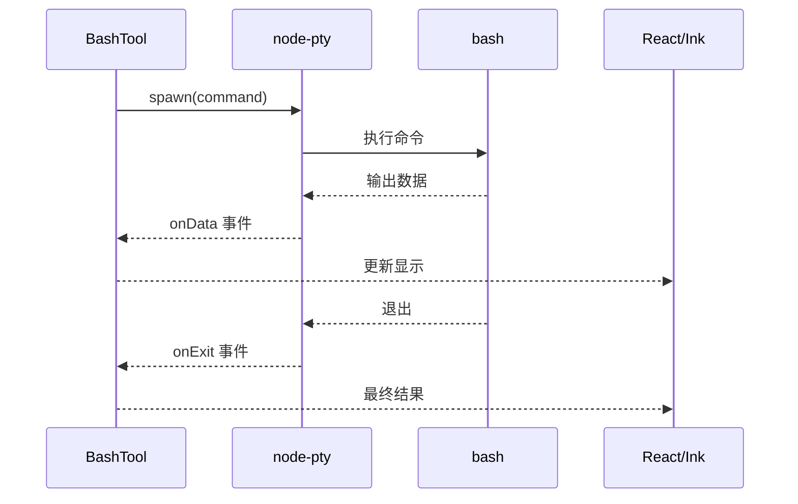
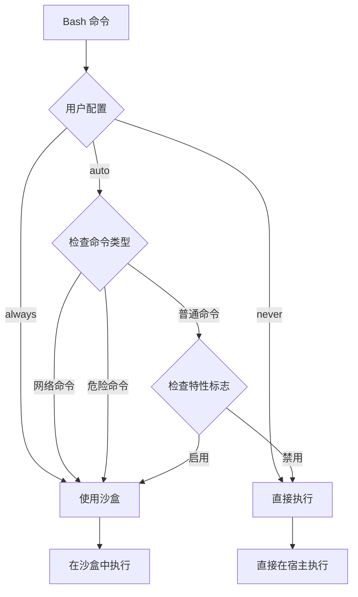

# 第 11 章：工具系统架构（四）：执行工具

> 本章目标：分析命令执行工具的实现。

## 11.1 BashTool 详解

### 命令执行流程

```typescript
// src/tools/BashTool/BashTool.ts (简化版)
export const BashTool = buildTool({
  name: BASH_TOOL_NAME,
  inputSchema: z.object({
    command: z.string().describe('The shell command to execute'),
    name: z.string().optional().describe('Optional command name'),
    background: z.boolean().optional().describe('Run in background'),
  }),

  call: async (args, context) => {
    const { command, name, background = false } = args

    // 1. 安全验证
    const validation = await validateBashCommand(command, context)
    if (!validation.safe) {
      return {
        data: '',
        newMessages: [{
          type: 'system',
          content: `Command rejected: ${validation.reason}`,
        }],
      }
    }

    // 2. 检测命令语义
    const semantics = detectCommandSemantics(command)

    // 3. 权限检查
    const permission = await checkBashPermissions(command, semantics, context)
    if (permission.behavior !== 'allow') {
      return {
        data: permission.message,
        newMessages: [{
          type: 'system',
          content: `Permission denied: ${permission.message}`,
        }],
      }
    }

    // 4. 执行命令
    if (background) {
      return await executeBackground(command, context)
    } else {
      return await executeForeground(command, context)
    }
  },

  description: async (args) => {
    const { command, name } = args
    return name ? `${name}: ${command}` : command
  },

  isReadOnly: (args) => isReadOnlyCommand(args.command),
  isDestructive: (args) => isDestructiveCommand(args.command),
  isConcurrencySafe: (args) => isConcurrencySafeCommand(args.command),
  isSearchOrReadCommand: (args) => isSearchOrReadCommand(args.command),
  requiresUserInteraction: () => false,
  isEnabled: () => true,
  maxResultSizeChars: 100000,
  interruptBehavior: () => 'block',
})
```

### 环境变量处理

```typescript
// 环境变量设置
export function buildEnvironment(
  context: ToolUseContext,
): NodeJS.ProcessEnv {
  const env: NodeJS.ProcessEnv = { ...process.env }

  // 1. 添加 CLI 相关变量
  env.CLAUDE_CODE = '1'
  env.CLAUDE_CODE_CWD = context.options.cwd

  // 2. 添加路径信息
  env.PATH = buildPath(process.env.PATH, context.options.cwd)

  // 3. 添加用户配置的环境变量
  const userEnv = context.options.settings?.environment
  if (userEnv) {
    Object.assign(env, userEnv)
  }

  // 4. 敏感变量保护
  if (env.GITHUB_TOKEN) {
    // 不在命令输出中显示
    Object.defineProperty(env, 'GITHUB_TOKEN', {
      enumerable: false,
    })
  }

  return env
}

// 构建 PATH
function buildPath(existingPath: string | undefined, cwd: string): string {
  const paths = existingPath ? existingPath.split(delimiter) : []

  // 添加项目本地路径
  paths.unshift(join(cwd, 'node_modules', '.bin'))

  return paths.join(delimiter)
}
```

### 输出捕获

```typescript
// 命令输出捕获
export async function executeCommand(
  command: string,
  options: {
    cwd: string
    env: NodeJS.ProcessEnv
    timeout?: number
    onOutput?: (data: string) => void
  },
): Promise<{
  stdout: string
  stderr: string
  exitCode: number
}> {
  const { timeout = 30000 } = options

  // 使用 node-pty 创建伪终端
  const pty = await import('node-pty')

  return new Promise((resolve, reject) => {
    let stdout = ''
    let stderr = ''
    let exitCode = 0

    // 启动伪终端
    const ptyProcess = pty.spawn('bash', ['-l', '-c', command], {
      cwd: options.cwd,
      env: options.env,
      cols: 80,
      rows: 24,
    })

    // 数据回调
    ptyProcess.onData((data) => {
      stdout += data
      options.onOutput?.(data)
    })

    // 错误回调
    ptyProcess.onExit(({ exitCode }) => {
      resolve({
        stdout,
        stderr,
        exitCode: exitCode ?? 0,
      })
    })

    // 超时处理
    if (timeout > 0) {
      setTimeout(() => {
        ptyProcess.kill()
        reject(new Error(`Command timed out after ${timeout}ms`))
      }, timeout)
    }
  })
}
```

### 流式输出



```typescript
// 流式输出实现
export async function*executeCommandStreaming(
  command: string,
  options: {
    cwd: string
    env: NodeJS.ProcessEnv
  },
): AsyncGenerator<{
  type: 'stdout' | 'stderr' | 'exit'
  data: string
  exitCode?: number
}> {
  const pty = await import('node-pty')

  const ptyProcess = pty.spawn('bash', ['-l', '-c', command], {
    cwd: options.cwd,
    env: options.env,
  })

  let exitCode = 0

  // 数据流
  ptyProcess.onData((data) => {
    yield { type: 'stdout', data }
  })

  // 错误流
  ptyProcess.onExit(({ exitCode: code }) => {
    exitCode = code ?? 0
    yield { type: 'exit', data: '', exitCode }
  })

  // 等待退出
  await new Promise<void>((resolve) => {
    ptyProcess.onExit(() => resolve())
  })
}
```

## 11.2 PowerShellTool 详解

### PowerShell 特定处理

```typescript
// src/tools/PowerShellTool/PowerShellTool.ts
export const PowerShellTool = buildTool({
  name: 'PowerShell',
  inputSchema: z.object({
    command: z.string().describe('The PowerShell command to execute'),
  }),

  call: async (args, context) => {
    const { command } = args

    // 检查平台
    if (process.platform !== 'win32') {
      return {
        data: 'PowerShell is only available on Windows',
      }
    }

    // 检查是否启用
    if (!isPowerShellToolEnabled()) {
      return {
        data: 'PowerShell tool is disabled',
      }
    }

    // 转义命令参数
    const escapedCommand = escapePowerShellCommand(command)

    // 执行
    const result = await executePowerShell(escapedCommand, {
      cwd: context.options.cwd,
      env: buildEnvironment(context),
    })

    return { data: result.stdout }
  },

  description: async (args) => `PowerShell: ${args.command}`,
  isEnabled: () => process.platform === 'win32' && isPowerShellToolEnabled(),
  isReadOnly: (args) => isReadOnlyCommand(args.command, 'powershell'),
  maxResultSizeChars: 100000,
})
```

### 参数编码

```typescript
// PowerShell 参数转义
function escapePowerShellCommand(command: string): string {
  // PowerShell 参数编码规则：
  // 1. 空格、引号、特殊字符需要转义
  // 2. 使用反引号 ` 作为转义字符

  const specialChars = ['$', '`', '"', "'", ' ', ';', ',', '(', ')', '{', '}', '|', '&']

  let result = ''
  let inString = false
  let stringChar = ''

  for (let i = 0; i < command.length; i++) {
    const char = command[i]

    // 处理字符串
    if ((char === '"' || char === "'") && (i === 0 || command[i - 1] !== '\\')) {
      if (!inString) {
        inString = true
        stringChar = char
      } else if (char === stringChar) {
        inString = false
        stringChar = ''
      }
      result += char
      continue
    }

    // 字符串内不转义
    if (inString) {
      result += char
      continue
    }

    // 转义特殊字符
    if (specialChars.includes(char)) {
      result += '`' + char
    } else {
      result += char
    }
  }

  return result
}

// 使用示例
escapePowerShellCommand('Get-ChildItem -Path "C:\Program Files"')
// => Get-ChildItem -Path `"C:\`Program Files`"
```

### 输出解析

```typescript
// PowerShell 输出解析
export function parsePowerShellOutput(
  raw: string,
): { stdout: string; stderr: string; objects: unknown[] } {
  // PowerShell 输出格式：
  // 1. 文本输出（默认）
  // 2. 对象输出（可以转换为 JSON）

  let stdout = ''
  let stderr = ''
  const objects: unknown[] = []

  const lines = raw.split('\n')
  for (const line of lines) {
    // 检查是否是错误流
    if (line.startsWith('ERROR: ')) {
      stderr += line.slice(7) + '\n'
    } else if (line.startsWith('WARNING: ')) {
      stderr += line + '\n'
    } else {
      stdout += line + '\n'
    }
  }

  // 尝试解析为 JSON 数组（如果使用了 ConvertTo-Json）
  try {
    const trimmed = stdout.trim()
    if (trimmed.startsWith('[') || trimmed.startsWith('{')) {
      objects = JSON.parse(trimmed)
    }
  } catch {
    // 不是 JSON，保持文本输出
  }

  return { stdout, stderr, objects }
}
```

## 11.3 命令语义分析

### 命令分类

```typescript
// src/tools/BashTool/commandSemantics.ts
export type CommandSemantics = {
  type: 'read' | 'write' | 'delete' | 'network' | 'system' | 'mixed'
  commands: string[]
  files: string[]
  confidence: number
}

export function detectCommandSemantics(command: string): CommandSemantics {
  // 1. 解析命令
  const parsed = tryParseShellCommand(command)
  if (!parsed.success) {
    return {
      type: 'mixed',
      commands: [],
      files: [],
      confidence: 0,
    }
  }

  const commands: string[] = []
  const files: string[] = []
  const types: Set<'read' | 'write' | 'delete' | 'network' | 'system'> = new Set()

  // 2. 分析每个命令段
  for (const segment of parsed.segments) {
    const baseCommand = segment.baseCommand

    commands.push(baseCommand)

    // 分类
    if (READ_COMMANDS.has(baseCommand)) {
      types.add('read')
    } else if (WRITE_COMMANDS.has(baseCommand)) {
      types.add('write')
    } else if (DELETE_COMMANDS.has(baseCommand)) {
      types.add('delete')
    } else if (NETWORK_COMMANDS.has(baseCommand)) {
      types.add('network')
    } else {
      types.add('system')
    }

    // 提取文件参数
    const extractedFiles = extractFiles(segment)
    files.push(...extractedFiles)
  }

  // 3. 确定总体类型
  let type: 'read' | 'write' | 'delete' | 'network' | 'system' | 'mixed'

  if (types.size === 1) {
    type = types.values().next().value
  } else if (types.has('delete') || types.has('write')) {
    // 如果涉及删除或写入，视为混合但偏向危险
    type = 'mixed'
  } else if (types.has('network')) {
    type = 'network'
  } else if (types.has('read')) {
    type = 'read'
  } else {
    type = 'system'
  }

  return {
    type,
    commands,
    files,
    confidence: parsed.confidence,
  }
}

// 命令分类
const READ_COMMANDS = new Set([
  'cat', 'head', 'tail', 'less', 'more',
  'grep', 'rg', 'ag', 'ack',
  'find', 'locate',
  'ls', 'll', 'dir',
  'file', 'stat',
  'git show', 'git log',
  'npm ls', 'pip list',
])

const WRITE_COMMANDS = new Set([
  'echo', 'printf', 'tee',
  'cat', '> redirection',  // cat with >
  'sed', 'awk',
  'git commit', 'git add',
  'npm install', 'pip install',
])

const DELETE_COMMANDS = new Set([
  'rm', 'rmdir', 'del',
  'git clean', 'git reset',
  'npm uninstall', 'pip uninstall',
])

const NETWORK_COMMANDS = new Set([
  'curl', 'wget', 'http', 'ssh', 'scp', 'rsync',
  'git push', 'git pull', 'git fetch',
  'npm install', 'pip install', 'cargo install',
])
```

### 危险命令检测

```typescript
// src/tools/BashTool/bashSecurity.ts
export type DangerLevel = 'safe' | 'low' | 'medium' | 'high' | 'critical'

export function assessDangerLevel(command: string): {
  level: DangerLevel
  reasons: string[]
} {
  const reasons: string[] = []
  let level: DangerLevel = 'safe'

  // 1. 检查已知危险命令
  const baseCommand = extractBaseCommand(command)
  if (DANGEROUS_COMMANDS.has(baseCommand)) {
    level = 'critical'
    reasons.push(`Known dangerous command: ${baseCommand}`)
  }

  // 2. 检查破坏性操作
  if (DESTRUCTIVE_PATTERNS.some(p => p.test(command))) {
    level = level === 'safe' ? 'high' : level
    reasons.push('Destructive operation detected')
  }

  // 3. 检查网络访问
  if (NETWORK_PATTERNS.some(p => p.test(command))) {
    level = level === 'safe' || level === 'low' ? 'medium' : level
    reasons.push('Network access detected')
  }

  // 4. 检查管道和重定向
  if (command.includes('|') || command.includes('>')) {
    if (level === 'safe') {
      level = 'low'
    }
  }

  // 5. 检查命令替换
  if (COMMAND_SUBSTITUTION_PATTERNS.some(p => p.test(command))) {
    level = 'medium'
    reasons.push('Command substitution detected')
  }

  return { level, reasons }
}

const DESTRUCTIVE_PATTERNS = [
  /rm\s+-rf/,
  /rm\s+-rf/,
  /:\s*rm\s+-rf/,  // force :rm -rf
  /dd\s+if=/,
  /mkfs/,
  /format/,
  /del\s*\/q/,
]

const NETWORK_PATTERNS = [
  /\bcurl\b/,
  /\bwget\b/,
  /\bssh\b/,
  /\bscp\b/,
  /\bnc\b/,
  /\btelnet\b/,
]
```

### Git 命令特殊处理

```typescript
// Git 命令语义
export function analyzeGitCommand(command: string): {
  operation: GitOperation
  dangerous: boolean
  reason?: string
} | null {
  const gitMatch = command.match(/^git\s+(\S+)\s*(.*)$/)
  if (!gitMatch) return null

  const [, subCommand, args] = gitMatch

  // 安全操作
  const SAFE_GIT_COMMANDS = [
    'status', 'log', 'show', 'diff', 'branch', 'remote', 'tag',
    'config', 'rev-parse', 'symbolic-ref', 'name-rev',
  ]

  if (SAFE_GIT_COMMANDS.includes(subCommand)) {
    return {
      operation: subCommand as GitOperation,
      dangerous: false,
    }
  }

  // 写操作
  const WRITE_GIT_COMMANDS = [
    'add', 'commit', 'merge', 'rebase', 'cherry-pick',
    'reset', 'restore', 'switch', 'checkout',
  ]

  if (WRITE_GIT_COMMANDS.includes(subCommand)) {
    let reason = `Git write operation: ${subCommand}`

    // 特殊检查
    if (subCommand === 'reset' && args.includes('--hard')) {
      return {
        operation: 'reset',
        dangerous: true,
        reason: 'Git reset --hard discards all local changes',
      }
    }

    if (subCommand === 'clean' && args.includes('-fd')) {
      return {
        operation: 'clean',
        dangerous: true,
        reason: 'Git clean -fd removes untracked files and directories',
      }
    }

    return {
      operation: subCommand as GitOperation,
      dangerous: true,
      reason,
    }
  }

  return null
}
```

## 11.4 沙盒执行

### @anthropic-ai/sandbox-runtime 集成

```typescript
// src/tools/BashTool/shouldUseSandbox.ts
export async function shouldUseSandbox(
  command: string,
  semantics: CommandSemantics,
  context: ToolUseContext,
): Promise<boolean> {
  // 1. 检查用户配置
  const userSetting = context.options.settings?.sandboxMode
  if (userSetting === 'always') return true
  if (userSetting === 'never') return false

  // 2. 检查 GrowthBook 特性标志
  const featureFlag = getFeatureValue('SANDBOX_MODE')
  if (featureFlag === 'enabled') return true

  // 3. 检查命令类型
  if (semantics.type === 'network') {
    // 网络命令使用沙盒
    return true
  }

  // 4. 检查危险级别
  const assessment = assessDangerLevel(command)
  if (assessment.level === 'critical' || assessment.level === 'high') {
    return true
  }

  return false
}

// 沙盒执行
export async function executeInSandbox(
  command: string,
  options: {
    cwd: string
    env: NodeJS.ProcessEnv
  },
): Promise<ExecutionResult> {
  const Sandbox = await import('@anthropic-ai/sandbox-runtime')

  const sandbox = new Sandbox({
    runtime: 'node',
    timeout: 30000,
    memoryLimit: 256 * 1024 * 1024,  // 256MB
    allowNetwork: true,
  })

  try {
    const result = await sandbox.exec(command, {
      cwd: options.cwd,
      env: options.env,
    })

    return {
      stdout: result.stdout,
      stderr: result.stderr,
      exitCode: result.exitCode,
    }
  } finally {
    await sandbox.cleanup()
  }
}
```

### 沙盒决策逻辑



### 权限降级

```typescript
// 沙盒权限降级
export function sandboxPermissions(
  semantics: CommandSemantics,
): SandboxPermissions {
  const permissions: SandboxPermissions = {
    network: false,
    filesystem: 'readonly',
    subprocess: false,
  }

  switch (semantics.type) {
    case 'read':
      permissions.filesystem = 'readonly'
      break

    case 'write':
      permissions.filesystem = 'limited'
      permissions.allowedPaths = semantics.files
      break

    case 'network':
      permissions.network = true
      break

    case 'system':
      permissions.filesystem = 'limited'
      permissions.subprocess = true
      break
  }

  return permissions
}
```

## 11.5 安全控制

### 命令验证

```typescript
// src/tools/BashTool/bashSecurity.ts
export async function validateBashCommand(
  command: string,
  context: ToolUseContext,
): Promise<{ safe: boolean; reason?: string }> {
  // 1. 基础检查
  if (!command || command.trim() === '') {
    return { safe: false, reason: 'Empty command' }
  }

  // 2. 长度检查
  if (command.length > 10000) {
    return { safe: false, reason: 'Command too long' }
  }

  // 3. 危险模式检查
  const check = validateDangerousPatterns(command)
  if (!check.safe) {
    return check
  }

  // 4. 特殊字符检查
  const charCheck = validateSpecialCharacters(command)
  if (!charCheck.safe) {
    return charCheck
  }

  // 5. Shell 注入检查
  const injectionCheck = validateShellInjection(command)
  if (!injectionCheck.safe) {
    return injectionCheck
  }

  return { safe: true }
}

// 危险模式验证
function validateDangerousPatterns(
  command: string,
): { safe: boolean; reason?: string } {
  // 检查已知的危险模式
  const dangerousPatterns = [
    // 命令替换
    /\$\(/,      // $(command)
    /\`/,       // `command`
    // 进程替换
    /<\(/,      // <(command)
    // 重定向
    />\s*\/dev/, // > /dev/
    // 路径遍历
    /\.\.[\/\\]/, // ../ or ..\
  ]

  for (const pattern of dangerousPatterns) {
    if (pattern.test(command)) {
      return {
        safe: false,
        reason: `Dangerous pattern detected: ${pattern.source}`,
      }
    }
  }

  return { safe: true }
}
```

### 路径验证

```typescript
// src/tools/BashTool/pathValidation.ts
export function validateCommandPaths(
  command: string,
  cwd: string,
): { safe: boolean; reason?: string } {
  // 1. 提取路径
  const paths = extractPaths(command)

  // 2. 检查每个路径
  for (const path of paths) {
    // 解析绝对路径
    const resolved = resolve(path, cwd)

    // 检查是否超出工作目录
    const relative = relative(cwd, resolved)
    if (relative.startsWith('..')) {
      return {
        safe: false,
        reason: `Path ${path} escapes working directory`,
      }
    }

    // 检查危险路径
    if (isDangerousSystemPath(resolved)) {
      return {
        safe: false,
        reason: `Dangerous system path: ${resolved}`,
      }
    }
  }

  return { safe: true }
}

function extractPaths(command: string): string[] {
  const paths: string[] = []

  // 正则匹配路径参数
  const pathRegex = /(?:^|\s)([^\s&|;<>]+?)(?=\s|$|[&|;<>])/g
  let match

  while ((match = pathRegex.exec(command)) !== null) {
    const path = match[1]

    // 跳过选项和命令
    if (path.startsWith('-')) continue
    if (BUILTIN_COMMANDS.has(path)) continue

    // 检查是否是路径
    if (/[\/\\]/.test(path) || /\.(?:[a-z]{2,4})$/i.test(path)) {
      paths.push(path)
    }
  }

  return paths
}

const DANGEROUS_SYSTEM_PATHS = new Set([
  '/etc/passwd',
  '/etc/shadow',
  '/etc/sudoers',
  '/root/',
  '/boot/',
  '/sys/',
  '/proc/',
  // Windows
  'C:\\Windows\\System32\\config\\',
  'C:\\Windows\\System32\\drivers\\etc\\hosts',
])
```

### 只读模式

```typescript
// 只读模式验证
export function validateReadOnlyMode(
  command: string,
  semantics: CommandSemantics,
): { safe: boolean; reason?: string } {
  // 在只读模式下，只允许读操作
  const readOnlyAllowed = new Set([
    'cat', 'head', 'tail', 'less', 'more',
    'grep', 'rg', 'ag', 'ack',
    'find', 'locate', 'ls', 'll',
    'file', 'stat', 'du',
    'git log', 'git show', 'git diff', 'git status',
    'echo', 'pwd', 'cd', 'type', 'which',
  ])

  for (const cmd of semantics.commands) {
    const baseCmd = cmd.split(' ')[0]
    if (!readOnlyAllowed.has(baseCmd)) {
      return {
        safe: false,
        reason: `Command "${baseCmd}" not allowed in read-only mode`,
      }
    }
  }

  return { safe: true }
}
```

## 11.6 可复用模式总结

### 模式 24：命令执行工具模板

**描述：** 标准化的命令执行工具实现模板。

**适用场景：**
- 需要执行外部命令
- 需要安全验证
- 需要输出捕获

**代码模板：**

```typescript
function createCommandTool<T extends z.ZodType>(
  config: {
    name: string
    shell: 'bash' | 'powershell' | 'cmd'
    inputSchema: T
    validateCommand?: (command: string, args: z.infer<T>) => Promise<boolean>
    preprocessCommand?: (command: string, args: z.infer<T>) => string
  }
): Tool<T> {
  return {
    name: config.name,
    inputSchema: config.inputSchema,
    call: async (args, context) => {
      const command = preprocessCommand(args, config.preprocessCommand)

      // 1. 验证
      if (config.validateCommand && !await config.validateCommand(command, args)) {
        return {
          data: 'Command validation failed',
          newMessages: [{
            type: 'system',
            content: `Command "${command}" was rejected`,
          }],
        }
      }

      // 2. 执行
      const result = await executeCommand(command, {
        shell: config.shell,
        cwd: context.options.cwd,
        env: buildEnvironment(context),
      })

      return { data: result.stdout }
    },
    description: async (args) => {
      const cmd = preprocessCommand(args, config.preprocessCommand)
      return `${config.shell}: ${cmd}`
    },
    isReadOnly: (args) => isReadOnlyCommand(preprocessCommand(args, config.preprocessCommand)),
    isEnabled: () => isShellAvailable(config.shell),
    maxResultSizeChars: 100000,
  }
}

function preprocessCommand<T>(
  args: z.infer<T>,
  preprocessor?: (command: string, args: T) => string,
): string {
  const command = args.command as string
  return preprocessor ? preprocessor(command, args) : command
}
```

**关键点：**
1. 可插拔的验证器
2. 命令预处理钩子
3. 统一的执行接口
4. 多 Shell 支持

### 模式 25：沙盒决策树

**描述：** 根据命令类型和安全级别决定是否使用沙盒。

**适用场景：**
- 需要隔离不信任的命令
- 多层级的安全策略
- 性能与安全的平衡

**代码模板：**

```typescript
type SandboxPolicy = 'always' | 'never' | 'auto'
type DangerLevel = 'safe' | 'low' | 'medium' | 'high' | 'critical'

class SandboxDecisionTree {
  constructor(
    private readonly userPolicy: SandboxPolicy = 'auto',
    private readonly featureFlag = false,
  ) {}

  shouldUseSandbox(
    command: string,
    dangerLevel: DangerLevel,
    commandType: 'read' | 'write' | 'network' | 'system',
  ): boolean {
    // 1. 用户策略优先
    if (this.userPolicy === 'always') return true
    if (this.userPolicy === 'never') return false

    // 2. 特性标志
    if (this.featureFlag) return true

    // 3. 危险级别
    if (dangerLevel === 'critical' || dangerLevel === 'high') {
      return true
    }

    // 4. 命令类型
    if (commandType === 'network') {
      return true  // 网络命令使用沙盒
    }

    if (commandType === 'read') {
      return false  // 读命令不需要沙盒
    }

    // 5. 写命令根据危险级别
    if (commandType === 'write') {
      return dangerLevel === 'medium' || dangerLevel === 'high'
    }

    return false
  }

  getPermissions(
    commandType: 'read' | 'write' | 'network' | 'system',
  ): SandboxPermissions {
    const base = {
      network: commandType === 'network',
      subprocess: false,
    }

    switch (commandType) {
      case 'read':
        return { ...base, filesystem: 'readonly' }
      case 'write':
        return { ...base, filesystem: 'limited' }
      case 'network':
        return { ...base, filesystem: 'none' }
      case 'system':
        return { ...base, filesystem: 'limited', subprocess: true }
    }
  }
}

// 使用
const sandbox = new SandboxDecisionTree('auto', true)

const decision = sandbox.shouldUseSandbox(
  'curl https://example.com',
  'medium',
  'network',
)
// => true (使用沙盒)

const permissions = sandbox.getPermissions('read')
// => { network: false, filesystem: 'readonly', subprocess: false }
```

**关键点：**
1. 分层决策：用户策略 → 特性标志 → 危险级别 → 命令类型
2. 最小权限原则
3. 可配置的策略
4. 类型安全的权限定义

---

## 本章小结

本章分析了命令执行工具的实现：

1. **BashTool**：执行流程、环境变量、输出捕获、流式输出
2. **PowerShellTool**：特定处理、参数编码、输出解析
3. **命令语义**：命令分类、危险检测、Git 特殊处理
4. **沙盒执行**：集成、决策逻辑、权限降级
5. **安全控制**：命令验证、路径验证、只读模式
6. **可复用模式**：命令执行模板、沙盒决策树

## 下一章预告

第 12 章将分析 Agent 工具系统。
