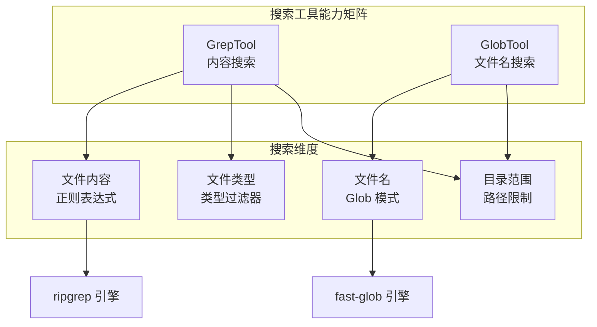
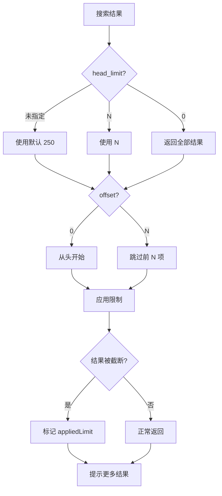
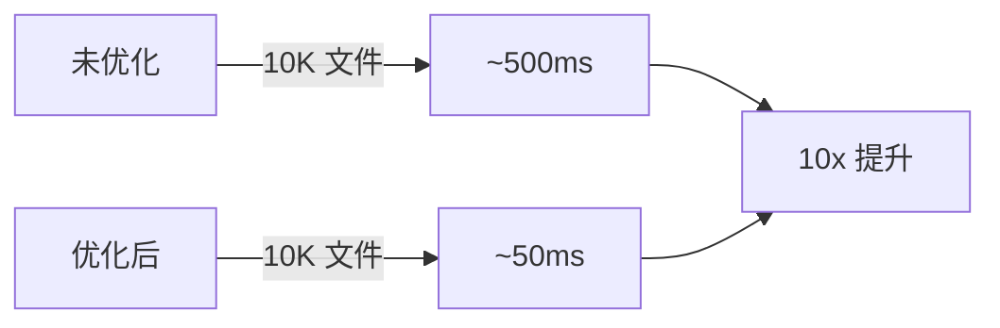
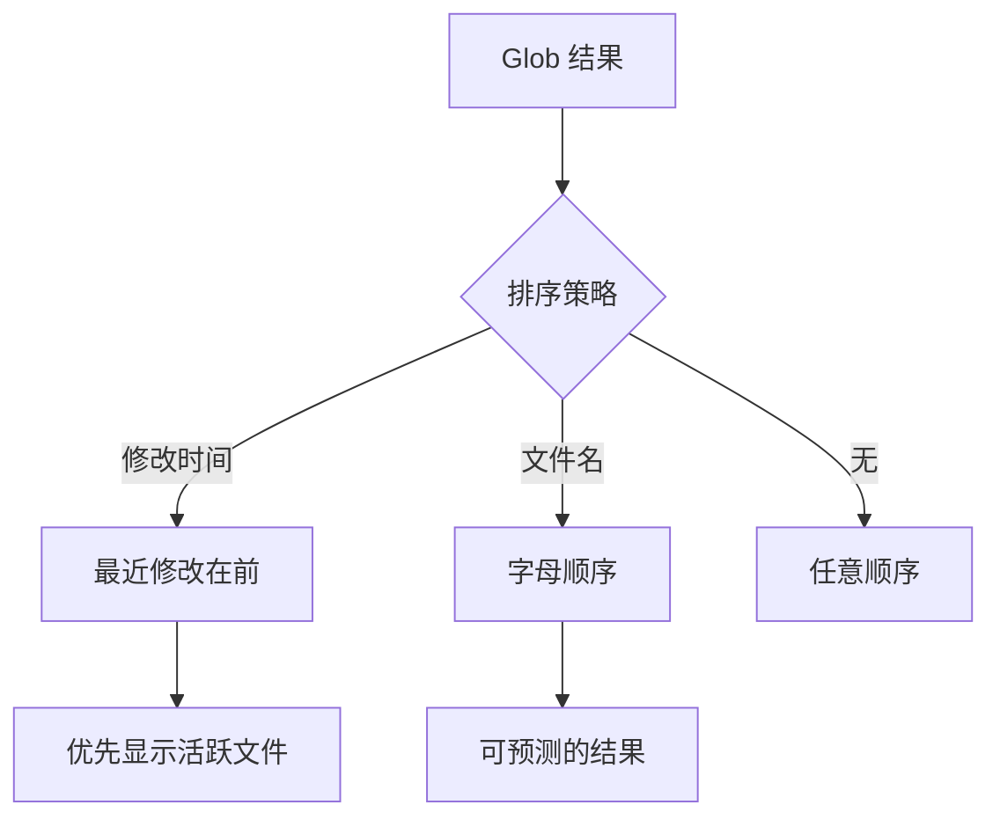
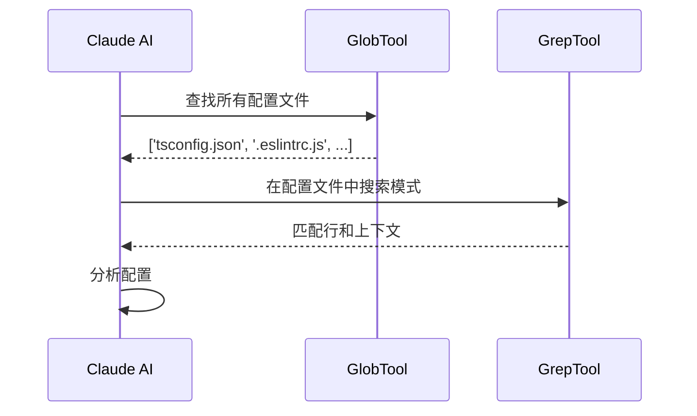
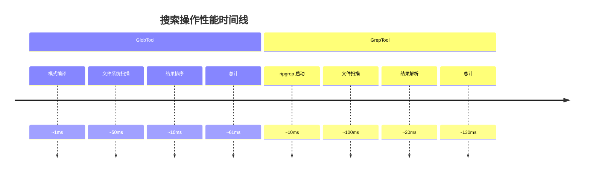

# 第 11 章：搜索工具深度分析

> 本章目标：深入理解 Claude Code 搜索工具的设计与实现，包括 GrepTool 和 GlobTool 的内部机制、性能优化和使用场景。

## 11.1 搜索工具架构概览

Claude Code 的搜索能力是其核心功能之一。通过 GrepTool 和 GlobTool，AI 可以快速导航和理解代码库。



### 11.1.1 工具职责划分

| 工具 | 主要职责 | 底层引擎 | 典型场景 |
|------|----------|----------|----------|
| **GrepTool** | 搜索文件内容 | ripgrep | 查找函数定义、引用、代码模式 |
| **GlobTool** | 匹配文件名 | fast-glob | 查找配置文件、批量操作 |

**设计意图：** 两个工具互补而非竞争。GrepTool 用于"什么"（内容），GlobTool 用于"哪里"（文件）。

## 11.2 GrepTool 深度剖析

### 11.2.1 ripgrep 引擎集成

GrepTool 基于 ripgrep（rg）构建，这是一个极快的文本搜索工具：

```typescript
// src/utils/ripgrep.ts
export async function ripGrep(
  pattern: string,
  options: {
    cwd?: string
    glob?: string[]
    type?: string[]
    ignoreCase?: boolean
    contextBefore?: number
    contextAfter?: number
    multiline?: boolean
  }
): Promise<RipGrepResult> {
  // 构建 ripgrep 命令行参数
  const args = buildRipgrepArgs(pattern, options)

  // 执行 ripgrep
  const { stdout } = await spawnRipgrep(args, options.cwd)

  // 解析结果
  return parseRipgrepOutput(stdout, options)
}
```

**为什么选择 ripgrep？**


### 11.2.2 输入模式架构

GrepTool 支持三种输出模式，每种针对不同场景：

```typescript
type OutputMode = 'content' | 'files_with_matches' | 'count'

interface OutputConfig {
  mode: OutputMode
  showLineNumbers: boolean
  showContext: boolean
  limit?: number
  offset?: number
}
```

**模式对比：**

```mermaid
flowchart TD
    A[GrepTool 调用] --> B{output_mode?}

    B -->|content| C[显示匹配行<br/>+ 上下文]
    B -->|files_with_matches| D[仅文件名列表]
    B -->|count| E[每个文件的匹配数]

    C --> F{-n 行号<br/>-A/-B/-C 上下文]
    D --> G[快速定位文件]
    E --> H[统计信息]

    F --> I[代码阅读<br/>模式理解]
    G --> J[批量处理<br/>文件定位]
    H --> K[代码分析<br/>使用统计]
```

**模式使用示例：**

```typescript
// 示例 1: content 模式 - 查找函数定义
{
  pattern: 'function createTool',
  output_mode: 'content',
  '-B': 2,
  '-C': 5,
  '-n': true
}
// 输出:
// src/Tool.ts:42-47
// 40 | import { z } from 'zod'
// 41 |
// 42: | function createTool(config) {
// 43 |   return buildTool(config)
// 44 | }
// 45 |
// 46 | export { Tool }

// 示例 2: files_with_matches 模式 - 查找所有测试文件
{
  pattern: 'describe\\(',
  glob: '*.test.ts',
  output_mode: 'files_with_matches'
}
// 输出:
// Found 15 files in 45ms
// - src/FileReadTool.test.ts
// - src/GrepTool.test.ts
// ...

// 示例 3: count 模式 - 统计导入数量
{
  pattern: '^import .* from',
  output_mode: 'count'
}
// 输出:
// src/QueryEngine.ts: 127
// src/Tool.ts: 43
// src/tools.ts: 89
```

### 11.2.3 分页机制

GrepTool 实现了高效的分页机制：

```typescript
// 分页参数
interface PaginationParams {
  head_limit?: number   // 返回结果数量限制
  offset?: number        // 跳过前面的结果
}

function applyHeadLimit<T>(
  items: T[],
  limit: number | undefined,
  offset: number = 0,
): { items: T[]; appliedLimit: number | undefined } {
  // 显式的 0 = 无限制
  if (limit === 0) {
    return { items: items.slice(offset), appliedLimit: undefined }
  }

  // 默认限制：250 项
  const effectiveLimit = limit ?? DEFAULT_HEAD_LIMIT
  const sliced = items.slice(offset, offset + effectiveLimit)

  // 只在实际截断时报告限制
  const wasTruncated = items.length - offset > effectiveLimit
  return {
    items: sliced,
    appliedLimit: wasTruncated ? effectiveLimit : undefined,
  }
}
```

**分页策略流程：**



**分页示例：**

```typescript
// 场景: 大型代码库中搜索 "import"
const search1 = {
  pattern: 'import',
  output_mode: 'files_with_matches',
  head_limit: 10,   // 前 10 个文件
  offset: 0
}
// 结果: 10 个文件，提示 "Found 500+ files"

const search2 = {
  pattern: 'import',
  output_mode: 'files_with_matches',
  head_limit: 10,
  offset: 10  // 第 2 页
}
// 结果: 接下来的 10 个文件
```

### 11.2.4 Glob 过滤器

Glob 过滤器允许限制搜索范围：

```typescript
// Glob 参数处理
function buildGlobArgs(patterns: string[]): string[] {
  const globArgs: string[] = []

  for (const pattern of patterns) {
    // 添加 --glob 参数
    globArgs.push('--glob', pattern)
  }

  return globArgs
}

// 示例
{
  pattern: 'function Tool',
  glob: ['*.ts', '*.tsx']  // 只搜索 TypeScript 文件
}

// 转换为 ripgrep 命令
// rg --glob '*.ts' --glob '*.tsx' 'function Tool'
```

**常用 Glob 模式：**

| 模式 | 描述 | 等价 rg 语法 |
|------|------|--------------|
| `*.ts` | 所有 .ts 文件 | `-g '*.ts'` |
| `*.{ts,tsx}` | TypeScript 文件 | `-g '*.{ts,tsx}'` |
| `src/**/*.ts` | src 下递归 | `-g 'src/**/*.ts'` |
| `!test/*.ts` | 排除 test 目录 | `-g '!test/*.ts'` |
| `**/*.test.ts` | 测试文件 | `-g '**/*.test.ts'` |

### 11.2.5 上下文控制

```typescript
// 上下文参数
interface ContextParams {
  '-B'?: number  // Before: 匹配前几行
  '-A'?: number  // After: 匹配后几行
  '-C'?: number  // Context: 前后各几行
  context?: number  // '-C' 的别名
}

function buildContextArgs(params: ContextParams): string[] {
  const args: string[] = []

  // -C 是 -B 和 -A 的快捷方式
  if (params['-C'] !== undefined) {
    args.push('-C', String(params['-C']))
  } else if (params.context !== undefined) {
    args.push('-C', String(params.context))
  } else {
    if (params['-B'] !== undefined) {
      args.push('-B', String(params['-B']))
    }
    if (params['-A'] !== undefined) {
      args.push('-A', String(params['-A']))
    }
  }

  return args
}
```

**上下文示例：**

```bash
# 搜索函数调用，显示前后 2 行
rg 'createTool' -C 2

# 输出:
src/Tool.ts:42  | function createTool(config) {
src/Tool.ts:43  |   const tool = buildTool(config)
src/Tool.ts:44:45 |   return tool
src/Tool.ts:46  | }
```

### 11.2.6 多行搜索

```typescript
// 多行模式
interface MultilineParams {
  multiline?: boolean  // 启用多行模式
}

function buildMultilineArgs(params: MultilineParams): string[] {
  const args: string[] = []

  if (params.multiline) {
    // -U: 启用 multiline 模式
    // --multiline-dotall: 让 . 匹配换行符
    args.push('-U', '--multiline-dotall')
  }

  return args
}
```

**多行搜索示例：**

```typescript
// 多行模式搜索
{
  pattern: 'function.*\\{.*return.*\\}',
  multiline: true,
  glob: '*.ts'
}

// 匹配:
function createTool(config) {
  const tool = buildTool(config)
  return tool
}
```

## 11.3 GlobTool 深度剖析

### 11.3.1 文件名匹配架构

```typescript
// GlobTool 实现
export const GlobTool = buildTool({
  name: 'glob',
  inputSchema: z.object({
    pattern: z.string().describe('Glob 模式'),
    path: z.string().optional().describe('搜索目录'),
  }),

  async call(input, context) {
    // 1. 确定搜索目录
    const searchDir = input.path
      ? expandPath(input.path)
      : getCwd()

    // 2. 执行 glob 匹配
    const files = await glob(input.pattern, {
      cwd: searchDir,
      onlyFiles: true,
      absolute: false,
    })

    // 3. 按修改时间排序
    const sorted = await sortByModificationTime(files, searchDir)

    // 4. 应用结果限制
    const { items, appliedLimit } = applyHeadLimit(
      sorted,
      100,  // 最大 100 个结果
      0
    )

    return {
      filenames: items,
      numFiles: items.length,
      truncated: appliedLimit !== undefined,
      durationMs: endTime - startTime,
    }
  },
})
```

### 11.3.2 Glob 模式语法

```mermaid
graph TB
    subgraph "Glob 模式语法"
        A[基础模式]
        B[通配符]
        C[扩展模式]
    end

    A --> A1['*.ts<br/>所有 .ts 文件']
    A --> A2['src/**/*.ts<br/>src 下递归']

    B --> B1['*<br/>任意字符']
    B --> B2['?<br/>单个字符']
    B --> B3['**<br/>递归目录']

    C --> C1['*.{ts,tsx}<br/>多扩展名']
    C --> C2['!test/**<br/>排除模式']
```

**模式示例：**

| 模式 | 描述 | 匹配示例 |
|------|------|---------|
| `*.ts` | 所有 .ts 文件 | `file.ts`, `src/tool.ts` |
| `src/**/*.ts` | src 下递归 | `src/a/b/c.ts` |
| `**/*test.ts` | 任意测试文件 | `test.ts`, `src/test.ts` |
| `*.{js,ts}` | 多扩展名 | `file.js`, `file.ts` |
| `!node_modules/**` | 排除 | 不匹配 `node_modules/` 下文件 |

### 11.3.3 性能优化

```typescript
// Glob 性能优化策略
interface GlobOptimizations {
  // 1. 并发扫描
  concurrent: boolean

  // 2. 忽略文件
  ignore: string[]

  // 3. 点文件处理
  dot: boolean

  // 4. 绝对路径
  absolute: boolean
}

// 默认优化配置
const DEFAULT_GLOB_CONFIG = {
  onlyFiles: true,        // 只返回文件，不包括目录
  cwd: getCwd(),         // 当前工作目录
  absolute: false,       // 相对路径
  ignore: [
    '**/node_modules/**',  // 排除依赖
    '**/.git/**',         // 排除 VCS
    '**/dist/**',         // 排除构建产物
  ],
}
```

**优化效果：**



### 11.3.4 结果排序

```typescript
// 按修改时间排序
async function sortByModificationTime(
  files: string[],
  cwd: string,
): Promise<string[]> {
  // 获取文件修改时间
  const mtimes = await Promise.all(
    files.map(async file => {
      const fullPath = resolve(cwd, file)
      const stats = await fs.stat(fullPath)
      return { file, mtime: stats.mtimeMs }
    })
  )

  // 按时间倒序排序
  mtimes.sort((a, b) => b.mtime - a.mtime)

  return mtimes.map(m => m.file)
}
```

**排序策略：**



## 11.4 搜索工具组合使用

### 11.4.1 典型工作流



**组合示例：**

```typescript
// 步骤 1: 找到所有 package.json
const packages = await GlobTool.call({
  pattern: '**/package.json'
})

// 步骤 2: 搜索依赖
const deps = await GrepTool.call({
  pattern: '"dependencies"',
  glob: 'package.json',
  output_mode: 'content',
  '-C': 3
})
```

### 11.4.2 搜索模式库

```typescript
// 预定义搜索模式
const SEARCH_PATTERNS = {
  // 查找函数定义
  functionDefinition: {
    pattern: '(async\s+)?function\s+\w+\s*\\(',
    glob: '*.{js,ts}',
    output_mode: 'content',
    '-B': 1,
  },

  // 查找导入语句
  imports: {
    pattern: '^import .* from',
    glob: '*.{ts,tsx}',
    output_mode: 'content',
  },

  // 查找 TODO/FIXME
  todos: {
    pattern: '(TODO|FIXME|XXX):',
    glob: '*.{js,ts,tsx,jsx}',
    output_mode: 'content',
    '-C': 2,
  },

  // 查找测试
  tests: {
    pattern: '(describe|it|test)\\(',
    glob: '*.test.{ts,js}',
    output_mode: 'files_with_matches',
  },
}
```

## 11.5 性能分析与优化

### 11.5.1 搜索性能基准



### 11.5.2 优化策略

```typescript
// 搜索优化配置
interface SearchOptimizations {
  // 1. 缓存结果
  cacheEnabled: boolean
  cacheTTL: number

  // 2. 并发搜索
  concurrent: boolean

  // 3. 增量搜索
  incremental: boolean

  // 4. 智能排除
  smartExclude: boolean
}

// 缓存实现
const searchCache = new LRUCache<string, SearchResult>({
  maxSize: 100,
  ttl: 60000,  // 1 分钟
})

async function cachedSearch(
  tool: 'grep' | 'glob',
  input: SearchInput,
): Promise<SearchResult> {
  const cacheKey = JSON.stringify({ tool, input })

  const cached = searchCache.get(cacheKey)
  if (cached && !isStale(cached)) {
    return cached
  }

  const result = await executeSearch(tool, input)
  searchCache.set(cacheKey, result)

  return result
}
```

## 11.6 作者观点：搜索工具的设计权衡

### 11.6.1 架构优势

1. **高性能引擎**：ripgrep 和 fast-glob 都经过高度优化
2. **灵活的输出模式**：三种模式覆盖不同使用场景
3. **强大的过滤**：glob、type、路径过滤
4. **分页支持**：处理大型结果集

### 11.6.2 设计问题

**问题 1：结果限制过于保守**

默认 250 项的限制对于大型代码库可能不够：

```typescript
const DEFAULT_HEAD_LIMIT = 250  // 可能太低
```

**建议：** 根据项目大小动态调整。

**问题 2：缺少模糊搜索**

当前只支持精确正则匹配，不支持模糊搜索：

```typescript
// 当前: 精确匹配
{ pattern: 'createTool' }  // 必须完全匹配

// 期望: 模糊搜索
{ pattern: 'createtool', fuzzy: true }  // 可以匹配 createTool
```

### 11.6.3 改进建议

1. **智能限制**：根据结果大小动态调整限制
2. **搜索建议**：提供模式建议和补全
3. **结果聚合**：支持跨目录搜索聚合
4. **可视化**：提供搜索结果的可视化展示

## 可复用模式总结

### 模式 16：输出模式多态性

**描述：** 根据使用场景提供不同的输出模式。

**适用场景：**
- 搜索工具
- 日志工具
- 数据查询

**代码模板：**

```typescript
type OutputMode = 'full' | 'summary' | 'count'

function formatOutput<T>(
  data: T[],
  mode: OutputMode,
): string | T[] {
  switch (mode) {
    case 'full':
      return JSON.stringify(data, null, 2)

    case 'summary':
      return `Found ${data.length} items`

    case 'count':
      return String(data.length)

    default:
      throw new Error(`Unknown mode: ${mode}`)
  }
}
```

### 模式 17：分页与截断

**描述：** 对大型结果集进行分页和截断。

**适用场景：**
- 搜索结果
- 日志文件
- 数据列表

**代码模板：**

```typescript
interface PaginatedResult<T> {
  items: T[]
  total: number
  hasMore: boolean
  nextOffset?: number
}

function paginate<T>(
  items: T[],
  limit: number,
  offset: number = 0,
): PaginatedResult<T> {
  const sliced = items.slice(offset, offset + limit)
  const hasMore = offset + limit < items.length

  return {
    items: sliced,
    total: items.length,
    hasMore,
    nextOffset: hasMore ? offset + limit : undefined,
  }
}
```

### 模式 18：过滤器链

**描述：** 通过多个过滤器链式处理结果。

**适用场景：**
- 文件搜索
- 日志分析
- 数据处理

**代码模板：**

```typescript
interface Filter<T> {
  (items: T[]): T[]
  name: string
}

function applyFilters<T>(items: T[], filters: Filter<T>[]): T[] {
  return filters.reduce((acc, filter) => filter(acc), items)
}

// 使用
const results = applyFilters(files, [
  files => files.filter(f => f.endsWith('.ts')),
  files => files.filter(f => !f.includes('test')),
  files => files.slice(0, 100),
])
```

## 本章小结

本章深入分析了 Claude Code 的搜索工具：

1. **GrepTool**：ripgrep 集成、输出模式、分页机制、上下文控制、多行搜索
2. **GlobTool**：文件名匹配、glob 语法、性能优化、结果排序
3. **组合使用**：典型工作流、搜索模式库
4. **性能分析**：基准测试、优化策略
5. **作者观点**：设计权衡、改进建议

## 下一章预告

第 12 章将深入分析执行工具，包括 BashTool 和 PowerShellTool。
