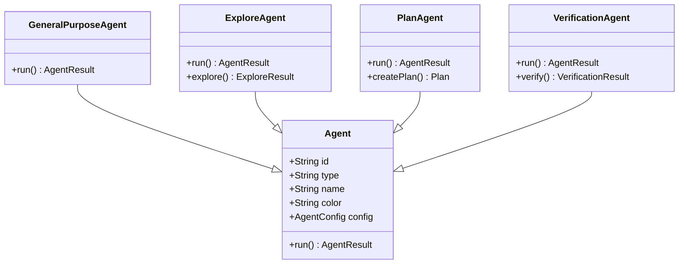
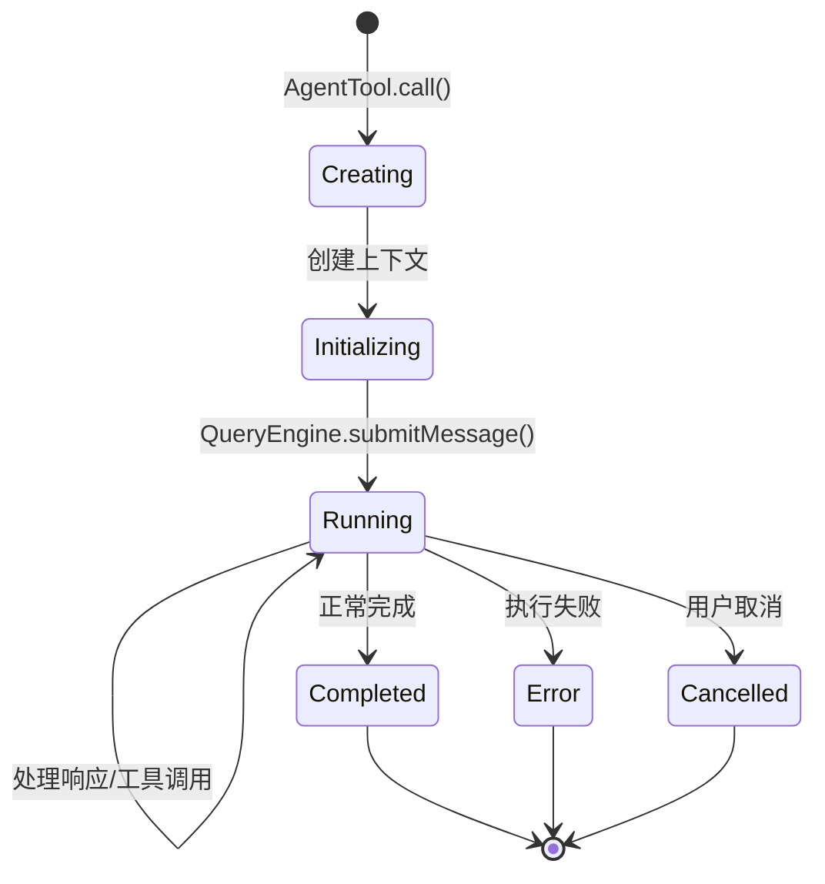
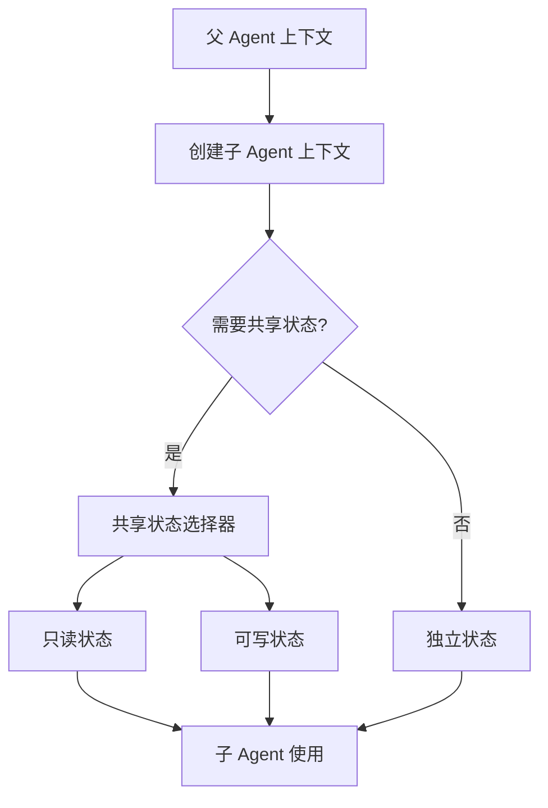

# 第 12 章：工具系统架构（五）：Agent 工具系统

> 本章目标：深入分析子 Agent 生成和管理工具。

## 12.1 AgentTool 详解

### 子 Agent 生成流程

```typescript
// src/tools/AgentTool/AgentTool.ts
export const AgentTool = buildTool({
  name: 'AgentTool',
  inputSchema: z.object({
    agentType: z.enum([
      'generalPurposeAgent',
      'exploreAgent',
      'planAgent',
      'claudeCodeGuideAgent',
      'verificationAgent',
      'statuslineSetupAgent',
    ]).describe('The type of agent to spawn'),
    prompt: z.string().describe('The prompt for the agent'),
    context: z.string().optional().describe('Additional context'),
    name: z.string().optional().describe('Agent name for routing'),
    color: z.string().optional().describe('Agent display color'),
  }),

  call: async (args, context) => {
    const { agentType, prompt, context: additionalContext, name, color } = args

    // 1. 创建 Agent 配置
    const agentConfig: AgentConfig = {
      type: agentType,
      prompt,
      context: additionalContext,
      name,
      color,
      parentContext: context,
    }

    // 2. 获取 Agent 定义
    const agentDef = getAgentDefinition(agentType, context)

    // 3. 创建子 Agent 上下文
    const subagentContext = createSubagentContext(context, {
      agentId: generateAgentId(),
      agentType,
      name,
      color,
    })

    // 4. 运行 Agent
    const result = await runAgent(agentDef, agentConfig, subagentContext)

    return {
      data: result.output,
      newMessages: result.messages,
    }
  },

  description: async (args) => {
    return `Spawn a ${args.agentType} agent: ${args.prompt.slice(0, 50)}...`
  },

  isEnabled: () => true,
  maxResultSizeChars: 50000,
})
```

### Agent 类型系统



```typescript
// Agent 类型定义
export type AgentType =
  | 'generalPurposeAgent'
  | 'exploreAgent'
  | 'planAgent'
  | 'claudeCodeGuideAgent'
  | 'verificationAgent'
  | 'statuslineSetupAgent'

// Agent 配置
export type AgentConfig = {
  type: AgentType
  prompt: string
  context?: string
  name?: string
  color?: AgentColorName
  parentContext: ToolUseContext
  model?: string
  maxTurns?: number
  maxBudget?: number
}

// Agent 定义
export type AgentDefinition = {
  name: string
  description: string
  systemPrompt: string
  tools?: Tool[]
  commands?: Command[]
  create: (config: AgentConfig) => Agent
}
```

### Agent 生命周期管理



```typescript
// Agent 生命周期管理器
class AgentLifecycleManager {
  private agents = new Map<AgentId, AgentState>()

  async spawn(config: AgentConfig): Promise<AgentId> {
    const agentId: AgentId = generateAgentId()

    // 1. 创建状态
    this.agents.set(agentId, {
      status: 'initializing',
      config,
      createdAt: Date.now(),
      messages: [],
    })

    // 2. 初始化
    const agent = await this.createAgent(config)

    this.agents.set(agentId, {
      status: 'running',
      agent,
      startedAt: Date.now(),
    })

    // 3. 运行（后台）
    this.runAgent(agentId, agent).catch(error => {
      this.agents.set(agentId, {
        status: 'error',
        error: String(error),
        completedAt: Date.now(),
      })
    })

    return agentId
  }

  async getAgent(agentId: AgentId): Promise<AgentState> {
    const state = this.agents.get(agentId)
    if (!state) {
      throw new Error(`Agent not found: ${agentId}`)
    }
    return state
  }

  private async createAgent(config: AgentConfig): Promise<Agent> {
    const agentDef = getAgentDefinition(config.type, config.parentContext)

    // 创建 QueryEngine
    const engine = new QueryEngine({
      cwd: config.parentContext.options.cwd,
      tools: agentDef.tools ?? config.parentContext.options.tools,
      commands: agentDef.commands ?? config.parentContext.options.commands,
      // ...
    })

    return agentDef.create({
      ...config,
      engine,
    })
  }

  private async runAgent(agentId: AgentId, agent: Agent): Promise<void> {
    const state = this.agents.get(agentId)!
    const result = await agent.run()

    this.agents.set(agentId, {
      status: 'completed',
      result,
      completedAt: Date.now(),
    })
  }
}

type AgentState =
  | { status: 'initializing'; config: AgentConfig; createdAt: number }
  | { status: 'running'; agent: Agent; startedAt: number }
  | { status: 'completed'; result: AgentResult; completedAt: number }
  | { status: 'error'; error: string; completedAt: number }
```

## 12.2 内置 Agent 类型

### generalPurposeAgent

```typescript
// src/tools/AgentTool/built-in/generalPurposeAgent.ts
export const generalPurposeAgent: AgentDefinition = {
  name: 'generalPurposeAgent',
  description: 'General-purpose agent for flexible task execution',
  systemPrompt: DEFAULT_AGENT_SYSTEM_PROMPT,
  tools: null,  // 继承所有工具
  commands: null,  // 继承所有命令

  create: (config) => new GeneralPurposeAgent(config),
}

class GeneralPurposeAgent implements Agent {
  constructor(private config: AgentConfig) {}

  async run(): Promise<AgentResult> {
    const { engine } = this.config
    const messages: Message[] = []

    // 1. 发送用户消息
    for await (const message of engine.submitMessage(this.config.prompt)) {
      messages.push(message)
    }

    return {
      output: extractOutput(messages),
      messages,
    }
  }
}
```

### exploreAgent

```typescript
// src/tools/AgentTool/built-in/exploreAgent.ts
export const exploreAgent: AgentDefinition = {
  name: 'exploreAgent',
  description: 'Agent optimized for codebase exploration',
  systemPrompt: EXPLORE_SYSTEM_PROMPT,
  tools: ['GrepTool', 'GlobTool', 'FileReadTool', 'LSPTool'],
  commands: [],

  create: (config) => new ExploreAgent(config),
}

const EXPLORE_SYSTEM_PROMPT = `
You are a codebase exploration agent. Your goal is to help the user
understand a codebase by searching, reading files, and summarizing findings.

Key strategies:
1. Start with broad searches to understand structure
2. Read key files to understand patterns
3. Build a mental model of the codebase
4. Summarize your findings clearly
`

class ExploreAgent implements Agent {
  private explorationState = {
    visitedFiles: new Set<string>(),
    structure: new Map<string, DirStructure>(),
  }

  async run(): Promise<AgentResult> {
    // 探索逻辑
    const findings: string[] = []

    // 1. 识别项目结构
    const structure = await this.analyzeStructure()
    findings.push(`Project structure: ${structure.summary}`)

    // 2. 搜索关键模式
    const patterns = await this.searchPatterns()
    findings.push(`Key patterns: ${patterns.join(', ')}`)

    // 3. 读取关键文件
    const keyFiles = await this.readKeyFiles()
    findings.push(`Key files: ${keyFiles.join(', ')}`)

    return {
      output: findings.join('\n\n'),
      metadata: {
        structure,
        patterns,
        keyFiles,
      },
    }
  }

  private async analyzeStructure(): Promise<DirStructure> {
    // 使用 GlobTool 分析目录结构
    // ...
  }

  private async searchPatterns(): Promise<string[]> {
    // 使用 GrepTool 搜索模式
    // ...
  }

  private async readKeyFiles(): Promise<string[]> {
    // 使用 FileReadTool 读取文件
    // ...
  }
}
```

### planAgent

```typescript
// src/tools/AgentTool/built-in/planAgent.ts
export const planAgent: AgentDefinition = {
  name: 'planAgent',
  description: 'Agent for creating implementation plans',
  systemPrompt: PLAN_SYSTEM_PROMPT,
  tools: ['GrepTool', 'GlobTool', 'FileReadTool', 'ToolSearchTool'],
  commands: [],

  create: (config) => new PlanAgent(config),
}

const PLAN_SYSTEM_PROMPT = `
You are a planning agent. Your goal is to create detailed implementation
plans for software development tasks.

A good plan should:
1. Break down the task into clear steps
2. Identify dependencies between steps
3. Consider edge cases and error handling
4. Suggest testing strategies
5. Estimate complexity and effort

Output your plan in a structured format using markdown.
`

class PlanAgent implements Agent {
  async run(): Promise<AgentResult> {
    // 1. 分析任务
    const taskAnalysis = await this.analyzeTask()

    // 2. 创建计划
    const plan = await this.createPlan(taskAnalysis)

    // 3. 验证计划
    const validation = await this.validatePlan(plan)

    return {
      output: this.formatPlan(plan, validation),
      metadata: { plan, validation },
    }
  }

  private async analyzeTask(): Promise<TaskAnalysis> {
    // 分析用户请求
    // ...
  }

  private async createPlan(analysis: TaskAnalysis): Promise<ImplementationPlan> {
    // 创建实现计划
    // ...
  }

  private async validatePlan(plan: ImplementationPlan): Promise<PlanValidation> {
    // 验证计划的可行性
    // ...
  }

  private formatPlan(plan: ImplementationPlan, validation: PlanValidation): string {
    // 格式化计划输出
    // ...
  }
}
```

### 其他 Agent 类型

```typescript
// claudeCodeGuideAgent - Claude Code 使用指南
export const claudeCodeGuideAgent: AgentDefinition = {
  name: 'claudeCodeGuideAgent',
  description: 'Agent for answering questions about Claude Code itself',
  systemPrompt: `
You are a Claude Code expert. Answer questions about:
- How Claude Code works
- How to use specific features
- Best practices and tips
- Troubleshooting common issues
`,
  tools: ['GrepTool', 'FileReadTool'],
  commands: [],
  create: (config) => new GuideAgent(config),
}

// verificationAgent - 代码验证 Agent
export const verificationAgent: AgentDefinition = {
  name: 'verificationAgent',
  description: 'Agent for verifying implementation against plans',
  systemPrompt: `
You are a verification agent. Your job is to:
1. Compare implementation against the original plan
2. Identify missing features
3. Flag deviations from the plan
4. Suggest improvements
`,
  tools: ['GrepTool', 'FileReadTool', 'BashTool'],
  commands: ['test'],
  create: (config) => new VerificationAgent(config),
}

// statuslineSetupAgent - 状态栏配置 Agent
export const statuslineSetupAgent: AgentDefinition = {
  name: 'statuslineSetupAgent',
  description: 'Agent for configuring statusline in IDEs',
  systemPrompt: `
You help users configure Claude Code statusline in their IDE.
Provide step-by-step instructions for VS Code, JetBrains, etc.
`,
  tools: [],
  commands: [],
  create: (config) => new StatuslineAgent(config),
}
```

## 12.3 Agent 上下文管理

### 上下文隔离

```typescript
// 子 Agent 上下文创建
export function createSubagentContext(
  parentContext: ToolUseContext,
  options: {
    agentId: AgentId
    agentType: string
    name?: string
    color?: AgentColorName
    preserveToolUseResults?: boolean
    memoryLimit?: number
  },
): ToolUseContext {
  // 创建新的状态存储
  const subagentAppState: Partial<AppState> = {
    // 继承部分状态
    settings: parentContext.options.settings,
    toolPermissionContext: {
      ...parentContext.options.toolPermissionContext,
      // 可能需要更严格的权限
      mode: 'default',
    },

    // Agent 特定状态
    standaloneAgentContext: {
      name: options.name,
      color: options.color,
    },

    // 父 Agent 引用
    parentAgentId: parentContext.agentId,
  }

  // 创建子 QueryEngine
  const subEngine = new QueryEngine({
    ...extractConfig(parentContext),
    initialMessages: [],  // 空消息历史
    readFileCache: cloneFileStateCache(parentContext.readFileState),
  })

  return {
    ...parentContext,
    agentId: options.agentId,
    agentType: options.agentType,
    preserveToolUseResults: options.preserveToolUseResults ?? false,

    // 子 Agent 的状态更新不直接影响父状态
    setAppState: () => {},  // no-op
    setAppStateForTasks: parentContext.setAppStateForTasks ?? parentContext.setAppState,

    // 新的 QueryEngine
    options: {
      ...parentContext.options,
      engine: subEngine,
    },

    // 清空消息历史
    messages: [],

    // 新的 abort controller
    abortController: new AbortController(),

    // 内存限制
    memoryLimit: options.memoryLimit,
  }
}
```

### 共享状态传递



```typescript
// 状态共享策略
export interface SharedStateSelector<T> {
  get: (parentState: AppState) => T
  set?: (value: T, parentSetAppState: SetAppStateFn) => void
}

// 预定义的选择器
const SHARED_SELECTORS = {
  // 工具决策缓存（只读共享）
  toolDecisions: {
    get: (state) => state.toolDecisions,
  },

  // 文件历史（只读共享）
  fileHistory: {
    get: (state) => state.fileHistory,
  },

  // 插件状态（只读共享）
  plugins: {
    get: (state) => state.plugins,
  },

  // 任务注册表（可写共享）
  tasks: {
    get: (state) => state.tasks,
    set: (value, setAppState) => {
      setAppState(prev => ({ ...prev, tasks: value }))
    },
  },
}

// 应用共享状态
export function applySharedState(
  subagentContext: ToolUseContext,
  parentContext: ToolUseContext,
  selectors: (keyof typeof SHARED_SELECTORS)[],
): ToolUseContext {
  const parentState = parentContext.getAppState()

  const sharedState: Partial<ToolUseContext> = {}

  for (const key of selectors) {
    const selector = SHARED_SELECTORS[key]
    sharedState[key] = selector.get(parentState)
  }

  return {
    ...subagentContext,
    ...sharedState,
  }
}
```

### 内存管理

```typescript
// Agent 内存管理
export class AgentMemoryManager {
  private memories = new Map<AgentId, AgentMemory>()

  constructor(private readonly maxMemory: number = 50 * 1024 * 1024) {} // 50MB

  save(agentId: AgentId, memory: AgentMemory): void {
    // 检查内存限制
    const currentSize = this.getCurrentSize()
    const newSize = currentSize + this.getMemorySize(memory)

    if (newSize > this.maxMemory) {
      // 清理最旧的内存
      this.evictOldest(newSize - this.maxMemory)
    }

    this.memories.set(agentId, memory)
  }

  get(agentId: AgentId): AgentMemory | undefined {
    return this.memories.get(agentId)
  }

  private getCurrentSize(): number {
    let size = 0
    for (const memory of this.memories.values()) {
      size += this.getMemorySize(memory)
    }
    return size
  }

  private getMemorySize(memory: AgentMemory): number {
    return JSON.stringify(memory).length * 2  // 粗略估算
  }

  private evictOldest(targetSize: number): void {
    let evicted = 0

    // 按 LRU 顺序删除
    for (const [agentId, memory] of this.memories) {
      if (evicted >= targetSize) break

      evicted += this.getMemorySize(memory)
      this.memories.delete(agentId)
    }
  }
}

type AgentMemory = {
  agentId: AgentId
  agentType: string
  createdAt: number
  lastAccessedAt: number
  summary: string
  keyFindings: string[]
  messageCount: number
}
```

## 12.4 Agent 颜色与显示

### Agent 视觉标识

```typescript
// src/tools/AgentTool/agentColorManager.ts
export type AgentColorName =
  | 'blue'
  | 'green'
  | 'yellow'
  | 'red'
  | 'magenta'
  | 'cyan'
  | 'orange'
  | 'purple'
  | 'pink'
  | 'lime'

export const AGENT_COLORS: Record<AgentColorName, { bg: string; fg: string; name: string }> = {
  blue: { bg: '#0044ff', fg: '#ffffff', name: 'Blue' },
  green: { bg: '#00cc00', fg: '#ffffff', name: 'Green' },
  yellow: { bg: '#ffcc00', fg: '#000000', name: 'Yellow' },
  red: { bg: '#ff0000', fg: '#ffffff', name: 'Red' },
  magenta: { bg: '#ff00ff', fg: '#000000', name: 'Magenta' },
  cyan: { bg: '#00cccc', fg: '#000000', name: 'Cyan' },
  orange: { bg: '#ff8800', fg: '#ffffff', name: 'Orange' },
  purple: { bg: '#8800ff', fg: '#ffffff', name: 'Purple' },
  pink: { bg: '#ff66cc', fg: '#000000', name: 'Pink' },
  lime: { bg: '#ccff00', fg: '#000000', name: 'Lime' },
}
```

### 颜色分配策略

```typescript
// Agent 颜色分配器
export class AgentColorManager {
  private usedColors = new Set<AgentColorName>()
  private agentColors = new Map<AgentId, AgentColorName>()

  assignColor(agentId: AgentId, preferred?: AgentColorName): AgentColorName {
    // 1. 如果已分配，返回现有颜色
    if (this.agentColors.has(agentId)) {
      return this.agentColors.get(agentId)!
    }

    // 2. 尝试分配首选颜色
    if (preferred && !this.usedColors.has(preferred)) {
      this.usedColors.add(preferred)
      this.agentColors.set(agentId, preferred)
      return preferred
    }

    // 3. 分配可用颜色
    const available = this.getAvailableColors()
    const color = available[0] ?? this.getRandomColor()

    this.usedColors.add(color)
    this.agentColors.set(agentId, color)

    return color
  }

  releaseColor(agentId: AgentId): void {
    const color = this.agentColors.get(agentId)
    if (color) {
      this.usedColors.delete(color)
      this.agentColors.delete(agentId)
    }
  }

  private getAvailableColors(): AgentColorName[] {
    return Object.keys(AGENT_COLORS)
      .filter(k => !this.usedColors.has(k as AgentColorName))
      .sort() as AgentColorName[]
  }

  private getRandomColor(): AgentColorName {
    const colors = Object.keys(AGENT_COLORS) as AgentColorName[]
    return colors[Math.floor(Math.random() * colors.length)]
  }

  getColor(agentId: AgentId): AgentColorName | undefined {
    return this.agentColors.get(agentId)
  }

  getColorInfo(agentId: AgentId): { bg: string; fg: string } | undefined {
    const colorName = this.agentColors.get(agentId)
    if (colorName) {
      return AGENT_COLORS[colorName]
    }
    return undefined
  }
}
```

## 12.5 Agent 恢复机制

### 后台 Agent 持久化

```typescript
// src/tasks/LocalAgentTask.ts
export class LocalAgentTask {
  async save(): Promise<void> {
    const state: SerializedAgentState = {
      agentId: this.agentId,
      agentType: this.agentType,
      name: this.name,
      color: this.color,
      prompt: this.prompt,
      messages: this.messages,
      status: this.status,
      createdAt: this.createdAt,
      startedAt: this.startedAt,
    }

    const filePath = getAgentStateFilePath(this.agentId)
    await writeFile(filePath, JSON.stringify(state, null, 2))
  }

  static async load(agentId: AgentId): Promise<LocalAgentTask> {
    const filePath = getAgentStateFilePath(agentId)
    const content = await readFile(filePath, 'utf-8')
    const state = JSON.parse(content) as SerializedAgentState

    const task = new LocalAgentTask(state.prompt, {
      agentId: state.agentId,
      agentType: state.agentType,
      name: state.name,
      color: state.color,
    })

    task.restoreState(state)

    return task
  }
}
```

### 状态恢复

```typescript
// Agent 状态恢复
export function restoreAgentState(
  state: SerializedAgentState,
): ToolUseContext {
  // 1. 重建消息历史
  const messages = state.messages.map(msg => normalizeMessage(msg))

  // 2. 重建 QueryEngine
  const engine = new QueryEngine({
    cwd: process.cwd(),
    tools: getAllBaseTools(),
    commands: getAllCommands(),
    initialMessages: messages,
    // ...
  })

  // 3. 重建上下文
  const context: ToolUseContext = {
    agentId: state.agentId,
    agentType: state.agentType,
    messages,
    abortController: new AbortController(),
    // ...
  }

  return context
}

// 恢复点管理
export class AgentCheckpointManager {
  private checkpoints = new Map<string, AgentCheckpoint>()

  async createCheckpoint(agentId: AgentId): Promise<string> {
    const checkpointId = generateCheckpointId()

    const checkpoint: AgentCheckpoint = {
      id: checkpointId,
      agentId,
      timestamp: Date.now(),
      state: this.captureState(agentId),
    }

    await this.saveCheckpoint(checkpoint)
    this.checkpoints.set(checkpointId, checkpoint)

    return checkpointId
  }

  async restoreCheckpoint(checkpointId: string): Promise<void> {
    const checkpoint = this.checkpoints.get(checkpointId)
    if (!checkpoint) {
      throw new Error(`Checkpoint not found: ${checkpointId}`)
    }

    // 恢复状态
    await this.restoreState(checkpoint.state)
  }

  private captureState(agentId: AgentId): CapturedState {
    // 捕获当前状态
    // ...
  }

  private async saveCheckpoint(checkpoint: AgentCheckpoint): Promise<void> {
    const filePath = getCheckpointFilePath(checkpoint.id)
    await writeFile(filePath, JSON.stringify(checkpoint, null, 2))
  }
}
```

### 内存快照

```typescript
// Agent 内存快照
export class AgentMemorySnapshot {
  private snapshots = new Map<AgentId, MemorySnapshot>()

  async createSnapshot(agentId: AgentId): Promise<MemorySnapshot> {
    // 1. 捕获内存状态
    const memory = await this.captureMemory(agentId)

    // 2. 捕获文件缓存
    const fileCache = await this.captureFileCache(agentId)

    // 3. 捕获消息历史
    const messages = await this.captureMessages(agentId)

    const snapshot: MemorySnapshot = {
      agentId,
      timestamp: Date.now(),
      memory,
      fileCache,
      messages,
      size: this.calculateSize(memory, fileCache, messages),
    }

    this.snapshots.set(agentId, snapshot)

    return snapshot
  }

  private async captureMemory(agentId: AgentId): Promise<AgentMemory> {
    // 捕获 Agent 的内存状态
    // ...
  }

  private async captureFileCache(agentId: AgentId): Promise<FileStateCache> {
    // 捕获文件读取缓存
    // ...
  }

  private async captureMessages(agentId: AgentId): Promise<Message[]> {
    // 捕获消息历史
    // ...
  }

  private calculateSize(...parts: unknown[]): number {
    return JSON.stringify(parts).length * 2
  }
}
```

## 12.6 可复用模式总结

### 模式 26：子 Agent 生成模式

**描述：** 创建和管理子 Agent 的标准模式。

**适用场景：**
- 需要并行处理任务
- 需要专门的 Agent 处理特定任务
- 需要任务隔离

**代码模板：**

```typescript
// Agent 定义接口
interface AgentDefinition<TConfig = {}> {
  name: string
  description: string
  systemPrompt: string
  tools?: Tool[] | ((config: TConfig) => Tool[])
  create(config: AgentConfig & TConfig): Agent
}

// Agent 接口
interface Agent {
  run(): Promise<AgentResult>
  cancel(): void
  getState(): AgentState
}

// Agent 工厂
class AgentFactory {
  private registry = new Map<string, AgentDefinition>()

  register<TConfig>(definition: AgentDefinition<TConfig>): void {
    this.registry.set(definition.name, definition)
  }

  create<TConfig>(
    type: string,
    config: AgentConfig & TConfig,
  ): Agent {
    const definition = this.registry.get(type)
    if (!definition) {
      throw new Error(`Unknown agent type: ${type}`)
    }

    return definition.create(config)
  }
}

// 使用
const factory = new AgentFactory()

factory.register({
  name: 'searchAgent',
  description: 'Agent for searching codebases',
  systemPrompt: 'You are a search agent...',
  tools: ['GrepTool', 'GlobTool'],
  create: (config) => new SearchAgent(config),
})

const agent = factory.create('searchAgent', {
  type: 'searchAgent',
  prompt: 'Find all TypeScript files',
  parentContext: context,
})

const result = await agent.run()
```

**关键点：**
1. Agent 注册表
2. 配置传递
3. 统一的创建接口
4. 类型安全的配置

### 模式 27：Agent 生命周期管理模式

**描述：** 管理 Agent 从创建到完成的完整生命周期。

**适用场景：**
- 长时间运行的 Agent
- 需要状态持久化
- 需要恢复和重试

**代码模板：**

```typescript
type AgentState =
  | { status: 'pending'; createdAt: number }
  | { status: 'initializing'; startedAt: number }
  | { status: 'running'; agent: Agent }
  | { status: 'completed'; result: AgentResult; completedAt: number }
  | { status: 'failed'; error: Error; completedAt: number }
  | { status: 'cancelled'; cancelledAt: number }

class AgentLifecycleManager {
  private agents = new Map<AgentId, AgentState>()

  async spawn(
    agentId: AgentId,
    factory: () => Promise<Agent>,
  ): Promise<void> {
    // 1. 设置挂起状态
    this.agents.set(agentId, {
      status: 'pending',
      createdAt: Date.now(),
    })

    // 2. 初始化
    this.agents.set(agentId, {
      status: 'initializing',
      startedAt: Date.now(),
    })

    try {
      // 3. 创建 Agent
      const agent = await factory()

      // 4. 运行
      this.agents.set(agentId, {
        status: 'running',
        agent,
        startedAt: Date.now(),
      })

      const result = await agent.run()

      // 5. 完成
      this.agents.set(agentId, {
        status: 'completed',
        result,
        completedAt: Date.now(),
      })

      // 6. 清理
      await this.cleanup(agentId)

    } catch (error) {
      // 错误处理
      this.agents.set(agentId, {
        status: 'failed',
        error: error as Error,
        completedAt: Date.now(),
      })

      await this.cleanup(agentId)

      throw error
    }
  }

  cancel(agentId: AgentId): boolean {
    const state = this.agents.get(agentId)
    if (!state) return false

    if (state.status === 'running') {
      state.agent.cancel()
      this.agents.set(agentId, {
        status: 'cancelled',
        cancelledAt: Date.now(),
      })
      return true
    }

    return false
  }

  getState(agentId: AgentId): AgentState | undefined {
    return this.agents.get(agentId)
  }

  private async cleanup(agentId: AgentId): Promise<void> {
    // 清理资源
    const state = this.agents.get(agentId)
    if (state?.status === 'completed') {
      // 保存结果
      await this.archiveResult(agentId, (state as any).result)
    }

    // 延迟删除
    setTimeout(() => {
      this.agents.delete(agentId)
    }, 5 * 60 * 1000)  // 5分钟后
  }

  private async archiveResult(agentId: AgentId, result: AgentResult): Promise<void> {
    const archivePath = getArchivePath(agentId)
    await writeFile(archivePath, JSON.stringify(result, null, 2))
  }
}
```

**关键点：**
1. 清晰的状态转换
2. 错误处理和清理
3. 结果归档
4. 延迟清理资源

---

## 本章小结

本章分析了 Agent 工具系统的实现：

1. **AgentTool**：子 Agent 生成流程、Agent 类型系统、生命周期管理
2. **内置 Agent**：generalPurpose、explore、plan、verification 等
3. **上下文管理**：上下文隔离、共享状态、内存管理
4. **视觉标识**：Agent 颜色、显示策略、颜色分配
5. **恢复机制**：持久化、状态恢复、内存快照
6. **可复用模式**：子 Agent 生成、生命周期管理

## 下一章预告

第 13 章将分析命令系统架构。
