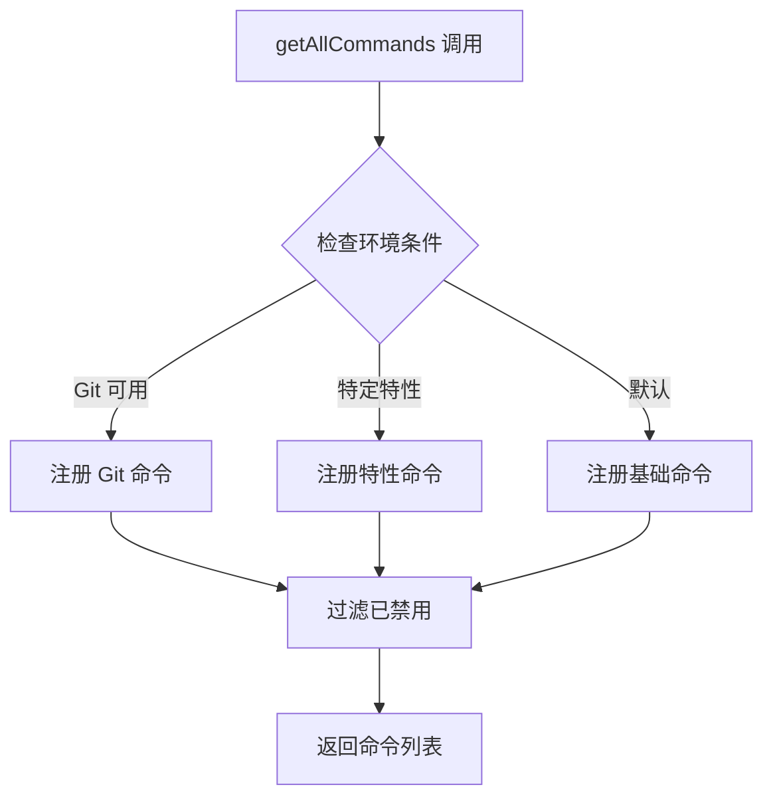
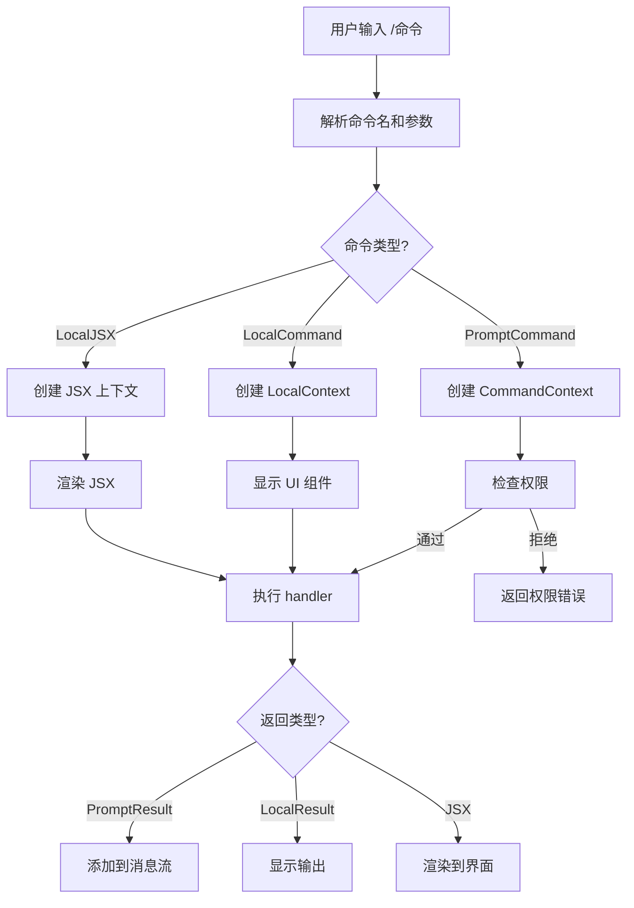

# 第 13 章：命令系统架构

> 本章目标：理解斜杠命令系统的设计和实现。

## 13.1 命令类型系统

### PromptCommand

```typescript
// src/commands.ts (简化版)
export type PromptCommand = {
  type: 'prompt'
  name: string
  description: string
  // 执行函数
  handler: (context: CommandContext) => Promise<CommandResult>
  // 权限检查
  checkPermissions?: (context: CommandContext) => PermissionResult
  // 是否只读
  isReadOnly?: boolean
  // 是否启用
  isEnabled?: () => boolean
}
```

### LocalCommand

```typescript
export type LocalCommand = {
  type: 'local'
  name: string
  description: string
  // 带类型的输出
  handler: (context: LocalCommandContext) => Promise<LocalCommandResult>
  // UI 组件
  component?: React.ComponentType<{ context: LocalCommandContext }>
}
```

### LocalJSXCommand

```typescript
export type LocalJSXCommand = {
  type: 'localJSX'
  name: string
  description: string
  // 返回 JSX 元素
  handler: (context: LocalCommandContext) => React.ReactElement
  // 是否隐藏提示输入
  shouldHidePromptInput?: boolean
}
```

## 13.2 命令注册机制

### commands.ts 注册表

```typescript
// src/commands.ts
export function getAllCommands(): Command[] {
  return [
    // Git 操作命令
    ...getGitCommands(),

    // 配置命令
    ConfigCommand,

    // 诊断命令
    DoctorCommand,

    // 特性门控命令
    ...(feature('TEAM_FEATURE') ? [TeamCreateCommand, TeamDeleteCommand] : []),
    ...(feature('WORKFLOW_SCRIPTS') ? [WorkflowCommand] : []),

    // ... 更多命令
  ].filter(cmd => cmd.isEnabled !== false)
}

// Git 命令集
function getGitCommands(): Command[] {
  return [
    {
      type: 'prompt',
      name: 'commit',
      description: 'Git commit with generated message',
      handler: handleCommitCommand,
      isEnabled: () => isGitAvailable(),
    },
    {
      type: 'prompt',
      name: 'push',
      description: 'Push current branch to remote',
      handler: handlePushCommand,
      isEnabled: () => isGitAvailable(),
    },
    // ...
  ]
}
```

### 条件注册



```typescript
// 环境感知命令注册
class ConditionalCommandRegistry {
  private commands = new Map<string, Command>()

  register(command: Command): void {
    this.commands.set(command.name, command)
  }

  getAvailable(): Command[] {
    return Array.from(this.commands.values())
      .filter(cmd => {
        // 检查 isEnabled 函数
        if (cmd.isEnabled !== undefined && !cmd.isEnabled()) {
          return false
        }
        return true
      })
  }

  // 按类别获取
  getByCategory(category: CommandCategory): Command[] {
    return this.getAvailable()
      .filter(cmd => cmd.category === category)
  }

  // 按名称查找
  findByName(name: string): Command | undefined {
    for (const cmd of this.getAvailable()) {
      if (cmd.name === name || cmd.aliases?.includes(name)) {
        return cmd
      }
    }
    return undefined
  }
}
```

## 13.3 命令执行流程



### 参数解析

```typescript
// 命令参数解析器
export class CommandParser {
  parse(input: string): ParsedCommand | null {
    // 检查是否是斜杠命令
    if (!input.startsWith('/')) {
      return null
    }

    const parts = input.slice(1).trim().split(/\s+/)
    const name = parts[0]
    const args = parts.slice(1)

    // 解析参数选项
    const options = this.parseOptions(args)

    return {
      name,
      args: options.positional,
      flags: options.named,
    }
  }

  private parseOptions(args: string[]): {
    positional: string[]
    named: Map<string, string | boolean>
  } {
    const positional: string[] = []
    const named = new Map<string, string | boolean>()

    for (const arg of args) {
      if (arg.startsWith('--')) {
        // --flag=value 或 --flag
        const [key, value] = arg.slice(2).split('=')
        named.set(key, value ?? true)
      } else if (arg.startsWith('-')) {
        // -f 或 -f=value
        const [key, value] = arg.slice(1).split('=')
        named.set(key, value ?? true)
      } else {
        positional.push(arg)
      }
    }

    return { positional, named }
  }
}
```

### 权限检查

```typescript
// 命令权限检查
export async function checkCommandPermissions(
  command: Command,
  context: CommandContext,
): Promise<PermissionResult> {
  // 1. 命令特定的权限检查
  if (command.checkPermissions) {
    const result = command.checkPermissions(context)
    if (result.behavior !== 'allow') {
      return result
    }
  }

  // 2. 基于命令模式的检查
  const mode = context.toolPermissionContext.mode

  // 某些命令在特定模式下不可用
  if (mode === 'plan' && PLAN_BLOCKED_COMMANDS.has(command.name)) {
    return {
      behavior: 'block',
      message: `Command "/${command.name}" is not available in plan mode`,
    }
  }

  // 3. 工具权限规则
  const rule = matchingRuleForInput(
    context.toolPermissionContext,
    'command',
    { commandName: command.name },
  )

  if (rule?.behavior === 'deny') {
    return {
      behavior: 'block',
      message: `Command "/${command.name}" is blocked`,
    }
  }

  return { behavior: 'allow' }
}

// 计划模式下阻止的命令
const PLAN_BLOCKED_COMMANDS = new Set([
  'commit',
  'push',
  'edit',
  'write',
  'delete',
])
```

## 13.4 命令分类详解

### Git 操作命令

```typescript
// Git 命令
export const commitCommand: PromptCommand = {
  type: 'prompt',
  name: 'commit',
  description: 'Create a Git commit with an AI-generated message',

  handler: async (context) => {
    // 1. 获取 git 状态
    const status = await getGitStatus(context.cwd)

    if (status.staged.length === 0) {
      return {
        type: 'error',
        message: 'No staged changes to commit.',
        newMessages: [{
          type: 'system',
          content: 'No staged changes. Use `git add` to stage files.',
        }],
      }
    }

    // 2. 生成提交消息
    const diff = await getGitDiff(context.cwd)
    const commitMessage = await generateCommitMessage(diff, context)

    // 3. 执行提交
    const result = await execa('git', ['commit', '-m', commitMessage], {
      cwd: context.cwd,
    })

    if (result.exitCode !== 0) {
      return {
        type: 'error',
        message: `Commit failed: ${result.stderr}`,
      }
    }

    return {
      type: 'success',
      message: `Committed: ${commitMessage.split('\n')[0]}`,
    }
  },

  isEnabled: () => isGitAvailable(),
  isReadOnly: false,
  isDestructive: true,
}
```

### 配置管理命令

```typescript
export const configCommand: LocalCommand = {
  type: 'local',
  name: 'config',
  description: 'Manage Claude Code settings',

  component: ConfigComponent,

  handler: async (context) => {
    // 处理由 ConfigComponent 处理
    // 命令结果通过 context.onComplete 返回
    return { type: 'success' }
  },
}

// Config 组件
function ConfigComponent({ context }: { context: LocalCommandContext }) {
  const [selectedKey, setSelectedKey] = useState<string | null>(null)
  const settings = useAppState(state => state.settings)

  if (selectedKey) {
    return (
      <ConfigEditor
        key={selectedKey}
        value={settings[selectedKey]}
        onSave={(value) => {
          context.setAppState(prev => ({
            ...prev,
            settings: { ...prev.settings, [selectedKey]: value },
          }))
          setSelectedKey(null)
        }}
        onCancel={() => setSelectedKey(null)}
      />
    )
  }

  return (
    <ConfigList
      settings={settings}
      onSelectKey={setSelectedKey}
    />
  )
}
```

### Agent 管理命令

```typescript
export const agentsCommand: PromptCommand = {
  type: 'prompt',
  name: 'agents',
  description: 'List and manage background agents',

  handler: async (context) => {
    const tasks = useAppState(state => state.tasks)
    const agents = Object.values(tasks).filter(t => t.type === 'agent')

    if (agents.length === 0) {
      return {
        type: 'info',
        message: 'No background agents running.',
      }
    }

    // 格式化输出
    const lines = agents.map(agent => {
      const status = agent.status === 'running' ? '🟢' : '⏸️'
      return `${status} ${agent.name} (${agent.id.slice(0, 8)}): ${agent.description}`
    })

    return {
      type: 'info',
      message: lines.join('\n'),
    }
  },

  isReadOnly: true,
}
```

### 系统诊断命令

```typescript
export const doctorCommand: LocalCommand = {
  type: 'local',
  name: 'doctor',
  description: 'Run diagnostics',

  component: DoctorComponent,

  handler: async (context) => {
    const diagnostics = await runDiagnostics(context)

    return {
      type: 'doctor',
      diagnostics,
    }
  },
}

// 诊断组件
function DoctorComponent({ context }: { context: LocalCommandContext }) {
  const [results, setResults] = useState<DiagnosticResult[]>([])
  const [running, setRunning] = useState(false)

  useEffect(() => {
    runDiagnostics(context).then(setResults)
  }, [context])

  if (results.length === 0) {
    return <Text>Running diagnostics...</Text>
  }

  return (
    <Box flexDirection="column">
      {results.map(result => (
        <DiagnosticRow key={result.name} result={result} />
      ))}
    </Box>
  )
}
```

## 13.5 命令发现与帮助

### 命令自动补全

```typescript
// 命令自动补全
export function completeCommand(
  input: string,
  availableCommands: Command[],
): string[] {
  const prefix = input.toLowerCase()

  // 精确匹配优先
  const exactMatches = availableCommands
    .filter(cmd => cmd.name.startsWith(prefix))
    .map(cmd => cmd.name)

  // 别名匹配
  const aliasMatches = availableCommands
    .filter(cmd => cmd.aliases?.some(a => a.startsWith(prefix)))
    .flatMap(cmd => [cmd.name, ...(cmd.aliases || [])])

  // 合并去重
  return [...new Set([...exactMatches, ...aliasMatches])]
}

// Fuzzy 搜索
export function fuzzySearchCommands(
  query: string,
  availableCommands: Command[],
): Array<{ command: Command; score: number }> {
  const fuse = new Fuse(availableCommands, {
    keys: ['name', 'description', 'aliases'],
    includeScore: true,
  })

  return fuse.search(query)
}
```

### 帮助文本生成

```typescript
// 生成帮助文本
export function generateHelpText(command: Command): string {
  const lines: string[] = []

  // 命令名称
  lines.push(`## /${command.name}`)
  lines.push('')

  // 描述
  lines.push(`**${command.description}**`)
  lines.push('')

  // 别名
  if (command.aliases && command.aliases.length > 0) {
    lines.push(`**Aliases:** ${command.aliases.join(', ')}`)
    lines.push('')
  }

  // 参数
  if (command.params) {
    lines.push('**Parameters:**')
    for (const param of command.params) {
      const required = param.required ? '' : ' (optional)'
      lines.push(`- \`${param.name}\`${required}: ${param.description}`)
      if (param.default !== undefined) {
        lines.push(`  Default: ${param.default}`)
      }
    }
    lines.push('')
  }

  // 选项
  if (command.options) {
    lines.push('**Options:**')
    for (const option of command.options) {
      const flags = [option.short, option.long].filter(Boolean).join(', ')
      lines.push(`- ${flags}: ${option.description}`)
    }
    lines.push('')
  }

  // 示例
  if (command.examples) {
    lines.push('**Examples:**')
    for (const example of command.examples) {
      lines.push(`\`\`\`)
      lines.push(`/${command.name} ${example}`)
      lines.push(`\`\`\``)
    }
  }

  return lines.join('\n')
}
```

## 13.6 可复用模式总结

### 模式 28：命令注册模式

**描述：** 统一的命令注册和发现模式。

**适用场景：**
- CLI 工具的斜杠命令系统
- 需要扩展命令的应用
- 插件式命令架构

**代码模板：**

```typescript
// 命令接口
interface Command {
  name: string
  description: string
  handler: (context: CommandContext) => Promise<CommandResult>
  aliases?: string[]
  isEnabled?: () => boolean
  category?: string
}

// 命令注册表
class CommandRegistry {
  private commands = new Map<string, Command>()

  register(command: Command): void {
    // 注册主命令名
    this.commands.set(command.name, command)

    // 注册别名
    for (const alias of command.aliases || []) {
      this.commands.set(alias, {
        ...command,
        isAlias: true,
        originalName: command.name,
      })
    }
  }

  find(name: string): Command | undefined {
    return this.commands.get(name)
  }

  list(category?: string): Command[] {
    const commands = Array.from(this.commands.values())
      .filter(cmd => !cmd.isAlias)

    if (category) {
      return commands.filter(cmd => cmd.category === category)
    }

    return commands
  }

  // 自动补全
  complete(prefix: string): string[] {
    return Array.from(this.commands.keys())
      .filter(name => name.startsWith(prefix))
      .sort()
  }
}

// 使用
const registry = new CommandRegistry()

registry.register({
  name: 'deploy',
  description: 'Deploy application',
  aliases: ['dep'],
  category: 'deployment',
  handler: async (ctx) => {
    // 部署逻辑
    return { type: 'success', message: 'Deployed!' }
  },
})

const deployCmd = registry.find('deploy')
const allCmds = registry.list('deployment')
const completions = registry.complete('dep')
```

**关键点：**
1. 支持别名
2. 分类管理
3. 自动补全
4. 条件启用

### 模式 29：命令类型分发

**描述：** 根据命令类型分发到不同的处理器。

**适用场景：**
- 多种命令类型（Prompt、Local、JSX）
- 不同的执行上下文
- 灵活的返回类型

**代码模板：**

```typescript
type Command =
  | { type: 'prompt'; handler: PromptHandler }
  | { type: 'local'; handler: LocalHandler }
  | { type: 'jsx'; handler: JSXHandler }

async function dispatchCommand(
  command: Command,
  context: CommandContext,
): Promise<CommandResult> {
  switch (command.type) {
    case 'prompt':
      return await dispatchPromptCommand(command, context)

    case 'local':
      return await dispatchLocalCommand(command, context)

    case 'jsx':
      return await dispatchJSXCommand(command, context)

    default:
      const _exhaustive: never = command
      throw new Error(`Unknown command type: ${_exhaustive}`)
  }
}

async function dispatchPromptCommand(
  command: ExtractCommandType<Command, 'prompt'>,
  context: CommandContext,
): Promise<CommandResult> {
  // 1. 权限检查
  const permission = await checkCommandPermissions(command, context)
  if (permission.behavior !== 'allow') {
    return { type: 'error', message: permission.message }
  }

  // 2. 执行
  try {
    const result = await command.handler(context)

    // 3. 转换为通用格式
    return {
      type: 'success',
      message: result.message || '',
      newMessages: result.newMessages || [],
    }
  } catch (error) {
    return {
      type: 'error',
      message: error instanceof Error ? error.message : String(error),
    }
  }
}

async function dispatchLocalCommand(
  command: ExtractCommandType<Command, 'local'>,
  context: LocalCommandContext,
): Promise<LocalCommandResult> {
  // Local 命令通常由组件处理
  // 这里只返回初始状态
  return {
    type: 'local',
    command: command.name,
    component: command.component,
  }
}

async function dispatchJSXCommand(
  command: ExtractCommandType<Command, 'localJSX'>,
  context: JSXCommandContext,
): Promise<JSXCommandResult> {
  // JSX 命令渲染组件
  const element = command.handler(context)

  return {
    type: 'jsx',
    element,
    shouldHidePromptInput: command.shouldHidePromptInput ?? false,
  }
}
```

**关键点：**
1. 类型安全的分发
2. 统一的错误处理
3. 类型提取器
4. 可扩展的执行路径

---

## 本章小结

本章分析了命令系统架构的实现：

1. **命令类型**：PromptCommand、LocalCommand、LocalJSXCommand
2. **注册机制**：commands.ts 注册表、条件注册、环境感知
3. **执行流程**：参数解析、权限检查、类型分发
4. **命令分类**：Git 操作、配置管理、Agent 管理、系统诊断
5. **发现帮助**：自动补全、帮助文本生成
6. **可复用模式**：命令注册、类型分发

## 下一章预告

第 14 章将深入分析权限系统设计。
