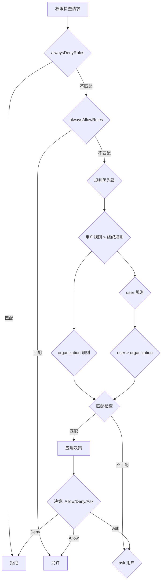
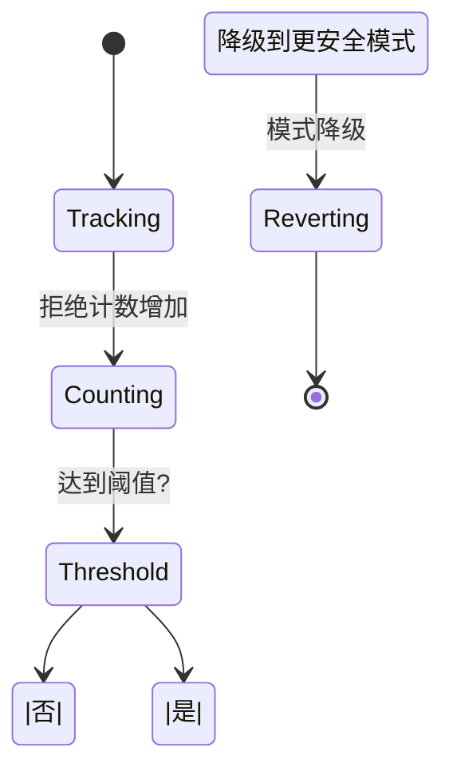

# 第 14 章：权限系统设计

> 本章目标：深入理解权限检查机制和安全控制。

## 14.1 权限模式详解

### default 模式

```typescript
// src/utils/permissions/PermissionMode.ts
export type PermissionMode =
  | 'default'          // 默认：询问未知操作
  | 'plan'             // 计划模式：限制写操作
  | 'bypassPermissions'  // 绕过权限：全部允许
  | 'auto'              // 自动模式：基于规则自动决策
  | 'yolo'              // YOLO：全部允许（内部使用）
  | 'headless'          // 无头模式：基于规则自动决策
```

**default 模式行为：**

```typescript
// default 模式的权限决策流程
async function checkDefaultMode(
  tool: Tool,
  input: unknown,
  context: ToolUseContext,
): Promise<PermissionResult> {
  // 1. 检查 alwaysAllowRules
  const allowRule = findMatchingRule(
    context.toolPermissionContext.alwaysAllowRules,
    tool.name,
    input,
  )
  if (allowRule) {
    return { behavior: 'allow', source: 'always_allow_rule' }
  }

  // 2. 检查 alwaysDenyRules
  const denyRule = findMatchingRule(
    context.toolPermissionContext.alwaysDenyRules,
    tool.name,
    input,
  )
  if (denyRule) {
    return { behavior: 'block', message: denyRule.message }
  }

  // 3. 检查工具内置权限
  const builtinCheck = tool.checkPermissions?.(input, context)
  if (builtinCheck?.behavior === 'block') {
    return builtinCheck
  }

  // 4. 检查 alwaysAskRules
  const askRule = findMatchingRule(
    context.toolPermissionContext.alwaysAskRules,
    tool.name,
    input,
  )
  if (askRule) {
    return {
      behavior: 'ask',
      message: askRule.message || `Allow ${tool.name} with this input?`,
    }
  }

  // 5. 对于危险操作，即使没有规则也询问
  if (tool.isDestructive?.(input)) {
    return {
      behavior: 'ask',
      message: `${tool.name} performs destructive operation. Continue?`,
    }
  }

  // 6. 对于写操作，询问
  if (!tool.isReadOnly?.(input)) {
    return {
      behavior: 'ask',
      message: `Allow ${tool.name} to modify files?`,
    }
  }

  // 7. 读操作默认允许
  return { behavior: 'allow', source: 'default' }
}
```

### plan 模式

```typescript
// plan 模式：限制写操作
async function checkPlanMode(
  tool: Tool,
  input: unknown,
  context: ToolUseContext,
): Promise<PermissionResult> {
  // plan 模式的核心原则：
  // - 允许读操作
  // - 阻止写操作（除非在计划中明确）
  // - 阻止危险操作

  // 1. 检查是否是只读操作
  if (tool.isReadOnly?.(input)) {
    return { behavior: 'allow', source: 'plan_mode_read_only' }
  }

  // 2. 检查是否在允许的计划内
  const allowedPrompts = context.toolPermissionContext.prePlanMode?.allowedPrompts
  if (allowedPrompts) {
    for (const allowed of allowedPrompts) {
      if (matchesAllowedPrompt(allowed, tool.name, input)) {
        return {
          behavior: 'allow',
          source: 'plan_mode_allowed_prompt',
          message: `Allowed by plan: ${allowed.description}`,
        }
      }
    }
  }

  // 3. 检查 alwaysAllowRules
  const allowRule = findMatchingRule(
    context.toolPermissionContext.alwaysAllowRules,
    tool.name,
    input,
  )
  if (allowRule) {
    return { behavior: 'allow', source: 'plan_mode_allow_rule' }
  }

  // 4. 阻止写操作
  return {
    behavior: 'block',
    message: `Command "/${tool.name}" is not available in plan mode. Use /exit-plan to leave plan mode and execute this command.`,
  }
}
```

### bypassPermissions 模式

```typescript
// bypassPermissions 模式：全部允许（需要认证）
async function checkBypassPermissionsMode(
  tool: Tool,
  input: unknown,
  context: ToolUseContext,
): Promise<PermissionResult> {
  // bypassPermissions 是一个特权模式，需要：
  // 1. 用户已认证
  // 2. 用户有 bypassPermissions 能力

  if (!context.toolPermissionContext.isBypassPermissionsModeAvailable) {
    return {
      behavior: 'block',
      message: 'bypassPermissions mode is not available',
    }
  }

  // 检查用户是否有此权限
  const hasPermission = await checkBypassCapability(context)
  if (!hasPermission) {
    return {
      behavior: 'block',
      message: 'You do not have permission to bypass permissions',
    }
  }

  // 记录日志（审计）
  logPermissionBypass(tool, input, context)

  return {
    behavior: 'allow',
    source: 'bypass_permissions',
    audit: {
      tool: tool.name,
      input,
      user: context.userId,
      timestamp: Date.now(),
    },
  }
}
```

### auto 模式

```typescript
// auto 模式：基于规则自动决策
async function checkAutoMode(
  tool: Tool,
  input: unknown,
  context: ToolUseContext,
): Promise<PermissionResult> {
  // auto 模式使用自动化检查器：
  // - hooks（preToolUse）
  // - 分类器
  // - 规则匹配

  // 1. 运行 preToolUse hooks
  for (const hook of context.options.preToolUseHooks || []) {
    const hookResult = await hook(tool, input, context)
    if (hookResult?.behavior) {
      return hookResult
    }
  }

  // 2. 检查分类器结果
  const classifierResult = getClassifierResult(tool.name, input, context)
  if (classifierResult?.decision === 'allow') {
    return {
      behavior: 'allow',
      source: 'classifier',
      confidence: classifierResult.confidence,
    }
  } else if (classifierResult?.decision === 'deny') {
    return {
      behavior: 'block',
      message: classifierResult.reason,
    }
  }

  // 3. 回退到规则匹配
  return await checkDefaultMode(tool, input, context)
}

// 分类器结果
type ClassifierResult = {
  decision: 'allow' | 'deny' | 'unknown'
  confidence: number
  reason?: string
}
```

## 14.2 权限规则系统

### 规则语法

```typescript
// src/types/permissions.ts
export type PermissionRule =
  | string                      // 简单通配符：如 "Bash*" 匹配所有 Bash 开头的工具
  | {
      tool?: string               // 工具名称模式：如 "Bash"
      input?: InputRule            // 输入匹配规则
    }

export type InputRule =
  | string                      // JSON 路径通配符：如 "$.filePath"
  | {
      path?: string             // JSON 路径：如 "$.filePath"
      pattern?: string          // 正则表达式
      value?: unknown           // 精确值匹配
      op?: 'eq' | 'ne' | 'gt' | 'lt' | 'gte' | 'lte' | 'contains' | 'matches'
      not?: boolean             // 取反
    }
```

### 通配符匹配

```typescript
// src/utils/permissions/shellRuleMatching.ts
export function matchesWildcardPattern(
  pattern: string,
  value: string,
): boolean {
  // 实现类似 shell 的通配符匹配
  // * 匹配任意字符（包括空字符串）
  // ? 匹配单个字符

  const regexPattern = pattern
    // 转义特殊正则字符
    .replace(/[.+^${}()|[\]\\]/g, '\\$&')
    // 将 * 替换为 .*
    .replace(/\*/g, '.*')
    // 将 ? 替换为 .
    .replace(/\?/g, '.')

  const regex = new RegExp(`^${regexPattern}$`, 'i')
  return regex.test(value)
}

// 规则匹配器
export function matchesRule(
  rule: PermissionRule,
  toolName: string,
  input: unknown,
): boolean {
  if (typeof rule === 'string') {
    // 简单规则：只检查工具名
    return matchesWildcardPattern(rule, toolName)
  }

  // 结构化规则
  if (rule.tool !== undefined) {
    if (!matchesWildcardPattern(rule.tool, toolName)) {
      return false
    }
  }

  if (rule.input !== undefined) {
    if (!matchesInputRule(rule.input, input)) {
      return false
    }
  }

  return true
}

// 输入规则匹配
function matchesInputRule(rule: InputRule, input: unknown): boolean {
  if (typeof rule === 'string') {
    // JSON 路径匹配
    return matchesJSONPath(rule, input)
  }

  if (rule.path !== undefined) {
    const value = getJSONPath(input, rule.path)
    return value !== undefined
  }

  if (rule.pattern !== undefined) {
    const value = getJSONPath(input, rule.path ?? '')
    if (value === undefined) return false

    const regex = new RegExp(rule.pattern, 'i')
    return regex.test(String(value))
  }

  if (rule.value !== undefined) {
    const value = getJSONPath(input, rule.path ?? '')
    return value === rule.value
  }

  return true
}

// JSONPath 提取
function getJSONPath(obj: unknown, path: string): unknown {
  const parts = path.split('.')
  let current: unknown = obj

  for (const part of parts) {
    if (current === null || typeof current !== 'object') {
      return undefined
    }
    current = (current as Record<string, unknown>)[part]
  }

  return current
}
```

### 规则优先级



```typescript
// 规则查找
export function findMatchingRule(
  rules: ToolPermissionRulesBySource,
  toolName: string,
  input: unknown,
): { rule: PermissionRule; source: string } | null {
  // 按优先级顺序检查
  const sources = ['user', 'organization'] as const

  for (const source of sources) {
    const sourceRules = rules[source]
    if (!sourceRules) continue

    for (const rule of sourceRules) {
      if (matchesRule(rule, toolName, input)) {
        return { rule, source }
      }
    }
  }

  return null
}
```

## 14.3 权限检查流程

```mermaid
sequenceDiagram
    participant User
    participant CLI
    participant canUseTool
    participant Hooks
    participant Classifier
    participant Rules
    participant UI

    CLI->>canUseTool: checkPermissions(tool, input, context)
    Rules->>Rules: 检查 alwaysDenyRules
    alt 匹配拒绝
    Rules-->>canUseTool: block
    Rules->>Rules: 检查 alwaysAllowRules
    alt 匹配允许
    Rules-->>canUseTool: allow
    Rules->>Hooks: 运行 preToolUse hooks
    alt hook 返回决策
    Hooks-->>canUseTool: decision
    Rules->>Classifier: 检查分类器
    alt 分类器有决策
    Classifier-->>canUseTool: decision
    Rules->>Rules: 检查 alwaysAskRules
    alt 需要询问
    Rules-->>canUseTool: ask
    alt 默认决策
    Rules-->>canUseTool: default
    canUseTool-->>CLI: PermissionResult
    CLI->>UI: 显示权限提示
    User-->>UI: 用户决策
    UI-->>CLI: Allow/Deny
    CLI-->>Hooks: 通知 postToolUse
```

```typescript
// 主权限检查函数
export async function checkPermissions(
  tool: Tool,
  input: unknown,
  context: ToolUseContext,
): Promise<PermissionResult> {
  const mode = context.toolPermissionContext.mode

  // 1. 处理特殊模式
  if (mode === 'bypassPermissions') {
    return await checkBypassPermissionsMode(tool, input, context)
  }

  if (mode === 'plan') {
    return await checkPlanMode(tool, input, context)
  }

  if (mode === 'auto') {
    return await checkAutoMode(tool, input, context)
  }

  if (mode === 'yolo') {
    // YOLO 模式：全部允许
    return { behavior: 'allow', source: 'yolo' }
  }

  if (mode === 'headless') {
    // 无头模式：基于规则自动决策
    return await checkHeadlessMode(tool, input, context)
  }

  // default 模式
  return await checkDefaultMode(tool, input, context)
}
```

## 14.4 权限 UI 设计

### 交互式提示

```typescript
// src/components/PermissionPrompt.tsx
function PermissionPrompt({
  tool,
  input,
  onDecision,
}: {
  tool: Tool
  input: unknown
  onDecision: (decision: 'allow' | 'deny') => void
}) {
  const { formatToolInput } = useToolInputFormatter()

  return (
    <Box flexDirection="column" padding={1}>
      {/* 工具信息 */}
      <Box marginBottom={1}>
        <Text bold>Permission Request</Text>
        <Text dimColor>/ {tool.name}</Text>
      </Box>

      {/* 输入预览 */}
      <Box marginBottom={1}>
        <Text>Input:</Text>
        <Text dimColor>{formatToolInput(tool, input)}</Text>
      </Box>

      {/* 危险警告 */}
      {tool.isDestructive?.(input) && (
        <Box marginBottom={1} borderColor="red" padding={1}>
          <Text color="red">⚠️ This operation cannot be undone</Text>
        </Box>
      )}

      {/* 操作按钮 */}
      <Box>
        <TextButton onPress={() => onDecision('allow')}>Allow</TextButton>
        <Text style={{ marginLeft: 1 }}>|</Text>
        <TextButton onPress={() => onDecision('deny')}>Deny</TextButton>
        <Text style={{ marginLeft: 1 }}>|</Text>
        <TextButton onPress={() => onDecision('allow')}>Allow All</TextButton>
      </Box>
    </Box>
  )
}
```

### IDE 集成提示

```typescript
// IDE 权限回调
export type BridgePermissionCallbacks = {
  requestPermission: (
    toolName: string,
    input: unknown,
    metadata: {
      toolUseId: string
      requestId: string
      sessionId: string
    }
  ) => Promise<{ allowed: boolean; decision?: 'allow' | 'deny' }>

  notifyPermissionResult: (
    toolName: string,
    input: unknown,
    result: PermissionResult,
    metadata: {
      toolUseId: string
      requestId: string
    }
  ) => void
}

// Bridge 模式下的权限提示
export async function requestBridgePermission(
  callbacks: BridgePermissionCallbacks,
  tool: Tool,
  input: unknown,
  context: ToolUseContext,
): Promise<PermissionResult> {
  if (!callbacks.requestPermission) {
    // 回退到本地提示
    return await requestLocalPermission(tool, input, context)
  }

  // 通过 IDE 请求权限
  try {
    const response = await callbacks.requestPermission(
      tool.name,
      input,
      {
        toolUseId: context.toolUseId || generateId(),
        requestId: generateId(),
        sessionId: context.sessionId || 'unknown',
      },
    )

    if (response.allowed) {
      return {
        behavior: 'allow',
        source: 'bridge_approval',
        bridgeDecision: response.decision,
      }
    } else {
      return {
        behavior: 'block',
        message: 'Permission denied via IDE',
      }
    }
  } catch (error) {
    // IDE 不可用时回退
    return await requestLocalPermission(tool, input, context)
  }
}
```

### 批量批准

```typescript
// 批量权限批准
export class BatchPermissionApprover {
  private pending = new Map<string, PermissionRequest>()
  private approved = new Set<string>()

  addRequest(
    id: string,
    request: PermissionRequest,
  ): void {
    this.pending.set(id, request)
  }

  async approveAll(): Promise<void> {
    for (const [id, request] of this.pending) {
      await this.approve(id, request)
    }
  }

  async approve(id: string, request: PermissionRequest): Promise<void> {
    // 1. 检查是否安全批量批准
    if (!this.isSafeForBatchApproval(request)) {
      // 不安全，跳过
      return
    }

    // 2. 批准
    this.approved.add(id)

    // 3. 通知等待的协程
    request.resolve?.({ behavior: 'allow' })

    // 4. 移除待处理
    this.pending.delete(id)
  }

  private isSafeForBatchApproval(request: PermissionRequest): boolean {
    // 批量批准的安全条件：
    // 1. 只读操作
    // 2. 非破坏性
    // 3. 来自可信源

    return (
      request.tool.isReadOnly?.(request.input) &&
      !request.tool.isDestructive?.(request.input) &&
      request.source === 'rule'
    )
  }

  getApprovedCount(): number {
    return this.approved.size
  }
}

type PermissionRequest = {
  id: string
  tool: Tool
  input: unknown
  source: string
  resolve?: (result: PermissionResult) => void
}
```

## 14.5 拒绝追踪



```typescript
// src/utils/permissions/denialTracking.ts
export type DenialTrackingState = {
  totalDenials: number
  toolDenials: Map<string, number>
  lastResetTime: number
}

export function trackDenial(
  state: DenialTrackingState,
  toolName: string,
): void {
  // 1. 增加总拒绝计数
  state.totalDenials++

  // 2. 增加工具拒绝计数
  const count = state.toolDenials.get(toolName) ?? 0
  state.toolDenials.set(toolName, count + 1)

  // 3. 检查是否需要降级
  const threshold = getDenialThreshold()
  if (state.totalDenials >= threshold) {
    // 触发降级
    triggerDowngrade(state, threshold)
  }
}

// 拒绝阈值
function getDenialThreshold(): number {
  const growthbook = getGrowthBook()

  // 从 GrowthBook 获取阈值
  return growthbook.getFeatureValue('denial_threshold') ?? 10
}

// 降级策略
function triggerDowngrade(
  state: DenialTrackingState,
  threshold: number,
): void {
  const currentMode = getCurrentPermissionMode()

  // 降级路径
  const downgradePath: Record<PermissionMode, PermissionMode> = {
    'default': 'auto',       // default -> auto
    'auto': 'plan',          // auto -> plan
    'plan': 'plan',          // plan 保持
    'bypassPermissions': 'auto',  // bypass -> auto
  }

  const newMode = downgradePath[currentMode]

  if (newMode) {
    setPermissionMode(newMode)

    // 通知用户
    showSystemNotification(
      `Too many permission denials (${state.totalDenials}). Switched to ${newMode} mode.`,
    )

    // 重置计数
    state.totalDenials = 0
  }
}
```

## 14.6 可复用模式总结

### 模式 30：基于模式匹配的权限系统

**描述：** 使用模式匹配规则实现灵活的权限控制。

**适用场景：**
- 需要细粒度权限控制
- 用户可配置的权限规则
- 多层级的权限策略

**代码模板：**

```typescript
// 权限规则引擎
class PermissionEngine {
  private rules: PermissionRule[] = []

  addRule(rule: PermissionRule): void {
    this.rules.push(rule)
  }

  check(tool: string, input: unknown): PermissionDecision {
    // 1. 检查拒绝规则（优先级最高）
    for (const rule of this.rules) {
      if (this.matches(rule, tool, input)) {
        if (rule.effect === 'deny') {
          return { allow: false, reason: rule.reason || 'Blocked by rule' }
        }
      }
    }

    // 2. 检查允许规则
    for (const rule of this.rules) {
      if (this.matches(rule, tool, input)) {
        if (rule.effect === 'allow') {
          return { allow: true }
        }
      }
    }

    // 3. 默认拒绝
    return { allow: false, reason: 'No matching allow rule' }
  }

  private matches(rule: PermissionRule, tool: string, input: unknown): boolean {
    if (typeof rule === 'string') {
      return this.matchWildcard(rule, tool)
    }

    if (rule.tool && !this.matchWildcard(rule.tool, tool)) {
      return false
    }

    if (rule.input) {
      return this.matchInput(rule.input, input)
    }

    return true
  }

  private matchWildcard(pattern: string, value: string): boolean {
    // 将 shell 风格的通配符转换为正则
    const regex = this.wildcardToRegex(pattern)
    return regex.test(value)
  }

  private matchInput(rule: InputRule, input: unknown): boolean {
    // 实现输入匹配逻辑
    if (typeof rule === 'string') {
      // JSONPath 通配符
      return this.matchJSONPath(rule, input)
    }

    if (rule.pattern) {
      const value = this.extractValue(input, rule.path ?? '')
      return new RegExp(rule.pattern).test(String(value))
    }

    if (rule.value !== undefined) {
      const value = this.extractValue(input, rule.path ?? '')
      return value === rule.value
    }

    return true
  }

  private wildcardToRegex(pattern: string): RegExp {
    // 转义特殊字符
    let regex = pattern
      .replace(/[.+^${}()|[\]\\]/g, '\\$&')
      .replace(/\*/g, '.*')
      .replace(/\?/g, '.')

    return new RegExp(`^${regex}$`, 'i')
  }

  private matchJSONPath(path: string, obj: unknown): boolean {
    const parts = path.split('.')
    let current: unknown = obj

    for (const part of parts) {
      if (current === null || typeof current !== 'object') {
        return false
      }
      current = (current as Record<string, unknown>)[part]
    }

    return current !== undefined
  }

  private extractValue(obj: unknown, path: string): unknown {
    try {
      const parts = path.split('.')
      return parts.reduce((o, p) => o?.[p], obj)
    } catch {
      return undefined
    }
  }
}

// 使用
const engine = new PermissionEngine()

engine.addRule({
  tool: 'File*',
  input: { path: '$.filePath', pattern: '\\.ts$' },
  effect: 'allow',
  reason: 'Allow reading TypeScript files',
})

engine.addRule({
  tool: 'Bash',
  input: { path: '$.command', pattern: '^rm\\s+-rf' },
  effect: 'deny',
  reason: 'Dangerous delete command',
})

const result = engine.check('FileRead', { filePath: 'test.ts' })
```

**关键点：**
1. 基于优先级的规则匹配
2. 灵活的通配符语法
3. JSONPath 支持
4. 清晰的决策理由

### 模式 31：权限提示组件模式

**描述：** 可复用的权限提示 UI 组件。

**适用场景：**
- 需要用户确认的操作
- 安全敏感操作
- 可配置的权限流程

**代码模板：**

```typescript
// 权限提示组件
function PermissionPromptComponent({
  title,
  message,
  details,
  options,
  onResult,
}: PermissionPromptProps): JSX.Element {
  const [selectedOption, setSelectedOption] = useState<string | null>(null)
  const [isProcessing, setIsProcessing] = useState(false)

  const handleResult = async (decision: 'allow' | 'deny') => {
    setIsProcessing(true)
    try {
      await onResult(decision)
    } finally {
      setIsProcessing(false)
    }
  }

  return (
    <Dialog open title={title} onClose={() => handleResult('deny')}>
      <DialogBody>
        {/* 消息 */}
        <Text>{message}</Text>

        {/* 详情 */}
        {details && (
          <Box marginTop={1} padding={1} bgColor="grey">
            <Text dimColor>{details}</Text>
          </Box>
        )}

        {/* 选项 */}
        {options && (
          <Box marginTop={1}>
            {options.map(option => (
              <RadioOption
                key={option.value}
                label={option.label}
                selected={selectedOption === option.value}
                onSelect={setSelectedOption}
              />
            ))}
          </Box>
        )}
      </DialogBody>

      <DialogFooter>
        <Button onClick={() => handleResult('deny')}>
          Deny
        </Button>
        <Button onClick={() => handleResult('allow')}>
          Allow
        </Button>
        <Button onClick={() => handleResult('allow_all')}>
          Allow All
        </Button>
      </DialogFooter>
    </Dialog>
  )
}

// 使用示例
function showPermissionPrompt() {
  render(<PermissionPromptComponent
    title="Permission Required"
    message="BashTool wants to run: rm -rf node_modules/"
    details="This will delete all installed packages."
    options={[
      { value: 'once', label: 'Allow once' },
      { value: 'session', label: 'Allow for session' },
      { value: 'always', label: 'Always allow' },
    ]}
    onResult={async (decision) => {
      if (decision === 'allow') {
        await executeCommand()
      }
    }}
  />)
}
```

**关键点：**
1. 统一的提示样式
2. 支持多个选项
3. 处理加载状态
4. 可复用的组件接口

---

## 本章小结

本章深入分析了权限系统设计：

1. **权限模式**：default、plan、bypass、auto、yolo、headless
2. **规则系统**：规则语法、通配符匹配、优先级
3. **检查流程**：多层检查、自动化集成
4. **UI 设计**：交互提示、IDE 集成、批量批准
5. **拒绝追踪**：计数、阈值、降级策略
6. **可复用模式**：模式匹配权限系统、权限提示组件

## 下一章预告

第 15 章将分析 React/Ink UI 框架。
