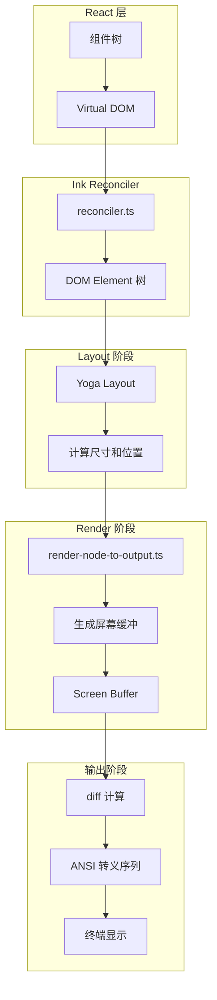
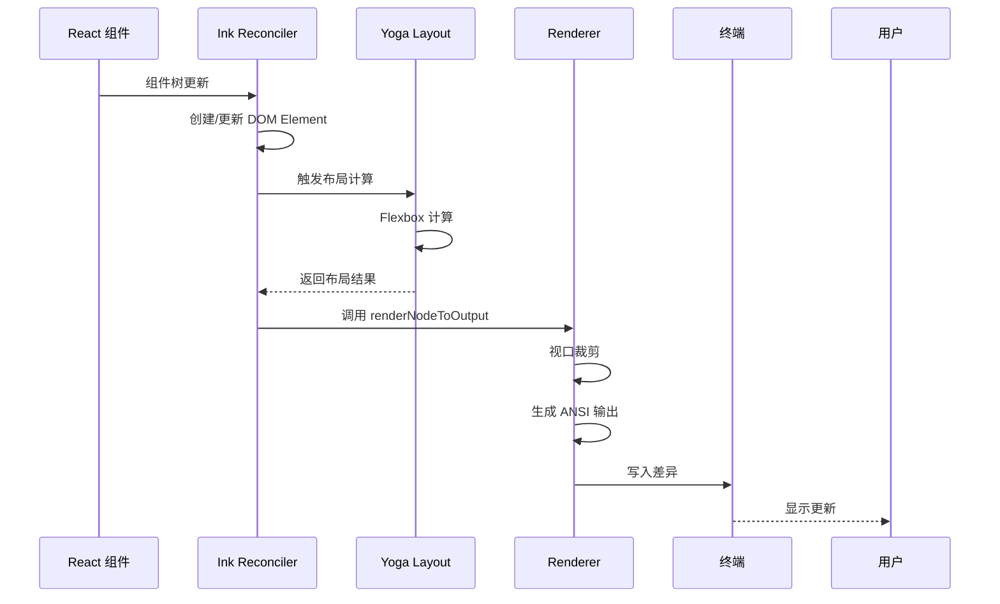

# 第 15 章：React/Ink UI 框架

> 本章目标：深入理解基于 Ink 的终端 UI 渲染机制和组件设计模式。

## 15.1 Ink 基础

### Ink 的核心思想

Ink 是一个将 React 用于构建终端用户界面（TUI）的库。它的核心思想是：

```typescript
// src/ink/ink.tsx (简化版)
export default class Ink {
  private readonly terminal: Terminal;
  private renderer: Renderer;
  private frontFrame: Frame;    // 当前显示的帧
  private backFrame: Frame;     // 正在渲染的帧

  constructor(options: Options) {
    this.terminal = {
      stdout: options.stdout,
      stderr: options.stderr
    };
    this.renderer = createRenderer(terminal);
    this.frontFrame = emptyFrame(terminalRows, terminalColumns);
    this.backFrame = emptyFrame(terminalRows, terminalColumns);
  }

  // 渲染循环
  render(node: ReactNode) {
    // 计算新帧
    const newFrame = this.renderer.render(node, this.terminal);

    // 计算差异
    const diff = computeDiff(this.frontFrame, newFrame);

    // 应用差异到终端
    writeDiffToTerminal(this.terminal.stdout, diff);

    this.frontFrame = newFrame;
  }
}
```

**设计意图：** Ink 使用类似浏览器的渲染模型，但输出到终端而不是 DOM。

### 与 DOM 渲染的区别

```typescript
// DOM 渲染流程
Browser Input → React → Virtual DOM → DOM Renderer → Browser Paint → Visual Output

// Ink 渲染流程
Terminal Input → React → Virtual DOM → Yoga Layout → Terminal Renderer → ANSI Codes → TUI Output
```

**关键差异：**
1. **布局引擎**：Ink 使用 Facebook Yoga（Flexbox 布局引擎），而非浏览器的 CSS
2. **输出格式**：Ink 输出 ANSI 转义序列，而非像素
3. **输入处理**：Ink 直接监听 stdin 的原始模式输入

### React Compiler 集成

```typescript
// Ink 组件使用 React Compiler 优化
import { c as _c } from "react/compiler-runtime";

export default function Text(t0) {
  const $ = _c(29);  // 编译器生成的缓存槽
  // ... 组件逻辑
}
```

**设计意图：** React Compiler 自动优化组件渲染，避免不必要的重新渲染。

## 15.2 渲染架构



### Ink 类架构

```typescript
// src/ink/ink.tsx
export default class Ink {
  // 核心状态
  private readonly terminal: Terminal;
  readonly focusManager: FocusManager;
  private renderer: Renderer;

  // 双缓冲帧
  private frontFrame: Frame;  // 当前显示
  private backFrame: Frame;   // 待渲染

  // 内存池（减少 GC）
  private readonly stylePool: StylePool;
  private charPool: CharPool;
  private hyperlinkPool: HyperlinkPool;

  // 选择状态（alt-screen 模式）
  readonly selection: SelectionState;

  // Alt screen 状态
  private altScreenActive = false;
  private altScreenMouseTracking = false;
}
```

### 渲染流程详解



## 15.3 核心组件设计

### Box 组件

```typescript
// src/ink/components/Box.tsx
type Props = Except<Styles, 'textWrap'> & {
  ref?: Ref<DOMElement>;
  tabIndex?: number;
  autoFocus?: boolean;
  onClick?: (event: ClickEvent) => void;
  onFocus?: (event: FocusEvent) => void;
  onBlur?: (event: FocusEvent) => void;
  onKeyDown?: (event: KeyboardEvent) => void;
  onMouseEnter?: () => void;
  onMouseLeave?: () => void;
};

/**
 * `<Box>` is an essential Ink component to build your layout.
 * It's like `<div style="display: flex">` in the browser.
 */
function Box({
  children,
  flexWrap = 'nowrap',
  flexDirection = 'row',
  flexGrow = 0,
  flexShrink = 1,
  ...style
}: PropsWithChildren<Props>): React.ReactNode {
  // 警告非整数间距值（防止碎片化布局）
  warn.ifNotInteger(style.margin, "margin");
  warn.ifNotInteger(style.padding, "padding");
  warn.ifNotInteger(style.gap, "gap");

  return (
    <ink-box
      style={{
        flexWrap,
        flexDirection,
        flexGrow,
        flexShrink,
        ...style,
        overflowX: style.overflowX ?? style.overflow ?? 'visible',
        overflowY: style.overflowY ?? style.overflow ?? 'visible',
      }}
    >
      {children}
    </ink-box>
  );
}
```

**设计意图：** Box 是 Ink 的布局基础组件，提供 Flexbox 布局能力，类似 HTML 的 div。

### Text 组件

```typescript
// src/ink/components/Text.tsx
type BaseProps = {
  readonly color?: Color;
  readonly backgroundColor?: Color;
  readonly italic?: boolean;
  readonly underline?: boolean;
  readonly strikethrough?: boolean;
  readonly inverse?: boolean;
  readonly wrap?: Styles['textWrap'];
  readonly children?: ReactNode;
};

type WeightProps =
  | { bold?: never; dim?: never }
  | { bold: boolean; dim?: never }
  | { dim: boolean; bold?: never };

export type Props = BaseProps & WeightProps;

const memoizedStylesForWrap: Record<Styles['textWrap'], Styles> = {
  wrap: {
    flexGrow: 0,
    flexShrink: 1,
    flexDirection: 'row',
    textWrap: 'wrap'
  },
  'truncate-end': {
    flexGrow: 0,
    flexShrink: 1,
    flexDirection: 'row',
    textWrap: 'truncate-end'
  },
  // ...
};

export default function Text({
  color,
  backgroundColor,
  bold,
  dim,
  italic = false,
  underline = false,
  strikethrough = false,
  inverse = false,
  wrap = 'wrap',
  children,
}: Props): React.ReactNode {
  if (children === undefined || children === null) {
    return null;
  }

  // 只设置已定义的样式属性
  const textStyles: TextStyles = {
    ...(color && { color }),
    ...(backgroundColor && { backgroundColor }),
    ...(dim && { dim }),
    ...(bold && { bold }),
    ...(italic && { italic }),
    ...(underline && { underline }),
    ...(strikethrough && { strikethrough }),
    ...(inverse && { inverse }),
  };

  return (
    <ink-text
      style={memoizedStylesForWrap[wrap]}
      textStyles={textStyles}
    >
      {children}
    </ink-text>
  );
}
```

**设计意图：** Text 提供文本样式控制，支持颜色、粗体、斜体等终端样式。

### ScrollBox 组件

```typescript
// src/ink/components/ScrollBox.tsx
export type ScrollBoxHandle = {
  scrollTo: (y: number) => void;
  scrollBy: (dy: number) => void;
  scrollToElement: (el: DOMElement, offset?: number) => void;
  scrollToBottom: () => void;
  getScrollTop: () => number;
  getScrollHeight: () => number;
  getFreshScrollHeight: () => number;
  getViewportHeight: () => number;
  isSticky: () => boolean;
  subscribe: (listener: () => void) => () => void;
  setClampBounds: (min: number | undefined, max: number | undefined) => void;
};

/**
 * A Box with `overflow: scroll` and an imperative scroll API.
 *
 * Children are laid out at their full Yoga-computed height inside a
 * constrained container. At render time, only children intersecting the
 * visible window (scrollTop..scrollTop+height) are rendered (viewport
 * culling).
 */
function ScrollBox({
  children,
  ref,
  stickyScroll,
  ...style
}: PropsWithChildren<ScrollBoxProps>): React.ReactNode {
  const domRef = useRef<DOMElement>(null);
  const [, forceRender] = useState(0);
  const listenersRef = useRef(new Set<() => void>());
  const renderQueuedRef = useRef(false);

  function scrollMutated(el: DOMElement): void {
    // 通知后台轮询器跳过下次 tick（避免竞争事件循环）
    markScrollActivity();
    markDirty(el);
    markCommitStart();
    notify();

    if (renderQueuedRef.current) return;
    renderQueuedRef.current = true;

    // 微任务延迟合并多个 scrollBy 调用
    queueMicrotask(() => {
      renderQueuedRef.current = false;
      scheduleRenderFrom(el);
    });
  }

  useImperativeHandle(ref, (): ScrollBoxHandle => ({
    scrollTo(y: number) {
      const el = domRef.current;
      if (!el) return;

      el.stickyScroll = false;
      el.pendingScrollDelta = undefined;
      el.scrollAnchor = undefined;
      el.scrollTop = Math.max(0, Math.floor(y));
      scrollMutated(el);
    },
    scrollBy(dy: number) {
      const el = domRef.current;
      if (!el) return;

      el.stickyScroll = false;
      el.scrollAnchor = undefined;

      // 累积到 pendingScrollDelta，渲染器以限制速率消耗
      el.pendingScrollDelta = (el.pendingScrollDelta ?? 0) + Math.floor(dy);
      scrollMutated(el);
    },
    scrollToBottom() {
      const el = domRef.current;
      if (!el) return;

      el.pendingScrollDelta = undefined;
      el.stickyScroll = true;
      markDirty(el);
      notify();
      forceRender(n => n + 1);  // 强制 React 渲染
    },
    // ... 其他方法
  }), []);

  return (
    <ink-box
      style={{
        overflowX: 'scroll',
        overflowY: 'scroll',
        ...style,
      }}
      {...stickyScroll ? { stickyScroll: true } : {}}
    >
      <Box flexDirection="column" flexGrow={1} flexShrink={0} width="100%">
        {children}
      </Box>
    </ink-box>
  );
}
```

**设计意图：** ScrollBox 实现终端中的滚动容器，支持视口裁剪和增量渲染优化。

### AlternateScreen 组件

```typescript
// src/ink/components/AlternateScreen.tsx
type Props = PropsWithChildren<{
  /** Enable SGR mouse tracking (wheel + click/drag). Default true. */
  mouseTracking?: boolean;
}>;

/**
 * Run children in the terminal's alternate screen buffer, constrained to
 * the viewport height. While mounted:
 *
 * - Enters the alt screen (DEC 1049), clears it, homes the cursor
 * - Constrains its own height to the terminal row count
 * - Optionally enables SGR mouse tracking (wheel + click/drag)
 *
 * On unmount, disables mouse tracking and exits the alt screen, restoring
 * the main screen's content.
 */
export function AlternateScreen({
  children,
  mouseTracking = true,
}: Props): React.ReactNode {
  const size = useContext(TerminalSizeContext);
  const writeRaw = useContext(TerminalWriteContext);

  // useInsertionEffect 在 DOM 变更之前同步执行
  // 确保 ENTER_ALT_SCREEN 在第一帧之前到达终端
  useInsertionEffect(() => {
    const ink = instances.get(process.stdout);
    if (!writeRaw) return;

    // 进入 alt screen 并启用鼠标跟踪
    writeRaw(
      ENTER_ALT_SCREEN +
      "\x1B[2J\x1B[H" +  // 清屏并光标归位
      (mouseTracking ? ENABLE_MOUSE_TRACKING : "")
    );
    ink?.setAltScreenActive(true, mouseTracking);

    return () => {
      ink?.setAltScreenActive(false);
      ink?.clearTextSelection();
      writeRaw(
        (mouseTracking ? DISABLE_MOUSE_TRACKING : "") +
        EXIT_ALT_SCREEN
      );
    };
  }, [writeRaw, mouseTracking]);

  return (
    <Box
      flexDirection="column"
      height={size?.rows ?? 24}
      width="100%"
      flexShrink={0}
    >
      {children}
    </Box>
  );
}
```

**设计意图：** AlternateScreen 实现终端的备用屏幕缓冲区，类似 vim/less 的全屏模式。

## 15.4 输入处理

### useInput Hook

```typescript
// src/ink/hooks/use-input.ts
type Handler = (input: string, key: Key, event: InputEvent) => void

type Options = {
  /** Enable or disable capturing of user input. */
  isActive?: boolean;
}

/**
 * This hook is used for handling user input.
 * The callback is called for each character when user enters any input.
 * However, if user pastes text, the callback will be called only once
 * with the whole string.
 */
const useInput = (inputHandler: Handler, options: Options = {}) => {
  const { setRawMode, internal_exitOnCtrlC, internal_eventEmitter } = useStdin()

  // useLayoutEffect 确保 raw mode 在 commit 阶段同步启用
  // 如果使用 useEffect，raw mode 设置会被延迟到下一个事件循环
  useLayoutEffect(() => {
    if (options.isActive === false) {
      return
    }

    setRawMode(true)  // 进入原始模式（禁用行缓冲）

    return () => {
      setRawMode(false)
    }
  }, [options.isActive, setRawMode])

  // 使用 useEventCallback 保持引用稳定
  const handleData = useEventCallback((event: InputEvent) => {
    if (options.isActive === false) {
      return
    }
    const { input, key } = event

    // 如果不需要在 Ctrl+C 退出，让输入处理器处理
    if (!(input === 'c' && key.ctrl) || !internal_exitOnCtrlC) {
      inputHandler(input, key, event)
    }
  })

  useEffect(() => {
    internal_eventEmitter?.on('input', handleData)

    return () => {
      internal_eventEmitter?.removeListener('input', handleData)
    }
  }, [internal_eventEmitter, handleData])
}
```

**设计意图：** useInput 提供统一的键盘输入处理接口，自动管理终端原始模式。

### 键盘事件处理

```typescript
// src/ink/events/input-event.ts
export type Key = {
  upArrow: boolean
  downArrow: boolean
  leftArrow: boolean
  rightArrow: boolean
  ctrl: boolean
  shift: boolean
  meta: boolean  // Command on macOS, Windows key on Windows
  return: boolean
  escape: boolean
  delete: boolean
  backspace: boolean
  tab: boolean
  // ...
}

export type InputEvent = {
  input: string      // 原始输入字符
  key: Key           // 按键状态
  source: 'keyboard' | 'mouse' | 'paste'
}
```

### 终端焦点状态

```typescript
// src/ink/components/TerminalFocusContext.tsx
export type TerminalFocusState =
  | 'unknown'
  | 'focused'
  | 'unfocused';

export type TerminalFocusContextProps = {
  readonly isTerminalFocused: boolean;
  readonly terminalFocusState: TerminalFocusState;
};

const TerminalFocusContext = createContext<TerminalFocusContextProps>({
  isTerminalFocused: true,
  terminalFocusState: 'unknown'
});

export function TerminalFocusProvider({ children }: { children: ReactNode }) {
  const isTerminalFocused = useSyncExternalStore(
    subscribeTerminalFocus,
    getTerminalFocused
  );
  const terminalFocusState = useSyncExternalStore(
    subscribeTerminalFocus,
    getTerminalFocusState
  );

  const value = useMemo(
    () => ({ isTerminalFocused, terminalFocusState }),
    [isTerminalFocused, terminalFocusState]
  );

  return (
    <TerminalFocusContext.Provider value={value}>
      {children}
    </TerminalFocusContext.Provider>
  );
}
```

**设计意图：** 终端焦点状态检测，用于在窗口失焦时暂停某些功能（如动画）。

### 终端尺寸上下文

```typescript
// src/ink/components/TerminalSizeContext.tsx
export type TerminalSize = {
  columns: number;
  rows: number;
};

export const TerminalSizeContext = createContext<TerminalSize | null>(null);
```

## 15.5 输出渲染

### 颜色和样式

```typescript
// src/ink/styles.ts
export type Color =
  | string              // 十六进制：#FF0000
  | number              // ANSI 颜色代码：196
  | ColorName;          // 预定义名称：'red', 'green', etc.

export type TextStyles = {
  color?: Color;
  backgroundColor?: Color;
  bold?: boolean;
  dim?: boolean;
  italic?: boolean;
  underline?: boolean;
  strikethrough?: boolean;
  inverse?: boolean;
};

export type Styles = {
  // Flexbox 属性
  flexDirection?: 'row' | 'column';
  flexGrow?: number;
  flexShrink?: number;
  flexWrap?: 'nowrap' | 'wrap' | 'wrap-reverse';

  // 间距
  padding?: number;
  margin?: number;
  gap?: number;
  columnGap?: number;
  rowGap?: number;

  // 尺寸
  width?: number | string;
  height?: number | string;
  minWidth?: number;
  minHeight?: number;

  // 文本
  textWrap?: 'wrap' | 'truncate' | 'truncate-start' | 'truncate-middle' | 'truncate-end';

  // 溢出
  overflow?: 'visible' | 'hidden' | 'scroll';
  overflowX?: 'visible' | 'hidden' | 'scroll';
  overflowY?: 'visible' | 'hidden' | 'scroll';

  // 对齐
  justifyContent?: 'flex-start' | 'center' | 'flex-end' | 'space-between';
  alignItems?: 'flex-start' | 'center' | 'flex-end' | 'stretch';
};
```

### ANSI 输出生成

```typescript
// src/ink/output.ts
export class Output {
  private readonly stdout: NodeJS.WriteStream;
  private readonly columns: number;
  private readonly rows: number;

  write(output: string): void {
    this.stdout.write(output);
  }

  // 移动光标
  moveTo(x: number, y: number): void {
    this.write(`\x1b[${y};${x}H`);
  }

  // 清除屏幕
  clear(): void {
    this.write('\x1b[2J');
  }

  // 设置颜色
  setColor(fg?: Color, bg?: Color): void {
    if (fg) this.write(ansiForeground(fg));
    if (bg) this.write(ansiBackground(bg));
  }

  // 重置样式
  reset(): void {
    this.write('\x1b[0m');
  }
}
```

### 屏幕缓冲

```typescript
// src/ink/screen.ts
export type Cell = {
  char: string;
  style: CellStyle;
  hyperlink?: string;
};

export type Screen = {
  width: number;
  height: number;
  cells: Cell[][];
};

export function createScreen(width: number, height: number): Screen {
  return {
    width,
    height,
    cells: Array.from({ length: height }, () =>
      Array.from({ length: width }, () => emptyCell)
    ),
  };
}

export function diffScreens(oldScreen: Screen, newScreen: Screen): string {
  let output = '';

  for (let y = 0; y < newScreen.height; y++) {
    let x = 0;
    while (x < newScreen.width) {
      const oldCell = oldScreen.cells[y]?.[x];
      const newCell = newScreen.cells[y][x];

      if (!oldCell || !cellsEqual(oldCell, newCell)) {
        // 移动光标到变化位置
        output += `\x1b[${y + 1};${x + 1}H`;

        // 收集连续变化
        const runStart = x;
        let currentStyle = newCell.style;

        while (x < newScreen.width) {
          const cell = newScreen.cells[y][x];
          if (cellsEqual(oldScreen.cells[y]?.[x], cell)) break;
          if (cell.style !== currentStyle) break;
          x++;
        }

        // 应用样式并输出字符
        output += styleToAnsi(currentStyle);
        output += newScreen.cells[y]
          .slice(runStart, x)
          .map(c => c.char)
          .join('');
        output += '\x1b[0m';  // 重置样式
      } else {
        x++;
      }
    }
  }

  return output;
}
```

**设计意图：** 屏幕差异计算最小化终端输出，提高渲染性能。

## 15.6 组件设计模式

### 函数组件为主

```typescript
// ✓ 正确：函数组件
export function MyComponent({ prop }: Props) {
  return <Box>{prop}</Box>;
}

// ✗ 避免：类组件（不与 React Compiler 兼容）
export class MyComponent extends React.Component<Props> {
  render() {
    return <Box>{this.props.prop}</Box>;
  }
}
```

### Hooks 大量使用

```typescript
// REPL.tsx 中的典型模式
export function REPL() {
  // 状态管理
  const [state, setState] = useState(initialState);
  const appState = useAppState();
  const setAppState = useSetAppState();

  // 副作用
  useEffect(() => {
    // 初始化逻辑
    return () => {
      // 清理逻辑
    };
  }, []);

  // 输入处理
  useInput((input, key) => {
    // 处理键盘输入
  });

  // 布局效果
  useLayoutEffect(() => {
    // 同步布局计算
  });

  // 主题
  const theme = useTheme();

  return (
    <Box flexDirection="column">
      {/* 组件树 */}
    </Box>
  );
}
```

### React Compiler 优化

```typescript
// 自动优化的组件模式
export function OptimizedComponent({ items }: Props) {
  // Compiler 自动检测依赖并缓存
  const total = items.reduce((sum, item) => sum + item.value, 0);

  // 自动记忆化回调
  const handleClick = (id: string) => {
    // 处理点击
  };

  return (
    <Box>
      <Text>Total: {total}</Text>
      {items.map(item => (
        <Box key={item.id} onClick={() => handleClick(item.id)}>
          <Text>{item.name}</Text>
        </Box>
      ))}
    </Box>
  );
}
```

## 15.7 可复用模式总结

### 模式 32：终端组件设计模式

**描述：** 设计可复用的终端 UI 组件的模式。

**适用场景：**
- 构建可复用的 TUI 组件库
- 创建复杂终端交互组件

**代码模板：**

```typescript
// 1. 组件接口定义
export type ComponentProps = {
  // 必需属性
  readonly value: string;
  // 可选属性
  readonly disabled?: boolean;
  readonly onChange?: (value: string) => void;
  // 样式属性
  readonly style?: Partial<Styles>;
  // 子组件
  readonly children?: ReactNode;
};

// 2. 组件实现
export function MyComponent({
  value,
  disabled = false,
  onChange,
  style,
  children,
}: ComponentProps): React.ReactNode {
  // 使用 hooks 管理状态
  const [focused, setFocused] = useState(false);

  // 使用 useInput 处理键盘
  useInput((input, key) => {
    if (disabled) return;
    if (key.return && onChange) {
      onChange(value);
    }
  }, { isActive: focused });

  // 使用主题
  const theme = useTheme();

  // 组合基础组件
  return (
    <Box
      flexDirection="row"
      padding={1}
      style={style}
    >
      <Text color={disabled ? 'gray' : theme.color}>
        {value}
      </Text>
      {children}
    </Box>
  );
}

// 3. 命令式 API（可选）
export interface MyComponentHandle {
  focus(): void;
  blur(): void;
  getValue(): string;
}

export function MyComponentWithRef(
  props: ComponentProps,
  ref: Ref<MyComponentHandle>
) {
  const domRef = useRef<DOMElement>(null);

  useImperativeHandle(ref, () => ({
    focus() {
      domRef.current?.focus();
    },
    blur() {
      domRef.current?.blur();
    },
    getValue() {
      return props.value;
    },
  }));

  return <MyComponent {...props} innerRef={domRef} />;
}

export const ForwardedMyComponent = forwardRef(MyComponentWithRef);
```

**关键点：**
1. 使用 readonly 修饰属性类型
2. 提供合理的默认值
3. 支持样式覆盖
4. 考虑命令式 API（通过 ref）
5. 处理禁用状态
6. 支持主题集成

### 模式 33：输入处理抽象

**描述：** 统一的终端输入处理模式。

**适用场景：**
- 需要键盘交互的组件
- 自定义输入模式（如 Vim 模式）

**代码模板：**

```typescript
// 1. 定义输入模式
export type InputMode = 'default' | 'vim' | 'emacs';

// 2. 定义按键绑定
export type KeyBinding = {
  key: string;
  ctrl?: boolean;
  meta?: boolean;
  shift?: boolean;
  action: string;
};

export type KeyBindings = Record<string, KeyBinding[]>;

// 3. 输入处理器 Hook
export function useKeyBindings(
  bindings: KeyBindings,
  isActive: boolean = true
) {
  const handler = useCallback((input: string, key: Key) => {
    if (!isActive) return;

    // 构建按键标识
    const parts: string[] = [];
    if (key.ctrl) parts.push('ctrl');
    if (key.meta) parts.push('meta');
    if (key.shift) parts.push('shift');
    if (input) parts.push(input);
    else if (key.return) parts.push('return');
    else if (key.escape) parts.push('escape');
    else if (key.tab) parts.push('tab');

    const keyId = parts.join('+');

    // 查找匹配的绑定
    for (const [action, bindingList] of Object.entries(bindings)) {
      for (const binding of bindingList) {
        if (binding.key === keyId &&
            (binding.ctrl === undefined || binding.ctrl === key.ctrl) &&
            (binding.meta === undefined || binding.meta === key.meta) &&
            (binding.shift === undefined || binding.shift === key.shift)) {
          // 执行动作
          return { action, input, key };
        }
      }
    }

    return null;
  }, [bindings, isActive]);

  return handler;
}

// 4. 使用示例
export function VimInput() {
  const [mode, setMode] = useState<'normal' | 'insert'>('normal');

  const bindings = useMemo<KeyBindings>(() => ({
    enterInsert: [
      { key: 'i', action: 'enter-insert' },
      { key: 'a', action: 'enter-insert-append' },
    ],
    exitInsert: [
      { key: 'escape', action: 'exit-insert' },
    ],
    move: [
      { key: 'h', action: 'move-left' },
      { key: 'j', action: 'move-down' },
      { key: 'k', action: 'move-up' },
      { key: 'l', action: 'move-right' },
    ],
  }), []);

  const handleInput = useCallback((input: string, key: Key) => {
    if (mode === 'normal') {
      // Vim 模式
      if (input === 'i') setMode('insert');
      if (input === 'h') moveLeft();
      if (input === 'j') moveDown();
      if (input === 'k') moveUp();
      if (input === 'l') moveRight();
    } else {
      // 插入模式
      if (key.escape) setMode('normal');
      // 处理字符输入
    }
  }, [mode]);

  useInput(handleInput);

  return (
    <Box>
      <Text color={mode === 'normal' ? 'green' : 'yellow'}>
        -- {mode.toUpperCase()} --
      </Text>
    </Box>
  );
}
```

**关键点：**
1. 使用 useLayoutEffect 确保原始模式同步启用
2. 支持 isActive 选项切换输入处理
3. 使用 useEventCallback 保持引用稳定
4. 统一的按键标识格式
5. 支持多种输入模式切换

---

## 本章小结

本章分析了 React/Ink UI 框架的实现：

1. **Ink 基础**：React Compiler 集成、与 DOM 渲染的区别、Yoga 布局引擎
2. **渲染架构**：双缓冲帧、Layout 阶段、Render 阶段、输出阶段
3. **核心组件**：Box、Text、ScrollBox、AlternateScreen 的设计与实现
4. **输入处理**：useInput Hook、键盘事件、终端焦点状态
5. **输出渲染**：颜色样式、ANSI 输出生成、屏幕缓冲差异计算
6. **可复用模式**：终端组件设计模式、输入处理抽象

## 下一章预告

第 16 章将深入分析组件系统与设计模式，包括设计系统组件、组件通信模式、主题系统和组件优化。
