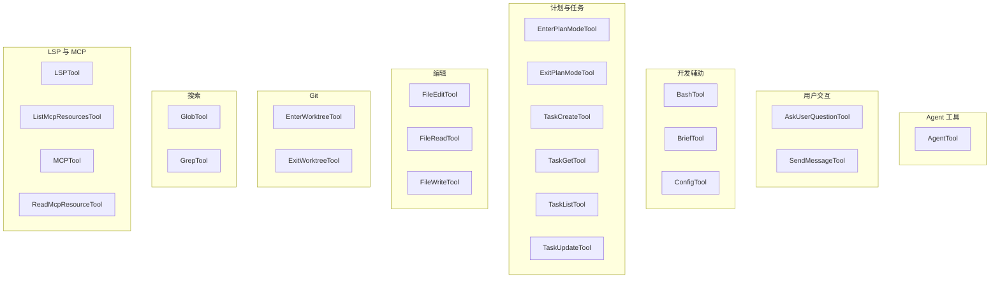
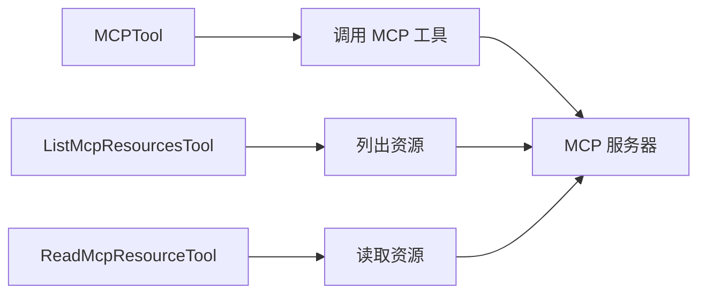
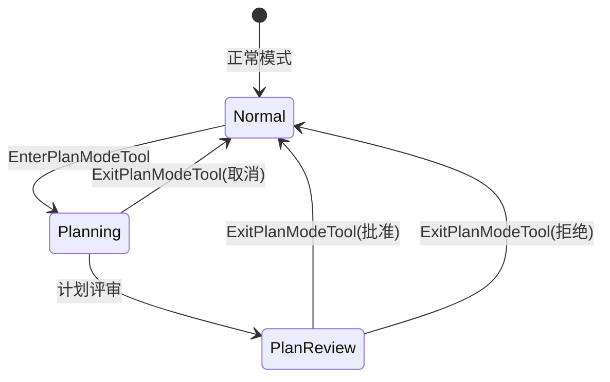
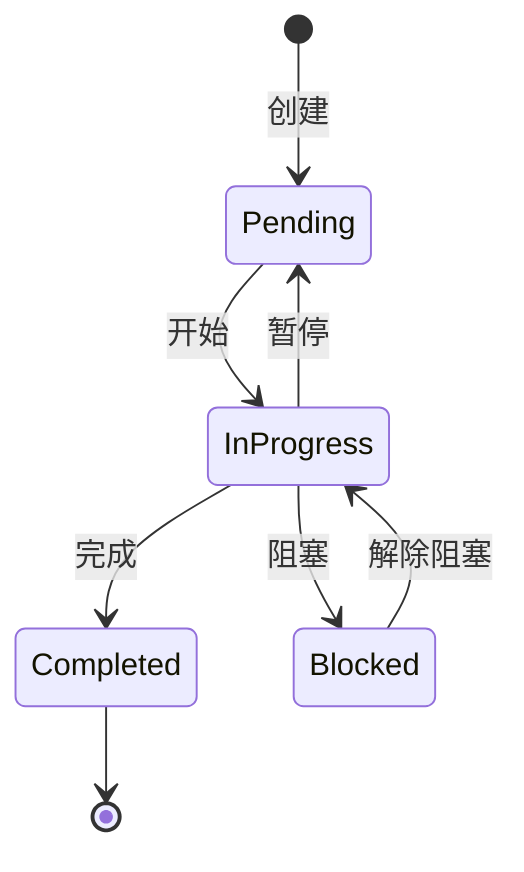

# 第 15 章：工具大全 A-M

> 本章目标：提供 A-M 开头工具的完整目录，每个工具包含设计理念、实现原理和使用场景。

## 工具目录结构



## AgentTool

**设计理念：** AgentTool 是 Claude Code 的元工具，允许 AI 启动专门的子 Agent 来处理复杂任务。

**实现原理：**

```typescript
interface AgentDefinition {
  name: string
  description: string
  instructions?: string
  tools?: string[]
  permissions?: PermissionSettings
}

function runAgent(definition: AgentDefinition, context: ToolContext) {
  // 1. 创建独立的 QueryEngine 实例
  const engine = new QueryEngine({
    tools: filterTools(definition.tools),
    permissions: definition.permissions,
  })

  // 2. 设置 Agent 特定指令
  engine.setSystemPrompt(definition.instructions)

  // 3. 执行 Agent
  return engine.run()
}
```

**内置 Agent：**

| Agent | 用途 | 工具集 |
|-------|------|--------|
| `claude-code-guide` | Claude Code 使用指南 | 文档读取 |
| `explore` | 代码库探索 | Read, Glob, Grep |
| `plan` | 实现计划设计 | 所有工具 |
| `general-purpose` | 通用任务 | 默认工具集 |
| `statusline-setup` | 状态栏配置 | 配置工具 |

**使用场景：**
- 复杂任务的分解
- 专用工作流（如代码审查）
- 隔离特定工具权限

## AskUserQuestionTool

**设计理念：** 允许 AI 在执行前向用户询问澄清问题，避免错误操作。

**实现原理：**

```typescript
interface QuestionInput {
  questions: Question[]
}

interface Question {
  question: string
  header?: string
  options?: Option[]
  multiSelect?: boolean
}

function askUser(input: QuestionInput) {
  // 1. 渲染问题 UI
  renderQuestions(input.questions)

  // 2. 等待用户响应
  const response = await waitForResponse()

  // 3. 返回用户选择
  return response
}
```

**使用场景：**
- 确认危险操作
- 选择实现方案
- 收集配置信息

## BashTool

**设计理念：** 通用命令执行工具，通过多层安全机制确保安全执行。

**核心特性：**
- 多层安全验证（详见第 13 章）
- 沙盒执行支持
- 超时控制
- 后台执行

**使用场景：**
- Git 操作
- 包管理
- 系统管理
- 任何命令行操作

## BriefTool

**设计理念：** 便捷的文件分享工具，用于快速上传和分享代码片段。

**实现原理：**

```typescript
interface BriefInput {
  files: string[]
  message?: string
}

function createBrief(input: BriefInput) {
  // 1. 收集文件内容
  const contents = await Promise.all(
    input.files.map(f => readFile(f))
  )

  // 2. 创建 brief
  const brief = await api.createBrief({
    files: zipContents(contents),
    message: input.message,
  })

  // 3. 返回分享链接
  return brief.url
}
```

**使用场景：**
- 分享错误日志
- 协作调试
- 代码审查

## ConfigTool

**设计理念：** 动态配置管理，允许 AI 在运行时调整 Claude Code 设置。

**支持设置：**

| 设置 | 说明 |
|------|------|
| `autoMode` | 自动批准权限 |
| `fastMode` | 快速响应模式 |
| `model` | 使用的模型 |
| `permissionMode` | 权限模式 |

## FileEditTool / FileReadTool / FileWriteTool

详见第 10 章。

## GlobTool

**设计理念：** 高性能文件匹配工具，基于 glob 模式查找文件。

**实现原理：**

```typescript
interface GlobInput {
  pattern: string
  path?: string
}

function glob(input: GlobInput) {
  // 使用 fast-glob 或内置实现
  const files = await fastGlob(input.pattern, {
    cwd: input.path || getCwd(),
    onlyFiles: true,
    absolute: false,
  })

  // 按修改时间排序
  return sortMtime(files)
}
```

**使用场景：**
- 查找所有测试文件
- 查找配置文件
- 批量操作

## GrepTool

**设计理念：** 基于 ripgrep 的高性能内容搜索工具。

**核心特性：**
- 正则表达式支持
- 多种输出模式
- 分页支持
- 上下文控制

**输出模式：**

| 模式 | 说明 |
|------|------|
| `content` | 显示匹配行和上下文 |
| `files_with_matches` | 只显示文件名 |
| `count` | 显示每个文件的匹配数 |

## LSPTool

**设计理念：** LSP（Language Server Protocol）集成，提供 IDE 级别的代码智能。

**功能：**
- 符号搜索
- 定义跳转
- 引用查找
- 诊断信息

## MCPTool / ListMcpResourcesTool / ReadMcpResourceTool

**设计理念：** MCP（Model Context Protocol）集成，扩展 AI 能力。

**MCP 工具链：**



## 计划与任务工具

### EnterPlanModeTool / ExitPlanModeTool

**设计理念：** 计划模式支持，允许 AI 先设计后实现。

**工作流程：**



### TaskCreateTool / TaskGetTool / TaskListTool / TaskUpdateTool

**设计理念：** 内置任务管理系统，支持复杂任务分解和跟踪。

**任务状态：**



## 本章小结

本章涵盖了 A-M 开头的主要工具：
- **AgentTool**：子 Agent 系统
- **AskUserQuestionTool**：用户交互
- **BashTool**：命令执行
- **FileEdit/Read/WriteTool**：文件操作
- **Glob/GrepTool**：搜索工具
- **LSP/MCP 工具**：扩展集成
- **计划与任务工具**：工作流管理

## 下一章预告

第 16 章将继续工具目录，涵盖 N-Z 开头的工具。
