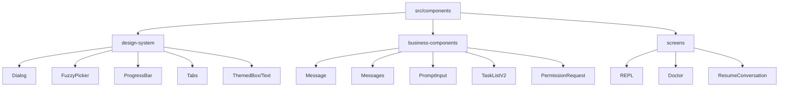

# 第 16 章：组件系统与设计模式

> 本章目标：深入分析 Claude Code 的组件组织结构和设计系统实现。

## 16.1 组件分类



### 设计系统组件

**位置：** `src/components/design-system/`

这些是可复用的基础 UI 组件，类似于 Material-UI 或 Ant Design 的设计系统：

| 组件 | 用途 |
|------|------|
| Dialog | 模态对话框容器 |
| FuzzyPicker | 模糊搜索选择器 |
| ProgressBar | 进度条 |
| Tabs | 标签页切换 |
| ListItem | 列表项 |
| Pane | 带边框的面板 |
| Byline | 底部提示行 |
| KeyboardShortcutHint | 快捷键提示 |
| ThemedBox/Text | 主题化包装器 |

### 业务组件

**位置：** `src/components/`

包含具体业务逻辑的复合组件：

| 组件 | 用途 |
|------|------|
| Message | 单条消息渲染 |
| Messages | 消息列表容器 |
| PromptInput | 输入框 |
| TaskListV2 | 任务列表 |
| PermissionRequest | 权限请求对话框 |
| Spinner | 加载动画 |

### 屏幕组件

**位置：** `src/screens/`

顶层屏幕组件，控制整个应用视图：

| 组件 | 用途 |
|------|------|
| REPL | 主交互界面 |
| Doctor | 诊断屏幕 |
| ResumeConversation | 会话恢复 |

## 16.2 设计系统组件

### Dialog 组件

```typescript
// src/components/design-system/Dialog.tsx
type DialogProps = {
  title: React.ReactNode;
  subtitle?: React.ReactNode;
  children: React.ReactNode;
  onCancel: () => void;
  color?: keyof Theme;
  hideInputGuide?: boolean;
  hideBorder?: boolean;
  inputGuide?: (exitState: ExitState) => React.ReactNode;
  isCancelActive?: boolean;
};

export function Dialog({
  title,
  subtitle,
  children,
  onCancel,
  color = 'permission',
  hideInputGuide,
  hideBorder,
  inputGuide,
  isCancelActive = true,
}: DialogProps): React.ReactNode {
  // 处理 Ctrl+C/D 退出
  const exitState = useExitOnCtrlCDWithKeybindings(
    undefined,
    undefined,
    isCancelActive
  );

  // 使用可配置的 Esc 快捷键取消
  useKeybinding('confirm:no', onCancel, {
    context: 'Confirmation',
    isActive: isCancelActive
  });

  // 动态输入指南
  const defaultInputGuide = exitState.pending
    ? <Text>Press {exitState.keyName} again to exit</Text>
    : (
      <Byline>
        <KeyboardShortcutHint shortcut="Enter" action="confirm" />
        <ConfigurableShortcutHint
          action="confirm:no"
          context="Confirmation"
          fallback="Esc"
          description="cancel"
        />
      </Byline>
    );

  const content = (
    <>
      <Box flexDirection="column" gap={1}>
        <Box flexDirection="column">
          <Text bold color={color}>{title}</Text>
          {subtitle && <Text dimColor>{subtitle}</Text>}
        </Box>
        {children}
      </Box>
      {!hideInputGuide && (
        <Box marginTop={1}>
          <Text dimColor italic>
            {inputGuide ? inputGuide(exitState) : defaultInputGuide}
          </Text>
        </Box>
      )}
    </>
  );

  if (hideBorder) {
    return content;
  }

  return <Pane color={color}>{content}</Pane>;
}
```

**设计意图：** Dialog 提供统一的对话框容器，集成快捷键、退出处理和主题化。

### FuzzyPicker 组件

```typescript
// src/components/design-system/FuzzyPicker.tsx
type PickerAction<T> = {
  action: string;  // 提示标签
  handler: (item: T) => void;
};

type Props<T> = {
  title: string;
  placeholder?: string;
  initialQuery?: string;
  items: readonly T[];
  getKey: (item: T) => string;
  renderItem: (item: T, isFocused: boolean) => React.ReactNode;
  renderPreview?: (item: T) => React.ReactNode;
  previewPosition?: 'bottom' | 'right';
  visibleCount?: number;
  direction?: 'down' | 'up';
  onQueryChange: (query: string) => void;
  onSelect: (item: T) => void;
  onTab?: PickerAction<T>;
  onShiftTab?: PickerAction<T>;
  onFocus?: (item: T | undefined) => void;
  onCancel: () => void;
  emptyMessage?: string | ((query: string) => string);
  matchLabel?: string;
  selectAction?: string;
  extraHints?: React.ReactNode;
};

export function FuzzyPicker<T>({
  title,
  placeholder = 'Type to search…',
  items,
  getKey,
  renderItem,
  renderPreview,
  previewPosition = 'bottom',
  visibleCount: requestedVisible = 8,
  direction = 'down',
  onQueryChange,
  onSelect,
  onTab,
  onShiftTab,
  onFocus,
  onCancel,
  emptyMessage = 'No results',
  matchLabel,
  selectAction = 'select',
}: Props<T>): React.ReactNode {
  const isTerminalFocused = useTerminalFocus();
  const { rows, columns } = useTerminalSize();
  const [focusedIndex, setFocusedIndex] = useState(0);

  // 根据终端高度限制可见数量
  const visibleCount = Math.max(
    2,
    Math.min(requestedVisible, rows - 10 - (matchLabel ? 1 : 0))
  );

  // 窄终端使用紧凑模式
  const compact = columns < 120;

  const step = (delta: 1 | -1) => {
    setFocusedIndex(i => clamp(i + delta, 0, items.length - 1));
  };

  // 搜索输入
  const { query, cursorOffset } = useSearchInput({
    isActive: true,
    onExit: () => {},  // 由 onKeyDown 处理
    onCancel,
    initialQuery,
    backspaceExitsOnEmpty: false
  });

  // 键盘导航
  const handleKeyDown = (e: KeyboardEvent) => {
    if (e.key === 'up' || e.ctrl && e.key === 'p') {
      e.preventDefault();
      e.stopImmediatePropagation();
      step(direction === 'up' ? 1 : -1);
      return;
    }
    if (e.key === 'down' || e.ctrl && e.key === 'n') {
      e.preventDefault();
      e.stopImmediatePropagation();
      step(direction === 'up' ? -1 : 1);
      return;
    }
    if (e.key === 'return') {
      e.preventDefault();
      e.stopImmediatePropagation();
      const selected = items[focusedIndex];
      if (selected) onSelect(selected);
      return;
    }
    if (e.key === 'tab') {
      e.preventDefault();
      e.stopImmediatePropagation();
      const selected = items[focusedIndex];
      if (!selected) return;
      const tabAction = e.shift ? onShiftTab ?? onTab : onTab;
      if (tabAction) {
        tabAction.handler(selected);
      }
    }
  };

  // 通知焦点变化
  useEffect(() => {
    onFocus?.(items[focusedIndex]);
  }, [focusedIndex, items]);

  // 渲染项目列表
  const visibleItems = useMemo(() => {
    const start = Math.max(0, focusedIndex - Math.floor(visibleCount / 2));
    const end = Math.min(items.length, start + visibleCount);
    return items.slice(start, end);
  }, [items, focusedIndex, visibleCount]);

  return (
    <Box flexDirection="column">
      {/* 标题和搜索框 */}
      <Box flexDirection="column">
        <Text bold>{title}</Text>
        <SearchBox
          query={query}
          cursorOffset={cursorOffset}
          placeholder={placeholder}
          onChange={onQueryChange}
        />
      </Box>

      {/* 列表 */}
      <Box flexDirection="column" marginTop={1}>
        {visibleItems.length === 0
          ? <Text dimColor>
            {typeof emptyMessage === 'function'
              ? emptyMessage(query)
              : emptyMessage}
          </Text>
          : visibleItems.map((item, idx) => {
            const actualIndex = items.indexOf(item);
            const isFocused = actualIndex === focusedIndex;
            return (
              <ListItem key={getKey(item)} focused={isFocused}>
                {renderItem(item, isFocused)}
              </ListItem>
            );
          })
        }
      </Box>

      {/* 预览 */}
      {renderPreview && items[focusedIndex] && (
        <Box flexDirection="column" marginTop={1}>
          {renderPreview(items[focusedIndex])}
        </Box>
      )}

      {/* 提示行 */}
      <Byline marginTop={1}>
        {compact ? (
          <>
            <KeyboardShortcutHint shortcut="↑↓" action="navigate" />
            <KeyboardShortcutHint shortcut="Enter" action={selectAction} />
          </>
        ) : (
          <>
            <KeyboardShortcutHint shortcut="↑↓" action="navigate" />
            <KeyboardShortcutHint shortcut="Enter" action={selectAction} />
            <KeyboardShortcutHint shortcut="Esc" action="cancel" />
            {onTab && (
              <KeyboardShortcutHint shortcut="Tab" action={onTab.action} />
            )}
            {extraHints}
          </>
        )}
        {matchLabel && <Text> • {matchLabel}</Text>}
      </Byline>
    </Box>
  );
}
```

**设计意图：** FuzzyPicker 提供可搜索的选择列表，支持键盘导航、预览和自定义渲染。

### ProgressBar 组件

```typescript
// src/components/design-system/ProgressBar.tsx
type Props = {
  percent: number;  // 0-100
  width?: number;
  color?: keyof Theme;
};

export function ProgressBar({
  percent,
  width = 20,
  color = 'success'
}: Props): React.ReactNode {
  const theme = useTheme();
  const fillColor = theme[color];
  const emptyColor = theme.inactive;

  // 计算填充的字符数
  const filledWidth = Math.round((percent / 100) * width);
  const emptyWidth = width - filledWidth;

  return (
    <Box>
      <Text backgroundColor={fillColor}>{' '.repeat(filledWidth)}</Text>
      <Text backgroundColor={emptyColor}>{' '.repeat(emptyWidth)}</Text>
      <Text> {Math.round(percent)}%</Text>
    </Box>
  );
}
```

### Tabs 组件

```typescript
// src/components/design-system/Tabs.tsx
type Props = {
  tabs: Array<{
    id: string;
    label: string;
    icon?: string;
  }>;
  activeTab: string;
  onChange: (tabId: string) => void;
};

export function Tabs({ tabs, activeTab, onChange }: Props): React.ReactNode {
  const theme = useTheme();

  return (
    <Box flexDirection="row" gap={1}>
      {tabs.map(tab => {
        const isActive = tab.id === activeTab;
        return (
          <Text
            key={tab.id}
            color={isActive ? theme.claude : theme.inactive}
            underline={isActive}
            bold={isActive}
          >
            {tab.icon && `${tab.icon} `}
            {tab.label}
          </Text>
        );
      })}
    </Box>
  );
}
```

## 16.3 组件通信模式

### Props 传递

```typescript
// 父组件向子组件传递数据
export function Parent() {
  const [data, setData] = useState('initial');

  return (
    <Child
      value={data}
      onChange={setData}
    />
  );
}

export function Child({ value, onChange }: {
  value: string;
  onChange: (value: string) => void;
}) {
  return (
    <TextInput
      value={value}
      onSubmit={onChange}
    />
  );
}
```

### Context 共享

```typescript
// src/context/notifications.ts
export type NotificationsContextValue = {
  notifications: Notification[];
  addNotification: (notification: Notification) => void;
  removeNotification: (id: string) => void;
};

const NotificationsContext = createContext<NotificationsContextValue | null>(null);

export function NotificationsProvider({ children }) {
  const [notifications, setNotifications] = useState<Notification[]>([]);

  const addNotification = useCallback((notification: Notification) => {
    setNotifications(prev => [...prev, notification]);
  }, []);

  const removeNotification = useCallback((id: string) => {
    setNotifications(prev => prev.filter(n => n.id !== id));
  }, []);

  const value = useMemo(
    () => ({ notifications, addNotification, removeNotification }),
    [notifications, addNotification, removeNotification]
  );

  return (
    <NotificationsContext.Provider value={value}>
      {children}
    </NotificationsContext.Provider>
  );
}

export function useNotifications() {
  const context = useContext(NotificationsContext);
  if (!context) {
    throw new Error('useNotifications must be used within NotificationsProvider');
  }
  return context;
}
```

### 事件冒泡

```typescript
// 使用 onClick 事件向上传递
export function ListItem({ item, onSelect }: {
  item: Item;
  onSelect: (item: Item) => void;
}) {
  return (
    <Box
      onClick={() => onSelect(item)}
    >
      <Text>{item.name}</Text>
    </Box>
  );
}

// 在父组件中处理
export function List({ items }: { items: Item[] }) {
  const handleSelect = useCallback((item: Item) => {
    // 处理选择
  }, []);

  return (
    <Box flexDirection="column">
      {items.map(item => (
        <ListItem
          key={item.id}
          item={item}
          onSelect={handleSelect}
        />
      ))}
    </Box>
  );
}
```

## 16.4 主题系统

### 主题类型定义

```typescript
// src/utils/theme.ts
export type Theme = {
  // 品牌颜色
  claude: string;
  claudeShimmer: string;
  claudeBlue_FOR_SYSTEM_SPINNER: string;
  claudeBlueShimmer_FOR_SYSTEM_SPINNER: string;

  // 功能颜色
  permission: string;
  permissionShimmer: string;
  planMode: string;
  ide: string;
  autoAccept: string;

  // UI 元素
  promptBorder: string;
  promptBorderShimmer: string;
  text: string;
  inverseText: string;
  inactive: string;
  inactiveShimmer: string;
  subtle: string;
  suggestion: string;
  background: string;

  // 语义颜色
  success: string;
  error: string;
  warning: string;
  merged: string;
  warningShimmer: string;

  // Diff 颜色
  diffAdded: string;
  diffRemoved: string;
  diffAddedDimmed: string;
  diffRemovedDimmed: string;
  diffAddedWord: string;
  diffRemovedWord: string;

  // Agent 颜色（子 Agent 区分）
  red_FOR_SUBAGENTS_ONLY: string;
  blue_FOR_SUBAGENTS_ONLY: string;
  green_FOR_SUBAGENTS_ONLY: string;
  yellow_FOR_SUBAGENTS_ONLY: string;
  purple_FOR_SUBAGENTS_ONLY: string;
  orange_FOR_SUBAGENTS_ONLY: string;
  pink_FOR_SUBAGENTS_ONLY: string;
  cyan_FOR_SUBAGENTS_ONLY: string;

  // TUI V2 颜色
  clawd_body: string;
  clawd_background: string;
  userMessageBackground: string;
  userMessageBackgroundHover: string;
  messageActionsBackground: string;
  selectionBg: string;
  bashMessageBackgroundColor: string;

  // 其他
  memoryBackgroundColor: string;
  rate_limit_fill: string;
  rate_limit_empty: string;
  fastMode: string;
  fastModeShimmer: string;
  briefLabelYou: string;
  briefLabelClaude: string;

  // Rainbow 颜色（ultrathink 高亮）
  rainbow_red: string;
  rainbow_orange: string;
  rainbow_yellow: string;
  rainbow_green: string;
  rainbow_blue: string;
  rainbow_indigo: string;
  rainbow_violet: string;
  // ... shimmer 版本
};
```

### 主题实现

```typescript
// 深色主题（默认）
const darkTheme: Theme = {
  autoAccept: 'rgb(175,135,255)',  // Electric violet
  bashBorder: 'rgb(253,93,177)',    // Bright pink
  claude: 'rgb(215,119,87)',        // Claude orange
  claudeShimmer: 'rgb(235,159,127)',
  claudeBlue_FOR_SYSTEM_SPINNER: 'rgb(147,165,255)',
  claudeBlueShimmer_FOR_SYSTEM_SPINNER: 'rgb(177,195,255)',
  permission: 'rgb(177,185,249)',   // Light blue-purple
  permissionShimmer: 'rgb(207,215,255)',
  planMode: 'rgb(72,150,140)',       // Muted sage green
  ide: 'rgb(71,130,200)',           // Muted blue
  promptBorder: 'rgb(136,136,136)',
  promptBorderShimmer: 'rgb(166,166,166)',
  text: 'rgb(255,255,255)',         // White
  inverseText: 'rgb(0,0,0)',        // Black
  inactive: 'rgb(153,153,153)',     // Light gray
  inactiveShimmer: 'rgb(193,193,193)',
  subtle: 'rgb(80,80,80)',          // Dark gray
  suggestion: 'rgb(177,185,249)',
  remember: 'rgb(177,185,249)',
  background: 'rgb(0,204,204)',      // Bright cyan
  success: 'rgb(78,186,101)',       // Bright green
  error: 'rgb(255,107,128)',        // Bright red
  warning: 'rgb(255,193,7)',        // Bright amber
  merged: 'rgb(175,135,255)',
  warningShimmer: 'rgb(255,223,57)',
  diffAdded: 'rgb(34,92,43)',       // Dark green
  diffRemoved: 'rgb(122,41,54)',    // Dark red
  diffAddedDimmed: 'rgb(71,88,74)',
  diffRemovedDimmed: 'rgb(105,72,77)',
  diffAddedWord: 'rgb(56,166,96)',
  diffRemovedWord: 'rgb(179,89,107)',
  // ... Agent colors
  red_FOR_SUBAGENTS_ONLY: 'rgb(220,38,38)',
  blue_FOR_SUBAGENTS_ONLY: 'rgb(37,99,235)',
  green_FOR_SUBAGENTS_ONLY: 'rgb(22,163,74)',
  // ...
};

// 浅色主题
const lightTheme: Theme = {
  text: 'rgb(0,0,0)',
  inverseText: 'rgb(255,255,255)',
  claude: 'rgb(215,119,87)',
  // ...
};

// Daltonized 色盲友好主题
const lightDaltonizedTheme: Theme = {
  // 使用蓝色替代绿色/红色
  success: 'rgb(0,102,153)',  // Blue instead of green
  error: 'rgb(204,0,0)',     // Pure red for better distinction
  diffAdded: 'rgb(153,204,255)',  // Light blue instead of green
  // ...
};
```

### ThemeProvider

```typescript
// src/components/design-system/ThemeProvider.tsx
import { createContext, useContext, useMemo, type ReactNode } from 'react';
import type { Theme } from '../../utils/theme.js';
import { getTheme } from '../../utils/theme.js';
import { useAppState } from '../../state/AppState.js';

const ThemeContext = createContext<Theme>(getTheme('dark'));

export function ThemeProvider({ children }: { children: ReactNode }) {
  const appState = useAppState();
  const theme = useMemo(
    () => getTheme(appState.settings.themeName),
    [appState.settings.themeName]
  );

  return (
    <ThemeContext.Provider value={theme}>
      {children}
    </ThemeContext.Provider>
  );
}

export function useTheme(): Theme {
  return useContext(ThemeContext);
}
```

### ThemedBox 和 ThemedText

```typescript
// src/components/design-system/ThemedBox.tsx
import type { Styles } from '../../ink/styles.js';
import { Box } from '../../ink.js';
import { useTheme, type Theme } from './ThemeProvider.js';

type ColorProp = keyof Theme | ((theme: Theme) => string);

export function ThemedBox({
  color,
  backgroundColor,
  ...props
}: Styles & {
  color?: ColorProp;
  backgroundColor?: ColorProp;
  children?: ReactNode;
}) {
  const theme = useTheme();

  const resolveColor = (colorProp: ColorProp | undefined): string | undefined => {
    if (!colorProp) return undefined;
    return typeof colorProp === 'function'
      ? colorProp(theme)
      : theme[colorProp];
  };

  return (
    <Box
      {...props}
      color={resolveColor(color)}
      backgroundColor={resolveColor(backgroundColor)}
    >
      {props.children}
    </Box>
  );
}

// 使用示例
export function StatusMessage() {
  return (
    <ThemedBox
      color="success"  // 或 (theme) => theme.success
      padding={1}
    >
      <Text>Operation completed successfully!</Text>
    </ThemedBox>
  );
}
```

## 16.5 组件优化

### React.memo 使用

```typescript
// 避免不必要的重新渲染
export const Message = React.memo(function Message({
  message,
  isFocused
}: {
  message: Message;
  isFocused: boolean;
}) {
  return (
    <Box>
      <Text>{message.content}</Text>
    </Box>
  );
}, (prevProps, nextProps) => {
  // 自定义比较函数
  return (
    prevProps.message.id === nextProps.message.id &&
    prevProps.isFocused === nextProps.isFocused
  );
});
```

### useMemo 和 useCallback

```typescript
export function MessageList({ messages }: {
  messages: Message[];
}) {
  // 缓存计算结果
  const groupedMessages = useMemo(() => {
    return groupMessagesByDate(messages);
  }, [messages]);

  // 缓存回调函数
  const handleSelect = useCallback((id: string) => {
    // 选择消息
  }, []);

  return (
    <Box flexDirection="column">
      {groupedMessages.map(group => (
        <MessageGroup
          key={group.date}
          group={group}
          onSelect={handleSelect}
        />
      ))}
    </Box>
  );
}
```

### React Compiler 集成

```typescript
// React Compiler 自动优化，无需手动 memo
export function OptimizedComponent({ items }: {
  items: Item[];
}) {
  // Compiler 自动检测依赖
  const total = items.reduce((sum, item) => sum + item.value, 0);

  // 自动记忆化回调
  const handleClick = (id: string) => {
    // 处理点击
  };

  return (
    <Box>
      <Text>Total: {total}</Text>
      {items.map(item => (
        <Box key={item.id} onClick={() => handleClick(item.id)}>
          <Text>{item.name}</Text>
        </Box>
      ))}
    </Box>
  );
}
```

## 16.6 可复用模式总结

### 模式 34：设计系统组件库

**描述：** 构建一致的终端 UI 组件库。

**适用场景：**
- 构建 TUI 应用
- 需要一致的视觉风格
- 多组件复用

**代码模板：**

```typescript
// 1. 定义 Props 类型
export type ComponentProps = {
  // 主要内容
  children: ReactNode;
  // 可选样式
  style?: Partial<Styles>;
  // 主题颜色
  color?: keyof Theme | ((theme: Theme) => string);
  // 行为标志
  disabled?: boolean;
  loading?: boolean;
  // 事件处理
  onPress?: () => void;
  // 尺寸变体
  size?: 'small' | 'medium' | 'large';
  // 视觉变体
  variant?: 'primary' | 'secondary' | 'ghost';
};

// 2. 实现组件
export function DesignSystemComponent({
  children,
  style,
  color: colorProp,
  disabled = false,
  loading = false,
  onPress,
  size = 'medium',
  variant = 'primary',
}: ComponentProps): ReactNode {
  const theme = useTheme();

  // 解析颜色
  const color = typeof colorProp === 'function'
    ? colorProp(theme)
    : colorProp
      ? theme[colorProp]
      : theme.text;

  // 尺寸映射
  const sizeStyles = {
    small: { paddingX: 1, paddingY: 0 },
    medium: { paddingX: 2, paddingY: 1 },
    large: { paddingX: 3, paddingY: 2 },
  };

  // 变体样式
  const variantStyles = {
    primary: { backgroundColor: theme.claude },
    secondary: { backgroundColor: theme.inactive },
    ghost: { border: { color: theme.promptBorder } },
  };

  // 组合样式
  const combinedStyles: Styles = {
    ...sizeStyles[size],
    ...variantStyles[variant],
    ...style,
  };

  // 加载状态
  if (loading) {
    return (
      <Box {...combinedStyles}>
        <Text dimColor>Loading…</Text>
      </Box>
    );
  }

  // 禁用状态
  if (disabled) {
    return (
      <Box {...combinedStyles}>
        <Text dimColor>{children}</Text>
      </Box>
    );
  }

  // 正常状态
  return (
    <Box
      {...combinedStyles}
      onClick={onPress}
    >
      <Text color={variant === 'primary' ? 'inverseText' : color}>
        {children}
      </Text>
    </Box>
  );
}
```

**关键点：**
1. 类型化的 Props
2. 主题颜色支持
3. 尺寸变体
4. 视觉变体
5. 状态处理（loading, disabled）
6. 样式组合

### 模式 35：主题提供者模式

**描述：** 集中管理应用主题，支持动态切换。

**适用场景：**
- 需要深色/浅色模式切换
- 色盲友好模式
- 自定义主题

**代码模板：**

```typescript
// 1. 定义主题类型
export type Theme = {
  name: string;
  colors: {
    primary: string;
    secondary: string;
    success: string;
    error: string;
    warning: string;
    text: string;
    background: string;
    border: string;
  };
  spacing: {
    small: number;
    medium: number;
    large: number;
  };
  typography: {
    fontSize: {
      small: number;
      medium: number;
      large: number;
    };
  };
};

// 2. 定义主题映射
export const themes: Record<string, Theme> = {
  dark: {
    name: 'dark',
    colors: {
      primary: 'rgb(177,185,249)',
      text: 'rgb(255,255,255)',
      background: 'rgb(0,0,0)',
      // ...
    },
    spacing: { small: 1, medium: 2, large: 3 },
    typography: {
      fontSize: { small: 12, medium: 14, large: 16 },
    },
  },
  light: {
    name: 'light',
    colors: {
      primary: 'rgb(87,105,247)',
      text: 'rgb(0,0,0)',
      background: 'rgb(255,255,255)',
      // ...
    },
    spacing: { small: 1, medium: 2, large: 3 },
    typography: {
      fontSize: { small: 12, medium: 14, large: 16 },
    },
  },
};

// 3. 创建 Theme Context
const ThemeContext = createContext<Theme>(themes.dark);

// 4. ThemeProvider 组件
export function ThemeProvider({
  theme: themeName,
  children,
}: {
  theme: string;
  children: ReactNode;
}) {
  const [currentTheme, setCurrentTheme] = useState(themes[themeName]);

  // 切换主题函数
  const setTheme = useCallback((name: string) => {
    setCurrentTheme(themes[name]);
  }, []);

  const value = useMemo(
    () => ({ ...currentTheme, setTheme }),
    [currentTheme, setTheme]
  );

  return (
    <ThemeContext.Provider value={value}>
      {children}
    </ThemeContext.Provider>
  );
}

// 5. useTheme Hook
export function useTheme(): Theme {
  return useContext(ThemeContext);
}

// 6. Themed 组件
export function ThemedText({
  color,
  children,
}: {
  color?: keyof Theme['colors'];
  children: ReactNode;
}) {
  const theme = useTheme();
  const textColor = color ? theme.colors[color] : theme.colors.text;

  return <Text color={textColor}>{children}</Text>;
}

// 7. 使用示例
export function App() {
  const { setTheme } = useTheme();

  return (
    <Box flexDirection="column">
      <ThemedText color="primary">Welcome</ThemedText>
      <Box marginTop={1}>
        <Text>Theme: </Text>
        <Text
          color="success"
          onClick={() => setTheme('light')}
        >
          [Light]
        </Text>
        <Text> </Text>
        <Text
          color="success"
          onClick={() => setTheme('dark')}
        >
          [Dark]
        </Text>
      </Box>
    </Box>
  );
}
```

**关键点：**
1. 类型安全的主题定义
2. 主题映射表
3. Context 提供者
4. useTheme Hook
5. Themed 组件包装器
6. 动态主题切换

---

## 本章小结

本章分析了 Claude Code 的组件系统和设计模式：

1. **组件分类**：设计系统组件、业务组件、屏幕组件
2. **设计系统组件**：Dialog、FuzzyPicker、ProgressBar、Tabs
3. **组件通信**：Props 传递、Context 共享、事件冒泡
4. **主题系统**：Theme 类型、深色/浅色/Daltonized 主题、ThemeProvider
5. **组件优化**：React.memo、useMemo、React Compiler
6. **可复用模式**：设计系统组件库、主题提供者模式

## 下一章预告

第 17 章将深入分析状态管理架构，包括 AppState 设计、状态存储、更新机制和选择器模式。
