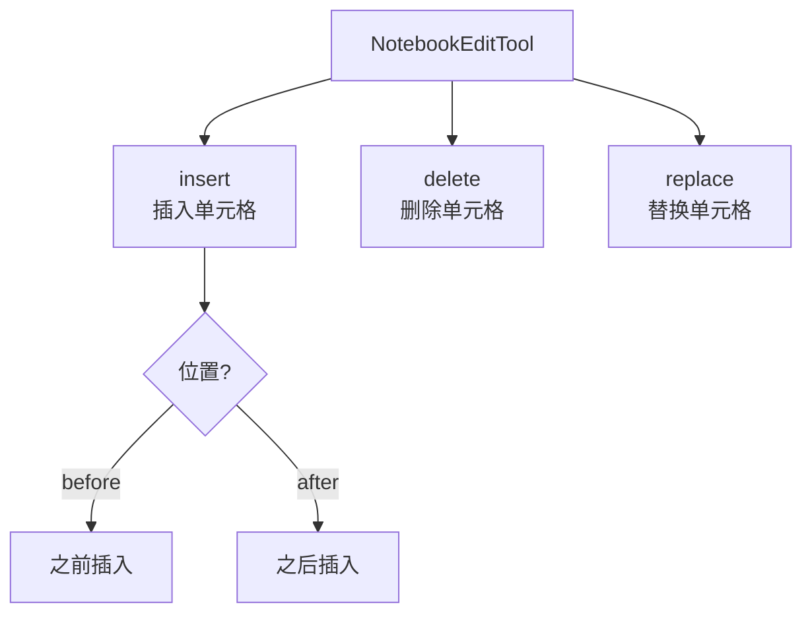
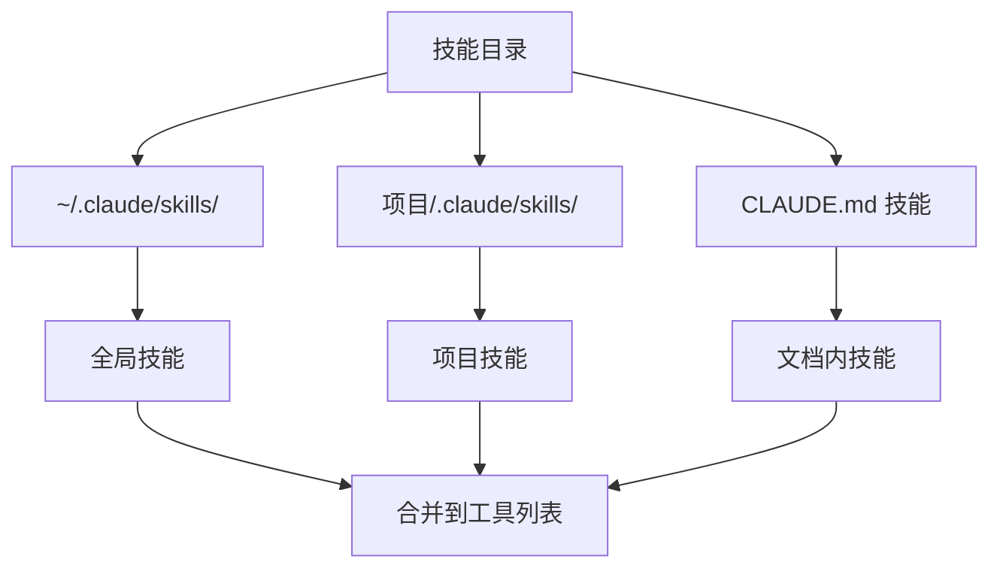
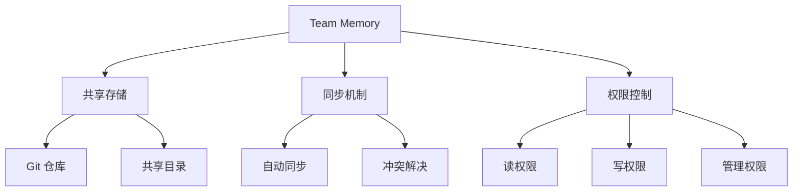

# 第 16 章：工具大全 N-Z

> 本章目标：提供 N-Z 开头工具的完整目录，完成工具系统的全面覆盖。

## 工具目录（N-Z）

| 工具 | 类别 | 描述 |
|------|------|------|
| **NotebookEditTool** | 编辑 | Jupyter Notebook 编辑 |
| **PowerShellTool** | 执行 | Windows PowerShell 支持 |
| **RemoteTriggerTool** | KAIROS | 远程触发器 |
| **ScheduleCronTool** | KAIROS | 定时任务管理 |
| **SendMessageTool** | 通信 | 发送消息 |
| **SkillTool** | 扩展 | 技能系统 |
| **SleepTool** | 工具 | 延迟执行（限制使用） |
| **Task* 工具** | 管理 | 任务管理系统 |
| **Team* 工具** | 协作 | 团队管理 |
| **TodoWriteTool** | 任务 | Todo 列表 |
| **ToolSearchTool** | 发现 | 工具搜索 |
| **WebFetchTool** | 网络 | 获取网页 |
| **WebSearchTool** | 网络 | 网络搜索 |

## NotebookEditTool

**设计理念：** Jupyter Notebook 专用编辑工具，理解 Notebook 的语义结构。

**支持的操作：**



**实现原理：**

```typescript
interface NotebookEditInput {
  editMode: 'insert' | 'delete' | 'replace'
  file_path: string
  cell_id?: string
  cells?: NotebookCell[]
  position?: 'before' | 'after'
}

async function editNotebook(input: NotebookEditInput) {
  // 1. 读取 Notebook
  const notebook = await readNotebook(input.file_path)

  // 2. 定位目标单元格
  const cellIndex = notebook.cells.findIndex(c => c.id === input.cell_id)

  // 3. 应用编辑
  switch (input.editMode) {
    case 'insert':
      notebook.cells.splice(cellIndex, 0, ...input.cells)
      break
    case 'delete':
      notebook.cells.splice(cellIndex, 1)
      break
    case 'replace':
      notebook.cells[cellIndex] = input.cells[0]
      break
  }

  // 4. 写回文件
  await writeNotebook(input.file_path, notebook)
}
```

## PowerShellTool

**设计理念：** Windows 环境下的 BashTool 等价物，提供 PowerShell 命令执行能力。

**与 BashTool 的对应：**

| BashTool | PowerShellTool | 差异 |
|----------|----------------|------|
| Bash 安全模型 | PowerShell 安全模型 | 语法差异 |
| Shell 特定检查 | PowerShell 检查 | 环境变量 |
| Git 集成 | Git 集成 | 相同 |
| 沙盒支持 | 沙盒支持 | 相同 |

**PowerShell 特定检查：**

```typescript
const POWERSHELL_DANGEROUS_COMMANDS = [
  'Invoke-Expression',  // 代码执行
  'Invoke-Command',     // 远程命令
  'New-Object',         // 对象创建（可绕过）
]

const POWERSHELL_DANGEROUS_PARAMETERS = [
  '-EncodedCommand',    // 编码命令
  '-ArgumentList',      // 参数列表
]
```

## RemoteTriggerTool / ScheduleCronTool

详见 KAIROS 系列。

## SendMessageTool

**设计理念：** 允许 AI 向用户发送非输出消息（如通知、警告）。

**消息类型：**

```typescript
interface SendMessageInput {
  message: string
  type?: 'info' | 'warning' | 'error' | 'success'
}

function sendMessage(input: SendMessageInput) {
  // 渲染到用户界面
  renderNotification({
    message: input.message,
    type: input.type || 'info',
  })
}
```

**使用场景：**
- 操作进度通知
- 非阻塞警告
- 后台任务完成通知

## SkillTool

**设计理念：** 技能（Skill）是用户自定义的可复用工作流，通过技能系统扩展 Claude Code 能力。

**技能发现：**



**技能结构：**

```markdown
# skill-name

> 技能描述

## 触发条件

当用户问及特定问题时触发此技能。

## 使用说明

1. 步骤一
2. 步骤二
3. 步骤三
```

## SleepTool

**设计理念：** 受限的延迟工具，用于特定场景但防止滥用。

**限制策略：**

```typescript
function validateSleepInput(input: SleepInput) {
  // 第一个命令的 sleep >= 2s 被阻止
  if (input.isFirstCommand && input.duration >= 2000) {
    return {
      allowed: false,
      reason: 'Long sleep in first command not allowed',
    }
  }

  // 使用 run_in_background 替代
  if (input.duration > 10000) {
    return {
      allowed: false,
      reason: 'Use run_in_background for long delays',
    }
  }

  return { allowed: true }
}
```

**推荐替代：**

| 场景 | 推荐方案 |
|------|----------|
| 等待后台任务 | `run_in_background` |
| 轮询检查 | 直接检查 |
| 流式输出 | `Monitor` 工具 |

## TodoWriteTool

**设计理念：** 轻量级任务列表，用于跟踪 AI 任务进度。

**与 Task 工具的区别：**

| 特性 | TodoWriteTool | Task 工具 |
|------|---------------|----------|
| 复杂度 | 简单列表 | 完整任务管理 |
| 状态 | 文本描述 | 结构化状态 |
| 依赖 | 无 | 支持依赖 |
| 持久化 | 会话内 | 可持久化 |

## ToolSearchTool

**设计理念：** 帮助 AI 发现可用工具，基于语义搜索工具描述。

**搜索策略：**

```typescript
function searchTools(query: string): Tool[] {
  // 1. 关键词匹配
  const keywordMatches = tools.filter(t =>
    t.name.includes(query) || t.searchHint?.includes(query)
  )

  // 2. 描述语义搜索
  const semanticMatches = semanticSearch(
    query,
    tools.map(t => t.description)
  )

  // 3. 合并结果
  return mergeResults(keywordMatches, semanticMatches)
}
```

## WebFetchTool / WebSearchTool

**设计理念：** 网络访问工具，扩展 AI 的知识范围。

**WebFetch 工具：**

```typescript
interface WebFetchInput {
  url: string
  maxBytes?: number
}

async function webFetch(input: WebFetchInput) {
  // 1. 验证 URL
  const parsed = new URL(input.url)

  // 2. 检查允许的协议
  if (!['http:', 'https:'].includes(parsed.protocol)) {
    throw new Error('Only HTTP/HTTPS URLs allowed')
  }

  // 3. 获取内容
  const response = await fetch(input.url)
  const html = await response.text()

  // 4. 转换为 Markdown
  const markdown = htmlToMarkdown(html)

  return markdown
}
```

**WebSearch 工具：**

```typescript
interface WebSearchInput {
  query: string
  numResults?: number
}

async function webSearch(input: WebSearchInput) {
  // 调用搜索 API
  const results = await searchAPI({
    q: input.query,
    num: input.numResults || 10,
  })

  return results
}
```

## 团队管理工具

### TeamCreateTool / TeamDeleteTool

**设计理念：** 团队记忆系统的管理工具，支持多用户协作。

**团队记忆架构：**



## 本章小结

本章完成了 N-Z 工具的目录：
- **NotebookEditTool**：Jupyter Notebook 编辑
- **PowerShellTool**：Windows PowerShell 支持
- **Remote/Schedule 工具**：KAIROS 定时任务
- **SkillTool**：用户技能系统
- **Web 工具**：网络访问
- **团队工具**：协作支持

## 全书工具系统总结

第 9-16 章构成了完整的工具系统分析：

1. **第 9 章**：工具系统架构总论
2. **第 10 章**：文件工具深度分析
3. **第 11 章**：搜索工具深度分析
4. **第 12 章**：执行工具深度分析
5. **第 13 章**：Bash 安全模型
6. **第 14 章**：Agent 工具深度分析
7. **第 15 章**：工具大全 A-M
8. **第 16 章**：工具大全 N-Z

## 下一章预告

第 17 章将开始命令与界面部分，首先分析命令系统架构。
