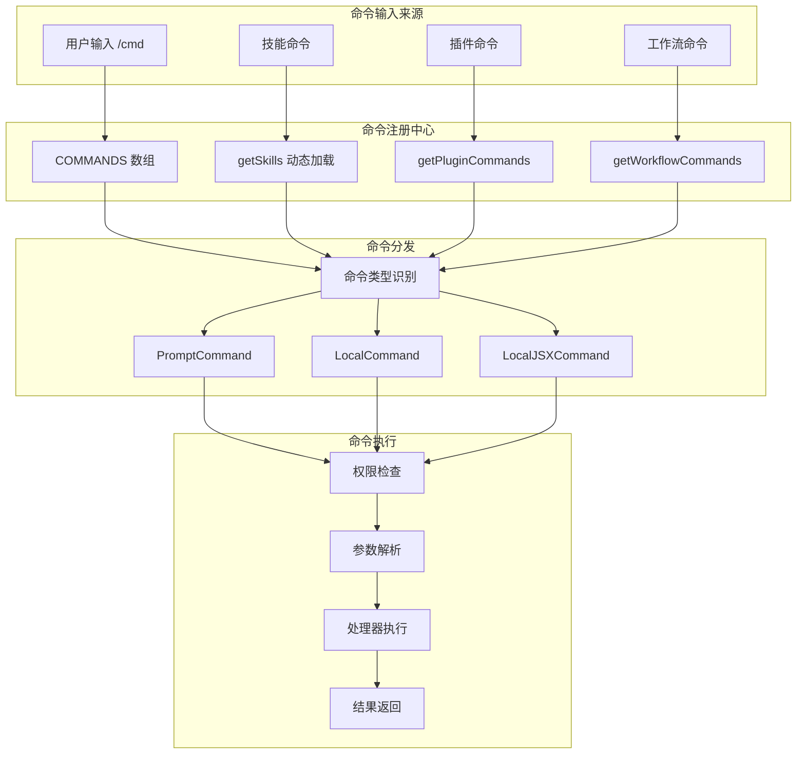
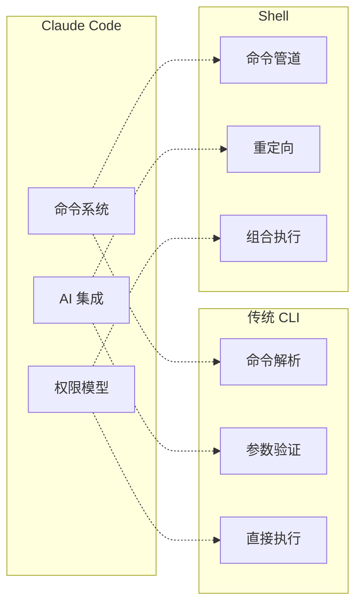
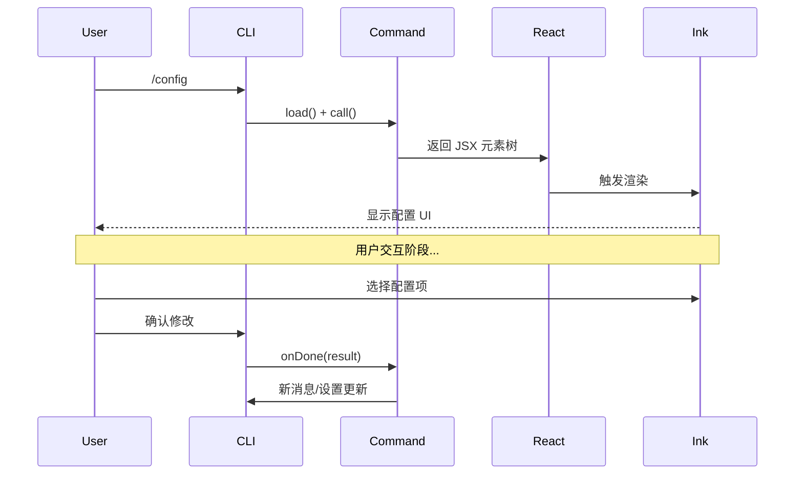
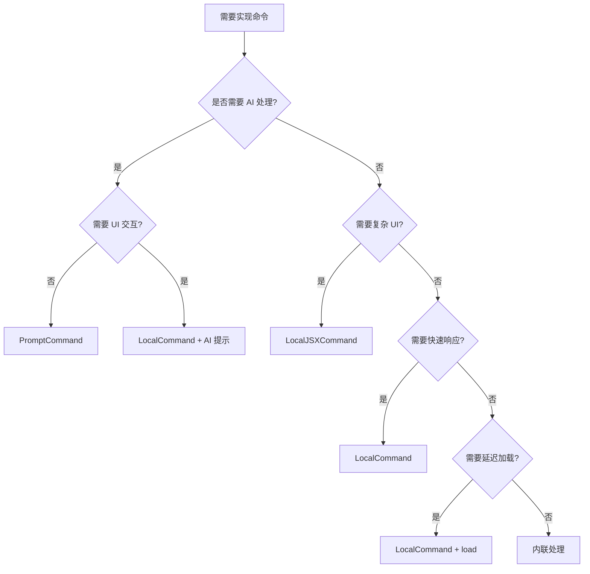
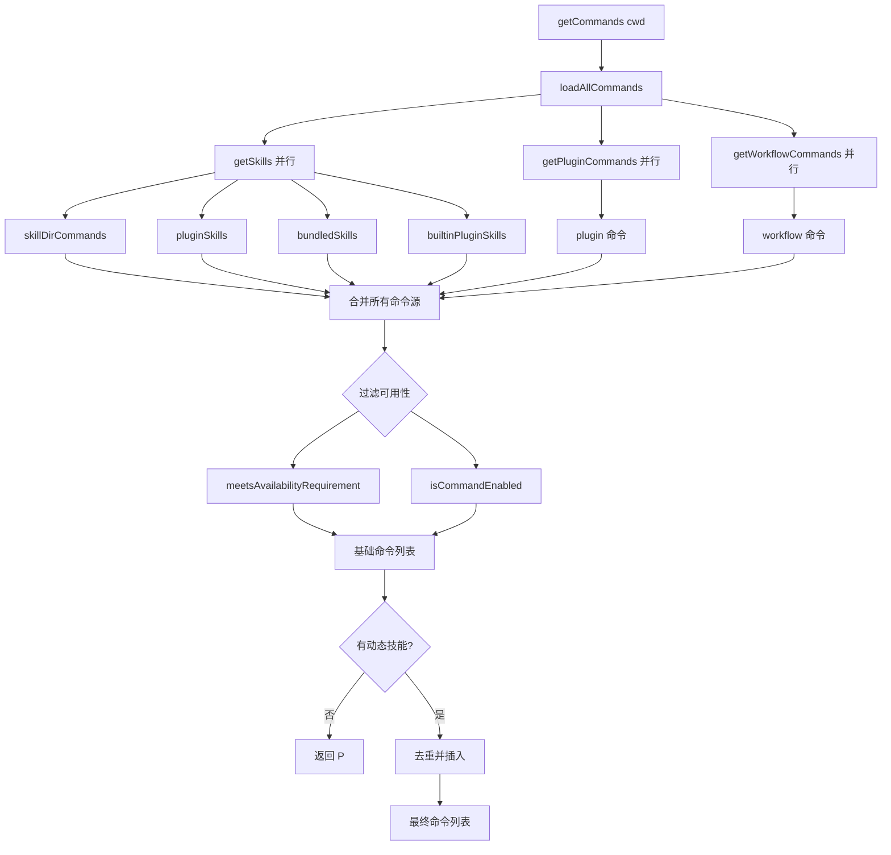
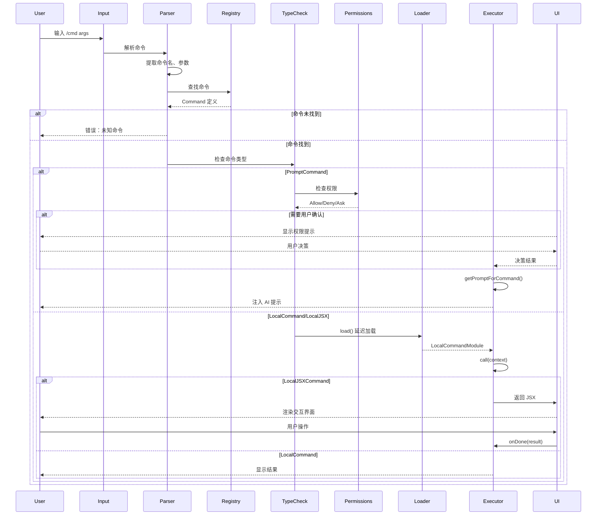
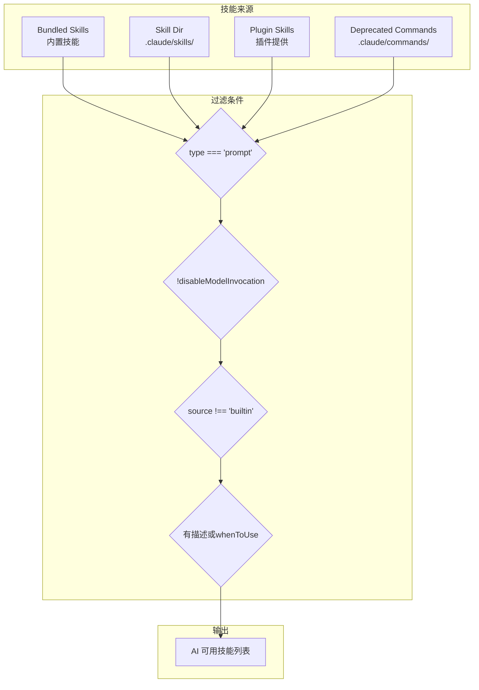
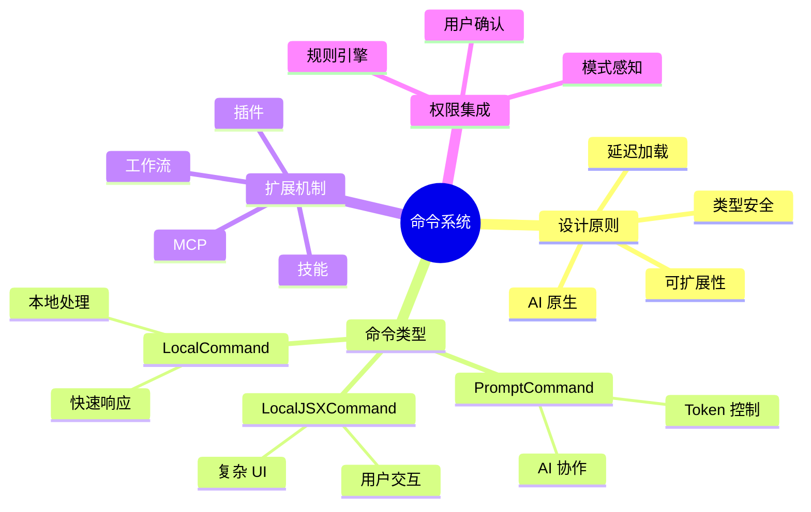

# 第 17 章：命令系统架构

> 本章目标：深入理解 Claude Code 斜杠命令系统的设计理念、类型系统、执行流程和扩展机制。

## 17.1 命令系统设计理念

### 17.1.1 命令系统的定位

Claude Code 的命令系统是一个多层次、可扩展的架构，设计目标包括：

1. **统一的用户入口**：所有用户操作通过 `/command` 语法触发
2. **类型安全**：TypeScript 类型系统确保命令正确性
3. **延迟加载**：非关键命令按需加载，优化启动性能
4. **可扩展性**：支持插件、技能、工作流等扩展来源



### 17.1.2 设计权衡

**命令类型三分法：**

| 类型 | 用途 | 优势 | 劣势 | 适用场景 |
|------|------|------|------|----------|
| PromptCommand | 注入 AI 提示 | 复用 AI 能力 | 无 UI 反馈 | 复杂查询、生成 |
| LocalCommand | 本地处理 UI | 快速响应 | 不与 AI 交互 | 配置、列表、状态 |
| LocalJSXCommand | 渲染复杂 UI | 灵活布局 | 需要渲染开销 | 复杂表单、编辑器 |

**作者观点：** 这种三分法是实用主义的产物。早期版本可能只有一种命令类型，但随着需求演化：
- AI 生成内容需要 PromptCommand
- 快速配置查看需要 LocalCommand
- 复杂交互界面需要 LocalJSXCommand

但三种类型也带来了复杂度：用户需要理解不同命令的交互模式差异。

### 17.1.3 与其他 CLI 框架对比



| 特性 | Claude Code | Git | npm | AWS CLI |
|------|-------------|-----|-----|---------|
| AI 集成 | 原生 | 无 | 无 | 无（计划中） |
| 权限控制 | 细粒度规则 | 无 | 无 | IAM 集成 |
| 命令来源 | 多源（插件/技能） | 固定 | 固定 | 插件 |
| UI 反馈 | 终端/IDE | 纯文本 | 纯文本 | 表格/JSON |
| 扩展性 | 极高 | 低（钩子） | 中（脚本） | 高 |

## 17.2 命令类型系统深度解析

### 17.2.1 PromptCommand：AI 协作型命令

```typescript
// src/types/command.ts
export type PromptCommand = {
  type: 'prompt'

  // 标识信息
  name: string
  description: string
  aliases?: string[]

  // 权限和可用性
  availability?: CommandAvailability[]
  isEnabled?: () => boolean
  isHidden?: boolean

  // UI 提示
  argumentHint?: string
  whenToUse?: string
  version?: string

  // 执行上下文
  progressMessage: string
  contentLength: number

  // 参数系统
  argNames?: string[]
  allowedTools?: string[]

  // AI 控制
  model?: string
  disableModelInvocation?: boolean

  // 源标识
  source: SettingSource | 'builtin' | 'mcp' | 'plugin' | 'bundled'
  pluginInfo?: {
    pluginManifest: PluginManifest
    repository: string
  }

  // 执行模式
  context?: 'inline' | 'fork'
  agent?: string
  effort?: EffortValue

  // 文件触发
  paths?: string[]

  // Hooks
  hooks?: HooksSettings
  skillRoot?: string

  // 权限
  isSensitive?: boolean

  // 核心方法
  getPromptForCommand(
    args: string,
    context: ToolUseContext,
  ): Promise<ContentBlockParam[]>
}
```

**设计意图分析：**

1. **contentLength**：预先计算内容长度用于 Token 估算，避免超限
2. **context: 'fork'**：允许技能在独立子 Agent 中运行，隔离 Token 预算
3. **paths**：文件触发技能，只在修改特定文件后可见
4. **disableModelInvocation**：阻止 AI 直接调用，仅用户可触发

### 17.2.2 LocalCommand：本地处理型命令

```typescript
export type LocalCommand = {
  type: 'local'

  // 标识
  name: string
  description: string
  aliases?: string[]

  // 能力
  supportsNonInteractive: boolean

  // 延迟加载
  load: () => Promise<LocalCommandModule>
}

export type LocalCommandModule = {
  call: LocalCommandCall
}

export type LocalCommandCall = (
  args: string,
  context: LocalJSXCommandContext,
) => Promise<LocalCommandResult>

export type LocalCommandResult =
  | { type: 'text'; value: string }
  | {
      type: 'compact'
      compactionResult: CompactionResult
      displayText?: string
    }
  | { type: 'skip' }
```

**作者观点：** LocalCommand 的设计很精妙：
- `supportsNonInteractive`：允许命令在非交互模式下运行（CI/CD）
- `load` 延迟加载：启动时不加载，执行时才加载，减少内存占用
- 三种返回类型：text（显示）、compact（会话压缩）、skip（静默）

### 17.2.3 LocalJSXCommand：UI 渲染型命令

```typescript
export type LocalJSXCommand = {
  type: 'local-jsx'

  // 标识
  name: string
  description: string
  aliases?: string[]

  // 延迟加载
  load: () => Promise<LocalJSXCommandModule>

  // UI 控制
  isSensitive?: boolean
}

export type LocalJSXCommandModule = {
  call: LocalJSXCommandCall
}

export type LocalJSXCommandCall = (
  onDone: LocalJSXCommandOnDone,
  context: ToolUseContext & LocalJSXCommandContext,
  args: string,
) => Promise<React.ReactNode>

export type LocalJSXCommandOnDone = (
  result?: string,
  options?: {
    display?: CommandResultDisplay
    shouldQuery?: boolean
    metaMessages?: string[]
    nextInput?: string
    submitNextInput?: boolean
  },
) => void
```

**设计意图分析：**



LocalJSXCommand 的特点是：
1. **完全的 UI 控制**：返回 JSX 元素，由 Ink 渲染
2. **异步完成模式**：通过 `onDone` 回调通知完成
3. **元消息支持**：可以注入 AI 可见但用户隐藏的消息

### 17.2.4 命令类型决策树



## 17.3 命令注册机制

### 17.3.1 命令注册表架构

```typescript
// src/commands.ts

// 内置命令列表（被外部构建排除）
export const INTERNAL_ONLY_COMMANDS = [
  backfillSessions,
  breakCache,
  bughunter,
  commit,
  commitPushPr,
  ctx_viz,
  // ... 更多内部命令
].filter(Boolean)

// 主命令注册表（memoized 延迟计算）
const COMMANDS = memoize((): Command[] => [
  addDir,
  advisor,
  agents,
  branch,
  btw,
  chrome,
  clear,
  color,
  compact,
  config,
  copy,
  desktop,
  context,
  contextNonInteractive,
  cost,
  diff,
  doctor,
  effort,
  exit,
  fast,
  files,
  // ... 80+ 内置命令
  ...(webCmd ? [webCmd] : []),
  ...(forkCmd ? [forkCmd] : []),
  ...(buddy ? [buddy] : []),
  // ... 更多条件命令
  ...(process.env.USER_TYPE === 'ant' && !process.env.IS_DEMO
    ? INTERNAL_ONLY_COMMANDS
    : []),
])
```

**设计意图：**
1. **memoize**：命令列表只计算一次，后续访问直接返回缓存
2. **条件编译**：通过 `...()` 展开实现特性门控
3. **环境检测**：`USER_TYPE === 'ant'` 暴露内部命令

### 17.3.2 命令发现流程



### 17.3.3 可用性过滤

```typescript
/**
 * 命令可用性要求
 */
export type CommandAvailability =
  | 'claude-ai'    // claude.ai OAuth 订阅用户
  | 'console'      // Console API 密钥用户

/**
 * 检查命令是否对当前用户可用
 */
export function meetsAvailabilityRequirement(cmd: Command): boolean {
  if (!cmd.availability) return true

  for (const a of cmd.availability) {
    switch (a) {
      case 'claude-ai':
        if (isClaudeAISubscriber()) return true
        break
      case 'console':
        if (
          !isClaudeAISubscriber() &&
          !isUsing3PServices() &&
          isFirstPartyAnthropicBaseUrl()
        )
          return true
        break
    }
  }

  return false
}
```

**作者观点：** 这种可用性系统很清晰，但有两个潜在问题：
1. **硬编码**：添加新的用户类型需要修改代码
2. **复合条件**：`console` 的条件组合（非 claude-ai + 非 3P + 第一方 URL）可能需要文档说明

### 17.3.4 动态技能系统

```typescript
/**
 * 获取动态发现的技能
 */
function getDynamicSkills(): Command[] {
  // 运行时发现的技能（如从文件操作触发）
  const discovered: Command[] = []

  // 1. 从 .claude/skills/ 目录
  // 2. 从插件动态注册
  // 3. 从 MCP 服务器

  return discovered
}

/**
 * 插入动态技能到正确位置
 */
export async function getCommands(cwd: string): Promise<Command[]> {
  const baseCommands = allCommands.filter(/* ... */)

  if (dynamicSkills.length === 0) {
    return baseCommands
  }

  // 去重动态技能
  const baseCommandNames = new Set(baseCommands.map(c => c.name))
  const uniqueDynamicSkills = dynamicSkills.filter(
    s => !baseCommandNames.has(s.name)
  )

  // 在插件命令后、内置命令前插入
  const builtInNames = new Set(COMMANDS().map(c => c.name))
  const insertIndex = baseCommands.findIndex(c => builtInNames.has(c.name))

  if (insertIndex === -1) {
    return [...baseCommands, ...uniqueDynamicSkills]
  }

  return [
    ...baseCommands.slice(0, insertIndex),
    ...uniqueDynamicSkills,
    ...baseCommands.slice(insertIndex),
  ]
}
```

**设计意图：** 动态技能按"优先级"插入：
1. 技能目录命令（最高优先级）
2. 插件技能
3. 内置技能
4. **动态技能**（在此插入）
5. 内置命令

## 17.4 命令执行流程

### 17.4.1 完整执行时序图



### 17.4.2 命令参数解析

```typescript
/**
 * 命令参数解析器
 */
export class CommandParser {
  parse(input: string): ParsedCommand | null {
    // 检查是否是斜杠命令
    if (!input.startsWith('/')) {
      return null
    }

    const parts = input.slice(1).trim().split(/\s+/)
    const name = parts[0]
    const argsString = parts.slice(1).join(' ')

    // 解析参数选项
    const options = this.parseOptions(parts.slice(1))

    return {
      name,
      args: options.positional,
      flags: options.named,
      rawArgs: argsString,
    }
  }

  private parseOptions(args: string[]): {
    positional: string[]
    named: Map<string, string | boolean>
  } {
    const positional: string[] = []
    const named = new Map<string, string | boolean>()

    for (const arg of args) {
      if (arg.startsWith('--')) {
        // --flag=value 或 --flag
        const [key, value] = arg.slice(2).split('=')
        named.set(key, value ?? true)
      } else if (arg.startsWith('-')) {
        // -f 或 -f=value
        const [key, value] = arg.slice(1).split('=')
        named.set(key, value ?? true)
      } else {
        positional.push(arg)
      }
    }

    return { positional, named }
  }

  /**
   * 验证参数
   */
  validate(
    command: Command,
    parsed: ParsedCommand,
  ): ValidationResult {
    // 检查参数数量
    if (command.argNames) {
      if (parsed.args.length < command.argNames.length) {
        return {
          valid: false,
          error: `Expected ${command.argNames.length} args, got ${parsed.args.length}`,
        }
      }
    }

    // 检查未知选项
    const allowedFlags = new Set(command.allowedFlags ?? [])
    for (const [flag] of parsed.flags) {
      if (!allowedFlags.has(flag)) {
        return {
          valid: false,
          error: `Unknown flag: --${flag}`,
        }
      }
    }

    return { valid: true }
  }
}
```

### 17.4.3 权限检查集成

```typescript
/**
 * 命令权限检查
 */
async function checkCommandPermissions(
  command: Command,
  context: CommandContext,
): Promise<PermissionResult> {
  // 1. 命令特定的权限检查
  if (command.checkPermissions) {
    const result = command.checkPermissions(context)
    if (result.behavior !== 'allow') {
      return result
    }
  }

  // 2. 基于命令模式的检查
  const mode = context.toolPermissionContext.mode

  // 计划模式下阻止的命令
  if (mode === 'plan') {
    const PLAN_BLOCKED_COMMANDS = new Set([
      'commit',
      'push',
      'edit',
      'write',
      'delete',
      'reset',
      'rebase',
    ])

    if (PLAN_BLOCKED_COMMANDS.has(command.name)) {
      return {
        behavior: 'block',
        message: `Command "/${command.name}" is not available in plan mode`,
      }
    }
  }

  // 3. 工具权限规则（命令也是一种工具）
  const rule = matchingRuleForInput(
    context.toolPermissionContext,
    'command',
    { commandName: command.name },
  )

  if (rule?.behavior === 'deny') {
    return {
      behavior: 'block',
      message: `Command "/${command.name}" is blocked`,
    }
  }

  if (rule?.behavior === 'ask') {
    return {
      behavior: 'ask',
      message: `Allow command "/${command.name}"?`,
    }
  }

  return { behavior: 'allow' }
}
```

## 17.5 技能系统与命令的融合

### 17.5.1 技能作为特殊命令

```typescript
/**
 * 技能工具命令过滤
 */
export const getSkillToolCommands = memoize(
  async (cwd: string): Promise<Command[]> => {
    const allCommands = await getCommands(cwd)
    return allCommands.filter(
      cmd =>
        cmd.type === 'prompt' &&
        !cmd.disableModelInvocation &&
        cmd.source !== 'builtin' &&
        // 技能必须有描述或使用场景
        (cmd.loadedFrom === 'bundled' ||
          cmd.loadedFrom === 'skills' ||
          cmd.loadedFrom === 'commands_DEPRECATED' ||
          cmd.hasUserSpecifiedDescription ||
          cmd.whenToUse),
    )
  },
)
```

**设计意图：** 技能在系统中有双重身份：
1. 作为命令：用户可以通过 `/skill-name` 调用
2. 作为工具：AI 可以通过工具调用使用

这种双重性实现了"用户可教 AI 新能力"的愿景。

### 17.5.2 技能加载优先级



### 17.5.3 技能上下文

```typescript
/**
 * 技能执行上下文
 */
export type SkillContext = ToolUseContext & {
  // 技能根目录
  skillRoot?: string

  // 技能专用环境变量
  env?: Record<string, string>

  // 技能钩子
  hooks?: HooksSettings
}

/**
 * 技能执行模式
 */
export type SkillExecutionMode =
  | 'inline'   // 在当前对话中扩展提示
  | 'fork'     // 在子 Agent 中独立运行

/**
 * Fork 模式执行
 */
async function executeSkillAsFork(
  skill: PromptCommand,
  args: string,
  context: SkillContext,
): Promise<CommandResult> {
  // 创建子 Agent
  const agent = skill.agent ?? 'general-purpose'

  // 独立的 Token 预算
  const forkResult = await forkAgent({
    agent,
    prompt: await skill.getPromptForCommand(args, context),
    context,
  })

  return {
    type: 'text',
    value: forkResult.output,
    metadata: {
      forkId: forkResult.id,
      agent,
      tokensUsed: forkResult.tokens,
    },
  }
}
```

**作者观点：** Fork 模式是高级特性，解决了技能可能消耗大量 Token 的问题。但这增加了复杂度：
- 用户需要理解"内联 vs 分叉"的区别
- Fork 模式下的上下文共享需要仔细设计
- Token 计费模式更复杂

## 17.6 命令发现与帮助系统

### 17.6.1 命令自动补全

```typescript
/**
 * 命令自动补全
 */
export function completeCommand(
  input: string,
  availableCommands: Command[],
): CompletionResult {
  const prefix = input.toLowerCase().replace(/^\/+/, '')

  // 1. 精确前缀匹配
  const exactMatches = availableCommands
    .filter(cmd =>
      cmd.name.toLowerCase().startsWith(prefix) ||
      cmd.aliases?.some(a => a.toLowerCase().startsWith(prefix))
    )
    .map(cmd => ({
      name: cmd.name,
      aliases: cmd.aliases,
      description: cmd.description,
      type: 'exact',
    }))

  // 2. 模糊匹配
  const fuse = new Fuse(availableCommands, {
    keys: ['name', 'description', 'aliases'],
    includeScore: true,
    threshold: 0.3,
  })

  const fuzzyMatches = fuse.search(prefix).map(result => ({
    name: result.item.name,
    aliases: result.item.aliases,
    description: result.item.description,
    score: result.score,
    type: 'fuzzy',
  }))

  return {
    exact: exactMatches,
    fuzzy: fuzzyMatches.slice(0, 5),
  }
}
```

### 17.6.2 帮助文本生成

```typescript
/**
 * 生成命令帮助文本
 */
export function generateHelpText(
  command: Command,
  options?: {
    includeExamples?: boolean
    includeAliases?: boolean
    includeRelated?: boolean
  },
): string {
  const lines: string[] = []

  // 标题
  lines.push(`## /${command.name}`)
  lines.push('')

  // 描述
  lines.push(`**${command.description}**`)
  lines.push('')

  // 别名
  if (options?.includeAliases && command.aliases) {
    lines.push(`**Aliases:** ${command.aliases.join(', ')}`)
    lines.push('')
  }

  // 参数提示
  if (command.argumentHint) {
    lines.push(`**Usage:** /${command.name} ${command.argumentHint}`)
    lines.push('')
  }

  // 使用场景
  if (command.whenToUse) {
    lines.push('**When to use:**')
    lines.push(command.whenToUse)
    lines.push('')
  }

  // 允许的工具（PromptCommand）
  if (command.type === 'prompt' && command.allowedTools) {
    lines.push(`**Allowed tools:** ${command.allowedTools.join(', ')}`)
    lines.push('')
  }

  // 示例
  if (options?.includeExamples && command.examples) {
    lines.push('**Examples:**')
    for (const example of command.examples) {
      lines.push('```')
      lines.push(`/${command.name} ${example}`)
      lines.push('```')
    }
    lines.push('')
  }

  // 相关命令
  if (options?.includeRelated && command.relatedCommands) {
    lines.push(`**Related:** ${command.relatedCommands.map(c => `/${c}`).join(', ')}`)
    lines.push('')
  }

  return lines.join('\n')
}
```

### 17.6.3 FuzzyPicker 集成

```typescript
/**
 * 命令选择器组件
 */
export function CommandPicker(): React.ReactNode {
  const [query, setQuery] = useState('')
  const commands = useAppState(s => Object.values(s.availableCommands))

  const filteredCommands = useMemo(() => {
    if (!query) return commands.slice(0, 20)

    const fuse = new Fuse(commands, {
      keys: ['name', 'description'],
      threshold: 0.3,
    })

    return fuse.search(query).map(r => r.item)
  }, [commands, query])

  return (
    <FuzzyPicker
      title="Select a command"
      placeholder="Search commands..."
      items={filteredCommands}
      getKey={cmd => cmd.name}
      renderItem={(cmd, focused) => (
        <Box flexDirection="column">
          <Text color={focused ? 'claude' : 'text'}>
            /{cmd.name}
          </Text>
          <Text dimColor>{cmd.description}</Text>
        </Box>
      )}
      onQueryChange={setQuery}
      onSelect={cmd => {
        executeCommand(cmd.name)
      }}
      matchLabel={`${filteredCommands.length} commands`}
    />
  )
}
```

## 17.7 典型命令实现分析

### 17.7.1 /commit 命令

```typescript
// src/commands/commit/index.ts (概念性实现)

export const commitCommand: PromptCommand = {
  type: 'prompt',
  name: 'commit',
  description: 'Create a Git commit with an AI-generated message',
  aliases: ['cm'],

  argumentHint: '[files...]',
  whenToUse: 'When you want to commit changes with a descriptive message',

  progressMessage: 'Generating commit message...',
  contentLength: 500, // 估算 Token 数

  argNames: ['files'],
  allowedTools: ['Bash', 'FileRead'],

  async getPromptForCommand(args, context) {
    // 1. 获取 Git 状态
    const status = await context.tools.Bash.call({
      command: 'git status --porcelain',
      cwd: context.cwd,
    })

    // 2. 获取 Diff
    const diff = await context.tools.Bash.call({
      command: 'git diff --cached',
      cwd: context.cwd,
    })

    // 3. 生成提示
    return [
      {
        type: 'text',
        text: `Generate a Git commit message for these changes:\n\n${diff}`,
      },
    ]
  },

  isEnabled: () => isGitAvailable(),
}
```

**设计意图：**
1. **工具限制**：只允许 Bash 和 FileRead，防止 AI 执行意外操作
2. **Git 检测**：`isEnabled` 确保只在 Git 仓库中可用
3. **进度消息**：用户看到 "Generating..." 而不是空白

### 17.7.2 /config 命令

```typescript
// src/commands/config/index.ts (概念性实现)

export const configCommand: LocalJSXCommand = {
  type: 'local-jsx',
  name: 'config',
  description: 'Manage Claude Code settings',
  aliases: ['cfg', 'settings'],

  load: async () => ({
    call: async (onDone, context, args) => {
      // 解析参数
      const [key, ...valueParts] = args.split(' ')
      const value = valueParts.join(' ')

      // 如果有参数，直接设置
      if (key) {
        const success = setConfig(key, value)
        onDone(undefined, {
          display: 'system',
          shouldQuery: false,
        })
        return <Text>Config updated: {key} = {value}</Text>
      }

      // 否则显示配置 UI
      return <ConfigEditor onDone={onDone} context={context} />
    },
  }),
}

function ConfigEditor({ onDone, context }: {
  onDone: LocalJSXCommandOnDone
  context: LocalJSXCommandContext
}) {
  const settings = useAppState(s => s.settings)
  const [selectedKey, setSelectedKey] = useState<string | null>(null)

  if (selectedKey) {
    return (
      <ConfigKeyEditor
        key={selectedKey}
        value={settings[selectedKey]}
        onSave={newValue => {
          context.setAppState(prev => ({
            ...prev,
            settings: { ...prev.settings, [selectedKey]: newValue },
          }))
          setSelectedKey(null)
          onDone(`Updated ${selectedKey}`)
        }}
        onCancel={() => setSelectedKey(null)}
      />
    )
  }

  return (
    <ConfigList
      settings={settings}
      onSelectKey={setSelectedKey}
    />
  )
}
```

### 17.7.3 /agents 命令

```typescript
// src/commands/agents/index.ts (概念性实现)

export const agentsCommand: PromptCommand = {
  type: 'prompt',
  name: 'agents',
  description: 'List and manage background agents',

  argumentHint: '[list|kill|create]',

  async getPromptForCommand(args, context) {
    const subCommand = args.split(' ')[0] || 'list'

    switch (subCommand) {
      case 'list':
        return await listAgentsPrompt(context)
      case 'kill':
        return await killAgentPrompt(context, args)
      case 'create':
        return await createAgentPrompt(context, args)
      default:
        return await listAgentsPrompt(context)
    }
  },

  isEnabled: () => true,
}

async function listAgentsPrompt(context: ToolUseContext) {
  const tasks = Object.values(context.appState.tasks)
  const agents = tasks.filter(t => t.type === 'agent')

  if (agents.length === 0) {
    return [{
      type: 'text',
      text: 'No background agents are currently running.',
    }]
  }

  const agentList = agents
    .map(a => {
      const status = a.status === 'running' ? '🟢' : '⏸️'
      return `${status} ${a.name} (${a.id.slice(0, 8)}): ${a.description || 'No description'}`
    })
    .join('\n')

  return [{
    type: 'text',
    text: `Running agents:\n\n${agentList}`,
  }]
}
```

## 17.8 命令扩展与插件集成

### 17.8.1 插件命令注册

```typescript
// src/plugins/pluginCommands.ts (概念性实现)

/**
 * 从插件加载命令
 */
export async function getPluginCommands(): Promise<Command[]> {
  const plugins = getEnabledPlugins()
  const commands: Command[] = []

  for (const plugin of plugins) {
    // 1. 从 manifest 读取命令
    if (plugin.manifest.commands) {
      for (const cmdDef of plugin.manifest.commands) {
        commands.push({
          type: cmdDef.type || 'prompt',
          name: cmdDef.name,
          description: cmdDef.description,
          source: 'plugin',
          pluginInfo: {
            pluginManifest: plugin.manifest,
            repository: plugin.repository,
          },
          async getPromptForCommand(args, context) {
            // 调用插件的命令处理器
            return await plugin.executeCommand(cmdDef.name, args, context)
          },
        } as PromptCommand)
      }
    }

    // 2. 从技能目录加载
    const skillCommands = await loadPluginSkills(plugin)
    commands.push(...skillCommands)
  }

  return commands
}
```

### 17.8.2 MCP 命令集成

```typescript
// src/services/mcp/mcpCommands.ts (概念性实现)

/**
 * 从 MCP 服务器加载命令
 */
export async function getMcpCommands(
  mcpClients: MCPServerConnection[],
): Promise<Command[]> {
  const commands: Command[] = []

  for (const client of mcpClients) {
    // MCP 服务器可以通过 prompts 资源暴露命令
    try {
      const prompts = await client.listPrompts()

      for (const prompt of prompts) {
        commands.push({
          type: 'prompt',
          name: prompt.name,
          description: prompt.description || `MCP prompt: ${prompt.name}`,
          source: 'mcp',
          loadedFrom: 'mcp',

          async getPromptForCommand(args, context) {
            // 获取 MCP prompt 内容
            const result = await client.getPrompt({
              name: prompt.name,
              arguments: parseArgs(args),
            })

            return [{
              type: 'text',
              text: result.messages.map(m => m.content).join('\n'),
            }]
          },
        } as PromptCommand)
      }
    } catch (error) {
      // 服务器不支持 prompts，跳过
      continue
    }
  }

  return commands
}
```

### 17.8.3 工作流命令

```typescript
// src/tools/WorkflowTool/createWorkflowCommand.ts (概念性实现)

/**
 * 从工作流文件创建命令
 */
export async function getWorkflowCommands(
  cwd: string,
): Promise<Command[]> {
  const workflowFiles = await glob('*.workflow.{ts,js}', {
    cwd: path.join(cwd, '.claude', 'workflows'),
  })

  const commands: Command[] = []

  for (const file of workflowFiles) {
    const workflow = await import(file)

    commands.push({
      type: 'prompt',
      name: workflow.name,
      description: workflow.description,
      kind: 'workflow',
      source: 'managed',

      async getPromptForCommand(args, context) {
        // 执行工作流
        const result = await workflow.execute(args, context)

        return [{
          type: 'text',
          text: result.message,
        }]
      },
    } as PromptCommand)
  }

  return commands
}
```

## 17.9 作者评价与设计反思

### 17.9.1 优势

1. **类型安全**：TypeScript 类型系统确保命令定义正确
2. **延迟加载**：`load()` 函数优化启动性能
3. **可扩展性**：插件、技能、工作流多源扩展
4. **权限集成**：统一的权限检查机制
5. **AI 原生**：PromptCommand 直接利用 AI 能力

### 17.9.2 改进空间

1. **命令类型复杂性**
   - 三种命令类型增加学习曲线
   - 建议考虑更统一的抽象

2. **错误处理**
   - 当前错误消息可能不够友好
   - 建议增加错误恢复建议

3. **文档生成**
   - `whenToUse` 字段依赖手动维护
   - 建议从示例自动生成

4. **测试覆盖**
   - 命令系统测试可能不足
   - 建议增加集成测试

### 17.9.3 设计理念总结



## 17.10 可复用模式总结

### 模式 38：命令注册表模式

**描述：** 统一的命令注册和发现模式。

**适用场景：**
- CLI 工具的斜杠命令系统
- 需要扩展命令的应用
- 插件式命令架构

**代码模板：**

```typescript
// 1. 命令接口
interface Command<T = any> {
  name: string
  description: string
  type: 'prompt' | 'local' | 'jsx'
  handler?: CommandHandler<T>
  load?: () => Promise<CommandModule<T>>
  isEnabled?: () => boolean
  aliases?: string[]
}

// 2. 命令注册表
class CommandRegistry {
  private commands = new Map<string, Command>()
  private lazyLoaders = new Map<string, () => Promise<Command>>()

  register(command: Command): void {
    // 注册主命令名
    this.commands.set(command.name, command)

    // 注册别名
    for (const alias of command.aliases || []) {
      this.commands.set(alias, {
        ...command,
        isAlias: true,
        originalName: command.name,
      })
    }
  }

  registerLazy(
    name: string,
    loader: () => Promise<Command>,
  ): void {
    this.lazyLoaders.set(name, loader)
  }

  async get(name: string): Promise<Command | undefined> {
    // 检查已注册命令
    const command = this.commands.get(name)
    if (command) {
      // 如果有 load() 方法，延迟加载
      if ('load' in command && command.load) {
        const module = await command.load()
        return { ...command, ...module }
      }
      return command
    }

    // 检查延迟加载器
    const loader = this.lazyLoaders.get(name)
    if (loader) {
      const loaded = await loader()
      this.register(loaded)
      this.lazyLoaders.delete(name)
      return loaded
    }

    return undefined
  }

  list(filter?: (cmd: Command) => boolean): Command[] {
    const all = Array.from(this.commands.values()).filter(cmd => !cmd.isAlias)
    return filter ? all.filter(filter) : all
  }

  complete(prefix: string): string[] {
    return Array.from(this.commands.keys())
      .filter(name => name.startsWith(prefix))
      .sort()
  }
}

// 3. 使用
const registry = new CommandRegistry()

// 直接注册
registry.register({
  name: 'deploy',
  description: 'Deploy application',
  type: 'local',
  aliases: ['dep'],
  handler: async (args) => {
    return { type: 'text', value: 'Deployed!' }
  },
})

// 延迟注册
registry.registerLazy('heavy', async () => {
  const { HeavyCommand } = await import('./heavy-command.js')
  return HeavyCommand
})

// 使用
const deployCmd = await registry.get('deploy')
const allCmds = registry.list()
const completions = registry.complete('de')
```

**关键点：**
1. 别名支持
2. 延迟加载
3. 类型安全
4. 自动补全

### 模式 39：命令类型分发器

**描述：** 根据命令类型分发到不同的处理器。

**适用场景：**
- 多种命令类型
- 不同的执行上下文
- 灵活的返回类型

**代码模板：**

```typescript
type Command =
  | { type: 'prompt'; getPrompt: (args) => Promise<string> }
  | { type: 'local'; handler: (args) => Promise<LocalResult> }
  | { type: 'jsx'; render: (args) => Promise<ReactNode> }

type CommandContext = {
  cwd: string
  env: Record<string, string>
  permissions: PermissionChecker
}

async function dispatchCommand(
  command: Command,
  args: string,
  context: CommandContext,
): Promise<CommandResult> {
  // 1. 权限检查（所有类型通用）
  const permission = await checkPermissions(command, context)
  if (!permission.allowed) {
    return { type: 'error', message: permission.reason }
  }

  // 2. 类型分发
  switch (command.type) {
    case 'prompt':
      return await dispatchPrompt(command, args, context)

    case 'local':
      return await dispatchLocal(command, args, context)

    case 'jsx':
      return await dispatchJSX(command, args, context)

    default:
      const _exhaustive: never = command
      throw new Error(`Unknown command type: ${_exhaustive}`)
  }
}

async function dispatchPrompt(
  command: Extract<Command, { type: 'prompt' }>,
  args: string,
  context: CommandContext,
): Promise<CommandResult> {
  const prompt = await command.getPrompt(args)

  return {
    type: 'prompt',
    prompt,
    context,
  }
}

async function dispatchLocal(
  command: Extract<Command, { type: 'local' }>,
  args: string,
  context: CommandContext,
): Promise<CommandResult> {
  const result = await command.handler(args, context)

  return {
    type: 'local',
    result,
  }
}

async function dispatchJSX(
  command: Extract<Command, { type: 'jsx' }>,
  args: string,
  context: CommandContext,
): Promise<CommandResult> {
  const element = await command.render(args, context)

  return {
    type: 'jsx',
    element,
  }
}
```

**关键点：**
1. 类型守卫
2. 类型提取器
3. 统一权限检查
4. never 类型穷尽性检查

## 本章小结

本章深入分析了 Claude Code 的命令系统架构：

1. **设计理念**：三分法命令类型、AI 原生集成、可扩展架构
2. **类型系统**：PromptCommand、LocalCommand、LocalJSXCommand 深度解析
3. **注册机制**：命令注册表、可用性过滤、动态技能系统
4. **执行流程**：完整的命令执行时序、参数解析、权限集成
5. **技能融合**：技能作为命令、双重身份、Fork 执行模式
6. **帮助系统**：自动补全、帮助生成、FuzzyPicker 集成
7. **扩展机制**：插件命令、MCP 命令、工作流命令
8. **作者评价**：优势分析、改进空间、设计反思

## 下一章预告

第 18 章将深入分析权限系统设计，包括权限模式、规则引擎、检查流程和 UI 集成。
