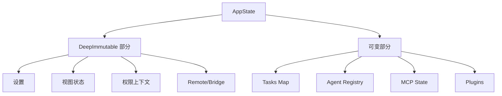

# 第 17 章：状态管理架构

> 本章目标：深入理解 Claude Code 的状态管理机制和设计模式。

## 17.1 AppState 设计

### 核心类型定义

```typescript
// src/state/AppState.tsx
export type AppState = DeepImmutable<{
  // === 设置 ===
  settings: SettingsJson
  verbose: boolean
  mainLoopModel: ModelSetting
  mainLoopModelForSession: ModelSetting
  statusLineText: string | undefined

  // === 视图状态 ===
  expandedView: 'none' | 'tasks' | 'teammates'
  isBriefOnly: boolean
  showTeammateMessagePreview?: boolean  // 条件编译
  selectedIPAgentIndex: number
  coordinatorTaskIndex: number
  viewSelectionMode: 'none' | 'selecting-agent' | 'viewing-agent'
  footerSelection: FooterItem | null

  // === 权限 ===
  toolPermissionContext: ToolPermissionContext

  // === Agent ===
  agent: string | undefined
  kairosEnabled: boolean

  // === Remote ===
  remoteSessionUrl: string | undefined
  remoteConnectionStatus: 'connecting' | 'connected' | 'reconnecting' | 'disabled'
  remoteBackgroundTaskCount: number

  // === Bridge ===
  replBridgeEnabled: boolean
  replBridgeExplicit: boolean
  replBridgeOutboundOnly: boolean
  replBridgeConnected: boolean
  replBridgeSessionActive: boolean
  replBridgeReconnecting: boolean
  replBridgeConnectUrl: string | undefined
  replBridgeSessionUrl: string | undefined
  replBridgeEnvironmentId: string | undefined
  replBridgeSessionId: string | undefined
  replBridgeError: string | undefined
  replBridgeInitialName: string | undefined
  showRemoteCallout: boolean
}> & {
  // === 可变状态（排除在 DeepImmutable 外）===
  tasks: { [taskId: string]: TaskState }
  agentNameRegistry: Map<string, AgentId>
  foregroundedTaskId?: string
  viewingAgentTaskId?: string
  companionReaction?: string
  companionPetAt?: number

  // === MCP ===
  mcp: {
    clients: MCPServerConnection[]
    tools: Tool[]
    commands: Command[]
    resources: Record<string, ServerResource[]>
    pluginReconnectKey: number
  }

  // === 插件 ===
  plugins: {
    enabled: LoadedPlugin[]
    disabled: LoadedPlugin[]
    commands: Command[]
    errors: PluginError[]
    installationStatus: {
      marketplaces: Array<{...}>
      plugins: Array<{...}>
    }
    needsRefresh: boolean
  }

  // === 其他功能 ===
  agentDefinitions: AgentDefinitionsResult
  fileHistory: FileHistoryState
  attribution: AttributionState
  todos: { [agentId: string]: TodoList }
  remoteAgentTaskSuggestions: { summary: string; task: string }[]
  notifications: {
    current: Notification | null
    queue: Notification[]
  }
  elicitation: {
    queue: ElicitationRequestEvent[]
  }
  thinkingEnabled: boolean | undefined
  promptSuggestionEnabled: boolean
  sessionHooks: SessionHooksState

  // === Tungsten (tmux 集成) ===
  tungstenActiveSession?: {...}
  tungstenLastCapturedTime?: number
  tungstenLastCommand?: {...}
  tungstenPanelVisible?: boolean
  tungstenPanelAutoHidden?: boolean

  // === WebBrowser (bagel) ===
  bagelActive?: boolean
  bagelUrl?: string
  bagelPanelVisible?: boolean

  // === Computer Use (chicago) ===
  computerUseMcpState?: {...}
}
```

### 状态分类



**设计意图：**
- `DeepImmutable` 包装不可变状态（设置、视图状态）
- 可变部分用于高频更新的状态（tasks、通知）

### Speculation State

```typescript
export type SpeculationState =
  | { status: 'idle' }
  | {
      status: 'active'
      id: string
      abort: () => void
      startTime: number
      messagesRef: { current: Message[] }
      writtenPathsRef: { current: Set<string> }
      boundary: CompletionBoundary | null
      suggestionLength: number
      toolUseCount: number
      isPipelined: boolean
      contextRef: { current: REPLHookContext }
      pipelinedSuggestion?: {
        text: string
        promptId: 'user_intent' | 'stated_intent'
        generationRequestId: string | null
      } | null
    }

export type CompletionBoundary =
  | { type: 'complete'; completedAt: number; outputTokens: number }
  | { type: 'bash'; command: string; completedAt: number }
  | { type: 'edit'; toolName: string; filePath: string; completedAt: number }
  | { type: 'denied_tool'; toolName: string; detail: string; completedAt: number }

export type SpeculationResult = {
  messages: Message[]
  boundary: CompletionBoundary | null
  timeSavedMs: number
}
```

## 17.2 状态存储

### AppStateStore 接口

```typescript
// src/state/AppStateStore.ts
export type AppStateStore = {
  getState(): AppState
  setState(updater: (prev: AppState) => AppState): void
  subscribe(listener: (state: AppState) => void): () => void
}
```

### Store 创建

```typescript
// src/state/store.ts
import { createStore } from './store.js'

export function createStore<T>(
  initialState: T,
  onChange?: (args: { newState: T; oldState: T }) => void
): { getState: () => T; setState: (updater: (prev: T) => T) => void; subscribe: (listener: (state: T) => void) => () => void } {
  let state = initialState;
  const listeners = new Set<(state: T) => void>();

  const getState = () => state;

  const setState = (updater: (prev: T) => T) => {
    const oldState = state;
    const newState = updater(oldState);

    if (newState === oldState) return;  // 引用相等性检查

    state = newState;

    // 通知监听器
    for (const listener of listeners) {
      listener(newState);
    }

    // 触发 onChange 回调
    if (onChange) {
      onChange({ newState, oldState });
    }
  };

  const subscribe = (listener: (state: T) => void) => {
    listeners.add(listener);
    return () => listeners.delete(listener);
  };

  return { getState, setState, subscribe };
}
```

### 默认状态

```typescript
// src/state/AppStateStore.ts
import { getInitialSettings } from '../utils/settings/settings.js';
import { getEmptyToolPermissionContext } from '../Tool.js';
import { shouldEnablePromptSuggestion } from '../services/PromptSuggestion/promptSuggestion.js';
import { shouldEnableThinkingByDefault } from '../utils/thinking.js';

export function getDefaultAppState(): AppState {
  return {
    // 设置
    settings: getInitialSettings(),
    verbose: false,
    mainLoopModel: null,
    mainLoopModelForSession: null,
    statusLineText: undefined,

    // 视图
    expandedView: 'none',
    isBriefOnly: false,
    selectedIPAgentIndex: 0,
    coordinatorTaskIndex: 0,
    viewSelectionMode: 'none',
    footerSelection: null,

    // 权限
    toolPermissionContext: getEmptyToolPermissionContext(),

    // Agent
    agent: undefined,
    kairosEnabled: false,

    // Remote
    remoteSessionUrl: undefined,
    remoteConnectionStatus: 'disabled',
    remoteBackgroundTaskCount: 0,

    // Bridge
    replBridgeEnabled: false,
    replBridgeExplicit: false,
    replBridgeOutboundOnly: false,
    replBridgeConnected: false,
    replBridgeSessionActive: false,
    replBridgeReconnecting: false,
    replBridgeConnectUrl: undefined,
    replBridgeSessionUrl: undefined,
    replBridgeEnvironmentId: undefined,
    replBridgeSessionId: undefined,
    replBridgeError: undefined,
    replBridgeInitialName: undefined,
    showRemoteCallout: false,

    // 可变状态
    tasks: {},
    agentNameRegistry: new Map(),
    foregroundedTaskId: undefined,
    viewingAgentTaskId: undefined,

    // MCP
    mcp: {
      clients: [],
      tools: [],
      commands: [],
      resources: {},
      pluginReconnectKey: 0,
    },

    // 插件
    plugins: {
      enabled: [],
      disabled: [],
      commands: [],
      errors: [],
      installationStatus: {
        marketplaces: [],
        plugins: [],
      },
      needsRefresh: false,
    },

    // 其他
    agentDefinitions: { agents: [], errors: [] },
    fileHistory: {},
    attribution: createEmptyAttributionState(),
    todos: {},
    remoteAgentTaskSuggestions: [],
    notifications: { current: null, queue: [] },
    elicitation: { queue: [] },
    thinkingEnabled: shouldEnableThinkingByDefault(),
    promptSuggestionEnabled: shouldEnablePromptSuggestion(),
    sessionHooks: { pre: [], post: [] },
    tungstenActiveSession: undefined,
    tungstenLastCapturedTime: undefined,
    tungstenLastCommand: undefined,
    tungstenPanelVisible: undefined,
    tungstenPanelAutoHidden: undefined,
    bagelActive: undefined,
    bagelUrl: undefined,
    bagelPanelVisible: undefined,
    computerUseMcpState: undefined,
  };
}
```

## 17.3 状态更新机制

### setAppState 模式

```typescript
// 核心更新模式
const setAppState = useSetAppState();

// 1. 简单值更新
setAppState(prev => ({
  ...prev,
  verbose: true,
}));

// 2. 条件更新
setAppState(prev => ({
  ...prev,
  expandedView: prev.expandedView === 'none' ? 'tasks' : 'none',
}));

// 3. 深度更新（可变部分）
setAppState(prev => ({
  ...prev,
  tasks: {
    ...prev.tasks,
    [taskId]: newTask,
  },
}));

// 4. Map 更新
setAppState(prev => ({
  ...prev,
  agentNameRegistry: new Map(prev.agentNameRegistry).set(name, agentId),
}));
```

### 批量更新

```typescript
// 多个属性同时更新（单个 setAppState 调用）
setAppState(prev => ({
  ...prev,
  verbose: true,
  expandedView: 'tasks',
  footerSelection: 'tasks',
}));

// 避免多次调用
// × 错误
setAppState(prev => ({ ...prev, verbose: true }));
setAppState(prev => ({ ...prev, expandedView: 'tasks' }));

// ✓ 正确
setAppState(prev => ({
  ...prev,
  verbose: true,
  expandedView: 'tasks',
}));
```

### 不可变更新模式

```typescript
// 数组更新
setAppState(prev => ({
  ...prev,
  mcp: {
    ...prev.mcp,
    clients: [...prev.mcp.clients, newClient],
  },
}));

// Map 更新
setAppState(prev => ({
  ...prev,
  tasks: {
    ...prev.tasks,
    [taskId]: { ...prev.tasks[taskId], status: 'running' },
  },
}));

// Set 更新（使用 Set 构造函数）
setAppState(prev => ({
  ...prev,
  computerUseMcpState: prev.computerUseMcpState
    ? {
        ...prev.computerUseMcpState,
        hiddenDuringTurn: new Set([
          ...prev.computerUseMcpState.hiddenDuringTurn || [],
          bundleId,
        ]),
      }
    : prev.computerUseMcpState,
}));
```

## 17.4 onChangeAppState Hook

### 变化响应

```typescript
// src/state/onChangeAppState.ts
export function onChangeAppState({
  newState,
  oldState,
}: {
  newState: AppState
  oldState: AppState
}) {
  // 1. 权限模式变化
  const prevMode = oldState.toolPermissionContext.mode
  const newMode = newState.toolPermissionContext.mode
  if (prevMode !== newMode) {
    const prevExternal = toExternalPermissionMode(prevMode)
    const newExternal = toExternalPermissionMode(newMode)
    if (prevExternal !== newExternal) {
      const isUltraplan =
        newExternal === 'plan' &&
        newState.isUltraplanMode &&
        !oldState.isUltraplanMode
          ? true
          : null
      notifySessionMetadataChanged({
        permission_mode: newExternal,
        is_ultraplan_mode: isUltraplan,
      })
    }
    notifyPermissionModeChanged(newMode)
  }

  // 2. mainLoopModel 变化
  if (newState.mainLoopModel !== oldState.mainLoopModel) {
    if (newState.mainLoopModel === null) {
      updateSettingsForSource('userSettings', { model: undefined })
      setMainLoopModelOverride(null)
    } else {
      updateSettingsForSource('userSettings', { model: newState.mainLoopModel })
      setMainLoopModelOverride(newState.mainLoopModel)
    }
  }

  // 3. expandedView 变化 → 持久化
  if (newState.expandedView !== oldState.expandedView) {
    const showExpandedTodos = newState.expandedView === 'tasks'
    const showSpinnerTree = newState.expandedView === 'teammates'
    saveGlobalConfig(current => ({
      ...current,
      showExpandedTodos,
      showSpinnerTree,
    }))
  }

  // 4. verbose 变化 → 持久化
  if (newState.verbose !== oldState.verbose) {
    saveGlobalConfig(current => ({ ...current, verbose: newState.verbose }))
  }

  // 5. settings 变化 → 清除缓存
  if (newState.settings !== oldState.settings) {
    clearApiKeyHelperCache()
    clearAwsCredentialsCache()
    clearGcpCredentialsCache()

    if (newState.settings.env !== oldState.settings.env) {
      applyConfigEnvironmentVariables()
    }
  }
}
```

**设计意图：** onChangeAppState 是单一的状态变化响应点，确保外部同步和持久化逻辑集中管理。

## 17.5 选择器模式

### 选择器定义

```typescript
// src/state/selectors.ts
/**
 * Get the currently viewed teammate task, if any.
 */
export function getViewedTeammateTask(
  appState: Pick<AppState, 'viewingAgentTaskId' | 'tasks'>,
): InProcessTeammateTaskState | undefined {
  const { viewingAgentTaskId, tasks } = appState

  if (!viewingAgentTaskId) {
    return undefined
  }

  const task = tasks[viewingAgentTaskId]
  if (!task) {
    return undefined
  }

  if (!isInProcessTeammateTask(task)) {
    return undefined
  }

  return task
}

/**
 * Determine where user input should be routed.
 */
export type ActiveAgentForInput =
  | { type: 'leader' }
  | { type: 'viewed'; task: InProcessTeammateTaskState }
  | { type: 'named_agent'; task: LocalAgentTaskState }

export function getActiveAgentForInput(
  appState: AppState,
): ActiveAgentForInput {
  const viewedTask = getViewedTeammateTask(appState)
  if (viewedTask) {
    return { type: 'viewed', task: viewedTask }
  }

  const { viewingAgentTaskId, tasks } = appState
  if (viewingAgentTaskId) {
    const task = tasks[viewingAgentTaskId]
    if (task?.type === 'local_agent') {
      return { type: 'named_agent', task }
    }
  }

  return { type: 'leader' }
}
```

### 使用选择器

```typescript
// 在组件中使用
export function MyComponent() {
  const activeAgent = useAppState(getActiveAgentForInput);

  if (activeAgent.type === 'leader') {
    return <Text>Leader active</Text>;
  }

  if (activeAgent.type === 'viewed') {
    return <Text>Viewing: {activeAgent.task.agentDefinition.name}</Text>;
  }

  if (activeAgent.type === 'named_agent') {
    return <Text>Named: {activeAgent.task.agentDefinition.name}</Text>;
  }
}
```

## 17.6 Context 集成

### AppStateProvider

```typescript
// src/state/AppState.tsx
const AppStoreContext = React.createContext<AppStateStore | null>(null);

export function AppStateProvider({
  children,
  initialState,
  onChangeAppState,
}: {
  children: ReactNode;
  initialState?: AppState;
  onChangeAppState?: (args: {
    newState: AppState;
    oldState: AppState;
  }) => void;
}): ReactNode {
  // 防止嵌套
  const hasAppStateContext = useContext(HasAppStateContext);
  if (hasAppStateContext) {
    throw new Error("AppStateProvider can not be nested within another AppStateProvider");
  }

  // 创建 store（只创建一次）
  const [store] = useState(() =>
    createStore(initialState ?? getDefaultAppState(), onChangeAppState)
  );

  // 监听外部设置变化
  const onSettingsChange = useEffectEvent((source: SettingSource) =>
    applySettingsChange(source, store.setState)
  );
  useSettingsChange(onSettingsChange);

  return (
    <HasAppStateContext.Provider value={true}>
      <AppStoreContext.Provider value={store}>
        <MailboxProvider>
          <VoiceProvider>
            {children}
          </VoiceProvider>
        </MailboxProvider>
      </AppStoreContext.Provider>
    </HasAppStateContext.Provider>
  );
}
```

### useAppState Hook

```typescript
/**
 * Subscribe to a slice of AppState. Only re-renders when the selected value
 * changes (compared via Object.is).
 */
export function useAppState<T>(selector: (state: AppState) => T): T {
  const store = useAppStore();

  const get = () => {
    const state = store.getState();
    const selected = selector(state);

    // 调试：检查是否返回了原始状态
    if (state === selected) {
      throw new Error(`Your selector returned the original state`);
    }

    return selected;
  };

  // useSyncExternalStore 订阅 store 变化
  return useSyncExternalStore(store.subscribe, get, get);
}

// 使用示例
export function StatusIndicator() {
  // 只在 verbose 变化时重新渲染
  const verbose = useAppState(s => s.verbose);

  return verbose
    ? <Text color="yellow">[VERBOSE]</Text>
    : null;
}
```

### useSetAppState Hook

```typescript
/**
 * Get the setAppState updater without subscribing to any state.
 * Returns a stable reference that never changes.
 */
export function useSetAppState(): (
  updater: (prev: AppState) => AppState
) => void {
  return useAppStore().setState;
}

// 使用示例
export function ToggleButton() {
  const setAppState = useSetAppState();

  const handleClick = () => {
    setAppState(prev => ({
      ...prev,
      verbose: !prev.verbose,
    }));
  };

  return <Text onPress={handleClick}>Toggle verbose</Text>;
}
```

### useAppStateStore Hook

```typescript
/**
 * Get the store directly (for passing to non-React code).
 */
export function useAppStateStore(): AppStateStore {
  return useAppStore();
}
```

## 17.7 可复用模式总结

### 模式 36：中央状态存储模式

**描述：** 单一状态树 + 不可变更新 + 订阅通知。

**适用场景：**
- 大型应用的状态管理
- 需要时间旅行调试
- 多组件共享状态

**代码模板：**

```typescript
// 1. 定义状态类型
export type State = {
  // 不可变部分
  readonly config: Config
  readonly ui: UIState

  // 可变部分（高频更新）
  items: { [id: string]: Item }
  selection: Set<string>
}

// 2. 创建 store
export function createStateStore(
  initialState: State,
  onChange?: (newState: State, oldState: State) => void
) {
  let state = initialState
  const listeners = new Set<(state: State) => void>()

  return {
    getState: () => state,

    setState: (updater: (prev: State) => State) => {
      const oldState = state
      const newState = updater(oldState)

      if (newState === oldState) return

      state = newState

      for (const listener of listeners) {
        listener(newState)
      }

      onChange?.(newState, oldState)
    },

    subscribe: (listener: (state: State) => void) => {
      listeners.add(listener)
      return () => listeners.delete(listener)
    },
  }
}

// 3. 创建 Context
const StateContext = createContext<StateStore | null>(null)

export function StateProvider({
  children,
  initialState,
}: {
  children: ReactNode
  initialState?: State
}) {
  const [store] = useState(() => createStateStore(initialState))

  return (
    <StateContext.Provider value={store}>
      {children}
    </StateContext.Provider>
  )
}

// 4. Hooks
export function useState(): State {
  const store = useContext(StateContext)
  if (!store) throw new Error('useState must be used within StateProvider')
  return store.getState()
}

export function useStateSelector<T>(selector: (state: State) => T): T {
  const store = useContext(StateContext)
  if (!store) throw new Error('useStateSelector must be used within StateProvider')

  const get = () => selector(store.getState())
  return useSyncExternalStore(store.subscribe, get, get)
}

export function setState(): (updater: (prev: State) => State) => void {
  const store = useContext(StateContext)
  if (!store) throw new Error('setState must be used within StateProvider')
  return store.setState
}
```

**关键点：**
1. 单一状态树
2. 不可变更新
3. 订阅者模式
4. useSyncExternalStore 集成
5. 选择器优化

### 模式 37：不可变状态更新模式

**描述：** 保持不可变性同时高效更新状态。

**适用场景：**
- React 状态更新
- 性能敏感的场景
- 需要状态比较

**代码模板：**

```typescript
// 1. 对象更新
const newState = {
  ...oldState,
  updatedProp: newValue,
};

// 2. 嵌套对象更新
const newState = {
  ...oldState,
  nested: {
    ...oldState.nested,
    updatedProp: newValue,
  },
};

// 3. 数组更新
const newState = {
  ...oldState,
  items: [...oldState.items, newItem],
};

// 4. 数组元素更新
const newState = {
  ...oldState,
  items: oldState.items.map((item, i) =>
    i === index ? { ...item, updatedProp: newValue } : item
  ),
};

// 5. 数组过滤
const newState = {
  ...oldState,
  items: oldState.items.filter(item => item.id !== idToRemove),
};

// 6. Map 更新
const newState = {
  ...oldState,
  map: new Map(oldState.map).set(key, value),
};

// 7. Map 删除
const newMap = new Map(oldState.map)
newMap.delete(key)
const newState = { ...oldState, map: newMap };

// 8. Set 更新
const newState = {
  ...oldState,
  set: new Set([...oldState.set, newValue]),
};

// 9. Set 删除
const newSet = new Set(oldState.set)
newSet.delete(value)
const newState = { ...oldState, set: newSet };

// 10. 工具函数
export function update<T>(obj: T, updates: Partial<T>): T {
  return { ...obj, ...updates }
}

export function updateIn<T>(obj: T, key: keyof T, value: T[keyof T]): T {
  return { ...obj, [key]: value }
}

export function append<T>(arr: readonly T[], item: T): readonly T[] {
  return [...arr, item]
}

export function removeAt<T>(arr: readonly T[], index: number): readonly T[] {
  return [...arr.slice(0, index), ...arr.slice(index + 1)]
}

export function updateAt<T>(
  arr: readonly T[],
  index: number,
  updates: Partial<T>
): readonly T[] {
  return arr.map((item, i) =>
    i === index ? { ...item, ...updates } : item
  )
}
```

**关键点：**
1. 使用展开运算符
2. 原地不修改
3. 创建新引用触发更新
4. 工具函数简化操作

---

## 本章小结

本章分析了 Claude Code 的状态管理架构：

1. **AppState 设计**：DeepImmutable 和可变部分分离、Speculation 状态
2. **状态存储**：createStore、默认状态、AppStateStore 接口
3. **状态更新**：setAppState 模式、批量更新、不可变更新
4. **onChangeAppState**：权限模式同步、配置持久化、缓存清除
5. **选择器模式**：派生状态、类型安全的输入路由
6. **Context 集成**：AppStateProvider、useAppState、useSetAppState

## 下一章预告

第 18 章将深入分析 Bridge 系统（IDE 集成），包括连接管理、消息协议和会话运行器。
