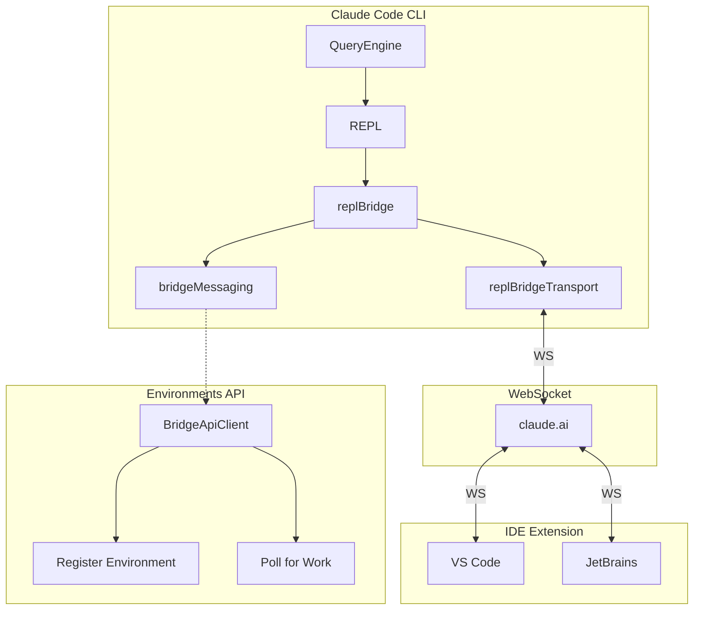
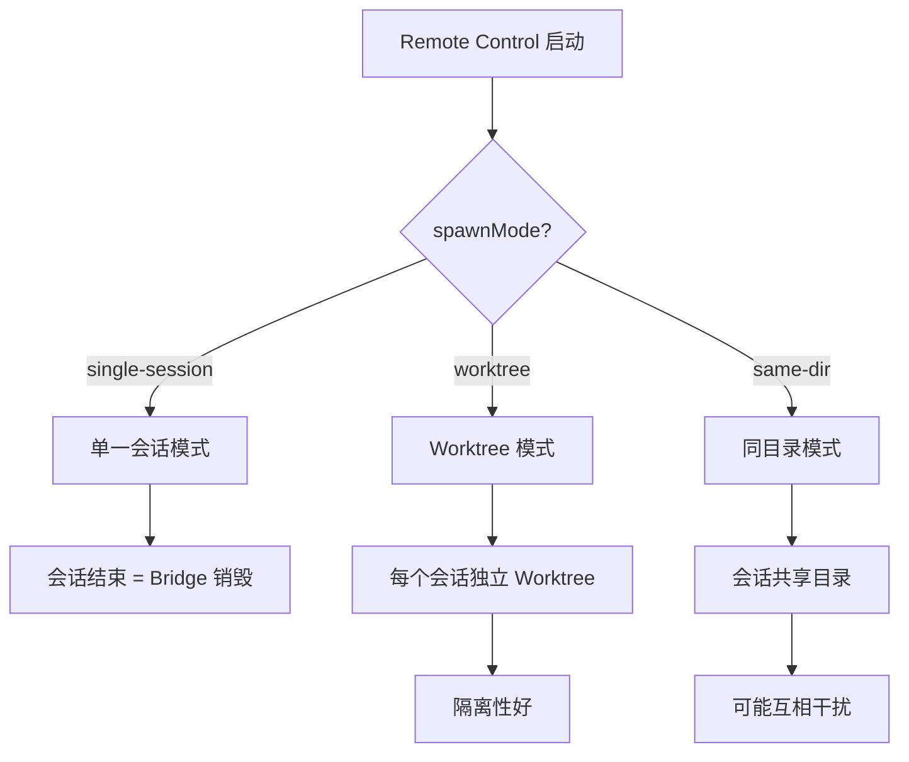

# 第 18 章：Bridge 系统（IDE 集成）

> 本章目标：深入理解 Claude Code 与 IDE 的双向通信机制。

## 18.1 Bridge 架构



### Bridge 配置

```typescript
// src/bridge/types.ts
export type BridgeConfig = {
  dir: string
  machineName: string
  branch: string
  gitRepoUrl: string | null
  maxSessions: number
  spawnMode: 'single-session' | 'worktree' | 'same-dir'
  verbose: boolean
  sandbox: boolean
  bridgeId: string
  workerType: string
  environmentId: string
  reuseEnvironmentId?: string
  apiBaseUrl: string
  sessionIngressUrl: string
  debugFile?: string
  sessionTimeoutMs?: number
}
```

### 会话模式



## 18.2 连接管理

### 环境注册

```typescript
// src/bridge/bridgeApi.ts
export type BridgeApiClient = {
  registerBridgeEnvironment(config: BridgeConfig): Promise<{
    environment_id: string
    environment_secret: string
  }>
  pollForWork(
    environmentId: string,
    environmentSecret: string,
    signal?: AbortSignal,
    reclaimOlderThanMs?: number,
  ): Promise<WorkResponse | null>
  acknowledgeWork(
    environmentId: string,
    workId: string,
    sessionToken: string,
  ): Promise<void>
  stopWork(environmentId: string, workId: string, force: boolean): Promise<void>
}

export async function registerBridgeEnvironment(
  config: BridgeConfig,
): Promise<{
  environment_id: string
  environment_secret: string
}> {
  const response = await fetch(`${config.apiBaseUrl}/v1/environments`, {
    method: 'POST',
    headers: {
      'Content-Type': 'application/json',
    },
    body: JSON.stringify({
      bridge_id: config.bridgeId,
      environment_id: config.environmentId,
      reuse_environment_id: config.reuseEnvironmentId,
      machine_name: config.machineName,
      directory: config.dir,
      branch: config.branch,
      git_repo_url: config.gitRepoUrl,
      max_sessions: config.maxSessions,
      spawn_mode: config.spawnMode,
      worker_type: config.workerType,
    }),
  })

  if (!response.ok) {
    const text = await response.text()
    throw new Error(`Failed to register environment: ${response.status} ${text}`)
  }

  return response.json()
}
```

### JWT 认证

```typescript
// src/bridge/jwtUtils.ts
import type { WorkSecret } from './types.js'

export type SessionTokens = {
  sessionIngressToken: string
  sessionEgressToken: string
}

export function extractSessionTokens(secret: WorkSecret): SessionTokens {
  return {
    sessionIngressToken: secret.session_ingress_token,
    sessionEgressToken: secret.api_base_url, // Note: stored in api_base_url field
  }
}

export function createAuthHeaders(tokens: SessionTokens): Record<string, string> {
  return {
    'X-Claude-Session-Ingress-Token': tokens.sessionIngressToken,
    'X-Claude-Session-Egress-Token': tokens.sessionEgressToken,
  }
}
```

## 18.3 消息协议

### 消息类型

```typescript
// src/entrypoints/agentSdkTypes.ts
export type SDKMessage =
  | { type: 'prompt_request'; request_id: string; prompt: string }
  | { type: 'control_request'; request_id: string; request: SDKControlRequest }
  | { type: 'control_response'; response: SDKControlResponse }
  | { type: 'status_update'; status: SDKStatusUpdate }

export type SDKControlRequest =
  | { subtype: 'initialize'; config: Record<string, unknown> }
  | { subtype: 'can_use_tool'; tool_name: string; tool_input: unknown }
  | { subtype: 'set_model'; model: string }
  | { subtype: 'set_permission_mode'; mode: string }
  | { subtype: 'interrupt' }
  | { subtype: 'exit' }

export type SDKControlResponse =
  | { subtype: 'success'; request_id: string; response: Record<string, unknown> }
  | { subtype: 'error'; request_id: string; error: string }

export type SDKStatusUpdate =
  | { type: 'connected' }
  | { type: 'disconnected'; reason?: string }
  | { type: 'activity'; activity: string }
```

### 入站消息处理

```typescript
// src/bridge/bridgeMessaging.ts
export function handleIngressMessage(
  data: string,
  recentPostedUUIDs: BoundedUUIDSet,
  recentInboundUUIDs: BoundedUUIDSet,
  onInboundMessage: ((msg: SDKMessage) => void | Promise<void>) | undefined,
  onPermissionResponse?: ((response: SDKControlResponse) => void) | undefined,
  onControlRequest?: ((request: SDKControlRequest) => void) | undefined,
): void {
  try {
    const parsed: unknown = jsonParse(data)

    // control_response 处理
    if (isSDKControlResponse(parsed)) {
      onPermissionResponse?.(parsed)
      return
    }

    // control_request 处理
    if (isSDKControlRequest(parsed)) {
      onControlRequest?.(parsed)
      return
    }

    // SDKMessage 处理
    if (!isSDKMessage(parsed)) {
      return
    }

    // UUID 去重（避免回显）
    const uuid = getSDKMessageUUID(parsed)
    if (uuid && (recentPostedUUIDs.has(uuid) || recentInboundUUIDs.has(uuid))) {
      return
    }

    // 处理消息
    onInboundMessage(parsed)
  } catch (error) {
    // 忽略解析错误
  }
}

function getSDKMessageUUID(msg: SDKMessage): string | undefined {
  switch (msg.type) {
    case 'prompt_request':
    case 'control_request':
      return msg.request_id
    case 'control_response':
      return msg.response.request_id
    case 'status_update':
      return undefined
  }
}
```

### 出站消息处理

```typescript
// src/bridge/bridgeMessaging.ts
/**
 * True for message types that should be forwarded to the bridge transport.
 */
export function isEligibleBridgeMessage(m: Message): boolean {
  // Virtual messages (REPL inner calls) are display-only
  if ((m.type === 'user' || m.type === 'assistant') && m.isVirtual) {
    return false
  }
  return (
    m.type === 'user' ||
    m.type === 'assistant' ||
    (m.type === 'system' && m.subtype === 'local_command')
  )
}

export async function writeMessages(
  messages: Message[],
  transport: ReplBridgeTransport,
  recentPostedUUIDs: BoundedUUIDSet,
): Promise<void> {
  const eligibleMessages = messages.filter(isEligibleBridgeMessage)

  if (eligibleMessages.length === 0) return

  const sdkMessages = await Promise.all(
    eligibleMessages.map(toSDKMessage)
  )

  for (const sdkMessage of sdkMessages) {
    if (!sdkMessage) continue

    const uuid = getSDKMessageUUID(sdkMessage)
    if (uuid) {
      recentPostedUUIDs.add(uuid)
    }

    transport.send(JSON.stringify(sdkMessage))
  }
}
```

## 18.4 权限代理

```typescript
// src/bridge/bridgePermissionCallbacks.ts
export type BridgePermissionCallbacks = {
  requestPermission(params: {
    toolUseName: string
    toolUseInput: unknown
    context: ToolPermissionContext
  }): Promise<{ behavior: 'allow' | 'deny' | 'forward_to_human' }>
}

export function createBridgePermissionCallbacks(
  sendPermissionRequest: (request: SDKControlRequest) => void,
  responseTimeoutMs: number,
): BridgePermissionCallbacks {
  const pendingRequests = new Map<string, {
    resolve: (response: PermissionDecision) => void
    timeout: NodeJS.Timeout
  }>()

  // 监听 control_response
  const onControlResponse = (response: SDKControlResponse) => {
    if (response.subtype === 'success') {
      const pending = pendingRequests.get(response.request_id)
      if (pending) {
        clearTimeout(pending.timeout)
        pending.resolve(response.response as PermissionDecision)
        pendingRequests.delete(response.request_id)
      }
    }
  }

  return {
    async requestPermission({ toolUseName, toolUseInput, context }) {
      const requestId = randomUUID()

      return new Promise((resolve) => {
        const timeout = setTimeout(() => {
          pendingRequests.delete(requestId)
          resolve({ behavior: 'forward_to_human' })
        }, responseTimeoutMs)

        pendingRequests.set(requestId, { resolve, timeout })

        sendPermissionRequest({
          type: 'control_request',
          request_id: requestId,
          request: {
            subtype: 'can_use_tool',
            tool_name: toolUseName,
            tool_input: toolUseInput,
          },
        })
      })
    },
  }
}
```

## 18.5 会话运行器

```typescript
// src/bridge/sessionRunner.ts
export type SessionRunnerOptions = {
  sessionId: string
  workSecret: WorkSecret
  config: BridgeConfig
  transport: ReplBridgeTransport
  queryEngine: QueryEngine
  onActivity: (activity: SessionActivity) => void
}

export async function runSession({
  sessionId,
  workSecret,
  config,
  transport,
  queryEngine,
  onActivity,
}: SessionRunnerOptions): Promise<void> {
  const { sources, auth, api_base_url } = workSecret

  // 设置 API
  for (const source of sources) {
    if (source.type === 'git') {
      addGitSource({
        repo: source.git_info.repo,
        ref: source.git_info.ref,
        token: source.git_info.token,
      })
    }
  }

  // 设置认证
  for (const authEntry of auth) {
    if (authEntry.type === 'bearer') {
      setApiKey(authEntry.token)
    }
  }

  // 监听入站消息
  const disposables = [
    transport.onMessage(async (data) => {
      const parsed = JSON.parse(data)

      if (parsed.type === 'prompt_request') {
        onActivity({
          type: 'text',
          summary: `User: ${parsed.prompt.slice(0, 50)}...`,
          timestamp: Date.now(),
        })

        // 发送到 QueryEngine
        for await (const event of queryEngine.submitMessage({
          role: 'user',
          content: parsed.prompt,
        })) {
          // 处理响应
        }
      }
    }),
  ]

  // 等待会话结束
  return new Promise((resolve) => {
    transport.onClose(() => {
      disposables.forEach(d => d())
      resolve()
    })
  })
}
```

## 18.6 可复用模式总结

### 模式 38：双向通信协议

**描述：** WebSocket 双向消息协议设计模式。

**适用场景：**
- IDE 扩展与语言服务器通信
- 远程控制协议
- 实时协作系统

**代码模板：**

```typescript
// 1. 定义消息类型
export type ClientMessage =
  | { type: 'request'; id: string; method: string; params: unknown }
  | { type: 'cancel'; id: string }
  | { type: 'ping' }

export type ServerMessage =
  | { type: 'response'; id: string; result: unknown }
  | { type: 'error'; id: string; error: { code: number; message: string } }
  | { type: 'notification'; method: string; params: unknown }
  | { type: 'pong' }

// 2. UUID 去重机制
export class BoundedUUIDSet {
  private set = new Set<string>()
  private maxSize: number

  constructor(maxSize: number = 1000) {
    this.maxSize = maxSize
  }

  add(uuid: string): boolean {
    if (this.set.has(uuid)) return false

    this.set.add(uuid)

    // LRU 淘汰
    if (this.set.size > this.maxSize) {
      const first = this.set.values().next().value
      this.set.delete(first)
    }

    return true
  }

  has(uuid: string): boolean {
    return this.set.has(uuid)
  }

  clear(): void {
    this.set.clear()
  }
}

// 3. 消息处理器
export type MessageHandler = {
  onRequest?: (request: Extract<ClientMessage, { type: 'request' }>) => void
  onNotification?: (notification: Extract<ServerMessage, { type: 'notification' }>) => void
  onError?: (error: Extract<ServerMessage, { type: 'error' }>) => void
}

export function handleServerMessage(
  message: unknown,
  recentSentIds: BoundedUUIDSet,
  handler: MessageHandler,
): void {
  if (typeof message !== 'object' || message === null) return

  const msg = message as Record<string, unknown>

  switch (msg.type) {
    case 'response':
    case 'error':
      // 去重检查
      if (recentSentIds.has(String(msg.id))) {
        recentSentIds.add(String(msg.id))
        handler.onError?.(msg as Extract<ServerMessage, { type: 'error' }>)
      }
      break

    case 'notification':
      handler.onNotification?.(msg as Extract<ServerMessage, { type: 'notification' }>)
      break
  }
}

// 4. WebSocket 传输
export class WebSocketTransport {
  private ws: WebSocket
  private recentSentIds = new BoundedUUIDSet(100)
  private recentReceivedIds = new BoundedUUIDSet(100)

  constructor(url: string) {
    this.ws = new WebSocket(url)
  }

  send(message: ClientMessage): void {
    const id = message.type === 'request' ? message.id : randomUUID()
    const withId = { ...message, id }

    this.ws.send(JSON.stringify(withId))
    this.recentSentIds.add(id)
  }

  onMessage(handler: MessageHandler): () => void {
    const listener = (data: string) => {
      const parsed = JSON.parse(data)
      handleServerMessage(parsed, this.recentSentIds, handler)
    }

    this.ws.addEventListener('message', (event) => {
      listener(event.data)
    })

    return () => {
      this.ws.removeEventListener('message', listener)
    }
  }
}
```

**关键点：**
1. 类型安全的消息联合
2. UUID 去重避免回显
3. 分离的处理器接口
4. 传输层抽象

### 模式 39：会话代理模式

**描述：** 远程会话的本地代理模式。

**适用场景：**
- 远程代码执行
- IDE 集成
- 云开发环境

**代码模板：**

```typescript
// 1. 会话抽象
export type SessionProxy = {
  id: string
  send(message: ClientMessage): void
  close(): Promise<void>
  onMessage(callback: (msg: ServerMessage) => void): () => void
  onClose(callback: () => void): () => void
}

// 2. 会话工厂
export async function createSession(
  config: SessionConfig,
): Promise<SessionProxy> {
  // 1. 注册环境
  const { environment_id, environment_secret } = await registerEnvironment(config)

  // 2. 连接 WebSocket
  const ws = await connectWebSocket(environment_id, environment_secret)

  // 3. 创建代理
  return new WebSocketSessionProxy(environment_id, ws)
}

// 3. WebSocket 实现
class WebSocketSessionProxy implements SessionProxy {
  private pendingRequests = new Map<string, {
    resolve: (result: unknown) => void
    reject: (error: Error) => void
    timeout: NodeJS.Timeout
  }>()

  constructor(
    public id: string,
    private ws: WebSocket,
  ) {}

  send(message: ClientMessage): void {
    if (message.type === 'request') {
      return new Promise((resolve, reject) => {
        const timeout = setTimeout(() => {
          this.pendingRequests.delete(message.id)
          reject(new Error('Request timeout'))
        }, 30000)

        this.pendingRequests.set(message.id, { resolve, reject, timeout })
        this.ws.send(JSON.stringify(message))
      })
    }

    this.ws.send(JSON.stringify(message))
  }

  async close(): Promise<void> {
    this.ws.close()
  }

  onMessage(callback: (msg: ServerMessage) => void): () => void {
    const listener = (data: string) => {
      const msg = JSON.parse(data) as ServerMessage

      if (msg.type === 'response' || msg.type === 'error') {
        const pending = this.pendingRequests.get(msg.id)
        if (pending) {
          clearTimeout(pending.timeout)
          this.pendingRequests.delete(msg.id)

          if (msg.type === 'response') {
            pending.resolve(msg.result)
          } else {
            pending.reject(new Error(msg.error.message))
          }
        }
      }

      callback(msg)
    }

    this.ws.addEventListener('message', listener)
    return () => this.ws.removeEventListener('message', listener)
  }

  onClose(callback: () => void): () => void {
    this.ws.addEventListener('close', callback)
    return () => this.ws.removeEventListener('close', callback)
  }
}

// 4. 使用示例
export async function runRemoteSession(config: SessionConfig) {
  const session = await createSession(config)

  session.onMessage((msg) => {
    if (msg.type === 'notification') {
      console.log('Notification:', msg.params)
    }
  })

  await session.send({
    type: 'request',
    id: randomUUID(),
    method: 'initialize',
    params: {},
  })
}
```

**关键点：**
1. Promise 包装请求-响应
2. 超时处理
3. 清理机制
4. 类型安全

---

## 本章小结

本章分析了 Bridge 系统（IDE 集成）的实现：

1. **Bridge 架构**：双向通信、WebSocket 连接、Environments API
2. **连接管理**：环境注册、JWT 认证、会话模式
3. **消息协议**：SDKMessage、control_request/control_response
4. **权限代理**：权限请求转发、响应处理
5. **会话运行器**：runSession 实现、QueryEngine 集成
6. **可复用模式**：双向通信协议、会话代理模式

## 下一章预告

第 19 章将深入分析 MCP 集成，包括客户端/服务器模式、工具与资源暴露。
