# 第 18 章：权限系统设计

> 本章目标：深入理解 Claude Code 的多层权限控制机制、规则引擎和决策流程。

## 18.1 权限系统设计理念

### 18.1.1 安全模型的核心原则

Claude Code 的权限系统围绕以下原则设计：

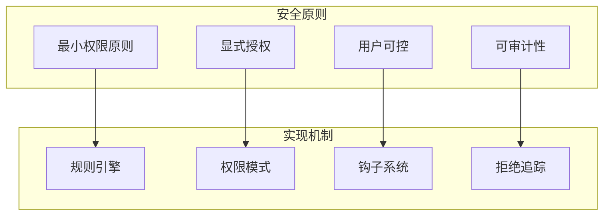

**核心原则分析：**

| 原则 | 实现 | 示例 |
|------|------|------|
| 最小权限 | 默认询问，只允许只读操作 | FileRead 默认允许，FileWrite 默认询问 |
| 显式授权 | 用户必须明确允许写操作 | 危险命令需要用户确认 |
| 可审计 | 所有拒绝被记录追踪 | denialTracking 记录所有拒绝 |
| 用户可控 | 用户可配置规则覆盖默认行为 | alwaysAllowRules, alwaysDenyRules |

### 18.1.2 威胁模型

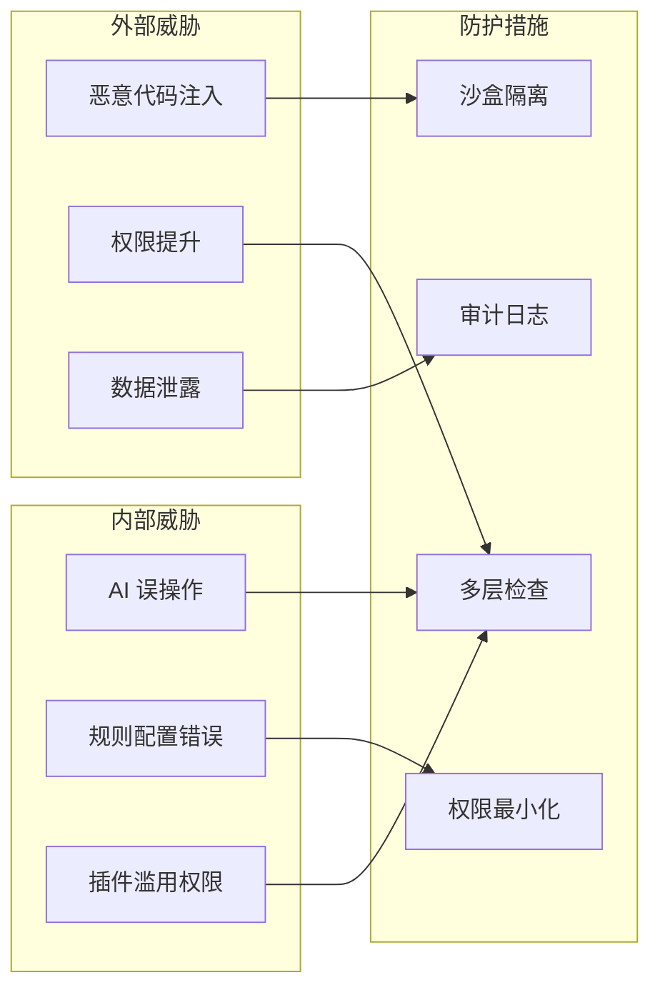

**威胁分类：**

1. **命令注入**
   - 威胁：通过文件编辑注入恶意脚本
   - 防护：沙盒执行、AST 解析

2. **路径遍历**
   - 威胁：访问系统敏感文件
   - 防护：路径验证、目录限制

3. **数据泄露**
   - 威胁：将敏感数据发送到外部
   - 防护：API 端点验证、日志脱敏

## 18.2 权限模式深度解析

### 18.2.1 完整权限模式体系

```mermaid
stateDiagram-v2
    [*] --> Default: 启动
    Default --> Auto: 用户配置自动模式
    Default --> Plan: 进入计划模式
    Default --> Bypass: 特权认证

    Auto --> Default: 关闭自动模式
    Plan --> Default: 退出计划模式
    Bypass --> Default: 会话结束

    Default --> Yolo: 内部测试
    Yolo --> Default: 测试结束

    Default --> Headless: 无头模式
    Headless --> Default: 交互模式恢复

    note right of Default
        默认模式：
        - 读操作允许
        - 写操作询问
        - 危险操作阻止
    end note

    note right of Plan
        计划模式：
        - 读操作允许
        - 写操作阻止
        - 预设操作允许
    end note

    note right of Auto
        自动模式：
        - 规则决定
        - 钩子决定
        - 默认询问
    end note
```

### 18.2.2 Default 模式决策树

```typescript
// src/utils/permissions/checkDefaultMode.ts

/**
 * default 模式的完整决策流程
 */
export async function checkDefaultMode(
  tool: Tool,
  input: unknown,
  context: ToolUseContext,
): Promise<PermissionResult> {
  // ========== 第 1 层：内置权限检查 ==========
  const builtinCheck = tool.checkPermissions?.(input, context)
  if (builtinCheck?.behavior === 'block') {
    return builtinCheck
  }

  // ========== 第 2 层：拒绝规则（最高优先级）==========
  const denyRule = findMatchingRule(
    context.toolPermissionContext.alwaysDenyRules,
    tool.name,
    input,
  )
  if (denyRule) {
    return {
      behavior: 'block',
      message: denyRule.message || `Blocked by deny rule`,
      source: 'deny_rule',
    }
  }

  // ========== 第 3 层：允许规则 ==========
  const allowRule = findMatchingRule(
    context.toolPermissionContext.alwaysAllowRules,
    tool.name,
    input,
  )
  if (allowRule) {
    return {
      behavior: 'allow',
      source: 'allow_rule',
    }
  }

  // ========== 第 4 层：工具属性判断 ==========
  // 危险操作：必须询问
  if (tool.isDestructive?.(input)) {
    return {
      behavior: 'ask',
      message: `${tool.name} performs destructive operation. Continue?`,
      source: 'destructive_operation',
    }
  }

  // 只读操作：默认允许
  if (tool.isReadOnly?.(input)) {
    return {
      behavior: 'allow',
      source: 'read_only_operation',
    }
  }

  // ========== 第 5 层：询问规则 ==========
  const askRule = findMatchingRule(
    context.toolPermissionContext.alwaysAskRules,
    tool.name,
    input,
  )
  if (askRule) {
    return {
      behavior: 'ask',
      message: askRule.message || `Allow ${tool.name} with this input?`,
      source: 'ask_rule',
    }
  }

  // ========== 第 6 层：写操作默认询问 ==========
  return {
    behavior: 'ask',
    message: `Allow ${tool.name} to modify files?`,
    source: 'write_operation_default',
  }
}
```

### 18.2.3 Plan 模式详解

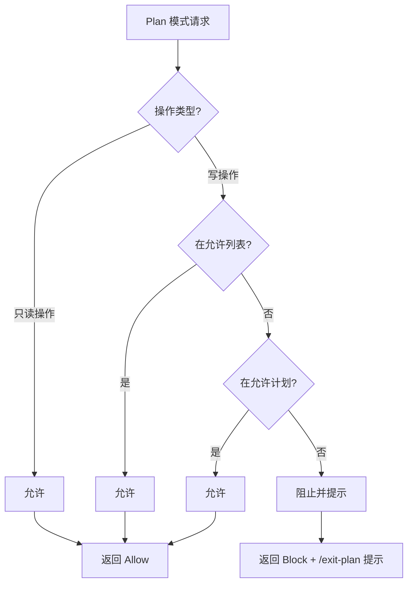

```typescript
/**
 * plan 模式实现
 */
export async function checkPlanMode(
  tool: Tool,
  input: unknown,
  context: ToolUseContext,
): Promise<PermissionResult> {
  const { prePlanMode } = context.toolPermissionContext

  // 1. 只读操作直接允许
  if (tool.isReadOnly?.(input)) {
    return {
      behavior: 'allow',
      source: 'plan_mode_read_only',
    }
  }

  // 2. 检查预设允许的提示
  if (prePlanMode?.allowedPrompts) {
    for (const allowed of prePlanMode.allowedPrompts) {
      if (matchesAllowedPrompt(allowed, tool.name, input)) {
        return {
          behavior: 'allow',
          source: 'plan_mode_allowed_prompt',
          message: `Allowed by plan: ${allowed.description}`,
        }
      }
    }
  }

  // 3. 检查 alwaysAllowRules（计划模式下的例外）
  const allowRule = findMatchingRule(
    context.toolPermissionContext.alwaysAllowRules,
    tool.name,
    input,
  )
  if (allowRule) {
    return {
      behavior: 'allow',
      source: 'plan_mode_allow_rule',
    }
  }

  // 4. 所有写操作都被阻止
  return {
    behavior: 'block',
    message: `Tool "${tool.name}" is not available in plan mode.` +
            ` Use /exit-plan to leave plan mode and execute this operation.`,
    source: 'plan_mode_write_blocked',
  }
}

/**
 * 预设提示匹配
 */
function matchesAllowedPrompt(
  allowed: AllowedPrompt,
  toolName: string,
  input: unknown,
): boolean {
  // 检查工具名称
  if (allowed.tools && !allowed.tools.includes(toolName)) {
    return false
  }

  // 检查输入匹配
  if (allowed.pattern) {
    const inputStr = JSON.stringify(input)
    const regex = new RegExp(allowed.pattern, 'i')
    return regex.test(inputStr)
  }

  return true
}
```

### 18.2.4 Auto 模式与自动化集成

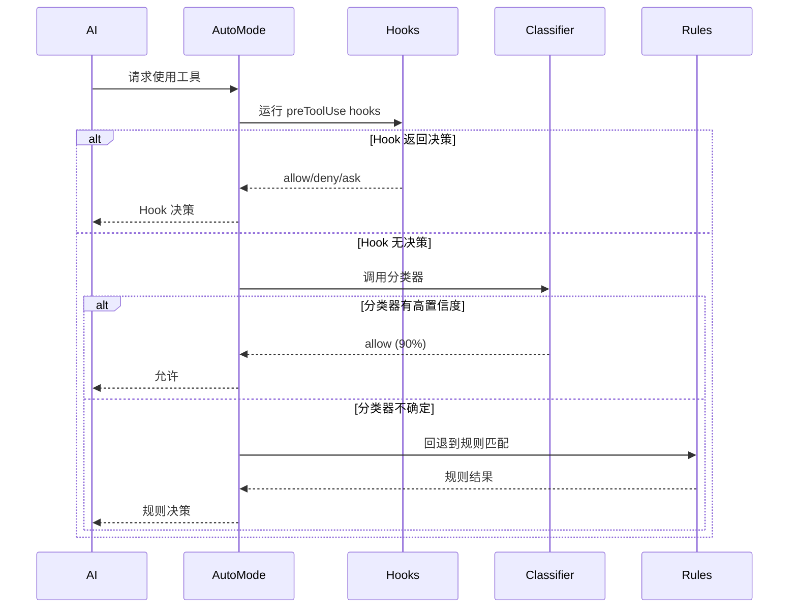

```typescript
/**
 * auto 模式实现
 */
export async function checkAutoMode(
  tool: Tool,
  input: unknown,
  context: ToolUseContext,
): Promise<PermissionResult> {
  // 1. 运行 preToolUse hooks
  for (const hook of context.options.preToolUseHooks || []) {
    try {
      const hookResult = await hook(tool, input, context)
      if (hookResult?.behavior) {
        return {
          ...hookResult,
          source: 'pre_tool_hook',
        }
      }
    } catch (error) {
      // Hook 失败不阻止执行
      console.error(`Pre-tool hook failed: ${error}`)
    }
  }

  // 2. 检查分类器结果（如果有）
  const classifierResult = getClassifierResult(tool.name, input, context)
  if (classifierResult) {
    // 高置信度直接决策
    if (classifierResult.confidence > 0.9) {
      if (classifierResult.decision === 'allow') {
        return {
          behavior: 'allow',
          source: 'classifier',
          confidence: classifierResult.confidence,
        }
      } else {
        return {
          behavior: 'block',
          message: classifierResult.reason,
          source: 'classifier',
        }
      }
    }

    // 中等置信度，结合规则
    if (classifierResult.confidence > 0.7) {
      // 检查是否有冲突的规则
      const ruleResult = await checkDefaultMode(tool, input, context)

      // 如果规则确认，使用规则结果
      if (ruleResult.behavior !== 'ask') {
        return ruleResult
      }

      // 否则使用分类器结果但询问确认
      return {
        behavior: 'ask',
        message: `Classifier suggests ${classifierResult.decision} (${Math.round(classifierResult.confidence * 100)}% confidence). ${classifierResult.reason || ''}`,
        source: '_classifier_with_confirmation',
      }
    }
  }

  // 3. 回退到 default 模式
  return await checkDefaultMode(tool, input, context)
}

/**
 * 分类器结果类型
 */
type ClassifierResult = {
  decision: 'allow' | 'deny'
  confidence: number  // 0-1
  reason?: string
  features?: Record<string, number>
}

/**
 * 获取分类器结果（概念性实现）
 */
function getClassifierResult(
  toolName: string,
  input: unknown,
  context: ToolUseContext,
): ClassifierResult | null {
  // 这里可以集成 ML 模型或基于规则的分类器
  // 示例：基于启发式规则

  // Bash 工具的危险模式检测
  if (toolName === 'Bash') {
    const command = (input as { command: string }).command.toLowerCase()

    // 检测危险命令
    const dangerous = [
      'rm -rf /',
      'rm -rf ~',
      '> /dev/sd',
      'mkfs',
      'dd if=',
      ':(){ :|:& };:',  // fork bomb
    ]

    for (const pattern of dangerous) {
      if (command.includes(pattern)) {
        return {
          decision: 'deny',
          confidence: 0.95,
          reason: `Dangerous command pattern detected: ${pattern}`,
        }
      }
    }

    // 检测安全的读命令
    const safeReads = [
      /^cat\s+/,
      /^ls\s+/,
      /^pwd$/,
      /^echo\s+[^>]+$/,  // echo without redirection
    ]

    for (const pattern of safeReads) {
      if (pattern.test(command)) {
        return {
          decision: 'allow',
          confidence: 0.85,
          reason: 'Safe read-only command',
        }
      }
    }
  }

  return null
}
```

**作者观点：** Auto 模式是安全的"甜点"：
- Hooks 提供自动化能力（如 CI/CD 环境自动允许）
- 分类器提供智能决策（减少询问频率）
- 规则回退保证安全性

但分类器的置信度阈值需要仔细调整：太高会退化到 default 模式，太低会产生错误决策。

## 18.3 权限规则系统

### 18.3.1 规则语法完全参考

```typescript
/**
 * 权限规则类型
 */
export type PermissionRule =
  // 简单通配符
  | string
  // 结构化规则
  | {
      // 工具名称模式
      tool?: string

      // 输入匹配规则
      input?: InputRule

      // 可读消息（用于询问/拒绝）
      message?: string

      // 行为（用于混合规则）
      behavior?: 'allow' | 'deny' | 'ask'
    }

/**
 * 输入规则类型
 */
export type InputRule =
  // JSON 路径存在性检查
  | string
  // 结构化匹配
  | {
      // JSON 路径：如 "$.filePath"
      path?: string

      // 正则表达式匹配
      pattern?: string

      // 精确值匹配
      value?: unknown

      // 比较操作
      op?: 'eq' | 'ne' | 'gt' | 'lt' | 'gte' | 'lte' | 'contains' | 'matches'

      // 取反
      not?: boolean

      // 数组/字符串长度检查
      length?: number | { min?: number; max?: number }

      // 枚举检查
      enum?: unknown[]
    }

/**
 * 规则来源
 */
export type PermissionRuleSource = 'user' | 'organization'

/**
 * 按来源分组的规则
 */
export type ToolPermissionRulesBySource = Partial<
  Record<PermissionRuleSource, PermissionRule[]>
>
```

### 18.3.2 规则匹配引擎

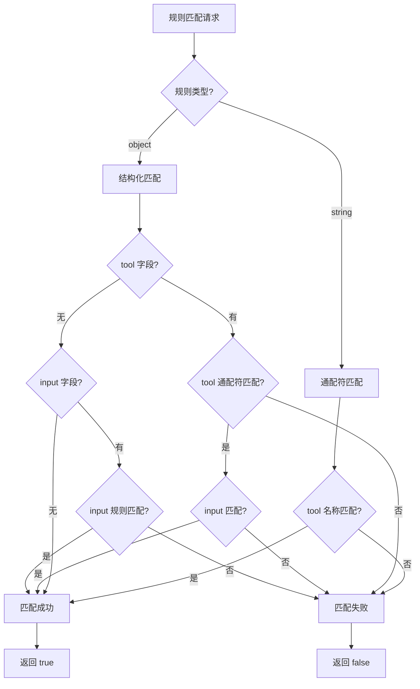

```typescript
/**
 * 规则匹配引擎实现
 */
export class PermissionRuleEngine {
  /**
   * 检查规则是否匹配
   */
  matches(
    rule: PermissionRule,
    toolName: string,
    input: unknown,
  ): boolean {
    // 1. 字符串规则：通配符匹配
    if (typeof rule === 'string') {
      return this.matchWildcard(rule, toolName)
    }

    // 2. 结构化规则
    let matches = true

    // 2.1 工具名称匹配
    if (rule.tool !== undefined) {
      const toolMatches = this.matchWildcard(rule.tool, toolName)
      matches = matches && toolMatches
    }

    // 2.2 输入匹配
    if (matches && rule.input !== undefined) {
      const inputMatches = this.matchInputRule(rule.input, input)
      matches = matches && inputMatches

      // 支持取反
      if (rule.input && typeof rule.input === 'object' && 'not' in rule.input) {
        matches = !matches
      }
    }

    return matches
  }

  /**
   * 通配符匹配
   */
  private matchWildcard(pattern: string, value: string): boolean {
    // 转义特殊字符
    const regexPattern = pattern
      .replace(/[.+^${}()|[\]\\]/g, '\\$&')
      .replace(/\*/g, '.*')
      .replace(/\?/g, '.')

    const regex = new RegExp(`^${regexPattern}$`, 'i')
    return regex.test(value)
  }

  /**
   * 输入规则匹配
   */
  private matchInputRule(rule: InputRule, input: unknown): boolean {
    // 1. 字符串规则：JSONPath 存在性检查
    if (typeof rule === 'string') {
      return this.checkJSONPathExists(input, rule)
    }

    // 2. 结构化规则
    const { path, pattern, value, op, enum: enumValues, length } = rule

    // 2.1 提取路径值
    const extracted = path !== undefined
      ? this.extractJSONPath(input, path)
      : input

    // 2.2 模式匹配
    if (pattern !== undefined) {
      if (typeof extracted !== 'string') {
        return false
      }
      const regex = new RegExp(pattern, 'i')
      return regex.test(extracted)
    }

    // 2.3 值匹配
    if (value !== undefined) {
      return extracted === value
    }

    // 2.4 操作符匹配
    if (op !== undefined) {
      return this.applyOperator(extracted, op, rule)
    }

    // 2.5 枚举匹配
    if (enumValues !== undefined) {
      return enumValues.includes(extracted)
    }

    // 2.6 长度匹配
    if (length !== undefined) {
      return this.checkLength(extracted, length)
    }

    // 2.7 默认：路径存在性
    return extracted !== undefined
  }

  /**
   * JSONPath 提取
   */
  private extractJSONPath(obj: unknown, path: string): unknown {
    const parts = path.split('.')
    let current: unknown = obj

    for (const part of parts) {
      if (current === null || typeof current !== 'object') {
        return undefined
      }

      // 支持数组索引：items.0.name
      const arrayMatch = part.match(/^(\d+)$/)
      if (arrayMatch && Array.isArray(current)) {
        const index = parseInt(arrayMatch[1], 10)
        current = current[index]
      } else {
        current = (current as Record<string, unknown>)[part]
      }
    }

    return current
  }

  /**
   * 操作符应用
   */
  private applyOperator(
    value: unknown,
    op: string,
    rule: InputRule,
  ): boolean {
    const compareValue = (rule as any).value

    switch (op) {
      case 'eq':
        return value === compareValue
      case 'ne':
        return value !== compareValue
      case 'gt':
        return typeof value === 'number' && value > compareValue
      case 'lt':
        return typeof value === 'number' && value < compareValue
      case 'gte':
        return typeof value === 'number' && value >= compareValue
      case 'lte':
        return typeof value === 'number' && value <= compareValue
      case 'contains':
        return typeof value === 'string' && value.includes(compareValue)
      case 'matches':
        return typeof value === 'string' && new RegExp(compareValue).test(value)
      default:
        return false
    }
  }

  /**
   * 长度检查
   */
  private checkLength(
    value: unknown,
    length: number | { min?: number; max?: number },
  ): boolean {
    let actualLength: number

    if (typeof value === 'string') {
      actualLength = value.length
    } else if (Array.isArray(value)) {
      actualLength = value.length
    } else {
      return false
    }

    if (typeof length === 'number') {
      return actualLength === length
    } else {
      if (length.min !== undefined && actualLength < length.min) {
        return false
      }
      if (length.max !== undefined && actualLength > length.max) {
        return false
      }
      return true
    }
  }
}
```

### 18.3.3 规则优先级与冲突解决

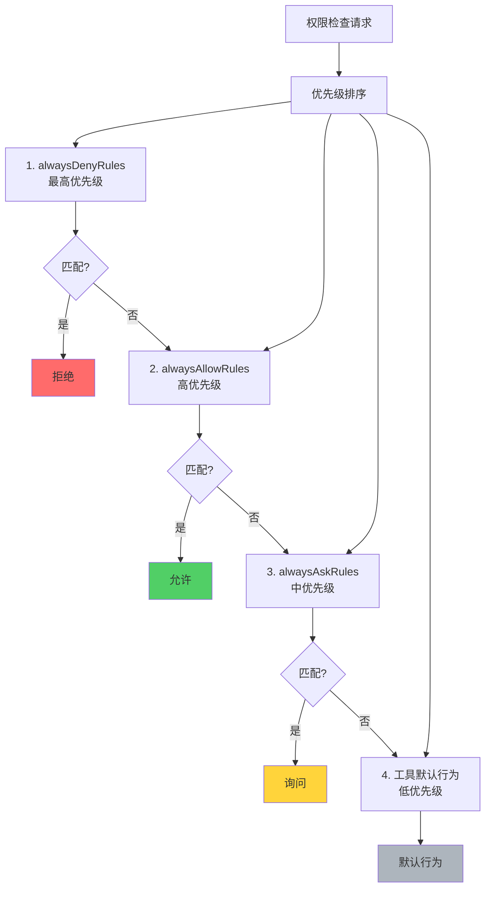

```typescript
/**
 * 按优先级查找匹配规则
 */
export function findMatchingRule(
  rules: ToolPermissionRulesBySource,
  toolName: string,
  input: unknown,
): { rule: PermissionRule; source: string } | null {
  const engine = new PermissionRuleEngine()

  // 按优先级顺序：user > organization
  const sources: PermissionRuleSource[] = ['user', 'organization']

  // 在每个来源中，按类型顺序检查
  for (const source of sources) {
    const sourceRules = rules[source]
    if (!sourceRules) continue

    for (const rule of sourceRules) {
      if (engine.matches(rule, toolName, input)) {
        return { rule, source }
      }
    }
  }

  return null
}

/**
 * 完整权限检查流程
 */
export async function checkPermissionsWithRules(
  tool: Tool,
  input: unknown,
  context: ToolUseContext,
): Promise<PermissionResult> {
  const { toolPermissionContext: ctx } = context

  // 1. alwaysDenyRules（最高优先级）
  const denyRule = findMatchingRule(ctx.alwaysDenyRules, tool.name, input)
  if (denyRule) {
    return {
      behavior: 'block',
      message: getRuleMessage(denyRule.rule, 'Blocked by deny rule'),
      source: 'deny_rule',
    }
  }

  // 2. alwaysAllowRules
  const allowRule = findMatchingRule(ctx.alwaysAllowRules, tool.name, input)
  if (allowRule) {
    return {
      behavior: 'allow',
      source: 'allow_rule',
    }
  }

  // 3. 工具内置检查
  const builtinCheck = tool.checkPermissions?.(input, context)
  if (builtinCheck?.behavior === 'block') {
    return builtinCheck
  }

  // 4. alwaysAskRules
  const askRule = findMatchingRule(ctx.alwaysAskRules, tool.name, input)
  if (askRule) {
    return {
      behavior: 'ask',
      message: getRuleMessage(askRule.rule, `Allow ${tool.name}?`),
      source: 'ask_rule',
    }
  }

  // 5. 工具默认行为
  if (tool.isDestructive?.(input)) {
    return {
      behavior: 'ask',
      message: `${tool.name} performs destructive operation. Continue?`,
      source: 'destructive',
    }
  }

  if (tool.isReadOnly?.(input)) {
    return {
      behavior: 'allow',
      source: 'read_only',
    }
  }

  // 6. 默认询问
  return {
    behavior: 'ask',
    message: `Allow ${tool.name} to modify files?`,
    source: 'default',
  }
}

/**
 * 获取规则消息
 */
function getRuleMessage(rule: PermissionRule, fallback: string): string {
  if (typeof rule === 'string') {
    return fallback
  }

  return rule.message || fallback
}
```

### 18.3.4 规则示例

```typescript
/**
 * 权限规则示例
 */
const ruleExamples = {
  // ========== 简单规则 ==========
  // 允许所有读操作
  allowReads: 'File*',

  // 拒绝所有删除操作
  denyDeletes: '*Delete*',

  // ========== 结构化规则 ==========
  // 允许读取特定目录
  allowConfigRead: {
    tool: 'FileRead',
    input: {
      path: '$.filePath',
      pattern: '^config/',
    },
  },

  // 拒绝删除 node_modules
  denyNodeModulesDelete: {
    tool: 'FileDelete',
    input: {
      path: '$.filePath',
      pattern: 'node_modules',
    },
    message: 'Deleting node_modules is not recommended. Use npm install to clean.',
  },

  // 拒绝危险 Bash 命令
  denyDangerousBash: {
    tool: 'Bash',
    input: {
      path: '$.command',
      pattern: 'rm -rf (\\/|\\.)',
    },
    message: 'Dangerous delete command detected.',
  },

  // 总是询问 Git 推送
  askGitPush: {
    tool: 'Bash',
    input: {
      path: '$.command',
      pattern: '^git push',
    },
  },

  // 限制文件大小
  limitFileSize: {
    tool: 'FileWrite',
    input: {
      path: '$.content',
      length: { max: 10_000_000 },  // 10MB
    },
    message: 'File size exceeds 10MB limit.',
  },
}
```

## 18.4 钩子系统

### 18.4.1 Hooks 类型系统

```typescript
/**
 * 钩子类型定义
 */
export type HooksSettings = {
  // 工具使用前钩子
  preToolUse?: ToolUseHook[]

  // 工具使用后钩子
  postToolUse?: ToolUseHook[]

  // 消息发送前钩子
  preSendMessage?: PreSendMessageHook[]

  // 会话钩子
  session?: SessionHook[]
}

/**
 * 工具使用钩子
 */
export type ToolUseHook =
  // 内置钩子（字符串引用）
  | 'skipToolUse'
  | 'approveToolUse'
  // 自定义钩子（对象定义）
  | ToolUseHookDefinition

/**
 * 工具使用钩子定义
 */
export type ToolUseHookDefinition = {
  // 钩子名称
  name: string

  // 工具过滤器
  tools?: string[]

  // 模式过滤器
  modes?: PermissionMode[]

  // 处理函数
  call: (
    tool: Tool,
    input: unknown,
    context: ToolUseContext,
  ) => Promise<HookResult | void>
}

/**
 * 钩子结果
 */
export type HookResult =
  | { behavior: 'allow' }
  | { behavior: 'deny'; message?: string }
  | { behavior: 'skip'; message?: string }
  | { behavior: 'modify'; input: unknown }
```

### 18.4.2 钩子执行流程

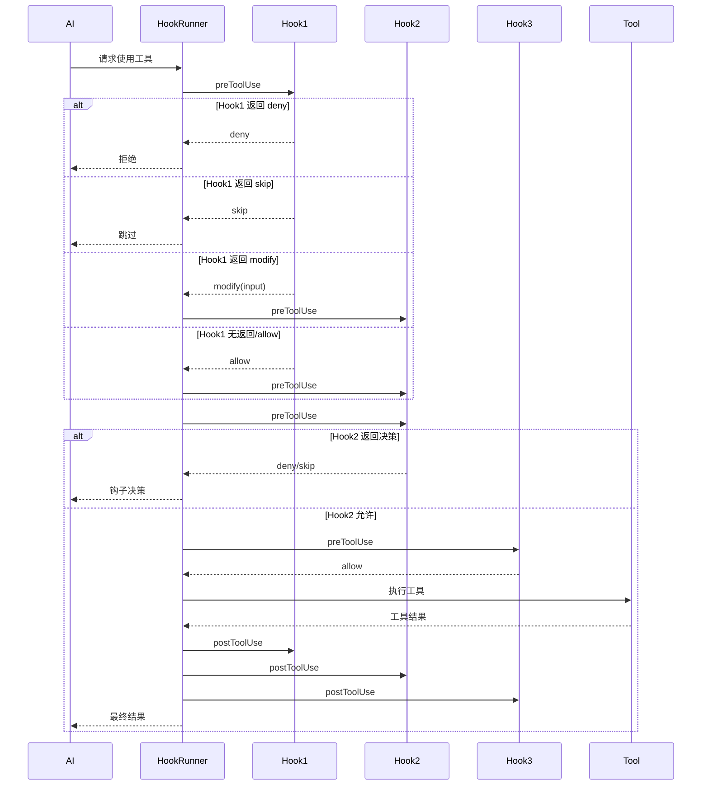

```typescript
/**
 * 钩子执行器
 */
export class HookRunner {
  /**
   * 执行 preToolUse 钩子
   */
  async runPreToolUseHooks(
    tool: Tool,
    input: unknown,
    context: ToolUseContext,
  ): Promise<HookResult | null> {
    const hooks = context.hooks?.preToolUse ?? []

    for (const hook of hooks) {
      try {
        const result = await this.executeHook(tool, input, context, hook)

        // 如果钩子返回决策，立即返回
        if (result) {
          return result
        }
      } catch (error) {
        // 钩子失败不阻止执行，记录错误
        console.error(`Pre-tool hook failed: ${error}`)
      }
    }

    // 所有钩子都通过，返回 null（继续默认流程）
    return null
  }

  /**
   * 执行 postToolUse 钩子
   */
  async runPostToolUseHooks(
    tool: Tool,
    input: unknown,
    result: unknown,
    context: ToolUseContext,
  ): Promise<void> {
    const hooks = context.hooks?.postToolUse ?? []

    for (const hook of hooks) {
      try {
        await this.executeHook(tool, input, context, hook, result)
      } catch (error) {
        console.error(`Post-tool hook failed: ${error}`)
      }
    }
  }

  /**
   * 执行单个钩子
   */
  private async executeHook(
    tool: Tool,
    input: unknown,
    context: ToolUseContext,
    hook: ToolUseHook,
    result?: unknown,
  ): Promise<HookResult | undefined> {
    // 处理内置钩子
    if (typeof hook === 'string') {
      return await this.executeBuiltinHook(hook, tool, input, context)
    }

    // 检查工具过滤
    if (hook.tools && !hook.tools.includes(tool.name)) {
      return undefined
    }

    // 检查模式过滤
    const mode = context.toolPermissionContext.mode
    if (hook.modes && !hook.modes.includes(mode)) {
      return undefined
    }

    // 执行自定义钩子
    const hookResult = await hook.call(tool, input, context)

    // 处理 modify 行为
    if (hookResult?.behavior === 'modify') {
      // 递归检查修改后的输入
      return await this.executeHook(
        tool,
        hookResult.input,
        context,
        hook,
        result,
      )
    }

    return hookResult
  }

  /**
   * 执行内置钩子
   */
  private async executeBuiltinHook(
    hook: string,
    tool: Tool,
    input: unknown,
    context: ToolUseContext,
  ): Promise<HookResult | undefined> {
    switch (hook) {
      case 'skipToolUse':
        // 跳过工具使用，不执行
        return { behavior: 'skip', message: 'Skipped by hook' }

      case 'approveToolUse':
        // 自动批准
        return { behavior: 'allow' }

      default:
        console.warn(`Unknown built-in hook: ${hook}`)
        return undefined
    }
  }
}
```

### 18.4.3 钩子应用场景

```typescript
/**
 * 钩子应用示例
 */

// ========== 示例 1：CI/CD 环境自动批准 ==========
const ciCdHook: ToolUseHookDefinition = {
  name: 'ci-auto-approve',
  modes: ['auto', 'headless'],
  async call(tool, input, context) {
    // 检测 CI 环境
    const isCI = process.env.CI === 'true' || process.env.GITHUB_ACTIONS !== undefined

    if (isCI) {
      // 只允许读操作和写操作，拒绝危险操作
      if (tool.isReadOnly?.(input)) {
        return { behavior: 'allow' }
      }

      if (tool.isDestructive?.(input)) {
        return {
          behavior: 'deny',
          message: 'Destructive operations not allowed in CI',
        }
      }

      // 写操作自动批准
      return { behavior: 'allow' }
    }

    // 非 CI 环境，不干预
    return undefined
  },
}

// ========== 示例 2：敏感文件保护 ==========
const sensitiveFileHook: ToolUseHookDefinition = {
  name: 'sensitive-file-protect',
  tools: ['FileWrite', 'FileEdit', 'FileDelete'],
  async call(tool, input, context) {
    const filePath = (input as { filePath: string }).filePath

    // 检查敏感路径
    const sensitivePaths = [
      '~/.ssh/',
      '~/.aws/credentials',
      '~/.npmrc',
      '/etc/',
      '/sys/',
      '/proc/',
    ]

    for (const sensitive of sensitivePaths) {
      if (filePath.startsWith(sensitive) || filePath.startsWith(expandTilde(sensitive))) {
        return {
          behavior: 'deny',
          message: `Access to sensitive path denied: ${sensitive}`,
        }
      }
    }

    return undefined
  },
}

// ========== 示例 3：输入清理 ==========
const sanitizeHook: ToolUseHookDefinition = {
  name: 'sanitize-input',
  tools: ['Bash'],
  async call(tool, input, context) {
    let command = (input as { command: string }).command

    // 移除注释
    command = command.replace(/#.*$/, '').trim()

    // 检测可疑的重定向
    if (command.includes(' > /')) {
      return {
        behavior: 'ask',
        message: 'This command may write to system files. Continue?',
      }
    }

    // 返回清理后的命令
    return {
      behavior: 'modify',
      input: { ...input, command },
    }
  },
}
```

## 18.5 权限 UI 交互

### 18.5.1 权限提示组件

```typescript
/**
 * 权限请求对话框
 */
export function PermissionRequestDialog({
  tool,
  input,
  onDecision,
  context,
}: {
  tool: Tool
  input: unknown
  onDecision: (decision: 'allow' | 'deny' | 'allowAll') => void
  context: ToolUseContext
}): React.ReactNode {
  const [showDetails, setShowDetails] = useState(false)

  // 格式化输入
  const formattedInput = useToolInputFormatter().format(tool, input)

  // 检查是否危险
  const isDestructive = tool.isDestructive?.(input) ?? false
  const isWrite = !tool.isReadOnly?.(input)

  return (
    <Dialog
      title="Permission Request"
      color={isDestructive ? 'error' : 'permission'}
      onCancel={() => onDecision('deny')}
    >
      <Box flexDirection="column" gap={1}>
        {/* 工具名称和描述 */}
        <Box>
          <Text bold>{tool.name}</Text>
          <Text dimColor> wants to {isWrite ? 'modify' : 'read'} data</Text>
        </Box>

        {/* 输入预览 */}
        <Box flexDirection="column">
          <Text dimColor>Input:</Text>
          <Box paddingX={1}>
            <Text>{formattedInput}</Text>
          </Box>
        </Box>

        {/* 危险警告 */}
        {isDestructive && (
          <Box paddingX={1} borderColor="error" borderStyle="round">
            <Text color="error">⚠️ This operation cannot be undone</Text>
          </Box>
        )}

        {/* 详细信息 */}
        {showDetails && (
          <Box flexDirection="column">
            <Text dimColor>Full input:</Text>
            <Text dimColor>{JSON.stringify(input, null, 2)}</Text>
          </Box>
        )}

        {/* 选项 */}
        <Box flexDirection="row" gap={2}>
          <Text onPress={() => setShowDetails(!showDetails)}>
            [{showDetails ? 'Hide' : 'Show'} Details]
          </Text>
        </Box>
      </Box>

      {/* 操作按钮 */}
      <Box marginTop={1} flexDirection="row" gap={2}>
        <Text
          color="error"
          onPress={() => onDecision('deny')}
        >
          [Deny]
        </Text>
        <Text onPress={() => onDecision('allow')}>
          [Allow Once]
        </Text>
        {!isDestructive && (
          <Text
            color="success"
            onPress={() => onDecision('allowAll')}
          >
            [Allow All for Session]
          </Text>
        )}
      </Box>
    </Dialog>
  )
}
```

### 18.5.2 IDE 集成权限流程

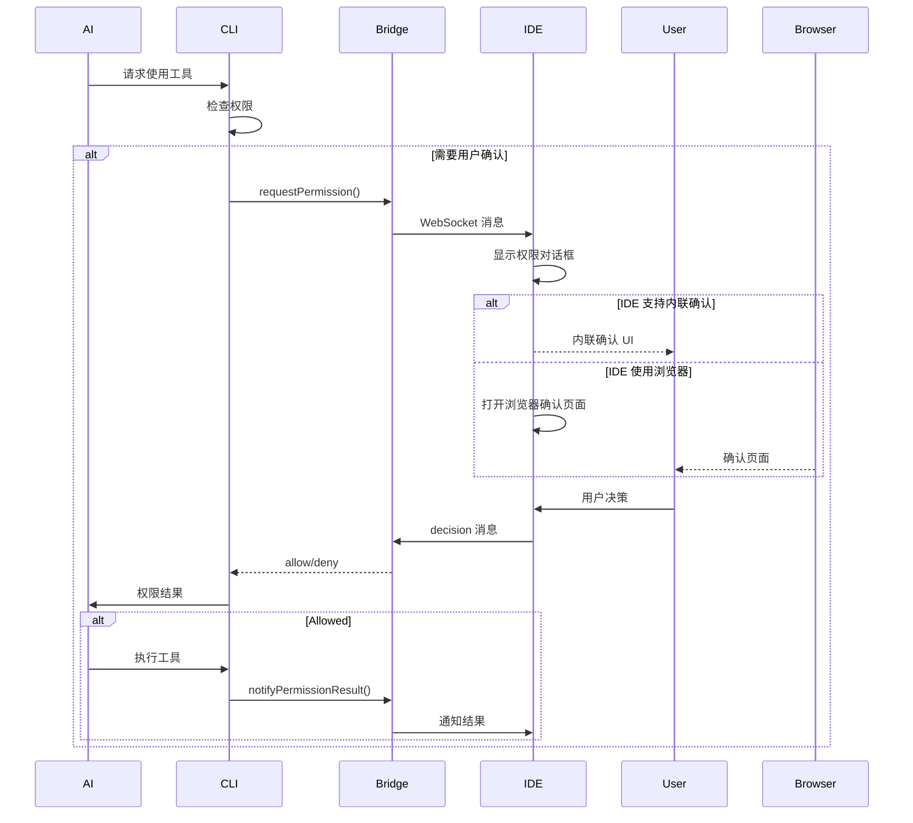

```typescript
/**
 * Bridge 权限回调
 */
export type BridgePermissionCallbacks = {
  /**
   * 请求权限
   */
  requestPermission: (
    toolName: string,
    input: unknown,
    metadata: {
      toolUseId: string
      requestId: string
      sessionId: string
      timestamp: number
    },
  ) => Promise<{
    allowed: boolean
    decision?: 'allow' | 'deny'
    allowAll?: boolean
  }>

  /**
   * 通知权限结果
   */
  notifyPermissionResult: (
    toolName: string,
    input: unknown,
    result: PermissionResult,
    metadata: {
      toolUseId: string
      requestId: string
    },
  ) => void
}

/**
 * Bridge 权限请求器
 */
export async function requestBridgePermission(
  callbacks: BridgePermissionCallbacks,
  tool: Tool,
  input: unknown,
  context: ToolUseContext,
): Promise<PermissionResult> {
  // 检查 Bridge 是否可用
  if (!callbacks.requestPermission) {
    // 回退到本地提示
    return await requestLocalPermission(tool, input, context)
  }

  const metadata = {
    toolUseId: context.toolUseId ?? generateId(),
    requestId: generateId(),
    sessionId: context.sessionId ?? 'unknown',
    timestamp: Date.now(),
  }

  try {
    // 通过 Bridge 请求权限
    const response = await callbacks.requestPermission(
      tool.name,
      sanitizeInputForBridge(input),
      metadata,
    )

    if (response.allowed) {
      // 处理 "allow all" 请求
      if (response.allowAll) {
        await addAllowAllRule(tool.name, input, context)
      }

      return {
        behavior: 'allow',
        source: 'bridge_approval',
        bridgeDecision: response.decision,
      }
    } else {
      return {
        behavior: 'block',
        message: 'Permission denied via IDE',
        source: 'bridge_denial',
      }
    }
  } catch (error) {
    // Bridge 不可用或出错，回退到本地
    console.error(`Bridge permission request failed: ${error}`)
    return await requestLocalPermission(tool, input, context)
  }
}

/**
 * 添加 "allow all" 规则
 */
async function addAllowAllRule(
  toolName: string,
  input: unknown,
  context: ToolUseContext,
): Promise<void> {
  // 创建规则：允许此工具的所有使用
  const rule: PermissionRule = toolName

  // 添加到用户规则
  context.setAppState(prev => ({
    ...prev,
    settings: {
      ...prev.settings,
      toolPermissionContext: {
        ...prev.settings.toolPermissionContext,
        alwaysAllowRules: [
          ...(prev.settings.toolPermissionContext.alwaysAllowRules ?? []),
          rule,
        ],
      },
    },
  }))
}
```

## 18.6 拒绝追踪与降级

### 18.6.1 拒绝计数器

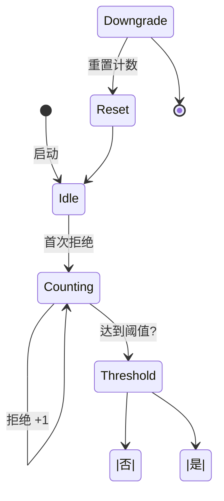

```typescript
/**
 * 拒绝追踪状态
 */
export type DenialTrackingState = {
  totalDenials: number
  toolDenials: Map<string, number>
  lastResetTime: number
  sessionStartTime: number
}

/**
 * 拒绝追踪器
 */
export class DenialTracker {
  private state: DenialTrackingState = {
    totalDenials: 0,
    toolDenials: new Map(),
    lastResetTime: Date.now(),
    sessionStartTime: Date.now(),
  }

  /**
   * 记录拒绝
   */
  track(toolName: string): void {
    // 增加总计数
    this.state.totalDenials++

    // 增加工具计数
    const count = this.state.toolDenials.get(toolName) ?? 0
    this.state.toolDenials.set(toolName, count + 1)

    // 检查阈值
    this.checkThreshold()
  }

  /**
   * 检查阈值并降级
   */
  private checkThreshold(): void {
    const threshold = this.getDenialThreshold()

    if (this.state.totalDenials >= threshold) {
      this.triggerDowngrade()
    }
  }

  /**
   * 获取拒绝阈值
   */
  private getDenialThreshold(): number {
    // 从 GrowthBook 获取配置
    return getGrowthBookValue('denial_threshold', 10)
  }

  /**
   * 触发降级
   */
  private triggerDowngrade(): void {
    const currentMode = getCurrentPermissionMode()

    // 降级路径
    const downgradePath: Record<string, PermissionMode> = {
      'default': 'auto',
      'auto': 'plan',
      'plan': 'plan',  // plan 是最安全模式，不再降级
      'bypassPermissions': 'auto',
    }

    const newMode = downgradePath[currentMode]

    if (newMode && newMode !== currentMode) {
      setPermissionMode(newMode)

      // 通知用户
      showNotification(
        `Too many permission denials (${this.state.totalDenials}). ` +
        `Switched to ${newMode} mode for safety.`,
        'warning',
      )

      // 重置计数
      this.reset()
    }
  }

  /**
   * 重置计数
   */
  reset(): void {
    this.state.totalDenials = 0
    this.state.toolDenials.clear()
    this.state.lastResetTime = Date.now()
  }

  /**
   * 获取报告
   */
  getReport(): DenialReport {
    const elapsed = Date.now() - this.state.sessionStartTime
    const elapsedMinutes = elapsed / 60000

    return {
      totalDenials: this.state.totalDenials,
      denialsPerMinute: this.state.totalDenials / elapsedMinutes,
      toolDenials: Object.fromEntries(this.state.toolDenials),
      sessionDuration: elapsedMinutes,
    }
  }
}
```

### 18.6.2 权限模式可视化

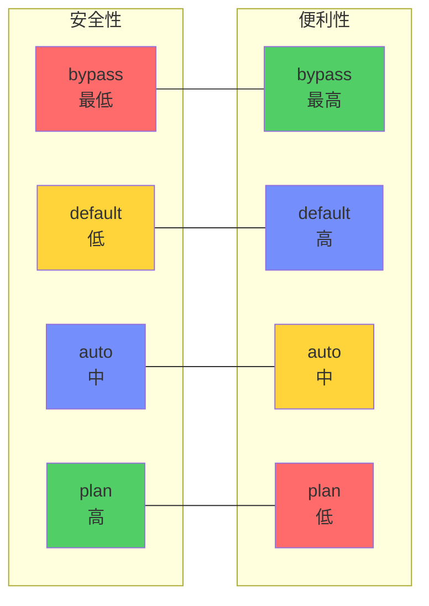

## 18.7 作者评价与设计反思

### 18.7.1 优势

1. **多层防护**
   - 规则引擎 + 钩子系统 + 权限模式
   - 任何一层都可以阻止危险操作

2. **灵活性**
   - 用户可自定义规则
   - 多种权限模式适应不同场景

3. **可审计性**
   - 拒绝追踪
   - 权限来源标记

4. **渐进增强**
   - 默认模式提供基础保护
   - 高级用户可配置自动模式

### 18.7.2 改进空间

1. **规则复杂性**
   - 当前规则语法对普通用户不够友好
   - 建议提供规则生成向导

2. **默认模式**
   - Default 模式可能过于谨慎
   - 建议引入"学习模式"自动生成规则

3. **钩子调试**
   - 钩子失败时的错误信息不够详细
   - 建议增加钩子执行日志

4. **权限传播**
   - 没有明确的权限继承机制
   - 建议考虑基于目录的权限规则

### 18.7.3 安全性分析

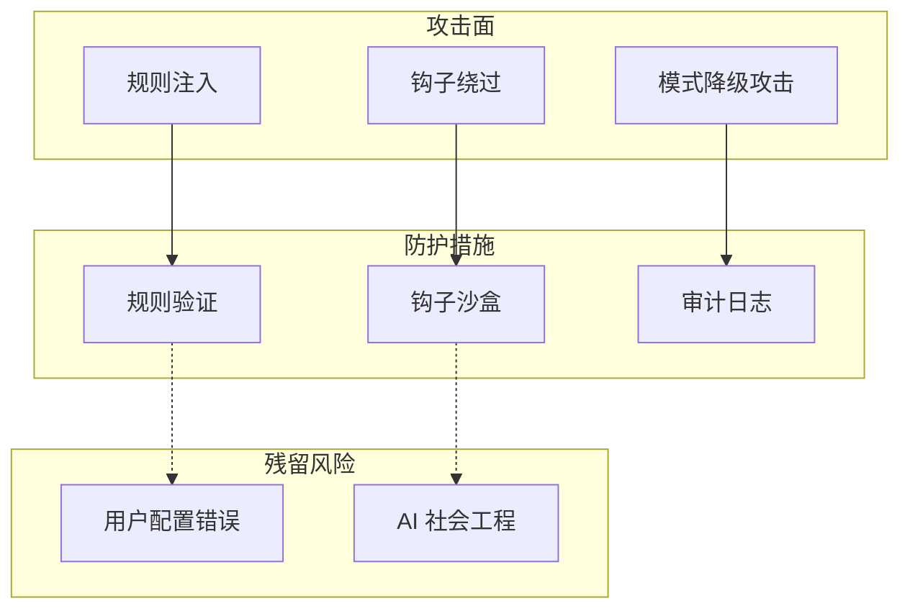

**风险缓解建议：**
1. 添加规则验证（防止规则冲突）
2. 钩子超时机制（防止无限循环）
3. 模式切换确认（防止意外降级）

## 18.8 可复用模式总结

### 模式 40：基于优先级的规则引擎

**描述：** 多层级规则匹配系统。

**适用场景：**
- 访问控制
- 内容过滤
- 决策引擎

**代码模板：**

```typescript
// 1. 规则类型
type Rule<T> = {
  priority: number
  condition: (input: T) => boolean
  action: (input: T) => ActionResult
  name?: string
}

// 2. 规则引擎
class RuleEngine<T> {
  private rules: Rule<T>[] = []

  addRule(rule: Rule<T>): void {
    this.rules.push(rule)
    // 按优先级排序
    this.rules.sort((a, b) => b.priority - a.priority)
  }

  execute(input: T): ActionResult | null {
    for (const rule of this.rules) {
      if (rule.condition(input)) {
        return rule.action(input)
      }
    }

    return null  // 没有匹配规则
  }

  // 移除规则
  removeRule(name: string): boolean {
    const index = this.rules.findIndex(r => r.name === name)
    if (index !== -1) {
      this.rules.splice(index, 1)
      return true
    }
    return false
  }
}

// 3. 使用
const engine = new RuleEngine<PermissionRequest>()

// 高优先级：拒绝规则
engine.addRule({
  priority: 100,
  condition: (req) => req.tool === 'Delete' && req.path.startsWith('/'),
  action: () => ({ behavior: 'deny', reason: 'System path' }),
  name: 'protect-system',
})

// 中优先级：允许规则
engine.addRule({
  priority: 50,
  condition: (req) => req.tool === 'Read',
  action: () => ({ behavior: 'allow' }),
  name: 'allow-reads',
})

// 低优先级：默认规则
engine.addRule({
  priority: 0,
  condition: () => true,
  action: () => ({ behavior: 'ask' }),
  name: 'default-ask',
})

// 执行
const result = engine.execute({ tool: 'Read', path: '/tmp/file' })
```

**关键点：**
1. 优先级排序
2. 短路求值
3. 默认规则

### 模式 41：可组合钩子系统

**描述：** 允许外部代码扩展权限检查的钩子系统。

**适用场景：**
- AOP 编程
- 插件系统
- 审计日志

**代码模板：**

```typescript
// 1. 钩子类型
type Hook<T> = (input: T) => HookResult | Promise<HookResult>

type HookResult =
  | { allow: true }
  | { allow: false; reason: string }
  | undefined  // 不干预

// 2. 钩子注册表
class HookRegistry<T> {
  private hooks: Hook<T>[] = []

  register(hook: Hook<T>): () => void {
    this.hooks.push(hook)

    // 返回取消函数
    return () => {
      const index = this.hooks.indexOf(hook)
      if (index !== -1) {
        this.hooks.splice(index, 1)
      }
    }
  }

  async execute(input: T): Promise<HookResult> {
    for (const hook of this.hooks) {
      try {
        const result = await hook(input)

        // 如果钩子返回决策，立即返回
        if (result !== undefined) {
          return result
        }
      } catch (error) {
        // 钩子失败不阻止执行
        console.error(`Hook failed: ${error}`)
      }
    }

    // 所有钩子都通过
    return { allow: true }
  }
}

// 3. 使用
const registry = new HookRegistry<PermissionRequest>()

// 注册钩子
const unregister1 = registry.register(async (req) => {
  if (req.tool === 'Delete' && req.path.includes('important')) {
    return { allow: false, reason: 'Important file' }
  }
})

const unregister2 = registry.register(async (req) => {
  // 记录审计日志
  await auditLog.log('permission_check', req)
})

// 执行
const result = await registry.execute({
  tool: 'Write',
  path: '/tmp/file',
})

if (!result.allow) {
  console.log('Blocked:', result.reason)
}

// 清理
unregister1()
unregister2()
```

**关键点：**
1. 链式执行
2. 短路返回
3. 错误隔离
4. 取消注册

## 本章小结

本章深入分析了 Claude Code 的权限系统设计：

1. **设计理念**：安全原则、威胁模型、多层防护
2. **权限模式**：Default、Plan、Auto、Bypass、Yolo、Headless 完整解析
3. **规则系统**：规则语法、匹配引擎、优先级、示例
4. **钩子系统**：类型定义、执行流程、应用场景
5. **UI 交互**：权限对话框、IDE 集成
6. **拒绝追踪**：计数器、降级机制
7. **作者评价**：优势、改进空间、安全性分析
8. **可复用模式**：规则引擎、钩子系统

## 下一章预告

第 19 章将深入分析 Ink UI 框架，包括渲染架构、核心组件、输入处理和组件设计模式。
