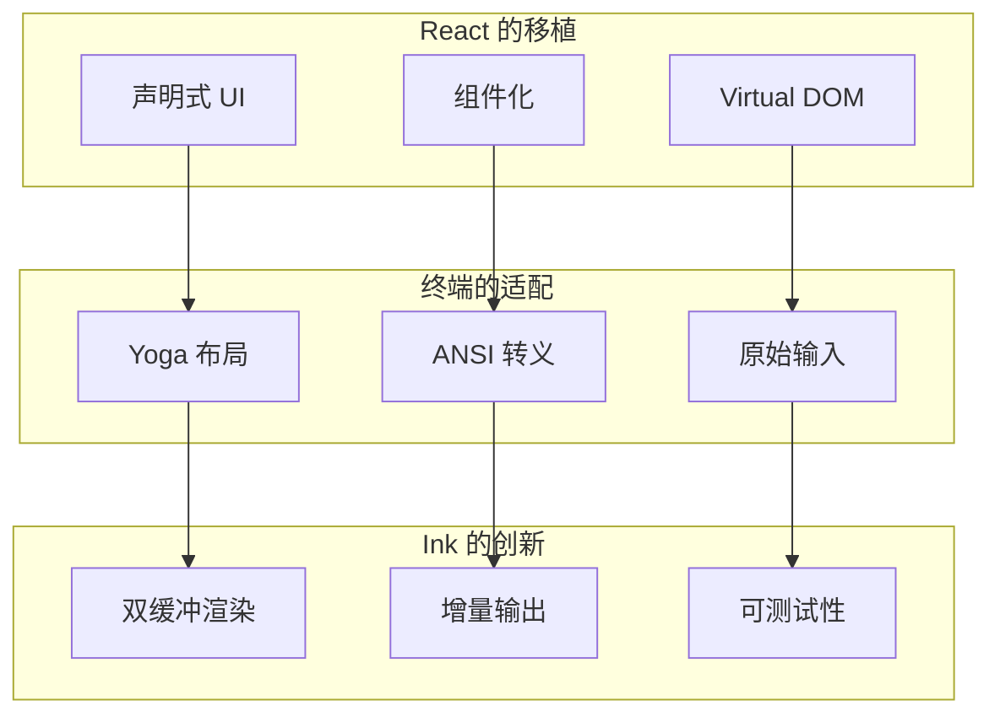
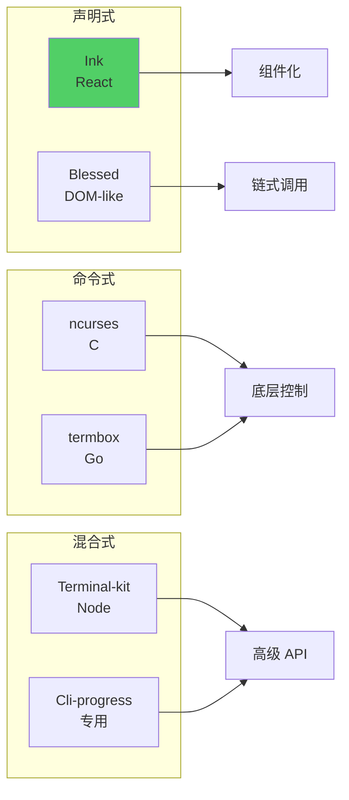
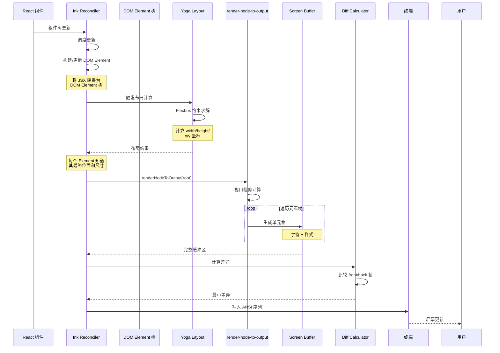
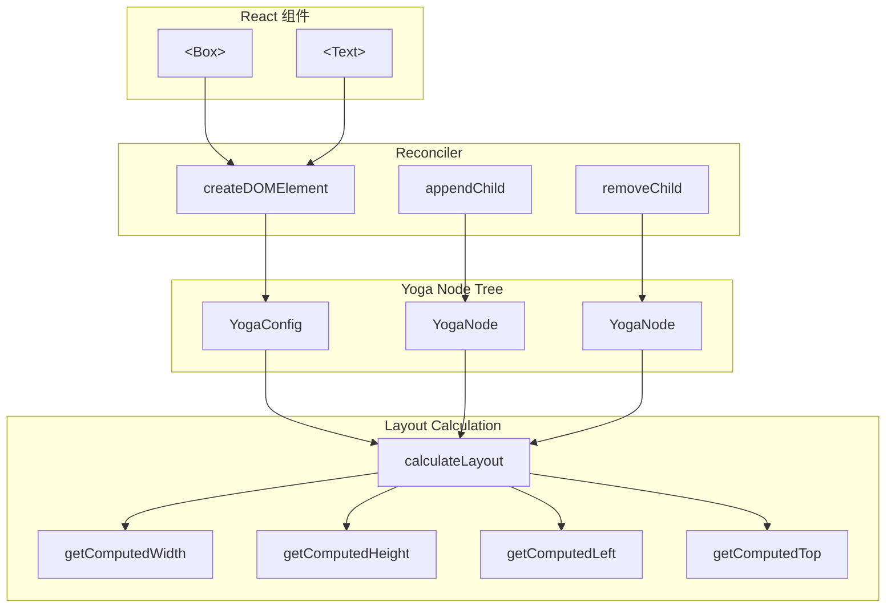
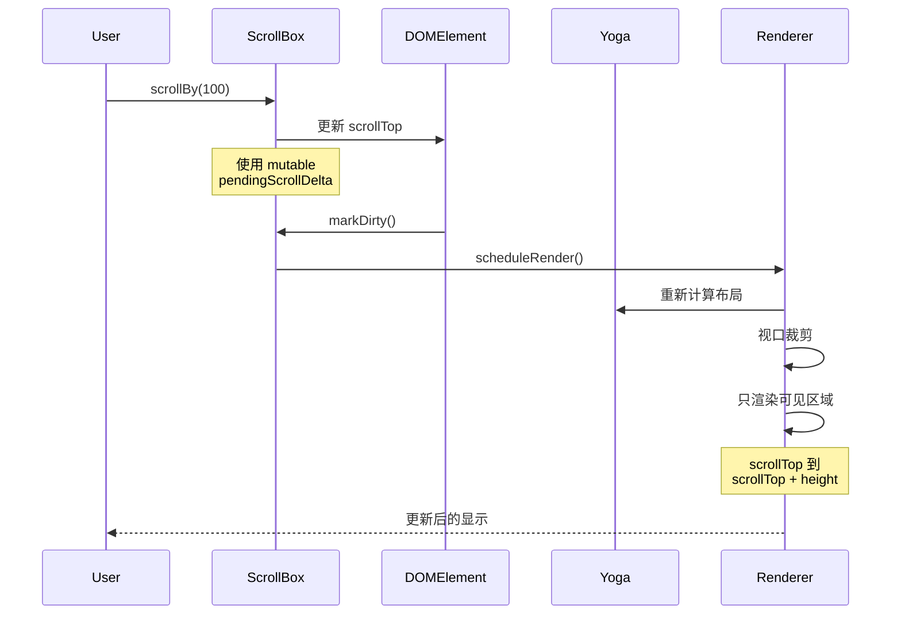
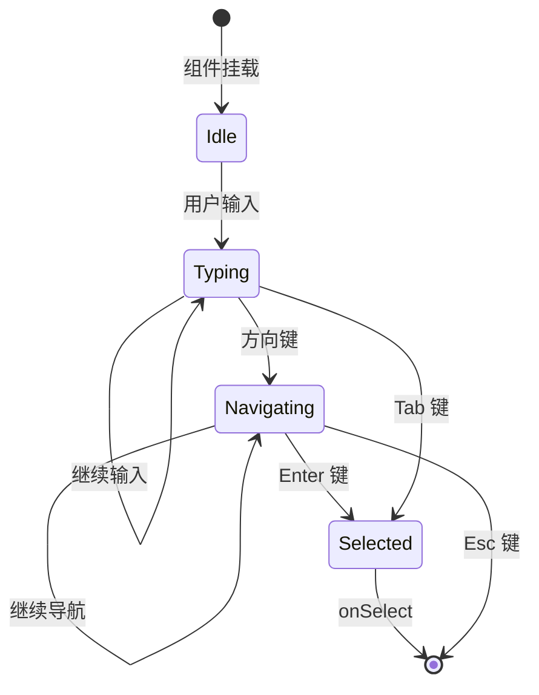
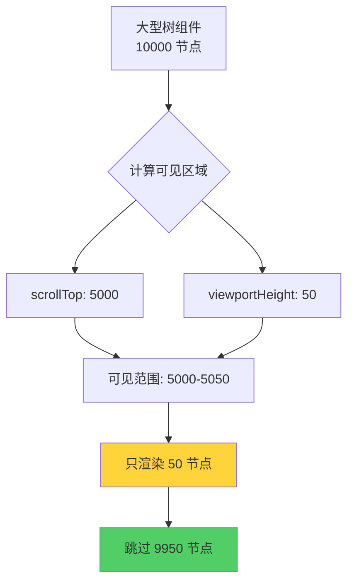

# 第 19 章：React/Ink UI 框架深度解析

> 本章目标：深入理解基于 Ink 的终端 UI 渲染机制、组件架构和性能优化技术。

## 19.1 Ink 框架概述

### 19.1.1 Ink 的设计哲学

Ink 是一个开创性的项目，它将 React 的声明式 UI 模型引入终端环境。其核心设计哲学包括：



**设计哲学对比：**

| 方面 | Web (React) | Terminal (Ink) |
|------|-------------|----------------|
| 渲染目标 | DOM 节点 | 终端屏幕 |
| 布局引擎 | CSS + 浏览器 | Yoga (Flexbox) |
| 输出格式 | HTML/CSS | ANSI 转义序列 |
| 事件系统 | DOM 事件 | stdin 原始输入 |
| 布局单位 | px, em, rem | 字符网格 |
| 样式继承 | CSS 级联 | Props 传递 |

### 19.1.2 Ink 的核心架构

```typescript
/**
 * Ink 核心类（概念性实现）
 */
export default class Ink {
  // ========== 终端管理 ==========
  private readonly terminal: {
    stdout: NodeJS.WriteStream
    stderr: NodeJS.WriteStream
    stdin: NodeJS.ReadStream
  }

  // ========== 渲染器 ==========
  private renderer: Renderer

  // ========== 双缓冲帧 ==========
  private frontFrame: Frame  // 当前显示的帧
  private backFrame: Frame   // 正在渲染的帧

  // ========== 性能优化：内存池 ==========
  private readonly stylePool: StylePool      // 复用样式对象
  private readonly charPool: CharPool        // 复用字符
  private readonly hyperlinkPool: HyperlinkPool

  // ========== 状态管理 ==========
  readonly focusManager: FocusManager
  readonly selection: SelectionState

  // ========== 选项 ==========
  private options: InkOptions

  constructor(options: InkOptions) {
    this.terminal = {
      stdout: options.stdout ?? process.stdout,
      stderr: options.stderr ?? process.stderr,
      stdin: options.stdin ?? process.stdin,
    }

    this.options = options

    // 初始化渲染器
    this.renderer = createRenderer(this.terminal.stdout)

    // 创建初始帧
    const { rows, columns } = getTerminalSize(this.terminal.stdout)
    this.frontFrame = createEmptyFrame(rows, columns)
    this.backFrame = createEmptyFrame(rows, columns)

    // 初始化焦点管理器
    this.focusManager = new FocusManager(this.terminal.stdin)

    // 初始化选择状态
    this.selection = createSelectionState(this.terminal.stdout)
  }

  /**
   * 渲染根节点
   */
  render(node: ReactNode): void {
    // 计算新帧
    const newFrame = this.renderer.render(node, {
      ...this.options,
      stdout: this.terminal.stdout,
    })

    // 计算差异
    const diff = computeFrameDiff(this.frontFrame, newFrame)

    // 应用差异到终端
    writeFrameDiff(this.terminal.stdout, diff)

    // 更新当前帧
    this.frontFrame = newFrame
  }
}
```

### 19.1.3 Ink 与其他 TUI 框架对比



| 特性 | Ink | Blessed | terminal-kit | ncurses |
|------|-----|---------|--------------|---------|
| 编程模型 | 声明式 | 链式 | 命令式 | 命令式 |
| 布局引擎 | Yoga | 内置 | 内置 | 手动 |
| 组件复用 | 高 | 中 | 低 | 无 |
| 学习曲线 | 陡（需 React） | 中 | 低 | 高 |
| 性能 | 中 | 高 | 高 | 最高 |
| 测试性 | 高 | 低 | 中 | 低 |

**作者观点：** Ink 的声明式模型是其最大优势，但也是最大劣势：
- **优势**：组件复用、状态管理、测试友好
- **劣势**：React 学习曲线、性能开销

对于简单的 CLI 工具，Blessed 或 terminal-kit 可能更合适。但对于复杂交互界面，Ink 的组件化优势明显。

## 19.2 渲染架构深度解析

### 19.2.1 完整渲染流程



### 19.2.2 DOM Element 树结构

```typescript
/**
 * DOM Element 类型（Ink 内部）
 */
export type DOMElement = {
  // 基本属性
  nodeName: string
  text?: string
  children: DOMElement[]

  // Yoga 节点引用
  yogaNode: Yoga.YogaNode

  // 样式
  style: Styles

  // 文本样式
  textStyles?: TextStyles

  // 事件处理器
  onClick?: (event: ClickEvent) => void
  onFocus?: (event: FocusEvent) => void
  onBlur?: (event: FocusEvent) => void
  onKeyDown?: (event: KeyboardEvent) => void

  // 焦点状态
  isFocused: boolean
  isFocusable: boolean

  // 自定义数据
  unstable_transform?: Transform
  unstable__static?: boolean

  // 内部状态
  internal_static: boolean
  internal_transform?: Transform
}

/**
 * Styles 类型（Yoga + 自定义）
 */
export type Styles = {
  // Flexbox 属性
  flexDirection?: 'row' | 'column'
  flexGrow?: number
  flexShrink?: number
  flexBasis?: number
  flexWrap?: 'nowrap' | 'wrap' | 'wrap-reverse'
  alignContent?: 'flex-start' | 'flex-end' | 'center' | 'stretch' | 'space-between' | 'space-around'
  alignItems?: 'flex-start' | 'flex-end' | 'center' | 'stretch' | 'baseline'
  justifyContent?: 'flex-start' | 'flex-end' | 'center' | 'stretch' | 'space-between' | 'space-around' | 'space-evenly'

  // 尺寸
  width?: number | string
  height?: number | string
  minWidth?: number
  minHeight?: number
  maxWidth?: number
  maxHeight?: number

  // 间距
  margin?: number
  marginTop?: number
  marginBottom?: number
  marginLeft?: number
  marginRight?: number
  marginX?: number
  marginY?: number
  padding?: number
  paddingTop?: number
  paddingBottom?: number
  paddingLeft?: number
  paddingRight?: number
  paddingX?: number
  paddingY?: number

  // 边框
  borderStyle?: 'single' | 'double' | 'round' | 'bold' | 'dashed' | 'dotted'
  borderColor?: Color

  // 文本
  textWrap?: 'wrap' | 'truncate' | 'truncate-start' | 'truncate-middle' | 'truncate-end'
  textAlign?: 'left' | 'center' | 'right'

  // 溢出
  overflow?: 'visible' | 'hidden' | 'scroll'
  overflowX?: 'visible' | 'hidden' | 'scroll'
  overflowY?: 'visible' | 'hidden' | 'scroll'

  // 定位
  position?: 'absolute' | 'relative'
  top?: number
  left?: number
  right?: number
  bottom?: number
  zIndex?: number

  // 自定义
  flexGrow?: number
  flexShrink?: number
}

/**
 * TextStyles 类型
 */
export type TextStyles = {
  color?: Color
  backgroundColor?: Color
  bold?: boolean
  dim?: boolean
  italic?: boolean
  underline?: boolean
  strikethrough?: boolean
  inverse?: boolean
  secret?: boolean
}
```

### 19.2.3 Yoga 布局引擎集成



```typescript
/**
 * Yoga 布局计算器
 */
export class YogaLayoutEngine {
  private config: Yoga.YogaConfig

  constructor() {
    this.config = Yoga.YogaConfig.create()
    this.config.setUseWebGCTrashProtection(false)
  }

  /**
   * 创建 Yoga 节点
   */
  createNode(element: DOMElement): Yoga.YogaNode {
    const node = Yoga.YogaNode.createWithConfig(this.config)

    // 应用 Flexbox 样式
    this.applyStyles(node, element.style)

    return node
  }

  /**
   * 应用样式到 Yoga 节点
   */
  private applyStyles(node: Yoga.YogaNode, style: Styles): void {
    // 主轴方向
    if (style.flexDirection) {
      node.setFlexDirection(
        style.flexDirection === 'row'
          ? Yoga.FlexDirection.Row
          : Yoga.FlexDirection.Column,
      )
    }

    // 增长/收缩
    if (style.flexGrow !== undefined) {
      node.setFlexGrow(style.flexGrow)
    }

    if (style.flexShrink !== undefined) {
      node.setFlexShrink(style.flexShrink)
    }

    // 对齐
    if (style.justifyContent) {
      node.setJustifyContent(
        this.mapJustifyContent(style.justifyContent),
      )
    }

    if (style.alignItems) {
      node.setAlignItems(
        this.mapAlignItems(style.alignItems),
      )
    }

    // 尺寸
    if (typeof style.width === 'number') {
      node.setWidth(style.width)
    } else if (style.width === '100%') {
      node.setWidthPercent(100)
    }

    if (typeof style.height === 'number') {
      node.setHeight(style.height)
    } else if (style.height === '100%') {
      node.setHeightPercent(100)
    }

    // 最小/最大尺寸
    if (style.minWidth !== undefined) {
      node.setMinWidth(style.minWidth)
    }

    if (style.maxWidth !== undefined) {
      node.setMaxWidth(style.maxWidth)
    }

    // 间距
    this.applySpacing(node, style)
  }

  /**
   * 应用间距（margin/padding）
   */
  private applySpacing(node: Yoga.YogaNode, style: Styles): void {
    // Margin
    if (style.margin !== undefined) {
      node.setMargin(Yoga.Edge.All, style.margin)
    }

    if (style.marginTop !== undefined || style.marginY !== undefined) {
      node.setMargin(Yoga.Edge.Top, style.marginTop ?? style.marginY ?? 0)
    }

    if (style.marginBottom !== undefined || style.marginY !== undefined) {
      node.setMargin(Yoga.Edge.Bottom, style.marginBottom ?? style.marginY ?? 0)
    }

    if (style.marginLeft !== undefined || style.marginX !== undefined) {
      node.setMargin(Yoga.Edge.Left, style.marginLeft ?? style.marginX ?? 0)
    }

    if (style.marginRight !== undefined || style.marginX !== undefined) {
      node.setMargin(Yoga.Edge.Right, style.marginRight ?? style.marginX ?? 0)
    }

    // Padding (Ink 自己管理，不设置到 Yoga)
  }

  /**
   * 执行布局计算
   */
  calculate(root: DOMElement, width: number, height: number): void {
    root.yogaNode.calculateLayout(width, height, Yoga.Direction.LTR)
  }

  /**
   * 获取计算后的布局
   */
  getLayout(node: Yoga.YogaNode): {
    left: number
    top: number
    width: number
    height: number
  } {
    return {
      left: node.getComputedLeft(),
      top: node.getComputedTop(),
      width: node.getComputedWidth(),
      height: node.getComputedHeight(),
    }
  }
}
```

### 19.2.4 增量渲染与差异计算

```typescript
/**
 * 帧差异计算器
 */
export class FrameDiffer {
  /**
   * 计算两帧之间的最小差异
   */
  compute(oldFrame: Frame, newFrame: Frame): Diff {
    const operations: DiffOperation[] = []

    // 快速路径：完全相同
    if (oldFrame === newFrame) {
      return { operations: [] }
    }

    // 比较每个单元格
    for (let y = 0; y < newFrame.height; y++) {
      for (let x = 0; x < newFrame.width; x++) {
        const oldCell = oldFrame.cells[y]?.[x]
        const newCell = newFrame.cells[y]?.[x]

        if (!this.cellsEqual(oldCell, newCell)) {
          operations.push({
            type: 'write',
            x,
            y,
            cell: newCell ?? EMPTY_CELL,
          })
        }
      }
    }

    // 计算光标移动
    const cursorOperations = this.optimizeCursorMovements(operations)

    return {
      operations: cursorOperations,
    }
  }

  /**
   * 单元格比较
   */
  private cellsEqual(a: Cell | undefined, b: Cell | undefined): boolean {
    if (a === b) return true
    if (!a || !b) return false

    return (
      a.char === b.char &&
      this.stylesEqual(a.style, b.style) &&
      a.hyperlink === b.hyperlink
    )
  }

  /**
   * 样式比较
   */
  private stylesEqual(a: CellStyle, b: CellStyle): boolean {
    const keys: (keyof CellStyle)[] = [
      'color', 'backgroundColor', 'bold', 'dim', 'italic',
      'underline', 'strikethrough', 'inverse',
    ]

    for (const key of keys) {
      if (a[key] !== b[key]) {
        return false
      }
    }

    return true
  }

  /**
   * 优化光标移动
   */
  private optimizeCursorMovements(operations: DiffOperation[]): DiffOperation[] {
    if (operations.length === 0) {
      return []
    }

    const optimized: DiffOperation[] = []
    let currentX = 0
    let currentY = 0

    for (const op of operations) {
      if (op.type === 'write') {
        // 计算光标移动距离
        const dx = op.x - currentX
        const dy = op.y - currentY

        // 如果距离较远，使用绝对定位
        if (Math.abs(dx) > 5 || Math.abs(dy) > 0) {
          optimized.push({
            type: 'move',
            x: op.x,
            y: op.y,
          })
        } else if (dx > 0) {
          // 短距离向右，使用空格
          optimized.push({
            type: 'write',
            x: currentX,
            y: currentY,
            cell: { ...EMPTY_CELL, char: ' '.repeat(dx) },
          })
        }

        // 写入实际字符
        optimized.push(op)
        currentX = op.x + 1
        currentY = op.y
      }
    }

    return optimized
  }
}
```

**作者观点：** 差异计算是 Ink 性能的关键。优化的重点：
1. 批量相邻变更（合并为单次写入）
2. 避免长距离光标移动
3. 利用终端的自动换行

## 19.3 核心组件深度分析

### 19.3.1 Box 组件详解

```typescript
/**
 * Box 组件实现（简化版）
 */
export function Box({
  children,
  // Flexbox
  flexDirection = 'row',
  flexGrow = 0,
  flexShrink = 1,
  flexWrap = 'nowrap',
  justifyContent,
  alignItems,
  // 尺寸
  width,
  height,
  minWidth,
  minHeight,
  maxWidth,
  maxHeight,
  // 间距
  padding,
  paddingTop,
  paddingBottom,
  paddingLeft,
  paddingRight,
  margin,
  marginTop,
  marginBottom,
  marginLeft,
  marginRight,
  gap,
  columnGap,
  rowGap,
  // 溢出
  overflow,
  overflowX,
  overflowY,
  // 边框
  borderStyle,
  borderColor,
  // 事件
  onClick,
  onFocus,
  onBlur,
  onKeyDown,
  // 焦点
  tabIndex,
  autoFocus,
  // 样式
  unstable_transform,
}: PropsWithChildren<BoxProps>): React.ReactNode {
  // 整合间距
  const paddingX = paddingLeft ?? paddingRight ?? padding ?? 0
  const paddingY = paddingTop ?? paddingBottom ?? padding ?? 0
  const marginX = marginLeft ?? marginRight ?? margin ?? 0
  const marginY = marginTop ?? marginBottom ?? margin ?? 0

  // 整合溢出
  const finalOverflowX = overflowX ?? overflow ?? 'visible'
  const finalOverflowY = overflowY ?? overflow ?? 'visible'

  // 焦点管理
  const domRef = useRef<DOMElement>(null)

  useEffect(() => {
    if (autoFocus && domRef.current) {
      domRef.current.focus()
    }
  }, [autoFocus])

  return (
    <ink-box
      ref={domRef}
      style={{
        // Flexbox
        flexDirection,
        flexGrow,
        flexShrink,
        flexWrap,
        justifyContent,
        alignItems,
        // 尺寸
        width,
        height,
        minWidth,
        minHeight,
        maxWidth,
        maxHeight,
        // 间距
        paddingX,
        paddingY,
        marginX,
        marginY,
        gap: columnGap ?? gap,
        rowGap: rowGap ?? gap,
        // 溢出
        overflowX: finalOverflowX,
        overflowY: finalOverflowY,
        // 边框
        borderStyle,
        borderColor,
        // 焦点
        tabIndex,
        unstable_transform,
      }}
      onClick={onClick}
      onFocus={onFocus}
      onBlur={onBlur}
      onKeyDown={onKeyDown}
    >
      {children}
    </ink-box>
  )
}
```

### 19.3.2 Text 组件详解

```typescript
/**
 * Text 组件实现（简化版）
 */
export function Text({
  color,
  backgroundColor,
  bold,
  dim,
  italic = false,
  underline = false,
  strikethrough = false,
  inverse = false,
  secret = false,
  wrap = 'wrap',
  children,
}: PropsWithChildren<TextProps>): React.ReactNode {
  // 空内容处理
  if (children === undefined || children === null) {
    return null
  }

  // 构建文本样式
  const textStyles: TextStyles = {}

  // 只设置已定义的样式属性（避免覆盖）
  if (color !== undefined) textStyles.color = color
  if (backgroundColor !== undefined) textStyles.backgroundColor = backgroundColor

  // 互斥样式：bold 和 dim
  if (bold) {
    textStyles.bold = true
  } else if (dim) {
    textStyles.dim = true
  }

  if (italic) textStyles.italic = true
  if (underline) textStyles.underline = true
  if (strikethrough) textStyles.strikethrough = true
  if (inverse) textStyles.inverse = true
  if (secret) textStyles.secret = true

  // 包装样式到 Box 中
  const wrapStyles: Record<string, Styles['textWrap']> = {
    wrap: 'wrap',
    truncate: 'truncate',
    'truncate-start': 'truncate-start',
    'truncate-middle': 'truncate-middle',
    'truncate-end': 'truncate-end',
  }

  return (
    <ink-text
      style={wrapStyles[wrap]}
      textStyles={textStyles}
    >
      {children}
    </ink-text>
  )
}

/**
 * 颜色类型
 */
export type Color =
  | string              // 十六进制：#FF0000
  | number              // ANSI 颜色代码：196
  | ColorName           // 预定义名称

export type ColorName =
  | 'black' | 'red' | 'green' | 'yellow' | 'blue' | 'magenta' | 'cyan' | 'white'
  | 'brightBlack' | 'brightRed' | 'brightGreen' | 'brightYellow'
  | 'brightBlue' | 'brightMagenta' | 'brightCyan' | 'brightWhite'
```

### 19.3.3 ScrollBox 组件实现



```typescript
/**
 * ScrollBox 组件（简化版）
 */
export function ScrollBox({
  children,
  scrollTop: externalScrollTop,
  onScroll,
  stickyScroll = false,
  ...style
}: PropsWithChildren<ScrollBoxProps>): React.ReactNode {
  const domRef = useRef<DOMElement>(null)
  const [, forceRender] = useState(0)

  // 处理滚动
  const scrollTo = useCallback((y: number) => {
    const el = domRef.current
    if (!el) return

    el.stickyScroll = false
    el.pendingScrollDelta = undefined
    el.scrollTop = Math.max(0, Math.floor(y))

    scrollMutated(el)
  }, [])

  const scrollBy = useCallback((dy: number) => {
    const el = domRef.current
    if (!el) return

    el.stickyScroll = false
    el.scrollTop = (el.scrollTop ?? 0) + Math.floor(dy)

    scrollMutated(el)
  }, [])

  const scrollToBottom = useCallback(() => {
    const el = domRef.current
    if (!el) return

    el.pendingScrollDelta = undefined
    el.stickyScroll = true

    markDirty(el)
    forceRender(n => n + 1)
  }, [])

  // 滚动变更处理
  function scrollMutated(el: DOMElement): void {
    // 通知轮询器跳过下次 tick
    markScrollActivity()
    markDirty(el)

    // 调度渲染
    queueMicrotask(() => {
      scheduleRenderFrom(el)
    })

    // 通知父组件
    onScroll?.(el.scrollTop ?? 0)
  }

  // 命令式 API
  useImperativeHandle(
    useRef<ScrollBoxHandle>(null),
    () => ({
      scrollTo,
      scrollBy,
      scrollToBottom,
      getScrollTop: () => domRef.current?.scrollTop ?? 0,
      getScrollHeight: () => domRef.current?.scrollHeight ?? 0,
      getViewportHeight: () => domRef.current?.clientHeight ?? 0,
      isSticky: () => domRef.current?.stickyScroll ?? false,
    }),
    [scrollTo, scrollBy, scrollToBottom],
  )

  // 同步外部 scrollTop
  useEffect(() => {
    if (externalScrollTop !== undefined) {
      scrollTo(externalScrollTop)
    }
  }, [externalScrollTop, scrollTo])

  return (
    <ink-box
      ref={domRef}
      style={{
        overflowX: 'scroll',
        overflowY: 'scroll',
        ...style,
      }}
      {...stickyScroll ? { stickyScroll: true } : {}}
    >
      <Box flexDirection="column" flexGrow={1} flexShrink={0}>
        {children}
      </Box>
    </ink-box>
  )
}
```

### 19.3.4 FuzzyPicker 组件实现



FuzzyPicker 的关键设计点：
1. **虚拟滚动**：只渲染可见项，支持大量数据
2. **键盘导航**：方向键 + Enter/Esc
3. **搜索过滤**：实时过滤输入
4. **预览支持**：侧边/底部预览面板

## 19.4 输入处理系统

### 19.4.1 useInput Hook 深度解析

```typescript
/**
 * useInput Hook 实现（简化版）
 */
export function useInput(
  inputHandler: (input: string, key: Key) => void,
  options: InputOptions = {},
): void {
  const {
    setRawMode,
    internal_exitOnCtrlC,
    internal_eventEmitter,
  } = useStdin()

  const isActive = options.isActive ?? true

  // 使用 useLayoutEffect 确保同步执行
  // 这确保 raw mode 在 commit 阶段设置，避免闪烁
  useLayoutEffect(() => {
    if (!isActive) {
      return
    }

    // 启用原始模式
    setRawMode(true)

    return () => {
      // 清理：禁用原始模式
      setRawMode(false)
    }
  }, [isActive, setRawMode])

  // 使用 useEventCallback 保持引用稳定
  const handleData = useEventCallback((event: InputEvent) => {
    if (!isActive) {
      return
    }

    const { input, key } = event

    // Ctrl+C 处理
    const shouldExit = input === 'c' && key.ctrl
    if (shouldExit && internal_exitOnCtrlC) {
      return  // 让默认处理器处理
    }

    // 调用用户处理器
    inputHandler(input, key)
  })

  // 订阅输入事件
  useEffect(() => {
    if (!isActive) {
      return
    }

    internal_eventEmitter?.on('input', handleData)

    return () => {
      internal_eventEmitter?.removeListener('input', handleData)
    }
  }, [isActive, internal_eventEmitter, handleData])
}
```

### 19.4.2 键盘事件解析

```typescript
/**
 * 输入解析器
 */
export class InputParser {
  /**
   * 解析原始输入为键事件
   */
  parse(input: string, chunk: Buffer): Key {
    const key: Key = {
      upArrow: false,
      downArrow: false,
      leftArrow: false,
      rightArrow: false,
      ctrl: false,
      shift: false,
      meta: false,
      return: false,
      escape: false,
      delete: false,
      backspace: false,
      tab: false,
      pageUp: false,
      pageDown: false,
      home: false,
      end: false,
    }

    // 检测控制键
    if (chunk) {
      const code = chunk[0]

      // Ctrl 键检测（ASCII 控制字符）
      if (code >= 1 && code <= 26) {
        key.ctrl = true
      }

      // 特殊键检测（ANSI 转义序列）
      if (input.startsWith('\x1b[')) {
        // 方向键
        if (input === '\x1b[A') key.upArrow = true
        if (input === '\x1b[B') key.downArrow = true
        if (input === '\x1b[C') key.rightArrow = true
        if (input === '\x1b[D') key.leftArrow = true

        // 功能键
        if (input === '\x1b[5~') key.pageUp = true
        if (input === '\x1b[6~') key.pageDown = true
        if (input === '\x1b[H') key.home = true
        if (input === '\x1b[F') key.end = true
      }

      // 删除键
      if (input === '\x7f' || input === '\x08') {
        key.backspace = true
      }

      // Tab 键
      if (input === '\t') {
        key.tab = true
      }

      // Enter 键
      if (input === '\r' || input === '\n') {
        key.return = true
      }

      // Escape 键
      if (input === '\x1b' && input.length === 1) {
        key.escape = true
      }

      // Shift 检测（需要终端支持）
      // key.shift = ...
    }

    // Meta 键检测（Command on macOS, Windows key on Windows）
    key.meta = false  // 需要终端支持

    return key
  }
}
```

### 19.4.3 终端焦点管理

```typescript
/**
 * 焦点管理器
 */
export class FocusManager {
  private focusedElement: DOMElement | null = null
  private focusableElements: Set<DOMElement> = new Set()

  /**
   * 注册可聚焦元素
   */
  register(element: DOMElement): () => void {
    this.focusableElements.add(element)

    return () => {
      this.focusableElements.delete(element)
      if (this.focusedElement === element) {
        this.focusedElement = null
      }
    }
  }

  /**
   * 聚焦元素
   */
  focus(element: DOMElement): void {
    if (this.focusedElement) {
      this.focusedElement.isFocused = false
    }

    element.isFocused = true
    this.focusedElement = element
  }

  /**
   * 失焦当前元素
   */
  blur(): void {
    if (this.focusedElement) {
      this.focusedElement.isFocused = false
      this.focusedElement = null
    }
  }

  /**
   * 获取当前聚焦元素
   */
  getFocused(): DOMElement | null {
    return this.focusedElement
  }

  /**
   * 处理键盘导航
   */
  handleKey(key: Key): boolean {
    if (key.tab) {
      // Tab 切换焦点
      const elements = Array.from(this.focusableElements)

      if (elements.length === 0) {
        return false
      }

      const currentIndex = this.focusedElement
        ? elements.indexOf(this.focusedElement)
        : -1

      const direction = key.shift ? -1 : 1
      const nextIndex = (currentIndex + direction + elements.length) % elements.length

      this.focus(elements[nextIndex])
      return true
    }

    return false
  }
}
```

## 19.5 性能优化技术

### 19.5.1 React Compiler 集成

```typescript
/**
 * React Compiler 优化示例
 */

// ❌ 编译前：需要手动优化
export function MessageListBefore({ messages }: {
  messages: Message[]
}) {
  // 每次渲染都重新创建
  const total = messages.reduce((sum, m) => sum + m.tokens, 0)

  // 每次渲染都创建新函数
  const handleClick = (id: string) => {
    console.log('Clicked', id)
  }

  return (
    <Box>
      <Text>Total: {total}</Text>
      {messages.map(m => (
        <Box key={m.id} onClick={() => handleClick(m.id)}>
          <Text>{m.content}</Text>
        </Box>
      ))}
    </Box>
  )
}

// ✅ 编译后：自动优化
// React Compiler 自动检测依赖并优化
export function MessageListAfter({ messages }: {
  messages: Message[]
}) {
  // Compiler 自动记忆化
  const total = messages.reduce((sum, m) => sum + m.tokens, 0)

  // Compiler 自动提取稳定回调
  const handleClick = (id: string) => {
    console.log('Clicked', id)
  }

  return (
    <Box>
      <Text>Total: {total}</Text>
      {messages.map(m => (
        <Box key={m.id} onClick={() => handleClick(m.id)}>
          <Text>{m.content}</Text>
        </Box>
      ))}
    </Box>
  )
}
```

**React Compiler 的优势：**
1. **自动记忆化**：无需手动使用 useMemo/useCallback
2. **依赖跟踪**：自动检测组件依赖
3. **零开销**：编译时优化，运行时无额外成本

### 19.5.2 视口裁剪优化



```typescript
/**
 * 视口裁剪优化器
 */
export class ViewportCuller {
  /**
   * 计算可见元素
   */
  getVisibleElements<T extends { layout: Layout }>(
    elements: T[],
    scrollTop: number,
    viewportHeight: number,
  ): T[] {
    const visible: T[] = []

    for (const element of elements) {
      const { top, height } = element.layout

      // 完全在视口上方
      if (top + height < scrollTop) {
        continue
      }

      // 完全在视口下方
      if (top > scrollTop + viewportHeight) {
        break  // 后续元素更靠下
      }

      visible.push(element)
    }

    return visible
  }

  /**
   * 计算缓冲区元素（平滑滚动）
   */
  getVisibleElementsWithBuffer<T extends { layout: Layout }>(
    elements: T[],
    scrollTop: number,
    viewportHeight: number,
    bufferRatio = 0.5,
  ): T[] {
    const bufferSize = Math.floor(viewportHeight * bufferRatio)

    const topThreshold = Math.max(0, scrollTop - bufferSize)
    const bottomThreshold = scrollTop + viewportHeight + bufferSize

    return elements.filter(element => {
      const { top, height } = element.layout
      return top + height >= topThreshold && top <= bottomThreshold
    })
  }
}
```

### 19.5.3 渲染批处理

```typescript
/**
 * 渲染批处理器
 */
export class RenderBatcher {
  private scheduled = false
  private updates: Set<() => void> = new Set()

  /**
   * 调度更新
   */
  schedule(update: () => void): void {
    this.updates.add(update)

    if (!this.scheduled) {
      this.scheduled = true

      // 使用 queueMicrotask 批处理
      queueMicrotask(() => {
        this.flush()
      })
    }
  }

  /**
   * 刷新所有待处理更新
   */
  private flush(): void {
    this.scheduled = false

    // 批量执行所有更新
    for (const update of this.updates) {
      try {
        update()
      } catch (error) {
        console.error('Render update failed:', error)
      }
    }

    this.updates.clear()
  }
}

/**
 * 使用示例
 */
const batcher = new RenderBatcher()

// 多次状态更新
setAppState(prev => ({ ...prev, count: prev.count + 1 }))
setAppState(prev => ({ ...prev, name: 'test' }))
setAppState(prev => ({ ...prev, flag: true }))

// 只触发一次重新渲染
```

## 19.6 作者评价与设计反思

### 19.6.1 优势

1. **React 生态复用**
   - 可以使用 React DevTools
   - 可以使用 React Compiler
   - 大量现成的组件模式

2. **声明式 UI**
   - 代码更易读
   - 状态管理清晰
   - 测试简单

3. **类型安全**
   - TypeScript 完整支持
   - Props 类型检查
   - 减少 runtime 错误

### 19.6.2 劣势

1. **性能开销**
   - Virtual DOM 计算
   - Reconciler 调度
   - Yoga 布局计算

2. **学习曲线**
   - 需要 React 知识
   - Flexbox 概念
   - Hooks 理解

3. **调试困难**
   - 终端输出难以调试
   - 没有 DOM Inspector
   - 错误堆栈复杂

### 19.6.3 改进建议

1. **性能监控**
   - 添加渲染时间分析
   - 提供性能 Profiler

2. **调试工具**
   - 组件树可视化
   - 布局边界显示
   - 热重载支持

3. **文档改进**
   - 更多布局示例
   - 常见问题解答
   - 性能最佳实践

## 19.7 可复用模式总结

### 模式 42：终端组件设计模式

**描述：** 构建可复用的终端 UI 组件。

**代码模板：**

```typescript
// 1. Props 类型定义
export type TerminalComponentProps<T = unknown> = {
  // 主要内容
  children?: ReactNode
  // 可选样式
  style?: Partial<Styles>
  // 主题颜色
  color?: keyof Theme | ((theme: Theme) => string)
  // 状态
  disabled?: boolean
  loading?: boolean
  // 事件
  onPress?: (data: T) => void
  // 尺寸
  size?: 'small' | 'medium' | 'large'
  // 变体
  variant?: 'primary' | 'secondary' | 'ghost'
}

// 2. 组件实现
export function TerminalComponent<T = unknown>({
  children,
  style,
  color,
  disabled = false,
  loading = false,
  onPress,
  size = 'medium',
  variant = 'primary',
  ...props
}: PropsWithChildren<TerminalComponentProps<T>>): React.ReactNode {
  const theme = useTheme()
  const [focused, setFocused] = useState(false)

  // 尺寸映射
  const sizeStyles = SIZE_MAP[size]
  const variantStyles = VARIANT_STYLES[variant]

  // 解析颜色
  const resolvedColor = typeof color === 'function'
    ? color(theme)
    : color
      ? theme[color]
      : theme.text

  // 组合样式
  const combinedStyles: Styles = {
    ...sizeStyles,
    ...variantStyles,
    ...style,
  }

  // 输入处理
  useInput((input, key) => {
    if (disabled || !focused) return

    if (key.return && onPress) {
      onPress(undefined as T)
    }
  }, { isActive: focused })

  // 加载状态
  if (loading) {
    return (
      <Box {...combinedStyles}>
        <Text dimColor>Loading…</Text>
      </Box>
    )
  }

  // 禁用状态
  if (disabled) {
    return (
      <Box {...combinedStyles}>
        <Text dimColor>{children}</Text>
      </Box>
    )
  }

  // 正常状态
  return (
    <Box
      {...combinedStyles}
      onFocus={() => setFocused(true)}
      onBlur={() => setFocused(false)}
    >
      <Text color={focused ? resolvedColor : 'text'}>
        {focused && variant === 'primary' ? '> ' : ''}{children}
      </Text>
    </Box>
}

// 3. 样式常量
const SIZE_MAP: Record<string, Partial<Styles>> = {
  small: { paddingX: 1, paddingY: 0 },
  medium: { paddingX: 2, paddingY: 1 },
  large: { paddingX: 3, paddingY: 2 },
}

const VARIANT_STYLES: Record<string, Partial<Styles>> = {
  primary: {
    backgroundColor: (theme: Theme) => theme.claude,
    color: (theme: Theme) => theme.inverseText,
  },
  secondary: {
    borderStyle: 'single',
  },
  ghost: {},
}
```

**关键点：**
1. 类型化的 Props
2. 主题集成
3. 状态管理
4. 键盘交互
5. 尺寸/变体系统

### 模式 43：布局抽象模式

**描述：** 封装常用布局模式为可复用组件。

**代码模板：**

```typescript
// 1. 列表布局
export function ListLayout({
  items,
  renderItem,
  keyExtractor,
  spacing = 1,
  direction = 'column',
}: {
  items: T[]
  renderItem: (item: T, index: number) => ReactNode
  keyExtractor: (item: T) => string
  spacing?: number
  direction?: 'row' | 'column'
}): React.ReactNode {
  return (
    <Box flexDirection={direction} gap={spacing}>
      {items.map((item, index) => (
        <Box key={keyExtractor(item)}>
          {renderItem(item, index)}
        </Box>
      ))}
    </Box>
  )
}

// 2. 网格布局
export function GridLayout({
  items,
  renderItem,
  keyExtractor,
  columns,
  gap = 1,
}: {
  items: T[]
  renderItem: (item: T) => ReactNode
  keyExtractor: (item: T) => string
  columns: number
  gap?: number
}): React.ReactNode {
  const rows = []
  for (let i = 0; i < items.length; i += columns) {
    const rowItems = items.slice(i, i + columns)
    rows.push(
      <Box key={keyExtractor(items[i])} flexDirection="row" gap={gap}>
        {rowItems.map(item => (
          <Box key={keyExtractor(item)} flexGrow={1}>
            {renderItem(item)}
          </Box>
        ))}
      </Box>
    )
  }

  return (
    <Box flexDirection="column" gap={gap}>
      {rows}
    </Box>
  )
}

// 3. 标签页布局
export function Tabs({
  tabs,
  activeTab,
  onChange,
  variant = 'line',
}: {
  tabs: Array<{ id: string; label: string; icon?: string }>
  activeTab: string
  onChange: (tabId: string) => void
  variant?: 'line' | 'box'
}): React.ReactNode {
  const theme = useTheme()

  return (
    <Box flexDirection="row" gap={1}>
      {tabs.map(tab => {
        const isActive = tab.id === activeTab
        return (
          <Text
            key={tab.id}
            color={isActive ? theme.claude : theme.inactive}
            underline={variant === 'line' && isActive}
            bold={isActive}
            onPress={() => onChange(tab.id)}
          >
            {tab.icon && `${tab.icon} `}
            {tab.label}
          </Text>
        )
      })}
    </Box>
  )
}
```

## 本章小结

本章深入分析了 React/Ink UI 框架：

1. **框架概述**：设计哲学、核心架构、与 TUI 框架对比
2. **渲染架构**：完整流程、DOM 树、Yoga 布局、差异计算
3. **核心组件**：Box、Text、ScrollBox、FuzzyPicker 深度解析
4. **输入系统**：useInput Hook、键盘解析、焦点管理
5. **性能优化**：React Compiler、视口裁剪、批处理
6. **作者评价**：优势分析、劣势分析、改进建议
7. **可复用模式**：终端组件设计、布局抽象

## 下一章预告

第 20 章将深入分析组件系统，包括设计系统组件、业务组件、主题系统和组件通信模式。
