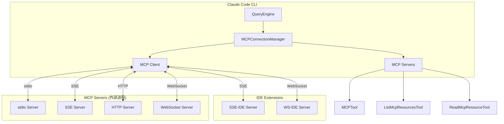

# 第 19 章：MCP 集成

> 本章目标：深入理解模型上下文协议（MCP）的集成实现。

## 19.1 MCP 架构



### MCP 配置类型

```typescript
// src/services/mcp/types.ts
export type McpServerConfig =
  | McpStdioServerConfig     // stdio 进程
  | McpSSEServerConfig        // SSE 服务器
  | McpSSEIDEServerConfig     // IDE SSE (内部)
  | McpWebSocketIDEServerConfig  // IDE WebSocket (内部)
  | McpHTTPServerConfig       // HTTP 服务器
  | McpWebSocketServerConfig  // WebSocket 服务器
  | McpSdkServerConfig        // SDK 服务器（内部）
  | McpClaudeAIProxyServerConfig  // Claude.ai 代理

// stdio 配置
export type McpStdioServerConfig = {
  type: 'stdio'
  command: string
  args: string[]
  env?: Record<string, string>
}

// SSE 配置
export type McpSSEServerConfig = {
  type: 'sse'
  url: string
  headers?: Record<string, string>
  oauth?: {
    clientId?: string
    callbackPort?: number
    authServerMetadataUrl?: string
    xaa?: boolean
  }
}

// IDE SSE 配置
export type McpSSEIDEServerConfig = {
  type: 'sse-ide'
  url: string
  ideName: string
  ideRunningInWindows?: boolean
}
```

### 配置来源

```typescript
// src/services/mcp/config.ts
export type ConfigScope =
  | 'local'      // 项目级 .claude/mcp.json
  | 'user'       // 用户级 ~/.config/claude/mcp.json
  | 'project'    // 项目级（已弃用，改用 local）
  | 'dynamic'    // 动态发现
  | 'enterprise' // 企业级
  | 'claudeai'   // Claude.ai 远程
  | 'managed'    // 管理式

export function getMcpConfig(): Promise<McpServerConfig[]> {
  const configs: McpServerConfig[] = []

  // 1. 从本地文件加载
  for (const scope of ['local', 'user'] as const) {
    const scopeConfigs = await loadScopeConfig(scope)
    configs.push(...scopeConfigs)
  }

  // 2. 从环境变量加载
  const envConfigs = loadEnvConfigs()
  configs.push(...envConfigs)

  // 3. 从 Claude.ai 加载
  const claudeaiConfigs = await loadClaudeAIConfigs()
  configs.push(...claudeaiConfigs)

  return deduplicateConfigs(configs)
}

async function loadScopeConfig(scope: ConfigScope): Promise<McpServerConfig[]> {
  const configPath = getConfigPath(scope)
  try {
    const raw = await readFile(configPath, 'utf-8')
    const parsed = JSON.parse(raw)
    return parsed.mcpServers ?? []
  } catch {
    return []
  }
}
```

## 19.2 MCP 客户端

### 客户端初始化

```typescript
// src/services/mcp/client.ts
import { Client } from '@modelcontextprotocol/sdk/client/index.js'
import { StdioClientTransport } from '@modelcontextprotocol/sdk/client/stdio.js'
import { SSEClientTransport } from '@modelcontextprotocol/sdk/client/sse.js'

export type McpClientWrapper = {
  name: string
  config: McpServerConfig
  client: Client
  transport: Transport
  connect(): Promise<void>
  disconnect(): Promise<void>
  isConnected(): boolean
}

export async function createMcpClient(
  config: McpServerConfig,
  name: string,
): Promise<McpClientWrapper> {
  let transport: Transport

  switch (config.type) {
    case 'stdio': {
      transport = new StdioClientTransport({
        command: config.command,
        args: config.args,
        env: {
          ...process.env,
          ...config.env,
        },
      })
      break
    }

    case 'sse': {
      transport = new SSEClientTransport(
        new URL(config.url),
        {
          headers: config.headers,
        },
      )
      break
    }

    case 'sse-ide':
    case 'ws-ide': {
      // IDE 特殊传输
      transport = await createIDETransport(config)
      break
    }

    default:
      throw new Error(`Unsupported transport type: ${(config as any).type}`)
  }

  const client = new Client({
    name,
    version: '1.0.0',
  }, {
    capabilities: {},
  })

  return {
    name,
    config,
    client,
    transport,
    async connect() {
      await client.connect(transport)
    },

    async disconnect() {
      await client.close()
    },

    isConnected() {
      // 检查连接状态
      return true
    },
  }
}
```

### 工具发现

```typescript
// src/services/mcp/useManageMCPConnections.ts
export async function discoverMcpTools(
  clientWrapper: McpClientWrapper,
): Promise<Tool[]> {
  const { client } = clientWrapper
  const tools: Tool[] = []

  try {
    // 列出所有工具
    const response = await client.listTools()

    for (const toolSchema of response.tools) {
      const tool: Tool = {
        name: toolSchema.name,
        description: toolSchema.description,
        inputJSONSchema: toolSchema.inputSchema,
        handler: async (input, context) => {
          // 调用 MCP 工具
          const result = await client.callTool({
            name: toolSchema.name,
            arguments: input,
          })

          return {
            type: 'success',
            output: JSON.stringify(result.content),
          }
        },
      }

      tools.push(tool)
    }
  } catch (error) {
    // 处理错误
  }

  return tools
}

export async function discoverMcpResources(
  clientWrapper: McpClientWrapper,
): Promise<Record<string, ServerResource[]>> {
  const { client } = clientWrapper

  try {
    const response = await client.listResources()

    const resources: Record<string, ServerResource[]> = {}
    for (const resource of response.resources) {
      const uri = new URL(resource.uri)
      const key = uri.host || 'default'

      resources[key] = resources[key] || []
      resources[key].push(resource)
    }

    return resources
  } catch {
    return {}
  }
}

export async function discoverMcpPrompts(
  clientWrapper: McpClientWrapper,
): Promise<Prompt[]> {
  const { client } = clientWrapper

  try {
    const response = await client.listPrompts()
    return response.prompts
  } catch {
    return []
  }
}
```

## 19.3 MCPTool 实现

### 工具封装

```typescript
// src/tools/MCPTool/MCPTool.ts
export function createMCPTool(
  serverName: string,
  toolName: string,
  description: string,
  inputSchema: unknown,
): Tool {
  return {
    name: `${serverName}/${toolName}`,
    description,
    inputJSONSchema: inputSchema,
    handler: async (input, context) => {
      // 获取 MCP 客户端
      const mcpContext = context.toolPermissionContext.mcpServers?.[serverName]
      if (!mcpContext) {
        return {
          type: 'error',
          output: `MCP server ${serverName} not found`,
        }
      }

      const client = mcpContext.client
      if (!client) {
        return {
          type: 'error',
          output: `MCP server ${serverName} not connected`,
        }
      }

      try {
        // 调用工具
        const result = await client.callTool({
          name: toolName,
          arguments: input,
        })

        // 处理结果
        return {
          type: 'success',
          output: formatMCPResult(result),
        }
      } catch (error) {
        return {
          type: 'error',
          output: `MCP tool error: ${errorMessage(error)}`,
        }
      }
    },
  }
}

function formatMCPResult(result: CallToolResult): string {
  const parts: string[] = []

  for (const content of result.content) {
    if (content.type === 'text') {
      parts.push(content.text)
    } else if (content.type === 'image') {
      parts.push(`[Image: ${content.data}...`)
    } else if (content.type === 'resource') {
      parts.push(`[Resource: ${content.uri}]`)
    }
  }

  return parts.join('\n')
}
```

### 工具权限

```typescript
// src/services/mcp/channelPermissions.ts
export type McpChannelPermissions = {
  allowList?: string[]  // 允许的工具列表
  denyList?: string[]   // 拒绝的工具列表
}

export function checkMcpToolPermission(
  serverName: string,
  toolName: string,
  permissions: McpChannelPermissions,
): { allowed: boolean; reason?: string } {
  const fullName = `${serverName}/${toolName}`

  // 检查拒绝列表
  if (permissions.denyList?.some(pattern => matchesPattern(fullName, pattern))) {
    return {
      allowed: false,
      reason: `Tool ${fullName} is denied by channel permissions`,
    }
  }

  // 检查允许列表
  if (permissions.allowList && permissions.allowList.length > 0) {
    if (!permissions.allowList.some(pattern => matchesPattern(fullName, pattern))) {
      return {
        allowed: false,
        reason: `Tool ${fullName} is not in allow list`,
      }
    }
  }

  return { allowed: true }
}

function matchesPattern(name: string, pattern: string): boolean {
  // 支持 glob 模式
  if (pattern.includes('*')) {
    const regex = new RegExp(
      '^' + pattern.replace(/\*/g, '.*').replace(/\?/g, '.') + '$'
    )
    return regex.test(name)
  }
  return name === pattern
}
```

## 19.4 MCP 服务器

### 服务器创建

```typescript
// src/entrypoints/mcp.ts
import { Server } from '@modelcontextprotocol/sdk/server/index.js'
import { StdioServerTransport } from '@modelcontextprotocol/sdk/server/stdio.js'

export async function createMCPServer(
  name: string,
  version: string,
): Promise<Server> {
  const server = new Server(
    {
      name,
      version,
    },
    {
      capabilities: {
        tools: {},
        resources: {},
        prompts: {},
      },
    },
  )

  // 注册工具
  server.setRequestHandler(ListToolsRequestSchema, async () => ({
    tools: [
      {
        name: 'custom_tool',
        description: 'A custom tool',
        inputSchema: z.object({
          param: z.string(),
        }).parse(),
      },
    ],
  }))

  // 注册工具调用处理器
  server.setRequestHandler(CallToolRequestSchema, async (request) => {
    const { name, arguments: args } = request.params

    switch (name) {
      case 'custom_tool':
        return {
          content: [{
            type: 'text',
            text: `Processed: ${args.param}`,
          }],
        }

      default:
        throw new Error(`Unknown tool: ${name}`)
    }
  })

  // 连接传输层
  const transport = new StdioServerTransport()
  await server.connect(transport)

  return server
}
```

### 资源暴露

```typescript
// 资源注册
server.setRequestHandler(ListResourcesRequestSchema, async () => ({
  resources: [
    {
      uri: 'file:///project/README.md',
      name: 'README',
      description: 'Project README',
      mimeType: 'text/markdown',
    },
    {
      uri: 'config:///settings',
      name: 'settings',
      description: 'Application settings',
      mimeType: 'application/json',
    },
  ],
}))

// 资源读取处理器
server.setRequestHandler(ReadResourceRequestSchema, async (request) => {
  const { uri } = request.params

  if (uri === 'file:///project/README.md') {
    const content = await readFile('README.md', 'utf-8')
    return {
      contents: [{
        uri,
        mimeType: 'text/markdown',
        text: content,
      }],
    }
  }

  if (uri === 'config:///settings') {
    const settings = getSettings()
    return {
      contents: [{
        uri,
        mimeType: 'application/json',
        text: JSON.stringify(settings, null, 2),
      }],
    }
  }

  throw new Error(`Resource not found: ${uri}`)
})
```

### Prompt 提供

```typescript
// Prompt 注册
server.setRequestHandler(ListPromptsRequestSchema, async () => ({
  prompts: [
    {
      name: 'summarize',
      description: 'Summarize the current context',
      arguments: [
        {
          name: 'style',
          description: 'Summary style',
          required: false,
        },
      ],
    },
  ],
}))

// Prompt 获取处理器
server.setRequestHandler(GetPromptRequestSchema, async (request) => {
  const { name, arguments: args } = request.params

  if (name === 'summarize') {
    const messages = await getRecentMessages()
    const style = args?.style || 'concise'

    return {
      messages: [
        {
          role: 'user',
          content: {
            type: 'text',
            text: `Summarize the following conversation in a ${style} style:\n\n${messages.join('\n')}`,
          },
        },
      ],
    }
  }

  throw new Error(`Unknown prompt: ${name}`)
})
```

## 19.5 MCP 工具

### MCPTool

```typescript
// src/tools/MCPTool/MCPTool.ts (简化版)
export const MCPTool: Tool = {
  name: 'mcp',
  description: 'Tool for interacting with MCP servers',
  inputJSONSchema: z.object({
    serverName: z.string(),
    toolName: z.string(),
    arguments: z.any(),
  }).parse(),

  handler: async (input, context) => {
    const { serverName, toolName, arguments: args } = input

    // 获取 MCP 上下文
    const mcpContext = context.toolPermissionContext.mcpServers?.[serverName]
    if (!mcpContext) {
      return {
        type: 'error',
        output: `MCP server ${serverName} not found`,
      }
    }

    const client = mcpContext.client
    if (!client) {
      return {
        type: 'error',
        output: `MCP server ${serverName} not connected`,
      }
    }

    try {
      const result = await client.callTool({
        name: toolName,
        arguments: args,
      })

      return {
        type: 'success',
        output: formatMCPResult(result),
      }
    } catch (error) {
      return {
        type: 'error',
        output: `MCP tool error: ${errorMessage(error)}`,
      }
    }
  },
}
```

### ListMcpResourcesTool

```typescript
// src/tools/ListMcpResourcesTool/ListMcpResourcesTool.ts
export const ListMcpResourcesTool: Tool = {
  name: 'list_mcp_resources',
  description: 'List available resources from MCP servers',
  inputJSONSchema: z.object({
    serverName: z.string().optional(),
  }).parse(),

  handler: async (input, context) => {
    const { serverName } = input
    const appState = useAppState()
    const mcpState = appState.mcp

    const resources: Record<string, { uri: string; name: string; description?: string }[]> = {}

    for (const [key, serverResources] of Object.entries(mcpState.resources)) {
      if (serverName && key !== serverName) continue

      resources[key] = serverResources.map(r => ({
        uri: r.uri,
        name: r.name,
        description: r.description,
      }))
    }

    if (Object.keys(resources).length === 0) {
      return {
        type: 'info',
        output: 'No MCP resources available',
      }
    }

    const lines: string[] = []
    for (const [server, serverResources] of Object.entries(resources)) {
      lines.push(`\n${server}:`)
      for (const resource of serverResources) {
        lines.push(`  - ${resource.name}`)
        lines.push(`    URI: ${resource.uri}`)
        if (resource.description) {
          lines.push(`    ${resource.description}`)
        }
      }
    }

    return {
      type: 'info',
      output: lines.join('\n'),
    }
  },
}
```

### ReadMcpResourceTool

```typescript
// src/tools/ReadMcpResourceTool/ReadMcpResourceTool.ts
export const ReadMcpResourceTool: Tool = {
  name: 'read_mcp_resource',
  description: 'Read a resource from an MCP server',
  inputJSONSchema: z.object({
    serverName: z.string(),
    uri: z.string(),
  }).parse(),

  handler: async (input, context) => {
    const { serverName, uri } = input
    const appState = useAppState()
    const mcpContext = appState.toolPermissionContext.mcpServers?.[serverName]

    if (!mcpContext) {
      return {
        type: 'error',
        output: `MCP server ${serverName} not found`,
      }
    }

    const client = mcpContext.client
    if (!client) {
      return {
        type: 'error',
        output: `MCP server ${serverName} not connected`,
      }
    }

    try {
      const result = await client.readResource({ uri })

      const content = result.contents
        .map(c => {
          if (c.type === 'text') return c.text
          if (c.type === 'blob') return `[Binary data: ${c.blob.length} bytes]`
          return `[Unsupported content type: ${c.type}]`
        })
        .join('\n')

      return {
        type: 'success',
        output: content,
      }
    } catch (error) {
      return {
        type: 'error',
        output: `Failed to read resource: ${errorMessage(error)}`,
      }
    }
  },
}
```

## 19.6 可复用模式总结

### 模式 40：协议适配器模式

**描述：** 将外部协议适配到内部工具系统。

**适用场景：**
- MCP 集成
- LSP 集成
- 自定义协议扩展

**代码模板：**

```typescript
// 1. 定义协议适配器接口
export interface ProtocolAdapter<TConfig, TTool> {
  readonly name: string

  // 连接管理
  connect(config: TConfig): Promise<void>
  disconnect(): Promise<void>
  isConnected(): boolean

  // 能力发现
  listTools(): Promise<TTool[]>
  listResources(): Promise<Resource[]>
  listPrompts(): Promise<Prompt[]>

  // 工具调用
  callTool(name: string, input: unknown): Promise<ToolResult>
  readResource(uri: string): Promise<ResourceResult>
}

// 2. 实现适配器
export class MCPAdapter implements ProtocolAdapter<McpServerConfig, McpTool> {
  private client: Client | null = null
  private transport: Transport | null = null

  constructor(
    public readonly name: string,
    private readonly config: McpServerConfig,
  ) {}

  async connect(): Promise<void> {
    switch (this.config.type) {
      case 'stdio':
        this.transport = new StdioClientTransport({
          command: this.config.command,
          args: this.config.args,
          env: this.config.env,
        })
        break

      case 'sse':
        this.transport = new SSEClientTransport(new URL(this.config.url))
        break

      default:
        throw new Error(`Unsupported transport: ${this.config.type}`)
    }

    this.client = new Client(
      { name: this.name, version: '1.0.0' },
      { capabilities: {} },
    )

    await this.client.connect(this.transport)
  }

  async disconnect(): Promise<void> {
    if (this.client) {
      await this.client.close()
      this.client = null
    }
  }

  isConnected(): boolean {
    return this.client !== null
  }

  async listTools(): Promise<McpTool[]> {
    if (!this.client) throw new Error('Not connected')

    const response = await this.client.listTools()
    return response.tools
  }

  async callTool(name: string, input: unknown): Promise<ToolResult> {
    if (!this.client) throw new Error('Not connected')

    const result = await this.client.callTool({ name, arguments: input })
    return {
      type: 'success',
      output: formatMCPResult(result),
    }
  }

  async listResources(): Promise<Resource[]> {
    if (!this.client) throw new Error('Not connected')

    const response = await this.client.listResources()
    return response.resources
  }

  async readResource(uri: string): Promise<ResourceResult> {
    if (!this.client) throw new Error('Not connected')

    const result = await this.client.readResource({ uri })
    return {
      uri,
      contents: result.contents,
    }
  }
}

// 3. 适配器注册表
export class AdapterRegistry {
  private adapters = new Map<string, ProtocolAdapter<any, any>>()

  register(adapter: ProtocolAdapter<any, any>): void {
    this.adapters.set(adapter.name, adapter)
  }

  get(name: string): ProtocolAdapter<any, any> | undefined {
    return this.adapters.get(name)
  }

  async connectAll(): Promise<void> {
    const connections = Array.from(this.adapters.values()).map(
      async (adapter) => {
        try {
          await adapter.connect()
        } catch (error) {
          console.error(`Failed to connect ${adapter.name}:`, error)
        }
      },
    )

    await Promise.all(connections)
  }

  async disconnectAll(): Promise<void> {
    const disconnections = Array.from(this.adapters.values()).map(
      async (adapter) => {
        try {
          await adapter.disconnect()
        } catch (error) {
          console.error(`Failed to disconnect ${adapter.name}:`, error)
        }
      },
    )

    await Promise.all(disconnections)
  }
}

// 4. 使用示例
const registry = new AdapterRegistry()

registry.register(new MCPAdapter('filesystem', {
  type: 'stdio',
  command: 'npx',
  args: ['-y', '@modelcontextprotocol/server-filesystem', '/path/to/files'],
}))

registry.register(new MCPAdapter('github', {
  type: 'sse',
  url: 'https://api.example.com/mcp/github',
}))

await registry.connectAll()
```

**关键点：**
1. 协议抽象接口
2. 传输层解耦
3. 统一的错误处理
4. 注册表管理

### 模式 41：动态工具集成

**描述：** 运行时动态加载工具到工具系统。

**适用场景：**
- MCP 服务器发现
- 插件系统
- 远程工具加载

**代码模板：**

```typescript
// 1. 工具加载器接口
export interface ToolLoader {
  name: string
  load(): Promise<Tool[]>
  unload(): void
  isLoaded(): boolean
}

// 2. MCP 工具加载器
export class MCPToolLoader implements ToolLoader {
  private loaded = false
  private tools: Tool[] = []

  constructor(
    private readonly config: McpServerConfig,
    private readonly registry: AdapterRegistry,
  ) {}

  get name(): string {
    return this.config.name || 'mcp-unknown'
  }

  async load(): Promise<Tool[]> {
    if (this.loaded) return []

    // 创建适配器
    const adapter = new MCPAdapter(this.name, this.config)
    await adapter.connect()

    this.registry.register(adapter)

    // 发现工具
    const tools = await adapter.listTools()

    this.tools = tools.map(toolSchema => ({
      name: `${this.name}/${toolSchema.name}`,
      description: toolSchema.description,
      inputJSONSchema: toolSchema.inputSchema,
      handler: async (input, context) => {
        const result = await adapter.callTool(toolSchema.name, input)
        return result
      },
    }))

    this.loaded = true
    return this.tools
  }

  unload(): void {
    if (!this.loaded) return

    this.tools = []
    this.loaded = false

    // 断开适配器
    const adapter = this.registry.get(this.name)
    if (adapter) {
      adapter.disconnect()
      this.registry.adapters.delete(this.name)
    }
  }

  isLoaded(): boolean {
    return this.loaded
  }
}

// 3. 动态工具管理器
export class DynamicToolManager {
  private loaders = new Map<string, ToolLoader>()
  private toolRegistry: ToolRegistry

  constructor(toolRegistry: ToolRegistry) {
    this.toolRegistry = toolRegistry
  }

  async loadConfig(configs: McpServerConfig[]): Promise<Tool[]> {
    const allTools: Tool[] = []

    for (const config of configs) {
      const loader = new MCPToolLoader(config, this.registry)
      this.loaders.set(loader.name, loader)

      try {
        const tools = await loader.load()
        allTools.push(...tools)
      } catch (error) {
        console.error(`Failed to load ${loader.name}:`, error)
      }
    }

    return allTools
  }

  async unload(name: string): Promise<void> {
    const loader = this.loaders.get(name)
    if (loader) {
      loader.unload()
      this.loaders.delete(name)
    }
  }

  async reload(name: string): Promise<Tool[]> {
    const loader = this.loaders.get(name)
    if (!loader) return []

    loader.unload()
    return await loader.load()
  }

  async reloadAll(): Promise<Tool[]> {
    const allTools: Tool[] = []

    for (const [name, loader] of this.loaders) {
      try {
        const tools = await loader.reload()
        allTools.push(...tools)
      } catch (error) {
        console.error(`Failed to reload ${name}:`, error)
      }
    }

    return allTools
  }
}

// 4. 使用示例
const manager = new DynamicToolManager(toolRegistry)

// 加载配置
const configs = await getMcpConfig()
await manager.loadConfig(configs)

// 重新加载
await manager.reloadAll()

// 卸载特定服务器
await manager.unload('filesystem')
```

**关键点：**
1. 延迟加载
2. 错误隔离
3. 生命周期管理
4. 批量操作

---

## 本章小结

本章分析了 MCP 集成的实现：

1. **MCP 架构**：客户端/服务器模式、多种传输类型
2. **MCP 客户端**：连接初始化、工具/资源发现
3. **MCPTool 实现**：工具封装、权限检查、结果格式化
4. **MCP 服务器**：工具暴露、资源注册、Prompt 提供
5. **MCP 工具**：MCPTool、ListMcpResourcesTool、ReadMcpResourceTool
6. **可复用模式**：协议适配器模式、动态工具集成

## 下一章预告

第 20 章将深入分析多 Agent 协调，包括 Coordinator 模式、Team 系统和 Agent 间通信。
