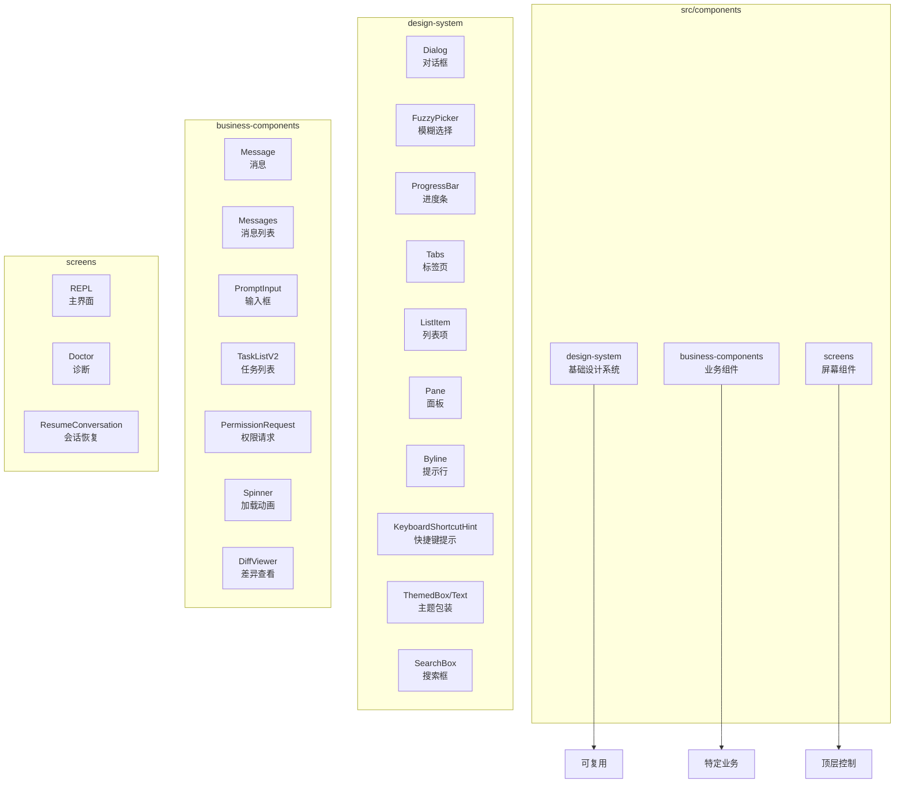
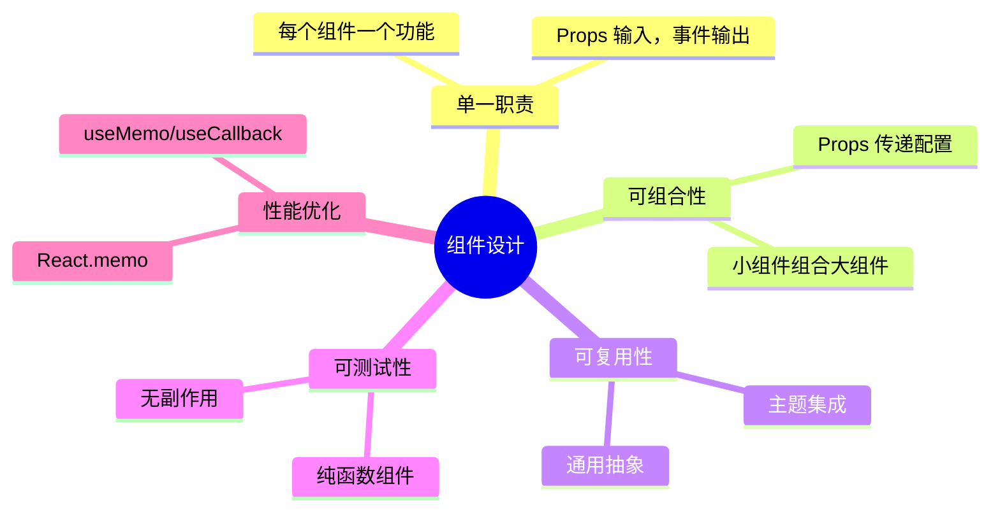
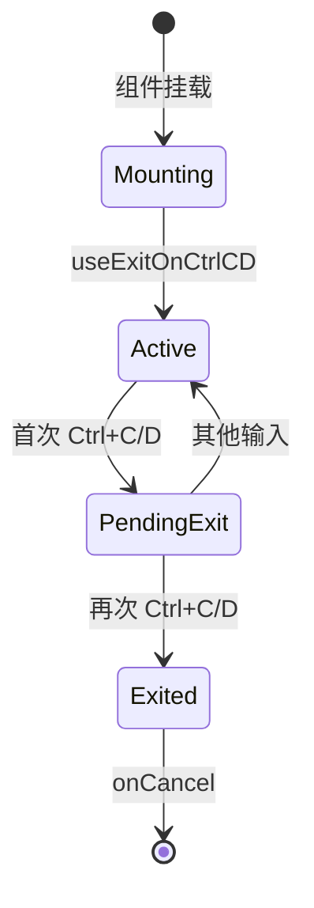
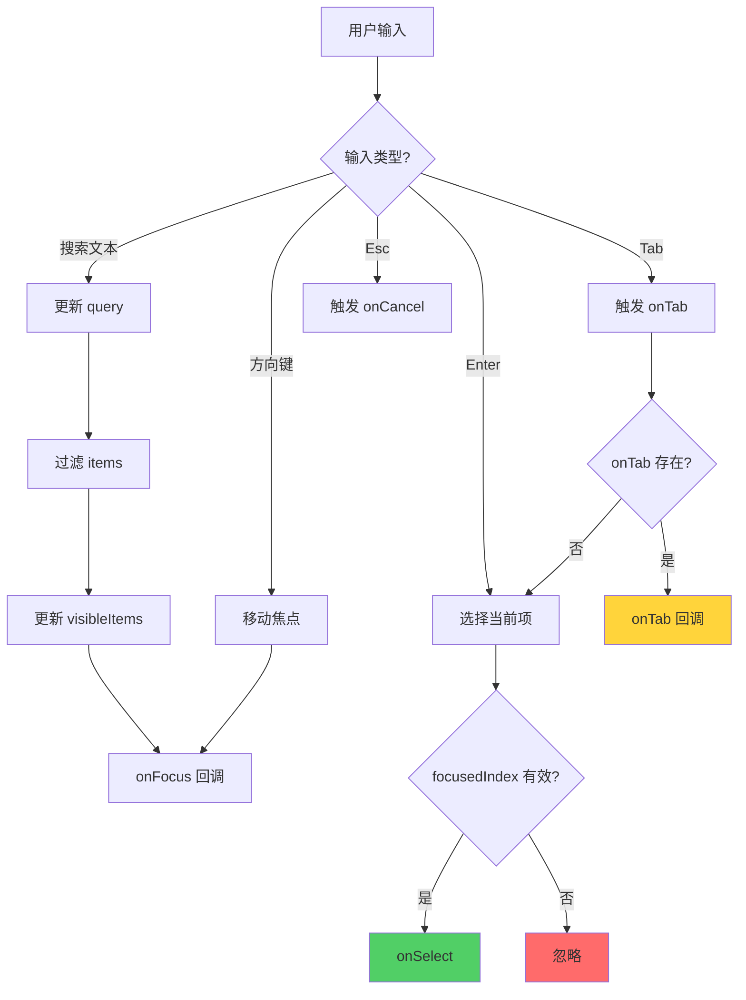
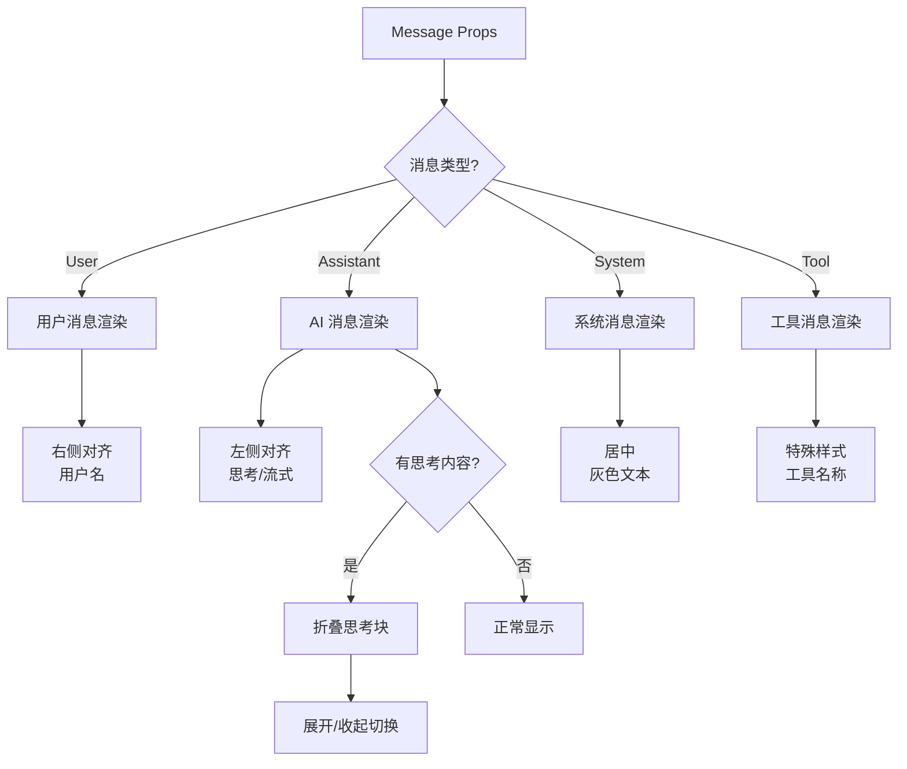
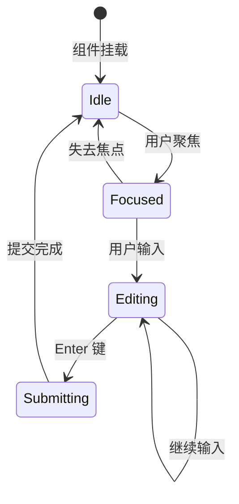
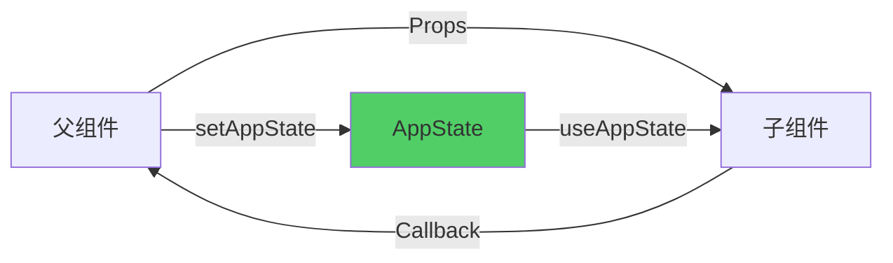

# 第 20 章：组件系统与设计模式

> 本章目标：深入分析 Claude Code 的组件组织结构、设计系统实现和通信模式。

## 20.1 组件系统架构

### 20.1.1 组件分类体系



**组件分类原则：**

| 分类 | 定位 | 复用性 | 依赖方向 |
|------|------|--------|----------|
| design-system | 基础 UI 元素 | 高 | 无依赖 |
| business-components | 特定业务逻辑 | 中 | 依赖 design-system |
| screens | 完整用户界面 | 低 | 依赖上两类 |

### 20.1.2 组件设计原则



**作者观点：** Claude Code 的组件分层是教科书级别的：
1. **design-system** 可以作为独立包发布
2. **business-components** 封装了特定领域的知识
3. **screens** 只负责布局和组合

这种分离使得组件易于测试和复用。

## 20.2 设计系统组件详解

### 20.2.1 Dialog 组件完整实现



```typescript
/**
 * Dialog 组件实现（完整版）
 */
export function Dialog({
  title,
  subtitle,
  children,
  onCancel,
  color = 'permission',
  hideInputGuide = false,
  hideBorder = false,
  inputGuide,
  isCancelActive = true,
}: DialogProps): React.ReactNode {
  // 1. 处理双击退出（Ctrl+C/D）
  const exitState = useExitOnCtrlCDWithKeybindings(
    undefined,
    undefined,
    isCancelActive
  )

  // 2. 可配置的 Esc 快捷键取消
  useKeybinding('confirm:no', onCancel, {
    context: 'Confirmation',
    isActive: isCancelActive
  })

  // 3. 动态输入指南
  const defaultInputGuide = exitState.pending
    ? (
      <Byline>
        <Text>Press </Text>
        <Text bold color={color}>{exitState.keyName}</Text>
        <Text> again to exit</Text>
      </Byline>
    )
    : (
      <Byline>
        <KeyboardShortcutHint shortcut="Enter" action="confirm" />
        <ConfigurableShortcutHint
          action="confirm:no"
          context="Confirmation"
          fallback="Esc"
          description="cancel"
        />
      </Byline>
    )

  const content = (
    <>
      <Box flexDirection="column" gap={1}>
        {/* 标题和副标题 */}
        <Box flexDirection="column">
          <Text bold color={color}>{title}</Text>
          {subtitle && <Text dimColor>{subtitle}</Text>}
        </Box>

        {/* 内容 */}
        {children}
      </Box>

      {/* 输入指南 */}
      {!hideInputGuide && (
        <Box marginTop={1}>
          <Text dimColor italic>
            {inputGuide ? inputGuide(exitState) : defaultInputGuide}
          </Text>
        </Box>
      )}
    </>
  )

  // 边框包裹
  if (hideBorder) {
    return content
  }

  return (
    <Pane color={color}>
      {content}
    </Pane>
  )
}

/**
 * Pane 组件（带边框的面板）
 */
function Pane({
  color,
  children,
}: {
  color: keyof Theme
  children: React.ReactNode
}): React.ReactNode {
  const theme = useTheme()
  const borderColor = theme[color]

  return (
    <Box
      borderStyle="round"
      borderColor={borderColor}
      padding={1}
    >
      {children}
    </Box>
  )
}

/**
 * Byline 组件（底部提示行）
 */
export function Byline({
  children,
}: {
  children: React.ReactNode
}): React.ReactNode {
  return (
    <Box flexDirection="row" gap={1}>
      {children}
    </Box>
  )
}
```

### 20.2.2 FuzzyPicker 组件完整分析



```typescript
/**
 * FuzzyPicker 完整实现
 */
export function FuzzyPicker<T>({
  title,
  placeholder = 'Type to search…',
  initialQuery,
  items,
  getKey,
  renderItem,
  renderPreview,
  previewPosition = 'bottom',
  visibleCount: requestedVisible = 8,
  direction = 'down',
  onQueryChange,
  onSelect,
  onTab,
  onShiftTab,
  onFocus,
  onCancel,
  emptyMessage = 'No results',
  matchLabel,
  selectAction = 'select',
  extraHints,
}: Props<T>): React.ReactNode {
  // 1. 状态管理
  const isTerminalFocused = useTerminalFocus()
  const { rows, columns } = useTerminalSize()
  const [focusedIndex, setFocusedIndex] = useState(0)

  // 2. 计算可见数量（根据终端高度）
  const CHROME_ROWS = 10  // 固定装饰高度
  const MIN_VISIBLE = 2
  const visibleCount = Math.max(
    MIN_VISIBLE,
    Math.min(requestedVisible, rows - CHROME_ROWS - (matchLabel ? 1 : 0))
  )

  // 3. 紧凑模式（窄终端）
  const compact = columns < 120

  // 4. 导航函数
  const step = (delta: 1 | -1) => {
    setFocusedIndex(i => clamp(i + delta, 0, items.length - 1))
  }

  // 5. 搜索输入
  const { query, cursorOffset } = useSearchInput({
    isActive: true,
    onExit: () => {},  // 由 onKeyDown 处理
    onCancel,
    initialQuery,
    backspaceExitsOnEmpty: false
  })

  // 6. 键盘处理
  const handleKeyDown = (e: KeyboardEvent) => {
    // 向上（Emacs 风格：Ctrl+P）
    if (e.key === 'up' || (e.ctrl && e.key === 'p')) {
      e.preventDefault()
      e.stopImmediatePropagation()
      step(direction === 'up' ? 1 : -1)
      return
    }

    // 向下（Emacs 风格：Ctrl+N）
    if (e.key === 'down' || (e.ctrl && e.key === 'n')) {
      e.preventDefault()
      e.stopImmediatePropagation()
      step(direction === 'up' ? -1 : 1)
      return
    }

    // 选择
    if (e.key === 'return') {
      e.preventDefault()
      e.stopImmediatePropagation()
      const selected = items[focusedIndex]
      if (selected) onSelect(selected)
      return
    }

    // Tab / Shift+Tab
    if (e.key === 'tab') {
      e.preventDefault()
      e.stopImmediatePropagation()
      const selected = items[focusedIndex]
      if (!selected) return
      const tabAction = e.shift ? onShiftTab ?? onTab : onTab
      if (tabAction) {
        tabAction.handler(selected)
      }
      return
    }
  }

  // 7. 焦点变化通知
  useEffect(() => {
    onFocus?.(items[focusedIndex])
  }, [focusedIndex, items, onFocus])

  // 8. 渲染可见项（虚拟滚动）
  const visibleItems = useMemo(() => {
    if (items.length <= visibleCount) {
      return items
    }

    // 计算可见窗口（保持选中项居中）
    const halfVisible = Math.floor(visibleCount / 2)
    const start = Math.max(0, focusedIndex - halfVisible)
    const end = Math.min(items.length, start + visibleCount)
    return items.slice(start, end)
  }, [items, focusedIndex, visibleCount])

  // 9. 判断是否为空
  const isEmpty = items.length === 0

  return (
    <Box flexDirection="column">
      {/* 标题和搜索 */}
      <Box flexDirection="column">
        <Text bold>{title}</Text>
        <SearchBox
          query={query}
          cursorOffset={cursorOffset}
          placeholder={placeholder}
          onChange={onQueryChange}
        />
      </Box>

      {/* 列表或空状态 */}
      <Box flexDirection="column" marginTop={1}>
        {isEmpty ? (
          <Text dimColor>
            {typeof emptyMessage === 'function'
              ? emptyMessage(query)
              : emptyMessage
            }
          </Text>
        ) : (
          visibleItems.map((item) => {
            const actualIndex = items.indexOf(item)
            const isFocused = actualIndex === focusedIndex
            return (
              <ListItem
                key={getKey(item)}
                focused={isFocused}
              >
                {renderItem(item, isFocused)}
              </ListItem>
            )
          })
        )}
      </Box>

      {/* 预览 */}
      {renderPreview && items[focusedIndex] && (
        <Box flexDirection="column" marginTop={1}>
          {renderPreview(items[focusedIndex])}
        </Box>
      )}

      {/* 提示行 */}
      <Byline marginTop={1}>
        {compact ? (
          // 紧凑模式：只显示基本提示
          <>
            <KeyboardShortcutHint shortcut="↑↓" action="navigate" />
            <KeyboardShortcutHint shortcut="Enter" action={selectAction} />
          </>
        ) : (
          // 完整模式：显示所有提示
          <>
            <KeyboardShortcutHint shortcut="↑↓" action="navigate" />
            <KeyboardShortcutHint shortcut="Enter" action={selectAction} />
            <KeyboardShortcutHint shortcut="Esc" action="cancel" />
            {onTab && (
              <KeyboardShortcutHint shortcut="Tab" action={onTab.action} />
            )}
            {extraHints}
          </>
        )}
        {matchLabel && <Text> • {matchLabel}</Text>}
      </Byline>
    </Box>
  )
}
```

### 20.2.3 ProgressBar 和 Tabs

```typescript
/**
 * ProgressBar 组件
 */
export function ProgressBar({
  percent,
  width = 20,
  color = 'success',
}: ProgressBarProps): React.ReactNode {
  const theme = useTheme()
  const fillColor = theme[color]
  const emptyColor = theme.inactive

  // 计算填充字符数
  const filledWidth = Math.max(0, Math.min(width, Math.round((percent / 100) * width)))
  const emptyWidth = width - filledWidth

  return (
    <Box>
      <Text backgroundColor={fillColor}>{' '.repeat(filledWidth)}</Text>
      <Text backgroundColor={emptyColor}>{' '.repeat(emptyWidth)}</Text>
      <Text> {Math.round(percent)}%</Text>
    </Box>
  )
}

/**
 * Tabs 组件
 */
export function Tabs({
  tabs,
  activeTab,
  onChange,
}: TabsProps): React.ReactNode {
  const theme = useTheme()

  return (
    <Box flexDirection="row" gap={1}>
      {tabs.map(tab => {
        const isActive = tab.id === activeTab
        return (
          <Text
            key={tab.id}
            color={isActive ? theme.claude : theme.inactive}
            underline={isActive}
            bold={isActive}
            onPress={() => onChange(tab.id)}
          >
            {tab.icon && `${tab.icon} `}
            {tab.label}
          </Text>
        )
      })}
    </Box>
  )
}
```

## 20.3 业务组件详解

### 20.3.1 Message 组件



```typescript
/**
 * Message 组件实现（简化版）
 */
export function Message({
  message,
  isFocused,
  onAction,
}: MessageProps): React.ReactNode {
  // 1. 根据类型渲染
  switch (message.type) {
    case 'user':
      return <UserMessage message={message} />
    case 'assistant':
      return <AssistantMessage message={message} isFocused={isFocused} />
    case 'system':
      return <SystemMessage message={message} />
    case 'tool':
      return <ToolMessage message={message} onAction={onAction} />
    default:
      return null
  }
}

/**
 * AI 助手消息
 */
function AssistantMessage({
  message,
  isFocused,
}: {
  message: AssistantMessage
  isFocused: boolean
}): React.ReactNode {
  const [expandedThought, setExpandedThought] = useState(false)
  const theme = useTheme()

  // 思考内容处理
  const thoughtContent = message.thinking
    ? (
      <Box marginBottom={1}>
        <Text
          color={theme.inactive}
          onPress={() => setExpandedThought(!expandedThought)}
        >
          {expandedThought ? '▼' : '▶'} Thinking {expandedThought ? '(expanded)' : '(collapsed)'}
        </Text>
        {expandedThought && (
          <Text dimColor>
            {message.thinking}
          </Text>
        )}
      </Box>
    )
    : null

  // 主内容渲染
  const content = (
    <Box flexDirection="column" gap={1}>
      {thoughtContent}
      <FormattedText content={message.content} />
    </Box>
  )

  return (
    <Box
      flexDirection="column"
      paddingX={1}
      borderStyle={isFocused ? 'single' : undefined}
      borderColor={isFocused ? theme.promptBorder : undefined}
    >
      {/* Header */}
      <Box>
        <Text bold color={theme.claude}>Claude</Text>
        {message.model && (
          <Text dimColor> ({message.model})</Text>
        )}
      </Box>

      {/* Content */}
      {content}
    </Box>
  )
}

/**
 * 工具消息
 */
function ToolMessage({
  message,
  onAction,
}: {
  message: ToolMessage
  onAction?: (action: string, toolUseId: string) => void
}): React.ReactNode {
  const theme = useTheme()

  return (
    <Box
      flexDirection="column"
      paddingX={1}
      borderColor={theme.bashBorder}
      borderStyle="round"
    >
      {/* 工具名称 */}
      <Box marginBottom={1}>
        <Text bold color={theme.bashBorder}>
          {message.toolName}
        </Text>
        {message.toolInput && (
          <Text dimColor> ({JSON.stringify(message.toolInput)})</Text>
        )}
      </Box>

      {/* 工具输出 */}
      {message.toolOutput && (
        <Box marginBottom={1}>
          <Text dimColor>
            {formatToolOutput(message.toolOutput)}
          </Text>
        </Box>
      )}

      {/* 错误信息 */}
      {message.isError && (
        <Box marginBottom={1}>
          <Text color="red">Error: {message.errorMessage}</Text>
        </Box>
      )}

      {/* 操作按钮 */}
      {onAction && message.toolUseId && (
        <Box flexDirection="row" gap={2}>
          <Text onPress={() => onAction('retry', message.toolUseId)}>
            [Retry]
          </Text>
          <Text onPress={() => onAction('skip', message.toolUseId)}>
            [Skip]
          </Text>
        </Box>
      )}
    </Box>
  )
}
```

### 20.3.2 PromptInput 组件



```typescript
/**
 * PromptInput 组件实现（简化版）
 */
export function PromptInput({
  onSubmit,
  placeholder = 'Type a message...',
  maxLength,
  disabled = false,
}: PromptInputProps): React.ReactNode {
  const [input, setInput] = useState('')
  const [cursorOffset, setCursorOffset] = useState(0)
  const theme = useTheme()
  const setAppState = useSetAppState()

  // 输入处理
  const handleChange = (value: string, offset: number) => {
    if (maxLength && value.length > maxLength) {
      value = value.slice(0, maxLength)
    }
    setInput(value)
    setCursorOffset(offset)
  }

  // 提交处理
  const handleSubmit = () => {
    if (input.trim() && !disabled) {
      onSubmit(input.trim())
      setInput('')
      setCursorOffset(0)
    }
  }

  // 命令检测
  const isCommand = input.startsWith('/')
  const commandColor = isCommand ? theme.suggestion : theme.text

  return (
    <Box
      flexDirection="column"
      borderStyle="single"
      borderColor={theme.promptBorder}
      padding={1}
    >
      {/* 输入框 */}
      <Box flexDirection="row">
        <Text bold color={theme.claude}>➜ </Text>
        <TextInput
          value={input}
          cursorOffset={cursorOffset}
          onChange={handleChange}
          onSubmit={handleSubmit}
          placeholder={placeholder}
          color={commandColor}
          disabled={disabled}
        />
      </Box>

      {/* 底部信息栏 */}
      <PromptInputFooter />
    </Box>
  )
}

/**
 * 底部信息栏
 */
function PromptInputFooter(): React.ReactNode {
  const appState = useAppState(state => ({
    mode: state.toolPermissionContext.mode,
    model: state.mainLoopModel,
    verbose: state.verbose,
  }))

  return (
    <Box flexDirection="row" justifyContent="space-between">
      {/* 左侧：模式 */}
      <Box flexDirection="row" gap={1}>
        <Text dimColor>
          {appState.mode === 'plan' && '[PLAN] '}
          {appState.mode === 'auto' && '[AUTO] '}
          {appState.verbose && '[VERBOSE] '}
        </Text>
      </Box>

      {/* 右侧：模型 */}
      <Text dimColor>
        {appState.model?.displayName}
      </Text>
    </Box>
  )
}
```

## 20.4 组件通信模式

### 20.4.1 Props 传递模式



```typescript
/**
 * Props 传递示例
 */
export function ParentComponent() {
  const [selectedId, setSelectedId] = useState<string | null>(null)
  const items = useAppState(s => s.items)

  return (
    <Box flexDirection="column">
      <ItemList
        items={items}
        selectedId={selectedId}
        onSelect={setSelectedId}
      />

      {selectedId && (
        <ItemDetail
          itemId={selectedId}
          onClose={() => setSelectedId(null)}
        />
      )}
    </Box>
  )
}

/**
 * 子组件
 */
function ItemList({
  items,
  selectedId,
  onSelect,
}: {
  items: Item[]
  selectedId: string | null
  onSelect: (id: string) => void
}) {
  return (
    <Box flexDirection="column">
      {items.map(item => (
        <ListItem
          key={item.id}
          focused={item.id === selectedId}
          onPress={() => onSelect(item.id)}
        >
          <Text>{item.name}</Text>
        </ListItem>
      ))}
    </Box>
  )
}
```

### 20.4.2 Context 共享模式

```typescript
/**
 * 通知 Context
 */
type NotificationsContextValue = {
  notifications: Notification[]
  addNotification: (notification: Notification) => void
  removeNotification: (id: string) => void
}

const NotificationsContext = createContext<NotificationsContextValue | null>(null)

/**
 * Provider 组件
 */
export function NotificationsProvider({
  children,
}: {
  children: ReactNode
}) {
  const [notifications, setNotifications] = useState<Notification[]>([])

  const addNotification = useCallback((notification: Notification) => {
    setNotifications(prev => [...prev, notification])

    // 自动移除
    if (notification.duration) {
      setTimeout(() => {
        removeNotification(notification.id)
      }, notification.duration)
    }
  }, [])

  const removeNotification = useCallback((id: string) => {
    setNotifications(prev => prev.filter(n => n.id !== id))
  }, [])

  const value = useMemo(
    () => ({ notifications, addNotification, removeNotification }),
    [notifications, addNotification, removeNotification]
  )

  return (
    <NotificationsContext.Provider value={value}>
      {children}
    </NotificationsContext.Provider>
  )
}

/**
 * Hook
 */
export function useNotifications() {
  const context = useContext(NotificationsContext)
  if (!context) {
    throw new Error('useNotifications must be used within NotificationsProvider')
  }
  return context
}

/**
 * 使用示例
 */
export function StatusMessage() {
  const { addNotification } = useNotifications()

  const handleClick = () => {
    addNotification({
      id: generateId(),
      type: 'success',
      message: 'Operation completed',
      duration: 3000,
    })
  }

  return <Text onPress={handleClick}>Show notification</Text>
}
```

### 20.4.3 事件冒泡模式

```typescript
/**
 * 事件冒泡示例
 */
export function ClickableList({
  items,
  onItemSelect,
  onListAction,
}: {
  items: Item[]
  onItemSelect: (item: Item) => void
  onListAction: () => void
}) {
  return (
    <Box
      flexDirection="column"
      onClick={(e) => {
        // 列表级点击
        if (e.target === e.currentTarget) {
          onListAction()
        }
      }}
    >
      {items.map(item => (
        <ClickableItem
          key={item.id}
          item={item}
          onSelect={onItemSelect}
        />
      ))}
    </Box>
  )
}

function ClickableItem({
  item,
  onSelect,
}: {
  item: Item
  onSelect: (item: Item) => void
}) {
  const handleClick = (e: MouseEvent) => {
    e.stopPropagation()  // 阻止冒泡到列表
    onSelect(item)
  }

  return (
    <Box onClick={handleClick}>
      <Text>{item.name}</Text>
    </Box>
  )
}
```

## 20.5 主题系统深度解析

### 20.5.1 Theme 类型定义

```typescript
/**
 * 完整 Theme 类型
 */
export type Theme = {
  // 品牌颜色
  claude: string
  claudeShimmer: string
  claudeBlue_FOR_SYSTEM_SPINNER: string
  claudeBlueShimmer_FOR_SYSTEM_SPINNER: string

  // 功能颜色
  permission: string
  permissionShimmer: string
  planMode: string
  ide: string
  autoAccept: string

  // UI 元素
  promptBorder: string
  promptBorderShimmer: string
  text: string
  inverseText: string
  inactive: string
  inactiveShimmer: string
  subtle: string
  suggestion: string
  background: string

  // 语义颜色
  success: string
  error: string
  warning: string
  merged: string
  warningShimmer: string

  // Diff 颜色
  diffAdded: string
  diffRemoved: string
  diffAddedDimmed: string
  diffRemovedDimmed: string
  diffAddedWord: string
  diffRemovedWord: string

  // Agent 颜色
  red_FOR_SUBAGENTS_ONLY: string
  blue_FOR_SUBAGENTS_ONLY: string
  green_FOR_SUBAGENTS_ONLY: string
  yellow_FOR_SUBAGENTS_ONLY: string
  purple_FOR_SUBAGENTS_ONLY: string
  orange_FOR_SUBAGENTS_ONLY: string
  pink_FOR_SUBAGENTS_ONLY: string
  cyan_FOR_SUBAGENTS_ONLY: string

  // TUI V2 颜色
  clawd_body: string
  clawd_background: string
  userMessageBackground: string
  userMessageBackgroundHover: string
  messageActionsBackground: string
  selectionBg: string
  bashMessageBackgroundColor: string

  // 记忆颜色
  memoryBackgroundColor: string

  // 速率限制
  rate_limit_fill: string
  rate_limit_empty: string

  // 快速模式
  fastMode: string
  fastModeShimmer: string

  // 简要模式标签
  briefLabelYou: string
  briefLabelClaude: string

  // Rainbow 颜色（ultrathink 高亮）
  rainbow_red: string
  rainbow_orange: string
  rainbow_yellow: string
  rainbow_green: string
  rainbow_blue: string
  rainbow_indigo: string
  rainbow_violet: string
  rainbow_red_shimmer: string
  rainbow_orange_shimmer: string
  rainbow_yellow_shimmer: string
  rainbow_green_shimmer: string
  rainbow_blue_shimmer: string
  rainbow_indigo_shimmer: string
  rainbow_violet_shimmer: string
}
```

### 20.5.2 主题实现

```typescript
/**
 * 主题工厂
 */
class ThemeFactory {
  /**
   * 获取主题
   */
  getTheme(name: string): Theme {
    switch (name) {
      case 'dark':
        return this.getDarkTheme()
      case 'light':
        return this.getLightTheme()
      case 'daltonized':
        return this.getDaltonizedTheme()
      default:
        return this.getDarkTheme()
    }
  }

  /**
   * 深色主题（默认）
   */
  private getDarkTheme(): Theme {
    return {
      // 品牌颜色
      claude: 'rgb(215,119,87)',
      claudeShimmer: 'rgb(235,159,127)',
      claudeBlue_FOR_SYSTEM_SPINNER: 'rgb(147,165,255)',
      claudeBlueShimmer_FOR_SYSTEM_SPINNER: 'rgb(177,195,255)',

      // 功能颜色
      permission: 'rgb(177,185,249)',
      permissionShimmer: 'rgb(207,215,255)',
      planMode: 'rgb(72,150,140)',
      ide: 'rgb(71,130,200)',
      autoAccept: 'rgb(175,135,255)',

      // UI 元素
      promptBorder: 'rgb(136,136,136)',
      promptBorderShimmer: 'rgb(166,166,166)',
      text: 'rgb(255,255,255)',
      inverseText: 'rgb(0,0,0)',
      inactive: 'rgb(153,153,153)',
      inactiveShimmer: 'rgb(193,193,193)',
      subtle: 'rgb(80,80,80)',
      suggestion: 'rgb(177,185,249)',
      background: 'rgb(0,204,204)',

      // 语义颜色
      success: 'rgb(78,186,101)',
      error: 'rgb(255,107,128)',
      warning: 'rgb(255,193,7)',
      merged: 'rgb(175,135,255)',
      warningShimmer: 'rgb(255,223,57)',

      // Diff 颜色
      diffAdded: 'rgb(34,92,43)',
      diffRemoved: 'rgb(122,41,54)',
      diffAddedDimmed: 'rgb(71,88,74)',
      diffRemovedDimmed: 'rgb(105,72,77)',
      diffAddedWord: 'rgb(56,166,96)',
      diffRemovedWord: 'rgb(179,89,107)',

      // Agent 颜色
      red_FOR_SUBAGENTS_ONLY: 'rgb(220,38,38)',
      blue_FOR_SUBAGENTS_ONLY: 'rgb(37,99,235)',
      green_FOR_SUBAGENTS_ONLY: 'rgb(22,163,74)',
      yellow_FOR_SUBAGENTS_ONLY: 'rgb(234,179,8)',
      purple_FOR_SUBAGENTS_ONLY: 'rgb(147,51,234)',
      orange_FOR_SUBAGENTS_ONLY: 'rgb(234,88,12)',
      pink_FOR_SUBAGENTS_ONLY: 'rgb(219,39,119)',
      cyan_FOR_SUBAGENTS_ONLY: 'rgb(6,182,212)',

      // ... 其他颜色
    }
  }

  /**
   * 浅色主题
   */
  private getLightTheme(): Theme {
    return {
      // 浅色背景
      text: 'rgb(0,0,0)',
      inverseText: 'rgb(255,255,255)',
      background: 'rgb(240,240,240)',
      subtle: 'rgb(200,200,200)',
      inactive: 'rgb(100,100,100)',

      // 品牌颜色保持一致
      claude: 'rgb(215,119,87)',
      // ...
    }
  }

  /**
   * 色盲友好主题（Daltonized）
   */
  private getDaltonizedTheme(): Theme {
    return {
      // 使用蓝色替代绿色/红色
      success: 'rgb(0,102,153)',   // 蓝色替代绿色
      error: 'rgb(204,0,0)',       // 纯红色提高辨识度
      warning: 'rgb(102,0,102)',   // 紫色替代黄色

      diffAdded: 'rgb(153,204,255)',    // 浅蓝色
      diffRemoved: 'rgb(255,102,102)',  // 浅红色

      // ... 其他颜色
    }
  }
}
```

### 20.5.3 ThemeProvider 实现

```typescript
/**
 * ThemeProvider 组件
 */
export function ThemeProvider({
  children,
}: {
  children: ReactNode
}) {
  const appState = useAppState()
  const theme = useMemo(
    () => getTheme(appState.settings.themeName),
    [appState.settings.themeName]
  )

  return (
    <ThemeContext.Provider value={theme}>
      {children}
    </ThemeContext.Provider>
  )
}

/**
 * useTheme Hook
 */
export function useTheme(): Theme {
  return useContext(ThemeContext)
}

/**
 * Themed 组件
 */
export function ThemedComponent({
  color,
  backgroundColor,
  children,
  ...style
}: ThemedProps): React.ReactNode {
  const theme = useTheme()

  const resolveColor = (prop?: ColorProp): string | undefined => {
    if (!prop) return undefined
    return typeof prop === 'function'
      ? prop(theme)
      : theme[prop]
  }

  return (
    <Box
      color={resolveColor(color)}
      backgroundColor={resolveColor(backgroundColor)}
      {...style}
    >
      {children}
    </Box>
  )
}
```

## 20.6 组件优化技术

### 20.6.1 React.memo 使用

```typescript
/**
 * 优化的 Message 组件
 */
export const Message = React.memo(function Message({
  message,
  isFocused,
}: {
  message: Message
  isFocused: boolean
}) {
  // ... 渲染逻辑
}, (prevProps, nextProps) => {
  // 自定义比较：只在特定属性变化时重新渲染
  return (
    prevProps.message.id === nextProps.message.id &&
    prevProps.isFocused === nextProps.isFocused &&
    prevProps.message.status === nextProps.message.status
  )
})
```

### 20.6.2 useMemo 和 useCallback

```typescript
/**
 * 优化的列表组件
 */
export function OptimizedList({ items }: {
  items: Item[]
}) {
  // 缓存计算结果
  const groupedItems = useMemo(() => {
    return groupItemsByCategory(items)
  }, [items])

  // 缓存回调
  const handleSelect = useCallback((id: string) => {
    // 处理选择
  }, [])

  // 缓存渲染函数
  const renderItem = useCallback((item: Item) => {
    return <ListItem item={item} onSelect={handleSelect} />
  }, [handleSelect])

  return (
    <Box flexDirection="column">
      {groupedItems.map(group => (
        <Box key={group.category} flexDirection="column">
          <Text bold>{group.category}</Text>
          {group.items.map(renderItem)}
        </Box>
      ))}
    </Box>
  )
}
```

### 20.6.3 虚拟滚动

```typescript
/**
 * 虚拟滚动列表
 */
export function VirtualList({
  items,
  renderItem,
  itemHeight,
  visibleCount,
}: {
  items: T[]
  renderItem: (item: T) => ReactNode
  itemHeight: number
  visibleCount: number
}) {
  const [scrollTop, setScrollTop] = useState(0)

  // 计算可见范围
  const { startIndex, endIndex } = useMemo(() => {
    const start = Math.floor(scrollTop / itemHeight)
    const end = Math.min(items.length, start + visibleCount)
    return { startIndex: Math.max(0, start), endIndex: end }
  }, [scrollTop, itemHeight, visibleCount, items.length])

  // 可见项
  const visibleItems = useMemo(() => {
    return items.slice(startIndex, endIndex)
  }, [items, startIndex, endIndex])

  return (
    <Box height={visibleCount * itemHeight} overflowY="scroll">
      {/* 顶部填充 */}
      <Box height={startIndex * itemHeight} />

      {/* 可见项 */}
      {visibleItems.map((item, i) => (
        <Box
          key={item.id}
          height={itemHeight}
        >
          {renderItem(item)}
        </Box>
      ))}

      {/* 底部填充 */}
      <Box height={(items.length - endIndex) * itemHeight} />
    </Box>
  )
}
```

## 20.7 作者评价与设计反思

### 20.7.1 优势

1. **清晰的分层**
   - design-system 可作为独立包
   - business-components 封装领域知识
   - screens 只负责组合

2. **完整的主题系统**
   - 支持深色/浅色/色盲模式
   - 类型安全的颜色访问

3. **良好的优化**
   - React.memo 防止不必要渲染
   - useMemo/useCallback 缓存

### 20.7.2 改进空间

1. **组件文档**
   - 缺少组件 API 文档
   - 缺少使用示例

2. **可访问性**
   - 可以增加 ARIA 标签支持
   - 可以增加键盘导航优化

3. **测试覆盖**
   - 需要增加组件测试
   - 需要增加快照测试

## 20.8 可复用模式总结

### 模式 44：设计系统组件库

**描述：** 构建一致的终端 UI 组件库。

**代码模板：**

```typescript
// 1. 组件 Props 类型
export type ComponentProps = {
  children?: ReactNode
  style?: Partial<Styles>
  color?: keyof Theme | ((theme: Theme) => string)
  disabled?: boolean
  loading?: boolean
  onPress?: () => void
  size?: 'small' | 'medium' | 'large'
  variant?: 'primary' | 'secondary' | 'ghost'
}

// 2. 组件实现
export function DesignSystemComponent({
  children,
  style,
  color,
  disabled = false,
  loading = false,
  onPress,
  size = 'medium',
  variant = 'primary',
}: ComponentProps): ReactNode {
  const theme = useTheme()

  // 解析颜色
  const resolvedColor = typeof color === 'function'
    ? color(theme)
    : color
      ? theme[color]
      : theme.text

  // 尺寸样式
  const sizeStyles: Record<string, Partial<Styles>> = {
    small: { paddingX: 1, paddingY: 0 },
    medium: { paddingX: 2, paddingY: 1 },
    large: { paddingX: 3, paddingY: 2 },
  }

  // 变体样式
  const variantStyles: Record<string, Partial<Styles>> = {
    primary: { backgroundColor: theme.claude },
    secondary: { borderStyle: 'single' },
    ghost: {},
  }

  return (
    <Box
      {...sizeStyles[size]}
      {...variantStyles[variant]}
      {...style}
      color={disabled ? 'inactive' : resolvedColor}
      onPress={disabled ? undefined : onPress}
    >
      {loading ? 'Loading…' : children}
    </Box>
  )
}
```

### 模式 45：主题提供者模式

**描述：** 集中管理应用主题，支持动态切换。

**代码模板：**

```typescript
// 1. 主题类型
export type Theme = {
  name: string
  colors: {
    primary: string
    secondary: string
    background: string
    text: string
  }
}

// 2. 主题映射
const themes: Record<string, Theme> = {
  dark: {
    name: 'dark',
    colors: {
      primary: 'rgb(177,185,249)',
      secondary: 'rgb(215,119,87)',
      background: 'rgb(0,0,0)',
      text: 'rgb(255,255,255)',
    },
  },
  light: {
    name: 'light',
    colors: {
      primary: 'rgb(87,105,247)',
      secondary: 'rgb(215,119,87)',
      background: 'rgb(255,255,255)',
      text: 'rgb(0,0,0)',
    },
  },
}

// 3. Context
const ThemeContext = createContext<Theme>(themes.dark)

// 4. Provider
export function ThemeProvider({
  theme: themeName,
  children,
}: {
  theme: string
  children: ReactNode
}) {
  const [currentTheme, setCurrentTheme] = useState(themes[themeName])

  const setTheme = useCallback((name: string) => {
    setCurrentTheme(themes[name])
  }, [])

  return (
    <ThemeContext.Provider value={{...currentTheme, setTheme}}>
      {children}
    </ThemeContext.Provider>
  )
}
```

## 本章小结

本章深入分析了 Claude Code 的组件系统：

1. **组件架构**：分类体系、设计原则、依赖方向
2. **设计系统组件**：Dialog、FuzzyPicker、ProgressBar、Tabs 完整实现
3. **业务组件**：Message、PromptInput、工具消息
4. **通信模式**：Props 传递、Context 共享、事件冒泡
5. **主题系统**：Theme 类型、深色/浅色/Daltonized、ThemeProvider
6. **组件优化**：React.memo、useMemo/useCallback、虚拟滚动
7. **作者评价**：优势分析、改进空间
8. **可复用模式**：设计系统组件库、主题提供者

## 下一章预告

第 21 章将深入分析状态管理架构，包括 AppState 设计、状态存储、更新机制和选择器模式。
