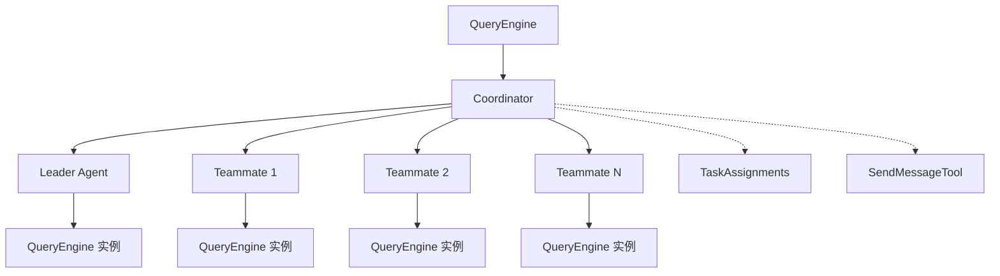
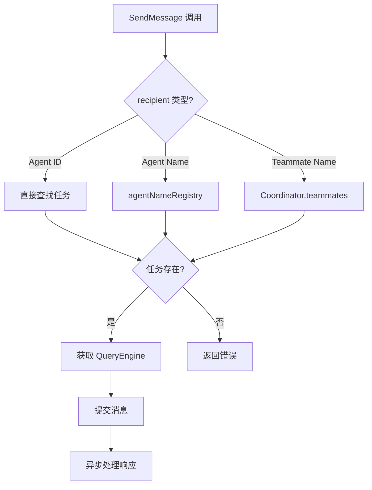

# 第 20 章：多 Agent 协调

> 本章目标：深入理解多个 Agent 并行工作的协调机制。

## 20.1 Coordinator 模式



### 协调器状态

```typescript
// src/coordinator/coordinatorMode.ts
export type CoordinatorMode =
  | { type: 'off' }
  | {
      type: 'active'
      taskId: string
      leaderQueryEngine: QueryEngine
      teammates: Map<string, TeammateAgent>
      assignments: Map<string, TaskAssignment>
    }

export type TeammateAgent = {
  agentId: string
  queryEngine: QueryEngine
  status: 'running' | 'paused' | 'error'
  currentTask?: TaskAssignment
}

export type TaskAssignment = {
  agentId: string
  taskId: string
  status: 'pending' | 'in_progress' | 'completed' | 'failed'
  startTime?: number
  endTime?: number
}
```

### 协调器初始化

```typescript
// src/coordinator/initCoordinator.ts
export async function initCoordinator(
  options: {
    leaderQueryEngine: QueryEngine
    teammates: Array<{
      agentDefinition: AgentDefinition
      cwd?: string
    }>
    task?: string
  },
): Promise<CoordinatorMode> {
  const { leaderQueryEngine, teammates, task } = options

  // 创建 teammate QueryEngines
  const teammateMap = new Map<string, TeammateAgent>()

  for (const definition of teammates) {
    const agentId = generateAgentId()

    const queryEngine = await createQueryEngine({
      agent: {
        id: agentId,
        definition,
      },
      mode: 'plan',  // Teammates 默认使用 plan 模式
    })

    const teammate: TeammateAgent = {
      agentId,
      queryEngine,
      status: 'running',
    }

    teammateMap.set(agentId, teammate)
  }

  // 分配初始任务
  const assignments = new Map<string, TaskAssignment>()

  // 返回活跃状态
  return {
    type: 'active',
    taskId: generateTaskId(),
    leaderQueryEngine,
    teammates: teammateMap,
    assignments,
  }
}
```

## 20.2 Team 系统

### TeamCreateTool

```typescript
// src/tools/TeamCreateTool/TeamCreateTool.ts
export const TeamCreateTool: Tool = {
  name: 'create_team',
  description: 'Create a team of agents to work on a task together',
  inputJSONSchema: z.object({
    task: z.string().describe('The task description'),
    agents: z.array(z.object({
      name: z.string(),
      instructions: z.string(),
    })).describe('The agents to include in the team'),
  }).parse(),

  handler: async (input, context) => {
    const { task, agents } = input

    // 检查特性标志
    if (!feature('TEAM_FEATURE')) {
      return {
        type: 'error',
        output: 'Team feature is not enabled',
      }
    }

    // 创建协调器
    const coordinatorMode = await initCoordinator({
      leaderQueryEngine: context.queryEngine,
      teammates: agents.map(def => ({
        agentDefinition: {
          name: def.name,
          instructions: def.instructions,
        },
      })),
      task,
    })

    // 更新 AppState
    context.setAppState(prev => ({
      ...prev,
      coordinatorMode,
      expandedView: 'teammates',
    }))

    return {
      type: 'success',
      output: `Created team with ${agents.length} agents`,
    }
  },
}
```

### TeamDeleteTool

```typescript
// src/tools/TeamDeleteTool/TeamDeleteTool.ts
export const TeamDeleteTool: Tool = {
  name: 'delete_team',
  description: 'Delete the current team and stop all teammates',
  inputJSONSchema: z.object({}).parse(),

  handler: async (input, context) => {
    const coordinatorMode = context.appState.coordinatorMode

    if (coordinatorMode.type !== 'active') {
      return {
        type: 'error',
        output: 'No active team to delete',
      }
    }

    // 停止所有 teammates
    for (const [agentId, teammate] of coordinatorMode.teammates) {
      await teammate.queryEngine.close()
    }

    // 更新 AppState
    context.setAppState(prev => ({
      ...prev,
      coordinatorMode: { type: 'off' },
      expandedView: 'none',
    }))

    return {
      type: 'success',
      output: 'Team deleted',
    }
  },
}
```

### 团队状态管理

```typescript
// src/coordinator/teamState.ts
export type TeamState = {
  id: string
  task: string
  createdAt: number
  leaderId: string
  teammates: Map<string, TeammateState>
  assignments: Map<string, Assignment>
}

export type TeammateState = {
  agentId: string
  name: string
  status: 'running' | 'paused' | 'completed' | 'error'
  currentAssignment?: Assignment
  messagesSent: number
  tokensUsed: number
  lastActivity: number
}

export type Assignment = {
  id: string
  description: string
  assigneeId: string
  status: 'pending' | 'in_progress' | 'completed' | 'failed'
  createdAt: number
  completedAt?: number
}

export function updateTeammateStatus(
  team: TeamState,
  agentId: string,
  status: TeammateState['status'],
): TeamState {
  const teammate = team.teammates.get(agentId)
  if (!teammate) return team

  return {
    ...team,
    teammates: new Map(team.teammates).set(agentId, {
      ...teammate,
      status,
      lastActivity: Date.now(),
    }),
  }
}

export function addAssignment(
  team: TeamState,
  description: string,
  assigneeId: string,
): { team: TeamState; assignment: Assignment } {
  const assignment: Assignment = {
    id: generateAssignmentId(),
    description,
    assigneeId,
    status: 'pending',
    createdAt: Date.now(),
  }

  const updatedTeam = {
    ...team,
    assignments: new Map(team.assignments).set(assignment.id, assignment),
  }

  return { team: updatedTeam, assignment }
}
```

## 20.3 Agent 间通信

### SendMessageTool

```typescript
// src/tools/SendMessageTool/SendMessageTool.ts
export const SendMessageTool: Tool = {
  name: 'send_message',
  description: 'Send a message to another agent or teammate',
  inputJSONSchema: z.object({
    recipient: z.string().describe('The agent ID or name to send to'),
    message: z.string().describe('The message to send'),
  }).parse(),

  handler: async (input, context) => {
    const { recipient, message } = input
    const { appState } = context

    // 解析收件人
    const targetAgentId = resolveRecipient(recipient, appState)

    if (!targetAgentId) {
      return {
        type: 'error',
        output: `Agent not found: ${recipient}`,
      }
    }

    // 获取目标任务
    const task = appState.tasks[targetAgentId]
    if (!task) {
      return {
        type: 'error',
        output: `Task not found for agent: ${targetAgentId}`,
      }
    }

    // 发送消息到 QueryEngine
    const queryEngine = getQueryEngineForTask(task)
    if (!queryEngine) {
      return {
        type: 'error',
        output: `QueryEngine not available for agent: ${targetAgentId}`,
      }
    }

    // 异步发送消息（不阻塞）
    sendMessageToAgent(queryEngine, message).catch(error => {
      console.error(`Failed to send message to ${recipient}:`, error)
    })

    return {
      type: 'success',
      output: `Message sent to ${recipient}`,
    }
  },
}

async function sendMessageToAgent(
  queryEngine: QueryEngine,
  message: string,
): Promise<void> {
  // 添加到消息历史
  for await (const event of queryEngine.submitMessage({
    role: 'user',
    content: message,
  })) {
    // 处理响应事件
    if (event.type === 'done') {
      break
    }
  }
}

function resolveRecipient(
  recipient: string,
  appState: AppState,
): string | undefined {
  // 1. 按 ID 查找
  if (appState.tasks[recipient]) {
    return recipient
  }

  // 2. 按名称查找（agentNameRegistry）
  const agentId = appState.agentNameRegistry.get(recipient)
  if (agentId) {
    return agentId
  }

  // 3. 查找 teammate
  if (appState.coordinatorMode.type === 'active') {
    for (const [agentId, teammate] of appState.coordinatorMode.teammates) {
      const definition = getAgentDefinition(teammate.queryEngine)
      if (definition?.name === recipient) {
        return agentId
      }
    }
  }

  return undefined
}
```

### 消息路由



## 20.4 并行执行

### Worker 池

```typescript
// src/coordinator/workerPool.ts
export type WorkerPool = {
  size: number
  available: Set<string>  // 可用的 agent IDs
  busy: Map<string, string>   // 忙碌的 agentId -> taskId
  queue: TaskQueue
}

export type TaskQueue = {
  pending: Array<{ id: string; description: string; priority: number }>
  inProgress: Map<string, string>  // taskId -> agentId
}

export function createWorkerPool(size: number): WorkerPool {
  return {
    size,
    available: new Set(),
    busy: new Map(),
    queue: {
      pending: [],
      inProgress: new Map(),
    },
  }
}

export function assignTask(
  pool: WorkerPool,
  taskId: string,
  description: string,
  priority: number = 0,
): string | null {
  // 检查可用 worker
  for (const agentId of pool.available) {
    pool.available.delete(agentId)
    pool.busy.set(agentId, taskId)
    pool.queue.inProgress.set(taskId, agentId)

    return agentId
  }

  // 没有可用 worker，加入队列
  pool.queue.pending.push({ id: taskId, description, priority })
  pool.queue.pending.sort((a, b) => b.priority - a.priority)

  return null
}

export function releaseWorker(
  pool: WorkerPool,
  agentId: string,
): string | null {
  const taskId = pool.busy.get(agentId)
  if (!taskId) return null

  pool.busy.delete(agentId)
  pool.queue.inProgress.delete(taskId)
  pool.available.add(agentId)

  // 处理队列中的下一个任务
  if (pool.queue.pending.length > 0) {
    const next = pool.queue.pending.shift()!
    return assignTask(pool, next.id, next.description, next.priority)
  }

  return null
}
```

### 任务分发

```typescript
// src/coordinator/dispatcher.ts
export async function dispatchTask(
  team: TeamState,
  task: { description: string; priority?: number },
): Promise<TeamState> {
  const { description, priority = 0 } = task

  // 找到最空闲的 teammate
  let bestTeammate: { id: string; state: TeammateState } | null = null
  let lowestLoad = Infinity

  for (const [id, teammate] of team.teammates) {
    if (teammate.status !== 'running') continue

    const load = teammate.messagesSent
    if (load < lowestLoad) {
      lowestLoad = load
      bestTeammate = { id, state: teammate }
    }
  }

  if (!bestTeammate) {
    return team  // 没有可用的 teammate
  }

  // 创建分配
  const { team: updatedTeam, assignment } = addAssignment(
    team,
    description,
    bestTeammate.id,
  )

  // 发送任务
  const teammate = updatedTeam.teammates.get(bestTeammate.id)!
  const queryEngine = getQueryEngineForAgent(teammate)

  await sendMessageToAgent(queryEngine, description)

  return updatedTeam
}
```

### 并行控制

```typescript
// src/coordinator/parallel.ts
export async function executeInParallel<T>(
  tasks: Array<{ id: string; work: () => Promise<T> }>,
  concurrency: number = 3,
): Promise<Map<string, T>> {
  const results = new Map<string, T>()
  const queue = [...tasks]
  const executing = new Set<string>()

  return new Promise((resolve, reject) => {
    const next = () => {
      while (executing.size < concurrency && queue.length > 0) {
        const task = queue.shift()!
        executing.add(task.id)

        task.work()
          .then(result => {
            results.set(task.id, result)
            executing.delete(task.id)
            next()
          })
          .catch(error => {
            executing.delete(task.id)
            reject(error)
          })
      }

      if (executing.size === 0 && queue.length === 0) {
        resolve(results)
      }
    }

    next()
  })
}

// 使用示例
const tasks = [
  {
    id: '1',
    work: async () => {
      return await agent1.process(fileA)
    },
  },
  {
    id: '2',
    work: async () => {
      return await agent2.process(fileB)
    },
  },
  {
    id: '3',
    work: async () => {
      return await agent3.process(fileC)
    },
  },
]

const results = await executeInParallel(tasks, 2)
```

## 20.5 冲突解决

### 写冲突检测

```typescript
// src/coordinator/conflictDetection.ts
export type FileWrite = {
  agentId: string
  taskId: string
  filePath: string
  timestamp: number
}

export type ConflictDetector = {
  pendingWrites: Set<FileWrite>
  checkConflict(filePath: string, agentId: string): Conflict | null
  recordWrite(filePath: string, agentId: string): void
  completeWrite(filePath: string, agentId: string): void
}

export type Conflict = {
  type: 'concurrent_write'
  filePath: string
  agents: Array<{ agentId: string; taskId: string }>
}

export function createConflictDetector(): ConflictDetector {
  const pendingWrites = new Set<FileWrite>()

  return {
    pendingWrites,

    checkConflict(filePath: string, agentId: string): Conflict | null {
      // 查找同一文件的待处理写入
      const conflicts: Array<{ agentId: string; taskId: string }> = []

      for (const write of pendingWrites) {
        if (write.filePath === filePath && write.agentId !== agentId) {
          conflicts.push({
            agentId: write.agentId,
            taskId: write.taskId,
          })
        }
      }

      if (conflicts.length > 0) {
        return {
          type: 'concurrent_write',
          filePath,
          agents: conflicts,
        }
      }

      return null
    },

    recordWrite(filePath: string, agentId: string): void {
      pendingWrites.add({
        agentId,
        taskId: getCurrentTaskId(agentId),
        filePath,
        timestamp: Date.now(),
      })
    },

    completeWrite(filePath: string, agentId: string): void {
      for (const write of pendingWrites) {
        if (write.filePath === filePath && write.agentId === agentId) {
          pendingWrites.delete(write)
          break
        }
      }
    },
  }
}
```

### 合并策略

```typescript
// src/coordinator/mergeStrategy.ts
export type MergeStrategy =
  | { type: 'last_writer_wins' }
  | { type: 'first_writer_wins' }
  | { type: 'ask_user' }
  | { type: 'parallel_branches' }

export async function resolveConflict(
  conflict: Conflict,
  strategy: MergeStrategy,
): Promise<{ resolution: 'accept' | 'reject' | 'merge'; mergedContent?: string }> {
  switch (strategy.type) {
    case 'last_writer_wins':
      // 最后写入者获胜
      return { resolution: 'accept' }

    case 'first_writer_wins':
      // 第一个写入者获胜
      return { resolution: 'reject' }

    case 'ask_user':
      // 询问用户
      const choice = await promptUserForConflictResolution(conflict)
      return choice

    case 'parallel_branches':
      // 创建并行分支
      return await createParallelBranches(conflict)

    default:
      return { resolution: 'reject' }
  }
}
```

### 冲突解决 UI

```typescript
// src/components/ConflictResolutionDialog.tsx
export function ConflictResolutionDialog({
  conflict,
  onResolve,
}: {
  conflict: Conflict
  onResolve: (resolution: 'accept' | 'reject' | 'merge') => void
}) {
  const [selected, setSelected] = useState<'accept' | 'reject' | 'merge'>('ask')

  return (
    <Dialog
      title="Write Conflict Detected"
      color="warning"
      onCancel={() => onResolve('reject')}
    >
      <Text>
        Multiple agents are trying to write to the same file:
      </Text>
      <Text color="error">{conflict.filePath}</Text>

      <Box flexDirection="column" marginTop={1}>
        {conflict.agents.map(agent => (
          <Text key={agent.agentId}>
            - {agent.agentId} (task: {agent.taskId})
          </Text>
        ))}
      </Box>

      <Box flexDirection="row" marginTop={1}>
        <Text onPress={() => onResolve('accept')} color="success">
          [Accept (Last Writer Wins)]
        </Text>
        <Text> </Text>
        <Text onPress={() => onResolve('reject')} color="error">
          [Reject (Keep Current)]
        </Text>
        <Text> </Text>
        <Text onPress={() => onResolve('merge')} color="claude">
          [Merge Branches]
        </Text>
      </Box>
    </Dialog>
  )
}
```

## 20.6 可复用模式总结

### 模式 42：协调器模式

**描述：** 中央协调器管理多个工作节点的模式。

**适用场景：**
- 多 Agent 协作
- 分布式任务执行
- 并行工作流

**代码模板：**

```typescript
// 1. 协调器状态
export type CoordinatorState<TWorker, TTask> = {
  workers: Map<string, TWorker>
  tasks: Map<string, TTask>
  assignments: Map<string, string>  // taskId -> workerId
  queue: Array<{ id: string; priority: number }>
}

// 2. 协调器接口
export interface ICoordinator<TWorker, TTask> {
  addWorker(worker: TWorker): void
  removeWorker(workerId: string): void
  assignTask(task: TTask): Promise<void>
  completeTask(taskId: string, result: unknown): void
  failTask(taskId: string, error: Error): void
}

// 3. 协调器实现
export class Coordinator<TWorker, TTask> implements ICoordinator<TWorker, TTask> {
  private state: CoordinatorState<TWorker, TTask>

  constructor(
    private readonly options: {
      maxConcurrency: number
      onWorkerComplete: (workerId: string, result: unknown) => void
      onTaskComplete: (taskId: string, result: unknown) => void
    },
  ) {
    this.state = {
      workers: new Map(),
      tasks: new Map(),
      assignments: new Map(),
      queue: [],
    }
  }

  addWorker(worker: TWorker): void {
    this.state.workers.set(worker.id, worker)
    this.processQueue()
  }

  removeWorker(workerId: string): void {
    this.state.workers.delete(workerId)

    // 重新分配该 worker 的任务
    for (const [taskId, wid] of this.state.assignments) {
      if (wid === workerId) {
        this.state.assignments.delete(taskId)
        this.state.queue.push({ id: taskId, priority: 0 })
      }
    }

    this.processQueue()
  }

  async assignTask(task: TTask): Promise<void> {
    this.state.tasks.set(task.id, task)
    this.state.queue.push({ id: task.id, priority: task.priority ?? 0 })
    this.processQueue()
  }

  private processQueue(): void {
    const { maxConcurrency } = this.options

    // 检查可用 worker
    const availableWorkers = Array.from(this.state.workers.values())
      .filter(w => !Array.from(this.state.assignments.values()).includes(w.id))

    while (this.state.queue.length > 0 && availableWorkers.length > 0) {
      // 按优先级排序
      this.state.queue.sort((a, b) => b.priority - a.priority)
      const queued = this.state.queue.shift()!

      const worker = availableWorkers.shift()!

      // 分配任务
      await this.executeTask(queued.id, worker.id)
    }
  }

  private async executeTask(taskId: string, workerId: string): Promise<void> {
    const task = this.state.tasks.get(taskId)!
    const worker = this.state.workers.get(workerId)!

    this.state.assignments.set(taskId, workerId)

    try {
      const result = await worker.execute(task)

      this.completeTask(taskId, result)
    } catch (error) {
      this.failTask(taskId, error as Error)
    }
  }

  completeTask(taskId: string, result: unknown): void {
    const workerId = this.state.assignments.get(taskId)

    this.state.assignments.delete(taskId)
    this.state.tasks.delete(taskId)

    this.options.onTaskComplete(taskId, result)

    if (workerId) {
      this.options.onWorkerComplete(workerId, result)
    }

    this.processQueue()
  }

  failTask(taskId: string, error: Error): void {
    const workerId = this.state.assignments.get(taskId)

    this.state.assignments.delete(taskId)
    this.state.tasks.delete(taskId)

    // 错误处理
    console.error(`Task ${taskId} failed:`, error)

    this.processQueue()
  }
}

// 4. Worker 接口
export interface Worker {
  id: string
  execute(task: Task): Promise<unknown>
}

// 5. 使用示例
const coordinator = new Coordinator<Worker, Task>({
  maxConcurrency: 3,
  onWorkerComplete: (workerId, result) => {
    console.log(`Worker ${workerId} completed:`, result)
  },
  onTaskComplete: (taskId, result) => {
    console.log(`Task ${taskId} completed:`, result)
  },
})

// 添加 workers
coordinator.addWorker({
  id: 'worker1',
  execute: async (task) => {
    return await processFile(task.file)
  },
})

coordinator.addWorker({
  id: 'worker2',
  execute: async (task) => {
    return await processFile(task.file)
  },
})

// 分配任务
await coordinator.assignTask({ id: 'task1', file: '/path/to/file1' })
await coordinator.assignTask({ id: 'task2', file: '/path/to/file2' })
```

**关键点：**
1. 中央状态管理
2. 任务队列
3. 工作窃取
4. 错误恢复

### 模式 43：Agent 团队模式

**描述：** 组织多个 Agent 协作完成复杂任务。

**适用场景：**
- 复杂任务分解
- 并行文件处理
- 分布式代码审查

**代码模板：**

```typescript
// 1. Agent 定义
export type AgentDefinition = {
  id: string
  name: string
  instructions: string
  capabilities: string[]
}

export type TeamConfig = {
  name: string
  task: string
  agents: AgentDefinition[]
  strategy: 'parallel' | 'sequential' | 'hierarchical'
}

// 2. Team 执行器
export class TeamExecutor {
  private coordinator: Coordinator<AgentWorker, SubTask>

  constructor(
    private readonly config: TeamConfig,
    private readonly context: ExecutionContext,
  ) {
    this.coordinator = new Coordinator({
      maxConcurrency: config.agents.length,
      onWorkerComplete: this.handleWorkerComplete.bind(this),
      onTaskComplete: this.handleTaskComplete.bind(this),
    })
  }

  async execute(): Promise<TeamResult> {
    // 1. 创建 workers
    for (const agentDef of this.config.agents) {
      const worker = await this.createAgentWorker(agentDef)
      this.coordinator.addWorker(worker)
    }

    // 2. 分解任务
    const subTasks = await this.decomposeTask(this.config.task)

    // 3. 根据策略执行
    switch (this.config.strategy) {
      case 'parallel':
        return await this.executeParallel(subTasks)

      case 'sequential':
        return await this.executeSequential(subTasks)

      case 'hierarchical':
        return await this.executeHierarchical(subTasks)
    }
  }

  private async executeParallel(subTasks: SubTask[]): Promise<TeamResult> {
    // 并行执行所有子任务
    const promises = subTasks.map(task =>
      this.coordinator.assignTask(task)
    )

    await Promise.all(promises)

    return this.collectResults()
  }

  private async executeSequential(subTasks: SubTask[]): Promise<TeamResult> {
    const results: TeamResult = {
      outputs: [],
      errors: [],
    }

    for (const task of subTasks) {
      try {
        await this.coordinator.assignTask(task)
      } catch (error) {
        results.errors.push({ task: task.id, error })
      }
    }

    return results
  }

  private async executeHierarchical(subTasks: SubTask[]): Promise<TeamResult> {
    // 主任务先执行，然后并行子任务
    const [mainTask, ...subTasks] = subTasks

    await this.coordinator.assignTask(mainTask)

    // 主任务完成后执行子任务
    return await this.executeParallel(subTasks)
  }

  private async createAgentWorker(definition: AgentDefinition): Promise<AgentWorker> {
    return {
      id: definition.id,
      name: definition.name,
      execute: async (task: SubTask) => {
        const queryEngine = await createQueryEngine({
          agent: definition,
        })

        for await (const event of queryEngine.submitMessage({
          role: 'user',
          content: task.description,
        })) {
          // 处理事件
          if (event.type === 'done') break
        }

        return { success: true }
      },
    }
  }

  private handleWorkerComplete(workerId: string, result: unknown): void {
    console.log(`Agent ${workerId} completed:`, result)
  }

  private handleTaskComplete(taskId: string, result: unknown): void {
    console.log(`Subtask ${taskId} completed:`, result)
  }

  private collectResults(): TeamResult {
    return {
      outputs: [],
      errors: [],
    }
  }
}

// 3. 使用示例
const teamConfig: TeamConfig = {
  name: 'code-review-team',
  task: 'Review the codebase for security issues',
  agents: [
    {
      id: 'security-expert',
      name: 'Security Expert',
      instructions: 'You are a security expert...',
      capabilities: ['code-analysis', 'vulnerability-scan'],
    },
    {
      id: 'code-quality-expert',
      name: 'Code Quality Expert',
      instructions: 'You are a code quality expert...',
      capabilities: ['linting', 'best-practices'],
    },
    {
      id: 'performance-expert',
      name: 'Performance Expert',
      instructions: 'You are a performance expert...',
      capabilities: ['profiling', 'optimization'],
    },
  ],
  strategy: 'parallel',
}

const executor = new TeamExecutor(teamConfig, context)
const results = await executor.execute()
```

**关键点：**
1. Agent 定义
2. 任务分解
3. 执行策略
4. 结果收集

---

## 本章小结

本章分析了多 Agent 协调的实现：

1. **Coordinator 模式**：协调器状态、初始化、任务分配
2. **Team 系统**：TeamCreateTool、TeamDeleteTool、团队状态管理
3. **Agent 间通信**：SendMessageTool、消息路由、异步处理
4. **并行执行**：Worker 池、任务分发、并行控制
5. **冲突解决**：写冲突检测、合并策略、解决 UI
6. **可复用模式**：协调器模式、Agent 团队模式

## 下一章预告

第 21 章将深入分析任务管理系统，包括任务类型、生命周期、任务工具和任务存储。
