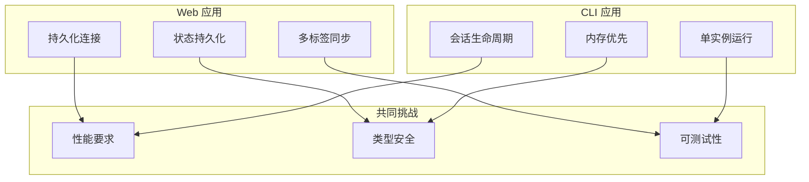
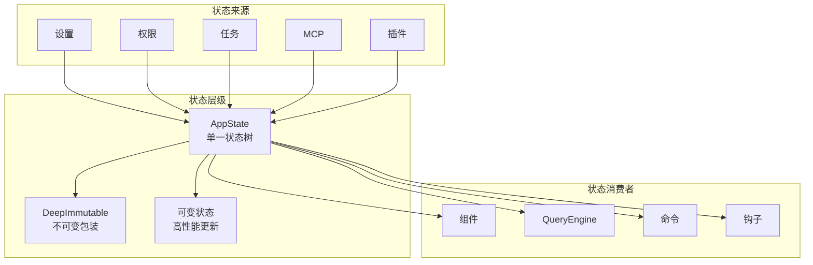
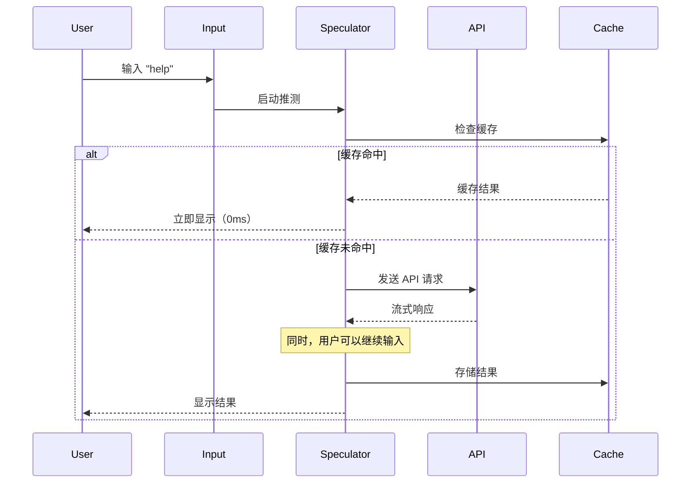
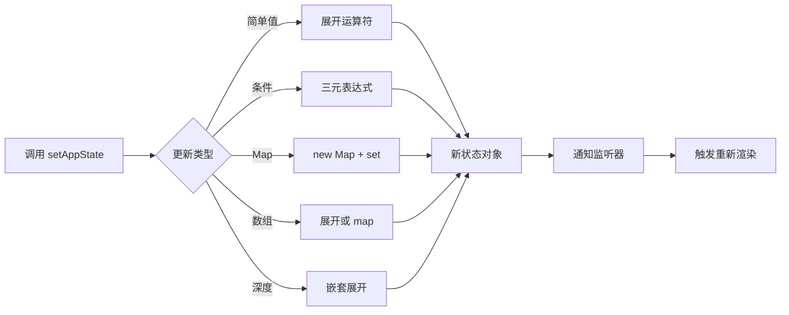
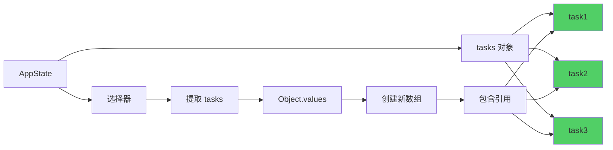
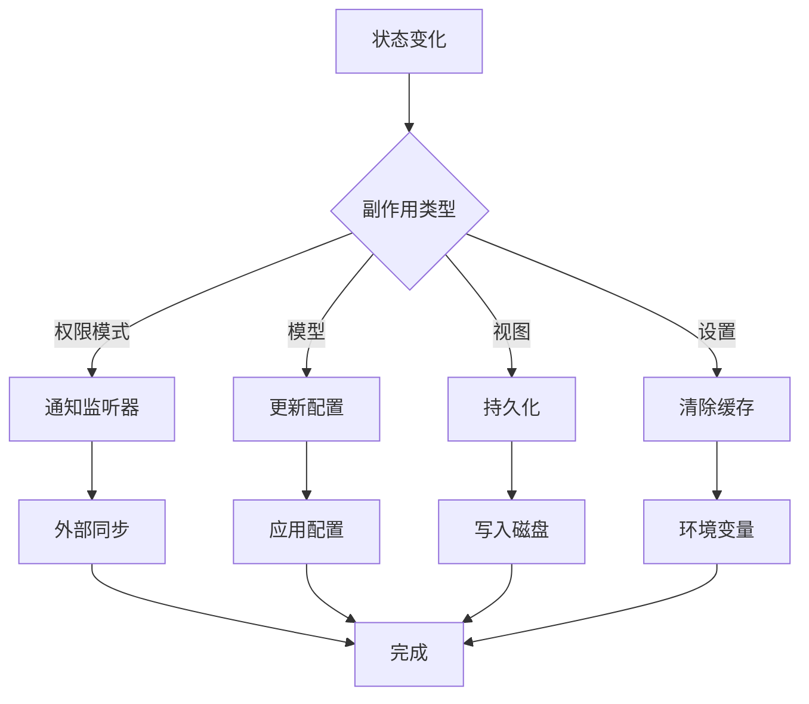
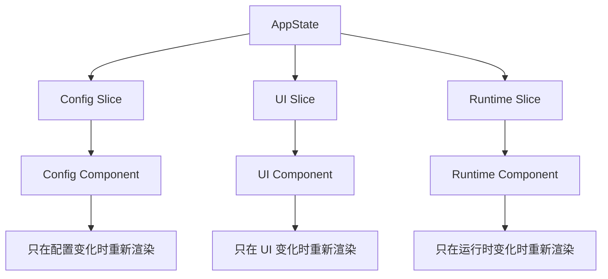

# 第 21 章：状态管理架构

> 本章目标：深入理解 Claude Code 的状态管理机制、不可变更新模式和性能优化策略。

## 21.1 状态管理设计理念

### 21.1.1 状态管理的核心挑战

CLI 应用的状态管理面临独特挑战：



**Claude Code 的状态管理原则：**

1. **单一状态树**：所有状态集中在 AppState
2. **不可变更新**：通过 setAppState 函数式更新
3. **最小重渲染**：通过选择器订阅切片
4. **可持久化**：关键状态自动保存

### 21.1.2 状态架构全景图



## 21.2 AppState 类型系统

### 21.2.1 AppState 完整定义

```typescript
/**
 * AppState 完整类型定义
 */
export type AppState = DeepImmutable<{
  // ========== 配置与设置 ==========
  settings: SettingsJson
  verbose: boolean
  mainLoopModel: ModelSetting
  mainLoopModelForSession: ModelSetting
  statusLineText: string | undefined

  // ========== 视图状态 ==========
  expandedView: 'none' | 'tasks' | 'teammates'
  isBriefOnly: boolean
  showTeammateMessagePreview?: boolean  // 条件编译
  selectedIPAgentIndex: number
  coordinatorTaskIndex: number
  viewSelectionMode: 'none' | 'selecting-agent' | 'viewing-agent'
  footerSelection: FooterItem | null

  // ========== 权限上下文 ==========
  toolPermissionContext: ToolPermissionContext

  // ========== Agent 配置 ==========
  agent: string | undefined
  kairosEnabled: boolean

  // ========== Remote 会话 ==========
  remoteSessionUrl: string | undefined
  remoteConnectionStatus: 'connecting' | 'connected' | 'reconnecting' | 'disabled'
  remoteBackgroundTaskCount: number

  // ========== Bridge 状态 ==========
  replBridgeEnabled: boolean
  replBridgeExplicit: boolean
  replBridgeOutboundOnly: boolean
  replBridgeConnected: boolean
  replBridgeSessionActive: boolean
  replBridgeReconnecting: boolean
  replBridgeConnectUrl: string | undefined
  replBridgeSessionUrl: string | undefined
  replBridgeEnvironmentId: string | undefined
  replBridgeSessionId: string | undefined
  replBridgeError: string | undefined
  replBridgeInitialName: string | undefined
  showRemoteCallout: boolean

}> & {
  // ========== 可变状态（排除在 DeepImmutable 外）==========

  // 任务状态（高频更新）
  tasks: { [taskId: string]: TaskState }

  // Agent 名称注册
  agentNameRegistry: Map<string, AgentId>

  // 前台任务
  foregroundedTaskId?: string

  // 查看的 Agent 任务
  viewingAgentTaskId?: string

  // 伙伴反应
  companionReaction?: string
  companionPetAt?: number

  // ========== MCP 状态 ==========
  mcp: {
    clients: MCPServerConnection[]
    tools: Tool[]
    commands: Command[]
    resources: Record<string, ServerResource[]>
    pluginReconnectKey: number
  }

  // ========== 插件状态 ==========
  plugins: {
    enabled: LoadedPlugin[]
    disabled: LoadedPlugin[]
    commands: Command[]
    errors: PluginError[]
    installationStatus: {
      marketplaces: Array<{...}>
      plugins: Array<{...}>
    }
    needsRefresh: boolean
  }

  // ========== 其他功能状态 ==========
  agentDefinitions: AgentDefinitionsResult
  fileHistory: FileHistoryState
  attribution: AttributionState
  todos: { [agentId: string]: TodoList }
  remoteAgentTaskSuggestions: Array<{summary: string; task: string}>
  notifications: {
    current: Notification | null
    queue: Notification[]
  }
  elicitation: {
    queue: ElicitationRequestEvent[]
  }
  thinkingEnabled: boolean | undefined
  promptSuggestionEnabled: boolean
  sessionHooks: SessionHooksState

  // ========== Tungsten (tmux 集成) ==========
  tungstenActiveSession?: {...}
  tungstenLastCapturedTime?: number
  tungstenLastCommand?: {...}
  tungstenPanelVisible?: boolean
  tungstenPanelAutoHidden?: boolean

  // ========== WebBrowser (bagel) ==========
  bagelActive?: boolean
  bagelUrl?: string
  bagelPanelVisible?: boolean

  // ========== Computer Use (chicago) ==========
  computerUseMcpState?: {...}
}
```

**设计意图分析：**

1. **DeepImmutable 包装**：保护配置和视图状态不被意外修改
2. **可变状态排除**：tasks、Map 等需要高性能更新的结构
3. **条件编译字段**：`showTeammateMessagePreview?` 只在特定构建中存在

### 21.2.2 DeepImmutable 类型

```typescript
/**
 * DeepImmutable 类型标记
 *
 * 这是一个标记类型，告诉 TypeScript 某些对象应该是不可变的。
 * 实际的不可变性通过编程约定和 lint 规则保证。
 */
export type DeepImmutable<T> = T & {
  readonly [K in keyof T]: DeepImmutable<T[K]>
}

/**
 * 使用示例
 */
const immutableState: DeepImmutable<{
  name: string
  count: number
  nested: {
    value: number
  }
}> = {
  name: 'test',
  count: 0,
  nested: { value: 1 },
}

// ❌ 编译错误（尝试修改）
// immutableState.name = 'new'  // Error: Cannot assign to 'name' because it is read-only

// ✅ 正确（创建新对象）
const newState: DeepImmutable<typeof immutableState> = {
  ...immutableState,
  name: 'new',
}
```

### 21.2.3 SpeculationState 类型

```typescript
/**
 * 推测执行状态
 *
 * 用于在用户输入时提前计算 AI 响应，节省等待时间。
 */
export type SpeculationState =
  | { status: 'idle' }
  | {
      status: 'active'
      id: string
      abort: () => void
      startTime: number
      messagesRef: { current: Message[] }  // 可变引用
      writtenPathsRef: { current: Set<string> }  // 可变引用
      boundary: CompletionBoundary | null
      suggestionLength: number
      toolUseCount: number
      isPipelined: boolean
      contextRef: { current: REPLHookContext }
      pipelinedSuggestion?: {
        text: string
        promptId: 'user_intent' | 'stated_intent'
        generationRequestId: string | null
      } | null
    }

/**
 * 完成边界类型
 *
 * 定义推测执行应该在何时停止。
 */
export type CompletionBoundary =
  // 完整完成
  | { type: 'complete'; completedAt: number; outputTokens: number }
  // Bash 命令完成
  | { type: 'bash'; command: string; completedAt: number }
  // 文件编辑完成
  | { type: 'edit'; toolName: string; filePath: string; completedAt: number }
  // 工具被拒绝
  | { type: 'denied_tool'; toolName: string; detail: string; completedAt: number }

/**
 * 推测执行结果
 */
export type SpeculationResult = {
  messages: Message[]
  boundary: CompletionBoundary | null
  timeSavedMs: number  // 节省的时间（毫秒）
}
```

**推测执行的工作原理：**



## 21.3 状态存储与更新

### 21.3.1 createStore 实现

```typescript
/**
 * 状态存储创建器
 */
export function createStore<T>(
  initialState: T,
  onChange?: (args: { newState: T; oldState: T }) => void
): AppStateStore {
  let state = initialState
  const listeners = new Set<(state: T) => void>()

  return {
    getState(): T {
      return state
    },

    setState(updater: (prev: T) => T): void {
      const oldState = state
      const newState = updater(oldState)

      // 引用相等性检查
      if (newState === oldState) {
        return
      }

      state = newState

      // 通知所有监听器
      for (const listener of listeners) {
        listener(newState)
      }

      // 触发 onChange 回调
      if (onChange) {
        onChange({ newState, oldState })
      }
    },

    subscribe(listener: (state: T) => void): () => void {
      listeners.add(listener)

      // 返回取消订阅函数
      return () => {
        listeners.delete(listener)
      }
    },
  }
}
```

### 21.3.2 setAppState 模式



```typescript
/**
 * setAppState 使用模式
 */

// ========== 模式 1：简单更新 ==========
setAppState(prev => ({
  ...prev,
  verbose: true,
}))

// ========== 模式 2：条件更新 ==========
setAppState(prev => ({
  ...prev,
  expandedView: prev.expandedView === 'none' ? 'tasks' : 'none',
}))

// ========== 模式 3：嵌套对象更新 ==========
setAppState(prev => ({
  ...prev,
  mcp: {
    ...prev.mcp,
    clients: [...prev.mcp.clients, newClient],
  },
}))

// ========== 模式 4：Map 更新 ==========
setAppState(prev => ({
  ...prev,
  agentNameRegistry: new Map(prev.agentNameRegistry).set(name, agentId),
}))

// ========== 模式 5：Map 删除 ==========
const newMap = new Map(prev.agentNameRegistry)
newMap.delete(name)
setAppState(prev => ({
  ...prev,
  agentNameRegistry: newMap,
}))

// ========== 模式 6：Set 更新 ==========
setAppState(prev => ({
  ...prev,
  computerUseMcpState: prev.computerUseMcpState
    ? {
        ...prev.computerUseMcpState,
        hiddenDuringTurn: new Set([
          ...(prev.computerUseMcpState.hiddenDuringTurn || []),
          bundleId,
        ]),
      }
    : prev.computerUseMcpState,
}))

// ========== 模式 7：数组更新 ==========
setAppState(prev => ({
  ...prev,
  plugins: {
    ...prev.plugins,
    enabled: [
      ...prev.plugins.enabled,
      newPlugin,
    ],
  },
}))

// ========== 模式 8：数组元素更新 ==========
setAppState(prev => ({
  ...prev,
  tasks: {
    ...prev.tasks,
    [taskId]: {
      ...prev.tasks[taskId],
      status: 'running',
    },
  },
}))

// ========== 模式 9：数组过滤 ==========
setAppState(prev => ({
  ...prev,
  plugins: {
    ...prev.plugins,
    enabled: prev.plugins.enabled.filter(p => p.id !== idToRemove),
  },
}))

// ========== 模式 10：批量更新 ==========
setAppState(prev => ({
  ...prev,
  verbose: true,
  expandedView: 'tasks',
  footerSelection: 'tasks',
}))
```

### 21.3.3 状态更新工具函数

```typescript
/**
 * 状态更新工具函数
 */

/**
 * 更新对象的某个属性
 */
export function updateIn<T, K extends keyof T>(
  obj: T,
  key: K,
  value: T[K]
): T {
  return { ...obj, [key]: value }
}

/**
 * 更新数组的某个元素
 */
export function updateInArray<T>(
  array: readonly T[],
  index: number,
  updates: Partial<T>,
): T[] {
  return array.map((item, i) =>
    i === index ? { ...item, ...updates } : item
  )
}

/**
 * 删除数组的某个元素
 */
export function removeAt<T>(
  array: readonly T[],
  index: number,
): T[] {
  return [...array.slice(0, index), ...array.slice(index + 1)]
}

/**
 * 追加到数组
 */
export function append<T>(
  array: readonly T[],
  item: T,
): T[] {
  return [...array, item]
}

/**
 * 按条件过滤数组
 */
export function filter<T>(
  array: readonly T[],
  predicate: (item: T) => boolean,
): T[] {
  return array.filter(predicate)
}

/**
 * 更新 Map
 */
export function updateMap<K, V>(
  map: Map<K, V>,
  key: K,
  value: V,
): Map<K, V> {
  return new Map(map).set(key, value)
}

/**
 * 删除 Map 键
 */
export function deleteFromMap<K, V>(
  map: Map<K, V>,
  key: K,
): Map<K, V> {
  const newMap = new Map(map)
  newMap.delete(key)
  return newMap
}

/**
 * 使用示例
 */
setAppState(prev => ({
  ...prev,
  tasks: updateInArray(
    Object.values(prev.tasks),
    0,  // 更新第一个任务
    { status: 'running' },
  ),
}))
```

## 21.4 Hooks 系统

### 21.4.1 useAppState Hook

```typescript
/**
 * 订阅 AppState 的切片
 *
 * 只在选择器返回值变化时重新渲染。
 */
export function useAppState<T>(
  selector: (state: AppState) => T
): T {
  const store = useAppStore()

  const get = (): T => {
    const state = store.getState()
    const selected = selector(state)

    // 调试检查
    if (state === selected) {
      throw new Error(
        'Your selector returned the entire state. ' +
        'This will cause the component to re-render on every state change. ' +
        'Use a more specific selector.'
      )
    }

    return selected
  }

  // useSyncExternalStore 订阅 store 变化
  return useSyncExternalStore(
    store.subscribe,
    get,
    get,  // getServerSnapshot（SSR 同步）
  )
}

/**
 * 使用示例
 */

// ❌ 错误：返回整个状态
function BadComponent() {
  const state = useAppState(s => s)  // 会抛出错误
  return <Text>{state.verbose}</Text>
}

// ✅ 正确：返回需要的切片
function GoodComponent() {
  const verbose = useAppState(s => s.verbose)
  return <Text>{verbose ? '[VERBOSE]' : ''}</Text>
}

// ✅ 正确：返回派生值
function DerivedComponent() {
  const taskCount = useAppState(s => Object.keys(s.tasks).length)
  return <Text>Tasks: {taskCount}</Text>
}
```

### 21.4.2 useSetAppState Hook

```typescript
/**
 * 获取 setAppState 而不订阅状态
 *
 * 返回稳定的引用，永远不会变化。
 */
export function useSetAppState(): (
  updater: (prev: AppState) => AppState
) => void {
  return useAppStore().setState
}

/**
 * 使用示例
 */
function ToggleButton() {
  const setAppState = useSetAppState()

  const handleClick = () => {
    setAppState(prev => ({
      ...prev,
      verbose: !prev.verbose,
    }))
  }

  return <Text onPress={handleClick}>Toggle verbose</Text>
}
```

### 21.4.3 useStateStore Hook

```typescript
/**
 * 获取 store 实例
 *
 * 用于传递给非 React 代码。
 */
export function useAppStateStore(): AppStateStore {
  return useAppStore()
}

/**
 * 使用示例：在非 React 代码中更新状态
 */
function updateStateFromNonReactCode(store: AppStateStore) {
  store.setState(prev => ({
    ...prev,
    statusLineText: 'Updated from non-React code',
  }))
}
```

## 21.5 选择器模式

### 21.5.1 选择器定义

```typescript
/**
 * 选择器函数
 *
 * 从 AppState 中提取派生数据。
 */

/**
 * 获取当前查看的队友任务
 */
export function getViewedTeammateTask(
  appState: Pick<AppState, 'viewingAgentTaskId' | 'tasks'>,
): InProcessTeammateTaskState | undefined {
  const { viewingAgentTaskId, tasks } = appState

  if (!viewingAgentTaskId) {
    return undefined
  }

  const task = tasks[viewingAgentTaskId]
  if (!task) {
    return undefined
  }

  if (!isInProcessTeammateTask(task)) {
    return undefined
  }

  return task
}

/**
 * 确定用户输入应该路由到哪个 Agent
 */
export type ActiveAgentForInput =
  | { type: 'leader' }
  | { type: 'viewed'; task: InProcessTeammateTaskState }
  | { type: 'named_agent'; task: LocalAgentTaskState }

export function getActiveAgentForInput(
  appState: AppState,
): ActiveAgentForInput {
  const viewedTask = getViewedTeammateTask(appState)

  // 优先：正在查看的队友任务
  if (viewedTask) {
    return { type: 'viewed', task: viewedTask }
  }

  // 次优：命名的 Agent 任务
  const { viewingAgentTaskId, tasks } = appState
  if (viewingAgentTaskId) {
    const task = tasks[viewingAgentTaskId]
    if (task?.type === 'local_agent') {
      return { type: 'named_agent', task }
    }
  }

  // 默认：Leader
  return { type: 'leader' }
}

/**
 * 获取活跃的任务列表
 */
export function getActiveTasks(
  appState: Pick<AppState, 'tasks'>,
): TaskState[] {
  return Object.values(appState.tasks).filter(
    task => task.status !== 'completed' && task.status !== 'failed'
  )
}

/**
 * 获取前台任务
 */
export function getForegroundedTask(
  appState: Pick<AppState, 'foregroundedTaskId' | 'tasks'>,
): TaskState | undefined {
  const { foregroundedTaskId, tasks } = appState

  if (!foregroundedTaskId) {
    return undefined
  }

  return tasks[foregroundedTaskId]
}
```

### 21.5.2 记忆化选择器

```typescript
/**
 * 记忆化选择器工厂
 *
 * 创建一个带缓存的选择器，只在依赖变化时重新计算。
 */
export function createSelector<Input, Output>(
  selector: (input: Input) => Output,
): (input: Input) => Output {
  let lastInput: Input | undefined
  let lastOutput: Output | undefined

  return (input: Input): Output => {
    // 简单的引用相等性检查
    if (lastInput === input) {
      return lastOutput!
    }

    const output = selector(input)
    lastInput = input
    lastOutput = output

    return output
  }
}

/**
 * 使用示例
 */

// 创建记忆化选择器
const getActiveTasksMemoized = createSelector((appState: AppState) => {
  return Object.values(appState.tasks).filter(
    task => task.status !== 'completed'
  )
})

const getTaskCountMemoized = createSelector((appState: AppState) => {
  return getActiveTasksMemoized(appState).length
})

// 在组件中使用
function TaskCount() {
  const count = useAppState(getTaskCountMemoized)

  return <Text>Active tasks: {count}</Text>
}
```

### 21.5.3 结构共享



**结构共享的优势：**

1. **内存效率**：相同对象共享引用
2. **比较效率**：引用相等性检查
3. **不可变性**：旧状态不会被修改

```typescript
/**
 * 结构共享示例
 */
const task1 = { id: '1', status: 'running' }
const task2 = { id: '2', status: 'pending' }

const state1 = {
  tasks: { task1, task2 },
  verbose: false,
}

// 更新 task1 的状态
const state2 = {
  ...state1,
  tasks: {
    ...state1.tasks,
    task1: { ...task1, status: 'completed' },
  },
}

// task2 引用未变
console.log(state1.tasks.task2 === state2.tasks.task2)  // true
```

## 21.6 onChangeAppState 系统响应

### 21.6.1 变化监听器

```typescript
/**
 * 状态变化响应器
 *
 * 监听 AppState 变化并触发副作用。
 */
export function onChangeAppState({
  newState,
  oldState,
}: {
  newState: AppState
  oldState: AppState
}): void {
  // ========== 权限模式变化 ==========
  if (newState.toolPermissionContext.mode !== oldState.toolPermissionContext.mode) {
    handlePermissionModeChange(newState, oldState)
  }

  // ========== 主循环模型变化 ==========
  if (newState.mainLoopModel !== oldState.mainLoopModel) {
    handleMainLoopModelChange(newState)
  }

  // ========== 视图状态变化（持久化）==========
  if (newState.expandedView !== oldState.expandedView) {
    handleExpandedViewChange(newState)
  }

  if (newState.verbose !== oldState.verbose) {
    handleVerboseChange(newState)
  }

  // ========== 设置变化 ==========
  if (newState.settings !== oldState.settings) {
    handleSettingsChange(newState, oldState)
  }

  // ========== Bridge 状态变化 ==========
  if (newState.replBridgeEnabled !== oldState.replBridgeEnabled) {
    handleBridgeEnabledChange(newState)
  }
}

/**
 * 权限模式变化处理
 */
function handlePermissionModeChange(
  newState: AppState,
  oldState: AppState,
): void {
  const prevMode = oldState.toolPermissionContext.mode
  const newMode = newState.toolPermissionContext.mode

  const prevExternal = toExternalPermissionMode(prevMode)
  const newExternal = toExternalPermissionMode(newMode)

  if (prevExternal !== newExternal) {
    notifySessionMetadataChanged({
      permission_mode: newExternal,
    })
  }

  notifyPermissionModeChanged(newMode)
}

/**
 * 主循环模型变化处理
 */
function handleMainLoopModelChange(newState: AppState): void {
  if (newState.mainLoopModel === null) {
    updateSettingsForSource('userSettings', { model: undefined })
    setMainLoopModelOverride(null)
  } else {
    updateSettingsForSource('userSettings', { model: newState.mainLoopModel })
    setMainLoopModelOverride(newState.mainLoopModel)
  }
}

/**
 * 视图状态变化处理（持久化）
 */
function handleExpandedViewChange(newState: AppState): void {
  const showExpandedTodos = newState.expandedView === 'tasks'
  const showSpinnerTree = newState.expandedView === 'teammates'

  saveGlobalConfig(current => ({
    ...current,
    showExpandedTodos,
    showSpinnerTree: showSpinnerTree,
  }))
}

/**
 * 设置变化处理
 */
function handleSettingsChange(
  newState: AppState,
  oldState: AppState,
): void {
  // 清除缓存
  clearApiKeyHelperCache()
  clearAwsCredentialsCache()
  clearGcpCredentialsCache()

  // 环境变化
  if (newState.settings.env !== oldState.settings.env) {
    applyConfigEnvironmentVariables()
  }
}
```

### 21.6.2 副作用管理



## 21.7 性能优化策略

### 21.7.1 选择器优化

```typescript
/**
 * 优化的选择器示例
 */

// ❌ 低效：每次都创建新数组
function BadComponent() {
  const tasks = useAppState(s => Object.values(s.tasks))

  return <Text>Tasks: {tasks.length}</Text>
}

// ✅ 高效：只计算长度
function GoodComponent() {
  const taskCount = useAppState(s => Object.keys(s.tasks).length)

  return <Text>Tasks: {taskCount}</Text>
}

// ✅ 最佳：使用记忆化选择器
const taskCountSelector = createSelector((s: AppState) => {
  return Object.keys(s.tasks).length
})

function BestComponent() {
  const taskCount = useAppState(taskCountSelector)

  return <Text>Tasks: {taskCount}</Text>
}
```

### 21.7.2 状态分割



**状态分割优势：**

1. **减少重渲染**：组件只订阅需要的切片
2. **提高性能**：最小化重新渲染范围
3. **改善维护**：相关状态聚合在一起

```typescript
/**
 * 状态分割示例
 */

// 配置订阅组件
function ConfigComponent() {
  const settings = useAppState(s => s.settings)
  const verbose = useAppState(s => s.verbose)

  return <Text>Theme: {settings.themeName}, Verbose: {verbose}</Text>
}

// UI 订阅组件
function StatusBar() {
  const expandedView = useAppState(s => s.expandedView)
  const footerSelection = useAppState(s => s.footerSelection)

  return (
    <Text>
      View: {expandedView} | Selection: {footerSelection}
    </Text>
  )
}

// 运行时订阅组件
function TaskList() {
  const tasks = useAppState(s => Object.values(s.tasks))

  return tasks.map(task => <TaskItem key={task.id} task={task} />)
}
```

### 21.7.3 批量更新

```typescript
/**
 * 批量更新优化
 */

// ❌ 低效：多次 setState
function badBatchUpdate() {
  setAppState(prev => ({ ...prev, verbose: true }))
  setAppState(prev => ({ ...prev, expandedView: 'tasks' }))
  setAppState(prev => ({ ...prev, footerSelection: 'tasks' }))
  // 触发 3 次重新渲染
}

// ✅ 高效：单次 setState
function goodBatchUpdate() {
  setAppState(prev => ({
    ...prev,
    verbose: true,
    expandedView: 'tasks',
    footerSelection: 'tasks',
  }))
  // 只触发 1 次重新渲染
}

// ✅ 最佳：使用工具函数
function bestBatchUpdate() {
  setAppState(prev => ({
    ...prev,
    ...updateMultiple(prev, {
      verbose: true,
      expandedView: 'tasks',
      footerSelection: 'tasks',
    }),
  }))
}

/**
 * 更新多个属性的工具函数
 */
function updateMultiple<T extends object>(
  base: T,
  updates: Partial<T>,
): T {
  return { ...base, ...updates }
}
```

## 21.8 作者评价与设计反思

### 21.8.1 优势

1. **简单性**
   - 单一状态树易于理解
   - 不需要复杂的 selector 库

2. **类型安全**
   - TypeScript 完整支持
   - 选择器类型推导

3. **性能**
   - useSyncExternalStore 高效订阅
   - 选择器减少重渲染

### 21.8.2 改进空间

1. **状态持久化**
   - 当前只有部分状态持久化
   - 可以考虑更通用的持久化机制

2. **时间旅行调试**
   - 可以考虑添加状态历史记录
   - 支持 redo/undo

3. **中间件系统**
   - 可以考虑 Redux-like 中间件
   - 统一副作用处理

## 21.9 可复用模式总结

### 模式 46：中央状态存储模式

**描述：** 单一状态树 + 不可变更新 + 订阅通知。

**代码模板：**

```typescript
// 1. 状态类型
export type State = {
  readonly config: Config
  readonly ui: UIState
  items: { [id: string]: Item }
  selection: Set<string>
}

// 2. 创建 store
export function createStateStore(
  initialState: State,
  onChange?: (newState: State, oldState: State) => void
) {
  let state = initialState
  const listeners = new Set<(state: State) => void>()

  return {
    getState: () => state,

    setState: (updater: (prev: State) => State) => {
      const oldState = state
      const newState = updater(oldState)

      if (newState === oldState) return

      state = newState

      for (const listener of listeners) {
        listener(newState)
      }

      onChange?.(newState, oldState)
    },

    subscribe: (listener: (state: State) => void) => {
      listeners.add(listener)
      return () => listeners.delete(listener)
    },
  }
}

// 3. React 集成
const StateContext = createContext<StateStore | null>(null)

export function StateProvider({
  children,
  initialState,
}: {
  children: ReactNode
  initialState?: State
}) {
  const [store] = useState(() => createStateStore(initialState))

  return (
    <StateContext.Provider value={store}>
      {children}
    </StateContext.Provider>
  )
}

export function useStateSelector<T>(
  selector: (state: State) => T
): T {
  const store = useContext(StateContext)
  if (!store) throw new Error('useStateSelector must be used within StateProvider')

  return useSyncExternalStore(
    store.subscribe,
    () => selector(store.getState()),
    () => selector(store.getState()),
  )
}
```

### 模式 47：不可变状态更新模式

**描述：** 保持不可变性同时高效更新状态。

**代码模板：**

```typescript
// 对象更新
const newState = { ...oldState, updatedProp: newValue }

// 嵌套对象
const newState = { ...oldState, nested: { ...oldState.nested, updated } }

// 数组追加
const newState = { ...oldState, items: [...oldState.items, newItem] }

// 数组元素更新
const newState = {
  ...oldState,
  items: oldState.items.map((item, i) =>
    i === index ? { ...item, ...updates } : item
  ),
}

// Map 更新
const newState = { ...oldState, map: new Map(oldState.map).set(key, value) }

// Map 删除
const newMap = new Map(oldState.map)
newMap.delete(key)
const newState = { ...oldState, map: newMap }
```

## 本章小结

本章深入分析了 Claude Code 的状态管理架构：

1. **设计理念**：状态管理原则、架构全景图
2. **类型系统**：AppState 定义、DeepImmutable、SpeculationState
3. **状态存储**：createStore、setAppState 模式
4. **Hooks 系统**：useAppState、useSetAppState、useStateStore
5. **选择器模式**：选择器定义、记忆化、结构共享
6. **系统响应**：onChangeAppState、副作用管理
7. **性能优化**：选择器优化、状态分割、批量更新
8. **作者评价**：优势分析、改进空间
9. **可复用模式**：中央状态存储、不可变更新

## 下一章预告

第 22 章将深入分析 Bridge 系统（IDE 集成），包括连接管理、消息协议和会话运行器。
