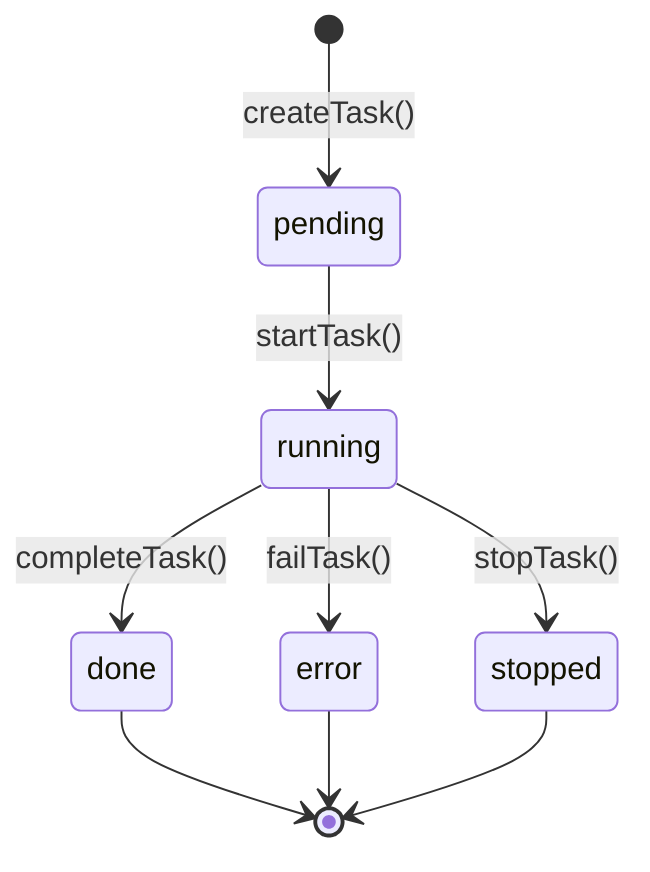

# 第 21 章：任务管理系统

> 本章目标：深入分析后台任务的创建、管理和执行机制。

## 21.1 任务类型

### TaskState 联合类型

```typescript
// src/tasks/types.ts
export type TaskState =
  | LocalShellTaskState      // 本地 Shell 任务
  | LocalAgentTaskState      // 本地 Agent 任务
  | RemoteAgentTaskState     // 远程 Agent 任务
  | InProcessTeammateTaskState  // 进程内 Teammate
  | LocalWorkflowTaskState  // 工作流任务
  | MonitorMcpTaskState     // MCP 监控任务
  | DreamTaskState          // Dream 任务

// 后台任务（在状态栏显示）
export type BackgroundTaskState =
  | LocalShellTaskState
  | LocalAgentTaskState
  | RemoteAgentTaskState
  | InProcessTeammateTaskState
  | LocalWorkflowTaskState
  | MonitorMcpTaskState
  | DreamTaskState
```

### LocalShellTask

```typescript
// src/tasks/LocalShellTask/guards.ts
export type LocalShellTaskState = {
  type: 'local_shell'
  id: string
  status: 'pending' | 'running' | 'done' | 'error' | 'stopped'
  shellCommand: string
  cwd: string
  shell: 'bash' | 'powershell' | 'pwsh' | 'cmd' | 'sh'
  createdAt: number
  startedAt?: number
  completedAt?: number
  exitCode?: number
  output: string
  errors: string[]
  // 后台标志
  isBackgrounded: boolean
  // 进程引用
  process?: ChildProcess
}

export function createLocalShellTask(config: {
  command: string
  cwd: string
  shell?: 'bash' | 'powershell'
}): LocalShellTaskState {
  return {
    type: 'local_shell',
    id: generateTaskId(),
    status: 'pending',
    shellCommand: config.command,
    cwd: config.cwd,
    shell: config.shell ?? 'bash',
    createdAt: Date.now(),
    output: '',
    errors: [],
    isBackgrounded: true,
  }
}
```

### LocalAgentTask

```typescript
// src/tasks/LocalAgentTask/LocalAgentTask.tsx
export type LocalAgentTaskState = {
  type: 'local_agent'
  id: string
  status: 'pending' | 'running' | 'done' | 'error' | 'stopped'
  agentDefinition: AgentDefinition
  messages: Message[]
  createdAt: number
  startedAt?: number
  completedAt?: number
  isBackgrounded: boolean
  // QueryEngine 引用（非序列化）
  queryEngine?: QueryEngine
}

export function createLocalAgentTask(config: {
  agentDefinition: AgentDefinition
  cwd: string
}): LocalAgentTaskState {
  return {
    type: 'local_agent',
    id: generateTaskId(),
    status: 'pending',
    agentDefinition: config.agentDefinition,
    messages: [],
    createdAt: Date.now(),
    isBackgrounded: true,
  }
}
```

## 21.2 任务生命周期



### 状态转换

```typescript
// src/tasks/stateTransitions.ts
export type TaskTransition =
  | { from: 'pending'; to: 'running' }
  | { from: 'running'; to: 'done' }
  | { from: 'running'; to: 'error' }
  | { from: 'running'; to: 'stopped' }
  | { from: 'pending'; to: 'stopped' }

export function transitionTaskState<T extends TaskState>(
  task: T,
  transition: TaskTransition,
  updates: Partial<T>,
): T {
  const { from, to } = transition

  // 验证状态转换
  if (task.status !== from) {
    throw new Error(`Invalid transition: ${task.status} -> ${to}`)
  }

  // 应用更新
  const now = Date.now()

  const baseUpdates: Partial<TaskState> = {
    status: to,
  }

  // 特定状态的时间戳
  if (to === 'running') {
    baseUpdates.startedAt = now
  } else if (to === 'done' || to === 'error' || to === 'stopped') {
    baseUpdates.completedAt = now
  }

  return {
    ...task,
    ...baseUpdates,
    ...updates,
  } as T
}
```

## 21.3 任务工具

### TaskCreateTool

```typescript
// src/tools/TaskCreate/TaskCreateTool.ts
export const TaskCreateTool: Tool = {
  name: 'create_task',
  description: 'Create a background task',
  inputJSONSchema: z.object({
    type: z.enum(['local_shell', 'local_agent']),
    command: z.string().optional(),
    agentDefinition: z.any().optional(),
    cwd: z.string(),
  }).parse(),

  handler: async (input, context) => {
    const { type, cwd } = input

    let task: TaskState

    switch (type) {
      case 'local_shell':
        if (!input.command) {
          return {
            type: 'error',
            output: 'command is required for local_shell tasks',
          }
        }
        task = createLocalShellTask({
          command: input.command,
          cwd: cwd || context.cwd,
        })
        break

      case 'local_agent':
        if (!input.agentDefinition) {
          return {
            type: 'error',
            output: 'agentDefinition is required for local_agent tasks',
          }
        }
        task = createLocalAgentTask({
          agentDefinition: input.agentDefinition,
          cwd: cwd || context.cwd,
        })
        break
    }

    // 添加到 AppState
    context.setAppState(prev => ({
      ...prev,
      tasks: {
        ...prev.tasks,
        [task.id]: task,
      },
    }))

    // 启动任务
    await startTask(task, context)

    return {
      type: 'success',
      output: `Created task ${task.id}`,
    }
  },
}
```

### TaskUpdateTool

```typescript
// src/tools/TaskUpdate/TaskUpdateTool.ts
export const TaskUpdateTool: Tool = {
  name: 'update_task',
  description: 'Update a background task',
  inputJSONSchema: z.object({
    taskId: z.string(),
    updates: z.object({
      status: z.enum(['running', 'done', 'error', 'stopped']).optional(),
      output: z.string().optional(),
      errors: z.array(z.string()).optional(),
    }).passthrough(),
  }).parse(),

  handler: async (input, context) => {
    const { taskId, updates } = input
    const task = context.appState.tasks[taskId]

    if (!task) {
      return {
        type: 'error',
        output: `Task not found: ${taskId}`,
      }
    }

    // 验证状态转换
    if (updates.status) {
      const transition = { from: task.status, to: updates.status }
      try {
        validateTransition(task, transition)
      } catch (error) {
        return {
          type: 'error',
          output: `Invalid status transition: ${error.message}`,
        }
      }
    }

    // 更新任务
    context.setAppState(prev => ({
      ...prev,
      tasks: {
        ...prev.tasks,
        [taskId]: {
          ...task,
          ...updates,
        },
      },
    }))

    return {
      type: 'success',
      output: `Task ${taskId} updated`,
    }
  },
}
```

### TaskListTool

```typescript
// src/tools/TaskList/TaskListTool.ts
export const TaskListTool: Tool = {
  name: 'list_tasks',
  description: 'List all background tasks',
  inputJSONSchema: z.object({
    filter: z.enum(['all', 'running', 'done', 'error']).optional(),
  }).parse(),

  handler: async (input, context) => {
    const { filter = 'all' } = input
    const tasks = Object.values(context.appState.tasks)

    // 过滤任务
    const filtered = tasks.filter(task => {
      if (filter === 'all') return true
      return task.status === filter
    })

    if (filtered.length === 0) {
      return {
        type: 'info',
        output: 'No tasks found',
      }
    }

    // 格式化输出
    const lines: string[] = []
    for (const task of filtered) {
      lines.push(`${task.id}: ${task.status}`)

      switch (task.type) {
        case 'local_shell':
          lines.push(`  Command: ${task.shellCommand}`)
          break

        case 'local_agent':
          lines.push(`  Agent: ${task.agentDefinition.name}`)
          break
      }

      if (task.startedAt) {
        lines.push(`  Started: ${new Date(task.startedAt).toISOString()}`)
      }
    }

    return {
      type: 'info',
      output: lines.join('\n'),
    }
  },
}
```

## 21.4 任务存储

### 持久化机制

```typescript
// src/tasks/persistence.ts
export type TaskStorage = {
  saveTasks(tasks: { [taskId: string]: TaskState }): Promise<void>
  loadTasks(): Promise<{ [taskId: string]: TaskState }>
}

export class FileTaskStorage implements TaskStorage {
  constructor(private readonly storagePath: string) {}

  async saveTasks(tasks: { [taskId: string]: TaskState }): Promise<void> {
    // 只持久化可序列化的数据
    const serializable = Object.fromEntries(
      Object.entries(tasks).map(([id, task]) => [
        id,
        this.serializeTask(task),
      ]),
    )

    await writeFile(this.storagePath, JSON.stringify(serializable, null, 2))
  }

  async loadTasks(): Promise<{ [taskId: string]: TaskState }> {
    try {
      const raw = await readFile(this.storagePath, 'utf-8')
      const parsed = JSON.parse(raw)

      const tasks: { [taskId: string]: TaskState } = {}

      for (const [id, serialized] of Object.entries(parsed)) {
        tasks[id] = this.deserializeTask(serialized)
      }

      return tasks
    } catch (error) {
      if ((error as NodeJS.ErrnoException).code === 'ENOENT') {
        return {}  // 文件不存在，返回空
      }
      throw error
    }
  }

  private serializeTask(task: TaskState): unknown {
    // 提取可序列化字段
    return {
      type: task.type,
      id: task.id,
      status: task.status,
      createdAt: task.createdAt,
      startedAt: task.startedAt,
      completedAt: task.completedAt,
      // 根据类型序列化特定字段
      ...(task.type === 'local_shell' && {
        shellCommand: task.shellCommand,
        cwd: task.cwd,
        shell: task.shell,
        output: task.output,
        errors: task.errors,
        exitCode: task.exitCode,
      }),
      ...(task.type === 'local_agent' && {
        agentDefinition: task.agentDefinition,
        messages: task.messages,
      }),
    }
  }

  private deserializeTask(data: unknown): TaskState {
    // 根据类型反序列化
    if ((data as any).type === 'local_shell') {
      return {
        ...(data as any),
        isBackgrounded: true,
      }
    }

    if ((data as any).type === 'local_agent') {
      return {
        ...(data as any),
        isBackgrounded: true,
      }
    }

    throw new Error(`Unknown task type: ${(data as any).type}`)
  }
}
```

### 任务恢复

```typescript
// src/tasks/recovery.ts
export async function resumeTasks(
  storage: TaskStorage,
  context: CommandContext,
): Promise<void> {
  const tasks = await storage.loadTasks()

  let resumedCount = 0

  for (const [taskId, task] of Object.entries(tasks)) {
    // 只恢复运行中的任务
    if (task.status !== 'running') {
      continue
    }

    try {
      switch (task.type) {
        case 'local_shell':
          await resumeShellTask(task, context)
          resumedCount++
          break

        case 'local_agent':
          await resumeAgentTask(task, context)
          resumedCount++
          break
      }
    } catch (error) {
      console.error(`Failed to resume task ${taskId}:`, error)

      // 标记为错误
      context.setAppState(prev => ({
        ...prev,
        tasks: {
          ...prev.tasks,
          [taskId]: {
            ...prev.tasks[taskId],
            status: 'error',
          } as TaskState,
        },
      }))
    }
  }

  if (resumedCount > 0) {
    console.log(`Resumed ${resumedCount} tasks`)
  }
}

async function resumeShellTask(
  task: LocalShellTaskState,
  context: CommandContext,
): Promise<void> {
  // 重新启动命令
  const process = execa(task.shellCommand, {
    cwd: task.cwd,
    shell: task.shell,
  })

  // 更新任务状态中的进程引用
  context.setAppState(prev => ({
    ...prev,
    tasks: {
      ...prev.tasks,
      [task.id]: {
        ...task,
        process,
      },
    },
  }))
}

async function resumeAgentTask(
  task: LocalAgentTaskState,
  context: CommandContext,
): Promise<void> {
  // 重新初始化 QueryEngine
  const queryEngine = await createQueryEngine({
    agent: {
      id: task.id,
      definition: task.agentDefinition,
    },
  })

  // 更新任务状态
  context.setAppState(prev => ({
    ...prev,
    tasks: {
      ...prev.tasks,
      [task.id]: {
        ...task,
        queryEngine,
        status: 'running',
      },
    },
  }))
}
```

## 21.5 并发控制

### 任务队列

```typescript
// src/tasks/queue.ts
export type TaskQueue = {
  pending: Array<{ id: string; priority: number }>
  inProgress: Set<string>
  maxConcurrency: number
}

export function createTaskQueue(maxConcurrency: number = 3): TaskQueue {
  return {
    pending: [],
    inProgress: new Set(),
    maxConcurrency,
  }
}

export async function enqueueTask(
  queue: TaskQueue,
  taskId: string,
  priority: number = 0,
  executor: (taskId: string) => Promise<void>,
): Promise<void> {
  // 添加到队列
  queue.pending.push({ id: taskId, priority })

  // 按优先级排序
  queue.pending.sort((a, b) => b.priority - a.priority)

  await processQueue(queue, executor)
}

async function processQueue(
  queue: TaskQueue,
  executor: (taskId: string) => Promise<void>,
): Promise<void> {
  while (queue.pending.length > 0 && queue.inProgress.size < queue.maxConcurrency) {
    const task = queue.pending.shift()!

    queue.inProgress.add(task.id)

    // 执行任务
    executor(task.id)
      .finally(() => {
        queue.inProgress.delete(task.id)
        // 处理下一个任务
        processQueue(queue, executor)
      })
  }
}
```

### 并发限制

```typescript
// src/tasks/concurrency.ts
export type ConcurrencyLimiter = {
  maxConcurrent: number
  running: number
  queue: Array<() => Promise<void>>
}

export function createConcurrencyLimiter(maxConcurrent: number): ConcurrencyLimiter {
  return {
    maxConcurrent,
    running: 0,
    queue: [],
  }
}

export async function schedule(
  limiter: ConcurrencyLimiter,
  work: () => Promise<void>,
): Promise<void> {
  return new Promise((resolve, reject) => {
    const task = async () => {
      try {
        limiter.running++
        await work()
      } finally {
        limiter.running--
        // 处理队列中的下一个任务
        if (limiter.queue.length > 0) {
          const next = limiter.queue.shift()!
          void next()  // 不等待
        }
        resolve()
      } catch (error) {
        reject(error)
      }
    }

    if (limiter.running < limiter.maxConcurrent) {
      // 立即执行
      void task()
    } else {
      // 加入队列
      limiter.queue.push(task)
    }
  })
}
```

## 21.6 可复用模式总结

### 模式 44：任务队列模式

**描述：** 管理后台任务的队列和并发执行。

**适用场景：**
- 后台任务执行
- 并发控制
- 任务持久化

**代码模板：**

```typescript
// 1. 任务队列实现
export class TaskQueue<T> {
  private queue: Array<{ task: T; priority: number }> = []
  private running = new Set<string>()
  private maxConcurrency: number
  private results = new Map<string, unknown>()

  constructor(maxConcurrency: number = 3) {
    this.maxConcurrency = maxConcurrency
  }

  async add(task: T, priority: number = 0): Promise<string> {
    const id = this.generateId()

    return new Promise((resolve, reject) => {
      this.queue.push({ task, priority })

      this.results.set(id, { resolve, reject })
      this.process()

      resolve(id)
    })
  }

  private async process(): Promise<void> {
    while (this.queue.length > 0 && this.running.size < this.maxConcurrency) {
      // 按优先级排序
      this.queue.sort((a, b) => b.priority - a.priority)
      const { task, priority } = this.queue.shift()!

      const id = this.generateId()
      this.running.add(id)

      // 执行任务
      this.execute(task, id)
    }
  }

  private async execute(task: T, id: string): Promise<void> {
    try {
      const result = await this.runTask(task)

      const { resolve } = this.results.get(id)!
      resolve(result)
    } catch (error) {
      const { reject } = this.results.get(id)!
      reject(error)
    } finally {
      this.running.delete(id)
      this.results.delete(id)

      // 处理下一个任务
      this.process()
    }
  }

  private async runTask(task: T): Promise<unknown> {
    // 子类实现
    throw new Error('Not implemented')
  }

  private generateId(): string {
    return Math.random().toString(36).substring(2)
  }
}

// 2. Shell 任务队列
export class ShellTaskQueue extends TaskQueue<{ command: string; cwd: string }> {
  protected async runTask(task: { command: string; cwd: string }): Promise<string> {
    const { stdout, stderr } = await execa(task.command, {
      cwd: task.cwd,
      shell: 'bash',
    })

    if (stderr) {
      throw new Error(stderr)
    }

    return stdout
  }
}

// 3. 使用示例
const queue = new ShellTaskQueue(3)  // 最多 3 个并发

// 添加任务
const id1 = await queue.add({
  command: 'npm install',
  cwd: '/project/A',
})

const id2 = await queue.add({
  command: 'npm test',
  cwd: '/project/B',
})

const id3 = await queue.add({
  command: 'npm run build',
  cwd: '/project/C',
}, 10)  // 高优先级

// 任务自动按优先级执行
```

**关键点：**
1. 优先级队列
2. 并发限制
3. Promise 包装
4. 错误处理

### 模式 45：后台任务抽象

**描述：** 统一的后台任务抽象层。

**适用场景：**
- 异步命令执行
- 进程管理
- 输出收集

**代码模板：**

```typescript
// 1. 后台任务接口
export interface BackgroundTask<TInput = void, TOutput = void> {
  readonly id: string
  readonly type: string
  readonly status: TaskStatus

  start(): Promise<void>
  stop(): Promise<void>
  getOutput(): string
  getError(): Error | null
  getResult(): TOutput | null
  onProgress(callback: (output: string) => void): () => void
}

export type TaskStatus = 'idle' | 'running' | 'done' | 'error'

// 2. 抽象后台任务
export abstract class AbstractBackgroundTask<TInput = void, TOutput = void>
  implements BackgroundTask<TInput, TOutput>
{
  protected process?: ChildProcess

  constructor(
    public readonly id: string,
    public readonly type: string,
  ) {}

  abstract getCommand(input: TInput): string[]

  getStatus(): TaskStatus {
    if (!this.process) return 'idle'
    if (this.process.exitCode === null) return 'running'
    return this.process.exitCode === 0 ? 'done' : 'error'
  }

  async start(input: TInput): Promise<void> {
    const command = this.getCommand(input)

    this.process = execa(command[0], command.slice(1), {
      stdio: ['pipe', 'pipe', 'pipe'],
    })

    this.process.stdout.on('data', (data) => {
      this.onOutput?.(data.toString())
    })

    await new Promise((resolve) => {
      this.process.on('close', resolve)
    })
  }

  async stop(): Promise<void> {
    if (this.process) {
      this.process.kill('SIGTERM')
      // 等待进程结束
      await waitForProcess(this.process)
      this.process = undefined
    }
  }

  getOutput(): string {
    return this.process?.stdout?.read()?.toString() || ''
  }

  getError(): Error | null {
    if (!this.process) return null
    if (this.getStatus() !== 'error') return null
    return new Error(this.getErrorOutput())
  }

  private getErrorOutput(): string {
    return this.process?.stderr?.read()?.toString() || ''
  }

  getResult(): TOutput | null {
    if (this.getStatus() !== 'done') return null
    return this.parseOutput(this.getOutput())
  }

  protected abstract parseOutput(output: string): TOutput

  // 进度回调
  private onProgressCallbacks = new Set<(output: string) => void>()

  onProgress(callback: (output: string) => void): () => void {
    this.onProgressCallbacks.add(callback)
    return () => this.onProgressCallbacks.delete(callback)
  }

  protected emitProgress(output: string): void {
    for (const callback of this.onProgressCallbacks) {
      callback(output)
    }
  }
}

// 3. 具体任务实现
export class NpmInstallTask extends AbstractBackgroundTask {
  constructor(id: string) {
    super(id, 'npm-install')
  }

  getCommand(input: { cwd: string; package: string }): string[] {
    return ['npm', 'install', input.package]
  }

  protected parseOutput(output: string): { installed: boolean; package: string } {
    const success = output.includes('added')
    const match = output.match(/added (\d+ package)/)
    const package = match ? `(${match[1]} packages)` : '(0 packages)'

    return { installed: success, package }
  }
}

// 4. 任务管理器
export class TaskManager {
  private tasks = new Map<string, BackgroundTask>()

  async createTask(type: string, config: unknown): Promise<string> {
    let task: BackgroundTask

    switch (type) {
      case 'npm-install':
        task = new NpmInstallTask(generateTaskId())
        break

      // 其他任务类型...
    }

    this.tasks.set(task.id, task)
    return task.id
  }

  async startTask(taskId: string): Promise<void> {
    const task = this.tasks.get(taskId)
    if (!task) throw new Error(`Task not found: ${taskId}`)

    await task.start()
  }

  async stopTask(taskId: string): Promise<void> {
    const task = this.tasks.get(taskId)
    if (!task) throw new Error(`Task not found: ${taskId}`)

    await task.stop()
  }

  getTask(taskId: string): BackgroundTask | undefined {
    return this.tasks.get(taskId)
  }

  getAllTasks(): BackgroundTask[] {
    return Array.from(this.tasks.values())
  }
}

// 5. 使用示例
const manager = new TaskManager()

// 创建任务
const taskId = await manager.createTask('npm-install', {
  cwd: '/project',
  package: 'lodash',
})

// 启动任务
await manager.startTask(taskId)

// 监听进度
const task = manager.getTask(taskId)
task?.onProgress((output) => {
  console.log(`[${task.id}] ${output}`)
})

// 获取结果
const result = await task?.getResult()
```

**关键点：**
1. 统一接口
2. 抽象基类
3. 生命周期管理
4. 进度回调
5. 结果解析

---

## 本章小结

本章分析了任务管理系统的实现：

1. **任务类型**：TaskState 联合类型、LocalShellTask、LocalAgentTask、RemoteAgentTask
2. **任务生命周期**：状态转换、transitionTaskState、时间戳管理
3. **任务工具**：TaskCreate、TaskUpdate、TaskList、TaskOutput、TaskStop
4. **任务存储**：FileTaskStorage、序列化/反序列化、任务恢复
5. **并发控制**：任务队列、并发限制、调度策略
6. **可复用模式**：任务队列模式、后台任务抽象

## 下一章预告

第 22 章将深入分析插件与技能系统，包括插件加载、技能定义和可复用工作流。
