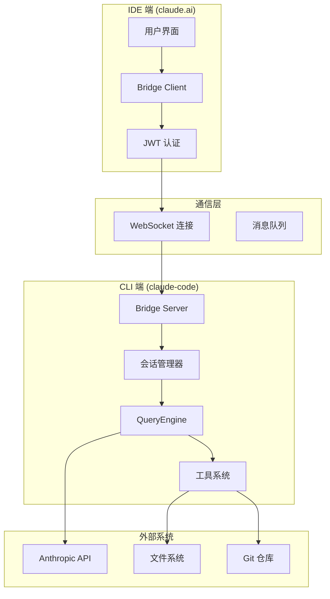
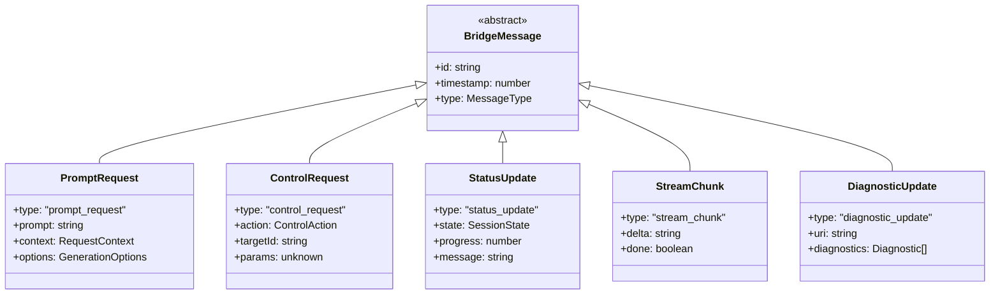
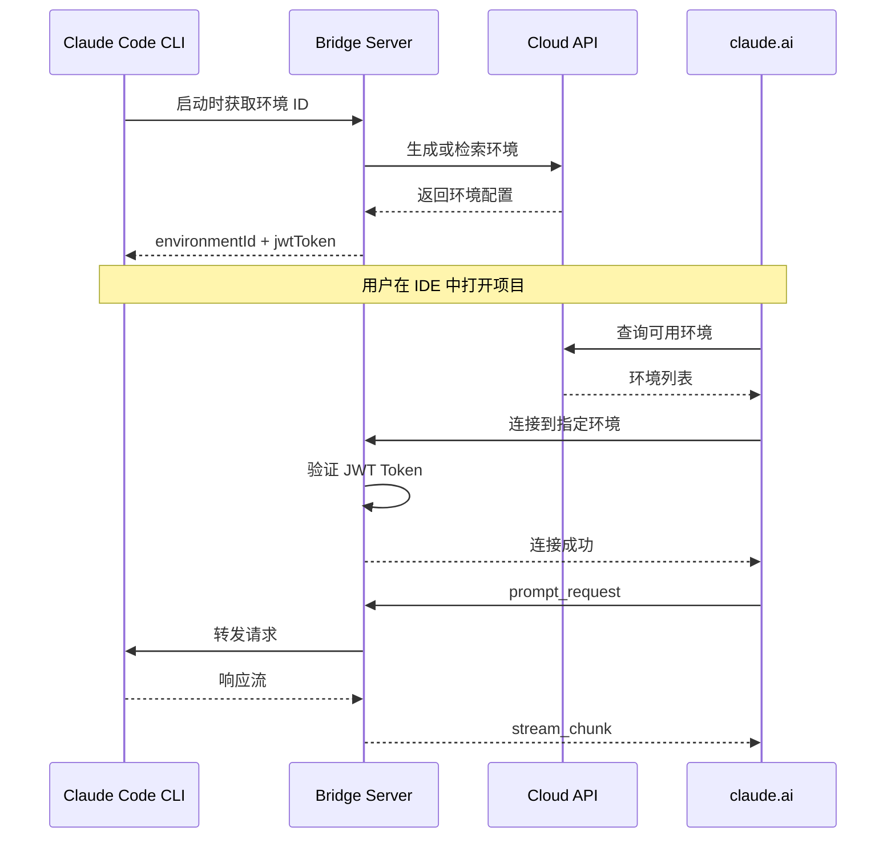
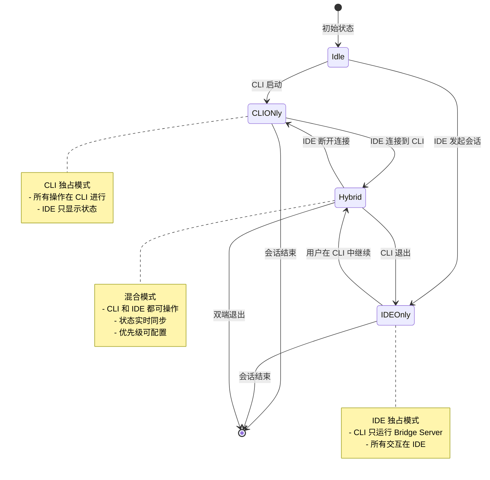
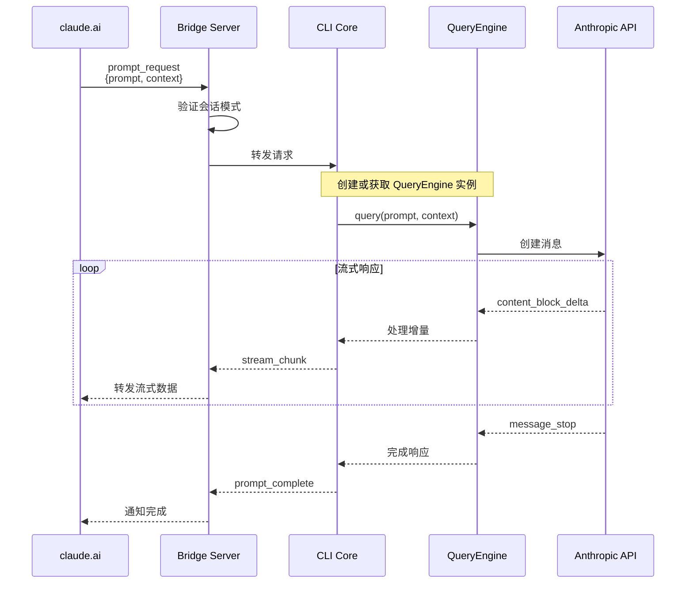
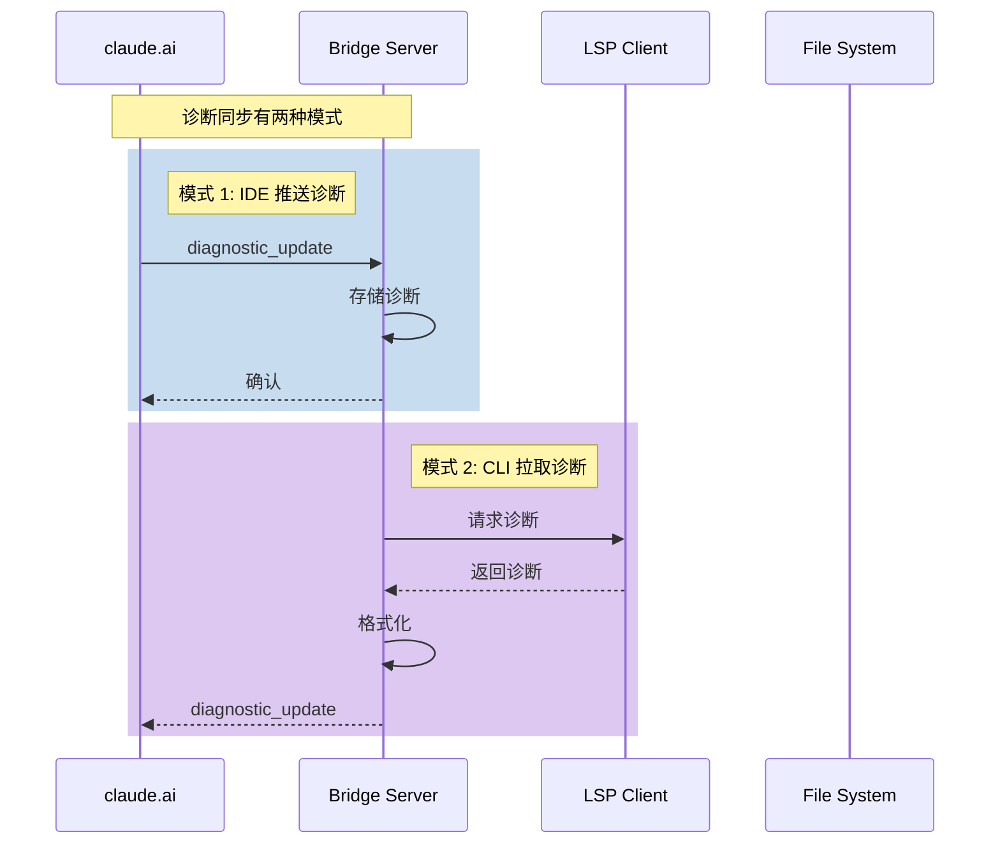
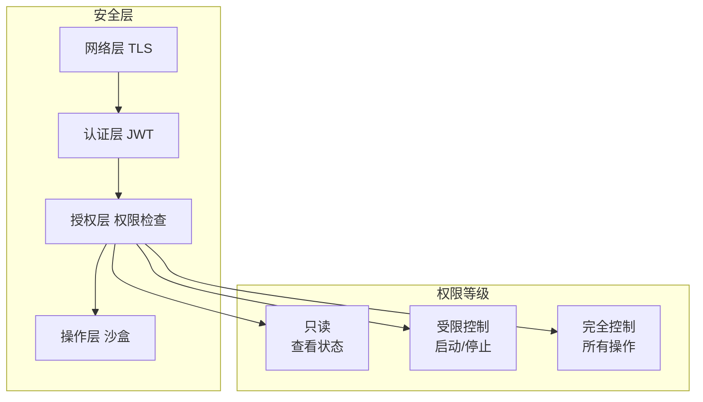

# 第 22 章：Bridge 系统与 IDE 集成

> 本章目标：深入理解 Claude Code 的 Bridge 架构，这是连接 CLI 与 IDE（claude.ai）的核心通信机制。

## 22.1 Bridge 系统概述

### 22.1.1 设计意图

Bridge 系统是 Claude Code 架构中最具创新性的组件之一。它解决了 CLI 工具长期以来的痛点：**如何让命令行工具与图形界面无缝协作**。

传统 CLI 工具面临的困境：
1. **信息孤岛**：CLI 的输出无法直接反馈到 IDE
2. **上下文切换**：用户需要在终端和编辑器之间频繁切换
3. **状态同步**：IDE 中的文件变化无法被 CLI 感知

Bridge 通过以下设计解决了这些问题：
- **双向通信**：WebSocket 实现了 CLI 与 IDE 的实时双向通信
- **会话复用**：IDE 中发起的会话可以被 CLI 接管和继续
- **状态同步**：文件变化、诊断信息可以实时传递

**作者观点**：Bridge 的设计体现了"混合界面"的先进理念——不是让 CLI 模仿 IDE，而是让两者各取所长。CLI 的交互效率（键盘驱动、脚本化）与 IDE 的可视化能力（语法高亮、文件树）完美结合。

### 22.1.2 架构全景



### 22.1.3 核心消息类型



## 22.2 环境注册与会话模式

### 22.2.1 环境注册流程

环境（Environment）是 Bridge 的核心概念，代表一个可被 IDE 接管的工作区。



### 22.2.2 JWT 认证机制

```typescript
// src/bridge/auth.ts
import { sign, verify } from 'jsonwebtoken'
import { randomBytes } from 'crypto'

export type EnvironmentConfig = {
  environmentId: string
  userId: string
  projectId: string
  capabilities: string[]
  expiresAt: number
}

export type BridgeToken = {
  environmentId: string
  userId: string
  iat: number
  exp: number
  jti: string  // JWT ID，用于令牌撤销
}

const BRIDGE_SECRET = process.env.BRIDGE_SECRET || 'default-secret'
const TOKEN_EXPIRY = 24 * 60 * 60  // 24 小时

/**
 * 生成 Bridge JWT Token
 */
export function generateBridgeToken(
  config: EnvironmentConfig,
): string {
  const payload: BridgeToken = {
    environmentId: config.environmentId,
    userId: config.userId,
    iat: Math.floor(Date.now() / 1000),
    exp: Math.floor(Date.now() / 1000) + TOKEN_EXPIRY,
    jti: randomBytes(16).toString('hex'),
  }

  return sign(payload, BRIDGE_SECRET, {
    algorithm: 'HS256',
    subject: config.userId,
    audience: 'claude-bridge',
  })
}

/**
 * 验证 Bridge Token
 */
export function verifyBridgeToken(
  token: string,
): BridgeToken | null {
  try {
    const decoded = verify(token, BRIDGE_SECRET, {
      audience: 'claude-bridge',
    }) as BridgeToken

    // 检查令牌是否过期
    if (decoded.exp < Math.floor(Date.now() / 1000)) {
      return null
    }

    return decoded
  } catch {
    return null
  }
}

/**
 * 生成唯一的 Environment ID
 */
export function generateEnvironmentId(
  userId: string,
  projectId: string,
): string {
  const hash = randomBytes(16).toString('hex')
  return `env_${userId}_${projectId}_${hash}`
}
```

**设计意图**：使用 JWT 而非简单的 API Key 有几个好处：
1. **自包含**：Token 本身包含所有必要的认证信息
2. **时效性**：自动过期限制安全风险
3. **可撤销**：通过 jti（JWT ID）可以实现黑名单机制
4. **无状态**：服务器不需要存储会话状态

### 22.2.3 会话模式

Bridge 支持多种会话协作模式：



```typescript
// src/bridge/sessionMode.ts
export enum SessionMode {
  /**
   * CLI 独占模式
   * 所有操作在 CLI 中进行，IDE 只能查看状态
   */
  CLIONly = 'cli_only',

  /**
   * IDE 独占模式
   * CLI 只运行 Bridge Server，所有交互在 IDE 中进行
   */
  IDEOnly = 'ide_only',

  /**
   * 混合模式
   * CLI 和 IDE 都可以操作，状态实时同步
   * 冲突时由 priority 决定
   */
  Hybrid = 'hybrid',
}

export type SessionConfig = {
  mode: SessionMode
  priority: 'cli' | 'ide'  // 混合模式下的优先级
  syncDiagnostics: boolean  // 是否同步诊断信息
  syncEdits: boolean  // 是否同步编辑操作
  allowRemoteControl: boolean  // 是否允许远程控制
}

export type SessionState = {
  mode: SessionMode
  activeController: 'cli' | 'ide' | null
  lastActivity: {
    cli: number
    ide: number
  }
  pendingRequests: Map<string, PendingRequest>
}

export type PendingRequest = {
  id: string
  source: 'cli' | 'ide'
  timestamp: number
  status: 'pending' | 'processing' | 'completed'
}
```

## 22.3 WebSocket 通信协议

### 22.3.1 连接建立

```typescript
// src/bridge/server.ts
import { WebSocketServer, WebSocket } from 'ws'
import { createServer, Server } from 'http'
import { verifyBridgeToken } from './auth.js'

export type BridgeServerConfig = {
  port: number
  host: string
  path: string
  heartbeatInterval: number
}

export type ClientConnection = {
  ws: WebSocket
  environmentId: string
  userId: string
  connectedAt: number
  lastPing: number
  isAlive: boolean
}

/**
 * Bridge WebSocket Server
 */
export class BridgeServer {
  private wss: WebSocketServer
  private httpServer: Server
  private clients = new Map<WebSocket, ClientConnection>()
  private heartbeatTimer: NodeJS.Timeout | null = null

  constructor(private config: BridgeServerConfig) {
    // 创建 HTTP 服务器用于升级
    this.httpServer = createServer()

    // 创建 WebSocket 服务器
    this.wss = new WebSocketServer({
      server: this.httpServer,
      path: config.path,
      verifyClient: this.verifyClient.bind(this),
    })

    this.setupHandlers()
  }

  /**
   * 客户端验证
   */
  private verifyClient(
    info: { origin: string; req: { headers: Record<string, string> } },
  ): boolean {
    const token = info.req.headers['x-bridge-token']
    if (!token || typeof token !== 'string') {
      return false
    }

    const decoded = verifyBridgeToken(token)
    if (!decoded) {
      return false
    }

    // 将验证结果附加到请求中
    ;(info.req as any).environmentId = decoded.environmentId
    ;(info.req as any).userId = decoded.userId

    return true
  }

  /**
   * 设置事件处理器
   */
  private setupHandlers(): void {
    this.wss.on('connection', (ws, req) => {
      const environmentId = (req as any).environmentId
      const userId = (req as any).userId

      const client: ClientConnection = {
        ws,
        environmentId,
        userId,
        connectedAt: Date.now(),
        lastPing: Date.now(),
        isAlive: true,
      }

      this.clients.set(ws, client)
      console.log(`Bridge client connected: ${environmentId}`)

      // 发送欢迎消息
      this.send(ws, {
        type: 'connected',
        environmentId,
        timestamp: Date.now(),
      })

      // 设置消息处理器
      ws.on('message', (data) => this.handleMessage(ws, data))

      // 设置关闭处理器
      ws.on('close', () => {
        this.clients.delete(ws)
        console.log(`Bridge client disconnected: ${environmentId}`)
      })

      // 设置 pong 处理器
      ws.on('pong', () => {
        client.isAlive = true
        client.lastPing = Date.now()
      })
    })

    // 启动心跳检测
    this.startHeartbeat()
  }

  /**
   * 启动心跳检测
   */
  private startHeartbeat(): void {
    this.heartbeatTimer = setInterval(() => {
      const now = Date.now()

      this.wss.clients.forEach((ws) => {
        const client = this.clients.get(ws)
        if (!client) return

        // 检查是否超时
        if (now - client.lastPing > this.config.heartbeatInterval * 2) {
          console.log(`Bridge client timeout: ${client.environmentId}`)
          ws.terminate()
          return
        }

        // 发送 ping
        if (client.isAlive === false) {
          ws.terminate()
          return
        }

        client.isAlive = false
        ws.ping()
      })
    }, this.config.heartbeatInterval)
  }

  /**
   * 处理消息
   */
  private async handleMessage(ws: WebSocket, data: Buffer): Promise<void> {
    const client = this.clients.get(ws)
    if (!client) return

    try {
      const message = JSON.parse(data.toString())
      console.log(`Received message from ${client.environmentId}:`, message.type)

      switch (message.type) {
        case 'prompt_request':
          await this.handlePromptRequest(client, message)
          break

        case 'control_request':
          await this.handleControlRequest(client, message)
          break

        case 'status_query':
          await this.handleStatusQuery(client, message)
          break

        default:
          console.warn(`Unknown message type: ${message.type}`)
      }
    } catch (error) {
      console.error('Error handling message:', error)
      this.sendError(ws, 'Invalid message format')
    }
  }

  /**
   * 发送消息
   */
  private send(ws: WebSocket, message: unknown): void {
    if (ws.readyState === WebSocket.OPEN) {
      ws.send(JSON.stringify(message))
    }
  }

  /**
   * 发送错误
   */
  private sendError(ws: WebSocket, error: string): void {
    this.send(ws, {
      type: 'error',
      error,
      timestamp: Date.now(),
    })
  }

  /**
   * 启动服务器
   */
  async start(): Promise<void> {
    return new Promise((resolve, reject) => {
      this.httpServer.listen(this.config.port, this.config.host, () => {
        console.log(`Bridge server listening on ${this.config.host}:${this.config.port}`)
        resolve()
      })

      this.httpServer.on('error', reject)
    })
  }

  /**
   * 停止服务器
   */
  async stop(): Promise<void> {
    if (this.heartbeatTimer) {
      clearInterval(this.heartbeatTimer)
    }

    // 关闭所有连接
    this.wss.clients.forEach((ws) => ws.close())

    return new Promise((resolve) => {
      this.wss.close(() => {
        this.httpServer.close(() => resolve())
      })
    })
  }
}
```

### 22.3.2 消息路由

```typescript
// src/bridge/router.ts
export type MessageHandler = (
  client: ClientConnection,
  message: BridgeMessage,
) => Promise<void>

export type MessageRoute = {
  type: string
  handler: MessageHandler
  allowedModes?: SessionMode[]
  requireAuth?: boolean
}

/**
 * 消息路由器
 */
export class MessageRouter {
  private routes = new Map<string, MessageRoute>()
  private middleware: Array<
    (client: ClientConnection, message: BridgeMessage) => Promise<boolean>
  > = []

  /**
   * 注册中间件
   */
  use(
    fn: (client: ClientConnection, message: BridgeMessage) => Promise<boolean>,
  ): void {
    this.middleware.push(fn)
  }

  /**
   * 注册路由
   */
  register(route: MessageRoute): void {
    this.routes.set(route.type, route)
  }

  /**
   * 路由消息
   */
  async route(
    client: ClientConnection,
    message: BridgeMessage,
  ): Promise<void> {
    // 执行中间件
    for (const mw of this.middleware) {
      const shouldContinue = await mw(client, message)
      if (!shouldContinue) {
        return
      }
    }

    // 查找路由
    const route = this.routes.get(message.type)
    if (!route) {
      console.warn(`No route for message type: ${message.type}`)
      return
    }

    // 检查权限
    if (route.requireAuth && !client.userId) {
      throw new Error('Authentication required')
    }

    // 执行处理器
    await route.handler(client, message)
  }
}

// 使用示例
const router = new MessageRouter()

// 认证中间件
router.use(async (client, message) => {
  if (message.type === 'control_request' && !client.userId) {
    console.warn('Unauthorized control request')
    return false
  }
  return true
})

// 注册路由
router.register({
  type: 'prompt_request',
  handler: handlePromptRequest,
  allowedModes: [SessionMode.Hybrid, SessionMode.IDEOnly],
})

router.register({
  type: 'control_request',
  handler: handleControlRequest,
  allowedModes: [SessionMode.Hybrid, SessionMode.IDEOnly],
  requireAuth: true,
})
```

## 22.4 Prompt 协作模式

### 22.4.1 Prompt 请求处理



### 22.4.2 上下文传递

```typescript
// src/bridge/context.ts
export type BridgeContext = {
  environmentId: string
  projectId: string
  sessionId: string

  // 文件上下文
  files: {
    activeFile?: {
      uri: string
      content: string
      selection?: Range
    }
    openFiles: Array<{
      uri: string
      version: number
    }>
  }

  // IDE 诊断信息
  diagnostics?: Array<{
    uri: string
    items: Diagnostic[]
  }>

  // Git 状态
  git?: {
    branch: string
    status: FileStatus[]
    staged: string[]
  }

  // 用户偏好
  preferences?: {
    model?: string
    temperature?: number
    inline?: boolean
  }
}

export type RequestContext = {
  bridge: BridgeContext
  cli: {
    cwd: string
    env: Record<string, string>
    shell: string
  }
}

/**
 * 上下文构建器
 */
export class ContextBuilder {
  /**
   * 从 IDE 请求构建上下文
   */
  static fromIDERequest(
    request: IDEPromptRequest,
    cliState: CLIState,
  ): RequestContext {
    return {
      bridge: {
        environmentId: request.environmentId,
        projectId: request.projectId,
        sessionId: request.sessionId,
        files: request.files ?? { openFiles: [] },
        diagnostics: request.diagnostics,
        git: request.git,
        preferences: request.preferences,
      },
      cli: {
        cwd: cliState.cwd,
        env: cliState.env,
        shell: cliState.shell,
      },
    }
  }

  /**
   * 上下文压缩
   * 减少发送到 API 的 token 数量
   */
  static compress(context: RequestContext): CompressedContext {
    const compressed: CompressedContext = {
      cwd: context.cli.cwd,
      activeFile: context.bridge.files.activeFile,
    }

    // 只包含错误的诊断信息
    if (context.bridge.diagnostics) {
      compressed.diagnostics = context.bridge.diagnostics
        .flatMap(d =>
          d.items
            .filter(item => item.severity === 'error')
            .map(item => ({
              uri: d.uri,
              message: item.message,
              range: item.range,
            }))
        )
        .slice(0, 50)  // 最多 50 个错误
    }

    // Git 状态摘要
    if (context.bridge.git) {
      compressed.gitSummary = {
        branch: context.bridge.git.branch,
        modifiedCount: context.bridge.git.status.length,
        stagedCount: context.bridge.git.staged.length,
      }
    }

    return compressed
  }
}
```

### 22.4.3 流式同步

```typescript
// src/bridge/streaming.ts
export type StreamChunk = {
  type: 'stream_chunk'
  id: string
  delta: string
  metadata?: {
    model: string
    finishReason: string | null
    usage: TokenUsage
  }
  done: boolean
}

export type StreamInterceptor = (
  chunk: StreamChunk,
) => StreamChunk | Promise<StreamChunk>

/**
 * 流管理器
 */
export class StreamManager {
  private streams = new Map<string, StreamState>()
  private interceptors: StreamInterceptor[] = []

  /**
   * 注册拦截器
   */
  use(interceptor: StreamInterceptor): void {
    this.interceptors.push(interceptor)
  }

  /**
   * 创建流
   */
  createStream(id: string, source: 'cli' | 'ide'): StreamState {
    const stream: StreamState = {
      id,
      source,
      startedAt: Date.now(),
      chunks: [],
      done: false,
    }

    this.streams.set(id, stream)
    return stream
  }

  /**
   * 添加数据块
   */
  async addChunk(chunk: StreamChunk): Promise<void> {
    const stream = this.streams.get(chunk.id)
    if (!stream) {
      console.warn(`Unknown stream: ${chunk.id}`)
      return
    }

    // 应用拦截器
    let processedChunk = chunk
    for (const interceptor of this.interceptors) {
      processedChunk = await interceptor(processedChunk)
    }

    stream.chunks.push(processedChunk)

    if (processedChunk.done) {
      stream.done = true
      stream.completedAt = Date.now()
    }
  }

  /**
   * 获取流状态
   */
  getStream(id: string): StreamState | undefined {
    return this.streams.get(id)
  }

  /**
   * 清理已完成的流
   */
  cleanup(maxAge = 60000): void {
    const now = Date.now()

    for (const [id, stream] of this.streams) {
      if (stream.done && stream.completedAt && now - stream.completedAt > maxAge) {
        this.streams.delete(id)
      }
    }
  }
}

export type StreamState = {
  id: string
  source: 'cli' | 'ide'
  startedAt: number
  completedAt?: number
  chunks: StreamChunk[]
  done: boolean
}
```

## 22.5 控制协议

### 22.5.1 远程控制操作

IDE 可以通过 Bridge 执行各种控制操作：

```typescript
// src/bridge/control.ts
export type ControlAction =
  | 'start_task'
  | 'stop_task'
  | 'pause_stream'
  | 'resume_stream'
  | 'switch_mode'
  | 'sync_files'
  | 'execute_command'
  | 'read_file'
  | 'write_file'
  | 'list_diagnostics'

export type ControlRequest = {
  type: 'control_request'
  id: string
  action: ControlAction
  params: Record<string, unknown>
  requestId?: string
}

/**
 * 控制处理器
 */
export class ControlHandler {
  constructor(
    private sessionManager: SessionManager,
    private taskManager: TaskManager,
  ) {}

  /**
   * 处理控制请求
   */
  async handle(
    client: ClientConnection,
    request: ControlRequest,
  ): Promise<ControlResponse> {
    try {
      // 检查权限
      if (!this.canExecute(client, request.action)) {
        return {
          id: request.id,
          success: false,
          error: 'Unauthorized',
        }
      }

      // 执行操作
      const result = await this.execute(client, request)

      return {
        id: request.id,
        success: true,
        result,
      }
    } catch (error) {
      return {
        id: request.id,
        success: false,
        error: String(error),
      }
    }
  }

  /**
   * 检查权限
   */
  private canExecute(
    client: ClientConnection,
    action: ControlAction,
  ): boolean {
    const session = this.sessionManager.getSession(client.environmentId)
    if (!session) return false

    // IDE Only 模式下所有操作都允许
    if (session.config.mode === SessionMode.IDEOnly) {
      return true
    }

    // Hybrid 模式下检查优先级
    if (session.config.mode === SessionMode.Hybrid) {
      // 如果配置了 IDE 优先级或 CLI 不活跃
      if (
        session.config.priority === 'ide' ||
        Date.now() - session.lastActivity.cli > 30000
      ) {
        return true
      }
    }

    // CLI Only 模式不允许远程控制
    return false
  }

  /**
   * 执行操作
   */
  private async execute(
    client: ClientConnection,
    request: ControlRequest,
  ): Promise<unknown> {
    switch (request.action) {
      case 'start_task':
        return this.startTask(client, request.params)

      case 'stop_task':
        return this.stopTask(request.params)

      case 'pause_stream':
        return this.pauseStream(request.params)

      case 'resume_stream':
        return this.resumeStream(request.params)

      case 'switch_mode':
        return this.switchMode(client, request.params)

      case 'sync_files':
        return this.syncFiles(client)

      case 'execute_command':
        return this.executeCommand(client, request.params)

      case 'read_file':
        return this.readFile(request.params)

      case 'write_file':
        return this.writeFile(client, request.params)

      case 'list_diagnostics':
        return this.listDiagnostics(client)

      default:
        throw new Error(`Unknown action: ${request.action}`)
    }
  }

  private async startTask(
    client: ClientConnection,
    params: Record<string, unknown>,
  ): Promise<string> {
    const { type, description } = params as {
      type: string
      description: string
    }

    const taskId = await this.taskManager.createTask({
      type,
      description,
      source: 'ide',
      environmentId: client.environmentId,
    })

    return taskId
  }

  private async stopTask(params: Record<string, unknown>): Promise<boolean> {
    const { taskId } = params as { taskId: string }
    return await this.taskManager.stopTask(taskId)
  }

  // ... 其他操作实现
}
```

### 22.5.2 文件同步

```typescript
// src/bridge/sync.ts
export type FileSyncEvent =
  | { type: 'created'; uri: string; content: string }
  | { type: 'updated'; uri: string; content: string; version: number }
  | { type: 'deleted'; uri: string }
  | { type: 'moved'; oldUri: string; newUri: string }

/**
 * 文件同步管理器
 */
export class FileSyncManager {
  private watchedFiles = new Set<string>()
  private fileVersions = new Map<string, number>()

  constructor(
    private bridgeServer: BridgeServer,
    private sessionManager: SessionManager,
  ) {
    this.setupWatchers()
  }

  /**
   * 设置文件监听
   */
  private setupWatchers(): void {
    // 使用 chokidar 监听文件变化
    const watcher = chokidar.watch(process.cwd(), {
      ignored: /node_modules|\.git|\.claude/,
      persistent: true,
    })

    watcher
      .on('add', (path) => this.handleFileCreated(path))
      .on('change', (path) => this.handleFileChanged(path))
      .on('unlink', (path) => this.handleFileDeleted(path))
  }

  /**
   * 处理文件创建
   */
  private async handleFileCreated(path: string): Promise<void> {
    if (!this.shouldSync(path)) return

    const content = await fs.readFile(path, 'utf-8')
    const event: FileSyncEvent = {
      type: 'created',
      uri: pathToURI(path),
      content,
    }

    this.broadcastEvent(event)
  }

  /**
   * 处理文件更新
   */
  private async handleFileChanged(path: string): Promise<void> {
    if (!this.shouldSync(path)) return

    const content = await fs.readFile(path, 'utf-8')
    const version = (this.fileVersions.get(path) ?? 0) + 1
    this.fileVersions.set(path, version)

    const event: FileSyncEvent = {
      type: 'updated',
      uri: pathToURI(path),
      content,
      version,
    }

    this.broadcastEvent(event)
  }

  /**
   * 处理文件删除
   */
  private handleFileDeleted(path: string): void {
    if (!this.shouldSync(path)) return

    const event: FileSyncEvent = {
      type: 'deleted',
      uri: pathToURI(path),
    }

    this.broadcastEvent(event)
    this.fileVersions.delete(path)
  }

  /**
   * 是否应该同步此文件
   */
  private shouldSync(path: string): boolean {
    // 检查文件类型
    const ext = extname(path)
    const textExtensions = [
      '.ts', '.tsx', '.js', '.jsx',
      '.py', '.rs', '.go', '.java',
      '.md', '.txt', '.json', '.yaml',
    ]

    if (!textExtensions.includes(ext)) return false

    // 检查大小限制
    try {
      const stats = fs.statSync(path)
      if (stats.size > 100 * 1024) return false  // 100KB
    } catch {
      return false
    }

    return true
  }

  /**
   * 广播事件到所有 IDE 客户端
   */
  private broadcastEvent(event: FileSyncEvent): void {
    const message = {
      type: 'file_sync',
      event,
      timestamp: Date.now(),
    }

    this.bridgeServer.broadcast(message)
  }
}
```

## 22.6 诊断信息同步

### 22.6.1 诊断协议



### 22.6.2 诊断管理器

```typescript
// src/bridge/diagnostics.ts
export type Diagnostic = {
  uri: string
  range: Range
  severity: 'error' | 'warning' | 'info' | 'hint'
  message: string
  code?: string | number
  source?: string
  relatedInformation?: DiagnosticRelatedInformation[]
}

export type DiagnosticBatch = {
  uri: string
  version: number
  diagnostics: Diagnostic[]
}

/**
 * 诊断管理器
 */
export class DiagnosticManager {
  private diagnostics = new Map<string, Diagnostic[]>()
  private subscribers = new Set<DiagnosticSubscriber>()

  /**
   * 更新诊断
   */
  updateDiagnostics(batch: DiagnosticBatch): void {
    this.diagnostics.set(batch.uri, batch.diagnostics)
    this.notifySubscribers(batch)
  }

  /**
   * 获取文件诊断
   */
  getDiagnostics(uri: string): Diagnostic[] {
    return this.diagnostics.get(uri) ?? []
  }

  /**
   * 获取所有错误
   */
  getAllErrors(): Diagnostic[] {
    const errors: Diagnostic[] = []

    for (const diagnostics of this.diagnostics.values()) {
      for (const diag of diagnostics) {
        if (diag.severity === 'error') {
          errors.push(diag)
        }
      }
    }

    return errors
  }

  /**
   * 订阅诊断更新
   */
  subscribe(callback: DiagnosticSubscriber): () => void {
    this.subscribers.add(callback)
    return () => this.subscribers.delete(callback)
  }

  /**
   * 通知订阅者
   */
  private notifySubscribers(batch: DiagnosticBatch): void {
    for (const subscriber of this.subscribers) {
      subscriber(batch)
    }
  }

  /**
   * 清除诊断
   */
  clear(uri?: string): void {
    if (uri) {
      this.diagnostics.delete(uri)
    } else {
      this.diagnostics.clear()
    }
  }

  /**
   * 获取诊断摘要
   */
  getSummary(): DiagnosticSummary {
    let errors = 0
    let warnings = 0
    let infos = 0
    let hints = 0

    for (const diagnostics of this.diagnostics.values()) {
      for (const diag of diagnostics) {
        switch (diag.severity) {
          case 'error':
            errors++
            break
          case 'warning':
            warnings++
            break
          case 'info':
            infos++
            break
          case 'hint':
            hints++
            break
        }
      }
    }

    return { errors, warnings, infos, hints }
  }
}

export type DiagnosticSubscriber = (
  batch: DiagnosticBatch,
) => void

export type DiagnosticSummary = {
  errors: number
  warnings: number
  infos: number
  hints: number
}
```

## 22.7 安全与权限

### 22.7.1 安全模型



### 22.7.2 权限系统

```typescript
// src/bridge/permissions.ts
export type BridgePermission =
  | 'read:state'
  | 'read:diagnostics'
  | 'read:files'
  | 'control:tasks'
  | 'control:stream'
  | 'write:files'
  | 'execute:commands'

export type PermissionLevel =
  | 'readonly'    // 只读：查看状态
  | 'limited'     // 受限：可以控制任务
  | 'full'        // 完全：所有操作

export const PERMISSION_LEVELS: Record<
  PermissionLevel,
  BridgePermission[]
> = {
  readonly: ['read:state', 'read:diagnostics', 'read:files'],
  limited: [
    'read:state',
    'read:diagnostics',
    'read:files',
    'control:tasks',
    'control:stream',
  ],
  full: [
    'read:state',
    'read:diagnostics',
    'read:files',
    'control:tasks',
    'control:stream',
    'write:files',
    'execute:commands',
  ],
}

/**
 * 权限检查器
 */
export class PermissionChecker {
  /**
   * 检查权限
   */
  static hasPermission(
    level: PermissionLevel,
    permission: BridgePermission,
  ): boolean {
    const permissions = PERMISSION_LEVELS[level]
    return permissions.includes(permission)
  }

  /**
   * 检查多个权限
   */
  static hasAllPermissions(
    level: PermissionLevel,
    permissions: BridgePermission[],
  ): boolean {
    return permissions.every(p => this.hasPermission(level, p))
  }

  /**
   * 获取权限等级
   */
  static getLevel(
    userId: string,
    environmentId: string,
  ): PermissionLevel {
    // TODO: 从数据库获取用户权限
    return 'limited'
  }
}

/**
 * 权限装饰器
 */
export function RequirePermission(permission: BridgePermission) {
  return function (
    target: unknown,
    propertyKey: string,
    descriptor: PropertyDescriptor,
  ) {
    const originalMethod = descriptor.value

    descriptor.value = async function (...args: unknown[]) {
      const [client] = args as [ClientConnection]

      const level = PermissionChecker.getLevel(
        client.userId,
        client.environmentId,
      )

      if (!PermissionChecker.hasPermission(level, permission)) {
        throw new Error(`Missing permission: ${permission}`)
      }

      return originalMethod.apply(this, args)
    }

    return descriptor
  }
}

// 使用示例
class ControlHandler {
  @RequirePermission('write:files')
  async writeFile(client: ClientConnection, params: unknown): Promise<void> {
    // 方法实现
  }

  @RequirePermission('execute:commands')
  async executeCommand(
    client: ClientConnection,
    params: unknown,
  ): Promise<void> {
    // 方法实现
  }
}
```

## 22.8 可复用模式总结

### 模式 46：双向通道协议

**描述：** 基于 WebSocket 的双向通信协议，支持实时协作。

**适用场景：**
- CLI 与 IDE 集成
- 多端协作工具
- 实时同步系统

**代码模板：**

```typescript
// 1. 消息类型定义
export type双向消息 = {
  id: string
  type: string
  timestamp: number
  source: 'client' | 'server'
}

export type 请求消息 = 双向消息 & {
  type: 'request'
  action: string
  params: unknown
}

export type 响应消息 = 双向消息 & {
  type: 'response'
  requestId: string
  result: unknown
  error?: string
}

export type 流式消息 = 双向消息 & {
  type: 'stream'
  streamId: string
  delta: string
  done: boolean
}

// 2. 双向通道
export class 双向通道 {
  private pendingRequests = new Map<string, {
    resolve: (value: unknown) => void
    reject: (error: Error) => void
  }>()

  constructor(
    private ws: WebSocket,
    private handlers: Map<string, (msg: 双向消息) => void>,
  ) {
    this.setupListener()
  }

  private setupListener(): void {
    this.ws.on('message', (data: Buffer) => {
      const msg = JSON.parse(data.toString()) as 双向消息
      this.handleMessage(msg)
    })
  }

  private handleMessage(msg: 双向消息): void {
    if (msg.type === 'response') {
      const response = msg as 响应消息
      const pending = this.pendingRequests.get(response.requestId)

      if (pending) {
        this.pendingRequests.delete(response.requestId)

        if (response.error) {
          pending.reject(new Error(response.error))
        } else {
          pending.resolve(response.result)
        }
      }
    } else {
      const handler = this.handlers.get(msg.type)
      handler?.(msg)
    }
  }

  async sendRequest(
    action: string,
    params: unknown,
  ): Promise<unknown> {
    const id = generateId()

    const request: 请求消息 = {
      id,
      type: 'request',
      timestamp: Date.now(),
      source: 'client',
      action,
      params,
    }

    return new Promise((resolve, reject) => {
      this.pendingRequests.set(id, { resolve, reject })
      this.ws.send(JSON.stringify(request))

      // 超时处理
      setTimeout(() => {
        if (this.pendingRequests.has(id)) {
          this.pendingRequests.delete(id)
          reject(new Error('Request timeout'))
        }
      }, 30000)
    })
  }

  onMessage(
    type: string,
    handler: (msg: 双向消息) => void,
  ): void {
    this.handlers.set(type, handler)
  }

  send(msg: 双向消息): void {
    this.ws.send(JSON.stringify(msg))
  }
}
```

**关键点：**
1. 请求-响应匹配
2. 超时处理
3. 消息路由
4. 错误处理
5. 流式支持

### 模式 47：会话接管

**描述：** 支持多端协作的会话管理模式。

**适用场景：**
- 跨设备协作
- 断点续传
- 多人协作

**代码模板：**

```typescript
export type 会话状态 = {
  id: string
  createdAt: number
  lastActivity: number
  controller: 'client-a' | 'client-b' | null
  data: Map<string, unknown>
}

export class 会话管理器 {
  private sessions = new Map<string, 会话状态>()

  createSession(id: string): 会话状态 {
    const session: 会话状态 = {
      id,
      createdAt: Date.now(),
      lastActivity: Date.now(),
      controller: null,
      data: new Map(),
    }

    this.sessions.set(id, session)
    return session
  }

  requestControl(
    sessionId: string,
    clientId: string,
  ): boolean {
    const session = this.sessions.get(sessionId)
    if (!session) return false

    // 如果没有控制者，直接授予
    if (!session.controller) {
      session.controller = clientId as any
      return true
    }

    // 检查当前控制者是否活跃
    const inactiveTime = Date.now() - session.lastActivity
    if (inactiveTime > 30000) {
      // 30 秒不活跃，允许抢占
      session.controller = clientId as any
      return true
    }

    return false
  }

  releaseControl(sessionId: string, clientId: string): void {
    const session = this.sessions.get(sessionId)
    if (session && session.controller === clientId) {
      session.controller = null
    }
  }

  updateActivity(sessionId: string): void {
    const session = this.sessions.get(sessionId)
    if (session) {
      session.lastActivity = Date.now()
    }
  }
}
```

**关键点：**
1. 控制权转移
2. 活跃检测
3. 抢占机制
4. 状态同步

---

## 本章小结

本章深入分析了 Bridge 系统与 IDE 集成的实现：

1. **Bridge 架构**：双向通信、会话模式、消息类型
2. **环境注册**：JWT 认证、环境 ID 生成、会话状态管理
3. **WebSocket 协议**：连接建立、消息路由、流式同步
4. **Prompt 协作**：上下文传递、流式处理、状态同步
5. **控制协议**：远程控制、文件同步、诊断同步
6. **安全模型**：权限系统、操作沙盒、安全检查
7. **可复用模式**：双向通道协议、会话接管

**设计亮点：**
- Bridge 实现了 CLI 与 IDE 的无缝协作，打破了传统工具的界限
- JWT 认证确保了安全性，同时保持了无状态
- 多种会话模式适应不同的使用场景
- 细粒度的权限控制确保了安全协作

## 下一章预告

第 23 章将深入分析 MCP（Model Context Protocol）集成系统，探讨如何通过统一协议扩展 Claude Code 的能力边界。
