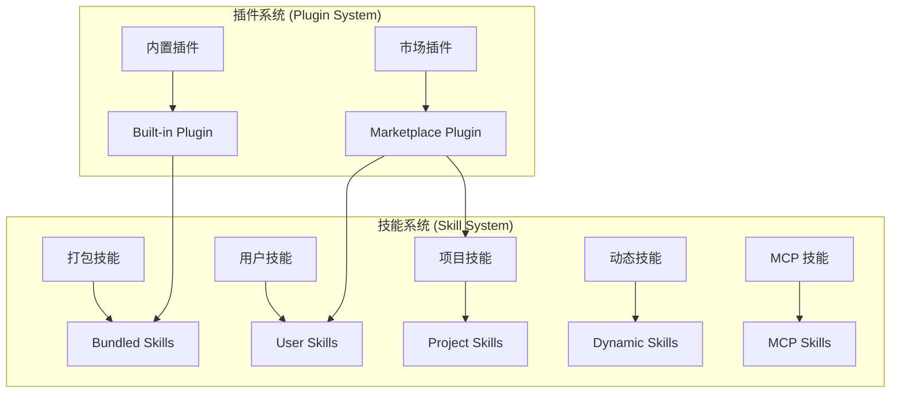
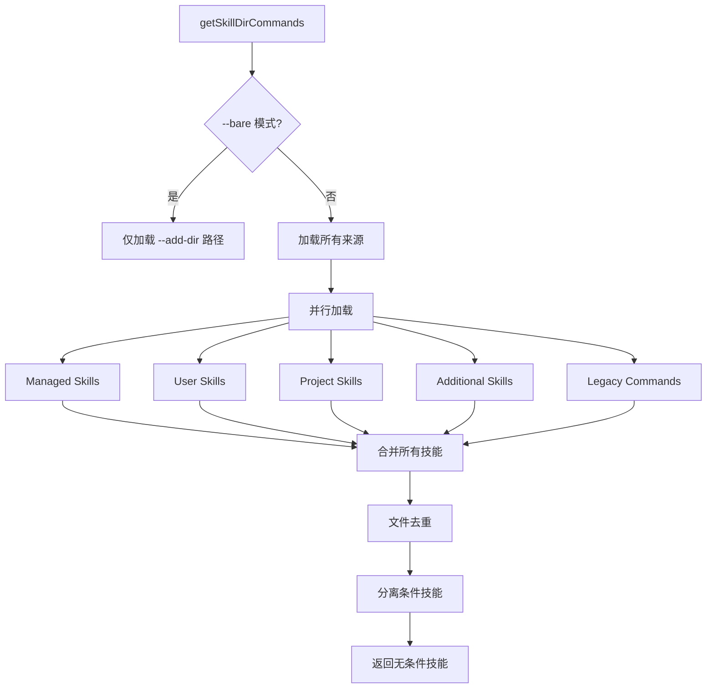
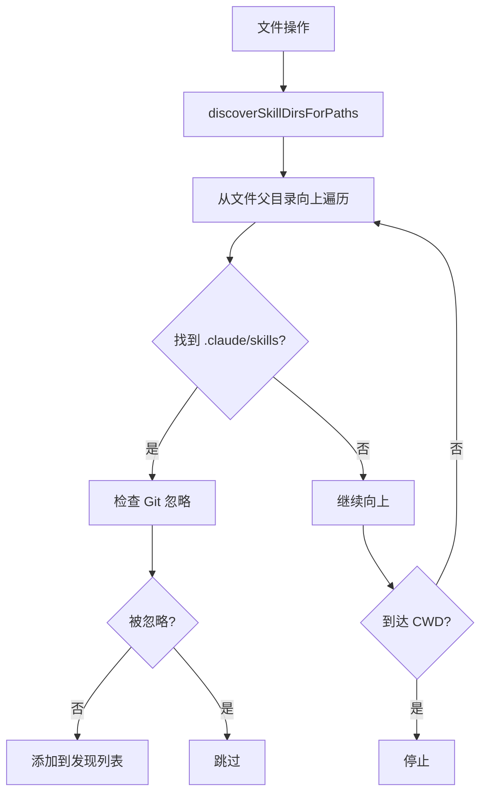

# 第 22 章：插件与技能系统

> 本章目标：深入理解 Claude Code 的插件系统和技能系统，学习如何构建可扩展的 Agent CLI。

## 22.1 插件系统架构

### 插件 vs 技能



**插件系统特点：**
- 插件可以包含多个组件（skills、hooks、MCP servers）
- 用户可以启用/禁用插件
- 插件有独立的版本管理
- 插件有依赖关系

**技能系统特点：**
- 技能是可复用的工作流
- 技能以 Markdown 文件定义
- 技能支持参数替换
- 技能可以条件激活

### 内置插件定义

```typescript
// src/plugins/builtinPlugins.ts
export type BuiltinPluginDefinition = {
  name: string
  description: string
  version: string
  defaultEnabled?: boolean
  isAvailable?: () => boolean
  skills?: BundledSkillDefinition[]
  hooks?: HooksSettings
  mcpServers?: MCPServerConfig[]
}

const BUILTIN_PLUGINS: Map<string, BuiltinPluginDefinition> = new Map()

export function registerBuiltinPlugin(
  definition: BuiltinPluginDefinition,
): void {
  BUILTIN_PLUGINS.set(definition.name, definition)
}
```

**设计意图：** 内置插件使用 Map 存储以便快速查找，`@builtin` 后缀用于区分市场插件。

### 插件启用状态

```typescript
// src/plugins/builtinPlugins.ts
export function getBuiltinPlugins(): {
  enabled: LoadedPlugin[]
  disabled: LoadedPlugin[]
} {
  const settings = getSettings_DEPRECATED()
  const enabled: LoadedPlugin[] = []
  const disabled: LoadedPlugin[] = []

  for (const [name, definition] of BUILTIN_PLUGINS) {
    if (definition.isAvailable && !definition.isAvailable()) {
      continue
    }

    const pluginId = `${name}@${BUILTIN_MARKETPLACE_NAME}`
    const userSetting = settings?.enabledPlugins?.[pluginId]
    // 优先级：用户设置 > 插件默认 > true
    const isEnabled =
      userSetting !== undefined
        ? userSetting === true
        : (definition.defaultEnabled ?? true)

    const plugin: LoadedPlugin = {
      name,
      manifest: {
        name,
        description: definition.description,
        version: definition.version,
      },
      path: BUILTIN_MARKETPLACE_NAME,
      source: pluginId,
      repository: pluginId,
      enabled: isEnabled,
      isBuiltin: true,
      hooksConfig: definition.hooks,
      mcpServers: definition.mcpServers,
    }

    if (isEnabled) {
      enabled.push(plugin)
    } else {
      disabled.push(plugin)
    }
  }

  return { enabled, disabled }
}
```

## 22.2 技能类型系统

### 技能来源

```typescript
// src/skills/loadSkillsDir.ts
export type LoadedFrom =
  | 'commands_DEPRECATED'  // 旧版 /commands/ 目录
  | 'skills'                // /skills/ 目录
  | 'plugin'                // 插件提供
  | 'managed'               // 策略管理
  | 'bundled'               // 内置打包
  | 'mcp'                   // MCP 服务器提供
```

### 技能目录结构

```
~/.claude/skills/
├── commit/
│   └── SKILL.md          # 技能定义
├── review/
│   └── SKILL.md
└── test/
    └── SKILL.md

.claude/skills/           # 项目级技能
└── project-specific/
    └── SKILL.md
```

### 技能 Frontmatter 解析

```typescript
// src/skills/loadSkillsDir.ts
export function parseSkillFrontmatterFields(
  frontmatter: FrontmatterData,
  markdownContent: string,
  resolvedName: string,
  descriptionFallbackLabel: 'Skill' | 'Custom command' = 'Skill',
): {
  displayName: string | undefined
  description: string
  hasUserSpecifiedDescription: boolean
  allowedTools: string[]
  argumentHint: string | undefined
  argumentNames: string[]
  whenToUse: string | undefined
  version: string | undefined
  model: ReturnType<typeof parseUserSpecifiedModel> | undefined
  disableModelInvocation: boolean
  userInvocable: boolean
  hooks: HooksSettings | undefined
  executionContext: 'fork' | undefined
  agent: string | undefined
  effort: EffortValue | undefined
  shell: FrontmatterShell | undefined
} {
  const validatedDescription = coerceDescriptionToString(
    frontmatter.description,
    resolvedName,
  )
  const description =
    validatedDescription ??
    extractDescriptionFromMarkdown(markdownContent, descriptionFallbackLabel)

  const userInvocable =
    frontmatter['user-invocable'] === undefined
      ? true
      : parseBooleanFrontmatter(frontmatter['user-invocable'])

  const model =
    frontmatter.model === 'inherit'
      ? undefined
      : frontmatter.model
        ? parseUserSpecifiedModel(frontmatter.model as string)
        : undefined

  const effortRaw = frontmatter['effort']
  const effort =
    effortRaw !== undefined ? parseEffortValue(effortRaw) : undefined

  // ... 更多字段解析

  return {
    displayName: frontmatter.name != null ? String(frontmatter.name) : undefined,
    description,
    hasUserSpecifiedDescription: validatedDescription !== null,
    allowedTools: parseSlashCommandToolsFromFrontmatter(frontmatter['allowed-tools']),
    argumentHint: frontmatter['argument-hint'] != null
      ? String(frontmatter['argument-hint'])
      : undefined,
    argumentNames: parseArgumentNames(frontmatter.arguments),
    whenToUse: frontmatter.when_to_use as string | undefined,
    version: frontmatter.version as string | undefined,
    model,
    disableModelInvocation: parseBooleanFrontmatter(frontmatter['disable-model-invocation']),
    userInvocable,
    hooks: parseHooksFromFrontmatter(frontmatter, resolvedName),
    executionContext: frontmatter.context === 'fork' ? 'fork' : undefined,
    agent: frontmatter.agent as string | undefined,
    effort,
    shell: parseShellFrontmatter(frontmatter.shell, resolvedName),
  }
}
```

### 技能命令创建

```typescript
// src/skills/loadSkillsDir.ts
export function createSkillCommand({
  skillName,
  displayName,
  description,
  hasUserSpecifiedDescription,
  markdownContent,
  allowedTools,
  argumentHint,
  argumentNames,
  whenToUse,
  version,
  model,
  disableModelInvocation,
  userInvocable,
  source,
  baseDir,
  loadedFrom,
  hooks,
  executionContext,
  agent,
  paths,
  effort,
  shell,
}: {
  // ... 参数定义
}): Command {
  return {
    type: 'prompt',
    name: skillName,
    description,
    hasUserSpecifiedDescription,
    allowedTools,
    argumentHint,
    argNames: argumentNames.length > 0 ? argumentNames : undefined,
    whenToUse,
    version,
    model,
    disableModelInvocation,
    userInvocable,
    context: executionContext,
    agent,
    effort,
    paths,
    contentLength: markdownContent.length,
    isHidden: !userInvocable,
    progressMessage: 'running',
    userFacingName(): string {
      return displayName || skillName
    },
    source,
    loadedFrom,
    hooks,
    skillRoot: baseDir,
    async getPromptForCommand(args, toolUseContext) {
      let finalContent = baseDir
        ? `Base directory for this skill: ${baseDir}\n\n${markdownContent}`
        : markdownContent

      // 参数替换
      finalContent = substituteArguments(
        finalContent,
        args,
        true,
        argumentNames,
      )

      // 技能目录变量替换
      if (baseDir) {
        const skillDir =
          process.platform === 'win32' ? baseDir.replace(/\\/g, '/') : baseDir
        finalContent = finalContent.replace(/\$\{CLAUDE_SKILL_DIR\}/g, skillDir)
      }

      // 会话 ID 替换
      finalContent = finalContent.replace(
        /\$\{CLAUDE_SESSION_ID\}/g,
        getSessionId(),
      )

      // 安全：MCP 技能不执行内联 shell 命令
      if (loadedFrom !== 'mcp') {
        finalContent = await executeShellCommandsInPrompt(
          finalContent,
          toolUseContext,
          `/${skillName}`,
          shell,
        )
      }

      return [{ type: 'text', text: finalContent }]
    },
  } satisfies Command
}
```

## 22.3 技能加载流程

### 技能目录加载



### 技能加载实现

```typescript
// src/skills/loadSkillsDir.ts
export const getSkillDirCommands = memoize(
  async (cwd: string): Promise<Command[]> => {
    const userSkillsDir = join(getClaudeConfigHomeDir(), 'skills')
    const managedSkillsDir = join(getManagedFilePath(), '.claude', 'skills')
    const projectSkillsDirs = getProjectDirsUpToHome('skills', cwd)

    // --bare: 跳过自动发现
    if (isBareMode()) {
      if (additionalDirs.length === 0 || !projectSettingsEnabled) {
        return []
      }
      const additionalSkillsNested = await Promise.all(
        additionalDirs.map(dir =>
          loadSkillsFromSkillsDir(
            join(dir, '.claude', 'skills'),
            'projectSettings',
          ),
        ),
      )
      return additionalSkillsNested.flat().map(s => s.skill)
    }

    // 并行加载所有来源
    const [
      managedSkills,
      userSkills,
      projectSkillsNested,
      additionalSkillsNested,
      legacyCommands,
    ] = await Promise.all([
      isEnvTruthy(process.env.CLAUDE_CODE_DISABLE_POLICY_SKILLS)
        ? Promise.resolve([])
        : loadSkillsFromSkillsDir(managedSkillsDir, 'policySettings'),
      isSettingSourceEnabled('userSettings') && !skillsLocked
        ? loadSkillsFromSkillsDir(userSkillsDir, 'userSettings')
        : Promise.resolve([]),
      projectSettingsEnabled
        ? Promise.all(
            projectSkillsDirs.map(dir =>
              loadSkillsFromSkillsDir(dir, 'projectSettings'),
            ),
          )
        : Promise.resolve([]),
      projectSettingsEnabled
        ? Promise.all(
            additionalDirs.map(dir =>
              loadSkillsFromSkillsDir(
                join(dir, '.claude', 'skills'),
                'projectSettings',
              ),
            ),
          )
        : Promise.resolve([]),
      skillsLocked ? Promise.resolve([]) : loadSkillsFromCommandsDir(cwd),
    ])

    // 合并并去重
    const allSkillsWithPaths = [
      ...managedSkills,
      ...userSkills,
      ...projectSkillsNested.flat(),
      ...additionalSkillsNested.flat(),
      ...legacyCommands,
    ]

    // 文件去重（使用 realpath 解析符号链接）
    const fileIds = await Promise.all(
      allSkillsWithPaths.map(({ skill, filePath }) =>
        skill.type === 'prompt'
          ? getFileIdentity(filePath)
          : Promise.resolve(null),
      ),
    )

    const seenFileIds = new Map<string, SettingSource>()
    const deduplicatedSkills: Command[] = []

    for (let i = 0; i < allSkillsWithPaths.length; i++) {
      const entry = allSkillsWithPaths[i]
      if (entry === undefined || entry.skill.type !== 'prompt') continue
      const { skill } = entry

      const fileId = fileIds[i]
      if (fileId === null || fileId === undefined) {
        deduplicatedSkills.push(skill)
        continue
      }

      const existingSource = seenFileIds.get(fileId)
      if (existingSource !== undefined) {
        // 跳过重复
        continue
      }

      seenFileIds.set(fileId, skill.source)
      deduplicatedSkills.push(skill)
    }

    // 分离条件技能
    const unconditionalSkills: Command[] = []
    const newConditionalSkills: Command[] = []
    for (const skill of deduplicatedSkills) {
      if (
        skill.type === 'prompt' &&
        skill.paths &&
        skill.paths.length > 0 &&
        !activatedConditionalSkillNames.has(skill.name)
      ) {
        newConditionalSkills.push(skill)
      } else {
        unconditionalSkills.push(skill)
      }
    }

    // 存储条件技能
    for (const skill of newConditionalSkills) {
      conditionalSkills.set(skill.name, skill)
    }

    return unconditionalSkills
  },
)
```

## 22.4 动态技能发现

### 技能目录发现



```typescript
// src/skills/loadSkillsDir.ts
export async function discoverSkillDirsForPaths(
  filePaths: string[],
  cwd: string,
): Promise<string[]> {
  const fs = getFsImplementation()
  const resolvedCwd = cwd.endsWith(pathSep) ? cwd.slice(0, -1) : cwd
  const newDirs: string[] = []

  for (const filePath of filePaths) {
    let currentDir = dirname(filePath)

    // 向上遍历到 CWD（但不包括 CWD）
    while (currentDir.startsWith(resolvedCwd + pathSep)) {
      const skillDir = join(currentDir, '.claude', 'skills')

      if (!dynamicSkillDirs.has(skillDir)) {
        dynamicSkillDirs.add(skillDir)
        try {
          await fs.stat(skillDir)
          // 检查是否被 gitignore
          if (await isPathGitignored(currentDir, resolvedCwd)) {
            logForDebugging(`[skills] Skipped gitignored skills dir: ${skillDir}`)
            continue
          }
          newDirs.push(skillDir)
        } catch {
          // 目录不存在
        }
      }

      const parent = dirname(currentDir)
      if (parent === currentDir) break
      currentDir = parent
    }
  }

  // 按深度排序（深的优先）
  return newDirs.sort(
    (a, b) => b.split(pathSep).length - a.split(pathSep).length,
  )
}
```

### 条件技能激活

```typescript
// src/skills/loadSkillsDir.ts
export function activateConditionalSkillsForPaths(
  filePaths: string[],
  cwd: string,
): string[] {
  if (conditionalSkills.size === 0) {
    return []
  }

  const activated: string[] = []

  for (const [name, skill] of conditionalSkills) {
    if (skill.type !== 'prompt' || !skill.paths || skill.paths.length === 0) {
      continue
    }

    const skillIgnore = ignore().add(skill.paths)
    for (const filePath of filePaths) {
      const relativePath = isAbsolute(filePath)
        ? relative(cwd, filePath)
        : filePath

      if (!relativePath || relativePath.startsWith('..') || isAbsolute(relativePath)) {
        continue
      }

      if (skillIgnore.ignores(relativePath)) {
        // 激活技能
        dynamicSkills.set(name, skill)
        conditionalSkills.delete(name)
        activatedConditionalSkillNames.add(name)
        activated.push(name)
        logForDebugging(
          `[skills] Activated conditional skill '${name}' (matched path: ${relativePath})`,
        )
        break
      }
    }
  }

  if (activated.length > 0) {
    skillsLoaded.emit()
  }

  return activated
}
```

## 22.5 内置技能

### 打包技能注册

```typescript
// src/skills/bundled/index.ts
export function initBundledSkills(): void {
  registerUpdateConfigSkill()
  registerKeybindingsSkill()
  registerVerifySkill()
  registerDebugSkill()
  registerLoremIpsumSkill()
  registerSkillifySkill()
  registerRememberSkill()
  registerSimplifySkill()
  registerBatchSkill()
  registerStuckSkill()

  // 特性门控的技能
  if (feature('KAIROS') || feature('KAIROS_DREAM')) {
    const { registerDreamSkill } = require('./dream.js')
    registerDreamSkill()
  }
  if (feature('REVIEW_ARTIFACT')) {
    const { registerHunterSkill } = require('./hunter.js')
    registerHunterSkill()
  }
  if (feature('AGENT_TRIGGERS')) {
    const { registerLoopSkill } = require('./loop.js')
    registerLoopSkill()
  }
  if (shouldAutoEnableClaudeInChrome()) {
    registerClaudeInChromeSkill()
  }
}
```

### 技能定义示例

```typescript
// src/skills/bundled/verify.ts
import { registerBundledSkill } from '../bundledSkills.js'

export function registerVerifySkill(): void {
  registerBundledSkill({
    name: 'verify',
    description: 'Verification checklist before completion',
    whenToUse: 'Before claiming work is complete',
    argumentHint: '[what to verify]',
    getPromptForCommand: (args, context) => {
      return [{
        type: 'text',
        text: `Run verification commands and confirm output before making success claims.

Evidence before assertions always.

## Steps
1. Identify what needs verification
2. Run appropriate tests/commands
3. Check actual output
4. Confirm success criteria met

## Verification Commands
\`\`\`bash
# Add test commands here
\`\`\`

Only report completion when:
- All tests pass
- Requirements confirmed
- Output verified`,
      }]
    },
  })
}
```

## 22.6 MCP 技能构建

### MCP 资源到技能

```typescript
// src/skills/mcpSkillBuilders.ts
import type { Command } from '../types/command.js'
import type { FrontmatterData } from '../utils/frontmatterParser.js'

export type MCPSkillBuilderContext = {
  createSkillCommand: typeof createSkillCommand
  parseSkillFrontmatterFields: typeof parseSkillFrontmatterFields
}

let mcpSkillBuilderContext: MCPSkillBuilderContext | null = null

export function registerMCPSkillBuilders(
  context: MCPSkillBuilderContext,
): void {
  mcpSkillBuilderContext = context
}

export function getMCPSkillBuilderContext(): MCPSkillBuilderContext | null {
  return mcpSkillBuilderContext
}

/**
 * 从 MCP 资源创建技能
 */
export async function createSkillFromMcpResource(
  resourceName: string,
  resourceContent: string,
  mcpServerName: string,
): Promise<Command | null> {
  const ctx = mcpSkillBuilderContext
  if (!ctx) return null

  try {
    const { frontmatter, content: markdownContent } = parseFrontmatter(
      resourceContent,
      `${mcpServerName}/${resourceName}`,
    )

    const skillName = `${mcpServerName}:${resourceName}`
    const parsed = ctx.parseSkillFrontmatterFields(
      frontmatter,
      markdownContent,
      skillName,
    )

    return ctx.createSkillCommand({
      ...parsed,
      skillName,
      displayName: parsed.displayName || resourceName,
      markdownContent,
      source: 'mcp',
      baseDir: undefined,
      loadedFrom: 'mcp',
      paths: undefined,
      hooks: undefined,
      executionContext: undefined,
      agent: undefined,
      effort: parsed.effort,
      shell: undefined,
    })
  } catch (error) {
    logError(error)
    return null
  }
}
```

## 22.7 可复用模式总结

### 模式 46：插件架构

**描述：** 支持动态加载和用户控制的插件系统架构。

**适用场景：**
- CLI 工具扩展
- 应用程序插件系统
- 模块化架构

**代码模板：**

```typescript
// 1. 插件类型定义
export type PluginDefinition<TConfig = unknown> = {
  name: string
  version: string
  description: string
  defaultEnabled?: boolean
  isAvailable?: () => boolean
  config?: TConfig
  initialize?: (config: TConfig) => void
  dispose?: () => void
}

export type LoadedPlugin<TConfig = unknown> = {
  name: string
  definition: PluginDefinition<TConfig>
  enabled: boolean
  config?: TConfig
}

// 2. 插件注册表
export class PluginRegistry<TConfig = unknown> {
  private plugins = new Map<string, PluginDefinition<TConfig>>()
  private userSettings = new Map<string, boolean>()

  register(definition: PluginDefinition<TConfig>): void {
    this.plugins.set(definition.name, definition)
  }

  unregister(name: string): void {
    this.plugins.delete(name)
  }

  get(name: string): PluginDefinition<TConfig> | undefined {
    return this.plugins.get(name)
  }

  list(): LoadedPlugin<TConfig>[] {
    return Array.from(this.plugins.values()).map(definition => {
      const userSetting = this.userSettings.get(definition.name)
      const enabled = userSetting ?? definition.defaultEnabled ?? true

      return {
        name: definition.name,
        definition,
        enabled,
      }
    })
  }

  setEnabled(name: string, enabled: boolean): void {
    this.userSettings.set(name, enabled)
  }

  async initializeEnabled(): Promise<void> {
    for (const plugin of this.list()) {
      if (plugin.enabled && plugin.definition.initialize) {
        await plugin.definition.initialize(plugin.config)
      }
    }
  }
}

// 3. 插件加载器
export class PluginLoader {
  async loadFromDirectory(
    directory: string,
    registry: PluginRegistry,
  ): Promise<void> {
    const entries = await fs.readdir(directory, { withFileTypes: true })

    for (const entry of entries) {
      if (!entry.isDirectory()) continue

      const manifestPath = join(directory, entry.name, 'plugin.json')
      try {
        const manifest = JSON.parse(await fs.readFile(manifestPath, 'utf-8'))
        const pluginPath = join(directory, entry.name)

        const { load } = await import(pluginPath)
        const plugin = await load(manifest)

        registry.register(plugin)
      } catch (error) {
        console.error(`Failed to load plugin ${entry.name}:`, error)
      }
    }
  }
}
```

**关键点：**
1. 定义清晰的插件接口
2. 使用注册表管理插件
3. 支持启用/禁用控制
4. 延迟初始化插件
5. 错误隔离（单个插件失败不影响其他）

### 模式 47：可复用工作流模式

**描述：** 使用 Markdown 定义可复用的工作流（技能/脚本）。

**适用场景：**
- CLI 工作流自动化
- 文档生成
- 测试脚本

**代码模板：**

```typescript
// 1. Frontmatter 解析
export type WorkflowFrontmatter = {
  name?: string
  description?: string
  arguments?: string | string[]
  'argument-hint'?: string
  'allowed-tools'?: string[]
  when_to_use?: string
  version?: string
}

export function parseWorkflowFrontmatter(
  content: string,
): { frontmatter: WorkflowFrontmatter; body: string } {
  const frontmatterRegex = /^---\n([\s\S]+?)\n---\n([\s\S]*)$/
  const match = content.match(frontmatterRegex)

  if (!match) {
    return { frontmatter: {}, body: content }
  }

  const frontmatter: WorkflowFrontmatter = {}
  const lines = match[1].split('\n')

  for (const line of lines) {
    const colonIndex = line.indexOf(':')
    if (colonIndex === -1) continue

    const key = line.slice(0, colonIndex).trim()
    const value = line.slice(colonIndex + 1).trim()

    // 处理不同的值类型
    if (value.startsWith('"') && value.endsWith('"')) {
      frontmatter[key] = value.slice(1, -1)
    } else if (value === 'true') {
      frontmatter[key] = true
    } else if (value === 'false') {
      frontmatter[key] = false
    } else {
      frontmatter[key] = value
    }
  }

  return { frontmatter, body: match[2] }
}

// 2. 参数替换
export function substituteArguments(
  template: string,
  args: string,
  argNames: string[],
): string {
  const argValues = args ? args.split(' ') : []

  let result = template

  // 替换 $1, $2, ... 位置参数
  for (let i = 0; i < argValues.length; i++) {
    result = result.replace(new RegExp(`\\$${i + 1}`, 'g'), argValues[i]!)
  }

  // 替换命名参数
  for (const [i, name] of argNames.entries()) {
    const value = argValues[i]
    if (value !== undefined) {
      result = result.replace(new RegExp(`\\$${name}`, 'g'), value)
    }
  }

  return result
}

// 3. 工作流加载器
export class WorkflowLoader {
  async loadFromDirectory(directory: string): Promise<Map<string, Workflow>> {
    const workflows = new Map<string, Workflow>()

    const entries = await fs.readdir(directory, { withFileTypes: true })

    for (const entry of entries) {
      if (!entry.isDirectory()) continue

      const workflowPath = join(directory, entry.name, 'WORKFLOW.md')
      try {
        const content = await fs.readFile(workflowPath, 'utf-8')
        const { frontmatter, body } = parseWorkflowFrontmatter(content)

        workflows.set(entry.name, {
          name: entry.name,
          displayName: frontmatter.name,
          description: frontmatter.description ?? '',
          template: body,
          argumentNames: parseArgumentNames(frontmatter.arguments),
          allowedTools: parseAllowedTools(frontmatter['allowed-tools']),
        })
      } catch (error) {
        // 跳过无效的工作流
      }
    }

    return workflows
  }

  execute(workflow: Workflow, args: string): string {
    return substituteArguments(workflow.template, args, workflow.argumentNames)
  }
}

// 4. 类型定义
export type Workflow = {
  name: string
  displayName?: string
  description: string
  template: string
  argumentNames: string[]
  allowedTools: string[]
}
```

**关键点：**
1. 使用 Frontmatter 定义元数据
2. 支持位置参数和命名参数
3. 模板字符串替换
4. 允许指定可用工具
5. 错误容错（跳过无效定义）

---

## 本章小结

本章分析了插件与技能系统的实现：

1. **插件系统**：内置插件、市场插件、启用状态管理
2. **技能类型**：多种来源（bundled/user/project/dynamic/mcp）
3. **技能加载**：并行加载、文件去重、条件分离
4. **动态发现**：基于文件操作的技能目录发现
5. **条件激活**：基于路径模式的条件技能
6. **内置技能**：打包技能注册与特性门控
7. **可复用模式**：插件架构、可复用工作流

## 下一章预告

第 23 章将深入分析配置与迁移系统，包括 Schema 验证、版本迁移、配置同步。
