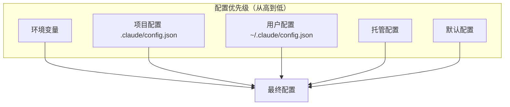
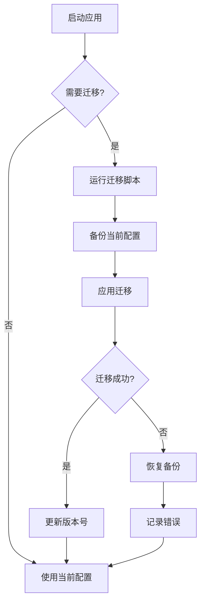

# 第 23 章：配置与迁移系统

> 本章目标：深入理解 Claude Code 的配置管理和版本迁移机制。

## 23.1 配置系统架构

### 配置层级



### 配置源类型

```typescript
// src/utils/settings/constants.ts
export type SettingSource =
  | 'policySettings'    // 策略/托管配置
  | 'userSettings'      // 用户配置
  | 'projectSettings'   // 项目配置
  | 'plugin'            // 插件配置

export function isSettingSourceEnabled(
  source: SettingSource,
): boolean {
  switch (source) {
    case 'policySettings':
      return isEnvTruthy(process.env.CLAUDE_CODE_DISABLE_POLICY_SETTINGS)
        ? false
        : true
    case 'userSettings':
      return isEnvTruthy(process.env.CLAUDE_CODE_DISABLE_USER_SETTINGS)
        ? false
        : true
    case 'projectSettings':
      return isEnvTruthy(process.env.CLAUDE_CODE_DISABLE_PROJECT_SETTINGS)
        ? false
        : true
    case 'plugin':
      return true
  }
}
```

**设计意图：** 每个配置源都可以通过环境变量独立禁用，便于调试和策略控制。

### 配置文件路径

```typescript
// src/utils/settings/managedPath.ts
import { getClaudeConfigHomeDir } from '../envUtils.js'

/**
 * 获取托管配置文件路径
 * 用于策略管理的企业配置
 */
export function getManagedFilePath(): string {
  if (process.env.CLAUDE_CODE_MANAGED_CONFIG_FILE) {
    return process.env.CLAUDE_CODE_MANAGED_CONFIG_FILE
  }

  const homeDir = getClaudeConfigHomeDir()
  return join(homeDir, 'managed_settings.json')
}

/**
 * 获取用户配置路径
 */
export function getUserSettingsPath(): string {
  return join(getClaudeConfigHomeDir(), 'settings.json')
}

/**
 * 获取项目配置路径
 */
export function getProjectSettingsPath(cwd: string): string {
  return join(cwd, '.claude', 'config.json')
}
```

## 23.2 Schema 验证系统

### Zod 集成

```typescript
// src/schemas/hooks.ts
import { z } from 'zod'

/**
 * Hooks 配置 Schema
 * 定义用户可以在 CLAUDE.md 中配置的钩子
 */
export const HooksSchema = (): z.ZodType<HooksSettings> =>
  z.object({
    // 会话开始前钩子
    SessionStart: z.array(z.string()).optional(),

    // 会话结束后钩子
    SessionEnd: z.array(z.string()).optional(),

    // 用户消息前钩子
    UserMessage: z.array(z.string()).optional(),

    // 工具使用前钩子
    BeforeToolUse: z.array(z.string()).optional(),

    // 工具使用后钩子
    AfterToolUse: z.array(z.string()).optional(),

    // 响应完成后钩子
    ResponseComplete: z.array(z.string()).optional(),

    // 命令执行前钩子
    BeforeCommand: z.array(z.string()).optional(),

    // 命令执行后钩子
    AfterCommand: z.array(z.string()).optional(),
  })

export type HooksSettings = z.infer<ReturnType<typeof HooksSchema>>
```

### 配置验证

```typescript
// src/utils/settings/types.ts
import { z } from 'zod'

/**
 * 用户配置 Schema
 */
export const UserSettingsSchema = z.object({
  // 模型配置
  model: z.string().optional(),
  temperature: z.number().min(0).max(1).optional(),
  maxTokens: z.number().int().positive().optional(),

  // 权限配置
  autoApproveRules: z.record(z.string()).optional(),
  permissionMode: z.enum(['default', 'plan', 'bypassPermissions', 'auto']).optional(),

  // UI 配置
  colorScheme: z.enum(['dark', 'light', 'daltonized']).optional(),
  inline: z.boolean().optional(),

  // 插件配置
  enabledPlugins: z.record(z.string(), z.boolean()).optional(),

  // MCP 配置
  mcpServers: z.record(z.string(), z.any()).optional(),

  // 技能配置
  enabledSkills: z.record(z.string(), z.boolean()).optional(),

  // 钩子配置
  hooks: HooksSchema().optional(),
})

export type UserSettings = z.infer<typeof UserSettingsSchema>

/**
 * 验证配置对象
 */
export function validateSettings(
  settings: unknown,
): { success: true; data: UserSettings } | { success: false; error: string } {
  const result = UserSettingsSchema.safeParse(settings)

  if (result.success) {
    return { success: true, data: result.data }
  }

  // 格式化错误信息
  const errorMessages = result.error.errors.map(
    err => `${err.path.join('.')}: ${err.message}`,
  )

  return { success: false, error: errorMessages.join(', ') }
}
```

### 配置合并

```typescript
// src/utils/settings/merge.ts
import type { UserSettings } from './types.js'

/**
 * 合并多个配置源
 * 优先级：项目 > 用户 > 托管 > 默认
 */
export function mergeSettings(
  sources: {
    policySettings?: Partial<UserSettings>
    userSettings?: Partial<UserSettings>
    projectSettings?: Partial<UserSettings>
    defaultSettings: Partial<UserSettings>
  },
): UserSettings {
  // 从低到高合并
  const merged: UserSettings = {
    ...sources.defaultSettings,
    ...sources.policySettings,
    ...sources.userSettings,
    ...sources.projectSettings,
  }

  // 特殊处理数组和对象（深度合并）
  if (sources.policySettings?.hooks) {
    merged.hooks = {
      ...sources.defaultSettings.hooks,
      ...sources.policySettings.hooks,
    }
  }

  if (sources.userSettings?.hooks) {
    merged.hooks = {
      ...merged.hooks,
      ...sources.userSettings.hooks,
    }
  }

  if (sources.projectSettings?.hooks) {
    merged.hooks = {
      ...merged.hooks,
      ...sources.projectSettings.hooks,
    }
  }

  return merged
}
```

## 23.3 迁移系统

### 迁移脚本结构



### 迁移脚本示例

```typescript
// src/migrations/migrateSonnet45ToSonnet46.ts
import { getUserSettingsPath } from '../utils/settings/managedPath.js'
import type { UserSettings } from '../utils/settings/types.js'

/**
 * 迁移 ID
 * 用于跟踪已运行的迁移
 */
export const MIGRATION_ID = 'migrate_sonnet_45_to_sonnet_46'

/**
 * 检查迁移是否需要运行
 */
export function shouldMigrate(settings: UserSettings): boolean {
  // 检查模型配置是否使用旧版本
  const model = settings.model
  return model === 'claude-sonnet-4.5' || model === 'sonnet-4.5'
}

/**
 * 执行迁移
 */
export async function migrate(settings: UserSettings): Promise<UserSettings> {
  const migrated = { ...settings }

  // 替换模型名称
  if (migrated.model === 'claude-sonnet-4.5' || migrated.model === 'sonnet-4.5') {
    migrated.model = 'claude-sonnet-4.6'
  }

  // 更新其他可能的引用
  if (migrated.agentConfig) {
    for (const agent of Object.values(migrated.agentConfig)) {
      if (agent.model === 'claude-sonnet-4.5' || agent.model === 'sonnet-4.5') {
        agent.model = 'claude-sonnet-4.6'
      }
    }
  }

  return migrated
}

/**
 * 迁移主函数
 */
export async function runMigration(): Promise<void> {
  const settingsPath = getUserSettingsPath()

  try {
    // 读取当前配置
    const content = await fs.readFile(settingsPath, 'utf-8')
    const settings: UserSettings = JSON.parse(content)

    // 检查是否需要迁移
    if (!shouldMigrate(settings)) {
      return
    }

    // 执行迁移
    const migrated = await migrate(settings)

    // 写回配置文件
    await fs.writeFile(
      settingsPath,
      JSON.stringify(migrated, null, 2),
      'utf-8',
    )

    console.log(`Migration ${MIGRATION_ID} completed`)
  } catch (error) {
    console.error(`Migration ${MIGRATION_ID} failed:`, error)
    throw error
  }
}
```

### 迁移注册表

```typescript
// src/migrations/registry.ts
export type Migration = {
  id: string
  version: string
  description: string
  shouldRun: (settings: unknown) => boolean
  migrate: (settings: unknown) => Promise<unknown>
}

const migrations: Migration[] = []
const completedMigrations = new Set<string>()

export function registerMigration(migration: Migration): void {
  migrations.push(migration)
  // 按版本排序
  migrations.sort((a, b) => a.version.localeCompare(b.version))
}

export async function runPendingMigrations(
  settings: unknown,
): Promise<unknown> {
  let current = settings

  for (const migration of migrations) {
    // 跳过已完成的迁移
    if (completedMigrations.has(migration.id)) {
      continue
    }

    // 检查是否需要运行
    if (!migration.shouldRun(current)) {
      continue
    }

    console.log(`Running migration: ${migration.id}`)

    try {
      current = await migration.migrate(current)
      completedMigrations.add(migration.id)
    } catch (error) {
      console.error(`Migration ${migration.id} failed:`, error)
      // 继续执行其他迁移
    }
  }

  return current
}

export function getCompletedMigrations(): string[] {
  return Array.from(completedMigrations)
}

export function clearCompletedMigrations(): void {
  completedMigrations.clear()
}
```

## 23.4 配置同步

### 远程配置同步

```typescript
// src/services/settings/sync.ts
import type { UserSettings } from './types.js'

export type SyncResult =
  | { success: true; settings: UserSettings }
  | { success: false; error: string }

/**
 * 从远程获取托管配置
 */
export async function fetchManagedSettings(
  apiBaseUrl: string,
  apikey: string,
): Promise<SyncResult> {
  try {
    const response = await fetch(`${apiBaseUrl}/v1/settings/managed`, {
      headers: {
        'Authorization': `Bearer ${apikey}`,
        'Content-Type': 'application/json',
      },
    })

    if (!response.ok) {
      return { success: false, error: `HTTP ${response.status}` }
    }

    const data = await response.json()

    // 验证配置
    const validation = validateSettings(data)
    if (!validation.success) {
      return { success: false, error: validation.error }
    }

    return { success: true, settings: validation.data }
  } catch (error) {
    return { success: false, error: String(error) }
  }
}

/**
 * 上传用户配置到远程
 */
export async function uploadUserSettings(
  settings: UserSettings,
  apiBaseUrl: string,
  apikey: string,
): Promise<SyncResult> {
  try {
    const response = await fetch(`${apiBaseUrl}/v1/settings/user`, {
      method: 'POST',
      headers: {
        'Authorization': `Bearer ${apikey}`,
        'Content-Type': 'application/json',
      },
      body: JSON.stringify(settings),
    })

    if (!response.ok) {
      return { success: false, error: `HTTP ${response.status}` }
    }

    return { success: true, settings }
  } catch (error) {
    return { success: false, error: String(error) }
  }
}
```

### 策略限制

```typescript
// src/utils/settings/pluginOnlyPolicy.ts
import type { SettingSource } from './constants.js'

const RESTRICTED_SETTINGS = new Set<string>([
  'skills',
  'plugins',
  'mcpServers',
])

/**
 * 检查设置是否被限制为仅插件可用
 */
export function isRestrictedToPluginOnly(settingKey: string): boolean {
  return RESTRICTED_SETTINGS.has(settingKey)
}

/**
 * 检查是否处于仅插件模式
 */
export function isPluginOnlyMode(): boolean {
  return isEnvTruthy(process.env.CLAUDE_CODE_PLUGIN_ONLY_MODE)
}
```

## 23.5 配置 UI

### /config 命令

```typescript
// src/commands/config/index.ts
import type { Command } from '../../types/command.js'

export const configCommand: Command = {
  type: 'local',
  name: 'config',
  description: 'Manage Claude Code configuration',
  userInvocable: true,
  isHidden: false,
  progressMessage: 'config',
  async handler(context) {
    // 显示配置菜单
    return showConfigMenu(context)
  },
}

async function showConfigMenu(context: CommandContext): Promise<void> {
  const { getAppState, setAppState } = context

  // 显示配置选项
  const options = [
    { key: 'm', label: 'Model', action: showModelConfig },
    { key: 'p', label: 'Permissions', action: showPermissionConfig },
    { key: 'a', label: 'Appearance', action: showAppearanceConfig },
    { key: 's', label: 'Skills', action: showSkillConfig },
    { key: 'q', label: 'Quit', action: () => {} },
  ]

  // 使用 FuzzyPicker 让用户选择
  const selected = await showFuzzyPicker({
    title: 'Configuration',
    options,
  })

  if (selected) {
    await selected.action(context)
  }
}
```

### 配置编辑器

```typescript
// src/components/config/ConfigEditor.tsx
import { Box, Text } from 'ink'

export type ConfigEditorProps = {
  settings: UserSettings
  onSave: (settings: UserSettings) => void
  onCancel: () => void
}

export function ConfigEditor({
  settings,
  onSave,
  onCancel,
}: ConfigEditorProps) {
  // 配置编辑状态
  const [edited, setEdited] = React.useState(settings)
  const [activeSection, setActiveSection] = React.useState<string>('model')

  // 配置节定义
  const sections = [
    { id: 'model', label: 'Model', component: ModelConfig },
    { id: 'permissions', label: 'Permissions', component: PermissionConfig },
    { id: 'appearance', label: 'Appearance', component: AppearanceConfig },
    { id: 'advanced', label: 'Advanced', component: AdvancedConfig },
  ]

  const ActiveComponent = sections.find(
    s => s.id === activeSection,
  )?.component ?? ModelConfig

  return (
    <Box flexDirection="column">
      <Box marginBottom={1}>
        <Text bold>Configuration Editor</Text>
      </Box>

      <Box flexDirection="row">
        {/* 侧边栏 */}
        <Box marginRight={2} borderStyle="single" paddingRight={1}>
          {sections.map(section => (
            <Box key={section.id}>
              <Text
                color={section.id === activeSection ? 'blue' : 'gray'}
              >
                {section.label}
              </Text>
            </Box>
          ))}
        </Box>

        {/* 主内容区 */}
        <Box flexGrow={1}>
          <ActiveComponent
            value={edited}
            onChange={setEdited}
          />
        </Box>
      </Box>

      {/* 操作按钮 */}
      <Box marginTop={1}>
        <Text>[S] Save </Text>
        <Text>[ESC] Cancel </Text>
      </Box>
    </Box>
  )
}
```

## 23.6 可复用模式总结

### 模式 48：分层配置系统

**描述：** 多层配置覆盖系统，支持默认值、用户配置、项目配置等。

**适用场景：**
- CLI 工具配置
- 应用程序设置
- 多环境配置

**代码模板：**

```typescript
// 1. 配置源类型
export type ConfigSource<T> = {
  name: string
  priority: number
  load: () => Promise<T | null>
  validate?: (config: unknown) => config is T
}

// 2. 分层配置加载器
export class LayeredConfigLoader<T {
  private sources: ConfigSource<T>[] = []

  registerSource(source: ConfigSource<T>): void {
    this.sources.push(source)
    // 按优先级排序（高优先级在前）
    this.sources.sort((a, b) => b.priority - a.priority)
  }

  async load(defaults: T): Promise<T> {
    // 从低到高合并
    const merged: T = { ...defaults }

    // 按优先级从低到高处理
    const sorted = [...this.sources].sort((a, b) => a.priority - b.priority)

    for (const source of sorted) {
      try {
        const config = await source.load()

        if (config !== null) {
          if (source.validate && !source.validate(config)) {
            console.warn(`Invalid config from ${source.name}`)
            continue
          }

          Object.assign(merged, config)
        }
      } catch (error) {
        console.error(`Failed to load config from ${source.name}:`, error)
      }
    }

    return merged
  }

  async reload(current: T): Promise<T> {
    return this.load(current)
  }
}

// 3. 使用示例
const loader = new LayeredConfigLoader<UserSettings>()

// 注册配置源
loader.registerSource({
  name: 'defaults',
  priority: 0,
  load: async () => defaultSettings,
})

loader.registerSource({
  name: 'policy',
  priority: 1,
  load: async () => {
    const path = getManagedFilePath()
    try {
      const content = await fs.readFile(path, 'utf-8')
      return JSON.parse(content)
    } catch {
      return null
    }
  },
})

loader.registerSource({
  name: 'user',
  priority: 2,
  load: async () => {
    const path = getUserSettingsPath()
    try {
      const content = await fs.readFile(path, 'utf-8')
      return JSON.parse(content)
    } catch {
      return null
    }
  },
})

loader.registerSource({
  name: 'project',
  priority: 3,
  load: async () => {
    const path = getProjectSettingsPath(process.cwd())
    try {
      const content = await fs.readFile(path, 'utf-8')
      return JSON.parse(content)
    } catch {
      return null
    }
  },
})

loader.registerSource({
  name: 'env',
  priority: 4,
  load: async () => {
    return {
      model: process.env.CLAUDE_MODEL,
      apiKey: process.env.ANTHROPIC_API_KEY,
    }
  },
})
```

**关键点：**
1. 优先级数字越小，优先级越低
2. 高优先级覆盖低优先级
3. 每层独立验证
4. 错误隔离
5. 异步加载支持

### 模式 49：版本迁移模式

**描述：** 数据库/配置版本迁移系统。

**适用场景：**
- 配置文件迁移
- 数据库 schema 迁移
- API 版本升级

**代码模板：**

```typescript
// 1. 迁移类型定义
export type Migration<T> = {
  id: string
  version: string
  description: string
  check: (data: T) => boolean
  migrate: (data: T) => Promise<T>
}

// 2. 迁移运行器
export class MigrationRunner<T> {
  private migrations: Migration<T>[] = []
  private completed = new Set<string>()

  register(migration: Migration<T>): void {
    this.migrations.push(migration)
    // 按版本排序
    this.migrations.sort((a, b) =>
      a.version.localeCompare(b.version),
    )
  }

  async run(data: T): Promise<T> {
    let current = data
    let hasChanges = false

    for (const migration of this.migrations) {
      // 跳过已完成的
      if (this.completed.has(migration.id)) {
        continue
      }

      // 检查是否需要迁移
      if (!migration.check(current)) {
        continue
      }

      console.log(`Running migration: ${migration.id} - ${migration.description}`)

      try {
        const previous = current
        current = await migration.migrate(current)
        this.completed.add(migration.id)
        hasChanges = true

        console.log(`Migration ${migration.id} completed`)
      } catch (error) {
        console.error(`Migration ${migration.id} failed:`, error)
        // 决定是否继续
        throw error
      }
    }

    return current
  }

  markCompleted(id: string): void {
    this.completed.add(id)
  }

  isCompleted(id: string): boolean {
    return this.completed.has(id)
  }

  clear(): void {
    this.completed.clear()
  }
}

// 3. 迁移定义示例
const runner = new MigrationRunner<UserSettings>()

runner.register({
  id: 'migrate_model_names_v1',
  version: '1.0.0',
  description: 'Update model names to new format',
  check: (data) => {
    return data.model === 'claude-3-opus-20240229'
  },
  migrate: async (data) => {
    return {
      ...data,
      model: 'claude-opus-4-20250514',
    }
  },
})

runner.register({
  id: 'migrate_permissions_v2',
  version: '2.0.0',
  description: 'Migrate permissions to new format',
  check: (data) => {
    return 'permissions' in data && !('permissionMode' in data)
  },
  migrate: async (data) => {
    const legacy = data as any
    return {
      ...data,
      permissionMode: legacy.permissions?.mode ?? 'default',
      autoApproveRules: legacy.permissions?.rules ?? {},
    }
  },
})
```

**关键点：**
1. 每个迁移有唯一的 ID
2. 版本号用于排序
3. check 函数判断是否需要迁移
4. 迁移按版本顺序执行
5. 错误处理策略（继续/终止）

---

## 本章小结

本章分析了配置与迁移系统的实现：

1. **配置系统**：多层配置、优先级处理、配置源类型
2. **Schema 验证**：Zod 集成、类型安全、错误格式化
3. **迁移系统**：迁移脚本、注册表、版本跟踪
4. **配置同步**：远程配置、托管策略、限制模式
5. **配置 UI**：/config 命令、交互式编辑器
6. **可复用模式**：分层配置系统、版本迁移模式

## 下一章预告

第 24 章将深入分析服务层与外部集成，包括 API 服务、OAuth 认证、LSP 集成、遥测系统。
