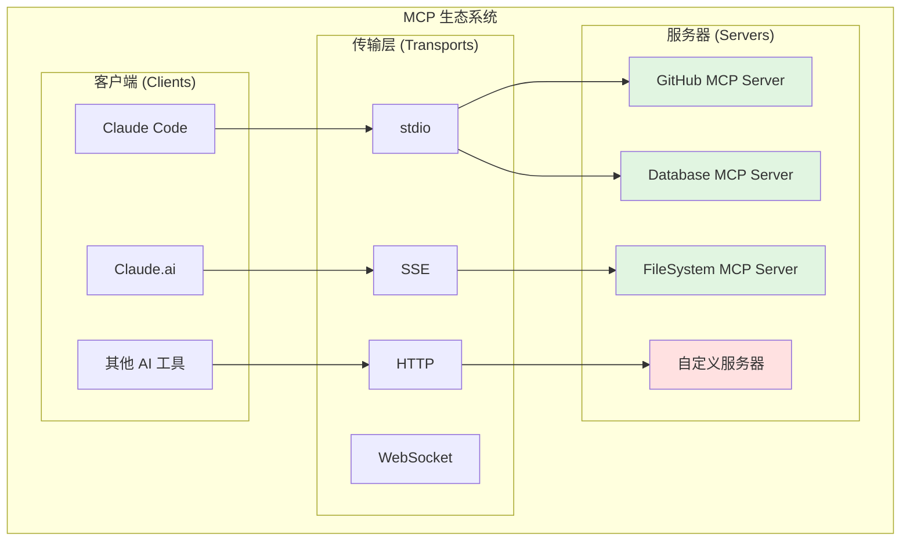
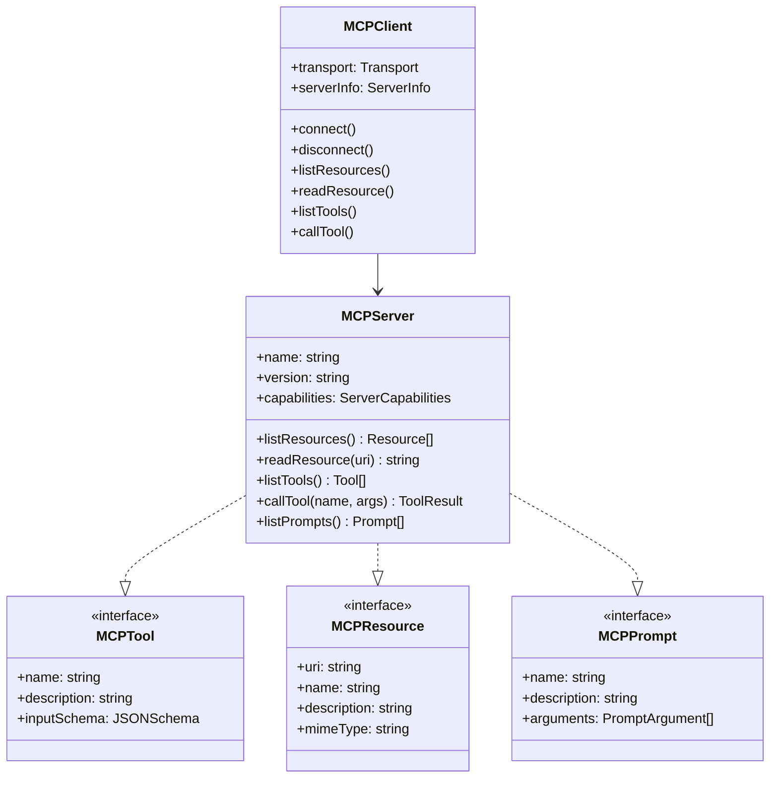
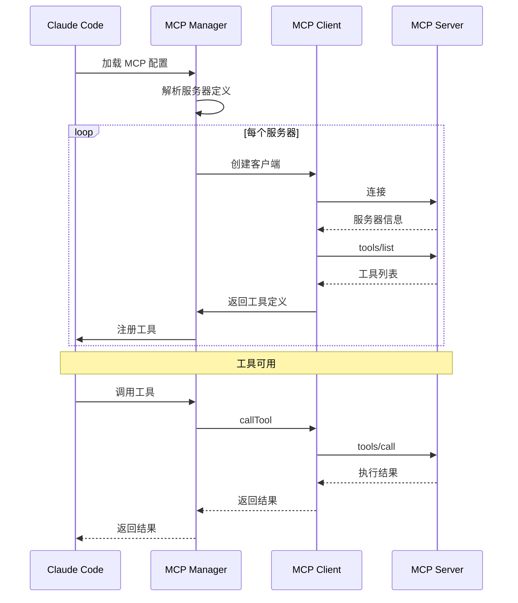
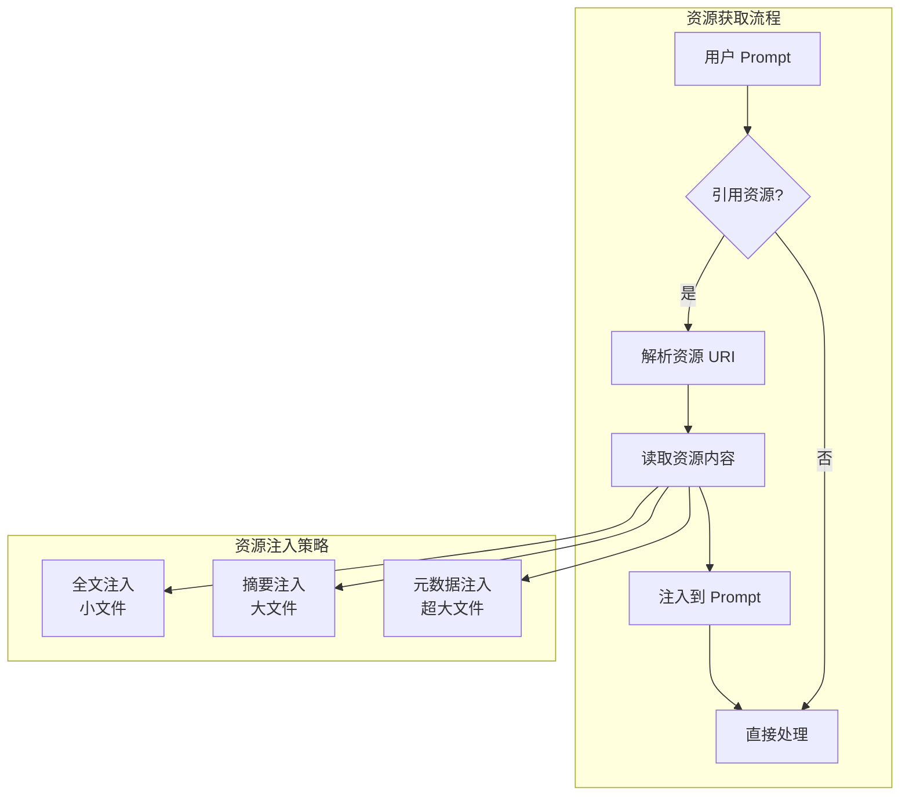

# 第 23 章：MCP 协议集成

> 本章目标：深入理解 Claude Code 对 MCP（Model Context Protocol）的集成实现，这是扩展 AI 工具能力的核心机制。

## 23.1 MCP 协议概述

### 23.1.1 协议设计理念

MCP（Model Context Protocol）是由 Anthropic 提出的开放标准协议，旨在解决 AI 应用与外部工具/数据源之间的互操作性问题。在 MCP 出现之前，每个 AI 工具都需要为每个外部服务编写专用集成器，导致：

**集成前的困境：**
- **重复开发**：每个工具都要为相同的服务编写适配器
- **协议碎片化**：不同工具使用不同的消息格式
- **维护成本高**：API 变更需要更新多处代码
- **生态割裂**：新服务难以快速集成到多个工具

**MCP 的解决方案：**
- **标准化接口**：统一的工具定义、资源描述、提示模板
- **传输无关**：支持 stdio、SSE、HTTP、WebSocket 等多种传输
- **类型安全**：JSON Schema 驱动的参数验证
- **可扩展性**：服务器可以声明能力，客户端按需使用

**作者观点**：MCP 的设计体现了"协议先于实现"的理念。通过定义清晰的协议边界，MCP 让 AI 工具生态从"每个工具造轮子"进化到"共享基础设施"。这种模式类似于 Web 中的 HTTP 协议——底层统一，上层百花齐放。

### 23.1.2 协议架构



### 23.1.3 核心概念



## 23.2 MCP 客户端实现

### 23.2.1 传输层抽象

```typescript
// src/mcp/transport.ts
export type TransportMessage = {
  jsonrpc: '2.0'
  id?: number | string
  method?: string
  params?: unknown
  result?: unknown
  error?: {
    code: number
    message: string
    data?: unknown
  }
}

/**
 * 传输层接口
 */
export interface MCPTransport {
  /**
   * 连接到服务器
   */
  connect(): Promise<void>

  /**
   * 断开连接
   */
  disconnect(): Promise<void>

  /**
   * 发送消息
   */
  send(message: TransportMessage): Promise<void>

  /**
   * 监听消息
   */
  onMessage(callback: (message: TransportMessage) => void): void

  /**
   * 是否已连接
   */
  isConnected(): boolean
}

/**
 * stdio 传输
 */
export class StdioTransport implements MCPTransport {
  private process: ChildProcess | null = null
  private messageCallback: ((message: TransportMessage) => void) | null = null
  private messageBuffer = ''

  constructor(
    private command: string,
    private args: string[],
    private env: Record<string, string> = {},
  ) {}

  async connect(): Promise<void> {
    return new Promise((resolve, reject) => {
      this.process = spawn(this.command, this.args, {
        env: { ...process.env, ...this.env },
        stdio: ['pipe', 'pipe', 'inherit'],  // 继承 stderr
      })

      this.process.on('error', reject)

      if (!this.process.stdout) {
        reject(new Error('No stdout'))
        return
      }

      this.process.stdout.on('data', (data: Buffer) => {
        this.handleData(data.toString())
      })

      this.process.on('exit', (code) => {
        console.log(`MCP server exited with code ${code}`)
      })

      // 等待一点时间确保进程启动
      setTimeout(() => resolve(), 100)
    })
  }

  private handleData(data: string): void {
    // MCP stdio 协议使用换行分隔的 JSON
    this.messageBuffer += data

    const lines = this.messageBuffer.split('\n')
    this.messageBuffer = lines.pop() ?? ''

    for (const line of lines) {
      if (!line.trim()) continue

      try {
        const message = JSON.parse(line) as TransportMessage
        this.messageCallback?.(message)
      } catch (error) {
        console.error('Failed to parse MCP message:', error)
      }
    }
  }

  async send(message: TransportMessage): Promise<void> {
    if (!this.process?.stdin) {
      throw new Error('Process not connected')
    }

    const json = JSON.stringify(message)
    this.process.stdin.write(json + '\n')
  }

  onMessage(callback: (message: TransportMessage) => void): void {
    this.messageCallback = callback
  }

  isConnected(): boolean {
    return this.process !== null && !this.process.killed
  }

  async disconnect(): Promise<void> {
    if (this.process) {
      this.process.kill()
      this.process = null
    }
  }
}

/**
 * SSE (Server-Sent Events) 传输
 */
export class SSETransport implements MCPTransport {
  private eventSource: EventSource | null = null
  private messageCallback: ((message: TransportMessage) => void) | null = null

  constructor(private url: string, private headers: Record<string, string> = {}) {}

  async connect(): Promise<void> {
    return new Promise((resolve, reject) => {
      this.eventSource = new EventSource(this.url)

      this.eventSource.onopen = () => resolve()

      this.eventSource.onerror = (error) => {
        reject(new Error(`SSE connection failed: ${error}`))
      }

      this.eventSource.addEventListener('message', (event) => {
        try {
          const message = JSON.parse(event.data) as TransportMessage
          this.messageCallback?.(message)
        } catch (error) {
          console.error('Failed to parse SSE message:', error)
        }
      })
    })
  }

  async send(message: TransportMessage): Promise<void> {
    // SSE 是单向的，需要通过 HTTP POST 发送请求
    const response = await fetch(this.url, {
      method: 'POST',
      headers: {
        'Content-Type': 'application/json',
        ...this.headers,
      },
      body: JSON.stringify(message),
    })

    if (!response.ok) {
      throw new Error(`HTTP ${response.status}`)
    }
  }

  onMessage(callback: (message: TransportMessage) => void): void {
    this.messageCallback = callback
  }

  isConnected(): boolean {
    return this.eventSource?.readyState === EventSource.OPEN
  }

  async disconnect(): Promise<void> {
    this.eventSource?.close()
    this.eventSource = null
  }
}

/**
 * HTTP 传输
 */
export class HTTPTransport implements MCPTransport {
  private messageCallback: ((message: TransportMessage) => void) | null = null
  private pollTimer: NodeJS.Timeout | null = null

  constructor(
    private url: string,
    private headers: Record<string, string> = {},
    private pollInterval = 1000,
  ) {}

  async connect(): Promise<void> {
    // 启动轮询获取消息
    this.startPolling()
  }

  private startPolling(): void {
    this.pollTimer = setInterval(async () => {
      try {
        const response = await fetch(this.url, {
          headers: this.headers,
        })

        if (response.ok) {
          const messages = await response.json() as TransportMessage[]
          for (const message of messages) {
            this.messageCallback?.(message)
          }
        }
      } catch (error) {
        console.error('Polling error:', error)
      }
    }, this.pollInterval)
  }

  async send(message: TransportMessage): Promise<void> {
    const response = await fetch(this.url, {
      method: 'POST',
      headers: {
        'Content-Type': 'application/json',
        ...this.headers,
      },
      body: JSON.stringify(message),
    })

    if (!response.ok) {
      throw new Error(`HTTP ${response.status}`)
    }
  }

  onMessage(callback: (message: TransportMessage) => void): void {
    this.messageCallback = callback
  }

  isConnected(): boolean {
    return this.pollTimer !== null
  }

  async disconnect(): Promise<void> {
    if (this.pollTimer) {
      clearInterval(this.pollTimer)
      this.pollTimer = null
    }
  }
}
```

### 23.2.2 MCP 客户端核心

```typescript
// src/mcp/client.ts
export type ServerInfo = {
  name: string
  version: string
  protocolVersion: string
  capabilities: ServerCapabilities
}

export type ServerCapabilities = {
  resources?: {
    subscribe?: boolean
    listChanged?: boolean
  }
  tools?: {}
  prompts?: {}
}

export type MCPTool = {
  name: string
  description: string
  inputSchema: JSONSchema
}

export type MCPResource = {
  uri: string
  name: string
  description?: string
  mimeType?: string
}

export type MCPPrompt = {
  name: string
  description?: string
  arguments?: PromptArgument[]
}

export type PromptArgument = {
  name: string
  description?: string
  required?: boolean
}

/**
 * MCP 客户端
 */
export class MCPClient {
  private messageId = 0
  private pendingRequests = new Map<number, {
    resolve: (value: unknown) => void
    reject: (error: Error) => void
  }>()
  private serverInfo: ServerInfo | null = null
  private initialized = false

  constructor(
    private transport: MCPTransport,
    private serverConfig: MCPServerConfig,
  ) {}

  /**
   * 连接到服务器
   */
  async connect(): Promise<void> {
    await this.transport.connect()

    // 设置消息监听
    this.transport.onMessage((message) => this.handleMessage(message))

    // 初始化会话
    await this.initialize()

    this.initialized = true
  }

  /**
   * 初始化会话
   */
  private async initialize(): Promise<void> {
    const response = await this.sendRequest<ServerInfo>('initialize', {
      protocolVersion: '2024-11-05',
      capabilities: {
        roots: {
          listChanged: true,
        },
        sampling: {},
      },
      clientInfo: {
        name: 'claude-code',
        version: getVersion(),
      },
    })

    this.serverInfo = response

    // 发送 initialized 通知
    await this.sendNotification('notifications/initialized')
  }

  /**
   * 处理消息
   */
  private handleMessage(message: TransportMessage): void {
    // 处理响应
    if (message.id !== undefined) {
      const pending = this.pendingRequests.get(Number(message.id))

      if (pending) {
        this.pendingRequests.delete(Number(message.id))

        if (message.error) {
          pending.reject(new Error(message.error.message))
        } else {
          pending.resolve(message.result)
        }
      }
      return
    }

    // 处理通知
    if (message.method) {
      this.handleNotification(message.method, message.params)
    }
  }

  /**
   * 处理通知
   */
  private handleNotification(method: string, params: unknown): void {
    switch (method) {
      case 'notifications/roots/list_changed':
        // 根列表变化通知
        this.emit('rootsChanged', params)
        break

      case 'notifications/resources/list_changed':
        // 资源列表变化通知
        this.emit('resourcesChanged', params)
        break

      case 'notifications/tools/list_changed':
        // 工具列表变化通知
        this.emit('toolsChanged', params)
        break

      default:
        console.log(`Unhandled notification: ${method}`)
    }
  }

  /**
   * 发送请求
   */
  private async sendRequest<T>(
    method: string,
    params: unknown,
  ): Promise<T> {
    if (!this.initialized) {
      throw new Error('Client not initialized')
    }

    const id = ++this.messageId

    const message: TransportMessage = {
      jsonrpc: '2.0',
      id,
      method,
      params,
    }

    return new Promise((resolve, reject) => {
      this.pendingRequests.set(id, { resolve, reject })

      this.transport.send(message).catch((error) => {
        this.pendingRequests.delete(id)
        reject(error)
      })

      // 超时处理
      setTimeout(() => {
        if (this.pendingRequests.has(id)) {
          this.pendingRequests.delete(id)
          reject(new Error(`Request timeout: ${method}`))
        }
      }, this.serverConfig.timeout ?? 30000)
    })
  }

  /**
   * 发送通知
   */
  private async sendNotification(
    method: string,
    params?: unknown,
  ): Promise<void> {
    const message: TransportMessage = {
      jsonrpc: '2.0',
      method,
      params,
    }

    await this.transport.send(message)
  }

  /**
   * 列出资源
   */
  async listResources(): Promise<MCPResource[]> {
    const response = await this.sendRequest<{ resources: MCPResource[] }>(
      'resources/list',
      {},
    )
    return response.resources
  }

  /**
   * 读取资源
   */
  async readResource(uri: string): Promise<string> {
    const response = await this.sendRequest<{ contents: { uri: string; text?: string; blob?: string }[] }>(
      'resources/read',
      { uri },
    )

    if (response.contents.length === 0) {
      throw new Error(`Resource not found: ${uri}`)
    }

    const content = response.contents[0]
    return content.text ?? content.blob ?? ''
  }

  /**
   * 列出工具
   */
  async listTools(): Promise<MCPTool[]> {
    const response = await this.sendRequest<{ tools: MCPTool[] }>(
      'tools/list',
      {},
    )
    return response.tools
  }

  /**
   * 调用工具
   */
  async callTool(
    name: string,
    args: Record<string, unknown>,
  ): Promise<ToolResult> {
    const response = await this.sendRequest<{
      content: Array<{ type: string; text: string } | { type: string; data: string }>
      isError?: boolean
    }>('tools/call', {
      name,
      arguments: args,
    })

    return {
      content: response.content,
      isError: response.isError ?? false,
    }
  }

  /**
   * 列出提示模板
   */
  async listPrompts(): Promise<MCPPrompt[]> {
    const response = await this.sendRequest<{ prompts: MCPPrompt[] }>(
      'prompts/list',
      {},
    )
    return response.prompts
  }

  /**
   * 获取提示模板
   */
  async getPrompt(
    name: string,
    args?: Record<string, string>,
  ): Promise<string> {
    const response = await this.sendRequest<{
      messages: Array<{ role: string; content: { type: string; text: string } }>
    }>('prompts/get', {
      name,
      arguments: args,
    })

    // 合并所有消息内容
    return response.messages
      .map(m => m.content.text)
      .join('\n\n')
  }

  /**
   * 获取服务器信息
   */
  getServerInfo(): ServerInfo | null {
    return this.serverInfo
  }

  /**
   * 是否已连接
   */
  isConnected(): boolean {
    return this.initialized && this.transport.isConnected()
  }

  /**
   * 断开连接
   */
  async disconnect(): Promise<void> {
    await this.sendNotification('notifications/cancelled')
    await this.transport.disconnect()
    this.initialized = false
  }

  // 简单的事件发射器
  private listeners = new Map<string, Array<(data: unknown) => void>>()

  private emit(event: string, data: unknown): void {
    const callbacks = this.listeners.get(event) ?? []
    for (const callback of callbacks) {
      callback(data)
    }
  }

  on(event: string, callback: (data: unknown) => void): void {
    if (!this.listeners.has(event)) {
      this.listeners.set(event, [])
    }
    this.listeners.get(event)?.push(callback)
  }

  off(event: string, callback: (data: unknown) => void): void {
    const callbacks = this.listeners.get(event)
    if (callbacks) {
      const index = callbacks.indexOf(callback)
      if (index > -1) {
        callbacks.splice(index, 1)
      }
    }
  }
}

export type ToolResult = {
  content: Array<{ type: string; text: string } | { type: string; data: string }>
  isError?: boolean
}

export type MCPServerConfig = {
  timeout?: number
  env?: Record<string, string>
}

export type JSONSchema = {
  type: string
  properties?: Record<string, JSONSchema>
  required?: string[]
  items?: JSONSchema
  enum?: (string | number)[]
  description?: string
}
```

## 23.3 工具系统集成

### 23.3.1 MCP 工具包装器

```typescript
// src/mcp/mcpTool.ts
import type { Tool, ToolExecuteOptions } from '../Tool.js'

/**
 * MCP 工具包装器
 * 将 MCP 工具适配到 Claude Code 的工具系统
 */
export class MCPTool implements Tool {
  readonly type = 'mcp'

  constructor(
    private client: MCPClient,
    private serverName: string,
    private definition: MCPToolDefinition,
  ) {}

  get name(): string {
    return `${this.serverName}:${this.definition.name}`
  }

  get description(): string {
    return this.definition.description
  }

  get inputSchema(): JSONSchema {
    return this.definition.inputSchema
  }

  /**
   * 执行工具
   */
  async execute(
    params: Record<string, unknown>,
    options: ToolExecuteOptions,
  ): Promise<ToolResult> {
    // 提取工具名（去掉服务器前缀）
    const toolName = this.definition.name

    try {
      const result = await this.client.callTool(toolName, params as Record<string, unknown>)

      if (result.isError) {
        return {
          success: false,
          error: this.formatContent(result.content),
        }
      }

      return {
        success: true,
        output: this.formatContent(result.content),
      }
    } catch (error) {
      return {
        success: false,
        error: error instanceof Error ? error.message : String(error),
      }
    }
  }

  /**
   * 格式化内容
   */
  private formatContent(
    content: Array<{ type: string; text: string } | { type: string; data: string }>
  ): string {
    return content
      .map(item => {
        if (item.type === 'text') {
          return item.text
        } else if (item.type === 'image' || item.type === 'resource') {
          return `[${item.type}: ${item.data.slice(0, 100)}...]`
        }
        return JSON.stringify(item)
      })
      .join('\n')
  }
}

export type MCPToolDefinition = {
  name: string
  description: string
  inputSchema: JSONSchema
}
```

### 23.3.2 工具注册与发现



```typescript
// src/mcp/manager.ts
export type MCPServerDefinition = {
  name: string
  transport: 'stdio' | 'sse' | 'http'
  command?: string  // for stdio
  args?: string[]   // for stdio
  url?: string      // for sse/http
  env?: Record<string, string>
  timeout?: number
  enabled?: boolean
}

export type MCPManagerConfig = {
  servers: Record<string, MCPServerDefinition>
}

/**
 * MCP 管理器
 */
export class MCPManager {
  private clients = new Map<string, MCPClient>()
  private tools = new Map<string, MCPTool>()
  private initialized = false

  constructor(private config: MCPManagerConfig) {}

  /**
   * 初始化所有服务器
   */
  async initialize(): Promise<void> {
    if (this.initialized) return

    const initPromises: Promise<void>[] = []

    for (const [name, serverConfig] of Object.entries(this.config.servers)) {
      if (serverConfig.enabled === false) continue

      initPromises.push(this.initializeServer(name, serverConfig))
    }

    await Promise.allSettled(initPromises)
    this.initialized = true
  }

  /**
   * 初始化单个服务器
   */
  private async initializeServer(
    name: string,
    config: MCPServerDefinition,
  ): Promise<void> {
    try {
      // 创建传输层
      const transport = this.createTransport(config)

      // 创建客户端
      const client = new MCPClient(transport, {
        timeout: config.timeout,
        env: config.env,
      })

      // 连接服务器
      await client.connect()

      this.clients.set(name, client)

      // 获取并注册工具
      await this.registerTools(name, client, config)

      console.log(`MCP server "${name}" connected successfully`)
    } catch (error) {
      console.error(`Failed to connect MCP server "${name}":`, error)
    }
  }

  /**
   * 创建传输层
   */
  private createTransport(config: MCPServerDefinition): MCPTransport {
    switch (config.transport) {
      case 'stdio':
        if (!config.command) {
          throw new Error('stdio transport requires command')
        }
        return new StdioTransport(
          config.command,
          config.args ?? [],
          config.env ?? {},
        )

      case 'sse':
        if (!config.url) {
          throw new Error('sse transport requires url')
        }
        return new SSETransport(config.url)

      case 'http':
        if (!config.url) {
          throw new Error('http transport requires url')
        }
        return new HTTPTransport(config.url)

      default:
        throw new Error(`Unknown transport: ${config.transport}`)
    }
  }

  /**
   * 注册工具
   */
  private async registerTools(
    serverName: string,
    client: MCPClient,
    config: MCPServerDefinition,
  ): Promise<void> {
    const tools = await client.listTools()

    for (const tool of tools) {
      // 检查是否应该过滤此工具
      if (this.shouldFilterTool(tool.name)) {
        continue
      }

      const mcpTool = new MCPTool(client, serverName, tool)
      const fullName = `${serverName}:${tool.name}`

      this.tools.set(fullName, mcpTool)
    }

    console.log(`Registered ${tools.length} tools from "${serverName}"`)
  }

  /**
   * 是否应该过滤工具
   */
  private shouldFilterTool(toolName: string): boolean {
    // 过滤危险工具
    const dangerous = ['shell', 'exec', 'spawn', 'eval', 'system']
    return dangerous.some(d => toolName.toLowerCase().includes(d))
  }

  /**
   * 获取所有工具
   */
  getAllTools(): MCPTool[] {
    return Array.from(this.tools.values())
  }

  /**
   * 获取工具
   */
  getTool(name: string): MCPTool | undefined {
    return this.tools.get(name)
  }

  /**
   * 获取服务器信息
   */
  getServerInfo(name: string): ServerInfo | null {
    return this.clients.get(name)?.getServerInfo() ?? null
  }

  /**
   * 列出所有服务器
   */
  listServers(): string[] {
    return Array.from(this.clients.keys())
  }

  /**
   * 断开所有连接
   */
  async disconnectAll(): Promise<void> {
    const disconnectPromises: Promise<void>[] = []

    for (const client of this.clients.values()) {
      disconnectPromises.push(client.disconnect())
    }

    await Promise.allSettled(disconnectPromises)

    this.clients.clear()
    this.tools.clear()
    this.initialized = false
  }

  /**
   * 重新加载服务器
   */
  async reloadServer(name: string): Promise<void> {
    const config = this.config.servers[name]
    if (!config) {
      throw new Error(`Unknown server: ${name}`)
    }

    // 断开旧连接
    const oldClient = this.clients.get(name)
    if (oldClient) {
      await oldClient.disconnect()
      this.clients.delete(name)
    }

    // 清除工具
    for (const [toolName, tool] of this.tools) {
      if (tool.name.startsWith(name + ':')) {
        this.tools.delete(toolName)
      }
    }

    // 重新初始化
    await this.initializeServer(name, config)
  }
}
```

## 23.4 资源系统集成

### 23.4.1 资源访问

```typescript
// src/mcp/resources.ts
/**
 * MCP 资源管理器
 */
export class MCPResourceManager {
  constructor(private manager: MCPManager) {}

  /**
   * 列出所有可用资源
   */
  async listResources(): Promise<ResourceGroup[]> {
    const groups: ResourceGroup[] = []

    for (const serverName of this.manager.listServers()) {
      try {
        const client = await this.getClient(serverName)
        const resources = await client.listResources()

        groups.push({
          server: serverName,
          resources,
        })
      } catch (error) {
        console.error(`Failed to list resources from ${serverName}:`, error)
      }
    }

    return groups
  }

  /**
   * 读取资源
   */
  async readResource(uri: string): Promise<ResourceContent> {
    // 解析 URI：server:/path
    const match = uri.match(/^([^:]+):(.+)$/)
    if (!match) {
      throw new Error(`Invalid resource URI: ${uri}`)
    }

    const [, serverName, path] = match
    const client = await this.getClient(serverName)

    const content = await client.readResource(uri)

    return {
      uri,
      server: serverName,
      path,
      content,
    }
  }

  /**
   * 搜索资源
   */
  async searchResources(query: string): Promise<MCPResource[]> {
    const allResources = await this.listResources()
    const results: MCPResource[] = []

    const lowerQuery = query.toLowerCase()

    for (const group of allResources) {
      for (const resource of group.resources) {
        const name = resource.name.toLowerCase()
        const desc = (resource.description ?? '').toLowerCase()

        if (name.includes(lowerQuery) || desc.includes(lowerQuery)) {
          results.push(resource)
        }
      }
    }

    return results
  }

  /**
   * 订阅资源更新
   */
  async subscribe(uri: string): Promise<void> {
    const match = uri.match(/^([^:]+):(.+)$/)
    if (!match) {
      throw new Error(`Invalid resource URI: ${uri}`)
    }

    const [, serverName] = match
    const client = await this.getClient(serverName)

    // 发送订阅请求
    await client.sendRequest('resources/subscribe', { uri })
  }

  /**
   * 取消订阅
   */
  async unsubscribe(uri: string): Promise<void> {
    const match = uri.match(/^([^:]+):(.+)$/)
    if (!match) {
      throw new Error(`Invalid resource URI: ${uri}`)
    }

    const [, serverName] = match
    const client = await this.getClient(serverName)

    await client.sendRequest('resources/unsubscribe', { uri })
  }

  private async getClient(serverName: string): Promise<MCPClient> {
    // 通过 MCPManager 获取客户端
    // 这里简化实现
    return Promise.reject(new Error('Not implemented'))
  }
}

export type ResourceGroup = {
  server: string
  resources: MCPResource[]
}

export type ResourceContent = {
  uri: string
  server: string
  path: string
  content: string
}
```

### 23.4.2 资源在 Prompt 中的使用



```typescript
// src/mcp/resourceInjection.ts
export type ResourceReference = {
  uri: string
  range?: { start: number; end: number }
  format?: 'full' | 'summary' | 'metadata'
}

/**
 * 资源注入器
 */
export class ResourceInjector {
  constructor(
    private resourceManager: MCPResourceManager,
    private maxTokens = 10000,
  ) {}

  /**
   * 解析 Prompt 中的资源引用
   */
  parseReferences(prompt: string): ResourceReference[] {
    const references: ResourceReference[] = []

    // 匹配 mcp://server:/path 格式
    const mcpUriPattern = /mcp:\/\/([^\/]+)(\/[^\s]+)/g
    let match

    while ((match = mcpUriPattern.exec(prompt)) !== null) {
      references.push({
        uri: `${match[1]}:${match[2]}`,
      })
    }

    // 匹配 @resource:/path 格式
    const atPattern = /@resource:([^\s]+)/g
    while ((match = atPattern.exec(prompt)) !== null) {
      references.push({
        uri: match[1],
      })
    }

    return references
  }

  /**
   * 注入资源内容
   */
  async injectResources(
    prompt: string,
    references: ResourceReference[],
  ): Promise<string> {
    if (references.length === 0) {
      return prompt
    }

    const injected: string[] = []

    for (const ref of references) {
      try {
        const content = await this.resourceManager.readResource(ref.uri)
        const formatted = this.formatResource(content, ref.format)

        injected.push(
          `## Resource: ${ref.uri}\n${formatted}\n`,
        )
      } catch (error) {
        injected.push(
          `## Resource: ${ref.uri}\n[Error loading: ${error}]\n`,
        )
      }
    }

    // 将注入的内容添加到 Prompt 前面
    return injected.join('\n') + '\n\n' + prompt
  }

  /**
   * 格式化资源内容
   */
  private formatResource(
    content: ResourceContent,
    format: 'full' | 'summary' | 'metadata' = 'full',
  ): string {
    const lines = content.content.split('\n')
    const tokenEstimate = lines.length * 4  // 粗略估计

    switch (format) {
      case 'full':
        if (tokenEstimate > this.maxTokens) {
          return this.summarize(content.content)
        }
        return content.content

      case 'summary':
        return this.summarize(content.content)

      case 'metadata':
        return `Type: ${this.detectType(content.content)}\n` +
               `Size: ${content.content.length} bytes\n` +
               `Lines: ${lines.length}`

      default:
        return content.content
    }
  }

  /**
   * 生成摘要
   */
  private summarize(content: string): string {
    const lines = content.split('\n')
    const maxLines = Math.min(lines.length, 100)

    let summary = lines.slice(0, maxLines).join('\n')

    if (lines.length > maxLines) {
      summary += `\n\n... (${lines.length - maxLines} more lines)`
    }

    return summary
  }

  /**
   * 检测内容类型
   */
  private detectType(content: string): string {
    if (content.startsWith('{') || content.startsWith('[')) {
      return 'JSON'
    }
    if (content.startsWith('#')) {
      return 'Markdown'
    }
    if (content.includes('<?xml')) {
      return 'XML'
    }
    return 'Text'
  }
}
```

## 23.5 配置系统

### 23.5.1 配置源

```mermaid
graph TD
    subgraph "MCP 配置层级"
        A[本地配置<br/>.claude/mcp.json]
        B[用户配置<br/>~/.claude/mcp.json]
        C[项目配置<br/>.claude/project.mcp.json]
        D[环境变量<br/>MCP_SERVER_*
        E[动态配置<br/>运行时添加]
    end

    subgraph "最终配置"
        F[合并后的配置]
    end

    A --> F
    B --> F
    C --> F
    D --> F
    E --> F
```

```typescript
// src/mcp/config.ts
export type MCPServerConfig = {
  transport: 'stdio' | 'sse' | 'http'
  command?: string
  args?: string[]
  url?: string
  env?: Record<string, string>
  timeout?: number
  enabled?: boolean
  tools?: {
    include?: string[]
    exclude?: string[]
  }
}

export type MCPConfigFile = {
  servers: Record<string, MCPServerConfig>
  defaults?: {
    timeout?: number
    env?: Record<string, string>
  }
}

/**
 * MCP 配置加载器
 */
export class MCPConfigLoader {
  private configPath = '.claude/mcp.json'
  private userConfigPath: string
  private projectConfigPath = '.claude/project.mcp.json'

  constructor() {
    this.userConfigPath = join(
      getClaudeConfigHomeDir(),
      'mcp.json',
    )
  }

  /**
   * 加载所有配置
   */
  async loadAll(): Promise<MCPConfigFile> {
    const configs: MCPConfigFile[] = []

    // 1. 用户配置
    const userConfig = await this.loadConfig(this.userConfigPath)
    if (userConfig) {
      configs.push(userConfig)
    }

    // 2. 项目配置
    const projectConfig = await this.loadConfig(this.projectConfigPath)
    if (projectConfig) {
      configs.push(projectConfig)
    }

    // 3. 本地配置
    const localConfig = await this.loadConfig(this.configPath)
    if (localConfig) {
      configs.push(localConfig)
    }

    // 4. 环境变量配置
    const envConfig = this.loadFromEnv()
    if (envConfig) {
      configs.push(envConfig)
    }

    // 合并配置
    return this.mergeConfigs(configs)
  }

  /**
   * 加载配置文件
   */
  private async loadConfig(
    path: string,
  ): Promise<MCPConfigFile | null> {
    try {
      const content = await fs.readFile(path, 'utf-8')
      return JSON.parse(content)
    } catch {
      return null
    }
  }

  /**
   * 从环境变量加载配置
   */
  private loadFromEnv(): MCPConfigFile | null {
    const servers: Record<string, MCPServerConfig> = {}

    for (const [key, value] of Object.entries(process.env)) {
      if (!key.startsWith('MCP_SERVER_')) continue

      // MCP_SERVER_GITHUB_COMMAND=npx ...
      // MCP_SERVER_GITHUB_ARG_0=--arg-value
      const parts = key.split('_')
      if (parts.length < 3) continue

      const serverName = parts[2].toLowerCase()
      const configKey = parts.slice(3).join('_').toLowerCase()

      if (!servers[serverName]) {
        servers[serverName] = {
          transport: 'stdio',
          enabled: true,
        }
      }

      if (configKey === 'command') {
        servers[serverName].command = value
      } else if (configKey.startsWith('arg_')) {
        if (!servers[serverName].args) {
          servers[serverName].args = []
        }
        servers[serverName].args.push(value)
      } else if (configKey === 'url') {
        servers[serverName].url = value
        servers[serverName].transport = 'http'
      }
    }

    if (Object.keys(servers).length === 0) {
      return null
    }

    return { servers }
  }

  /**
   * 合并配置
   */
  private mergeConfigs(configs: MCPConfigFile[]): MCPConfigFile {
    const merged: MCPConfigFile = {
      servers: {},
      defaults: {},
    }

    for (const config of configs) {
      // 合并默认值
      if (config.defaults) {
        Object.assign(merged.defaults, config.defaults)
      }

      // 合并服务器配置
      for (const [name, server] of Object.entries(config.servers)) {
        if (merged.servers[name]) {
          // 深度合并
          Object.assign(merged.servers[name], server)
        } else {
          merged.servers[name] = server
        }
      }
    }

    return merged
  }

  /**
   * 验证配置
   */
  validateConfig(config: MCPConfigFile): {
    valid: boolean
    errors: string[]
  } {
    const errors: string[] = []

    for (const [name, server] of Object.entries(config.servers)) {
      if (!server.transport) {
        errors.push(`${name}: missing transport`)
        continue
      }

      switch (server.transport) {
        case 'stdio':
          if (!server.command) {
            errors.push(`${name}: stdio transport requires command`)
          }
          break

        case 'sse':
        case 'http':
          if (!server.url) {
            errors.push(`${name}: ${server.transport} transport requires url`)
          }
          break
      }
    }

    return {
      valid: errors.length === 0,
      errors,
    }
  }
}
```

## 23.6 可复用模式总结

### 模式 44：协议适配器

**描述：** 将外部协议适配到内部系统的适配器模式。

**适用场景：**
- 集成第三方协议
- 统一不同来源的工具
- 版本兼容性处理

**代码模板：**

```typescript
// 1. 定义协议接口
export interface ProtocolAdapter<TInput, TOutput> {
  adapt(input: TInput): TOutput
  reverse(output: TOutput): TInput
}

// 2. MCP 到内部工具的适配器
export class MCPToolAdapter implements ProtocolAdapter<MCPTool, InternalTool> {
  adapt(mcpTool: MCPTool): InternalTool {
    return {
      name: mcpTool.name,
      description: mcpTool.description,
      parameters: this.convertSchema(mcpTool.inputSchema),
      execute: async (params) => {
        // 执行 MCP 工具
        const result = await this.client.callTool(mcpTool.name, params)
        return this.formatResult(result)
      },
    }
  }

  reverse(tool: InternalTool): MCPTool {
    // 反向转换（如果需要）
    throw new Error('Not implemented')
  }

  private convertSchema(schema: JSONSchema): ParametersSchema {
    // Schema 转换逻辑
    return {
      type: 'object',
      properties: schema.properties ?? {},
      required: schema.required ?? [],
    }
  }

  private formatResult(result: MCPToolResult): string {
    return result.content.map(c => c.text).join('\n')
  }
}

// 3. 适配器注册表
export class AdapterRegistry<TInput, TOutput> {
  private adapters = new Map<string, ProtocolAdapter<TInput, TOutput>>()

  register(protocol: string, adapter: ProtocolAdapter<TInput, TOutput>): void {
    this.adapters.set(protocol, adapter)
  }

  adapt(
    protocol: string,
    input: TInput,
  ): TOutput | null {
    const adapter = this.adapters.get(protocol)
    return adapter?.adapt(input) ?? null
  }
}
```

**关键点：**
1. 清晰的接口定义
2. 双向转换支持
3. 错误处理
4. 类型安全

### 模式 45：传输无关协议

**描述：** 与传输层解耦的协议实现。

**适用场景：**
- 支持多种传输协议
- 传输层可插拔
- 统一的上层接口

**代码模板：**

```typescript
// 1. 传输接口
export interface Transport {
  connect(): Promise<void>
  disconnect(): Promise<void>
  send(message: unknown): Promise<void>
  onMessage(callback: (msg: unknown) => void): void
  isConnected(): boolean
}

// 2. 协议客户端（与传输无关）
export class ProtocolClient {
  private messageId = 0
  private pending = new Map<number, any>()

  constructor(private transport: Transport) {}

  async connect(): Promise<void> {
    await this.transport.connect()

    this.transport.onMessage((msg) => {
      this.handleMessage(msg)
    })

    await this.initialize()
  }

  async request<T>(method: string, params: unknown): Promise<T> {
    const id = ++this.messageId

    return new Promise((resolve, reject) => {
      this.pending.set(id, { resolve, reject })

      this.transport.send({
        jsonrpc: '2.0',
        id,
        method,
        params,
      })

      setTimeout(() => {
        if (this.pending.has(id)) {
          this.pending.delete(id)
          reject(new Error('Timeout'))
        }
      }, 30000)
    })
  }

  private handleMessage(msg: any): void {
    if (msg.id !== undefined) {
      const pending = this.pending.get(Number(msg.id))
      if (pending) {
        this.pending.delete(Number(msg.id))
        msg.error ? pending.reject(msg.error) : pending.resolve(msg.result)
      }
    }
  }

  async initialize(): Promise<void> {
    // 初始化逻辑
  }
}

// 3. 传输实现
export class StdioTransport implements Transport {
  // ... stdio 实现
}

export class HTTPTransport implements Transport {
  // ... HTTP 实现
}

// 4. 使用
const client = new ProtocolClient(new StdioTransport('cmd', ['args']))
await client.connect()
```

**关键点：**
1. 传输抽象接口
2. 协议与传输解耦
3. 统一的消息格式
4. 请求-响应匹配

---

## 本章小结

本章深入分析了 MCP 协议集成的实现：

1. **MCP 协议**：设计理念、核心概念、协议架构
2. **客户端实现**：传输层抽象、JSON-RPC 通信、错误处理
3. **工具集成**：MCP 工具包装器、工具注册与发现
4. **资源集成**：资源访问、资源注入、订阅机制
5. **配置系统**：多源配置、配置合并、验证机制
6. **可复用模式**：协议适配器、传输无关协议

**设计亮点：**
- MCP 实现了工具生态的标准化，降低了集成成本
- 传输层抽象使协议可以灵活适应各种通信方式
- 工具包装器模式实现了无缝集成
- 多层配置系统兼顾了灵活性和易用性

**作者观点**：MCP 是 AI 工具生态的重要基础设施。通过标准化工具描述和通信协议，MCP 让开发者可以"一次编写，到处运行"——类似于容器技术对应用部署的革命。随着 MCP 生态的成熟，我们可以期待更多创新工具的出现。

## 下一章预告

第 24 章将深入分析多 Agent 生态系统，探讨 Claude Code 如何通过协调器模式实现多个 AI Agent 之间的协作。
