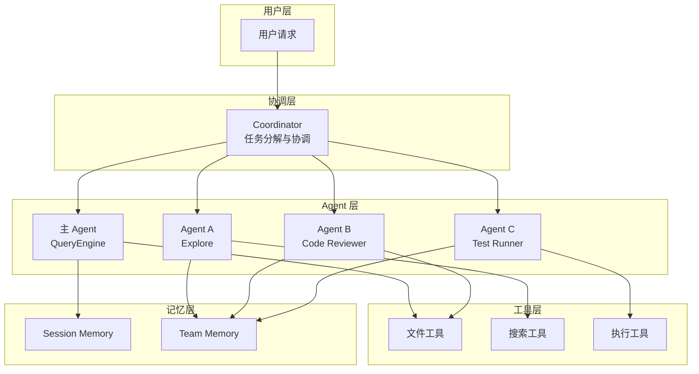
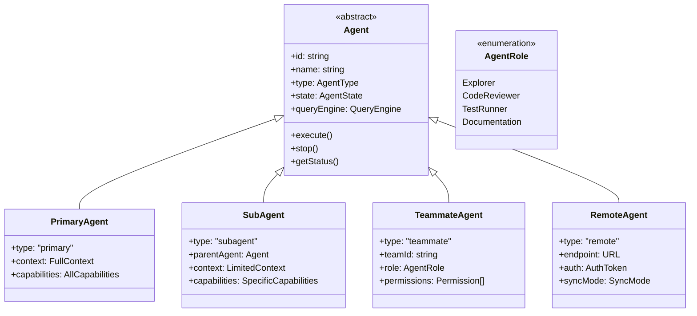
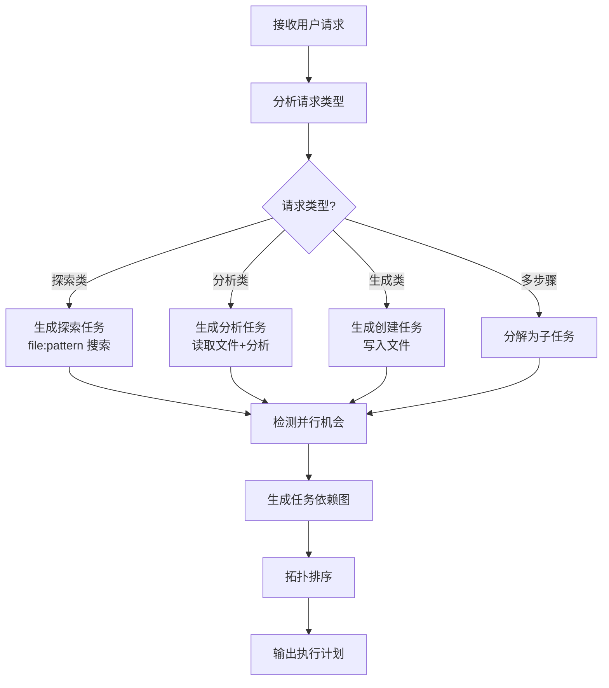
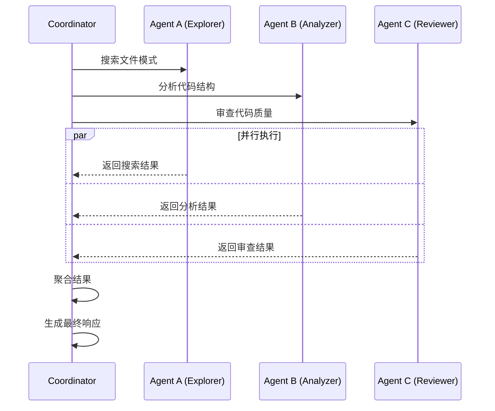
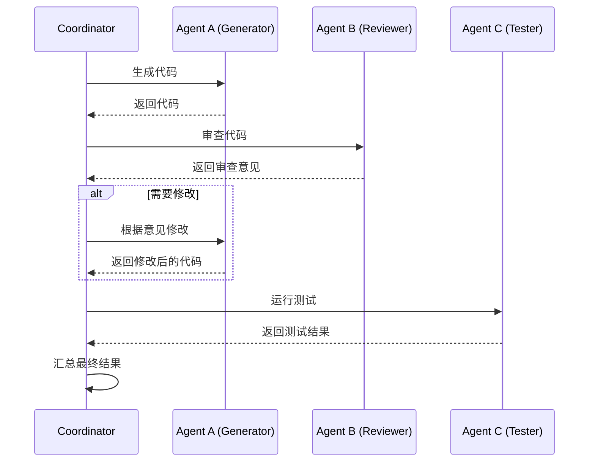

# 第 24 章：多 Agent 生态系统

> 本章目标：深入理解 Claude Code 的多 Agent 协作架构，这是实现复杂任务分解与并行执行的核心机制。

## 24.1 多 Agent 架构概述

### 24.1.1 设计理念

多 Agent 系统是分布式 AI 的核心模式之一。Claude Code 的实现基于以下观察：

**单 Agent 的局限性：**
- **上下文瓶颈**：单个 Agent 无法同时处理大量信息
- **专长限制**：通用模型在特定领域可能不如专门模型
- **串行处理**：复杂任务需要多步骤，单 Agent 只能串行执行
- **容错能力**：单点失败会导致整个任务失败

**多 Agent 的优势：**
- **并行处理**：多个 Agent 可以同时执行独立任务
- **专长分工**：不同 Agent 可以专注不同领域（代码、测试、文档等）
- **容错恢复**：单个 Agent 失败不影响其他 Agent
- **知识隔离**：每个 Agent 有独立的上下文和记忆

**作者观点**：Claude Code 的多 Agent 实现体现了"协作智能"的设计哲学——不是让一个超级 AI 做所有事情，而是让多个专业 AI 协作完成复杂任务。这种模式更符合人类社会的协作方式，也更易于扩展和维护。

### 24.1.2 架构全景



### 24.1.3 Agent 类型



## 24.2 Coordinator 模式

### 24.2.1 协调器架构

协调器（Coordinator）是多 Agent 系统的核心，负责：
- **任务分解**：将复杂任务分解为可并行的子任务
- **Agent 分配**：为每个子任务选择合适的 Agent
- **结果聚合**：收集子任务结果并合并
- **冲突解决**：处理多个 Agent 结果之间的冲突

```typescript
// src/agents/coordinator.ts
export type TaskDefinition = {
  id: string
  description: string
  type: TaskType
  dependencies: string[]  // 依赖的任务 ID
  requiredCapabilities: string[]
  priority: number
  estimatedTokens: number
}

export type TaskType =
  | 'explore'      // 代码探索
  | 'analyze'      // 代码分析
  | 'generate'     // 代码生成
  | 'review'       // 代码审查
  | 'test'         // 测试执行
  | 'document'     // 文档编写

export type AgentAssignment = {
  taskId: string
  agentId: string
  agentType: AgentType
  assignedAt: number
  status: 'pending' | 'running' | 'completed' | 'failed'
}

export type CoordinationPlan = {
  tasks: TaskDefinition[]
  assignments: AgentAssignment[]
  executionOrder: string[][]  // 并行组
}

/**
 * 任务协调器
 */
export class Coordinator {
  private agents = new Map<string, Agent>()
  private tasks = new Map<string, TaskDefinition>()
  private assignments = new Map<string, AgentAssignment>()
  private results = new Map<string, TaskResult>()

  constructor(
    private config: CoordinatorConfig,
  ) {}

  /**
   * 注册 Agent
   */
  registerAgent(agent: Agent): void {
    this.agents.set(agent.id, agent)
    console.log(`Registered agent: ${agent.name} (${agent.type})`)
  }

  /**
   * 分解任务
   */
  async decomposeTask(
    request: string,
    context: RequestContext,
  ): Promise<CoordinationPlan> {
    // 1. 分析请求，识别可并行部分
    const analysis = await this.analyzeRequest(request, context)

    // 2. 生成任务定义
    const tasks = this.generateTasks(analysis, context)

    // 3. 确定执行顺序（考虑依赖关系）
    const executionOrder = this.determineExecutionOrder(tasks)

    return {
      tasks,
      assignments: [],
      executionOrder,
    }
  }

  /**
   * 分析请求
   */
  private async analyzeRequest(
    request: string,
    context: RequestContext,
  ): Promise<TaskAnalysis> {
    // 使用 LLM 分析请求
    const prompt = this.buildAnalysisPrompt(request, context)

    // 这是一个简化实现
    // 实际会使用 QueryEngine 来分析
    const analysis: TaskAnalysis = {
      primaryGoal: extractGoal(request),
      subGoals: extractSubGoals(request),
      dependencies: [],
      estimatedComplexity: estimateComplexity(request),
      requiredCapabilities: extractCapabilities(request),
    }

    return analysis
  }

  /**
   * 生成任务定义
   */
  private generateTasks(
    analysis: TaskAnalysis,
    context: RequestContext,
  ): TaskDefinition[] {
    const tasks: TaskDefinition[] = []

    // 根据分析结果生成任务
    for (const [index, goal] of analysis.subGoals.entries()) {
      const task: TaskDefinition = {
        id: `task-${index}`,
        description: goal.description,
        type: this.inferTaskType(goal),
        dependencies: goal.dependencies ?? [],
        requiredCapabilities: goal.capabilities ?? [],
        priority: goal.priority ?? 5,
        estimatedTokens: goal.estimatedTokens ?? 5000,
      }

      tasks.push(task)
    }

    return tasks
  }

  /**
   * 确定执行顺序
   */
  private determineExecutionOrder(
    tasks: TaskDefinition[],
  ): string[][] {
    // 使用拓扑排序确定执行顺序
    const order: string[][] = []
    const processed = new Set<string>()
    const taskMap = new Map(tasks.map(t => [t.id, t]))

    // 找出没有依赖的任务
    const getReadyTasks = (): TaskDefinition[] => {
      return tasks.filter(task =>
        !processed.has(task.id) &&
        task.dependencies.every(dep => processed.has(dep))
      )
    }

    let round = 0
    while (processed.size < tasks.length) {
      const ready = getReadyTasks()

      if (ready.length === 0) {
        // 循环依赖，无法继续
        throw new Error('Circular dependency detected')
      }

      // 可以并行执行的任务
      order.push(ready.map(t => t.id))
      ready.forEach(t => processed.add(t.id))

      round++
      if (round > 100) {
        throw new Error('Too many rounds, possible infinite loop')
      }
    }

    return order
  }

  /**
   * 分配 Agent
   */
  async assignAgents(plan: CoordinationPlan): Promise<void> {
    for (const task of plan.tasks) {
      const agent = await this.selectBestAgent(task)

      if (agent) {
        const assignment: AgentAssignment = {
          taskId: task.id,
          agentId: agent.id,
          agentType: agent.type,
          assignedAt: Date.now(),
          status: 'pending',
        }

        this.assignments.set(task.id, assignment)
        plan.assignments.push(assignment)
      } else {
        console.warn(`No suitable agent for task: ${task.id}`)
      }
    }
  }

  /**
   * 选择最佳 Agent
   */
  private async selectBestAgent(
    task: TaskDefinition,
  ): Promise<Agent | null> {
    const candidates: Array<{ agent: Agent; score: number }> = []

    for (const agent of this.agents.values()) {
      if (!agent.isAvailable()) continue

      const score = await this.scoreAgent(agent, task)
      candidates.push({ agent, score })
    }

    // 选择得分最高的
    candidates.sort((a, b) => b.score - a.score)

    return candidates[0]?.agent ?? null
  }

  /**
   * 评估 Agent 适用性
   */
  private async scoreAgent(
    agent: Agent,
    task: TaskDefinition,
  ): Promise<number> {
    let score = 0

    // 检查能力匹配
    const capabilities = agent.getCapabilities()
    const matchingCapabilities = task.requiredCapabilities.filter(c =>
      capabilities.includes(c)
    )
    score += matchingCapabilities.length * 10

    // 检查 Agent 类型偏好
    const typePreference = this.getTypePreference(task.type, agent.type)
    score += typePreference

    // 检查当前负载
    const load = agent.getCurrentLoad()
    score -= load * 5

    return Math.max(0, score)
  }

  /**
   * 获取类型偏好分数
   */
  private getTypePreference(
    taskType: TaskType,
    agentType: AgentType,
  ): number {
    const preferences: Record<TaskType, Record<AgentType, number>> = {
      explore: { explorer: 20, general: 10, reviewer: 0, tester: 0 },
      analyze: { explorer: 15, general: 10, reviewer: 5, tester: 0 },
      generate: { general: 20, explorer: 5, reviewer: 0, tester: 0 },
      review: { reviewer: 20, general: 10, explorer: 0, tester: 5 },
      test: { tester: 20, general: 5, reviewer: 5, explorer: 0 },
      document: { general: 15, explorer: 5, reviewer: 5, tester: 0 },
    }

    return preferences[taskType]?.[agentType] ?? 0
  }

  /**
   * 执行计划
   */
  async executePlan(plan: CoordinationPlan): Promise<CoordinationResult> {
    const results: TaskResult[] = []

    // 按并行组执行
    for (const group of plan.executionOrder) {
      const groupPromises = group.map(async taskId => {
        const assignment = this.assignments.get(taskId)
        if (!assignment) {
          return { taskId, success: false, error: 'No agent assigned' }
        }

        const agent = this.agents.get(assignment.agentId)
        if (!agent) {
          return { taskId, success: false, error: 'Agent not found' }
        }

        const task = plan.tasks.find(t => t.id === taskId)
        if (!task) {
          return { taskId, success: false, error: 'Task not found' }
        }

        return this.executeTask(agent, task)
      })

      const groupResults = await Promise.allSettled(groupPromises)

      for (const result of groupResults) {
        if (result.status === 'fulfilled') {
          results.push(result.value)
        } else {
          results.push({
            taskId: 'unknown',
            success: false,
            error: String(result.reason),
          })
        }
      }
    }

    return {
      success: results.every(r => r.success),
      results,
    }
  }

  /**
   * 执行单个任务
   */
  private async executeTask(
    agent: Agent,
    task: TaskDefinition,
  ): Promise<TaskResult> {
    const assignment = this.assignments.get(task.id)
    if (assignment) {
      assignment.status = 'running'
    }

    try {
      const result = await agent.execute(task)

      if (assignment) {
        assignment.status = 'completed'
      }

      this.results.set(task.id, result)

      return {
        taskId: task.id,
        success: true,
        output: result.output,
      }
    } catch (error) {
      if (assignment) {
        assignment.status = 'failed'
      }

      return {
        taskId: task.id,
        success: false,
        error: String(error),
      }
    }
  }

  /**
   * 获取状态
   */
  getStatus(): CoordinationStatus {
    return {
      totalAgents: this.agents.size,
      activeAgents: Array.from(this.agents.values()).filter(a => a.isAvailable()).length,
      totalTasks: this.tasks.size,
      pendingTasks: Array.from(this.assignments.values()).filter(a => a.status === 'pending').length,
      runningTasks: Array.from(this.assignments.values()).filter(a => a.status === 'running').length,
      completedTasks: Array.from(this.assignments.values()).filter(a => a.status === 'completed').length,
    }
  }
}

export type CoordinatorConfig = {
  maxConcurrentTasks: number
  taskTimeout: number
  enableAutoRerun: boolean
}

export type TaskAnalysis = {
  primaryGoal: string
  subGoals: Array<{
    description: string
    dependencies?: string[]
    capabilities?: string[]
    priority?: number
    estimatedTokens?: number
  }>
  dependencies: string[]
  estimatedComplexity: number
  requiredCapabilities: string[]
}

export type TaskResult = {
  taskId: string
  success: boolean
  output?: string
  error?: string
  metadata?: Record<string, unknown>
}

export type CoordinationResult = {
  success: boolean
  results: TaskResult[]
}

export type CoordinationStatus = {
  totalAgents: number
  activeAgents: number
  totalTasks: number
  pendingTasks: number
  runningTasks: number
  completedTasks: number
}
```

### 24.2.2 任务分解算法



```typescript
// src/agents/taskDecomposer.ts
export type DecompositionRule = {
  pattern: RegExp
  taskType: TaskType
  extractParams: (match: RegExpMatchArray) => {
    description: string
    targets: string[]
    dependencies: string[]
  }
}

/**
 * 任务分解器
 */
export class TaskDecomposer {
  private rules: DecompositionRule[] = [
    // 搜索模式
    {
      pattern: /(?:search|find|locate)\s+(.+?)\s+(?:in|under|within)\s+(.+)/i,
      taskType: 'explore',
      extractParams: (match) => {
        const [, query, path] = match
        return {
          description: `Search for "${query}" in ${path}`,
          targets: [path],
          dependencies: [],
        }
      },
    },

    // 分析模式
    {
      pattern: /(?:analyze|review|examine)\s+(.+)/i,
      taskType: 'analyze',
      extractParams: (match) => {
        const target = match[1].trim()
        return {
          description: `Analyze ${target}`,
          targets: [target],
          dependencies: [],
        }
      },
    },

    // 创建模式
    {
      pattern: /(?:create|make|generate|build)\s+(?:a\s+)?(.+)/i,
      taskType: 'generate',
      extractParams: (match) => {
        const target = match[1].trim()
        return {
          description: `Create ${target}`,
          targets: [],
          dependencies: [],
        }
      },
    },

    // 测试模式
    {
      pattern: /(?:test|spec)\s+(.+)/i,
      taskType: 'test',
      extractParams: (match) => {
        const target = match[1].trim()
        return {
          description: `Create tests for ${target}`,
          targets: [target],
          dependencies: [],
        }
      },
    },
  ]

  /**
   * 分解请求
   */
  decompose(request: string): TaskDecomposition {
    // 检测是否为复杂请求
    const complexity = this.assessComplexity(request)

    if (complexity === 'simple') {
      return this.decomposeSimple(request)
    }

    if (complexity === 'compound') {
      return this.decomposeCompound(request)
    }

    return this.decomposeComplex(request)
  }

  /**
   * 评估复杂度
   */
  private assessComplexity(request: string): 'simple' | 'compound' | 'complex' {
    // 检测连接词
    const andCount = (request.match(/\band\b/gi) ?? []).length
    const thenCount = (request.match(/\bthen\b/gi) ?? []).length
    const commaCount = (request.match(/,\s*(?:and\s+)?/g) ?? []).length

    if (andCount > 2 || thenCount > 1 || commaCount > 2) {
      return 'complex'
    }

    if (andCount > 0 || thenCount > 0 || commaCount > 0) {
      return 'compound'
    }

    return 'simple'
  }

  /**
   * 分解简单请求
   */
  private decomposeSimple(request: string): TaskDecomposition {
    // 尝试匹配规则
    for (const rule of this.rules) {
      const match = request.match(rule.pattern)
      if (match) {
        const params = rule.extractParams(match)
        return {
          tasks: [{
            id: 'task-0',
            description: params.description,
            type: rule.taskType,
            targets: params.targets,
            dependencies: params.dependencies,
            canParallelize: false,
          }],
        }
      }
    }

    // 默认任务
    return {
      tasks: [{
        id: 'task-0',
        description: request,
        type: 'general',
        targets: [],
        dependencies: [],
        canParallelize: false,
      }],
    }
  }

  /**
   * 分解复合请求
   */
  private decomposeCompound(request: string): TaskDecomposition {
    // 按连接词分割
    const parts = this.splitByConnectors(request)

    const tasks: TaskDefinition[] = []
    let dependencyIndex = -1

    for (const [index, part] of parts.entries()) {
      const simple = this.decomposeSimple(part.trim())

      if (simple.tasks.length > 0) {
        const task = {
          ...simple.tasks[0],
          id: `task-${index}`,
          dependencies: dependencyIndex >= 0 ? [`task-${dependencyIndex}`] : [],
          canParallelize: false,
        }

        tasks.push(task)

        // 检查是否需要串行执行
        if (this.requiresSequence(request, part, index)) {
          dependencyIndex = index
        }
      }
    }

    return { tasks }
  }

  /**
   * 分解复杂请求
   */
  private decomposeComplex(request: string): TaskDecomposition {
    // 使用 LLM 分解复杂请求
    // 这里简化处理

    const tasks: TaskDefinition[] = []

    // 按句子分割
    const sentences = request.split(/[.!?]+/)

    for (const [index, sentence] of sentences.entries()) {
      const trimmed = sentence.trim()
      if (trimmed.length === 0) continue

      const simple = this.decomposeSimple(trimmed)

      if (simple.tasks.length > 0) {
        tasks.push({
          ...simple.tasks[0],
          id: `task-${index}`,
          dependencies: index > 0 ? [`task-${index - 1}`] : [],
          canParallelize: this.canParallelize(trimmed),
        })
      }
    }

    // 重新组织并行任务
    return this.reorganizeForParallelism({ tasks })
  }

  /**
   * 按连接词分割
   */
  private splitByConnectors(request: string): string[] {
    // 匹配 "and", "then", ", and" 等连接词
    const pattern = /\s+(?:,?\s*(?:and|then)\s+|,\s*)/i
    return request.split(pattern)
  }

  /**
   * 是否需要串行执行
   */
  private requiresSequence(
    fullRequest: string,
    part: string,
    index: number,
  ): boolean {
    // 检查前一个连接词
    const beforePart = fullRequest.substring(0, fullRequest.indexOf(part))

    // "then" 表示串行
    if (/\bthen\b/i.test(beforePart)) {
      return true
    }

    return false
  }

  /**
   * 是否可以并行
   */
  private canParallelize(part: string): boolean {
    // 搜索任务通常可以并行
    if (/^(?:search|find|locate)/i.test(part.trim())) {
      return true
    }

    return false
  }

  /**
   * 重新组织以实现并行
   */
  private reorganizeForParallelism(
    decomposition: TaskDecomposition,
  ): TaskDecomposition {
    const parallelGroups: TaskDefinition[][] = []
    let currentGroup: TaskDefinition[] = []
    let lastDependency: string | null = null

    for (const task of decomposition.tasks) {
      if (task.canParallelize && !lastDependency) {
        // 可以加入当前并行组
        currentGroup.push(task)
      } else {
        // 需要开始新组
        if (currentGroup.length > 0) {
          parallelGroups.push(currentGroup)
        }

        currentGroup = [task]
        lastDependency = task.dependencies[0] ?? null
      }
    }

    if (currentGroup.length > 0) {
      parallelGroups.push(currentGroup)
    }

    // 重新编号任务
    const renumbered: TaskDefinition[] = []
    let taskId = 0

    for (const group of parallelGroups) {
      const groupDependencies = renumbered.length > 0
        ? [renumbered[renumbered.length - 1].id]
        : []

      for (const task of group) {
        renumbered.push({
          ...task,
          id: `task-${taskId++}`,
          dependencies: groupDependencies,
          canParallelize: group.length > 1,
        })
      }
    }

    return { tasks: renumbered }
  }
}

export type TaskDecomposition = {
  tasks: TaskDefinition[]
}

export type TaskDefinition = {
  id: string
  description: string
  type: TaskType
  targets: string[]
  dependencies: string[]
  canParallelize: boolean
}
```

## 24.3 Teammate Agent

### 24.3.1 Teammate 架构

Teammate Agent 是特殊类型的子 Agent，具有：
- **独立 QueryEngine**：每个 Teammate 有独立的 LLM 上下文
- **特定角色**：如 Explorer、Reviewer、Tester 等
- **权限控制**：可以限制访问特定资源
- **生命周期管理**：动态创建和销毁

```typescript
// src/agents/teammate.ts
export type TeammateConfig = {
  name: string
  role: AgentRole
  model?: string
  maxTokens?: number
  permissions: Permission[]
  capabilities: string[]
  tools: string[]
}

export type AgentRole =
  | 'explorer'      // 代码探索
  | 'reviewer'      // 代码审查
  | 'tester'        // 测试执行
  | 'documenter'    // 文档编写
  | 'general'       // 通用

/**
 * Teammate Agent
 */
export class TeammateAgent extends Agent {
  private queryEngine: QueryEngine
  private role: AgentRole
  private permissions: Permission[]
  private currentTask: string | null = null

  constructor(
    config: TeammateConfig,
    parentContext: AgentContext,
  ) {
    super({
      id: generateId(),
      name: config.name,
      type: 'teammate',
      capabilities: config.capabilities,
    })

    this.role = config.role
    this.permissions = config.permissions

    // 创建独立的 QueryEngine
    this.queryEngine = new QueryEngine({
      model: config.model ?? parentContext.model,
      maxTokens: config.maxTokens ?? 4000,
      systemPrompt: this.buildSystemPrompt(config.role),
      tools: config.tools,
    })
  }

  /**
   * 构建角色特定的系统提示
   */
  private buildSystemPrompt(role: AgentRole): string {
    const prompts: Record<AgentRole, string> = {
      explorer: `You are a Code Explorer. Your task is to:
1. Search through the codebase efficiently
2. Find files matching patterns
3. Extract relevant code sections
4. Summarize findings concisely

Focus on breadth and accuracy. Be thorough but concise.`,

      reviewer: `You are a Code Reviewer. Your task is to:
1. Analyze code for bugs and issues
2. Check for best practices violations
3. Suggest improvements
4. Verify security concerns

Be constructive and specific. Focus on actionable feedback.`,

      tester: `You are a Test Engineer. Your task is to:
1. Write comprehensive tests
2. Run test suites
3. Analyze test failures
4. Suggest test improvements

Focus on coverage and meaningful test cases.`,

      documenter: `You are a Technical Writer. Your task is to:
1. Write clear documentation
2. Explain complex concepts
3. Create usage examples
4. Maintain consistency

Focus on clarity and completeness.`,

      general: `You are a helpful AI assistant. Your task is to:
1. Understand user requests
2. Provide accurate information
3. Execute tasks efficiently
4. Communicate clearly

Be helpful and thorough.`,
    }

    return prompts[role]
  }

  /**
   * 执行任务
   */
  async execute(task: TaskDefinition): Promise<TaskResult> {
    this.currentTask = task.id

    try {
      // 检查权限
      if (!this.hasPermission(task)) {
        throw new Error(`Insufficient permissions for task: ${task.type}`)
      }

      // 构建任务提示
      const prompt = this.buildTaskPrompt(task)

      // 执行查询
      const response = await this.queryEngine.query(prompt, {
        maxTurns: 3,
        stream: false,
      })

      return {
        taskId: task.id,
        success: true,
        output: response.responseText,
        metadata: {
          role: this.role,
          tokensUsed: response.usage?.totalTokens,
        },
      }
    } catch (error) {
      return {
        taskId: task.id,
        success: false,
        error: String(error),
      }
    } finally {
      this.currentTask = null
    }
  }

  /**
   * 构建任务提示
   */
  private buildTaskPrompt(task: TaskDefinition): string {
    const base = `Task: ${task.description}`

    if (task.targets.length > 0) {
      return `${base}\n\nTargets:\n${task.targets.map(t => `- ${t}`).join('\n')}`
    }

    return base
  }

  /**
   * 检查权限
   */
  private hasPermission(task: TaskDefinition): boolean {
    const requiredPermission = this.getRequiredPermission(task.type)
    return this.permissions.includes(requiredPermission)
  }

  /**
   * 获取所需权限
   */
  private getRequiredPermission(taskType: TaskType): Permission {
    const mapping: Record<TaskType, Permission> = {
      explore: 'read:code',
      analyze: 'read:code',
      generate: 'write:code',
      review: 'read:code',
      test: 'execute:tests',
      document: 'read:code',
    }

    return mapping[taskType] ?? 'read:code'
  }

  /**
   * 是否可用
   */
  isAvailable(): boolean {
    return this.currentTask === null
  }

  /**
   * 获取当前负载
   */
  getCurrentLoad(): number {
    return this.currentTask ? 1 : 0
  }

  /**
   * 获取能力
   */
  getCapabilities(): string[] {
    return this.config.capabilities ?? []
  }

  /**
   * 停止当前任务
   */
  async stop(): Promise<void> {
    if (this.currentTask) {
      await this.queryEngine.abort()
      this.currentTask = null
    }
  }

  /**
   * 获取角色
   */
  getRole(): AgentRole {
    return this.role
  }

  /**
   * 获取 QueryEngine
   */
  getQueryEngine(): QueryEngine {
    return this.queryEngine
  }
}

export type Permission =
  | 'read:code'
  | 'write:code'
  | 'execute:tests'
  | 'execute:commands'
  | 'read:files'
  | 'write:files'
```

### 24.3.2 Teammate 工具

```typescript
// src/tools/TeamCreateTool.ts
import type { Tool, ToolExecuteOptions } from '../Tool.js'

export class TeamCreateTool implements Tool {
  readonly type = 'team'
  name = 'team_create'
  description = 'Create a team of specialized agents to work on a complex task'

  getInputSchema(): JSONSchema {
    return {
      type: 'object',
      properties: {
        task: {
          type: 'string',
          description: 'The main task description',
        },
        agents: {
          type: 'array',
          items: {
            type: 'object',
            properties: {
              role: {
                type: 'string',
                enum: ['explorer', 'reviewer', 'tester', 'documenter', 'general'],
              },
              name: { type: 'string' },
            },
          },
        },
      },
      required: ['task'],
    }
  }

  async execute(
    params: Record<string, unknown>,
    options: ToolExecuteOptions,
  ): Promise<ToolResult> {
    const { task, agents = [] } = params as {
      task: string
      agents?: Array<{ role: AgentRole; name?: string }>
    }

    // 获取协调器
    const coordinator = options.context.getCoordinator()
    if (!coordinator) {
      return {
        success: false,
        error: 'Coordinator not available',
      }
    }

    // 如果没有指定 agents，自动推断
    const agentSpecs = agents.length > 0
      ? agents
      : this.inferAgents(task)

    // 创建 Teammate
    for (const spec of agentSpecs) {
      const config: TeammateConfig = {
        name: spec.name ?? `${spec.role}-${Date.now()}`,
        role: spec.role,
        permissions: this.getDefaultPermissions(spec.role),
        capabilities: this.getDefaultCapabilities(spec.role),
        tools: this.getDefaultTools(spec.role),
      }

      const agent = new TeammateAgent(config, options.context)
      coordinator.registerAgent(agent)
    }

    // 分解并执行任务
    const plan = await coordinator.decomposeTask(task, options.context)
    await coordinator.assignAgents(plan)
    const result = await coordinator.executePlan(plan)

    return {
      success: result.success,
      output: this.formatResult(result),
    }
  }

  /**
   * 推断需要的 Agent
   */
  private inferAgents(task: string): Array<{ role: AgentRole; name?: string }> {
    const agents: Array<{ role: AgentRole; name?: string }> = []

    // 基础 General Agent
    agents.push({ role: 'general', name: 'coordinator' })

    // 根据任务类型推断
    const lowerTask = task.toLowerCase()

    if (lowerTask.includes('search') || lowerTask.includes('find')) {
      agents.push({ role: 'explorer' })
    }

    if (lowerTask.includes('review') || lowerTask.includes('check')) {
      agents.push({ role: 'reviewer' })
    }

    if (lowerTask.includes('test') || lowerTask.includes('spec')) {
      agents.push({ role: 'tester' })
    }

    if (lowerTask.includes('document') || lowerTask.includes('readme')) {
      agents.push({ role: 'documenter' })
    }

    return agents
  }

  private getDefaultPermissions(role: AgentRole): Permission[] {
    const perms: Record<AgentRole, Permission[]> = {
      explorer: ['read:code', 'read:files'],
      reviewer: ['read:code', 'read:files'],
      tester: ['read:code', 'execute:tests'],
      documenter: ['read:code', 'read:files'],
      general: ['read:code', 'write:code', 'execute:commands'],
    }
    return perms[role]
  }

  private getDefaultCapabilities(role: AgentRole): string[] {
    const caps: Record<AgentRole, string[]> = {
      explorer: ['search', 'grep', 'file-read'],
      reviewer: ['analyze', 'pattern-match'],
      tester: ['test-run', 'test-analyze'],
      documenter: ['write', 'format'],
      general: ['all'],
    }
    return caps[role]
  }

  private getDefaultTools(role: AgentRole): string[] {
    const tools: Record<AgentRole, string[]> = {
      explorer: ['Grep', 'Glob', 'Read'],
      reviewer: ['Read', 'Grep'],
      tester: ['Bash', 'Read'],
      documenter: ['Read', 'Write'],
      general: ['all'],
    }
    return tools[role]
  }

  private formatResult(result: CoordinationResult): string {
    let output = 'Team execution completed:\n\n'

    for (const r of result.results) {
      output += `**Task ${r.taskId}**: ${r.success ? '✓' : '✗'}\n`
      if (r.output) {
        output += `  ${r.output.slice(0, 200)}...\n`
      }
      if (r.error) {
        output += `  Error: ${r.error}\n`
      }
    }

    return output
  }
}
```

## 24.4 协作模式

### 24.4.1 并行协作



### 24.4.2 串行协作



### 24.4.3 协作状态管理

```typescript
// src/agents/collaboration.ts
export type CollaborationMode =
  | 'parallel'     // 并行执行，无依赖
  | 'sequential'   // 串行执行，有依赖
  | 'pipeline'     // 流水线，输出作为输入
  | 'consensus'    // 共识，多个 Agent 投票

export type CollaborationConfig = {
  mode: CollaborationMode
  agents: AgentReference[]
  aggregationStrategy: AggregationStrategy
}

export type AgentReference = {
  id: string
  role: AgentRole
  weight?: number  // 用于共识模式
}

export type AggregationStrategy =
  | 'first'         // 取第一个成功的结果
  | 'majority'      // 取多数结果
  | 'weighted'      // 加权平均
  | 'all'           // 返回所有结果

/**
 * 协作管理器
 */
export class CollaborationManager {
  /**
   * 执行协作任务
   */
  async collaborate(
    config: CollaborationConfig,
    task: TaskDefinition,
    context: RequestContext,
  ): Promise<CollaborationResult> {
    switch (config.mode) {
      case 'parallel':
        return this.executeParallel(config, task, context)

      case 'sequential':
        return this.executeSequential(config, task, context)

      case 'pipeline':
        return this.executePipeline(config, task, context)

      case 'consensus':
        return this.executeConsensus(config, task, context)

      default:
        throw new Error(`Unknown mode: ${config.mode}`)
    }
  }

  /**
   * 并行执行
   */
  private async executeParallel(
    config: CollaborationConfig,
    task: TaskDefinition,
    context: RequestContext,
  ): Promise<CollaborationResult> {
    const startTime = Date.now()

    const results = await Promise.allSettled(
      config.agents.map(async agentRef => {
        const agent = context.getAgent(agentRef.id)
        if (!agent) {
          throw new Error(`Agent not found: ${agentRef.id}`)
        }
        return agent.execute(task)
      })
    )

    const successful = results
      .filter(r => r.status === 'fulfilled')
      .map(r => (r as PromiseFulfilledResult<TaskResult>).value)

    return {
      mode: 'parallel',
      success: successful.length > 0,
      results: successful,
      duration: Date.now() - startTime,
      agentCount: config.agents.length,
      successCount: successful.length,
    }
  }

  /**
   * 串行执行
   */
  private async executeSequential(
    config: CollaborationConfig,
    task: TaskDefinition,
    context: RequestContext,
  ): Promise<CollaborationResult> {
    const startTime = Date.now()
    const results: TaskResult[] = []
    let currentTask = task

    for (const agentRef of config.agents) {
      const agent = context.getAgent(agentRef.id)
      if (!agent) {
        results.push({
          taskId: currentTask.id,
          success: false,
          error: `Agent not found: ${agentRef.id}`,
        })
        continue
      }

      const result = await agent.execute(currentTask)
      results.push(result)

      // 如果失败，停止链
      if (!result.success) {
        break
      }

      // 将结果作为下一个任务的输入
      if (result.output) {
        currentTask = {
          ...currentTask,
          description: `${currentTask.description}\n\nPrevious result:\n${result.output}`,
        }
      }
    }

    return {
      mode: 'sequential',
      success: results.every(r => r.success),
      results,
      duration: Date.now() - startTime,
      agentCount: config.agents.length,
      successCount: results.filter(r => r.success).length,
    }
  }

  /**
   * 流水线执行
   */
  private async executePipeline(
    config: CollaborationConfig,
    task: TaskDefinition,
    context: RequestContext,
  ): Promise<CollaborationResult> {
    const startTime = Date.now()
    const pipelineResults: TaskResult[] = []

    let pipelineContext: Record<string, unknown> = {}

    for (const [index, agentRef] of config.agents.entries()) {
      const agent = context.getAgent(agentRef.id)
      if (!agent) {
        pipelineResults.push({
          taskId: `${task.id}-${index}`,
          success: false,
          error: `Agent not found: ${agentRef.id}`,
        })
        continue
      }

      // 创建带有上下文的任务
      const contextAwareTask: TaskDefinition = {
        ...task,
        id: `${task.id}-${index}`,
        description: this.buildPipelinePrompt(
          task.description,
          pipelineContext,
          index,
        ),
      }

      const result = await agent.execute(contextAwareTask)
      pipelineResults.push(result)

      // 更新流水线上下文
      if (result.success && result.output) {
        pipelineContext[agentRef.role] = result.output
      }
    }

    return {
      mode: 'pipeline',
      success: pipelineResults.every(r => r.success),
      results: pipelineResults,
      duration: Date.now() - startTime,
      agentCount: config.agents.length,
      successCount: pipelineResults.filter(r => r.success).length,
    }
  }

  /**
   * 共识执行
   */
  private async executeConsensus(
    config: CollaborationConfig,
    task: TaskDefinition,
    context: RequestContext,
  ): Promise<CollaborationResult> {
    const startTime = Date.now()

    // 获取所有 Agent 的结果
    const results = await Promise.allSettled(
      config.agents.map(async agentRef => {
        const agent = context.getAgent(agentRef.id)
        if (!agent) {
          throw new Error(`Agent not found: ${agentRef.id}`)
        }
        return agent.execute(task)
      })
    )

    const successful = results
      .filter(r => r.status === 'fulfilled')
      .map(r => (r as PromiseFulfilledResult<TaskResult>).value)

    // 应用聚合策略
    const aggregated = this.aggregateResults(
      successful,
      config.aggregationStrategy,
      config.agents,
    )

    return {
      mode: 'consensus',
      success: aggregated !== null,
      results: successful,
      duration: Date.now() - startTime,
      agentCount: config.agents.length,
      successCount: successful.length,
      consensus: aggregated,
    }
  }

  /**
   * 聚合结果
   */
  private aggregateResults(
    results: TaskResult[],
    strategy: AggregationStrategy,
    agents: AgentReference[],
  ): string | null {
    if (results.length === 0) return null

    switch (strategy) {
      case 'first':
        return results.find(r => r.success)?.output ?? null

      case 'majority':
        // 简化的多数实现
        const outputCounts = new Map<string, number>()
        for (const result of results) {
          if (result.success && result.output) {
            const key = result.output.slice(0, 100)  // 简化比较
            outputCounts.set(key, (outputCounts.get(key) ?? 0) + 1)
          }
        }

        let maxCount = 0
        let majorityOutput = ''
        for (const [output, count] of outputCounts) {
          if (count > maxCount) {
            maxCount = count
            majorityOutput = output
          }
        }
        return majorityOutput || null

      case 'weighted':
        // 加权平均
        let weightedSum = ''
        let totalWeight = 0

        for (const [index, result] of results.entries()) {
          if (result.success && result.output) {
            const weight = agents[index].weight ?? 1
            weightedSum += result.output.repeat(weight)
            totalWeight += weight
          }
        }

        return weightedSum || null

      case 'all':
        return results.map(r => r.output).filter(Boolean).join('\n\n---\n\n')

      default:
        return null
    }
  }

  /**
   * 构建流水线提示
   */
  private buildPipelinePrompt(
    baseDescription: string,
    pipelineContext: Record<string, unknown>,
    stage: number,
  ): string {
    let prompt = baseDescription

    const contextEntries = Object.entries(pipelineContext)
    if (contextEntries.length > 0) {
      prompt += '\n\nPrevious pipeline stages:\n'

      for (const [role, output] of contextEntries) {
        prompt += `\n[${role}]:\n${output}\n`
      }
    }

    prompt += `\n\nYou are stage ${stage + 1} of the pipeline. `

    return prompt
  }
}

export type CollaborationResult = {
  mode: CollaborationMode
  success: boolean
  results: TaskResult[]
  duration: number
  agentCount: number
  successCount: number
  consensus?: string | null
}
```

## 24.5 可复用模式总结

### 模式 42：协调器模式

**描述：** 中心化协调多个独立工作单元的模式。

**适用场景：**
- 多 Agent 系统
- 任务并行处理
- 工作流编排

**代码模板：**

```typescript
export class Coordinator<TWork, TResult> {
  private workers = new Map<string, Worker<TWork, TResult>>()
  private queue: Task<TWork>[] = []
  private running = new Map<string, Task<TWork>>()

  registerWorker(worker: Worker<TWork, TResult>): void {
    this.workers.set(worker.id, worker)
  }

  async submit(work: TWork): Promise<TResult> {
    return new Promise((resolve, reject) => {
      const task: Task<TWork> = {
        id: generateId(),
        work,
        resolve,
        reject,
      }

      this.assignTask(task)
    })
  }

  private assignTask(task: Task<TWork>): void {
    // 选择最佳 Worker
    const worker = this.selectBestWorker(task.work)

    if (worker) {
      this.running.set(task.id, task)
      worker.execute(task.work)
        .then(result => task.resolve(result))
        .catch(error => task.reject(error))
        .finally(() => this.running.delete(task.id))
    } else {
      // 加入队列
      this.queue.push(task)
    }
  }

  private selectBestWorker(work: TWork): Worker<TWork, TResult> | null {
    const available = Array.from(this.workers.values())
      .filter(w => w.isAvailable())

    if (available.length === 0) return null

    // 根据负载选择
    return available.sort((a, b) => a.getLoad() - b.getLoad())[0]
  }
}
```

**关键点：**
1. Worker 注册与发现
2. 任务分配策略
3. 负载均衡
4. 错误处理

### 模式 43：流水线模式

**描述：** 多阶段处理，每个阶段输出作为下一阶段输入。

**适用场景：**
- 代码生成流水线
- 审核流程
- 数据处理管道

**代码模板：**

```typescript
export class Pipeline<TInput, TOutput> {
  private stages: PipelineStage<any, any>[] = []

  addStage<TStageIn, TStageOut>(
    name: string,
    processor: (input: TStageIn) => Promise<TStageOut>,
  ): Pipeline<TInput, TOutput> {
    this.stages.push({ name, processor })
    return this
  }

  async execute(input: TInput): Promise<TOutput> {
    let current: unknown = input
    const context: Record<string, unknown> = {}

    for (const [index, stage] of this.stages.entries()) {
      console.log(`Executing stage ${index + 1}/${this.stages.length}: ${stage.name}`)

      try {
        current = await stage.processor(current)
        context[stage.name] = current
      } catch (error) {
        throw new PipelineError(
          `Stage ${stage.name} failed`,
          index,
          error,
        )
      }
    }

    return current as TOutput
  }
}

type PipelineStage<TIn, TOut> = {
  name: string
  processor: (input: TIn) => Promise<TOut>
}

class PipelineError extends Error {
  constructor(
    message: string,
    public stage: number,
    public cause: unknown,
  ) {
    super(message)
  }
}

// 使用示例
const pipeline = new Pipeline<string, string>()
  .addStage('parse', async (input) => JSON.parse(input))
  .addStage('validate', async (data) => validateSchema(data))
  .addStage('transform', async (data) => transformData(data))
  .addStage('format', async (data) => JSON.stringify(data))

const result = await pipeline.execute(input)
```

**关键点：**
1. 阶段定义
2. 上下文传递
3. 错误处理
4. 状态跟踪

---

## 本章小结

本章深入分析了多 Agent 生态系统的实现：

1. **架构概述**：设计理念、Agent 类型、协作模式
2. **协调器**：任务分解、Agent 分配、结果聚合
3. **Teammate Agent**：角色定义、权限控制、独立 QueryEngine
4. **协作模式**：并行、串行、流水线、共识
5. **可复用模式**：协调器模式、流水线模式

**设计亮点：**
- Coordinator 实现了任务的智能分解和分配
- Teammate Agent 通过独立 QueryEngine 实现了真正的并行处理
- 多种协作模式适应不同的任务需求
- 权限系统确保了 Agent 间的安全隔离

**作者观点**：多 Agent 系统是 AI 应用的重要发展方向。通过让多个专业 Agent 协作，我们可以：
1. **提高效率**：并行处理独立任务
2. **提高质量**：专业 Agent 在其领域表现更好
3. **提高可靠性**：单点失败不影响整体
4. **提高可维护性**：每个 Agent 职责清晰

随着模型能力的提升和多 Agent 协作模式的成熟，我们可以期待更复杂的 AI 应用出现。

## 下一章预告

第 25 章将深入分析任务管理系统，探讨 Claude Code 如何跟踪和管理各种异步任务的执行状态。
