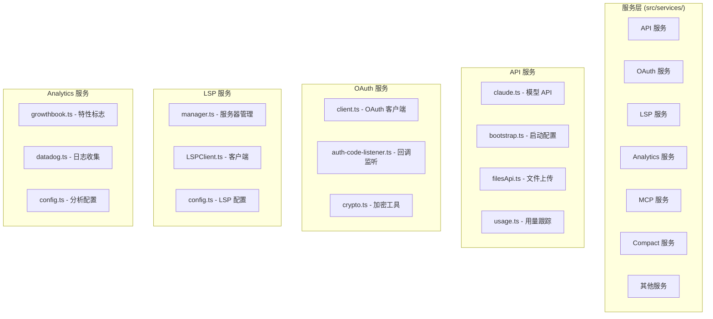
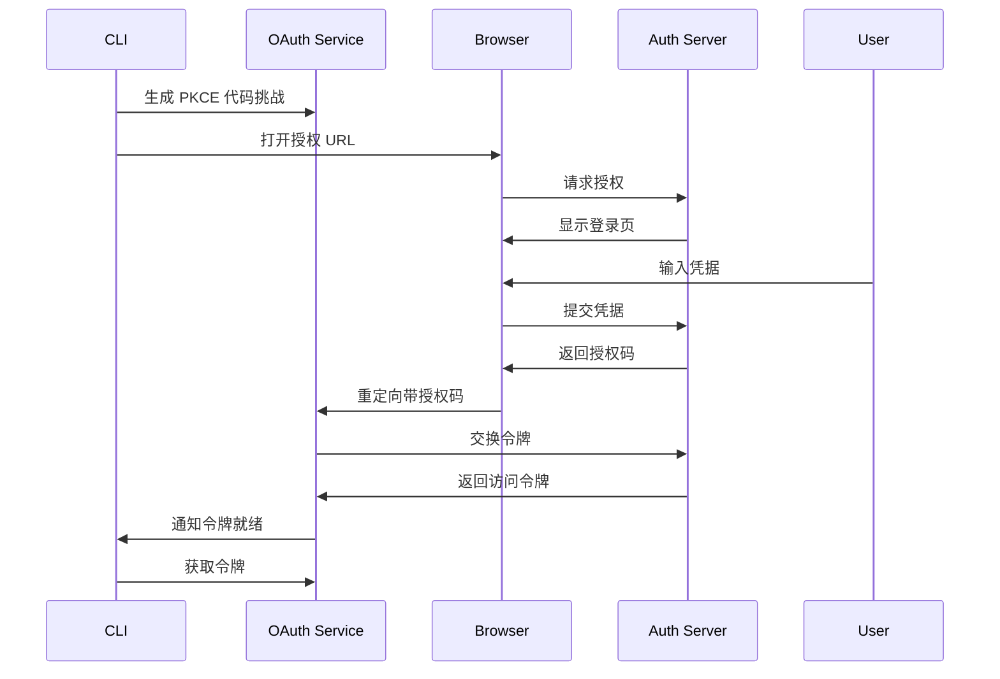

# 第 24 章：服务层与外部集成

> 本章目标：分析 Claude Code 的服务层架构，包括 API 服务、OAuth 认证、LSP 集成、遥测系统等外部服务集成。

## 24.1 服务层架构

### 服务组织



### 服务设计原则

1. **单一职责**：每个服务模块负责一个外部集成
2. **错误隔离**：服务错误不影响核心功能
3. **可配置性**：所有服务可通过配置禁用
4. **重试机制**：网络调用内置重试逻辑
5. **类型安全**：严格定义的接口和类型

## 24.2 API 服务

### Anthropic API 客户端

```typescript
// src/services/api/claude.ts
import type { Message } from '@anthropic-ai/sdk'
import Anthropic from '@anthropic-ai/sdk'

export type ClaudeApiConfig = {
  apiKey: string
  baseUrl?: string
  maxRetries?: number
  timeout?: number
}

export type StreamOptions = {
  onProgress?: (delta: Message) => void
  onComplete?: (message: Message) => void
  onError?: (error: Error) => void
}

/**
 * Claude API 包装器
 * 提供统一的 API 调用接口
 */
export class ClaudeApiClient {
  private client: Anthropic
  private config: ClaudeApiConfig

  constructor(config: ClaudeApiConfig) {
    this.config = config
    this.client = new Anthropic({
      apiKey: config.apiKey,
      baseURL: config.baseUrl,
      maxRetries: config.maxRetries ?? 3,
      timeout: config.timeout ?? 600000,
    })
  }

  /**
   * 创建消息（流式）
   */
  async *createMessageStream(
    params: MessagesCreateParams,
  ): AsyncGenerator<Message, void, unknown> {
    const stream = await this.client.messages.create(params, {
      onProgress: (delta) => {
        // 处理进度更新
      },
    })

    // 处理流式响应
    for await (const event of stream) {
      switch (event.type) {
        case 'content_block_delta':
          yield {
            type: 'content_block_delta',
            index: event.index,
            delta: event.delta,
          }
          break

        case 'content_block_stop':
          yield event
          break

        case 'message_stop':
          yield event
          break
      }
    }
  }

  /**
   * 创建消息（非流式）
   */
  async createMessage(
    params: MessagesCreateParams,
  ): Promise<Message> {
    return await this.client.messages.create(params)
  }

  /**
   * 计算令牌数
   */
  async countTokens(params: {
    model: string
    prompt: string
  }): Promise<number> {
    return await this.client.messages.count_tokens(params)
  }
}

/**
 * 单例客户端实例
 */
let globalClient: ClaudeApiClient | null = null

export function getClaudeClient(): ClaudeApiClient {
  if (!globalClient) {
    const apiKey = process.env.ANTHROPIC_API_KEY
    if (!apiKey) {
      throw new Error('ANTHROPIC_API_KEY not set')
    }

    globalClient = new ClaudeApiClient({ apiKey })
  }

  return globalClient
}
```

### 重试机制

```typescript
// src/services/api/withRetry.ts
import type { AbortSignal } from 'abort-controller'

export type RetryOptions = {
  maxRetries?: number
  initialDelayMs?: number
  maxDelayMs?: number
  backoffMultiplier?: number
  retryableErrors?: Array<(error: unknown) => boolean>
  signal?: AbortSignal
}

/**
 * 带重试的异步执行
 */
export async function withRetry<T>(
  fn: () => Promise<T>,
  options: RetryOptions = {},
): Promise<T> {
  const {
    maxRetries = 3,
    initialDelayMs = 1000,
    maxDelayMs = 30000,
    backoffMultiplier = 2,
    retryableErrors = [],
    signal,
  } = options

  let lastError: unknown
  let delay = initialDelayMs

  for (let attempt = 0; attempt <= maxRetries; attempt++) {
    // 检查中止信号
    if (signal?.aborted) {
      throw new Error('Operation aborted')
    }

    try {
      return await fn()
    } catch (error) {
      lastError = error

      // 检查是否可重试
      const isRetryable =
        attempt < maxRetries &&
        (isNetworkError(error) ||
          retryableErrors.some(check => check(error)))

      if (!isRetryable) {
        throw error
      }

      // 等待后重试
      await sleep(delay)
      delay = Math.min(delay * backoffMultiplier, maxDelayMs)
    }
  }

  throw lastError
}

/**
 * 判断是否为网络错误
 */
function isNetworkError(error: unknown): boolean {
  if (error instanceof TypeError) {
    // 网络错误通常抛出 TypeError
    return true
  }

  if (error instanceof Error) {
    const message = error.message.toLowerCase()
    return (
      message.includes('econnrefused') ||
      message.includes('etimedout') ||
      message.includes('enotfound') ||
      message.includes('econnreset')
    )
  }

  return false
}

function sleep(ms: number): Promise<void> {
  return new Promise(resolve => setTimeout(resolve, ms))
}
```

### 文件上传 API

```typescript
// src/services/api/filesApi.ts
import type { Readable } from 'stream'

export type FileUploadOptions = {
  fileName: string
  contentType: string
  content: Buffer | Readable | string
}

export type FileUploadResult = {
  id: string
  fileName: string
  size: number
  contentType: string
  url: string
}

/**
 * 文件上传服务
 */
export class FileUploadService {
  constructor(
    private apiKey: string,
    private baseUrl: string = 'https://api.anthropic.com',
  ) {}

  /**
   * 上传文件
   */
  async uploadFile(
    options: FileUploadOptions,
  ): Promise<FileUploadResult> {
    const formData = new FormData()
    formData.append('file', new Blob([options.content], {
      type: options.contentType,
    }), options.fileName)

    const response = await fetch(
      `${this.baseUrl}/v1/files`,
      {
        method: 'POST',
        headers: {
          'Authorization': `Bearer ${this.apiKey}`,
          // 不设置 Content-Type，让浏览器自动处理 multipart/form-data
        },
        body: formData,
      },
    )

    if (!response.ok) {
      const error = await response.text()
      throw new Error(`File upload failed: ${response.status} ${error}`)
    }

    return await response.json()
  }

  /**
   * 获取文件
   */
  async getFile(fileId: string): Promise<FileUploadResult> {
    const response = await fetch(
      `${this.baseUrl}/v1/files/${fileId}`,
      {
        method: 'GET',
        headers: {
          'Authorization': `Bearer ${this.apiKey}`,
        },
      },
    )

    if (!response.ok) {
      throw new Error(`Failed to get file: ${response.status}`)
    }

    return await response.json()
  }

  /**
   * 删除文件
   */
  async deleteFile(fileId: string): Promise<void> {
    const response = await fetch(
      `${this.baseUrl}/v1/files/${fileId}`,
      {
        method: 'DELETE',
        headers: {
          'Authorization': `Bearer ${this.apiKey}`,
        },
      },
    )

    if (!response.ok) {
      throw new Error(`Failed to delete file: ${response.status}`)
    }
  }
}
```

## 24.3 OAuth 服务

### OAuth 流程



### OAuth 客户端

```typescript
// src/services/oauth/client.ts
import { randomBytes } from 'crypto'
import { createServer, Server } from 'http'

export type OAuthConfig = {
  clientId: string
  authUrl: string
  tokenUrl: string
  scopes: string[]
  redirectPort: number
}

export type TokenResponse = {
  access_token: string
  refresh_token?: string
  expires_in?: number
  token_type?: string
}

/**
 * OAuth 2.0 客户端
 * 使用 PKCE (Proof Key for Code Exchange)
 */
export class OAuthClient {
  private config: OAuthConfig
  private server: Server | null = null
  private authCodePromise: Promise<string> | null = null

  constructor(config: OAuthConfig) {
    this.config = config
  }

  /**
   * 生成代码验证器和挑战
   */
  private generatePKCE(): {
    verifier: string
    challenge: string
    method: string
  } {
    // 代码验证器 (43-128 个字符)
    const verifier = randomBytes(32)
      .toString('base64url')
      .replace(/=/g, '')
      .replace(/\+/g, '-')
      .replace(/\//g, '_')

    // 代码挑战 (SHA256 哈希)
    const challenge = crypto
      .createHash('sha256')
      .update(verifier)
      .digest('base64url')
      .replace(/=/g, '')
      .replace(/\+/g, '-')
      .replace(/\//g, '_')

    return { verifier, challenge, method: 'S256' }
  }

  /**
   * 启动本地回调服务器
   */
  private startCallbackServer(): Promise<string> {
    return new Promise((resolve, reject) => {
      this.server = createServer((req, res) => {
        const url = new URL(req.url || '', `http://localhost:${this.config.redirectPort}`)

        // 提取授权码
        const code = url.searchParams.get('code')
        const error = url.searchParams.get('error')

        // 发送响应
        res.writeHead(200, { 'Content-Type': 'text/html' })
        res.end(`
          <html>
            <body>
              <h1>${error ? 'Authorization Failed' : 'Authorization Successful'}</h1>
              <p>You can close this window.</p>
            </body>
          </html>
        `)

        // 关闭服务器
        this.server?.close()

        if (error) {
          reject(new Error(`OAuth error: ${error}`))
        } else if (code) {
          resolve(code)
        } else {
          reject(new Error('No authorization code received'))
        }
      })

      this.server.listen(this.config.redirectPort)
      this.server.on('error', reject)
    })
  }

  /**
   * 生成授权 URL
   */
  generateAuthUrl(state?: string): string {
    const { challenge } = this.generatePKCE()

    const params = new URLSearchParams({
      client_id: this.config.clientId,
      redirect_uri: `http://localhost:${this.config.redirectPort}/callback`,
      scope: this.config.scopes.join(' '),
      response_type: 'code',
      code_challenge: challenge,
      code_challenge_method: 'S256',
    })

    if (state) {
      params.append('state', state)
    }

    return `${this.config.authUrl}?${params.toString()}`
  }

  /**
   * 交换授权码获取令牌
   */
  async exchangeCodeForToken(code: string): Promise<TokenResponse> {
    const { verifier } = this.generatePKCE()

    const response = await fetch(this.config.tokenUrl, {
      method: 'POST',
      headers: {
        'Content-Type': 'application/x-www-form-urlencoded',
      },
      body: new URLSearchParams({
        grant_type: 'authorization_code',
        code,
        redirect_uri: `http://localhost:${this.config.redirectPort}/callback`,
        client_id: this.config.clientId,
        code_verifier: verifier,
      }),
    })

    if (!response.ok) {
      const error = await response.text()
      throw new Error(`Token exchange failed: ${error}`)
    }

    return await response.json()
  }

  /**
   * 完整的 OAuth 流程
   */
  async authenticate(): Promise<TokenResponse> {
    // 生成授权 URL
    const authUrl = this.generateAuthUrl()

    // 启动回调服务器
    this.authCodePromise = this.startCallbackServer()

    // 打开浏览器
    await openBrowser(authUrl)

    // 等待授权码
    const code = await this.authCodePromise

    // 交换令牌
    return await this.exchangeCodeForToken(code)
  }

  /**
   * 清理资源
   */
  cleanup(): void {
    this.server?.close()
    this.server = null
    this.authCodePromise = null
  }
}

/**
 * 打开浏览器
 */
async function openBrowser(url: string): Promise<void> {
  const { exec } = require('child_process')

  switch (process.platform) {
    case 'darwin':
      exec(`open "${url}"`)
      break
    case 'win32':
      exec(`start "" "${url}"`)
      break
    default:
      exec(`xdg-open "${url}"`)
  }
}
```

### Token 存储

```typescript
// src/services/oauth/storage.ts
import { safeStorage } from 'electron' // 或系统 keychain

export type TokenData = {
  accessToken: string
  refreshToken?: string
  expiresAt?: number
}

/**
 * 安全的 Token 存储
 */
export class TokenStorage {
  private keyPrefix = 'oauth_token_'

  async saveToken(
    service: string,
    token: TokenData,
  ): Promise<void> {
    const key = `${this.keyPrefix}${service}`
    const encrypted = safeStorage.encryptString(
      JSON.stringify(token),
    )

    await setKeychainValue(key, encrypted)
  }

  async getToken(
    service: string,
  ): Promise<TokenData | null> {
    const key = `${this.keyPrefix}${service}`
    const encrypted = await getKeychainValue(key)

    if (!encrypted) {
      return null
    }

    const decrypted = safeStorage.decryptString(encrypted)
    return JSON.parse(decrypted)
  }

  async removeToken(service: string): Promise<void> {
    const key = `${this.keyPrefix}${service}`
    await deleteKeychainValue(key)
  }

  /**
   * 检查 Token 是否过期
   */
  isTokenExpired(token: TokenData): boolean {
    if (!token.expiresAt) {
      return false
    }

    // 提前 5 分钟过期
    const expiryBuffer = 5 * 60 * 1000
    return Date.now() >= token.expiresAt - expiryBuffer
  }

  /**
   * 刷新 Token
   */
  async refreshToken(
    service: string,
    refreshTokenFn: (refreshToken: string) => Promise<TokenData>,
  ): Promise<TokenData> {
    const current = await this.getToken(service)

    if (!current?.refreshToken) {
      throw new Error('No refresh token available')
    }

    const newToken = await refreshTokenFn(current.refreshToken)
    await this.saveToken(service, newToken)

    return newToken
  }
}
```

## 24.4 LSP 服务

### LSP 服务器管理

```typescript
// src/services/lsp/manager.ts
import { spawn, ChildProcess } from 'child_process'
import { connect, Socket } from 'net'

export type LSPServerConfig = {
  command: string
  args?: string[]
  env?: Record<string, string>
  cwd?: string
  transport?: 'stdio' | 'socket' | 'tcp'
  port?: number
  host?: string
}

export type LanguageServer = {
  name: string
  config: LSPServerConfig
  process?: ChildProcess
  socket?: Socket
  initialized: boolean
}

/**
 * LSP 服务器管理器
 */
export class LSPServerManager {
  private servers = new Map<string, LanguageServer>()

  /**
   * 注册 LSP 服务器
   */
  registerServer(
    name: string,
    config: LSPServerConfig,
  ): void {
    this.servers.set(name, {
      name,
      config,
      initialized: false,
    })
  }

  /**
   * 启动服务器
   */
  async startServer(name: string): Promise<void> {
    const server = this.servers.get(name)
    if (!server) {
      throw new Error(`Server ${name} not registered`)
    }

    if (server.initialized) {
      return
    }

    switch (server.config.transport) {
      case 'stdio':
        await this.startStdioServer(server)
        break
      case 'socket':
      case 'tcp':
        await this.startTcpServer(server)
        break
    }

    server.initialized = true
  }

  /**
   * 启动 stdio 服务器
   */
  private async startStdioServer(
    server: LanguageServer,
  ): Promise<void> {
    const { command, args = [], env, cwd } = server.config

    const process = spawn(command, args, {
      env: { ...process.env, ...env },
      cwd,
      stdio: ['pipe', 'pipe', 'pipe'],
    })

    process.on('error', (error) => {
      console.error(`LSP server ${server.name} error:`, error)
    })

    process.on('exit', (code) => {
      console.log(`LSP server ${server.name} exited with code ${code}`)
      server.initialized = false
    })

    server.process = process
  }

  /**
   * 启动 TCP 服务器
   */
  private async startTcpServer(
    server: LanguageServer,
  ): Promise<void> {
    const { host = 'localhost', port = 0 } = server.config

    // 如果需要启动服务器进程
    if (server.config.command) {
      this.startStdioServer(server)
    }

    // 连接到 TCP 端口
    const socket = connect(port, host)

    await new Promise<void>((resolve, reject) => {
      socket.on('connect', resolve)
      socket.on('error', reject)
    })

    server.socket = socket
  }

  /**
   * 停止服务器
   */
  stopServer(name: string): void {
    const server = this.servers.get(name)
    if (!server) {
      return
    }

    server.process?.kill()
    server.socket?.destroy()

    server.initialized = false
    server.process = undefined
    server.socket = undefined
  }

  /**
   * 停止所有服务器
   */
  stopAll(): void {
    for (const name of this.servers.keys()) {
      this.stopServer(name)
    }
  }
}
```

### LSP 客户端

```typescript
// src/services/lsp/LSPClient.ts
import { Emitter } from 'event-kit'

export type LSPMessage = {
  jsonrpc: '2.0'
  id?: number | string
  method?: string
  params?: unknown
  result?: unknown
  error?: {
    code: number
    message: string
    data?: unknown
  }
}

export type LSPNotification = {
  method: string
  params: unknown
}

/**
 * LSP 协议客户端
 */
export class LSPClient {
  private messageId = 0
  private pendingRequests = new Map<number, {
    resolve: (result: unknown) => void
    reject: (error: Error) => void
  }>()
  private emitter = new Emitter()

  constructor(
    private reader: AsyncIterable<string>,
    private writer: (message: string) => void | Promise<void>,
  ) {
    this.listen()
  }

  /**
   * 发送请求
   */
  async request<T = unknown>(
    method: string,
    params?: unknown,
  ): Promise<T> {
    const id = ++this.messageId

    const message: LSPMessage = {
      jsonrpc: '2.0',
      id,
      method,
      params,
    }

    return new Promise((resolve, reject) => {
      this.pendingRequests.set(id, { resolve, reject })

      this.sendMessage(message).catch(error => {
        this.pendingRequests.delete(id)
        reject(error)
      })
    })
  }

  /**
   * 发送通知
   */
  async notify(
    method: string,
    params?: unknown,
  ): Promise<void> {
    const message: LSPMessage = {
      jsonrpc: '2.0',
      method,
      params,
    }

    await this.sendMessage(message)
  }

  /**
   * 发送消息
   */
  private async sendMessage(message: LSPMessage): Promise<void> {
    const content = JSON.stringify(message)
    const header = `Content-Length: ${content.length}\r\n\r\n`

    await this.writer(header + content)
  }

  /**
   * 监听响应
   */
  private async listen(): Promise<void> {
    try {
      for await (const message of this.reader) {
        this.handleMessage(message)
      }
    } catch (error) {
      console.error('LSP client error:', error)
    }
  }

  /**
   * 处理消息
   */
  private handleMessage(data: string): void {
    let message: LSPMessage

    try {
      message = JSON.parse(data)
    } catch (error) {
      console.error('Failed to parse LSP message:', error)
      return
    }

    // 处理响应
    if (message.id !== undefined) {
      const pending = this.pendingRequests.get(Number(message.id))

      if (pending) {
        this.pendingRequests.delete(Number(message.id))

        if (message.error) {
          pending.reject(
            new Error(`LSP error: ${message.error.message}`),
          )
        } else {
          pending.resolve(message.result)
        }
      }

      return
    }

    // 处理通知
    if (message.method) {
      this.emitter.emit(message.method, message.params)
    }
  }

  /**
   * 订阅通知
   */
  onNotification<T = unknown>(
    method: string,
    callback: (params: T) => void,
  ): { dispose: () => void } {
    return this.emitter.on(method, callback)
  }

  /**
   * 常用 LSP 方法
   */
  async initialize(params: {
    rootUri: string
    capabilities: unknown
  }): Promise<unknown> {
    return this.request('initialize', params)
  }

  async didOpen(params: {
    textDocument: {
      uri: string
      languageId: string
      version: number
      text: string
    }
  }): Promise<void> {
    return this.notify('textDocument/didOpen', params)
  }

  async didChange(params: {
    textDocument: {
      uri: string
      version: number
    }
    contentChanges: Array<{ text: string }>
  }): Promise<void> {
    return this.notify('textDocument/didChange', params)
  }

  async completion(params: {
    textDocument: { uri: string }
    position: { line: number; character: number }
  }): Promise<unknown> {
    return this.request('textDocument/completion', params)
  }

  async definition(params: {
    textDocument: { uri: string }
    position: { line: number; character: number }
  }): Promise<unknown> {
    return this.request('textDocument/definition', params)
  }

  async diagnostics(params: {
    textDocument: { uri: string }
  }): Promise<unknown> {
    return this.request('textDocument/diagnostic', params)
  }

  dispose(): void {
    this.pendingRequests.clear()
    this.emitter.removeAllListeners()
  }
}
```

## 24.5 Analytics 服务

### GrowthBook 集成

```typescript
// src/services/analytics/growthbook.ts
import { GrowthBook } from '@growthbook/growthbook'

export type FeatureFlagConfig = {
  apiHost: string
  clientKey: string
  attributes: Record<string, unknown>
}

/**
 * GrowthBook 特性标志客户端
 */
export class FeatureFlagClient {
  private gb: GrowthBook
  private initialized = false

  constructor(config: FeatureFlagConfig) {
    this.gb = new GrowthBook({
      apiHost: config.apiHost,
      clientKey: config.clientKey,
      attributes: config.attributes,
      subscribeToChanges: true,
    })
  }

  /**
   * 初始化特性标志
   */
  async initialize(): Promise<void> {
    if (this.initialized) {
      return
    }

    await this.gb.loadFeatures()
    this.initialized = true
  }

  /**
   * 检查特性是否启用
   */
  isFeatureEnabled(
    featureKey: string,
    defaultValue = false,
  ): boolean {
    return this.gb.feature(featureKey).on ?? defaultValue
  }

  /**
   * 获取特性值
   */
  getFeatureValue<T = unknown>(
    featureKey: string,
    defaultValue: T,
  ): T {
    return this.gb.feature(featureKey).value ?? defaultValue
  }

  /**
   * 更新属性
   */
  setAttributes(attributes: Record<string, unknown>): void {
    this.gb.setAttributes(attributes)
  }

  /**
   * 刷新特性
   */
  async refresh(): Promise<void> {
    await this.gb.loadFeatures()
  }

  dispose(): void {
    this.gb.destroy()
  }
}

// 全局特性标志客户端
let globalFeatureFlags: FeatureFlagClient | null = null

export async function getFeatureFlags(): Promise<FeatureFlagClient> {
  if (!globalFeatureFlags) {
    globalFeatureFlags = new FeatureFlagClient({
      apiHost: process.env.GROWTHBOOK_API_HOST || 'https://cdn.growthbook.io',
      clientKey: process.env.GROWTHBOOK_CLIENT_KEY || '',
      attributes: {
        sessionId: getSessionId(),
        version: getAppVersion(),
        platform: process.platform,
      },
    })

    await globalFeatureFlags.initialize()
  }

  return globalFeatureFlags
}

/**
 * 特性门控检查
 */
export function feature(flag: string): boolean {
  return globalFeatureFlags?.isFeatureEnabled(flag) ?? false
}
```

### 事件追踪

```typescript
// src/services/analytics/index.ts
export type AnalyticsEvent = {
  name: string
  properties?: Record<string, unknown>
  timestamp?: number
}

export type AnalyticsConfig = {
  apiKey?: string
  apiUrl?: string
  disabled?: boolean
  batchSize?: number
  flushInterval?: number
}

/**
 * 分析事件收集器
 */
export class AnalyticsCollector {
  private queue: AnalyticsEvent[] = []
  private flushTimer: NodeJS.Timeout | null = null

  constructor(private config: AnalyticsConfig) {
    if (!config.disabled) {
      this.startFlushTimer()
    }
  }

  /**
   * 记录事件
   */
  log(event: AnalyticsEvent): void {
    if (this.config.disabled) {
      return
    }

    const enrichedEvent: AnalyticsEvent = {
      ...event,
      timestamp: Date.now(),
      properties: {
        ...event.properties,
        sessionId: getSessionId(),
        version: getAppVersion(),
      },
    }

    this.queue.push(enrichedEvent)

    if (
      this.config.batchSize &&
      this.queue.length >= this.config.batchSize
    ) {
      this.flush().catch(console.error)
    }
  }

  /**
   * 刷新队列
   */
  async flush(): Promise<void> {
    if (this.queue.length === 0) {
      return
    }

    const events = [...this.queue]
    this.queue = []

    try {
      await this.sendEvents(events)
    } catch (error) {
      // 失败时重新加入队列
      this.queue.unshift(...events)
    }
  }

  /**
   * 发送事件
   */
  private async sendEvents(
    events: AnalyticsEvent[],
  ): Promise<void> {
    if (!this.config.apiUrl || !this.config.apiKey) {
      return
    }

    const response = await fetch(this.config.apiUrl, {
      method: 'POST',
      headers: {
        'Content-Type': 'application/json',
        'Authorization': `Bearer ${this.config.apiKey}`,
      },
      body: JSON.stringify({ events }),
    })

    if (!response.ok) {
      throw new Error(`Analytics request failed: ${response.status}`)
    }
  }

  /**
   * 启动刷新定时器
   */
  private startFlushTimer(): void {
    const interval = this.config.flushInterval ?? 30000

    this.flushTimer = setInterval(() => {
      this.flush().catch(console.error)
    }, interval)
  }

  /**
   * 停止并刷新
   */
  async stop(): Promise<void> {
    if (this.flushTimer) {
      clearInterval(this.flushTimer)
      this.flushTimer = null
    }

    await this.flush()
  }
}

// 全局分析实例
let globalAnalytics: AnalyticsCollector | null = null

export function getAnalytics(): AnalyticsCollector {
  if (!globalAnalytics) {
    globalAnalytics = new AnalyticsCollector({
      disabled: isEnvTruthy(process.env.CLAUDE_CODE_DISABLE_ANALYTICS),
      batchSize: 50,
      flushInterval: 30000,
    })
  }

  return globalAnalytics
}

/**
 * 便捷函数：记录事件
 */
export function logEvent(
  name: string,
  properties?: Record<string, unknown>,
): void {
  getAnalytics().log({ name, properties })
}
```

## 24.6 可复用模式总结

### 模式 50：服务层抽象

**描述：** 统一的服务层接口，支持多种外部服务集成。

**适用场景：**
- 多 API 提供商集成
- 服务抽象层
- 插件系统

**代码模板：**

```typescript
// 1. 服务接口定义
export interface ServiceClient<TConfig = unknown> {
  initialize(config: TConfig): Promise<void>
  isInitialized(): boolean
  dispose(): void
}

// 2. 服务注册表
export class ServiceRegistry<TServices extends Record<string, ServiceClient>> {
  private services = new Map<keyof TServices, ServiceClient>()

  register<K extends keyof TServices>(
    name: K,
    service: TServices[K],
  ): void {
    this.services.set(name, service)
  }

  get<K extends keyof TServices>(
    name: K,
  ): TServices[K] | undefined {
    return this.services.get(name) as TServices[K]
  }

  async initializeAll(): Promise<void> {
    for (const service of this.services.values()) {
      if (!service.isInitialized()) {
        await service.initialize()
      }
    }
  }

  async disposeAll(): Promise<void> {
    for (const service of this.services.values()) {
      service.dispose()
    }
    this.services.clear()
  }
}

// 3. 使用示例
const registry = new ServiceRegistry<{
  api: ApiClient
  auth: AuthService
  analytics: AnalyticsService
}>()

registry.register('api', new ApiClient())
registry.register('auth', new AuthService())
registry.register('analytics', new AnalyticsService())

await registry.initializeAll()
```

**关键点：**
1. 定义统一的服务接口
2. 注册表管理所有服务
3. 批量初始化和清理
4. 类型安全的服务访问

### 模式 51：遥测收集模式

**描述：** 批量发送的遥测事件收集系统。

**适用场景：**
- 用户行为追踪
- 错误日志收集
- 性能监控

**代码模板：**

```typescript
export type TelemetryEvent = {
  name: string
  properties: Record<string, unknown>
  timestamp: number
}

export class TelemetryCollector {
  private queue: TelemetryEvent[] = []
  private flushing = false

  constructor(
    private config: {
      batchSize: number
      flushInterval: number
      endpoint: string
    },
  ) {
    // 定时刷新
    setInterval(() => this.flush(), config.flushInterval)
  }

  track(name: string, properties: Record<string, unknown> = {}): void {
    this.queue.push({
      name,
      properties,
      timestamp: Date.now(),
    })

    if (this.queue.length >= this.config.batchSize) {
      this.flush().catch(console.error)
    }
  }

  async flush(): Promise<void> {
    if (this.flushing || this.queue.length === 0) {
      return
    }

    this.flushing = true
    const events = this.queue.splice(0)

    try {
      await fetch(this.config.endpoint, {
        method: 'POST',
        headers: { 'Content-Type': 'application/json' },
        body: JSON.stringify({ events }),
      })
    } catch (error) {
      // 失败时重新入队
      this.queue.unshift(...events)
    } finally {
      this.flushing = false
    }
  }

  async stop(): Promise<void> {
    while (this.queue.length > 0) {
      await this.flush()
      await sleep(100)
    }
  }
}
```

**关键点：**
1. 批量收集事件
2. 定时刷新
3. 失败重试
4. 优雅停止

---

## 本章小结

本章分析了服务层与外部集成的实现：

1. **API 服务**：Claude API 客户端、重试机制、文件上传
2. **OAuth 服务**：PKCE 流程、回调处理、Token 存储
3. **LSP 服务**：服务器管理、协议客户端、常用方法
4. **Analytics 服务**：GrowthBook 特性标志、事件追踪
5. **可复用模式**：服务层抽象、遥测收集

## 下一章预告

第 25 章是总结章，将综合全书内容，提供构建自己 Agent CLI 的实践指南。
