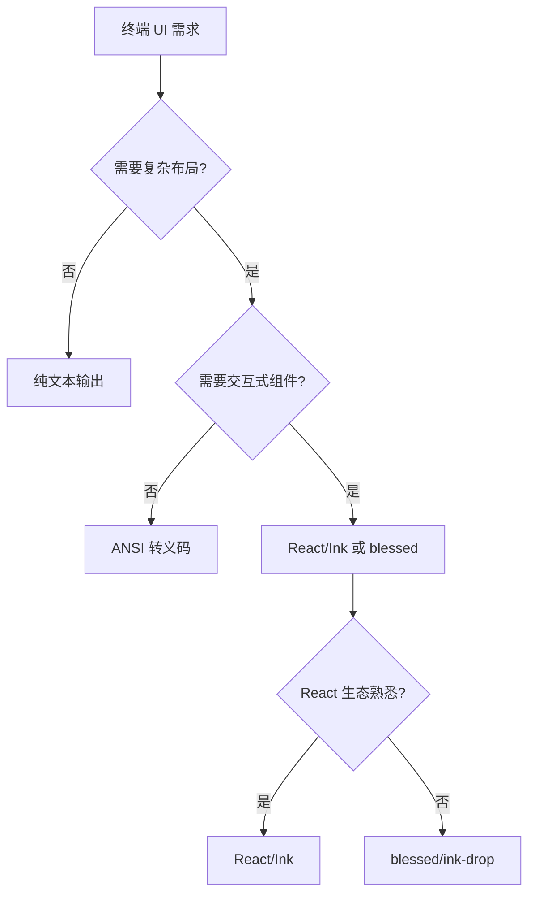

# 第 25 章：总结：构建自己的 Agent CLI

> 本章目标：综合全书内容，提供构建 Agent CLI 工具的实践指南。

## 25.1 架构决策清单

### 运行时选择

| 选项 | 优势 | 劣势 | 适用场景 |
|------|------|------|----------|
| **Bun** | 极快的启动速度、原生 TypeScript、内置工具 | 生态较新、社区较小 | 现代 CLI、性能敏感 |
| **Node.js** | 成熟生态、广泛兼容 | 启动较慢、需要配置 | 企业应用、稳定优先 |
| **Deno** | 安全内置、原生 TypeScript | 生态较小 | 安全敏感应用 |

**Claude Code 选择 Bun 的原因：**
- 启动速度至关重要（CLI 工具的第一印象）
- 内置 TypeScript 减少构建复杂度
- 原生打包支持简化分发

### UI 框架选择



| 框架 | 优势 | 劣势 |
|------|------|------|
| **React/Ink** | React 生态、组件化、热更新 | 需要学习 React、虚线程开销 |
| **blessed** | 高性能、成熟稳定 | 回调地狱、学习曲线陡峭 |
| **ink-drop** | 现代组件库 | 维护较少 |

### 架构模式选择

| 模式 | 适用场景 | Claude Code 实现 |
|------|----------|------------------|
| **分层架构** | 大型应用、团队协作 | 服务层、业务层、UI 层 |
| **插件架构** | 可扩展工具 | 插件系统、技能系统 |
| **事件驱动** | 异步操作、实时更新 | 消息处理、状态更新 |
| **依赖注入** | 可测试性、解耦 | QueryEngine 构造函数 |

## 25.2 核心组件实现指南

### 最小 QueryEngine 实现

```typescript
import type { ChatCompletion } from 'openai/resources/chat/completions'

export type Message = {
  role: 'user' | 'assistant' | 'system'
  content: string
}

export type QueryEngineConfig = {
  apiKey: string
  model: string
  baseUrl?: string
}

export type QueryOptions = {
  tools?: Tool[]
  maxTokens?: number
  temperature?: number
}

export type StreamEvent =
  | { type: 'text'; text: string }
  | { type: 'tool_use'; tool: ToolUse }
  | { type: 'done' }

/**
 * 最小查询引擎实现
 */
export class QueryEngine {
  private config: QueryEngineConfig
  private history: Message[] = []

  constructor(config: QueryEngineConfig) {
    this.config = config
  }

  /**
   * 提交查询
   */
  async *query(
    prompt: string,
    options: QueryOptions = {},
  ): AsyncGenerator<StreamEvent> {
    // 添加用户消息到历史
    this.history.push({ role: 'user', content: prompt })

    // 准备 API 请求
    const messages = this.buildMessages(options.tools)

    // 流式调用 API
    const stream = await this.callAPI(messages, options)

    // 处理流式响应
    let assistantContent = ''
    let toolUse: ToolUse | null = null

    for await (const chunk of stream) {
      const delta = chunk.choices[0]?.delta

      // 文本内容
      if (delta?.content) {
        assistantContent += delta.content
        yield { type: 'text', text: delta.content }
      }

      // 工具调用
      if (delta?.tool_calls) {
        for (const call of delta.tool_calls) {
          if (call.function) {
            toolUse = {
              id: call.id ?? randomUUID(),
              name: call.function.name,
              input: JSON.parse(call.function.arguments ?? '{}'),
            }
          }
        }
      }

      // 完成
      if (chunk.choices[0]?.finish_reason === 'stop') {
        // 添加助手消息到历史
        this.history.push({ role: 'assistant', content: assistantContent })

        if (toolUse) {
          yield { type: 'tool_use', tool: toolUse }
        }

        yield { type: 'done' }
      }
    }
  }

  /**
   * 构建消息列表
   */
  private buildMessages(tools?: Tool[]): Message[] {
    const messages: Message[] = [
      ...this.history,
    ]

    // 如果有工具，添加工具描述
    if (tools && tools.length > 0) {
      const toolsDesc = tools.map(t =>
        `- ${t.name}: ${t.description}`
      ).join('\n')

      messages.unshift({
        role: 'system',
        content: `You have access to the following tools:\n${toolsDesc}`,
      })
    }

    return messages
  }

  /**
   * 调用 API
   */
  private async *callAPI(
    messages: Message[],
    options: QueryOptions,
  ): AsyncGenerator<ChatCompletionChunk> {
    const client = new OpenAI({
      apiKey: this.config.apiKey,
      baseURL: this.config.baseUrl,
    })

    const stream = await client.chat.completions.create({
      model: this.config.model,
      messages: messages as any,
      tools: options.tools?.map(toAPISchema),
      max_tokens: options.maxTokens ?? 4096,
      temperature: options.temperature ?? 0,
      stream: true,
    })

    yield* stream
  }

  /**
   * 添加工具结果
   */
  async addToolResult(toolUseId: string, result: string): Promise<void> {
    // 查找并更新工具调用
    const lastMessage = this.history[this.history.length - 1]
    if (lastMessage?.role === 'assistant') {
      this.history.push({
        role: 'user',
        content: `[Tool Result for ${toolUseId}]: ${result}`,
      })
    }
  }

  /**
   * 清空历史
   */
  clearHistory(): void {
    this.history = []
  }

  /**
   * 获取历史
   */
  getHistory(): Message[] {
    return [...this.history]
  }
}
```

### 基础工具系统

```typescript
export type Tool = {
  name: string
  description: string
  inputSchema: Record<string, unknown>
  execute: (input: unknown) => Promise<string>
}

export type ToolUse = {
  id: string
  name: string
  input: unknown
}

/**
 * 工具注册表
 */
export class ToolRegistry {
  private tools = new Map<string, Tool>()

  register(tool: Tool): void {
    this.tools.set(tool.name, tool)
  }

  get(name: string): Tool | undefined {
    return this.tools.get(name)
  }

  list(): Tool[] {
    return Array.from(this.tools.values())
  }

  async execute(toolUse: ToolUse): Promise<string> {
    const tool = this.tools.get(toolUse.name)

    if (!tool) {
      throw new Error(`Unknown tool: ${toolUse.name}`)
    }

    return await tool.execute(toolUse.input)
  }
}

/**
 * 常用工具：文件读取
 */
export const FileReadTool: Tool = {
  name: 'read_file',
  description: 'Read the contents of a file',
  inputSchema: {
    type: 'object',
    properties: {
      file_path: {
        type: 'string',
        description: 'Path to the file to read',
      },
    },
    required: ['file_path'],
  },

  async execute(input: unknown): Promise<string> {
    const { file_path } = input as { file_path: string }

    try {
      const content = await fs.readFile(file_path, 'utf-8')
      return content
    } catch (error) {
      return `Error: ${error}`
    }
  },
}

/**
 * 常用工具：文件写入
 */
export const FileWriteTool: Tool = {
  name: 'write_file',
  description: 'Write content to a file',
  inputSchema: {
    type: 'object',
    properties: {
      file_path: {
        type: 'string',
        description: 'Path to the file to write',
      },
      content: {
        type: 'string',
        description: 'Content to write',
      },
    },
    required: ['file_path', 'content'],
  },

  async execute(input: unknown): Promise<string> {
    const { file_path, content } = input as {
      file_path: string
      content: string
    }

    try {
      await fs.writeFile(file_path, content, 'utf-8')
      return `Successfully wrote to ${file_path}`
    } catch (error) {
      return `Error: ${error}`
    }
  },
}

/**
 * 常用工具：命令执行
 */
export const BashTool: Tool = {
  name: 'run_command',
  description: 'Execute a shell command',
  inputSchema: {
    type: 'object',
    properties: {
      command: {
        type: 'string',
        description: 'Command to execute',
      },
    },
    required: ['command'],
  },

  async execute(input: unknown): Promise<string> {
    const { command } = input as { command: string }

    try {
      const { exec } = require('child_process')

      return new Promise((resolve) => {
        exec(command, (error: unknown, stdout: string, stderr: string) => {
          if (error) {
            resolve(`Error: ${error}\n${stderr}`)
          } else {
            resolve(stdout || stderr)
          }
        })
      })
    } catch (error) {
      return `Error: ${error}`
    }
  },
}
```

### 简单命令系统

```typescript
export type Command = {
  name: string
  description: string
  handler: (args: string, context: CommandContext) => Promise<void>
}

export type CommandContext = {
  queryEngine: QueryEngine
  toolRegistry: ToolRegistry
  config: Record<string, unknown>
}

/**
 * 命令注册表
 */
export class CommandRegistry {
  private commands = new Map<string, Command>()

  register(command: Command): void {
    this.commands.set(command.name, command)
  }

  get(name: string): Command | undefined {
    return this.commands.get(name)
  }

  list(): Command[] {
    return Array.from(this.commands.values())
  }

  async execute(
    name: string,
    args: string,
    context: CommandContext,
  ): Promise<void> {
    const command = this.commands.get(name)

    if (!command) {
      throw new Error(`Unknown command: ${name}`)
    }

    await command.handler(args, context)
  }
}

/**
 * 常用命令：/help
 */
export const HelpCommand: Command = {
  name: 'help',
  description: 'Show available commands',
  handler: async (_args, context) => {
    const commands = context.commandRegistry?.list() ?? []

    console.log('Available commands:')
    for (const cmd of commands) {
      console.log(`  /${cmd.name}: ${cmd.description}`)
    }
  },
}

/**
 * 常用命令：/clear
 */
export const ClearCommand: Command = {
  name: 'clear',
  description: 'Clear conversation history',
  handler: async (_args, context) => {
    context.queryEngine.clearHistory()
    console.log('Conversation history cleared.')
  },
}

/**
 * 常用命令：/model
 */
export const ModelCommand: Command = {
  name: 'model',
  description: 'Switch to a different model',
  handler: async (args, context) => {
    const model = args.trim()

    if (!model) {
      console.log(`Current model: ${context.config.model}`)
    } else {
      context.config.model = model
      console.log(`Model switched to: ${model}`)
    }
  },
}
```

## 25.3 渐进式开发路径

### MVP 阶段（第一周）

**目标：** 可工作的最小产品

```
agent-cli/
├── src/
│   ├── index.ts          # 入口点
│   ├── cli.ts            # 命令行解析
│   ├── query.ts          # API 调用
│   └── tools/
│       └── basic.ts      # 基础工具
├── package.json
└── tsconfig.json
```

**核心功能：**
1. 命令行输入 → LLM 响应
2. 基础工具（read、write、bash）
3. 流式输出显示

**关键决策：**
- 选择运行时（推荐 Bun）
- 选择 LLM 提供商
- 选择终端 UI 方案

### 扩展阶段（第二至四周）

**目标：** 功能完整的工具

**新增功能：**
1. **工具系统扩展**
   - 文件编辑工具
   - 搜索工具（grep、glob）
   - Web 搜索/获取

2. **命令系统**
   - 斜杠命令
   - 配置管理
   - 帮助系统

3. **状态管理**
   - 会话历史持久化
   - 配置文件
   - 缓存管理

4. **UI 改进**
   - 进度指示器
   - 错误处理
   - 彩色输出

### 优化阶段（第五周及以后）

**目标：** 生产级质量

**优化方向：**
1. **性能**
   - 启动时间优化
   - 内存管理
   - 并发处理

2. **可靠性**
   - 错误恢复
   - 重试机制
   - 日志系统

3. **扩展性**
   - 插件系统
   - 技能系统
   - MCP 集成

4. **集成**
   - IDE 扩展
   - LSP 支持
   - 远程执行

## 25.4 常见陷阱与最佳实践

### 性能陷阱

#### 1. 过度的序列化/反序列化

```typescript
// ❌ 不好：频繁的 JSON 操作
function processMessage(msg: Message): Message {
  const serialized = JSON.stringify(msg)
  const deserialized = JSON.parse(serialized)
  return transform(deserialized)
}

// ✅ 好：直接操作对象
function processMessage(msg: Message): Message {
  return transform({ ...msg })
}
```

#### 2. 同步文件操作

```typescript
// ❌ 不好：阻塞主线程
const content = fs.readFileSync(path, 'utf-8')

// ✅ 好：异步操作
const content = await fs.readFile(path, 'utf-8')
```

#### 3. 过早优化

```typescript
// ❌ 不好：过早的缓存复杂度
class ComplexCache {
  private lru: Map<string, any>
  private ttl: Map<string, number>
  // ... 大量代码
}

// ✅ 好：简单开始，按需优化
class SimpleCache {
  private cache = new Map<string, any>()

  get(key: string): any {
    return this.cache.get(key)
  }

  set(key: string, value: any): void {
    this.cache.set(key, value)
  }
}
```

### 安全陷阱

#### 1. 命令注入

```typescript
// ❌ 不好：直接拼接命令
const result = exec(`cat ${userInput}`)

// ✅ 好：参数化执行
const { spawn } = require('child_process')
const result = spawn('cat', [userInput])
```

#### 2. 路径遍历

```typescript
// ❌ 不好：未验证路径
const content = await fs.readFile(userPath, 'utf-8')

// ✅ 好：路径验证
function resolveSafePath(baseDir: string, userPath: string): string {
  const resolved = path.resolve(baseDir, userPath)
  if (!resolved.startsWith(baseDir)) {
    throw new Error('Path traversal detected')
  }
  return resolved
}
```

#### 3. API 密钥泄露

```typescript
// ❌ 不好：硬编码密钥
const apiKey = 'sk-ant-...'

// ✅ 好：环境变量
const apiKey = process.env.API_KEY

// ✅ 更好：密钥管理
const apiKey = await keychain.getPassword('agent-cli', 'api-key')
```

### 可维护性陷阱

#### 1. 过于复杂的类型

```typescript
// ❌ 不好：过度嵌套
type Config = {
  features: {
    tools: {
      file: {
        read: {
          enabled: boolean
          options: {
            encoding: string
            maxSize: number
          }
        }
      }
    }
  }
}

// ✅ 好：扁平结构
type FileReadOptions = {
  enabled: boolean
  encoding: string
  maxSize: number
}

type ToolConfig = {
  file: {
    read: FileReadOptions
  }
}

type Config = {
  features: {
    tools: ToolConfig
  }
}
```

#### 2. 魔法数字

```typescript
// ❌ 不好：魔法数字
if (retryCount > 3) {
  throw new Error('Max retries exceeded')
}

// ✅ 好：命名常量
const MAX_RETRIES = 3

if (retryCount > MAX_RETRIES) {
  throw new Error('Max retries exceeded')
}
```

#### 3. 忽略错误

```typescript
// ❌ 不好：吞掉错误
try {
  await riskyOperation()
} catch {
  // 忽略
}

// ✅ 好：记录或处理
try {
  await riskyOperation()
} catch (error) {
  logger.error('Operation failed', error)
  throw error // 或恢复
}
```

## 25.5 从 Claude Code 学到的设计原则

### 1. 用户体验优先

- **快速启动**：使用 Bun 的快速启动
- **即时反馈**：流式输出显示
- **友好错误**：清晰的错误消息和建议

### 2. 渐进式增强

- **核心优先**：先实现核心功能
- **按需加载**：延迟非关键功能
- **特性门控**：通过配置启用实验功能

### 3. 可扩展性设计

- **插件架构**：支持第三方扩展
- **技能系统**：用户定义工作流
- **MCP 集成**：标准化的扩展协议

### 4. 类型安全

- **严格模式**：TypeScript 严格模式
- **Schema 验证**：Zod 运行时验证
- **类型推导**：充分利用类型系统

### 5. 错误处理

- **分类错误**：区分可恢复/不可恢复
- **重试机制**：网络错误自动重试
- **优雅降级**：功能失败时的备选方案

### 6. 性能意识

- **并行加载**：独立的初始化任务并行执行
- **缓存策略**：智能缓存减少重复计算
- **资源管理**：及时释放资源

### 7. 测试策略

- **单元测试**：核心逻辑覆盖
- **集成测试**：端到端流程验证
- **手动测试**：用户体验验证

### 8. 文档和注释

- **代码注释**：解释"为什么"而非"是什么"
- **类型文档**：JSDoc 类型注释
- **用户文档**：清晰的指南

### 9. 可观测性

- **日志系统**：结构化日志输出
- **指标收集**：性能和使用指标
- **错误追踪**：错误上报和分析

### 10. 社区友好

- **开放协议**：MCP 标准化
- **可扩展性**：插件和技能
- **文档完善**：详细的开发指南

## 25.6 资源与延伸阅读

### 相关项目

- **OpenAI CLI**：OpenAI 官方 CLI 工具
- **Aider**：AI 结对编程 CLI
- **Cursor**：AI 代码编辑器
- **Continue**：VS Code AI 扩展

### 参考文档

- **Bun 文档**：https://bun.sh/docs
- **Ink 文档**：https://github.com/vadimdemedes/ink
- **MCP 协议**：https://modelcontextprotocol.io
- **Anthropic API**：https://docs.anthropic.com

### 社区资源

- **Claude Code GitHub**：https://github.com/anthropics/claude-code
- **MCP Servers**：https://github.com/modelcontextprotocol
- **Agent 示例**：搜索 GitHub 的 "agent-cli" 相关项目

---

## 全书总结

本书深入分析了 Claude Code CLI 的完整技术实现，涵盖了从基础架构到高级特性的各个方面：

### 第一部分：基础与架构（第 1-4 章）
- 项目总览与技术选型
- 构建系统与启动流程
- 分层架构设计

### 第二部分：核心引擎（第 5-7 章）
- QueryEngine 配置与初始化
- 消息处理与 API 交互
- 流式响应与特殊功能

### 第三部分：工具系统（第 8-12 章）
- 工具类型与注册机制
- 文件、搜索、执行工具
- Agent 工具系统

### 第四部分：命令与界面（第 13-17 章）
- 命令系统与权限设计
- React/Ink UI 框架
- 组件系统与状态管理

### 第五部分：高级子系统（第 18-22 章）
- Bridge IDE 集成
- MCP 协议集成
- 多 Agent 协调
- 任务管理系统
- 插件与技能系统

### 第六部分：基础设施（第 23-24 章）
- 配置管理与迁移
- 服务层与外部集成

### 47 个可复用模式总结

本书总结了 47 个可复用的设计模式，涵盖：
- 架构模式（分层、插件、协调器）
- 数据流模式（异步生成器、流式处理）
- UI 模式（终端组件、输入处理）
- 系统模式（配置、迁移、遥测）

这些模式可以直接应用于构建自己的 Agent CLI 工具。

---

**感谢阅读！**

希望本书能帮助你更好地理解 Claude Code 的实现，并构建出优秀的 Agent CLI 工具。
