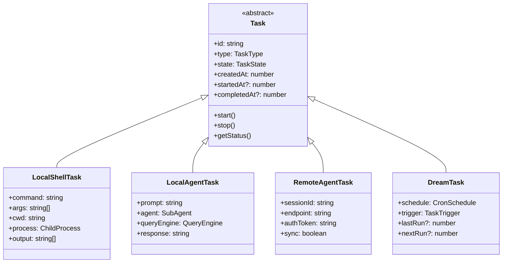
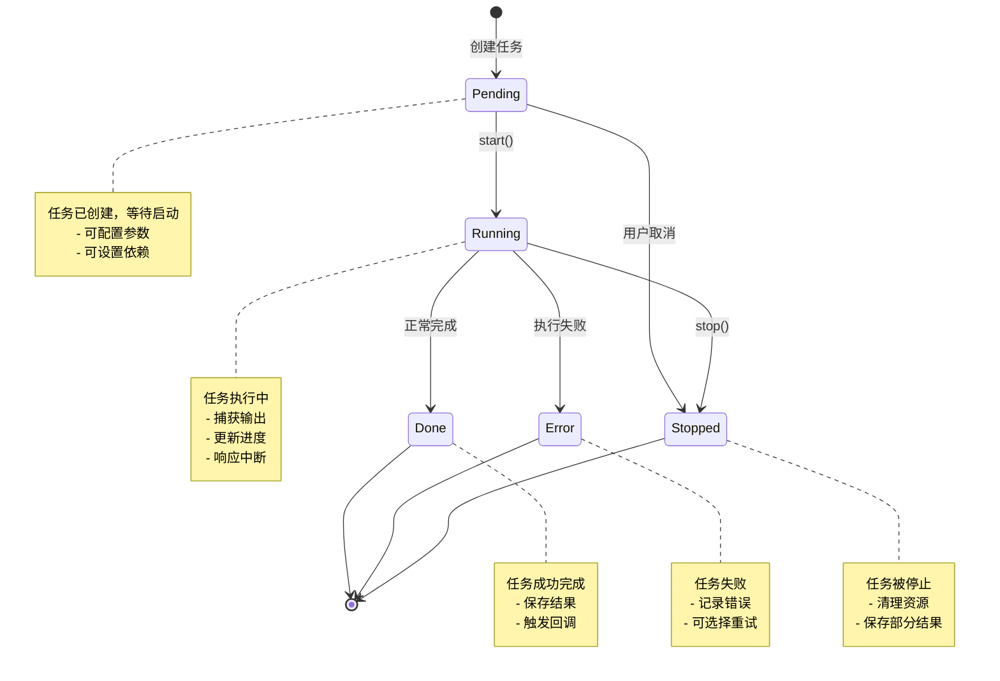

# 第 25 章：任务管理系统

> 本章目标：深入理解 Claude Code 的任务管理架构，这是跟踪和管理异步操作的核心机制。

## 25.1 任务系统概述

### 25.1.1 设计意图

Claude Code 中的"任务"是一个广义概念，涵盖了各种异步操作的抽象：

**任务类型：**
- **Shell 任务**：执行 bash 命令
- **Agent 任务**：运行子 Agent 进行复杂操作
- **远程任务**：在远程服务器上执行操作
- **Dream 任务**：后台智能任务调度

**为什么需要任务系统：**
1. **操作追踪**：用户需要知道哪些操作正在进行
2. **状态管理**：任务有完整的生命周期（pending → running → done）
3. **输出捕获**：长时间运行的命令需要实时输出
4. **中断控制**：用户可以随时停止任务
5. **结果检索**：任务完成后可以获取输出

**作者观点**：任务系统的设计体现了"可观测性"和"可控性"的平衡。通过统一的任务抽象，CLI 可以向用户提供透明的操作状态，同时保留细粒度的控制能力。这种设计模式可以应用于任何需要管理异步操作的 CLI 工具。

### 25.1.2 任务类型层次



### 25.1.3 任务状态机



## 25.2 任务基类与状态管理

### 25.2.1 任务基类

```typescript
// src/tasks/Task.ts
export type TaskState = 'pending' | 'running' | 'done' | 'error' | 'stopped'

export type TaskType =
  | 'local-shell'
  | 'local-agent'
  | 'remote-agent'
  | 'dream'

export type TaskConfig = {
  id: string
  type: TaskType
  description: string
  metadata?: Record<string, unknown>
}

export type TaskStatus = {
  id: string
  type: TaskType
  state: TaskState
  description: string
  progress?: number
  output?: string[]
  error?: string
  createdAt: number
  startedAt?: number
  completedAt?: number
  duration?: number
}

/**
 * 任务基类
 */
export abstract class Task {
  protected state: TaskState = 'pending'
  protected createdAt: number
  protected startedAt?: number
  protected completedAt?: number
  protected output: string[] = []
  protected error?: string

  readonly id: string
  readonly type: TaskType
  readonly description: string
  readonly metadata: Record<string, unknown>

  constructor(config: TaskConfig) {
    this.id = config.id
    this.type = config.type
    this.description = config.description
    this.metadata = config.metadata ?? {}
    this.createdAt = Date.now()
  }

  /**
   * 启动任务（子类实现）
   */
  abstract start(): Promise<void>

  /**
   * 停止任务（子类实现）
   */
  abstract stop(): Promise<void>

  /**
   * 获取状态
   */
  getStatus(): TaskStatus {
    return {
      id: this.id,
      type: this.type,
      state: this.state,
      description: this.description,
      output: [...this.output],
      error: this.error,
      createdAt: this.createdAt,
      startedAt: this.startedAt,
      completedAt: this.completedAt,
      duration: this.completedAt && this.startedAt
        ? this.completedAt - this.startedAt
        : undefined,
    }
  }

  /**
   * 是否完成
   */
  isComplete(): boolean {
    return ['done', 'error', 'stopped'].includes(this.state)
  }

  /**
   * 是否运行中
   */
  isRunning(): boolean {
    return this.state === 'running'
  }

  /**
   * 获取输出
   */
  getOutput(): string {
    return this.output.join('\n')
  }

  /**
   * 添加输出
   */
  protected addOutput(line: string): void {
    this.output.push(line)
  }

  /**
   * 设置错误
   */
  protected setError(error: string): void {
    this.error = error
    this.state = 'error'
    this.completedAt = Date.now()
  }

  /**
   * 标记开始
   */
  protected markStarted(): void {
    this.state = 'running'
    this.startedAt = Date.now()
  }

  /**
   * 标记完成
   */
  protected markDone(): void {
    this.state = 'done'
    this.completedAt = Date.now()
  }

  /**
   * 标记停止
   */
  protected markStopped(): void {
    this.state = 'stopped'
    this.completedAt = Date.now()
  }
}
```

### 25.2.2 任务管理器

```typescript
// src/tasks/TaskManager.ts
export type TaskManagerConfig = {
  maxConcurrentTasks: number
  taskTimeout: number
  enablePersistence: boolean
  historySize: number
}

/**
 * 任务管理器
 */
export class TaskManager {
  private tasks = new Map<string, Task>()
  private runningTasks = new Set<string>()
  private history: TaskStatus[] = []

  constructor(private config: TaskManagerConfig) {}

  /**
   * 创建任务
   */
  async createTask(
    type: TaskType,
    config: Omit<TaskConfig, 'type' | 'id'>,
  ): Promise<string> {
    // 检查并发限制
    if (this.runningTasks.size >= this.config.maxConcurrentTasks) {
      throw new Error(
        `Too many concurrent tasks (${this.runningTasks.size}/${this.config.maxConcurrentTasks})`
      )
    }

    const taskConfig: TaskConfig = {
      ...config,
      id: this.generateId(),
      type,
    }

    const task = this.createTaskInstance(type, taskConfig)
    this.tasks.set(task.id, task)

    return task.id
  }

  /**
   * 启动任务
   */
  async startTask(taskId: string): Promise<void> {
    const task = this.tasks.get(taskId)
    if (!task) {
      throw new Error(`Task not found: ${taskId}`)
    }

    if (task.isComplete()) {
      throw new Error(`Task already complete: ${taskId}`)
    }

    if (task.isRunning()) {
      return  // 已在运行
    }

    this.runningTasks.add(taskId)

    try {
      await task.start()

      // 任务完成后从运行列表移除
      this.runningTasks.delete(taskId)

      // 添加到历史
      this.addToHistory(task.getStatus())
    } catch (error) {
      this.runningTasks.delete(taskId)
      throw error
    }
  }

  /**
   * 停止任务
   */
  async stopTask(taskId: string): Promise<void> {
    const task = this.tasks.get(taskId)
    if (!task) {
      throw new Error(`Task not found: ${taskId}`)
    }

    await task.stop()
    this.runningTasks.delete(taskId)
    this.addToHistory(task.getStatus())
  }

  /**
   * 获取任务状态
   */
  getTaskStatus(taskId: string): TaskStatus | null {
    const task = this.tasks.get(taskId)
    return task?.getStatus() ?? null
  }

  /**
   * 获取所有任务
   */
  listTasks(filter?: { state?: TaskState; type?: TaskType }): TaskStatus[] {
    let tasks = Array.from(this.tasks.values()).map(t => t.getStatus())

    if (filter) {
      tasks = tasks.filter(status => {
        if (filter.state && status.state !== filter.state) return false
        if (filter.type && status.type !== filter.type) return false
        return true
      })
    }

    return tasks
  }

  /**
   * 获取任务输出
   */
  getTaskOutput(taskId: string): string | null {
    const task = this.tasks.get(taskId)
    return task?.getOutput() ?? null
  }

  /**
   * 清理已完成的任务
   */
  cleanup(olderThan?: number): void {
    const now = Date.now()
    const threshold = olderThan ?? 60000  // 默认 1 分钟

    for (const [id, task] of this.tasks) {
      if (task.isComplete()) {
        const completedAt = task.getStatus().completedAt ?? 0
        if (now - completedAt > threshold) {
          this.tasks.delete(id)
        }
      }
    }
  }

  /**
   * 创建任务实例
   */
  private createTaskInstance(type: TaskType, config: TaskConfig): Task {
    switch (type) {
      case 'local-shell':
        return new LocalShellTask(config as LocalShellTaskConfig)

      case 'local-agent':
        return new LocalAgentTask(config as LocalAgentTaskConfig)

      case 'remote-agent':
        return new RemoteAgentTask(config as RemoteAgentTaskConfig)

      case 'dream':
        return new DreamTask(config as DreamTaskConfig)

      default:
        throw new Error(`Unknown task type: ${type}`)
    }
  }

  /**
   * 生成任务 ID
   */
  private generateId(): string {
    return `task-${Date.now()}-${Math.random().toString(36).slice(2, 8)}`
  }

  /**
   * 添加到历史
   */
  private addToHistory(status: TaskStatus): void {
    this.history.unshift(status)

    // 限制历史大小
    if (this.history.length > this.config.historySize) {
      this.history = this.history.slice(0, this.config.historySize)
    }
  }

  /**
   * 获取历史
   */
  getHistory(): TaskStatus[] {
    return [...this.history]
  }
}
```

## 25.3 LocalShellTask

### 25.3.1 Shell 任务实现

```typescript
// src/tasks/LocalShellTask.ts
import { spawn, ChildProcess } from 'child_process'

export type LocalShellTaskConfig = TaskConfig & {
  type: 'local-shell'
  command: string
  args?: string[]
  cwd?: string
  env?: Record<string, string>
  timeout?: number
  runInBackground?: boolean
}

export type ShellTaskStatus = TaskStatus & {
  type: 'local-shell'
  command: string
  args: string[]
  pid?: number
  exitCode?: number
}

/**
 * 本地 Shell 任务
 */
export class LocalShellTask extends Task {
  readonly type = 'local-shell' as const
  private process: ChildProcess | null = null
  private timeoutTimer: NodeJS.Timeout | null = null
  private outputBuffer: string[] = []

  readonly command: string
  readonly args: string[]
  readonly cwd: string
  readonly env: Record<string, string>
  readonly timeout: number
  readonly runInBackground: boolean

  constructor(config: LocalShellTaskConfig) {
    super(config)
    this.command = config.command
    this.args = config.args ?? []
    this.cwd = config.cwd ?? process.cwd()
    this.env = { ...process.env, ...config.env }
    this.timeout = config.timeout ?? 300000  // 默认 5 分钟
    this.runInBackground = config.runInBackground ?? false
  }

  /**
   * 启动任务
   */
  async start(): Promise<void> {
    if (this.state !== 'pending') {
      throw new Error(`Task not in pending state: ${this.state}`)
    }

    this.markStarted()

    return new Promise((resolve, reject) => {
      // 启动进程
      this.process = spawn(this.command, this.args, {
        cwd: this.cwd,
        env: this.env,
        stdio: ['pipe', 'pipe', 'pipe'],
      })

      const pid = this.process.pid ?? 0
      console.log(`Shell task started: ${this.command} (PID: ${pid})`)

      // 捕获 stdout
      this.process.stdout?.on('data', (data: Buffer) => {
        const output = data.toString()
        this.handleOutput(output)
      })

      // 捕获 stderr
      this.process.stderr?.on('data', (data: Buffer) => {
        const output = data.toString()
        this.handleOutput(output)
      })

      // 处理退出
      this.process.on('exit', (code, signal) => {
        this.clearTimeout()

        if (signal === 'SIGTERM' || signal === 'SIGKILL') {
          this.markStopped()
          console.log(`Shell task stopped: ${this.id}`)
        } else if (code === 0) {
          this.markDone()
          console.log(`Shell task completed: ${this.id}`)
        } else {
          this.setError(`Command exited with code ${code}`)
          console.error(`Shell task failed: ${this.id} (code: ${code})`)
        }

        resolve()
      })

      // 处理错误
      this.process.on('error', (error) => {
        this.clearTimeout()
        this.setError(error.message)
        reject(error)
      })

      // 设置超时
      if (this.timeout > 0) {
        this.timeoutTimer = setTimeout(() => {
          console.warn(`Shell task timeout: ${this.id}`)
          this.stop()
        }, this.timeout)
      }

      // 如果是后台任务，立即 resolve
      if (this.runInBackground) {
        resolve()
      }
    })
  }

  /**
   * 停止任务
   */
  async stop(): Promise<void> {
    if (!this.process) {
      return
    }

    console.log(`Stopping shell task: ${this.id}`)

    // 先尝试 SIGTERM
    this.process.kill('SIGTERM')

    // 等待 5 秒后强制杀死
    setTimeout(() => {
      if (this.process && this.state === 'running') {
        console.warn(`Force killing shell task: ${this.id}`)
        this.process.kill('SIGKILL')
      }
    }, 5000)

    this.markStopped()
  }

  /**
   * 处理输出
   */
  private handleOutput(data: string): void {
    const lines = data.split('\n')

    for (const line of lines) {
      if (line) {
        this.addOutput(line)
        this.outputBuffer.push(line)
      }
    }

    // 触发输出事件
    this.emit('output', { taskId: this.id, line: data })
  }

  /**
   * 清除超时
   */
  private clearTimeout(): void {
    if (this.timeoutTimer) {
      clearTimeout(this.timeoutTimer)
      this.timeoutTimer = null
    }
  }

  /**
   * 获取详细状态
   */
  getShellStatus(): ShellTaskStatus {
    return {
      ...this.getStatus(),
      type: 'local-shell',
      command: this.command,
      args: this.args,
      pid: this.process?.pid,
      exitCode: this.state === 'done' ? 0 : this.state === 'error' ? 1 : undefined,
    }
  }

  /**
   * 简单的事件发射器
   */
  private listeners = new Map<string, Array<(data: unknown) => void>>()

  private emit(event: string, data: unknown): void {
    const callbacks = this.listeners.get(event) ?? []
    for (const callback of callbacks) {
      callback(data)
    }
  }

  on(event: string, callback: (data: unknown) => void): void {
    if (!this.listeners.has(event)) {
      this.listeners.set(event, [])
    }
    this.listeners.get(event)?.push(callback)
  }
}
```

### 25.3.2 Bash 安全集成

Shell 任务需要与 Bash 安全系统（第 13 章详细讨论）集成：

```typescript
// src/tasks/LocalShellTask.ts (扩展)

/**
 * 验证命令安全性
 */
private async validateCommand(): Promise<{ safe: boolean; reason?: string }> {
  const { BashSecurity } = await import('../tools/BashTool/bashSecurity.js')

  // 构建完整命令
  const fullCommand = [this.command, ...this.args].join(' ')

  // 检查命令安全性
  const result = BashSecurity.analyzeCommand(fullCommand)

  return result
}

/**
 * 启动任务（带安全检查）
 */
async start(): Promise<void> {
  // 验证命令安全性
  const validation = await this.validateCommand()

  if (!validation.safe) {
    const error = `Command not safe: ${validation.reason}`
    this.setError(error)
    throw new Error(error)
  }

  // 继续正常启动流程
  // ...
}
```

## 25.4 LocalAgentTask

### 25.4.1 Agent 任务实现

```typescript
// src/tasks/LocalAgentTask.ts
export type LocalAgentTaskConfig = TaskConfig & {
  type: 'local-agent'
  prompt: string
  agentType?: 'explore' | 'code-reviewer' | 'general'
  model?: string
  maxTokens?: number
  tools?: string[]
  context?: RequestContext
}

export type AgentTaskStatus = TaskStatus & {
  type: 'local-agent'
  prompt: string
  agentType: string
  response?: string
  usage?: TokenUsage
}

/**
 * 本地 Agent 任务
 */
export class LocalAgentTask extends Task {
  readonly type = 'local-agent' as const
  private agent: SubAgent | null = null
  private response: string = ''
  private usage: TokenUsage | null = null

  readonly prompt: string
  readonly agentType: string
  readonly model: string
  readonly maxTokens: number
  readonly tools: string[]
  readonly context?: RequestContext

  constructor(config: LocalAgentTaskConfig) {
    super(config)
    this.prompt = config.prompt
    this.agentType = config.agentType ?? 'general'
    this.model = config.model ?? 'claude-opus-4-20250514'
    this.maxTokens = config.maxTokens ?? 4000
    this.tools = config.tools ?? []
    this.context = config.context
  }

  /**
   * 启动任务
   */
  async start(): Promise<void> {
    if (this.state !== 'pending') {
      throw new Error(`Task not in pending state: ${this.state}`)
    }

    this.markStarted()

    try {
      // 创建子 Agent
      this.agent = await this.createAgent()

      // 执行查询
      const result = await this.agent.query(this.prompt, {
        maxTurns: 1,
        stream: true,
        onProgress: (delta) => {
          this.handleProgress(delta)
        },
      })

      this.response = result.responseText
      this.usage = result.usage

      this.markDone()
      console.log(`Agent task completed: ${this.id}`)
    } catch (error) {
      this.setError(error instanceof Error ? error.message : String(error))
      console.error(`Agent task failed: ${this.id}`, error)
      throw error
    }
  }

  /**
   * 停止任务
   */
  async stop(): Promise<void> {
    if (this.agent) {
      await this.agent.abort()
    }
    this.markStopped()
  }

  /**
   * 创建 Agent
   */
  private async createAgent(): Promise<SubAgent> {
    const { SubAgent } = await import('../agents/SubAgent.js')

    const agent = new SubAgent({
      type: this.agentType,
      model: this.model,
      maxTokens: this.maxTokens,
      tools: this.tools,
    })

    return agent
  }

  /**
   * 处理进度
   */
  private handleProgress(delta: string): void {
    this.addOutput(delta)
    this.emit('progress', {
      taskId: this.id,
      delta,
      currentLength: this.response.length + delta.length,
    })
  }

  /**
   * 获取详细状态
   */
  getAgentStatus(): AgentTaskStatus {
    return {
      ...this.getStatus(),
      type: 'local-agent',
      prompt: this.prompt,
      agentType: this.agentType,
      response: this.response,
      usage: this.usage ?? undefined,
    }
  }

  private listeners = new Map<string, Array<(data: unknown) => void>>()

  private emit(event: string, data: unknown): void {
    const callbacks = this.listeners.get(event) ?? []
    for (const callback of callbacks) {
      callback(data)
    }
  }
}
```

## 25.5 远程任务

### 25.5.1 RemoteAgentTask

```typescript
// src/tasks/RemoteAgentTask.ts
export type RemoteAgentTaskConfig = TaskConfig & {
  type: 'remote-agent'
  sessionId: string
  endpoint: string
  authToken: string
  prompt: string
  sync?: boolean
}

export type RemoteTaskStatus = TaskStatus & {
  type: 'remote-agent'
  sessionId: string
  endpoint: string
  sync: boolean
}

/**
 * 远程 Agent 任务
 * 在远程服务器上执行 Agent 操作
 */
export class RemoteAgentTask extends Task {
  readonly type = 'remote-agent' as const
  private websocket: WebSocket | null = null
  private response: string = ''

  readonly sessionId: string
  readonly endpoint: string
  readonly authToken: string
  readonly prompt: string
  readonly sync: boolean

  constructor(config: RemoteAgentTaskConfig) {
    super(config)
    this.sessionId = config.sessionId
    this.endpoint = config.endpoint
    this.authToken = config.authToken
    this.prompt = config.prompt
    this.sync = config.sync ?? true
  }

  /**
   * 启动任务
   */
  async start(): Promise<void> {
    if (this.state !== 'pending') {
      throw new Error(`Task not in pending state: ${this.state}`)
    }

    this.markStarted()

    try {
      // 连接到远程服务器
      await this.connect()

      // 发送请求
      await this.sendRequest()

      // 如果是同步模式，等待响应
      if (this.sync) {
        await this.waitForResponse()
      } else {
        this.markDone()
      }
    } catch (error) {
      this.setError(error instanceof Error ? error.message : String(error))
      throw error
    }
  }

  /**
   * 停止任务
   */
  async stop(): Promise<void> {
    if (this.websocket) {
      this.websocket.close()
      this.websocket = null
    }
    this.markStopped()
  }

  /**
   * 连接到远程服务器
   */
  private async connect(): Promise<void> {
    return new Promise((resolve, reject) => {
      const url = new URL(this.endpoint)
      url.searchParams.set('session', this.sessionId)
      url.searchParams.set('token', this.authToken)

      this.websocket = new WebSocket(url.toString())

      this.websocket.onopen = () => {
        console.log(`Connected to remote server: ${this.endpoint}`)
        resolve()
      }

      this.websocket.onerror = (error) => {
        reject(new Error(`WebSocket error: ${error}`))
      }

      this.websocket.onmessage = (event) => {
        this.handleMessage(event.data)
      }
    })
  }

  /**
   * 发送请求
   */
  private async sendRequest(): Promise<void> {
    if (!this.websocket) {
      throw new Error('Not connected')
    }

    const message = {
      type: 'prompt_request',
      sessionId: this.sessionId,
      prompt: this.prompt,
      timestamp: Date.now(),
    }

    this.websocket.send(JSON.stringify(message))
  }

  /**
   * 处理消息
   */
  private handleMessage(data: string): void {
    const message = JSON.parse(data)

    switch (message.type) {
      case 'stream_chunk':
        this.handleChunk(message.delta)
        break

      case 'prompt_complete':
        this.response = message.response
        this.markDone()
        break

      case 'error':
        this.setError(message.error)
        break
    }
  }

  /**
   * 处理数据块
   */
  private handleChunk(delta: string): void {
    this.addOutput(delta)
    this.emit('progress', { taskId: this.id, delta })
  }

  /**
   * 等待响应
   */
  private async waitForResponse(): Promise<void> {
    return new Promise((resolve, reject) => {
      const checkComplete = () => {
        if (this.isComplete()) {
          if (this.state === 'done') {
            resolve()
          } else {
            reject(new Error(this.error ?? 'Task failed'))
          }
        } else {
          setTimeout(checkComplete, 100)
        }
      }

      checkComplete()
    })
  }

  private listeners = new Map<string, Array<(data: unknown) => void>>()

  private emit(event: string, data: unknown): void {
    const callbacks = this.listeners.get(event) ?? []
    for (const callback of callbacks) {
      callback(data)
    }
  }
}
```

## 25.6 工具集成

### 25.6.1 任务创建工具

```typescript
// src/tools/TaskCreateTool.ts
import type { Tool, ToolExecuteOptions } from '../Tool.js'

export class TaskCreateTool implements Tool {
  readonly type = 'task'
  name = 'task_create'
  description = 'Create and execute a background task'

  getInputSchema(): JSONSchema {
    return {
      type: 'object',
      properties: {
        type: {
          type: 'string',
          enum: ['local-shell', 'local-agent'],
          description: 'The type of task to create',
        },
        description: {
          type: 'string',
          description: 'Human-readable description of the task',
        },
        // Shell 任务参数
        command: {
          type: 'string',
          description: 'Command to execute (for shell tasks)',
        },
        args: {
          type: 'array',
          items: { type: 'string' },
          description: 'Command arguments (for shell tasks)',
        },
        cwd: {
          type: 'string',
          description: 'Working directory (for shell tasks)',
        },
        background: {
          type: 'boolean',
          description: 'Run in background (for shell tasks)',
        },
        // Agent 任务参数
        prompt: {
          type: 'string',
          description: 'Prompt for the agent (for agent tasks)',
        },
        agentType: {
          type: 'string',
          enum: ['explore', 'code-reviewer', 'general'],
          description: 'Type of agent (for agent tasks)',
        },
      },
      required: ['type', 'description'],
    }
  }

  async execute(
    params: Record<string, unknown>,
    options: ToolExecuteOptions,
  ): Promise<ToolResult> {
    const { type, description, ...rest } = params as {
      type: TaskType
      description: string
      [key: string]: unknown
    }

    const taskManager = options.context.getTaskManager()
    if (!taskManager) {
      return {
        success: false,
        error: 'Task manager not available',
      }
    }

    let taskId: string

    switch (type) {
      case 'local-shell': {
        const { command, args, cwd, background } = rest as {
          command?: string
          args?: string[]
          cwd?: string
          background?: boolean
        }

        if (!command) {
          return {
            success: false,
            error: 'command is required for shell tasks',
          }
        }

        taskId = await taskManager.createTask('local-shell', {
          description,
          command,
          args,
          cwd,
          runInBackground: background,
        })
        break
      }

      case 'local-agent': {
        const { prompt, agentType } = rest as {
          prompt?: string
          agentType?: 'explore' | 'code-reviewer' | 'general'
        }

        if (!prompt) {
          return {
            success: false,
            error: 'prompt is required for agent tasks',
          }
        }

        taskId = await taskManager.createTask('local-agent', {
          description,
          prompt,
          agentType,
          context: options.context,
        })
        break
      }

      default:
        return {
          success: false,
          error: `Unknown task type: ${type}`,
        }
    }

    // 启动任务
    await taskManager.startTask(taskId)

    // 等待一小段时间让任务启动
    await sleep(100)

    // 获取状态
    const status = taskManager.getTaskStatus(taskId)

    return {
      success: true,
      output: this.formatTaskStatus(status!),
      metadata: { taskId },
    }
  }

  private formatTaskStatus(status: TaskStatus): string {
    return `Task created: ${status.id}
Description: ${status.description}
State: ${status.state}
Created at: ${new Date(status.createdAt).toISOString()}
${status.startedAt ? `Started at: ${new Date(status.startedAt).toISOString()}` : ''}`
  }
}

// TaskListTool - 列出任务
export class TaskListTool implements Tool {
  readonly type = 'task'
  name = 'task_list'
  description = 'List all tasks and their status'

  getInputSchema(): JSONSchema {
    return {
      type: 'object',
      properties: {
        state: {
          type: 'string',
          enum: ['pending', 'running', 'done', 'error', 'stopped'],
          description: 'Filter by state',
        },
        type: {
          type: 'string',
          enum: ['local-shell', 'local-agent', 'remote-agent', 'dream'],
          description: 'Filter by type',
        },
      },
    }
  }

  async execute(
    params: Record<string, unknown>,
    options: ToolExecuteOptions,
  ): Promise<ToolResult> {
    const taskManager = options.context.getTaskManager()
    if (!taskManager) {
      return {
        success: false,
        error: 'Task manager not available',
      }
    }

    const tasks = taskManager.listTasks(params as {
      state?: TaskState
      type?: TaskType
    })

    return {
      success: true,
      output: this.formatTaskList(tasks),
    }
  }

  private formatTaskList(tasks: TaskStatus[]): string {
    if (tasks.length === 0) {
      return 'No tasks found.'
    }

    let output = `Found ${tasks.length} task(s):\n\n`

    for (const task of tasks) {
      output += `**${task.id}** (${task.type})\n`
      output += `  State: ${task.state}\n`
      output += `  Description: ${task.description}\n`
      if (task.startedAt) {
        output += `  Started: ${new Date(task.startedAt).toISOString()}\n`
      }
      if (task.completedAt) {
        output += `  Completed: ${new Date(task.completedAt).toISOString()}\n`
        if (task.duration) {
          output += `  Duration: ${task.duration}ms\n`
        }
      }
      output += '\n'
    }

    return output.trim()
  }
}

// TaskUpdateTool - 更新任务
export class TaskUpdateTool implements Tool {
  readonly type = 'task'
  name = 'task_update'
  description = 'Get updated status or output from a task'

  getInputSchema(): JSONSchema {
    return {
      type: 'object',
      properties: {
        taskId: {
          type: 'string',
          description: 'The ID of the task',
        },
        includeOutput: {
          type: 'boolean',
          description: 'Include task output',
        },
      },
      required: ['taskId'],
    }
  }

  async execute(
    params: Record<string, unknown>,
    options: ToolExecuteOptions,
  ): Promise<ToolResult> {
    const { taskId, includeOutput = false } = params as {
      taskId: string
      includeOutput?: boolean
    }

    const taskManager = options.context.getTaskManager()
    if (!taskManager) {
      return {
        success: false,
        error: 'Task manager not available',
      }
    }

    const status = taskManager.getTaskStatus(taskId)

    if (!status) {
      return {
        success: false,
        error: `Task not found: ${taskId}`,
      }
    }

    let output = `Task: ${status.id}\n`
    output += `State: ${status.state}\n`
    output += `Description: ${status.description}\n`

    if (status.startedAt) {
      output += `Started: ${new Date(status.startedAt).toISOString()}\n`
    }

    if (status.completedAt) {
      output += `Completed: ${new Date(status.completedAt).toISOString()}\n`
      if (status.duration) {
        output += `Duration: ${taskDurationToString(status.duration)}\n`
      }
    }

    if (includeOutput && status.output && status.output.length > 0) {
      output += `\nOutput:\n${status.output.join('\n')}`
    }

    if (status.error) {
      output += `\nError: ${status.error}`
    }

    return {
      success: true,
      output,
    }
  }
}

function taskDurationToString(ms: number): string {
  if (ms < 1000) return `${ms}ms`
  if (ms < 60000) return `${(ms / 1000).toFixed(1)}s`
  return `${(ms / 60000).toFixed(1)}m`
}
```

## 25.7 可复用模式总结

### 模式 40：状态机模式

**描述：** 对象有明确定义的状态和转换规则。

**适用场景：**
- 任务生命周期管理
- 工作流状态跟踪
- 订单状态管理

**代码模板：**

```typescript
type State = 'pending' | 'active' | 'completed' | 'failed'

type Transition = {
  from: State
  to: State
  guard?: () => boolean
  action?: () => void | Promise<void>
}

class StateMachine {
  private currentState: State
  private transitions: Map<string, Transition> = new Map()

  constructor(initialState: State) {
    this.currentState = initialState
  }

  addTransition(transition: Transition): void {
    const key = `${transition.from}->${transition.to}`
    this.transitions.set(key, transition)
  }

  async transition(to: State): Promise<boolean> {
    const key = `${this.currentState}->${to}`
    const transition = this.transitions.get(key)

    if (!transition) {
      throw new Error(`Invalid transition: ${this.currentState} -> ${to}`)
    }

    // 检查守卫
    if (transition.guard && !transition.guard()) {
      return false
    }

    // 执行动作
    if (transition.action) {
      await transition.action()
    }

    this.currentState = to
    return true
  }

  getState(): State {
    return this.currentState
  }

  canTransition(to: State): boolean {
    const key = `${this.currentState}->${to}`
    return this.transitions.has(key)
  }
}

// 使用示例
const taskStateMachine = new StateMachine('pending')

taskStateMachine.addTransition({
  from: 'pending',
  to: 'active',
  action: () => console.log('Starting task'),
})

taskStateMachine.addTransition({
  from: 'active',
  to: 'completed',
  guard: () => task.isSuccess(),
})

taskStateMachine.addTransition({
  from: 'active',
  to: 'failed',
  guard: () => task.hasError(),
})

await taskStateMachine.transition('active')
```

**关键点：**
1. 明确的状态定义
2. 受控的状态转换
3. 守卫条件
4. 转换动作

### 模式 41：任务队列模式

**描述：** 管理并发异步任务的执行。

**适用场景：**
- 限制并发任务数
- 任务优先级管理
- 任务重试机制

**代码模板：**

```typescript
type Task<T> = () => Promise<T>

class TaskQueue {
  private queue: Array<{ task: Task<any>; resolve: Function; reject: Function }> = []
  private running = 0

  constructor(private concurrency: number) {}

  async add<T>(task: Task<T>): Promise<T> {
    return new Promise((resolve, reject) => {
      this.queue.push({ task, resolve, reject })
      this.process()
    })
  }

  private async process(): Promise<void> {
    if (this.running >= this.concurrency || this.queue.length === 0) {
      return
    }

    this.running++

    const { task, resolve, reject } = this.queue.shift()!

    try {
      const result = await task()
      resolve(result)
    } catch (error) {
      reject(error)
    } finally {
      this.running--
      this.process()
    }
  }

  size(): number {
    return this.queue.length
  }

  getRunning(): number {
    return this.running
  }
}

// 使用示例
const queue = new TaskQueue(3) // 最多 3 个并发任务

for (const url of urls) {
  queue.add(() => fetch(url))
    .then(response => response.json())
    .then(data => console.log(data))
}
```

**关键点：**
1. 并发限制
2. 任务排队
3. 自动处理
4. Promise 集成

---

## 本章小结

本章深入分析了任务管理系统的实现：

1. **任务系统**：设计意图、任务类型、状态机
2. **任务基类**：抽象接口、状态管理、生命周期
3. **LocalShellTask**：进程管理、输出捕获、安全集成
4. **LocalAgentTask**：子 Agent 创建、流式响应
5. **RemoteAgentTask**：远程连接、WebSocket 通信
6. **工具集成**：TaskCreate、TaskList、TaskUpdate 工具
7. **可复用模式**：状态机模式、任务队列模式

**设计亮点：**
- 统一的任务抽象使得所有异步操作都可通过同一接口管理
- 状态机确保了任务转换的正确性
- 工具集成让 Agent 可以创建和监控任务
- 输出缓冲机制支持实时进度显示

**作者观点**：任务系统是 CLI 工具的"隐形引擎"。用户看到的可能是简单的命令执行，但背后有一套完整的状态管理和生命周期控制。这种设计让 CLI 能够处理长时间运行的操作，同时保持对用户的响应性和透明度。

## 下一章预告

第 26 章将深入分析插件与技能系统，探讨 Claude Code 如何通过可扩展架构支持第三方功能扩展。
