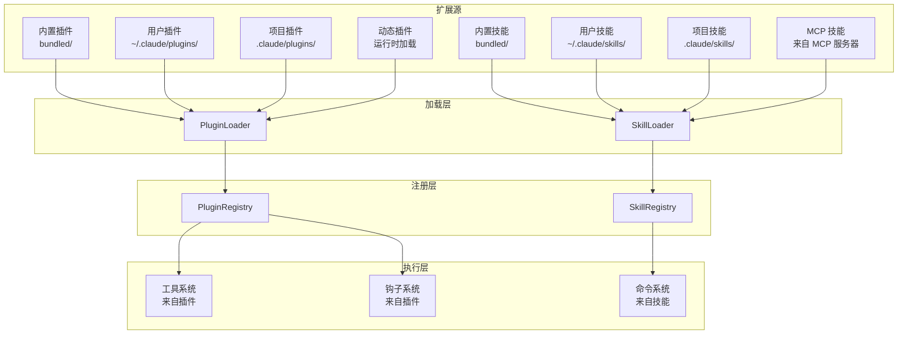
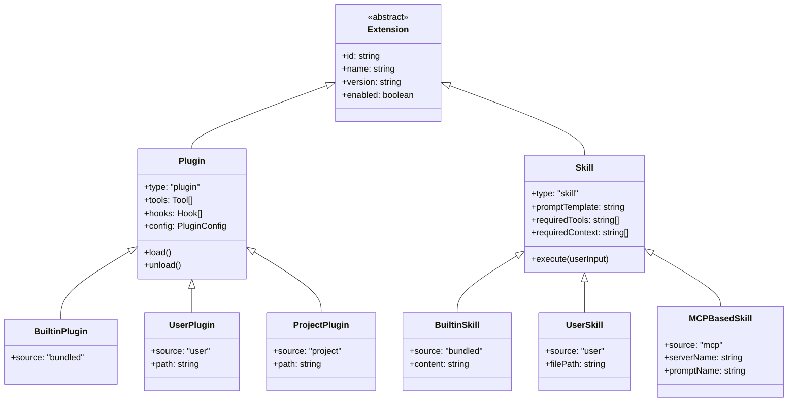
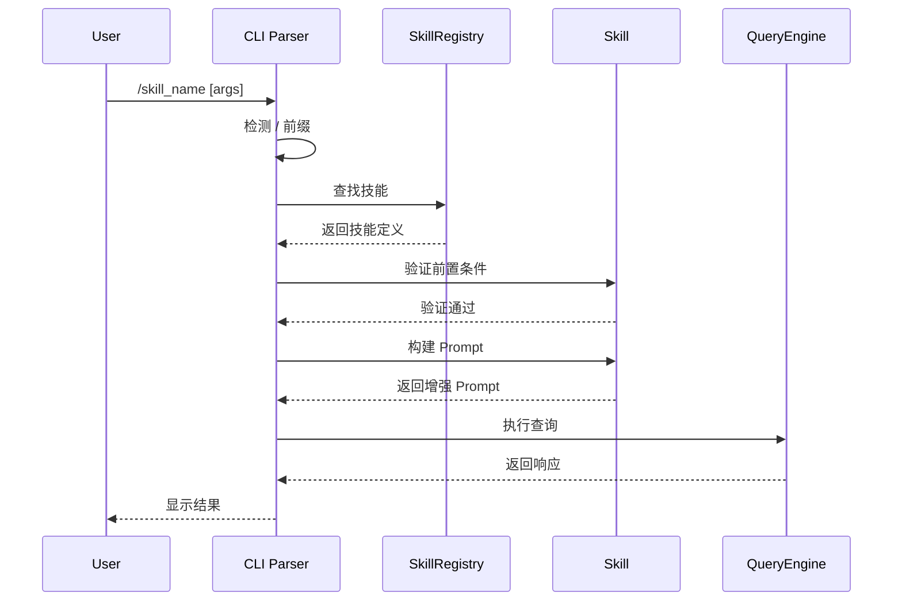

# 第 26 章：插件与技能系统

> 本章目标：深入理解 Claude Code 的可扩展架构，包括插件系统和技能系统，这是实现功能扩展的核心机制。

## 26.1 扩展系统概述

### 26.1.1 设计理念

Claude Code 采用"双轨"扩展架构：
- **插件（Plugins）**：扩展 CLI 的能力（添加新工具、修改配置）
- **技能（Skills）**：扩展 AI 的行为（添加新的交互模式、工作流）

**为什么要区分两者？**

| 特性 | 插件 (Plugins) | 技能 (Skills) |
|------|----------------|---------------|
| **目标** | 扩展 CLI 能力 | 扩展 AI 行为 |
| **执行者** | CLI 程序 | AI Agent |
| **触发方式** | 自动加载 | 用户显式调用 |
| **典型场景** | 添加工具、钩子 | 代码审查、特定工作流 |
| **示例** | Git 集成、LSP 支持 | /commit 技能、/review 技能 |

**作者观点**：这种区分反映了"平台"与"应用"的边界。插件像是在安装"功能扩展包"，而技能更像是"AI 技能培训"。前者关注能力扩展，后者关注行为引导。这种设计让用户可以：
1. **无缝集成**：插件自动在后台工作
2. **意图明确**：技能需要用户明确调用，符合 AI 辅助的预期
3. **职责分离**：工具扩展与行为引导分开管理

### 26.1.2 架构全景



### 26.1.3 插件与技能对比



## 26.2 插件系统

### 26.2.1 插件定义

```typescript
// src/plugins/types.ts
export type PluginType = 'bundled' | 'user' | 'project' | 'dynamic'

export type PluginDefinition = {
  id: string
  name: string
  version: string
  description: string
  author?: string
  type: PluginType

  // 工具定义
  tools?: ToolDefinition[]

  // 钩子定义
  hooks?: HookDefinition[]

  // 配置 Schema
  configSchema?: JSONSchema

  // 依赖
  dependencies?: string[]

  // 生命周期
  onLoad?: () => void | Promise<void>
  onUnload?: () => void | Promise<void>
}

export type ToolDefinition = {
  name: string
  description: string
  inputSchema: JSONSchema
  handler: (params: unknown, context: ToolContext) => Promise<ToolResult>
}

export type HookDefinition = {
  event: HookEvent
  handler: (context: HookContext) => void | Promise<void>
}

export type HookEvent =
  | 'SessionStart'
  | 'SessionEnd'
  | 'UserMessage'
  | 'BeforeToolUse'
  | 'AfterToolUse'
  | 'ResponseComplete'
  | 'BeforeCommand'
  | 'AfterCommand'

export type PluginConfig = Record<string, unknown>

/**
 * 插件实例
 */
export class Plugin {
  private loaded = false

  readonly definition: PluginDefinition
  readonly config: PluginConfig
  readonly tools = new Map<string, Tool>()
  readonly hooks = new Map<HookEvent, Hook[]>()

  constructor(
    definition: PluginDefinition,
    config: PluginConfig = {},
  ) {
    this.definition = definition
    this.config = config
  }

  /**
   * 加载插件
   */
  async load(): Promise<void> {
    if (this.loaded) return

    console.log(`Loading plugin: ${this.definition.id}`)

    // 加载工具
    if (this.definition.tools) {
      for (const toolDef of this.definition.tools) {
        const tool = new DynamicTool(toolDef)
        this.tools.set(tool.name, tool)
      }
    }

    // 加载钩子
    if (this.definition.hooks) {
      for (const hookDef of this.definition.hooks) {
        const hooks = this.hooks.get(hookDef.event) ?? []
        hooks.push(hookDef)
        this.hooks.set(hookDef.event, hooks)
      }
    }

    // 执行加载回调
    if (this.definition.onLoad) {
      await this.definition.onLoad()
    }

    this.loaded = true
    console.log(`Plugin loaded: ${this.definition.id}`)
  }

  /**
   * 卸载插件
   */
  async unload(): Promise<void> {
    if (!this.loaded) return

    console.log(`Unloading plugin: ${this.definition.id}`)

    // 执行卸载回调
    if (this.definition.onUnload) {
      await this.definition.onUnload()
    }

    this.tools.clear()
    this.hooks.clear()

    this.loaded = false
  }

  /**
   * 是否已加载
   */
  isLoaded(): boolean {
    return this.loaded
  }

  /**
   * 是否启用
   */
  isEnabled(): boolean {
    return this.config.enabled !== false
  }

  /**
   * 获取工具
   */
  getTool(name: string): Tool | undefined {
    return this.tools.get(name)
  }

  /**
   * 获取钩子
   */
  getHooks(event: HookEvent): Hook[] {
    return this.hooks.get(event) ?? []
  }
}

/**
 * 动态工具
 * 从插件定义创建的工具
 */
export class DynamicTool implements Tool {
  readonly type = 'plugin'

  constructor(private definition: ToolDefinition) {}

  get name(): string {
    return this.definition.name
  }

  get description(): string {
    return this.definition.description
  }

  get inputSchema(): JSONSchema {
    return this.definition.inputSchema
  }

  async execute(
    params: Record<string, unknown>,
    options: ToolExecuteOptions,
  ): Promise<ToolResult> {
    return this.definition.handler(params, {
      ...options,
      plugin: this,
    })
  }
}
```

### 26.2.2 插件加载器

```typescript
// src/plugins/PluginLoader.ts
export type PluginSource = {
  type: PluginType
  path: string
  priority: number
}

/**
 * 插件加载器
 */
export class PluginLoader {
  private sources = new Map<string, PluginSource>()
  private registry: PluginRegistry

  constructor(registry: PluginRegistry) {
    this.registry = registry
  }

  /**
   * 注册插件源
   */
  registerSource(source: PluginSource): void {
    this.sources.set(source.type, source)
  }

  /**
   * 加载所有插件
   */
  async loadAll(): Promise<void> {
    const loadPromises: Promise<void>[] = []

    // 按优先级排序
    const sortedSources = Array.from(this.sources.values())
      .sort((a, b) => b.priority - a.priority)

    for (const source of sortedSources) {
      loadPromises.push(this.loadFromSource(source))
    }

    await Promise.allSettled(loadPromises)
  }

  /**
   * 从源加载插件
   */
  private async loadFromSource(source: PluginSource): Promise<void> {
    try {
      const plugins = await this.discoverPlugins(source)

      for (const pluginDef of plugins) {
        await this.registry.register(pluginDef)
      }
    } catch (error) {
      console.error(`Failed to load plugins from ${source.type}:`, error)
    }
  }

  /**
   * 发现插件
   */
  private async discoverPlugins(
    source: PluginSource,
  ): Promise<PluginDefinition[]> {
    switch (source.type) {
      case 'bundled':
        return this.loadBuiltinPlugins()

      case 'user':
        return this.loadPluginsFromPath(source.path)

      case 'project':
        return this.loadPluginsFromPath(source.path)

      case 'dynamic':
        return []  // 动态插件按需加载

      default:
        return []
    }
  }

  /**
   * 加载内置插件
   */
  private async loadBuiltinPlugins(): Promise<PluginDefinition[]> {
    const plugins: PluginDefinition[] = []

    // 从内置目录加载
    const builtinPath = join(__dirname, 'bundled', 'plugins')
    const pluginDirs = await this.listPluginDirectories(builtinPath)

    for (const dir of pluginDirs) {
      const defPath = join(dir, 'plugin.json')
      try {
        const content = await fs.readFile(defPath, 'utf-8')
        const def = JSON.parse(content) as PluginDefinition
        def.type = 'bundled'
        plugins.push(def)
      } catch {
        // 跳过无效插件
      }
    }

    return plugins
  }

  /**
   * 从路径加载插件
   */
  private async loadPluginsFromPath(
    path: string,
  ): Promise<PluginDefinition[]> {
    const plugins: PluginDefinition[] = []

    try {
      const exists = await fs.access(path).then(() => true).catch(() => false)
      if (!exists) return plugins

      const pluginDirs = await this.listPluginDirectories(path)

      for (const dir of pluginDirs) {
        const defPath = join(dir, 'plugin.json')
        try {
          const content = await fs.readFile(defPath, 'utf-8')
          const def = JSON.parse(content) as PluginDefinition
          def.type = path.includes('.claude/plugins') ? 'user' : 'project'
          plugins.push(def)
        } catch {
          // 跳过无效插件
        }
      }
    } catch (error) {
      console.error(`Error loading plugins from ${path}:`, error)
    }

    return plugins
  }

  /**
   * 列出插件目录
   */
  private async listPluginDirectories(
    basePath: string,
  ): Promise<string[]> {
    const dirs: string[] = []

    try {
      const entries = await fs.readdir(basePath, { withFileTypes: true })

      for (const entry of entries) {
        if (entry.isDirectory()) {
          const pluginPath = join(basePath, entry.name)
          const defPath = join(pluginPath, 'plugin.json')

          const hasDef = await fs.access(defPath)
            .then(() => true)
            .catch(() => false)

          if (hasDef) {
            dirs.push(pluginPath)
          }
        }
      }
    } catch {
      // 目录不存在
    }

    return dirs
  }
}

/**
 * 插件注册表
 */
export class PluginRegistry {
  private plugins = new Map<string, Plugin>()
  private tools = new Map<string, { tool: Tool; pluginId: string }>()
  private hooks = new Map<HookEvent, Array<{ hook: Hook; pluginId: string }>>()

  /**
   * 注册插件
   */
  async register(definition: PluginDefinition): Promise<void> {
    // 检查是否已存在
    if (this.plugins.has(definition.id)) {
      console.warn(`Plugin already registered: ${definition.id}`)
      return
    }

    // 检查依赖
    if (definition.dependencies) {
      for (const dep of definition.dependencies) {
        if (!this.plugins.has(dep)) {
          throw new Error(`Missing dependency: ${dep}`)
        }
      }
    }

    // 创建插件实例
    const plugin = new Plugin(definition)

    // 加载插件
    await plugin.load()

    // 注册
    this.plugins.set(definition.id, plugin)

    // 注册工具
    for (const [name, tool] of plugin.tools) {
      this.tools.set(name, { tool, pluginId: definition.id })
    }

    // 注册钩子
    for (const [event, hooks] of plugin.hooks) {
      const existing = this.hooks.get(event) ?? []
      for (const hook of hooks) {
        existing.push({ hook, pluginId: definition.id })
      }
      this.hooks.set(event, existing)
    }

    console.log(`Plugin registered: ${definition.id}`)
  }

  /**
   * 注销插件
   */
  async unregister(id: string): Promise<void> {
    const plugin = this.plugins.get(id)
    if (!plugin) return

    // 卸载插件
    await plugin.unload()

    // 移除工具
    for (const [name, entry] of this.tools) {
      if (entry.pluginId === id) {
        this.tools.delete(name)
      }
    }

    // 移除钩子
    for (const [event, hooks] of this.hooks) {
      const filtered = hooks.filter(h => h.pluginId !== id)
      this.hooks.set(event, filtered)
    }

    this.plugins.delete(id)
    console.log(`Plugin unregistered: ${id}`)
  }

  /**
   * 获取插件
   */
  getPlugin(id: string): Plugin | undefined {
    return this.plugins.get(id)
  }

  /**
   * 获取所有插件
   */
  getAllPlugins(): Plugin[] {
    return Array.from(this.plugins.values())
  }

  /**
   * 获取工具
   */
  getTool(name: string): Tool | undefined {
    return this.tools.get(name)?.tool
  }

  /**
   * 获取钩子
   */
  getHooks(event: HookEvent): Hook[] {
    const hooks = this.hooks.get(event) ?? []
    return hooks.map(h => h.hook)
  }
}
```

## 26.3 技能系统

### 26.3.1 技能定义

```typescript
// src/skills/types.ts
export type SkillSource = 'bundled' | 'user' | 'project' | 'mcp'

export type SkillDefinition = {
  id: string
  name: string
  version: string
  description: string
  author?: string
  source: SkillSource

  // 技能内容
  promptTemplate: string

  // 前置条件
  requiredTools?: string[]
  requiredContext?: string[]
  requiredPermissions?: Permission[]

  // 配置
  config?: SkillConfig

  // 元数据
  examples?: SkillExample[]
  category?: string
  tags?: string[]
}

export type SkillConfig = {
  model?: string
  temperature?: number
  maxTokens?: number
  tools?: string[]
}

export type SkillExample = {
  input: string
  output: string
  description?: string
}

/**
 * 技能实例
 */
export class Skill {
  readonly definition: SkillDefinition

  constructor(definition: SkillDefinition) {
    this.definition = definition
  }

  /**
   * 构建 Prompt
   */
  buildPrompt(userInput: string, context: RequestContext): string {
    let prompt = this.definition.promptTemplate

    // 替换变量
    prompt = prompt.replace(/\{\{user_input\}\}/g, userInput)
    prompt = prompt.replace(/\{\{cwd\}\}/g, context.cwd)
    prompt = prompt.replace(/\{\{platform\}\}/g, context.platform)

    return prompt
  }

  /**
   * 验证前置条件
   */
  validate(context: RequestContext): { valid: boolean; errors: string[] } {
    const errors: string[] = []

    // 检查工具可用性
    if (this.definition.requiredTools) {
      for (const tool of this.definition.requiredTools) {
        if (!context.hasTool(tool)) {
          errors.push(`Missing required tool: ${tool}`)
        }
      }
    }

    // 检查上下文
    if (this.definition.requiredContext) {
      for (const key of this.definition.requiredContext) {
        if (!(key in context)) {
          errors.push(`Missing required context: ${key}`)
        }
      }
    }

    // 检查权限
    if (this.definition.requiredPermissions) {
      for (const perm of this.definition.requiredPermissions) {
        if (!context.hasPermission(perm)) {
          errors.push(`Missing required permission: ${perm}`)
        }
      }
    }

    return {
      valid: errors.length === 0,
      errors,
    }
  }

  /**
   * 获取配置
   */
  getConfig(): SkillConfig {
    return this.definition.config ?? {}
  }

  /**
   * 获取 ID
   */
  get id(): string {
    return this.definition.id
  }

  /**
   * 获取名称
   */
  get name(): string {
    return this.definition.name
  }

  /**
   * 获取描述
   */
  get description(): string {
    return this.definition.description
  }
}
```

### 26.3.2 技能加载器

```typescript
// src/skills/SkillLoader.ts
export type SkillSourceConfig = {
  type: SkillSource
  path: string
  priority: number
}

/**
 * 技能加载器
 */
export class SkillLoader {
  private sources = new Map<SkillSource, SkillSourceConfig>()
  private registry: SkillRegistry

  constructor(registry: SkillRegistry) {
    this.registry = registry
  }

  /**
   * 注册技能源
   */
  registerSource(config: SkillSourceConfig): void {
    this.sources.set(config.type, config)
  }

  /**
   * 加载所有技能
   */
  async loadAll(): Promise<void> {
    const loadPromises: Promise<void>[] = []

    for (const source of this.sources.values()) {
      loadPromises.push(this.loadFromSource(source))
    }

    await Promise.allSettled(loadPromises)
  }

  /**
   * 从源加载技能
   */
  private async loadFromSource(source: SkillSourceConfig): Promise<void> {
    try {
      const skills = await this.discoverSkills(source)

      for (const skillDef of skills) {
        await this.registry.register(skillDef)
      }
    } catch (error) {
      console.error(`Failed to load skills from ${source.type}:`, error)
    }
  }

  /**
   * 发现技能
   */
  private async discoverSkills(
    source: SkillSourceConfig,
  ): Promise<SkillDefinition[]> {
    switch (source.type) {
      case 'bundled':
        return this.loadBuiltinSkills()

      case 'user':
        return this.loadSkillsFromPath(source.path, 'user')

      case 'project':
        return this.loadSkillsFromPath(source.path, 'project')

      case 'mcp':
        return []  // MCP 技能动态加载

      default:
        return []
    }
  }

  /**
   * 加载内置技能
   */
  private async loadBuiltinSkills(): Promise<SkillDefinition[]> {
    const skills: SkillDefinition[] = []

    // 这里直接返回内置技能定义
    skills.push(
      {
        id: 'commit',
        name: 'commit',
        version: '1.0.0',
        description: 'Help create a git commit',
        source: 'bundled',
        promptTemplate: BUILTIN_SKILLS.commit,
        requiredTools: ['Bash', 'Read'],
        category: 'git',
      },
      {
        id: 'review',
        name: 'review',
        version: '1.0.0',
        description: 'Review code changes',
        source: 'bundled',
        promptTemplate: BUILTIN_SKILLS.review,
        requiredTools: ['Read', 'Grep', 'GitDiff'],
        category: 'code',
      },
      // ... 更多内置技能
    )

    return skills
  }

  /**
   * 从路径加载技能
   */
  private async loadSkillsFromPath(
    path: string,
    sourceType: 'user' | 'project',
  ): Promise<SkillDefinition[]> {
    const skills: SkillDefinition[] = []

    try {
      const exists = await fs.access(path).then(() => true).catch(() => false)
      if (!exists) return skills

      const files = await fs.readdir(path)

      for (const file of files) {
        if (!file.endsWith('.md')) continue

        const filePath = join(path, file)
        const content = await fs.readFile(filePath, 'utf-8')

        const skillDef = this.parseSkillFile(content, sourceType, filePath)
        if (skillDef) {
          skills.push(skillDef)
        }
      }
    } catch (error) {
      console.error(`Error loading skills from ${path}:`, error)
    }

    return skills
  }

  /**
   * 解析技能文件
   */
  private parseSkillFile(
    content: string,
    source: SkillSource,
    filePath: string,
  ): SkillDefinition | null {
    // 解析 Frontmatter
    const frontmatterMatch = content.match(/^---\n([\s\S]+?)\n---/)
    if (!frontmatterMatch) return null

    let frontmatter: Record<string, unknown>
    try {
      frontmatter = parseYaml(frontmatterMatch[1])
    } catch {
      return null
    }

    const promptTemplate = content.slice(frontmatterMatch[0].length).trim()

    return {
      id: frontmatter.id || basename(filePath, '.md'),
      name: frontmatter.name || frontmatter.id || basename(filePath, '.md'),
      version: frontmatter.version || '1.0.0',
      description: frontmatter.description || '',
      author: frontmatter.author as string | undefined,
      source,
      promptTemplate,
      requiredTools: frontmatter.requiredTools as string[] | undefined,
      requiredContext: frontmatter.requiredContext as string[] | undefined,
      requiredPermissions: frontmatter.requiredPermissions as Permission[] | undefined,
      config: frontmatter.config as SkillConfig | undefined,
      examples: frontmatter.examples as SkillExample[] | undefined,
      category: frontmatter.category as string | undefined,
      tags: frontmatter.tags as string[] | undefined,
    }
  }
}

/**
 * 技能注册表
 */
export class SkillRegistry {
  private skills = new Map<string, Skill>()
  private aliases = new Map<string, string>()  // 名称别名

  /**
   * 注册技能
   */
  async register(definition: SkillDefinition): Promise<void> {
    // 检查是否已存在
    if (this.skills.has(definition.id)) {
      // 更新现有技能
      this.skills.delete(definition.id)
    }

    const skill = new Skill(definition)
    this.skills.set(definition.id, skill)

    // 注册别名
    this.aliases.set(definition.name.toLowerCase(), definition.id)

    // 注册标签
    if (definition.tags) {
      for (const tag of definition.tags) {
        this.aliases.set(tag.toLowerCase(), definition.id)
      }
    }

    console.log(`Skill registered: ${definition.id}`)
  }

  /**
   * 获取技能
   */
  getSkill(idOrName: string): Skill | undefined {
    // 直接 ID 查找
    if (this.skills.has(idOrName)) {
      return this.skills.get(idOrName)
    }

    // 别名查找
    const id = this.aliases.get(idOrName.toLowerCase())
    return id ? this.skills.get(id) : undefined
  }

  /**
   * 搜索技能
   */
  searchSkills(query: string): Skill[] {
    const lowerQuery = query.toLowerCase()

    return Array.from(this.skills.values()).filter(skill => {
      return (
        skill.name.toLowerCase().includes(lowerQuery) ||
        skill.description.toLowerCase().includes(lowerQuery) ||
        skill.definition.tags?.some(t => t.toLowerCase().includes(lowerQuery))
      )
    })
  }

  /**
   * 按分类获取技能
   */
  getSkillsByCategory(category: string): Skill[] {
    return Array.from(this.skills.values()).filter(
      skill => skill.definition.category === category
    )
  }

  /**
   * 获取所有技能
   */
  getAllSkills(): Skill[] {
    return Array.from(this.skills.values())
  }
}

// 内置技能内容
const BUILTIN_SKILLS = {
  commit: `You are helping the user create a git commit.

## Instructions

1. Ask the user for a summary of their changes
2. Run git diff to see what has changed
3. Run git status to see staged files
4. Generate a commit message following conventional commits format
5. Show the commit message to the user and ask for confirmation
6. If confirmed, run git commit with the message

## Commit Message Format

<type>(<scope>): <description>

[optional body]

[optional footer]

Types: feat, fix, docs, style, refactor, test, chore`,

  review: `You are reviewing code changes.

## Instructions

1. Get the diff of changes using git diff
2. Analyze the changes for:
   - Bugs and potential issues
   - Security concerns
   - Performance implications
   - Code style and best practices
   - Missing error handling
3. Provide constructive feedback organized by severity
4. Suggest specific improvements with code examples when appropriate

## Review Categories

- **Critical**: Bugs, security issues, crashes
- **Important**: Performance, logic errors, edge cases
- **Minor**: Style, naming, documentation
- **Suggestions**: Potential improvements`,
}
```

## 26.4 命令系统与技能

### 26.4.1 技能命令



```typescript
// src/skills/SkillCommand.ts
import type { Command } from '../types/command.js'

export type SkillCommandConfig = {
  skillId: string
  name: string
  description: string
  aliases?: string[]
  args?: CommandArgDef[]
}

export type CommandArgDef = {
  name: string
  description: string
  required?: boolean
  default?: string
}

/**
 * 技能命令
 * 将技能转换为可执行的命令
 */
export class SkillCommand implements Command {
  readonly type = 'skill' as const
  readonly name: string
  readonly description: string
  readonly userInvocable = true
  readonly isHidden = false
  readonly progressMessage: string

  private skill: Skill
  private aliases: string[]

  constructor(
    config: SkillCommandConfig,
    private skillRegistry: SkillRegistry,
  ) {
    this.name = config.name
    this.description = config.description
    this.progressMessage = config.name
    this.aliases = config.aliases ?? []

    const skill = skillRegistry.getSkill(config.skillId)
    if (!skill) {
      throw new Error(`Skill not found: ${config.skillId}`)
    }
    this.skill = skill
  }

  /**
   * 执行命令
   */
  async handler(context: CommandContext): Promise<void> {
    const { args, getAppState, setAppState } = context

    // 验证前置条件
    const validation = this.skill.validate({
      cwd: process.cwd(),
      platform: process.platform,
      hasTool: (tool) => context.hasTool(tool),
      hasPermission: (perm) => context.hasPermission(perm),
    } as RequestContext)

    if (!validation.valid) {
      throw new Error(
        `Skill prerequisites not met:\n${validation.errors.join('\n')}`
      )
    }

    // 构建 Prompt
    const userInput = args.join(' ') || this.skill.description
    const enhancedPrompt = this.skill.buildPrompt(userInput, {
      cwd: process.cwd(),
      platform: process.platform,
    })

    // 获取 QueryEngine 并执行
    const queryEngine = getQueryEngine()
    const response = await queryEngine.query(enhancedPrompt, {
      maxTurns: 5,
      stream: true,
    })

    // 输出响应
    context.setOutput(response.responseText)
  }

  /**
   * 获取别名
   */
  getAliases(): string[] {
    return this.aliases
  }
}

/**
 * 技能命令管理器
 */
export class SkillCommandManager {
  private commands = new Map<string, SkillCommand>()

  constructor(
    private skillRegistry: SkillRegistry,
    private commandRegistry: CommandRegistry,
  ) {}

  /**
   * 注册技能命令
   */
  registerCommand(config: SkillCommandConfig): void {
    const command = new SkillCommand(config, this.skillRegistry)

    // 注册主命令
    this.commandRegistry.register(command.name, command)
    this.commands.set(command.name, command)

    // 注册别名
    for (const alias of command.getAliases()) {
      this.commandRegistry.register(alias, command)
    }
  }

  /**
   * 自动发现并注册技能命令
   */
  async autoRegister(): Promise<void> {
    const skills = this.skillRegistry.getAllSkills()

    for (const skill of skills) {
      // 生成命令名称
      const commandName = skill.id

      this.registerCommand({
        skillId: skill.id,
        name: commandName,
        description: skill.description,
        aliases: this.generateAliases(skill),
      })
    }

    console.log(`Registered ${this.commands.size} skill commands`)
  }

  /**
   * 生成别名
   */
  private generateAliases(skill: Skill): string[] {
    const aliases: string[] = []

    // 使用名称作为别名
    if (skill.name !== skill.id) {
      aliases.push(skill.name)
    }

    // 使用标签作为别名
    if (skill.definition.tags) {
      for (const tag of skill.definition.tags) {
        if (tag.length <= 10) {  // 避免太长的别名
          aliases.push(tag)
        }
      }
    }

    return aliases
  }
}
```

## 26.5 MCP 技能

### 26.5.1 从 MCP 加载技能

```typescript
// src/skills/MCPSkills.ts
/**
 * MCP 技能加载器
 * 从 MCP 服务器加载 prompt 模板作为技能
 */
export class MCP skillLoader {
  constructor(
    private mcpManager: MCPManager,
    private skillRegistry: SkillRegistry,
  ) {}

  /**
   * 从 MCP 服务器加载技能
   */
  async loadFromServer(serverName: string): Promise<void> {
    const client = this.mcpManager.getClient(serverName)
    if (!client) {
      console.warn(`MCP server not found: ${serverName}`)
      return
    }

    try {
      const prompts = await client.listPrompts()

      for (const prompt of prompts) {
        const skillDef: SkillDefinition = {
          id: `${serverName}:${prompt.name}`,
          name: prompt.name,
          version: '1.0.0',
          description: prompt.description || '',
          source: 'mcp',
          promptTemplate: await this.fetchPromptTemplate(client, prompt.name),
          category: 'mcp',
          tags: [serverName],
        }

        await this.skillRegistry.register(skillDef)
      }

      console.log(`Loaded ${prompts.length} skills from MCP server: ${serverName}`)
    } catch (error) {
      console.error(`Failed to load skills from ${serverName}:`, error)
    }
  }

  /**
   * 获取 Prompt 模板
   */
  private async fetchPromptTemplate(
    client: MCPClient,
    promptName: string,
  ): Promise<string> {
    try {
      return await client.getPrompt(promptName)
    } catch {
      // 如果无法获取，返回默认模板
      return `Execute the ${promptName} prompt.`
    }
  }

  /**
   * 监听 MCP 服务器变化
   */
  watchForChanges(): void {
    this.mcpManager.on('serverConnected', async (serverName: string) => {
      await this.loadFromServer(serverName)
    })

    this.mcpManager.on('promptsChanged', async (serverName: string) => {
      await this.loadFromServer(serverName)
    })
  }
}
```

## 26.6 可复用模式总结

### 模式 38：插件架构

**描述：** 允许第三方扩展核心功能的架构模式。

**适用场景：**
- IDE 扩展系统
- CLI 工具扩展
- 应用插件系统

**代码模板：**

```typescript
// 1. 插件接口
export interface Plugin<TConfig = unknown> {
  id: string
  name: string
  version: string
  load(config: TConfig): Promise<void>
  unload(): Promise<void>
}

// 2. 插件管理器
export class PluginManager<TConfig = unknown> {
  private plugins = new Map<string, Plugin<TConfig>>()
  private configs = new Map<string, TConfig>()

  async load(plugin: Plugin<TConfig>, config?: TConfig): Promise<void> {
    if (this.plugins.has(plugin.id)) {
      throw new Error(`Plugin already loaded: ${plugin.id}`)
    }

    await plugin.load(config ?? ({} as TConfig))

    this.plugins.set(plugin.id, plugin)
    if (config) {
      this.configs.set(plugin.id, config)
    }
  }

  async unload(id: string): Promise<void> {
    const plugin = this.plugins.get(id)
    if (!plugin) return

    await plugin.unload()
    this.plugins.delete(id)
    this.configs.delete(id)
  }

  get<T extends Plugin>(id: string): T | undefined {
    return this.plugins.get(id) as T
  }

  isLoaded(id: string): boolean {
    return this.plugins.has(id)
  }

  list(): Plugin<TConfig>[] {
    return Array.from(this.plugins.values())
  }
}

// 3. 使用示例
const manager = new PluginManager()

await manager.load({
  id: 'my-plugin',
  name: 'My Plugin',
  version: '1.0.0',
  async load(config) {
    console.log('Loading plugin...')
    // 初始化逻辑
  },
  async unload() {
    console.log('Unloading plugin...')
    // 清理逻辑
  },
})
```

**关键点：**
1. 清晰的插件接口
2. 生命周期管理
3. 配置管理
4. 错误隔离

### 模式 39：技能模板

**描述：** 可复用的 Prompt 模板系统。

**适用场景：**
- AI 工作流自动化
- 标准化操作
- 复杂任务引导

**代码模板：**

```typescript
export type SkillTemplate = {
  id: string
  name: string
  description: string
  template: string
  variables: TemplateVariable[]
  examples?: TemplateExample[]
}

export type TemplateVariable = {
  name: string
  description: string
  required: boolean
  default?: string
}

export type TemplateExample = {
  input: Record<string, unknown>
  output: string
}

export class SkillEngine {
  private templates = new Map<string, SkillTemplate>()

  register(template: SkillTemplate): void {
    this.templates.set(template.id, template)
  }

  render(
    id: string,
    variables: Record<string, unknown>,
  ): string {
    const template = this.templates.get(id)
    if (!template) {
      throw new Error(`Template not found: ${id}`)
    }

    // 验证必需变量
    for (const v of template.variables) {
      if (v.required && !(v.name in variables)) {
        throw new Error(`Missing required variable: ${v.name}`)
      }
    }

    // 渲染模板
    let result = template.template

    for (const v of template.variables) {
      const value = variables[v.name] ?? v.default ?? ''
      const regex = new RegExp(`\\{\\{${v.name}\\}\\}`, 'g')
      result = result.replace(regex, String(value))
    }

    return result
  }

  validate(
    id: string,
    variables: Record<string, unknown>,
  ): { valid: boolean; errors: string[] } {
    const template = this.templates.get(id)
    if (!template) {
      return { valid: false, errors: [`Template not found: ${id}`] }
    }

    const errors: string[] = []

    for (const v of template.variables) {
      if (v.required && !(v.name in variables)) {
        errors.push(`Missing required variable: ${v.name}`)
      }
    }

    return {
      valid: errors.length === 0,
      errors,
    }
  }
}

// 使用示例
const engine = new SkillEngine()

engine.register({
  id: 'code-review',
  name: 'Code Review',
  description: 'Review code changes',
  template: `Review the following code changes:

Files changed:
{{files}}

Focus on:
- Security issues
- Performance concerns
- Code quality

Provide feedback in the following format:
- **Critical**: ...
- **Important**: ...
- **Minor**: ...
`,
  variables: [
    { name: 'files', description: 'List of changed files', required: true },
  ],
})

const prompt = engine.render('code-review', {
  files: '- src/utils.ts: Added new function\n- src/index.ts: Updated imports',
})
```

**关键点：**
1. 模板变量系统
2. 变量验证
3. 示例支持
4. 复用性设计

---

## 本章小结

本章深入分析了插件与技能系统的实现：

1. **扩展系统概述**：双轨架构、插件与技能的区别
2. **插件系统**：插件定义、加载器、注册表、生命周期
3. **技能系统**：技能定义、Frontmatter 解析、技能加载
4. **命令集成**：技能命令、自动发现、别名系统
5. **MCP 技能**：从 MCP 服务器加载技能
6. **可复用模式**：插件架构、技能模板

**设计亮点：**
- 插件和技能的分离实现了清晰的职责划分
- Frontmatter 解析使得技能定义既人类可读又机器可解析
- MCP 技能集成实现了动态技能扩展
- 命令系统让技能可以通过统一的 CLI 接口调用

**作者观点**：Claude Code 的扩展系统设计精妙。它既保持了核心的简洁性，又通过插件和技能提供了无限的扩展可能。这种设计让用户可以：
1. **无缝集成**：插件在后台工作，用户无感知
2. **意图明确**：技能需要用户明确调用，符合 AI 辅助的预期
3. **社区贡献**：第三方可以轻松发布插件和技能

随着生态的发展，我们可以期待更多创新插件和技能的出现。

## 下一章预告

第 27 章将深入分析配置迁移系统，探讨如何管理版本升级和配置变更。
