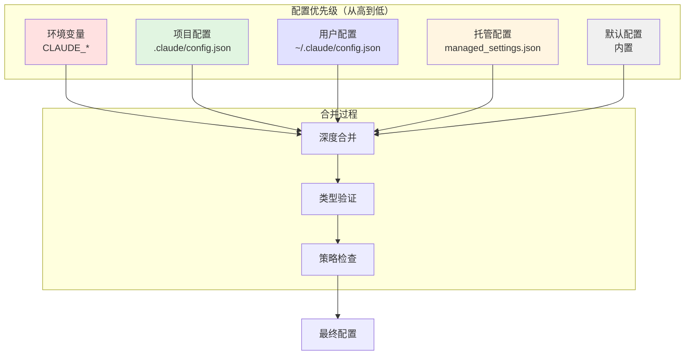
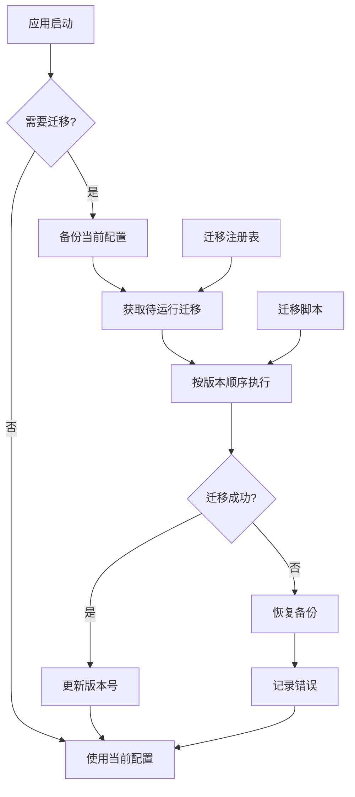

# 第 27 章：配置与迁移系统

> 本章目标：深入理解 Claude Code 的配置管理和版本迁移机制，这是确保用户体验连续性的关键系统。

## 27.1 配置系统架构

### 27.1.1 设计意图

配置系统是任何 CLI 工具的"记忆中枢"——它记住了用户的偏好、历史和定制设置。Claude Code 的配置设计面临以下挑战：

**挑战一：多层配置**
- 用户可能在不同层级设置配置（全局、项目、环境变量）
- 需要明确的优先级规则
- 配置冲突需要可预测的解决方式

**挑战二：版本演进**
- 配置格式随版本变化
- 新增字段需要默认值
- 废弃字段需要迁移或警告

**挑战三：远程同步**
- 企业环境需要托管配置
- 多设备需要配置同步
- 策略限制需要强制执行

**作者观点**：Claude Code 的配置系统采用了"分层优先级 + 声明式迁移"的设计。这种设计借鉴了：
- **Git 配置模型**：`local < global < system` 的优先级
- **Kubernetes ConfigMap**：声明式配置 + 滚动更新
- **数据库迁移**：版本化的迁移脚本

结果是用户可以：
1. **无痛升级**：配置自动迁移到新格式
2. **灵活定制**：在任意层级覆盖配置
3. **策略可控**：企业管理员可以限制配置

### 27.1.2 配置层级



### 27.1.3 配置文件路径

```typescript
// src/utils/settings/paths.ts
import { homedir } from 'os'
import { join } from 'path'

/**
 * 获取 Claude 配置主目录
 */
export function getClaudeConfigHomeDir(): string {
  // 1. 检查环境变量
  if (process.env.CLAUDE_CONFIG_HOME) {
    return process.env.CLAUDE_CONFIG_HOME
  }

  // 2. 检查 XDG 规范
  if (process.env.XDG_CONFIG_HOME) {
    return join(process.env.XDG_CONFIG_HOME, 'claude')
  }

  // 3. 使用默认位置
  const platform = process.platform

  switch (platform) {
    case 'win32':
      return join(process.env.LOCALAPPDATA || join(homedir(), 'AppData', 'Local'), 'claude-code')

    case 'darwin':
      return join(homedir(), 'Library', 'Application Support', 'claude-code')

    default:  // linux, etc.
      return join(homedir(), '.config', 'claude-code')
  }
}

/**
 * 获取托管配置文件路径
 * 用于企业策略管理
 */
export function getManagedSettingsPath(): string {
  if (process.env.CLAUDE_CODE_MANAGED_CONFIG_FILE) {
    return process.env.CLAUDE_CODE_MANAGED_CONFIG_FILE
  }

  return join(getClaudeConfigHomeDir(), 'managed_settings.json')
}

/**
 * 获取用户配置路径
 */
export function getUserSettingsPath(): string {
  if (process.env.CLAUDE_CODE_USER_SETTINGS) {
    return process.env.CLAUDE_CODE_USER_SETTINGS
  }

  return join(getClaudeConfigHomeDir(), 'settings.json')
}

/**
 * 获取项目配置路径
 */
export function getProjectSettingsPath(cwd: string): string {
  if (process.env.CLAUDE_CODE_PROJECT_SETTINGS) {
    return process.env.CLAUDE_CODE_PROJECT_SETTINGS
  }

  return join(cwd, '.claude', 'config.json')
}

/**
 * 获取插件目录
 */
export function getPluginsDir(type: 'user' | 'project'): string {
  const base = type === 'user'
    ? getClaudeConfigHomeDir()
    : process.cwd()

  return join(base, type === 'user' ? 'plugins' : '.claude', 'plugins')
}

/**
 * 获取技能目录
 */
export function getSkillsDir(type: 'user' | 'project'): string {
  const base = type === 'user'
    ? getClaudeConfigHomeDir()
    : process.cwd()

  return join(base, type === 'user' ? 'skills' : '.claude', 'skills')
}

/**
 * 获取状态文件路径
 */
export function getStateFilePath(): string {
  return join(getClaudeConfigHomeDir(), 'state.json')
}

/**
 * 获取历史文件路径
 */
export function getHistoryFilePath(): string {
  return join(getClaudeConfigHomeDir(), 'history.jsonl')
}
```

## 27.2 Schema 验证系统

### 27.2.1 Zod 集成

```typescript
// src/schemas/settings.ts
import { z } from 'zod'

/**
 * 钩子配置 Schema
 */
export const HooksSchema = (): z.ZodType<HooksSettings> =>
  z.object({
    // 会话开始前钩子
    SessionStart: z.array(z.string()).optional(),

    // 会话结束后钩子
    SessionEnd: z.array(z.string()).optional(),

    // 用户消息前钩子
    UserMessage: z.array(z.string()).optional(),

    // 工具使用前钩子
    BeforeToolUse: z.array(z.string()).optional(),

    // 工具使用后钩子
    AfterToolUse: z.array(z.string()).optional(),

    // 响应完成后钩子
    ResponseComplete: z.array(z.string()).optional(),

    // 命令执行前钩子
    BeforeCommand: z.array(z.string()).optional(),

    // 命令执行后钩子
    AfterCommand: z.array(z.string()).optional(),
  })

export type HooksSettings = z.infer<typeof HooksSchema>

/**
 * Agent 配置 Schema
 */
export const AgentConfigSchema = (): z.ZodType<AgentConfig> =>
  z.object({
    model: z.string().optional(),
    temperature: z.number().min(0).max(1).optional(),
    maxTokens: z.number().int().positive().optional(),
    tools: z.array(z.string()).optional(),
    permissions: z.array(z.string()).optional(),
  })

export type AgentConfig = z.infer<typeof AgentConfigSchema>

/**
 * 权限规则 Schema
 */
export const PermissionRuleSchema = (): z.ZodType<PermissionRule> =>
  z.object({
    pattern: z.string(),
    approve: z.boolean(),
    description: z.string().optional(),
  })

export type PermissionRule = z.infer<typeof PermissionRuleSchema>

/**
 * MCP 服务器配置 Schema
 */
export const MCPServerConfigSchema = (): z.ZodType<MCPServerConfig> =>
  z.object({
    transport: z.enum(['stdio', 'sse', 'http']),
    command: z.string().optional(),
    args: z.array(z.string()).optional(),
    url: z.string().optional(),
    env: z.record(z.string()).optional(),
    enabled: z.boolean().optional(),
  })

export type MCPServerConfig = z.infer<typeof MCPServerConfigSchema>

/**
 * 主配置 Schema
 */
export const UserSettingsSchema = z.object({
  // ========== 模型配置 ==========
  model: z.string().optional(),
  temperature: z.number().min(0).max(1).optional(),
  maxTokens: z.number().int().positive().optional(),

  // ========== 权限配置 ==========
  permissionMode: z.enum(['default', 'plan', 'bypassPermissions', 'auto']).optional(),
  autoApproveRules: z.record(z.string(), PermissionRuleSchema()).optional(),

  // ========== UI 配置 ==========
  colorScheme: z.enum(['dark', 'light', 'daltonized']).optional(),
  inline: z.boolean().optional(),
  diffFormat: z.enum(['unified', 'split']).optional(),
  showLineNumbers: z.boolean().optional(),

  // ========== Agent 配置 ==========
  agentConfig: z.record(z.string(), AgentConfigSchema()).optional(),

  // ========== 插件配置 ==========
  enabledPlugins: z.record(z.string(), z.boolean()).optional(),

  // ========== MCP 配置 ==========
  mcpServers: z.record(z.string(), MCPServerConfigSchema()).optional(),

  // ========== 技能配置 ==========
  enabledSkills: z.record(z.string(), z.boolean()).optional(),

  // ========== 钩子配置 ==========
  hooks: HooksSchema().optional(),

  // ========== 高级配置 ==========
  customInstructions: z.string().optional(),
  promptPath: z.string().optional(),
  remoteTimeout: z.number().int().positive().optional(),
})

export type UserSettings = z.infer<typeof UserSettingsSchema>

/**
 * 验证配置对象
 */
export function validateSettings(
  settings: unknown,
): { success: true; data: UserSettings } | { success: false; error: string } {
  const result = UserSettingsSchema.safeParse(settings)

  if (result.success) {
    return { success: true, data: result.data }
  }

  // 格式化错误信息
  const errorMessages = result.error.errors.map(
    err => `${err.path.join('.')}: ${err.message}`
  )

  return {
    success: false,
    error: `Configuration validation failed:\n${errorMessages.join('\n')}`,
  }
}

/**
 * 验证配置文件
 */
export async function validateSettingsFile(
  filePath: string,
): Promise<{ success: true; data: UserSettings } | { success: false; error: string }> {
  try {
    const content = await fs.readFile(filePath, 'utf-8')
    const parsed = JSON.parse(content)
    return validateSettings(parsed)
  } catch (error) {
    if (error instanceof SyntaxError) {
      return {
        success: false,
        error: `Invalid JSON in ${filePath}: ${error.message}`,
      }
    }
    return {
      success: false,
      error: `Failed to read ${filePath}: ${error}`,
    }
  }
}
```

### 27.2.2 配置合并

```typescript
// src/utils/settings/merge.ts
import type { UserSettings } from './types.js'

/**
 * 深度合并两个对象
 */
function deepMerge<T>(target: T, source: Partial<T>): T {
  const result = { ...target }

  for (const key in source) {
    const sourceValue = source[key]
    const targetValue = result[key]

    if (
      sourceValue &&
      typeof sourceValue === 'object' &&
      !Array.isArray(sourceValue) &&
      targetValue &&
      typeof targetValue === 'object' &&
      !Array.isArray(targetValue)
    ) {
      result[key] = deepMerge(targetValue, sourceValue)
    } else {
      result[key] = sourceValue as T[Extract<keyof T, string>]
    }
  }

  return result
}

/**
 * 合并多个配置源
 * 优先级：项目 > 用户 > 托管 > 默认
 */
export function mergeSettings(
  sources: {
    policySettings?: Partial<UserSettings>
    userSettings?: Partial<UserSettings>
    projectSettings?: Partial<UserSettings>
    defaultSettings: Partial<UserSettings>
    envSettings?: Partial<UserSettings>
  },
): UserSettings {
  // 从低到高合并
  let merged: UserSettings = {
    ...sources.defaultSettings,
  }

  // 托管配置（策略）
  if (sources.policySettings) {
    merged = deepMerge(merged, sources.policySettings)
  }

  // 用户配置
  if (sources.userSettings) {
    merged = deepMerge(merged, sources.userSettings)
  }

  // 项目配置
  if (sources.projectSettings) {
    merged = deepMerge(merged, sources.projectSettings)
  }

  // 环境变量（最高优先级）
  if (sources.envSettings) {
    merged = deepMerge(merged, sources.envSettings)
  }

  return merged
}

/**
 * 从环境变量加载配置
 */
export function loadSettingsFromEnv(): Partial<UserSettings> {
  const settings: Partial<UserSettings> = {}

  // 模型配置
  if (process.env.CLAUDE_MODEL) {
    settings.model = process.env.CLAUDE_MODEL
  }

  if (process.env.CLAUDE_TEMPERATURE) {
    const temp = parseFloat(process.env.CLAUDE_TEMPERATURE)
    if (!isNaN(temp) && temp >= 0 && temp <= 1) {
      settings.temperature = temp
    }
  }

  if (process.env.CLAUDE_MAX_TOKENS) {
    const tokens = parseInt(process.env.CLAUDE_MAX_TOKENS, 10)
    if (!isNaN(tokens) && tokens > 0) {
      settings.maxTokens = tokens
    }
  }

  // UI 配置
  if (process.env.CLAUDE_COLOR_SCHEME) {
    const scheme = process.env.CLAUDE_COLOR_SCHEME
    if (['dark', 'light', 'daltonized'].includes(scheme)) {
      settings.colorScheme = scheme as 'dark' | 'light' | 'daltonized'
    }
  }

  if (process.env.CLAUDE_INLINE) {
    settings.inline = process.env.CLAUDE_INLINE === 'true'
  }

  // API Key
  if (process.env.ANTHROPIC_API_KEY) {
    // API Key 不存储在配置中，而是在运行时使用
  }

  // 权限模式
  if (process.env.CLAUDE_PERMISSION_MODE) {
    const mode = process.env.CLAUDE_PERMISSION_MODE
    if (['default', 'plan', 'bypassPermissions', 'auto'].includes(mode)) {
      settings.permissionMode = mode as any
    }
  }

  return settings
}

/**
 * 配置源类型
 */
export type SettingSource =
  | 'policySettings'    // 托管/策略配置
  | 'userSettings'      // 用户配置
  | 'projectSettings'   // 项目配置
  | 'envSettings'       // 环境变量
  | 'defaultSettings'   // 默认配置

/**
 * 检查配置源是否启用
 */
export function isSettingSourceEnabled(
  source: SettingSource,
): boolean {
  switch (source) {
    case 'policySettings':
      return !isEnvTruthy(process.env.CLAUDE_CODE_DISABLE_POLICY_SETTINGS)

    case 'userSettings':
      return !isEnvTruthy(process.env.CLAUDE_CODE_DISABLE_USER_SETTINGS)

    case 'projectSettings':
      return !isEnvTruthy(process.env.CLAUDE_CODE_DISABLE_PROJECT_SETTINGS)

    case 'envSettings':
      return true  // 环境变量始终启用

    case 'defaultSettings':
      return true  // 默认配置始终启用
  }
}

function isEnvTruthy(value: string | undefined): boolean {
  return value === '1' || value === 'true' || value === 'yes'
}
```

## 27.3 迁移系统

### 27.3.1 迁移架构



### 27.3.2 迁移脚本

```typescript
// src/migrations/migrateSonnet45ToSonnet46.ts
import type { UserSettings } from '../utils/settings/types.js'

/**
 * 迁移 ID
 * 用于跟踪已运行的迁移
 */
export const MIGRATION_ID = 'migrate_sonnet_45_to_sonnet_46'

/**
 * 迁移版本
 * 应该是语义化版本，用于排序
 */
export const MIGRATION_VERSION = '1.2.0'

/**
 * 迁移描述
 */
export const MIGRATION_DESCRIPTION = 'Update model references from Sonnet 4.5 to Sonnet 4.6'

/**
 * 检查迁移是否需要运行
 */
export function shouldMigrate(settings: UserSettings): boolean {
  // 检查模型配置是否使用旧版本
  const model = settings.model

  const oldModels = [
    'claude-sonnet-4.5',
    'sonnet-4.5',
    'claude-3-5-sonnet-20241022',
  ]

  if (model && oldModels.some(old => model.includes(old))) {
    return true
  }

  // 检查 Agent 配置
  if (settings.agentConfig) {
    for (const agent of Object.values(settings.agentConfig)) {
      if (agent.model && oldModels.some(old => agent.model?.includes(old))) {
        return true
      }
    }
  }

  return false
}

/**
 * 执行迁移
 */
export async function migrate(settings: UserSettings): Promise<UserSettings> {
  const migrated = { ...settings }

  // 模型映射
  const modelMap: Record<string, string> = {
    'claude-sonnet-4.5': 'claude-sonnet-4-20250514',
    'sonnet-4.5': 'claude-sonnet-4-20250514',
    'claude-3-5-sonnet-20241022': 'claude-sonnet-4-20250514',
  }

  // 更新主模型
  if (migrated.model && modelMap[migrated.model]) {
    console.log(`Migrating model: ${migrated.model} -> ${modelMap[migrated.model]}`)
    migrated.model = modelMap[migrated.model]
  }

  // 更新 Agent 配置
  if (migrated.agentConfig) {
    for (const [name, agent] of Object.entries(migrated.agentConfig)) {
      if (agent.model && modelMap[agent.model]) {
        console.log(`Migrating agent ${name} model: ${agent.model} -> ${modelMap[agent.model]}`)
        agent.model = modelMap[agent.model]
      }
    }
  }

  return migrated
}

/**
 * 回滚迁移（可选）
 */
export async function rollback(settings: UserSettings): Promise<UserSettings> {
  const rolledBack = { ...settings }

  // 反向映射
  const reverseMap: Record<string, string> = {
    'claude-sonnet-4-20250514': 'claude-sonnet-4.5',
  }

  if (rolledBack.model && reverseMap[rolledBack.model]) {
    rolledBack.model = reverseMap[rolledBack.model]
  }

  return rolledBack
}
```

### 27.3.3 迁移注册表

```typescript
// src/migrations/registry.ts
export type Migration = {
  id: string
  version: string
  description: string
  check: (settings: unknown) => boolean
  migrate: (settings: unknown) => Promise<unknown>
  rollback?: (settings: unknown) => Promise<unknown>
}

/**
 * 迁移运行器
 */
export class MigrationRunner {
  private migrations: Migration[] = []
  private completed = new Set<string>()

  /**
   * 注册迁移
   */
  register(migration: Migration): void {
    // 检查 ID 是否重复
    if (this.migrations.some(m => m.id === migration.id)) {
      throw new Error(`Migration already registered: ${migration.id}`)
    }

    this.migrations.push(migration)

    // 按版本排序
    this.migrations.sort((a, b) => a.version.localeCompare(b.version, undefined, { numeric: true }))
  }

  /**
   * 批量注册迁移
   */
  registerAll(migrations: Migration[]): void {
    for (const migration of migrations) {
      this.register(migration)
    }
  }

  /**
   * 运行待执行的迁移
   */
  async run(settings: unknown): Promise<unknown> {
    let current = settings
    let hasChanges = false

    for (const migration of this.migrations) {
      // 跳过已完成的迁移
      if (this.completed.has(migration.id)) {
        continue
      }

      // 检查是否需要迁移
      if (!migration.check(current)) {
        continue
      }

      console.log(`Running migration: ${migration.id} - ${migration.description}`)

      try {
        const previous = current
        current = await migration.migrate(current)
        this.completed.add(migration.id)
        hasChanges = true

        console.log(`Migration ${migration.id} completed`)
      } catch (error) {
        console.error(`Migration ${migration.id} failed:`, error)

        // 决定是否继续
        // 这里选择继续执行其他迁移
        // 也可以选择抛出错误停止整个迁移过程
      }
    }

    return current
  }

  /**
   * 标记迁移为已完成
   */
  markCompleted(id: string): void {
    this.completed.add(id)
  }

  /**
   * 检查迁移是否已完成
   */
  isCompleted(id: string): boolean {
    return this.completed.has(id)
  }

  /**
   * 获取已完成的迁移列表
   */
  getCompletedMigrations(): string[] {
    return Array.from(this.completed)
  }

  /**
   * 清除已完成记录
   */
  clear(): void {
    this.completed.clear()
  }

  /**
   * 获取待执行的迁移列表
   */
  getPendingMigrations(settings: unknown): Migration[] {
    return this.migrations.filter(m =>
      !this.completed.has(m.id) && m.check(settings)
    )
  }
}

/**
 * 创建全局迁移运行器
 */
export function createMigrationRunner(): MigrationRunner {
  const runner = new MigrationRunner()

  // 注册所有迁移
  // 这里动态导入避免循环依赖
  runner.registerAll([
    // ... 导入所有迁移
  ])

  return runner
}
```

### 27.3.4 配置版本管理

```typescript
// src/migrations/version.ts
export type ConfigVersion = {
  major: number
  minor: number
  patch: number
}

export type ConfigMetadata = {
  version: ConfigVersion
  migrations: string[]  // 已运行的迁移 ID
  lastMigratedAt: number
}

const CURRENT_VERSION: ConfigVersion = {
  major: 1,
  minor: 5,
  patch: 0,
}

/**
 * 配置版本管理器
 */
export class ConfigVersionManager {
  /**
   * 获取当前版本
   */
  getCurrentVersion(): ConfigVersion {
    return { ...CURRENT_VERSION }
  }

  /**
   * 比较版本
   */
  compareVersions(a: ConfigVersion, b: ConfigVersion): number {
    if (a.major !== b.major) return a.major - b.major
    if (a.minor !== b.minor) return a.minor - b.minor
    return a.patch - b.patch
  }

  /**
   * 版本字符串解析
   */
  parseVersion(versionString: string): ConfigVersion | null {
    const match = versionString.match(/^(\d+)\.(\d+)\.(\d+)$/)
    if (!match) return null

    return {
      major: parseInt(match[1], 10),
      minor: parseInt(match[2], 10),
      patch: parseInt(match[3], 10),
    }
  }

  /**
   * 版本转字符串
   */
  versionToString(version: ConfigVersion): string {
    return `${version.major}.${version.minor}.${version.patch}`
  }

  /**
   * 添加版本字段到配置
   */
  addVersionField(settings: Record<string, unknown>): Record<string, unknown> {
    return {
      ...settings,
      _configVersion: this.versionToString(CURRENT_VERSION),
    }
  }

  /**
   * 获取配置中的版本
   */
  getVersionFromConfig(settings: Record<string, unknown>): ConfigVersion | null {
    const versionString = settings._configVersion as string | undefined

    if (!versionString) {
      return null  // 配置没有版本信息
    }

    return this.parseVersion(versionString)
  }

  /**
   * 检查是否需要迁移
   */
  needsMigration(settings: Record<string, unknown>): boolean {
    const configVersion = this.getVersionFromConfig(settings)

    if (!configVersion) {
      return true  // 没有版本信息，需要迁移
    }

    return this.compareVersions(CURRENT_VERSION, configVersion) > 0
  }
}
```

## 27.4 配置同步

### 27.4.1 远程配置同步

```typescript
// src/services/settings/sync.ts
export type SyncResult<T> =
  | { success: true; data: T }
  | { success: false; error: string }

export type SyncConfig = {
  apiBaseUrl: string
  apikey: string
  enabledFeatures: string[]
  syncInterval: number
}

/**
 * 远程配置同步器
 */
export class RemoteSettingsSync {
  private lastSync = 0
  private syncTimer: NodeJS.Timeout | null = null

  constructor(
    private config: SyncConfig,
    private localPath: string,
  ) {}

  /**
   * 从远程获取托管配置
   */
  async fetchManagedSettings(): Promise<SyncResult<UserSettings>> {
    try {
      const response = await fetch(
        `${this.config.apiBaseUrl}/v1/settings/managed`,
        {
          headers: {
            'Authorization': `Bearer ${this.config.apikey}`,
            'Content-Type': 'application/json',
          },
        }
      )

      if (!response.ok) {
        return {
          success: false,
          error: `HTTP ${response.status}: ${response.statusText}`,
        }
      }

      const data = await response.json()

      // 验证配置
      const validation = validateSettings(data)
      if (!validation.success) {
        return {
          success: false,
          error: `Invalid settings from server: ${validation.error}`,
        }
      }

      return { success: true, data: validation.data }
    } catch (error) {
      return {
        success: false,
        error: error instanceof Error ? error.message : String(error),
      }
    }
  }

  /**
   * 上传用户配置到远程
   */
  async uploadUserSettings(
    settings: UserSettings,
  ): Promise<SyncResult<void>> {
    try {
      const response = await fetch(
        `${this.config.apiBaseUrl}/v1/settings/user`,
        {
          method: 'POST',
          headers: {
            'Authorization': `Bearer ${this.config.apikey}`,
            'Content-Type': 'application/json',
          },
          body: JSON.stringify(settings),
        }
      )

      if (!response.ok) {
        return {
          success: false,
          error: `HTTP ${response.status}: ${response.statusText}`,
        }
      }

      return { success: true, data: undefined }
    } catch (error) {
      return {
        success: false,
        error: error instanceof Error ? error.message : String(error),
      }
    }
  }

  /**
   * 双向同步
   */
  async sync(localSettings: UserSettings): Promise<SyncResult<UserSettings>> {
    // 1. 获取远程配置
    const remoteResult = await this.fetchManagedSettings()

    if (!remoteResult.success) {
      return {
        success: false,
        error: `Failed to fetch remote settings: ${remoteResult.error}`,
      }
    }

    const remoteSettings = remoteResult.data

    // 2. 合并配置
    // 远程托管配置作为基础，本地可覆盖特定字段
    const merged = mergeSettings({
      policySettings: remoteSettings,
      userSettings: localSettings,
      defaultSettings: {},
    })

    // 3. 上传合并后的配置
    const uploadResult = await this.uploadUserSettings(merged)

    if (!uploadResult.success) {
      return {
        success: false,
        error: `Failed to upload settings: ${uploadResult.error}`,
      }
    }

    this.lastSync = Date.now()

    return { success: true, data: merged }
  }

  /**
   * 启动自动同步
   */
  startAutoSync(): void {
    if (this.syncTimer) return

    this.syncTimer = setInterval(async () => {
      const now = Date.now()
      const elapsed = now - this.lastSync

      if (elapsed >= this.config.syncInterval) {
        console.log('Auto-syncing settings...')
        // 执行同步
      }
    }, this.config.syncInterval)
  }

  /**
   * 停止自动同步
   */
  stopAutoSync(): void {
    if (this.syncTimer) {
      clearInterval(this.syncTimer)
      this.syncTimer = null
    }
  }
}
```

### 27.4.2 策略限制

```typescript
// src/utils/settings/policy.ts
export type PolicyRestriction = {
  key: string
  reason: string
  allowedValues?: unknown[]
  pattern?: RegExp
}

const RESTRICTED_SETTINGS = new Set<string>([
  'skills',
  'plugins',
  'mcpServers',
  'autoApproveRules.dangerous',
  'permissions.bypass',
])

const POLICY_RESTRICTIONS: Record<string, PolicyRestriction> = {
  model: {
    key: 'model',
    reason: 'Model selection is managed by organization policy',
    allowedValues: ['claude-opus-4-20250514', 'claude-sonnet-4-20250514'],
  },
  temperature: {
    key: 'temperature',
    reason: 'Temperature must be between 0 and 0.7 for compliance',
    pattern: /^(0(\.[0-7])?|0\.[7])$/,
  },
  maxTokens: {
    key: 'maxTokens',
    reason: 'Token limit is capped at 8000 for cost control',
    pattern: /^([1-7]\d{3}|8000)$/,
  },
}

/**
 * 策略管理器
 */
export class PolicyManager {
  private restrictions: Map<string, PolicyRestriction>

  constructor() {
    this.restrictions = new Map()

    for (const [key, restriction] of Object.entries(POLICY_RESTRICTIONS)) {
      this.restrictions.set(key, restriction)
    }
  }

  /**
   * 检查设置是否受限
   */
  isRestricted(key: string): boolean {
    return RESTRICTED_SETTINGS.has(key) || this.restrictions.has(key)
  }

  /**
   * 获取限制信息
   */
  getRestriction(key: string): PolicyRestriction | undefined {
    return this.restrictions.get(key)
  }

  /**
   * 验证设置值是否符合策略
   */
  validate(key: string, value: unknown): { valid: boolean; reason?: string } {
    const restriction = this.restrictions.get(key)

    if (!restriction) {
      return { valid: true }
    }

    // 检查允许的值
    if (restriction.allowedValues) {
      if (!restriction.allowedValues.includes(value as never)) {
        return {
          valid: false,
          reason: `${restriction.reason}. Allowed values: ${restriction.allowedValues.join(', ')}`,
        }
      }
    }

    // 检查模式
    if (restriction.pattern) {
      if (typeof value === 'string' && !restriction.pattern.test(value)) {
        return {
          valid: false,
          reason: `${restriction.reason}. Must match pattern: ${restriction.pattern}`,
        }
      }
    }

    return { valid: true }
  }

  /**
   * 过滤受限设置
   */
  filterRestricted(settings: Record<string, unknown>): Record<string, unknown> {
    const filtered: Record<string, unknown> = {}

    for (const [key, value] of Object.entries(settings)) {
      if (this.isRestricted(key)) {
        console.warn(`Skipping restricted setting: ${key}`)
        continue
      }

      filtered[key] = value
    }

    return filtered
  }

  /**
   * 检查是否处于仅插件模式
   */
  isPluginOnlyMode(): boolean {
    return isEnvTruthy(process.env.CLAUDE_CODE_PLUGIN_ONLY_MODE)
  }
}

function isEnvTruthy(value: string | undefined): boolean {
  return value === '1' || value === 'true' || value === 'yes'
}
```

## 27.5 配置 UI

### 27.5.1 配置命令

```typescript
// src/commands/config/index.ts
import type { Command } from '../../types/command.js'

export const configCommand: Command = {
  type: 'local',
  name: 'config',
  description: 'Manage Claude Code configuration',
  userInvocable: true,
  isHidden: false,
  progressMessage: 'config',

  async handler(context) {
    const { args, getAppState, setAppState } = context

    if (args.length === 0) {
      return showConfigMenu(context)
    }

    const subCommand = args[0]

    switch (subCommand) {
      case 'get':
        return configGet(args.slice(1))
      case 'set':
        return configSet(args.slice(1))
      case 'unset':
        return configUnset(args.slice(1))
      case 'list':
        return configList()
      case 'edit':
        return configEdit()
      case 'path':
        return configPath()
      default:
        return showConfigHelp()
    }
  },
}

async function configGet(keys: string[]): Promise<void> {
  const settings = await loadUserSettings()

  if (keys.length === 0) {
    console.log(JSON.stringify(settings, null, 2))
    return
  }

  let value: unknown = settings

  for (const key of keys) {
    if (value && typeof value === 'object' && key in value) {
      value = (value as Record<string, unknown>)[key]
    } else {
      console.log(`Key not found: ${keys.join('.')}`)
      return
    }
  }

  console.log(JSON.stringify(value, null, 2))
}

async function configSet(args: string[]): Promise<void> {
  if (args.length < 2) {
    console.log('Usage: config set <key> <value>')
    return
  }

  const key = args[0]
  const value = parseValue(args.slice(1).join(' '))

  const settings = await loadUserSettings()
  setNestedValue(settings, key, value)

  await saveUserSettings(settings)
  console.log(`Set ${key} = ${JSON.stringify(value)}`)
}

async function configUnset(keys: string[]): Promise<void> {
  if (keys.length === 0) {
    console.log('Usage: config unset <key>')
    return
  }

  const settings = await loadUserSettings()
  deleteNestedValue(settings, keys.join('.'))

  await saveUserSettings(settings)
  console.log(`Unset ${keys.join('.')}`)
}

async function configList(): Promise<void> {
  const settings = await loadUserSettings()

  for (const [key, value] of Object.entries(settings)) {
    console.log(`${key} = ${JSON.stringify(value)}`)
  }
}

async function configEdit(): Promise<void> {
  const editor = process.env.EDITOR || 'vim'
  const path = getUserSettingsPath()

  await execAsync(`${editor} "${path}"`)

  // 重新加载配置
  await reloadSettings()
}

function configPath(): void {
  console.log(`User config: ${getUserSettingsPath()}`)
  console.log(`Project config: ${getProjectSettingsPath(process.cwd())}`)
  console.log(`Managed config: ${getManagedSettingsPath()}`)
}

function parseValue(str: string): unknown {
  // 尝试解析为 JSON
  try {
    return JSON.parse(str)
  } catch {
    // 作为字符串返回
    return str
  }
}

function setNestedValue(obj: Record<string, unknown>, path: string, value: unknown): void {
  const keys = path.split('.')
  let current: Record<string, unknown> = obj

  for (let i = 0; i < keys.length - 1; i++) {
    const key = keys[i]
    if (!(key in current)) {
      current[key] = {}
    }
    current = current[key] as Record<string, unknown>
  }

  current[keys[keys.length - 1]] = value
}

function deleteNestedValue(obj: Record<string, unknown>, path: string): void {
  const keys = path.split('.')
  let current: Record<string, unknown> = obj

  for (let i = 0; i < keys.length - 1; i++) {
    const key = keys[i]
    if (!(key in current)) {
      return  // 路径不存在
    }
    current = current[key] as Record<string, unknown>
  }

  delete current[keys[keys.length - 1]]
}
```

## 27.6 可复用模式总结

### 模式 36：分层配置模式

**描述：** 多层配置覆盖系统。

**适用场景：**
- CLI 工具配置
- 应用程序设置
- 多环境配置

**代码模板：**

```typescript
type ConfigLayer<T> = {
  name: string
  priority: number
  load: () => Promise<Partial<T>>
}

class LayeredConfig<T> {
  private layers: ConfigLayer<T>[] = []

  addLayer(layer: ConfigLayer<T>): void {
    this.layers.push(layer)
    // 按优先级排序
    this.layers.sort((a, b) => b.priority - a.priority)
  }

  async load(): Promise<T> {
    // 从低优先级到高优先级合并
    const sorted = [...this.layers].sort((a, b) => a.priority - b.priority)

    let merged: any = {}

    for (const layer of sorted) {
      const config = await layer.load()
      merged = { ...merged, ...config }
    }

    return merged
  }
}

// 使用示例
const config = new LayeredConfig<UserSettings>()

config.addLayer({
  name: 'defaults',
  priority: 0,
  load: async () => defaultSettings,
})

config.addLayer({
  name: 'user',
  priority: 1,
  load: async () => loadJSON(getUserSettingsPath()),
})

config.addLayer({
  name: 'project',
  priority: 2,
  load: async () => loadJSON(getProjectSettingsPath()),
})

config.addLayer({
  name: 'env',
  priority: 3,
  load: async () => loadSettingsFromEnv(),
})
```

**关键点：**
1. 优先级数字越小，优先级越低
2. 深度合并对象
3. 高优先级覆盖低优先级
4. 异步加载支持

### 模式 37：版本迁移模式

**描述：** 数据库/配置版本迁移系统。

**适用场景：**
- 配置文件迁移
- 数据库 schema 迁移
- API 版本升级

**代码模板：**

```typescript
type Migration<T> = {
  id: string
  version: string
  check: (data: T) => boolean
  migrate: (data: T) => Promise<T>
}

class MigrationRunner<T> {
  private migrations: Migration<T>[] = []

  register(migration: Migration<T>): void {
    this.migrations.push(migration)
    // 按版本排序
    this.migrations.sort((a, b) =>
      a.version.localeCompare(b.version, undefined, { numeric: true })
    )
  }

  async run(data: T): Promise<T> {
    let current = data

    for (const migration of this.migrations) {
      if (!migration.check(current)) continue

      console.log(`Running migration: ${migration.id}`)
      current = await migration.migrate(current)
    }

    return current
  }
}
```

**关键点：**
1. 每个迁移有唯一的 ID
2. 版本号用于排序
3. check 函数判断是否需要迁移
4. 迁移按版本顺序执行

---

## 本章小结

本章深入分析了配置与迁移系统的实现：

1. **配置系统**：分层配置、优先级处理、配置源类型
2. **Schema 验证**：Zod 集成、类型安全、错误格式化
3. **迁移系统**：迁移脚本、注册表、版本跟踪
4. **配置同步**：远程配置、托管策略、限制模式
5. **配置 UI**：/config 命令、交互式编辑器
6. **可复用模式**：分层配置模式、版本迁移模式

**设计亮点：**
- 分层配置实现了灵活性和可预测性的平衡
- Zod Schema 确保了类型安全和友好的错误信息
- 版本化迁移系统确保了无痛升级
- 策略系统支持企业管理需求

**作者观点**：配置系统是最容易被忽视但最影响用户体验的部分。一个好的配置系统应该：
1. **可预测**：用户知道配置从哪里来，优先级如何
2. **安全**：迁移失败不应该破坏现有配置
3. **透明**：用户可以知道当前配置的实际值
4. **可扩展**：支持未来的新配置项

Claude Code 的配置系统在这些方面做得相当不错。

## 下一章预告

第 28 章将深入分析服务层与外部集成，包括 API 服务、OAuth 认证、LSP 集成、遥测系统等。
