# 第 28 章：服务层与外部集成

> 本章目标：深入理解 Claude Code 的服务层架构，包括 API 服务、OAuth 认证、LSP 集成、遥测系统等外部服务集成。

## 28.1 服务层架构

### 28.1.1 设计意图

服务层（Service Layer）是 Claude Code 与外部世界交互的边界。它封装了所有对外部系统的调用，包括：

**外部服务类型：**
- **API 服务**：Anthropic API、文件上传 API
- **认证服务**：OAuth、Token 管理
- **语言服务**：LSP 客户端
- **分析服务**：GrowthBook、Datadog
- **同步服务**：KAIROS、Team Memory

**为什么需要服务层？**

1. **关注点分离**：核心逻辑不需要关心网络细节
2. **可测试性**：可以 mock 服务进行单元测试
3. **错误处理**：统一的错误处理和重试逻辑
4. **可替换性**：可以切换不同的服务提供商

**作者观点**：服务层的设计体现了"防腐层"（Anti-Corruption Layer）模式。外部服务的 API 设计往往不受我们控制，通过服务层，我们可以：
- 将外部 API 转换为内部友好的接口
- 隔离外部 API 的变化
- 添加额外的逻辑（缓存、重试、降级）

### 28.1.2 服务组织

```mermaid
graph TB
    subgraph "服务层 (src/services/)"
        direction TB

        subgraph "API 服务"
            A1[claude.ts - 模型 API]
            A2[bootstrap.ts - 启动配置]
            A3[filesApi.ts - 文件上传]
            A4[usage.ts - 用量跟踪]
        end

        subgraph "认证服务"
            B1[client.ts - OAuth 客户端]
            B2[auth-code-listener.ts - 回调监听]
            B3[crypto.ts - 加密工具]
        end

        subgraph "LSP 服务"
            C1[manager.ts - 服务器管理]
            C2[LSPClient.ts - 客户端]
            C3[config.ts - LSP 配置]
        end

        subgraph "分析服务"
            D1[growthbook.ts - 特性标志]
            D2[datadog.ts - 日志收集]
            D3[config.ts - 分析配置]
        end

        subgraph "同步服务"
            E1[kairos/ - 定时任务]
            E2[teamMemory/ - 团队记忆]
            E3[magicDocs/ - 智能文档]
        end
    end

    subgraph "核心系统"
        CORE[QueryEngine, 工具系统, 命令系统]
    end

    CORE --> A1
    CORE --> B1
    CORE --> C2
    CORE --> D1
    CORE --> E1

    style A1 fill:#e1f5e1
    style B1 fill:#ffe1e1
    style C2 fill:#e1e1ff
    style D1 fill:#fff5e1
    style E1 fill:#f0e1ff
```



### 28.1.3 服务设计原则

```typescript
// src/services/types.ts
/**
 * 服务接口
 * 所有服务应实现此接口
 */
export interface Service {
  /**
   * 服务名称
   */
  readonly name: string

  /**
   * 是否已初始化
   */
  isInitialized(): boolean

  /**
   * 初始化服务
   */
  initialize(): Promise<void>

  /**
   * 重启服务
   */
  restart?(): Promise<void>

  /**
   * 销毁服务
   */
  dispose(): Promise<void>

  /**
   * 健康检查
   */
  healthCheck?(): Promise<boolean>
}

/**
 * 服务配置
 */
export type ServiceConfig = {
  enabled: boolean
  timeout?: number
  retry?: number
  fallback?: ServiceConfig
}

/**
 * 服务错误
 */
export class ServiceError extends Error {
  constructor(
    public serviceName: string,
    public originalError: unknown,
    message?: string,
  ) {
    super(message ?? `Service error: ${serviceName}`)
    this.name = 'ServiceError'
  }
}
```

## 28.2 API 服务

### 28.2.1 Anthropic API 客户端

```typescript
// src/services/api/claude.ts
import Anthropic from '@anthropic-ai/sdk'

export type ClaudeApiConfig = {
  apiKey: string
  baseUrl?: string
  maxRetries?: number
  timeout?: number
  version?: string
}

export type StreamOptions = {
  onProgress?: (delta: string) => void
  onComplete?: (message: Message) => void
  onError?: (error: Error) => void
}

/**
 * Claude API 包装器
 * 提供统一的 API 调用接口
 */
export class ClaudeApiClient {
  private client: Anthropic
  private config: ClaudeApiConfig

  constructor(config: ClaudeApiConfig) {
    this.config = config
    this.client = new Anthropic({
      apiKey: config.apiKey,
      baseURL: config.baseUrl,
      maxRetries: config.maxRetries ?? 3,
      timeout: config.timeout ?? 600000,  // 默认 10 分钟
      defaultHeaders: {
        'anthropic-version': config.version ?? '2023-06-01',
      },
    })
  }

  /**
   * 创建消息（流式）
   */
  async *createMessageStream(
    params: MessagesCreateParams,
  ): AsyncGenerator<string, void, unknown> {
    const stream = await this.client.messages.create(params, {
      onProgress: (delta) => {
        // 处理进度更新（如果需要）
      },
    })

    // 处理流式响应
    for await (const event of stream) {
      switch (event.type) {
        case 'content_block_delta':
          if (event.delta.type === 'text_delta') {
            yield event.delta.text
          }
          break

        case 'message_stop':
          return

        case 'error':
          throw new Error(event.error.message)
      }
    }
  }

  /**
   * 创建消息（非流式）
   */
  async createMessage(
    params: MessagesCreateParams,
  ): Promise<Message> {
    return await this.client.messages.create(params)
  }

  /**
   * 计算令牌数
   */
  async countTokens(params: {
    model: string
    prompt: string
  }): Promise<number> {
    return await this.client.messages.count_tokens(params)
  }

  /**
   * 流式响应包装
   */
  async streamResponse(
    params: MessagesCreateParams,
    options?: StreamOptions,
  ): Promise<string> {
    let fullResponse = ''

    for await (const delta of this.createMessageStream(params)) {
      fullResponse += delta
      options?.onProgress?.(delta)
    }

    options?.onComplete?.({} as Message)

    return fullResponse
  }
}

/**
 * 全局客户端实例
 */
let globalClient: ClaudeApiClient | null = null

export function getClaudeClient(): ClaudeApiClient {
  if (!globalClient) {
    const apiKey = process.env.ANTHROPIC_API_KEY
    if (!apiKey) {
      throw new Error('ANTHROPIC_API_KEY not set')
    }

    globalClient = new ClaudeApiClient({
      apiKey,
      baseUrl: process.env.ANTHROPIC_BASE_URL,
    })
  }

  return globalClient
}

export function resetClaudeClient(): void {
  globalClient = null
}
```

### 28.2.2 重试机制

```typescript
// src/services/api/retry.ts
export type RetryOptions = {
  maxRetries?: number
  initialDelayMs?: number
  maxDelayMs?: number
  backoffMultiplier?: number
  retryableErrors?: Array<(error: unknown) => boolean>
  signal?: AbortSignal
}

export type RetryResult<T> = {
  data: T
  attempts: number
  totalDelayMs: number
}

/**
 * 带重试的异步执行
 */
export async function withRetry<T>(
  fn: () => Promise<T>,
  options: RetryOptions = {},
): Promise<RetryResult<T>> {
  const {
    maxRetries = 3,
    initialDelayMs = 1000,
    maxDelayMs = 30000,
    backoffMultiplier = 2,
    retryableErrors = [],
    signal,
  } = options

  let lastError: unknown
  let delay = initialDelayMs
  let totalDelayMs = 0
  let attempts = 0

  for (let attempt = 0; attempt <= maxRetries; attempt++) {
    attempts = attempt + 1

    // 检查中止信号
    if (signal?.aborted) {
      throw new Error('Operation aborted')
    }

    try {
      const data = await fn()
      return { data, attempts, totalDelayMs }
    } catch (error) {
      lastError = error

      // 检查是否可重试
      const isRetryable =
        attempt < maxRetries &&
        (isNetworkError(error) ||
          isRetryableHTTPError(error) ||
          retryableErrors.some(check => check(error)))

      if (!isRetryable) {
        throw error
      }

      // 等待后重试
      await sleep(delay)
      totalDelayMs += delay

      // 计算下次延迟（指数退避）
      delay = Math.min(delay * backoffMultiplier, maxDelayMs)
    }
  }

  throw lastError
}

/**
 * 判断是否为网络错误
 */
function isNetworkError(error: unknown): boolean {
  if (error instanceof TypeError) {
    // 网络错误通常抛出 TypeError
    return true
  }

  if (error instanceof Error) {
    const message = error.message.toLowerCase()
    return (
      message.includes('econnrefused') ||
      message.includes('etimedout') ||
      message.includes('enotfound') ||
      message.includes('econnreset') ||
      message.includes('socket hang up')
    )
  }

  return false
}

/**
 * 判断是否为可重试的 HTTP 错误
 */
function isRetryableHTTPError(error: unknown): boolean {
  if (!isHTTPError(error)) {
    return false
  }

  const status = (error as HTTPError).status

  // 可重试的状态码
  return (
    status === 408 ||  // Request Timeout
    status === 429 ||  // Too Many Requests
    status === 500 ||  // Internal Server Error
    status === 502 ||  // Bad Gateway
    status === 503 ||  // Service Unavailable
    status === 504     // Gateway Timeout
  )
}

function isHTTPError(error: unknown): boolean {
  return (
    error !== null &&
    typeof error === 'object' &&
    'status' in error &&
    typeof (error as HTTPError).status === 'number'
  )
}

type HTTPError = { status: number }

function sleep(ms: number): Promise<void> {
  return new Promise(resolve => setTimeout(resolve, ms))
}
```

### 28.2.3 文件上传 API

```typescript
// src/services/api/files.ts
export type FileUploadOptions = {
  fileName: string
  contentType: string
  content: Buffer | string
}

export type FileUploadResult = {
  id: string
  fileName: string
  size: number
  contentType: string
  url: string
  createdAt: string
}

export type FileUploadError = {
  error: string
  code?: string
  details?: unknown
}

/**
 * 文件上传服务
 */
export class FileUploadService {
  constructor(
    private apiKey: string,
    private baseUrl: string = 'https://api.anthropic.com',
  ) {}

  /**
   * 上传文件
   */
  async uploadFile(
    options: FileUploadOptions,
  ): Promise<FileUploadResult> {
    const formData = new FormData()

    // 创建 Blob
    const blob = new Blob(
      [typeof options.content === 'string'
        ? options.content
        : options.content],
      { type: options.contentType }
    )

    formData.append('file', blob, options.fileName)

    const response = await fetch(`${this.baseUrl}/v1/files`, {
      method: 'POST',
      headers: {
        'Authorization': `Bearer ${this.apiKey}`,
        // 不设置 Content-Type，让浏览器自动处理 multipart/form-data
      },
      body: formData,
    })

    if (!response.ok) {
      const error = await response.json() as FileUploadError
      throw new Error(`File upload failed: ${error.error}`)
    }

    return await response.json() as FileUploadResult
  }

  /**
   * 获取文件
   */
  async getFile(fileId: string): Promise<FileUploadResult> {
    const response = await fetch(`${this.baseUrl}/v1/files/${fileId}`, {
      method: 'GET',
      headers: {
        'Authorization': `Bearer ${this.apiKey}`,
      },
    })

    if (!response.ok) {
      throw new Error(`Failed to get file: ${response.status}`)
    }

    return await response.json() as FileUploadResult
  }

  /**
   * 删除文件
   */
  async deleteFile(fileId: string): Promise<void> {
    const response = await fetch(`${this.baseUrl}/v1/files/${fileId}`, {
      method: 'DELETE',
      headers: {
        'Authorization': `Bearer ${this.apiKey}`,
      },
    })

    if (!response.ok) {
      throw new Error(`Failed to delete file: ${response.status}`)
    }
  }

  /**
   * 列出文件
   */
  async listFiles(limit = 20): Promise<FileUploadResult[]> {
    const response = await fetch(
      `${this.baseUrl}/v1/files?limit=${limit}`,
      {
        method: 'GET',
        headers: {
          'Authorization': `Bearer ${this.apiKey}`,
        },
      }
    )

    if (!response.ok) {
      throw new Error(`Failed to list files: ${response.status}`)
    }

    const data = await response.json() as { data: FileUploadResult[] }
    return data.data
  }
}
```

## 28.3 OAuth 服务

### 28.3.1 OAuth 客户端

```typescript
// src/services/oauth/client.ts
export type OAuthConfig = {
  clientId: string
  authUrl: string
  tokenUrl: string
  scopes: string[]
  redirectPort: number
}

export type TokenResponse = {
  access_token: string
  refresh_token?: string
  expires_in?: number
  token_type?: string
}

export type OAuthSession = {
  state: string
  verifier: string
  challenge: string
  createdAt: number
}

/**
 * OAuth 2.0 客户端
 * 使用 PKCE (Proof Key for Code Exchange)
 */
export class OAuthClient {
  private server: Server | null = null
  private authCodePromise: Promise<string> | null = null
  private currentSession: OAuthSession | null = null

  constructor(private config: OAuthConfig) {}

  /**
   * 生成代码验证器和挑战
   */
  private generatePKCE(): { verifier: string; challenge: string } {
    // 代码验证器 (43-128 个字符)
    const verifier = this.generateRandomString(32)
      .replace(/=/g, '')
      .replace(/\+/g, '-')
      .replace(/\//g, '_')

    // 代码挑战 (SHA256 哈希)
    const challenge = this.base64URLEncode(
      crypto.createHash('sha256').update(verifier).digest()
    )

    return { verifier, challenge }
  }

  /**
   * 生成随机字符串
   */
  private generateRandomString(length: number): string {
    return randomBytes(length)
      .toString('base64')
  }

  /**
   * Base64 URL 编码
   */
  private base64URLEncode(buffer: Buffer): string {
    return buffer.toString('base64url')
  }

  /**
   * 启动本地回调服务器
   */
  private startCallbackServer(): Promise<string> {
    return new Promise((resolve, reject) => {
      this.server = createServer((req, res) => {
        const url = new URL(
          req.url || '',
          `http://localhost:${this.config.redirectPort}`
        )

        // 提取授权码
        const code = url.searchParams.get('code')
        const error = url.searchParams.get('error')
        const state = url.searchParams.get('state')

        // 验证 state
        if (state !== this.currentSession?.state) {
          res.writeHead(400, { 'Content-Type': 'text/html' })
          res.end('<html><body><h1>Invalid state</h1></body></html>')
          reject(new Error('OAuth state mismatch'))
          return
        }

        // 发送响应页面
        const html = error
          ? '<html><body><h1>Authorization Failed</h1><p>' + error + '</p></body></html>'
          : '<html><body><h1>Authorization Successful</h1><p>You can close this window.</p></body></html>'

        res.writeHead(200, { 'Content-Type': 'text/html' })
        res.end(html)

        // 关闭服务器
        this.server?.close()

        if (error) {
          reject(new Error(`OAuth error: ${error}`))
        } else if (code) {
          resolve(code)
        } else {
          reject(new Error('No authorization code received'))
        }
      })

      this.server.listen(this.config.redirectPort)
      this.server.on('error', reject)
    })
  }

  /**
   * 生成授权 URL
   */
  generateAuthUrl(): { url: string; state: string } {
    // 创建会话
    this.currentSession = {
      state: this.generateRandomString(16),
      verifier: '',
      challenge: '',
      createdAt: Date.now(),
    }

    const { verifier, challenge } = this.generatePKCE()
    this.currentSession.verifier = verifier
    this.currentSession.challenge = challenge

    const params = new URLSearchParams({
      client_id: this.config.clientId,
      redirect_uri: `http://localhost:${this.config.redirectPort}/callback`,
      scope: this.config.scopes.join(' '),
      response_type: 'code',
      code_challenge: challenge,
      code_challenge_method: 'S256',
      state: this.currentSession.state,
    })

    const url = `${this.config.authUrl}?${params.toString()}`

    return { url, state: this.currentSession.state }
  }

  /**
   * 交换授权码获取令牌
   */
  async exchangeCodeForToken(code: string): Promise<TokenResponse> {
    if (!this.currentSession) {
      throw new Error('No active OAuth session')
    }

    const response = await fetch(this.config.tokenUrl, {
      method: 'POST',
      headers: {
        'Content-Type': 'application/x-www-form-urlencoded',
      },
      body: new URLSearchParams({
        grant_type: 'authorization_code',
        code,
        redirect_uri: `http://localhost:${this.config.redirectPort}/callback`,
        client_id: this.config.clientId,
        code_verifier: this.currentSession.verifier,
      }),
    })

    if (!response.ok) {
      const error = await response.text()
      throw new Error(`Token exchange failed: ${error}`)
    }

    return await response.json() as TokenResponse
  }

  /**
   * 完整的 OAuth 流程
   */
  async authenticate(): Promise<TokenResponse> {
    // 生成授权 URL
    const { url } = this.generateAuthUrl()

    // 启动回调服务器
    this.authCodePromise = this.startCallbackServer()

    // 打开浏览器
    await this.openBrowser(url)

    // 等待授权码
    const code = await this.authCodePromise

    // 交换令牌
    return await this.exchangeCodeForToken(code)
  }

  /**
   * 打开浏览器
   */
  private async openBrowser(url: string): Promise<void> {
    const { exec } = await import('child_process')

    switch (process.platform) {
      case 'darwin':
        exec(`open "${url}"`)
        break
      case 'win32':
        exec(`start "" "${url}"`)
        break
      default:
        exec(`xdg-open "${url}"`)
    }
  }

  /**
   * 清理资源
   */
  cleanup(): void {
    this.server?.close()
    this.server = null
    this.authCodePromise = null
    this.currentSession = null
  }
}
```

### 28.3.2 Token 存储

```typescript
// src/services/oauth/storage.ts
export type TokenData = {
  accessToken: string
  refreshToken?: string
  expiresAt?: number
  tokenType?: string
}

/**
 * 安全的 Token 存储
 * 使用系统 keychain 存储
 */
export class TokenStorage {
  private keyPrefix = 'oauth_token_'

  constructor(private serviceName: string) {}

  /**
   * 保存 Token
   */
  async saveToken(account: string, token: TokenData): Promise<void> {
    const key = this.getKey(account)
    const encrypted = this.encrypt(JSON.stringify(token))

    await this.setKeychainValue(key, encrypted)
  }

  /**
   * 获取 Token
   */
  async getToken(account: string): Promise<TokenData | null> {
    const key = this.getKey(account)
    const encrypted = await this.getKeychainValue(key)

    if (!encrypted) {
      return null
    }

    const decrypted = this.decrypt(encrypted)
    return JSON.parse(decrypted)
  }

  /**
   * 移除 Token
   */
  async removeToken(account: string): Promise<void> {
    const key = this.getKey(account)
    await this.deleteKeychainValue(key)
  }

  /**
   * 检查 Token 是否过期
   */
  isTokenExpired(token: TokenData): boolean {
    if (!token.expiresAt) {
      return false
    }

    // 提前 5 分钟过期
    const expiryBuffer = 5 * 60 * 1000
    return Date.now() >= token.expiresAt - expiryBuffer
  }

  /**
   * 刷新 Token
   */
  async refreshToken(
    account: string,
    refreshFn: (refreshToken: string) => Promise<TokenData>,
  ): Promise<TokenData> {
    const current = await this.getToken(account)

    if (!current?.refreshToken) {
      throw new Error('No refresh token available')
    }

    const newToken = await refreshFn(current.refreshToken)
    await this.saveToken(account, newToken)

    return newToken
  }

  private getKey(account: string): string {
    return `${this.keyPrefix}${this.serviceName}:${account}`
  }

  private encrypt(data: string): string {
    // 简化实现 - 实际应该使用系统 keychain
    return Buffer.from(data).toString('base64')
  }

  private decrypt(data: string): string {
    return Buffer.from(data, 'base64').toString('utf-8')
  }

  private async setKeychainValue(key: string, value: string): Promise<void> {
    // 简化实现 - 实际应该使用系统 keychain API
    // 这里使用文件存储作为示例
    const path = join(getClaudeConfigHomeDir(), `${key}.token`)
    await fs.writeFile(path, value, { mode: 0o600 })
  }

  private async getKeychainValue(key: string): Promise<string | null> {
    try {
      const path = join(getClaudeConfigHomeDir(), `${key}.token`)
      return await fs.readFile(path, 'utf-8')
    } catch {
      return null
    }
  }

  private async deleteKeychainValue(key: string): Promise<void> {
    try {
      const path = join(getClaudeConfigHomeDir(), `${key}.token`)
      await fs.unlink(path)
    } catch {
      // 忽略错误
    }
  }
}
```

## 28.4 LSP 服务

### 28.4.1 LSP 服务器管理

```typescript
// src/services/lsp/manager.ts
export type LSPServerConfig = {
  command: string
  args?: string[]
  env?: Record<string, string>
  cwd?: string
  transport?: 'stdio' | 'socket' | 'tcp'
  port?: number
  host?: string
  initializationOptions?: Record<string, unknown>
}

export type LanguageServer = {
  name: string
  config: LSPServerConfig
  process?: ChildProcess
  socket?: Socket
  client?: LSPClient
  initialized: boolean
  capabilities?: unknown
}

/**
 * LSP 服务器管理器
 */
export class LSPServerManager {
  private servers = new Map<string, LanguageServer>()

  /**
   * 注册 LSP 服务器
   */
  registerServer(
    name: string,
    config: LSPServerConfig,
  ): void {
    this.servers.set(name, {
      name,
      config,
      initialized: false,
    })

    console.log(`Registered LSP server: ${name}`)
  }

  /**
   * 启动服务器
   */
  async startServer(name: string): Promise<void> {
    const server = this.servers.get(name)
    if (!server) {
      throw new Error(`Server not found: ${name}`)
    }

    if (server.initialized) {
      return  // 已启动
    }

    console.log(`Starting LSP server: ${name}`)

    // 根据传输类型启动
    switch (server.config.transport) {
      case 'stdio':
        await this.startStdioServer(server)
        break

      case 'socket':
      case 'tcp':
        await this.startTcpServer(server)
        break
    }

    server.initialized = true
    console.log(`LSP server started: ${name}`)
  }

  /**
   * 启动 stdio 服务器
   */
  private async startStdioServer(
    server: LanguageServer,
  ): Promise<void> {
    const { command, args = [], env, cwd } = server.config

    const process = spawn(command, args, {
      env: { ...process.env, ...env },
      cwd,
      stdio: ['pipe', 'pipe', 'pipe'],
    })

    process.on('error', (error) => {
      console.error(`LSP server ${server.name} error:`, error)
    })

    process.on('exit', (code) => {
      console.log(`LSP server ${server.name} exited with code ${code}`)
      server.initialized = false
    })

    // 创建 LSP 客户端
    const client = new LSPClient(
      async function* () {
        const stdout = process.stdout!
        const decoder = new TextDecoder()

        for await (const chunk of stdout) {
          yield decoder.decode(chunk)
        }
      }(),
      (data) => process.stdin!.write(data)
    )

    // 初始化
    await client.initialize({
      rootUri: `file://${cwd || process.cwd()}`,
      processId: process.pid,
      capabilities: {},
      initializationOptions: server.config.initializationOptions,
    })

    server.process = process
    server.client = client
    server.capabilities = client.getServerCapabilities()
  }

  /**
   * 启动 TCP 服务器
   */
  private async startTcpServer(
    server: LanguageServer,
  ): Promise<void> {
    const { host = 'localhost', port = 0 } = server.config

    // 如果需要启动服务器进程
    if (server.config.command) {
      await this.startStdioServer(server)
      return
    }

    // 连接到 TCP 端口
    const socket = connect(port, host)

    await new Promise<void>((resolve, reject) => {
      socket.on('connect', resolve)
      socket.on('error', reject)
    })

    // 创建 LSP 客户端
    const client = new LSPClient(
      async function* () {
        const decoder = new TextDecoder()

        for await (const chunk of socket) {
          yield decoder.decode(chunk)
        }
      }(),
      (data) => socket.write(data)
    )

    // 初始化
    await client.initialize({
      rootUri: `file://${process.cwd()}`,
      capabilities: {},
    })

    server.socket = socket
    server.client = client
    server.capabilities = client.getServerCapabilities()
  }

  /**
   * 停止服务器
   */
  stopServer(name: string): void {
    const server = this.servers.get(name)
    if (!server) return

    server.process?.kill()
    server.socket?.destroy()

    server.initialized = false
    server.process = undefined
    server.socket = undefined
    server.client = undefined

    console.log(`LSP server stopped: ${name}`)
  }

  /**
   * 停止所有服务器
   */
  stopAll(): void {
    for (const name of this.servers.keys()) {
      this.stopServer(name)
    }
  }

  /**
   * 获取服务器
   */
  getServer(name: string): LanguageServer | undefined {
    return this.servers.get(name)
  }

  /**
   * 获取所有服务器
   */
  getAllServers(): LanguageServer[] {
    return Array.from(this.servers.values())
  }
}
```

## 28.5 Analytics 服务

### 28.5.1 特性标志（GrowthBook）

```typescript
// src/services/analytics/growthbook.ts
export type FeatureFlagConfig = {
  apiHost: string
  clientKey: string
  attributes: Record<string, unknown>
}

/**
 * GrowthBook 特性标志客户端
 */
export class FeatureFlagClient {
  private gb: GrowthBook
  private initialized = false

  constructor(config: FeatureFlagConfig) {
    this.gb = new GrowthBook({
      apiHost: config.apiHost,
      clientKey: config.clientKey,
      attributes: config.attributes,
      subscribeToChanges: true,
    })
  }

  /**
   * 初始化特性标志
   */
  async initialize(): Promise<void> {
    if (this.initialized) {
      return
    }

    await this.gb.loadFeatures()
    this.initialized = true
  }

  /**
   * 检查特性是否启用
   */
  isFeatureEnabled(
    featureKey: string,
    defaultValue = false,
  ): boolean {
    return this.gb.feature(featureKey).on ?? defaultValue
  }

  /**
   * 获取特性值
   */
  getFeatureValue<T = unknown>(
    featureKey: string,
    defaultValue: T,
  ): T {
    return this.gb.feature(featureKey).value ?? defaultValue
  }

  /**
   * 更新属性
   */
  setAttributes(attributes: Record<string, unknown>): void {
    this.gb.setAttributes(attributes)
  }

  /**
   * 刷新特性
   */
  async refresh(): Promise<void> {
    await this.gb.loadFeatures()
  }

  /**
   * 销毁客户端
   */
  dispose(): void {
    this.gb.destroy()
  }
}

// 全局特性标志客户端
let globalFeatureFlags: FeatureFlagClient | null = null

export async function getFeatureFlags(): Promise<FeatureFlagClient> {
  if (!globalFeatureFlags) {
    globalFeatureFlags = new FeatureFlagClient({
      apiHost: process.env.GROWTHBOOK_API_HOST || 'https://cdn.growthbook.io',
      clientKey: process.env.GROWTHBOOK_CLIENT_KEY || '',
      attributes: {
        sessionId: getSessionId(),
        version: getAppVersion(),
        platform: process.platform,
      },
    })

    await globalFeatureFlags.initialize()
  }

  return globalFeatureFlags
}

/**
 * 特性门控检查
 */
export function feature(flag: string): boolean {
  return globalFeatureFlags?.isFeatureEnabled(flag) ?? false
}
```

### 28.5.2 事件追踪

```typescript
// src/services/analytics/tracker.ts
export type AnalyticsEvent = {
  name: string
  properties?: Record<string, unknown>
  timestamp?: number
}

export type AnalyticsConfig = {
  apiKey?: string
  apiUrl?: string
  disabled?: boolean
  batchSize?: number
  flushInterval?: number
}

/**
 * 分析事件收集器
 */
export class AnalyticsCollector {
  private queue: AnalyticsEvent[] = []
  private flushTimer: NodeJS.Timeout | null = null

  constructor(private config: AnalyticsConfig) {
    if (!config.disabled) {
      this.startFlushTimer()
    }
  }

  /**
   * 记录事件
   */
  log(event: AnalyticsEvent): void {
    if (this.config.disabled) {
      return
    }

    const enrichedEvent: AnalyticsEvent = {
      ...event,
      timestamp: Date.now(),
      properties: {
        ...event.properties,
        sessionId: getSessionId(),
        version: getAppVersion(),
        platform: process.platform,
      },
    }

    this.queue.push(enrichedEvent)

    // 检查是否需要刷新
    if (
      this.config.batchSize &&
      this.queue.length >= this.config.batchSize
    ) {
      this.flush().catch(console.error)
    }
  }

  /**
   * 刷新队列
   */
  async flush(): Promise<void> {
    if (this.queue.length === 0) {
      return
    }

    const events = [...this.queue]
    this.queue = []

    try {
      await this.sendEvents(events)
    } catch (error) {
      // 失败时重新加入队列
      this.queue.unshift(...events)
    }
  }

  /**
   * 发送事件
   */
  private async sendEvents(
    events: AnalyticsEvent[],
  ): Promise<void> {
    if (!this.config.apiUrl || !this.config.apiKey) {
      return
    }

    const response = await fetch(this.config.apiUrl, {
      method: 'POST',
      headers: {
        'Content-Type': 'application/json',
        'Authorization': `Bearer ${this.config.apiKey}`,
      },
      body: JSON.stringify({ events }),
    })

    if (!response.ok) {
      throw new Error(`Analytics request failed: ${response.status}`)
    }
  }

  /**
   * 启动刷新定时器
   */
  private startFlushTimer(): void {
    const interval = this.config.flushInterval ?? 30000

    this.flushTimer = setInterval(() => {
      this.flush().catch(console.error)
    }, interval)
  }

  /**
   * 停止并刷新
   */
  async stop(): Promise<void> {
    if (this.flushTimer) {
      clearInterval(this.flushTimer)
      this.flushTimer = null
    }

    await this.flush()
  }
}

// 全局分析实例
let globalAnalytics: AnalyticsCollector | null = null

export function getAnalytics(): AnalyticsCollector {
  if (!globalAnalytics) {
    globalAnalytics = new AnalyticsCollector({
      disabled: isEnvTruthy(process.env.CLAUDE_CODE_DISABLE_ANALYTICS),
      batchSize: 50,
      flushInterval: 30000,
    })
  }

  return globalAnalytics
}

/**
 * 便捷函数：记录事件
 */
export function logEvent(
  name: string,
  properties?: Record<string, unknown>,
): void {
  getAnalytics().log({ name, properties })
}

function isEnvTruthy(value: string | undefined): boolean {
  return value === '1' || value === 'true' || value === 'yes'
}
```

## 28.6 可复用模式总结

### 模式 34：服务抽象层

**描述：** 统一的服务层接口。

**适用场景：**
- 多 API 提供商集成
- 服务抽象层
- 插件系统

**代码模板：**

```typescript
interface ServiceClient<TConfig, TResult> {
  initialize(config: TConfig): Promise<void>
  isInitialized(): boolean
  execute(request: unknown): Promise<TResult>
  dispose(): void
}

class ServiceRegistry<TServices extends Record<string, ServiceClient<any, any>>> {
  private services = new Map<keyof TServices, ServiceClient<any, any>>()

  register<K extends keyof TServices>(
    name: K,
    service: TServices[K],
  ): void {
    this.services.set(name, service)
  }

  async initializeAll(): Promise<void> {
    for (const service of this.services.values()) {
      if (!service.isInitialized()) {
        await service.initialize({} as any)
      }
    }
  }
}
```

**关键点：**
1. 统一的服务接口
2. 注册表管理
3. 批量初始化
4. 类型安全

### 模式 35：遥测收集模式

**描述：** 批量发送的遥测事件收集。

**适用场景：**
- 用户行为追踪
- 错误日志收集
- 性能监控

**代码模板：**

```typescript
class TelemetryCollector {
  private queue: TelemetryEvent[] = []
  private flushing = false

  track(name: string, properties: Record<string, unknown>): void {
    this.queue.push({
      name,
      properties,
      timestamp: Date.now(),
    })

    if (this.queue.length >= this.batchSize) {
      this.flush().catch(console.error)
    }
  }

  async flush(): Promise<void> {
    if (this.flushing || this.queue.length === 0) return

    this.flushing = true
    const events = this.queue.splice(0)

    try {
      await fetch(this.endpoint, {
        method: 'POST',
        body: JSON.stringify({ events }),
      })
    } finally {
      this.flushing = false
    }
  }
}
```

**关键点：**
1. 批量收集事件
2. 定时刷新
3. 失败重试
4. 优雅停止

---

## 本章小结

本章深入分析了服务层与外部集成的实现：

1. **API 服务**：Claude API 客户端、重试机制、文件上传
2. **OAuth 服务**：PKCE 流程、回调处理、Token 存储
3. **LSP 服务**：服务器管理、协议客户端、常用方法
4. **Analytics 服务**：GrowthBook 特性标志、事件追踪
5. **可复用模式**：服务抽象层、遥测收集

**设计亮点：**
- 服务层实现了清晰的边界隔离
- 重试机制确保了网络调用的可靠性
- OAuth PKCE 实现了安全的认证流程
- LSP 集成支持了增强的编辑器功能
- Analytics 支持 enable 数据驱动决策

**作者观点**：服务层是"看不见的基础设施"。用户不直接感知它的存在，但每一个功能都依赖它。一个好的服务层应该：
1. **可靠**：处理网络故障和超时
2. **透明**：提供健康检查和状态监控
3. **可观测**：记录足够的日志和指标
4. **可替换**：可以切换不同的服务提供商

至此，高级特性部分（第 22-28 章）已全部完成。接下来是记忆与智能系统（第 29-33 章）和安全模型（第 34 章），以及 KAIROS 系列和附录。

## 下一章预告

第 29 章将深入分析记忆架构，探讨 Claude Code 的四层记忆系统如何实现上下文管理和智能回忆。
