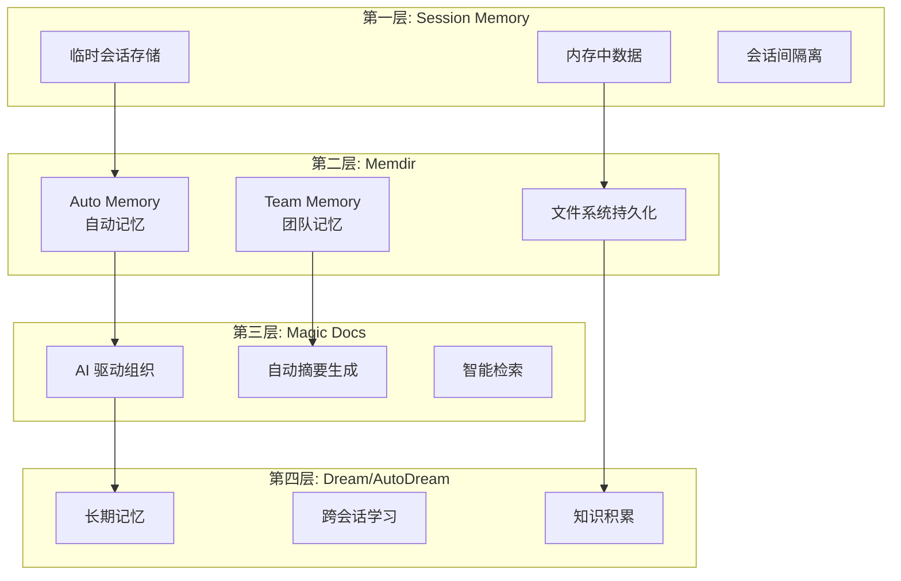
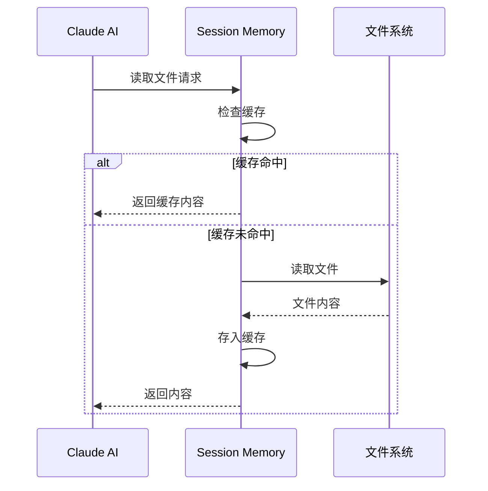
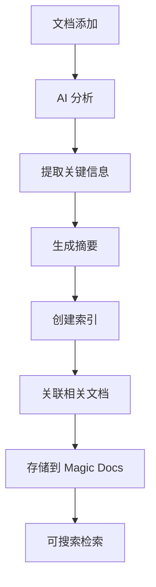
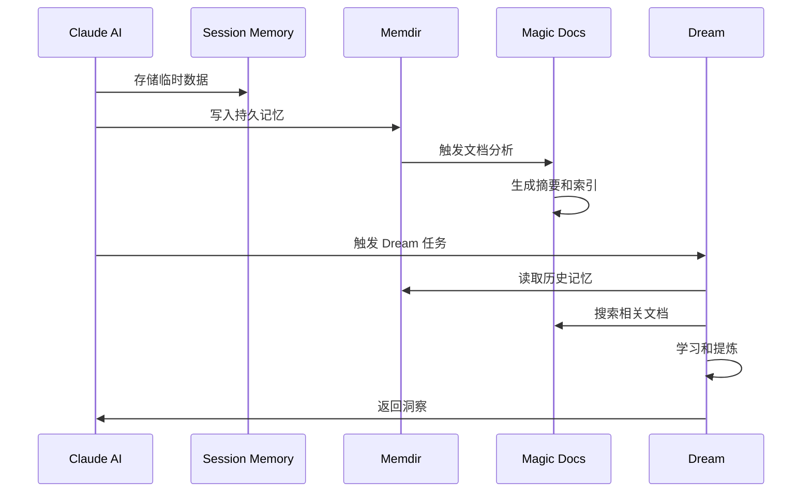

# 第 29 章：四层记忆架构

> 本章目标：深入理解 Claude Code 的创新四层记忆系统，这是区分 Claude Code 与其他 AI 工具的核心特性。

## 记忆架构概览



## 为什么需要四层记忆

传统 AI 助手的局限：

| 层限 | 影响 | 解决方案 |
|------|------|----------|
| 上下文窗口限制 | 长对话中丢失早期信息 | Session Memory |
| 会话间隔离 | 每次会话都是全新的 | Memdir |
| 信息组织 | 难以找到有用信息 | Magic Docs |
| 持续学习 | 无法从历史中学习 | Dream/AutoDream |

## 第一层：Session Memory

### 设计理念

Session Memory 是会话期间的临时存储，提供快速访问和会话内共享。

### 实现机制

```typescript
interface SessionMemory {
  // 文件读取状态
  readFileState: Map<string, {
    content: string
    timestamp: number
    offset?: number
    limit?: number
  }>

  // 用户偏好
  preferences: Map<string, unknown>

  // 上下文数据
  contextData: Map<string, unknown>
}

// 访问速度最快，仅限当前会话
const sessionMemory: SessionMemory = {
  readFileState: new Map(),
  preferences: new Map(),
  contextData: new Map(),
}
```

### 数据流



### 生命周期

```
会话开始 → Session Memory 初始化
     ↓
会话进行 → 读写操作
     ↓
会话结束 → Session Memory 清空
```

**作者观点：** Session Memory 是"热缓存"，提供最低延迟的访问。但其临时性意味着不适合存储重要信息。

## 第二层：Memdir

### 设计理念

Memdir（Memory Directory）将记忆存储为文件系统中的文件，实现持久化和跨会话共享。

### 目录结构

```
~/.claude/
├── session-memory/           # Session Memory 持久化
│   ├── current/
│   │   └── {session-id}.md
│   └── archive/
│       └── {date}/
│           └── {session-id}.md
├── auto-memory/              # Auto Memory
│   └── {project}/
│       ├── files.md
│       ├── conversations.md
│       └── patterns.md
└── team-memory/              # Team Memory
    └── {team-id}/
        ├── shared/
        │   ├── conventions.md
        │   └── decisions.md
        └── members/
            └── {user-id}/
                └── personal.md
```

### Auto Memory

自动收集和整理项目信息：

```typescript
interface AutoMemoryData {
  files: {
    path: string
    summary: string
    lastAccessed: number
  }[]
  conversations: {
    topic: string
    date: number
    summary: string
  }[]
  patterns: {
    type: 'code' | 'workflow' | 'decision'
    description: string
    examples: string[]
  }[]
}

// 自动更新机制
async function updateAutoMemory() {
  // 1. 分析最近访问的文件
  const recentFiles = getRecentFiles()

  // 2. 提取代码模式
  const patterns = await extractCodePatterns(recentFiles)

  // 3. 生成摘要
  const summary = await generateSummary(patterns)

  // 4. 写入 Memdir
  await writeMemdir('auto-memory', summary)
}
```

### Team Memory

团队共享的知识库：

```typescript
interface TeamMemory {
  teamId: string
  shared: {
    conventions: string[]      // 编码规范
    decisions: Decision[]      // 设计决策
    workflows: Workflow[]      # 工作流程
  }
  members: Map<string, PersonalMemory>
}

// 同步机制
async function syncTeamMemory() {
  // 1. 从远程拉取更新
  const remote = await fetchRemoteUpdates()

  // 2. 合并本地更改
  const merged = mergeMemories(local, remote)

  // 3. 推送合并结果
  await pushToRemote(merged)
}
```

## 第三层：Magic Docs

### 设计理念

Magic Docs 使用 AI 自动组织、摘要和索引文档，实现智能检索。

### 工作流程



### AI 驱动组织

```typescript
interface MagicDoc {
  id: string
  originalPath: string
  summary: string
  keywords: string[]
  relatedDocs: string[]
  embeddings?: number[]
  metadata: {
    created: number
    modified: number
    accessCount: number
  }
}

// 使用 AI 生成摘要
async function createMagicDoc(filePath: string): Promise<MagicDoc> {
  const content = await readFile(filePath)

  // 1. 生成摘要
  const summary = await callClaude(`
    请为以下文档生成简洁摘要：
    ${content}
  `)

  // 2. 提取关键词
  const keywords = await extractKeywords(content)

  // 3. 查找相关文档
  const relatedDocs = await findRelatedDocs(content)

  return {
    id: generateId(),
    originalPath: filePath,
    summary,
    keywords,
    relatedDocs,
    metadata: {
      created: Date.now(),
      modified: Date.now(),
      accessCount: 0,
    },
  }
}
```

### 智能检索

```typescript
// 语义搜索
async function searchMagicDocs(query: string): Promise<MagicDoc[]> {
  // 1. 生成查询嵌入
  const queryEmbedding = await generateEmbedding(query)

  // 2. 相似度搜索
  const docs = await magicDocsCollection.find({
    embeddings: {
      $near: {
        $geometry: queryEmbedding,
        $maxDistance: 0.1,
      },
    },
  })

  // 3. 重排序（考虑访问频率）
  return docs.sort((a, b) => {
    const scoreA = similarity(a, query) + Math.log(a.metadata.accessCount)
    const scoreB = similarity(b, query) + Math.log(b.metadata.accessCount)
    return scoreB - scoreA
  })
}
```

## 第四层：Dream/AutoDream

### 设计理念

Dream 系统实现长期学习和知识积累，是最高层级的记忆。

### Dream 任务

```typescript
interface DreamTask {
  type: 'consolidate' | 'learn' | 'discover'
  input: {
    source: 'session' | 'memdir' | 'magic-docs'
    data: unknown
  }
  output: {
    insights: string[]
    patterns: Pattern[]
    recommendations: string[]
  }
}

// Dream 任务执行
async function runDreamTask(task: DreamTask) {
  switch (task.type) {
    case 'consolidate':
      return consolidateMemories(task.input.data)

    case 'learn':
      return learnFromHistory(task.input.data)

    case 'discover':
      return discoverPatterns(task.input.data)
  }
}
```

### AutoDream

自动触发 Dream 任务：

```typescript
// 触发条件
const AUTO_DREAM_TRIGGERS = {
  sessionLength: 1000 * 60 * 30,  // 30 分钟会话
  conversationTurns: 50,          // 50 轮对话
  memorySize: 1024 * 1024,        // 1MB 记忆
}

// 检查是否需要 AutoDream
function shouldRunAutoDream(): boolean {
  const stats = getSessionStats()

  return (
    stats.duration > AUTO_DREAM_TRIGGERS.sessionLength ||
    stats.turns > AUTO_DREAM_TRIGGERS.conversationTurns ||
    stats.memorySize > AUTO_DREAM_TRIGGERS.memorySize
  )
}
```

### 知识积累

```typescript
interface KnowledgeGraph {
  nodes: Map<string, Concept>
  edges: Map<string, Relation>
}

// 从历史中学习
async function learnFromHistory(history: ConversationHistory): Promise<KnowledgeGraph> {
  const graph: KnowledgeGraph = {
    nodes: new Map(),
    edges: new Map(),
  }

  // 1. 提取概念
  for (const turn of history) {
    const concepts = await extractConcepts(turn)
    for (const concept of concepts) {
      graph.nodes.set(concept.id, concept)
    }
  }

  // 2. 建立关联
  const relations = await findRelations(graph.nodes)
  for (const relation of relations) {
    graph.edges.set(relation.id, relation)
  }

  return graph
}
```

## 层间协作



## 本章小结

本章介绍了 Claude Code 的四层记忆架构：
1. **Session Memory**：临时会话存储
2. **Memdir**：持久化文件系统记忆
3. **Magic Docs**：AI 驱动的文档组织
4. **Dream/AutoDream**：长期学习和知识积累

这种分层设计使 Claude Code 能够：
- 跨越会话限制
- 在团队成员间共享知识
- 自动组织和检索信息
- 持续学习和改进

## 下一章预告

第 30 章将详细介绍 Memdir 系统的实现细节。
