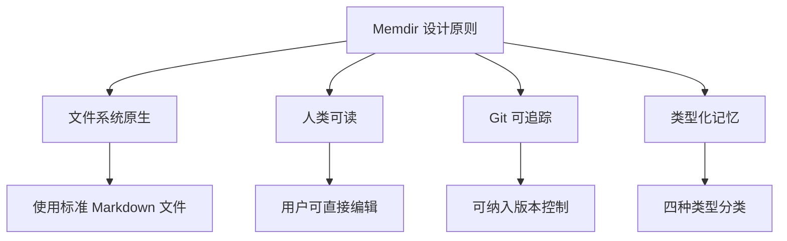
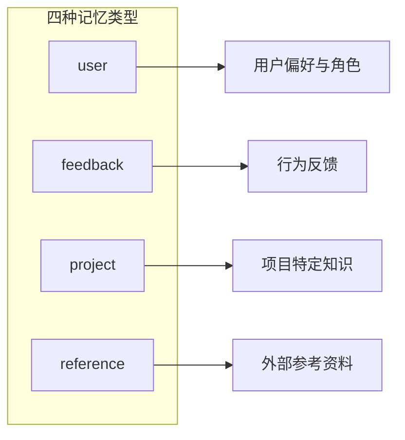
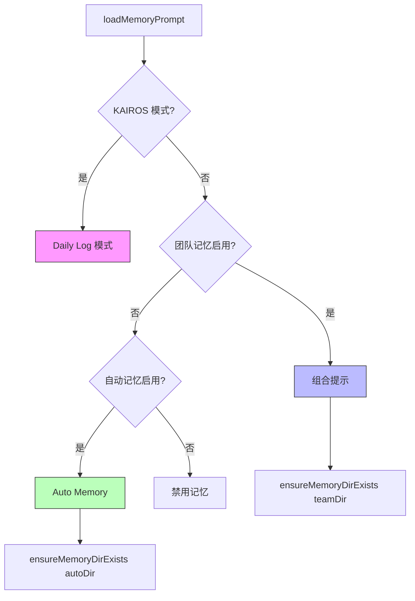

# 第 30 章：Memdir 系统详解

> 本章目标：深入理解 Memdir 系统的实现机制，包括路径解析、内存类型和存储结构。

## Memdir 概述

Memdir（Memory Directory）是 Claude Code 的持久化文件系统记忆层，将记忆以 Markdown 文件形式存储在用户文件系统中。

### 核心设计原则



## 路径解析系统

### 路径优先级链

```typescript
// memdir/paths.ts

/**
 * 自动记忆目录路径解析优先级：
 *   1. CLAUDE_COWORK_MEMORY_PATH_OVERRIDE（SDK 覆盖）
 *   2. settings.json 中的 autoMemoryDirectory
 *   3. ~/.claude/projects/<sanitized-git-root>/memory/
 */
export const getAutoMemPath = memoize(
  (): string => {
    // 1. SDK 覆盖优先（Cowork 场景）
    const override = getAutoMemPathOverride() ?? getAutoMemPathSetting()
    if (override) {
      return override
    }
    // 2. 默认路径
    const projectsDir = join(getMemoryBaseDir(), 'projects')
    return join(
      projectsDir,
      sanitizePath(getAutoMemBase()),
      AUTO_MEM_DIRNAME
    ) + sep
  },
  () => getProjectRoot(),
)
```

### 路径验证机制

```typescript
/**
 * 验证候选记忆路径是否安全
 *
 * SECURITY: 拒绝可能成为危险 allowlist 根目录的路径
 */
function validateMemoryPath(
  raw: string | undefined,
  expandTilde: boolean,
): string | undefined {
  if (!raw) return undefined

  let candidate = raw
  // 支持 ~/ 扩展（仅限 settings.json，不支持环境变量）
  if (expandTilde && (candidate.startsWith('~/') || candidate.startsWith('~\\'))) {
    const rest = candidate.slice(2)
    const restNorm = normalize(rest || '.')
    // 拒绝会扩展到 $HOME 或其祖先的平凡剩余部分
    if (restNorm === '.' || restNorm === '..') {
      return undefined
    }
    candidate = join(homedir(), rest)
  }

  const normalized = normalize(candidate).replace(/[/\\]+$/, '')

  // 拒绝不安全路径
  if (
    !isAbsolute(normalized) ||
    normalized.length < 3 ||
    /^[A-Za-z]:$/.test(normalized) ||      // Windows 驱动器根目录
    normalized.startsWith('\\\\') ||       // UNC 路径
    normalized.includes('\0')              // 空字节
  ) {
    return undefined
  }

  return (normalized + sep).normalize('NFC')
}
```

### 目录结构

```
~/.claude/
├── projects/                        # 项目级记忆
│   └── <sanitized-git-root>/
│       └── memory/                  # 记忆根目录
│           ├── MEMORY.md            # 入口索引文件
│           ├── team/                # 团队记忆（如果启用）
│           │   └── ...
│           └── *.md                 # 主题记忆文件
└── session-memory/                  # 会话记忆
    ├── current/
    │   └── {session-id}.md
    └── archive/
        └── {date}/
            └── {session-id}.md
```

## 内存类型系统

### 四种记忆类型



```typescript
// memdir/memoryTypes.ts

/**
 * 记忆类型分类
 *
 * - user: 用户偏好、角色、目标（持续有效的信息）
 * - feedback: 用户反馈（积极/消极行为模式）
 * - project: 项目特定知识（不可从代码派生）
 * - reference: 外部参考资料（链接、文档等）
 */
export type MemoryType = 'user' | 'feedback' | 'project' | 'reference'

interface MemoryFrontmatter {
  name: string
  description: string
  type: MemoryType
}
```

### 记忆文件格式

```markdown
---
name: user_role
description: 用户的基本角色和偏好
type: user
---

# 用户角色

用户是一名前端开发者，偏好使用 TypeScript 和 React。
```

### MEMORY.md 入口文件

```typescript
// memdir/memdir.ts

export const ENTRYPOINT_NAME = 'MEMORY.md'
export const MAX_ENTRYPOINT_LINES = 200
export const MAX_ENTRYPOINT_BYTES = 25_000

/**
 * 截断 MEMORY.md 内容到行数和字节数上限
 */
export function truncateEntrypointContent(raw: string): EntrypointTruncation {
  const trimmed = raw.trim()
  const contentLines = trimmed.split('\n')
  const lineCount = contentLines.length
  const byteCount = trimmed.length

  const wasLineTruncated = lineCount > MAX_ENTRYPOINT_LINES
  const wasByteTruncated = byteCount > MAX_ENTRYPOINT_BYTES

  if (!wasLineTruncated && !wasByteTruncated) {
    return { content: trimmed, lineCount, byteCount, wasLineTruncated, wasByteTruncated }
  }

  let truncated = wasLineTruncated
    ? contentLines.slice(0, MAX_ENTRYPOINT_LINES).join('\n')
    : trimmed

  if (truncated.length > MAX_ENTRYPOINT_BYTES) {
    const cutAt = truncated.lastIndexOf('\n', MAX_ENTRYPOINT_BYTES)
    truncated = truncated.slice(0, cutAt > 0 ? cutAt : MAX_ENTRYPOINT_BYTES)
  }

  const reason = wasByteTruncated && !wasLineTruncated
    ? `${formatFileSize(byteCount)} (limit: ${formatFileSize(MAX_ENTRYPOINT_BYTES)})`
    : wasLineTruncated && !wasByteTruncated
      ? `${lineCount} lines (limit: ${MAX_ENTRYPOINT_LINES})`
      : `${lineCount} lines and ${formatFileSize(byteCount)}`

  return {
    content: truncated + `\n\n> WARNING: ${ENTRYPOINT_NAME} is ${reason}. Only part of it was loaded.`,
    lineCount,
    byteCount,
    wasLineTruncated,
    wasByteTruncated,
  }
}
```

## 记忆启用控制

### 启用优先级链

```typescript
/**
 * 是否启用自动记忆功能
 * 优先级（第一个定义的胜出）：
 *   1. CLAUDE_CODE_DISABLE_AUTO_MEMORY 环境变量（1/true → OFF, 0/false → ON）
 *   2. CLAUDE_CODE_SIMPLE (--bare) → OFF
 *   3. CCR 无持久存储 → OFF（无 CLAUDE_CODE_REMOTE_MEMORY_DIR）
 *   4. settings.json 中的 autoMemoryEnabled（支持项目级 opt-out）
 *   5. 默认：启用
 */
export function isAutoMemoryEnabled(): boolean {
  // 1. 环境变量优先
  const envVal = process.env.CLAUDE_CODE_DISABLE_AUTO_MEMORY
  if (isEnvTruthy(envVal)) return false
  if (isEnvDefinedFalsy(envVal)) return true

  // 2. Simple 模式
  if (isEnvTruthy(process.env.CLAUDE_CODE_SIMPLE)) return false

  // 3. 远程模式无持久存储
  if (isEnvTruthy(process.env.CLAUDE_CODE_REMOTE) &&
      !process.env.CLAUDE_CODE_REMOTE_MEMORY_DIR) {
    return false
  }

  // 4. 设置文件
  const settings = getInitialSettings()
  if (settings.autoMemoryEnabled !== undefined) {
    return settings.autoMemoryEnabled
  }

  // 5. 默认启用
  return true
}
```

## 记忆提示构建

### 记忆提示结构

```typescript
/**
 * 构建类型化记忆行为指令（不含 MEMORY.md 内容）
 */
export function buildMemoryLines(
  displayName: string,
  memoryDir: string,
  extraGuidelines?: string[],
  skipIndex = false,
): string[] {
  const howToSave = skipIndex ? [
    '## How to save memories',
    '',
    'Write each memory to its own file (e.g., `user_role.md`, `feedback_testing.md`)',
    // ...
  ] : [
    '## How to save memories',
    '',
    'Saving a memory is a two-step process:',
    '',
    '**Step 1** — write the memory to its own file',
    '**Step 2** — add a pointer to `MEMORY.md`',
    '',
    `- \`MEMORY.md\` is always loaded — lines after ${MAX_ENTRYPOINT_LINES} will be truncated`,
    '- Do not write duplicate memories',
    // ...
  ]

  return [
    `# ${displayName}`,
    '',
    `You have a persistent, file-based memory system at \`${memoryDir}\`. ${DIR_EXISTS_GUIDANCE}`,
    '',
    ...TYPES_SECTION_INDIVIDUAL,
    ...WHAT_NOT_TO_SAVE_SECTION,
    '',
    ...howToSave,
    '',
    ...WHEN_TO_ACCESS_SECTION,
    '',
    ...TRUSTING_RECALL_SECTION,
    '',
    ...(extraGuidelines ?? []),
    '',
    ...buildSearchingPastContextSection(memoryDir),
  ]
}
```

### 自动记忆与团队记忆



## 记忆目录操作

### 目录存在保证

```typescript
/**
 * 确保记忆目录存在
 * 幂等 — 从 loadMemoryPrompt 调用（每次会话一次）
 */
export async function ensureMemoryDirExists(memoryDir: string): Promise<void> {
  const fs = getFsImplementation()
  try {
    await fs.mkdir(memoryDir)
  } catch (e) {
    // fs.mkdir 内部处理 EEXIST
    const code = e instanceof Error && 'code' in e && typeof e.code === 'string'
      ? e.code
      : undefined
    logForDebugging(
      `ensureMemoryDirExists failed for ${memoryDir}: ${code ?? String(e)}`,
      { level: 'debug' },
    )
  }
}
```

### 日志文件路径（KAIROS 模式）

```typescript
/**
 * 返回给定日期的每日日志文件路径
 * 格式: <autoMemPath>/logs/YYYY/MM/YYYY-MM-DD.md
 */
export function getAutoMemDailyLogPath(date: Date = new Date()): string {
  const yyyy = date.getFullYear().toString()
  const mm = (date.getMonth() + 1).toString().padStart(2, '0')
  const dd = date.getDate().toString().padStart(2, '0')
  return join(getAutoMemPath(), 'logs', yyyy, mm, `${yyyy}-${mm}-${dd}.md`)
}
```

## 安全机制

### 路径安全检查

```typescript
/**
 * 检查绝对路径是否在自动记忆目录内
 */
export function isAutoMemPath(absolutePath: string): boolean {
  // SECURITY: 规范化以防止 .. 段的路径遍历绕过
  const normalizedPath = normalize(absolutePath)
  return normalizedPath.startsWith(getAutoMemPath())
}
```

### 设置源优先级

```typescript
/**
 * Settings.json 覆盖 - 仅来自可信源
 *
 * SECURITY: projectSettings（.claude/settings.json）被有意排除
 * - 恶意仓库可能设置 autoMemoryDirectory: "~/.ssh"
 * - 通过 filesystem.ts 写入豁免获得静默写入权限
 */
function getAutoMemPathSetting(): string | undefined {
  const dir =
    getSettingsForSource('policySettings')?.autoMemoryDirectory ??
    getSettingsForSource('flagSettings')?.autoMemoryDirectory ??
    getSettingsForSource('localSettings')?.autoMemoryDirectory ??
    getSettingsForSource('userSettings')?.autoMemoryDirectory
  // 注意：故意排除 'projectSettings'
  return validateMemoryPath(dir, true)
}
```

## 本章小结

本章详细介绍了 Memdir 系统的实现机制：

1. **路径解析**：三级优先级链，支持 SDK 覆盖和自定义设置
2. **内存类型**：四种类型化记忆（user/feedback/project/reference）
3. **入口文件**：MEMORY.md 索引，受行数和字节限制保护
4. **启用控制**：多级优先级的环境变量和设置系统
5. **安全机制**：路径验证、设置源过滤、目录边界检查

**设计亮点：**
- 文件系统原生设计使记忆可读、可编辑、可版本控制
- 幂等的目录操作避免竞态条件
- 多级安全验证防止路径遍历和恶意配置

## 下一章预告

第 31 章将介绍 Magic Docs 系统 —— AI 驱动的自动文档维护。
