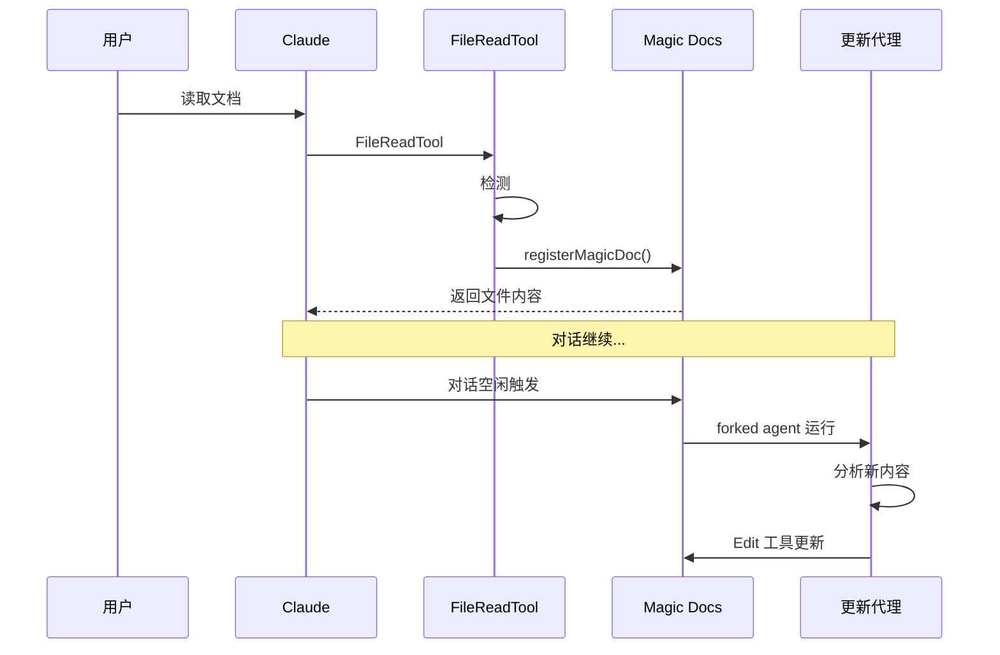
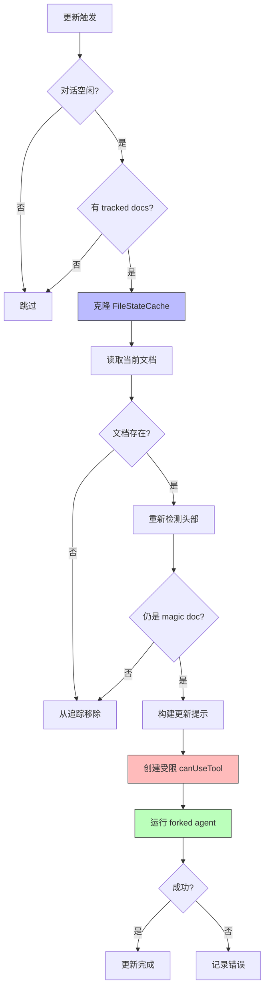

# 第 31 章：Magic Docs 详解

> 本章目标：理解 Magic Docs 的 AI 驱动自动文档维护机制。

## Magic Docs 概述

Magic Docs 是一种特殊的 Markdown 文件，当它们被读取时，会自动在后台使用 forked 子代理进行更新。这实现了"活的文档"——随着对话进行而不断演进。

### 工作原理



## Magic Doc 头检测

### 头部模式

```typescript
// services/MagicDocs/magicDocs.ts

// Magic Doc 头部模式: # MAGIC DOC: [title]
const MAGIC_DOC_HEADER_PATTERN = /^#\s*MAGIC\s+DOC:\s*(.+)$/im

// 匹配头部后一行的斜体指令
const ITALICS_PATTERN = /^[_*](.+?)[_*]\s*$/m

/**
 * 检测文件内容是否包含 Magic Doc 头部
 * 返回标题和可选指令，或 null（如果不是 magic doc）
 */
export function detectMagicDocHeader(
  content: string,
): { title: string; instructions?: string } | null {
  const match = content.match(MAGIC_DOC_HEADER_PATTERN)
  if (!match || !match[1]) {
    return null
  }

  const title = match[1].trim()

  // 查找头部后的斜体指令（允许一个空行）
  const headerEndIndex = match.index! + match[0].length
  const afterHeader = content.slice(headerEndIndex)
  const nextLineMatch = afterHeader.match(/^\s*\n(?:\s*\n)?(.+?)(?:\n|$)/)

  if (nextLineMatch && nextLineMatch[1]) {
    const nextLine = nextLineMatch[1]
    const italicsMatch = nextLine.match(ITALICS_PATTERN)
    if (italicsMatch && italicsMatch[1]) {
      const instructions = italicsMatch[1].trim()
      return { title, instructions }
    }
  }

  return { title }
}
```

### 文件格式示例

```markdown
# MAGIC DOC: API Design Patterns

_保持简洁，只记录最终决策，不记录讨论过程。_

## 认证系统

使用 JWT 令牌进行认证...
```

## 注册与追踪

### 文件注册

```typescript
// 追踪的 Magic Docs
const trackedMagicDocs = new Map<string, MagicDocInfo>()

type MagicDocInfo = {
  path: string
}

/**
 * 注册文件为 Magic Doc
 * 每个文件路径只注册一次
 */
export function registerMagicDoc(filePath: string): void {
  if (!trackedMagicDocs.has(filePath)) {
    trackedMagicDocs.set(filePath, { path: filePath })
  }
}

export function clearTrackedMagicDocs(): void {
  trackedMagicDocs.clear()
}
```

### 文件读取监听器

```typescript
export async function initMagicDocs(): Promise<void> {
  if (process.env.USER_TYPE === 'ant') {
    // 注册监听器以在读取文件时检测 magic docs
    registerFileReadListener((filePath: string, content: string) => {
      const result = detectMagicDocHeader(content)
      if (result) {
        registerMagicDoc(filePath)
      }
    })

    registerPostSamplingHook(updateMagicDocs)
  }
}
```

## 更新代理

### 代理定义

```typescript
/**
 * 创建 Magic Docs 代理定义
 */
function getMagicDocsAgent(): BuiltInAgentDefinition {
  return {
    agentType: 'magic-docs',
    whenToUse: 'Update Magic Docs',
    tools: [FILE_EDIT_TOOL_NAME],  // 只允许 Edit
    model: 'sonnet',
    source: 'built-in',
    baseDir: 'built-in',
    getSystemPrompt: () => '',  // 使用覆盖 systemPrompt
  }
}
```

### 更新流程



### 单文档更新

```typescript
/**
 * 更新单个 Magic Doc
 */
async function updateMagicDoc(
  docInfo: MagicDocInfo,
  context: REPLHookContext,
): Promise<void> {
  const { messages, systemPrompt, userContext, systemContext, toolUseContext } = context

  // 克隆 FileStateCache 以隔离 Magic Docs 操作
  const clonedReadFileState = cloneFileStateCache(toolUseContext.readFileState)
  clonedReadFileState.delete(docInfo.path)  // 删除此文档条目以获取实际内容
  const clonedToolUseContext: ToolUseContext = {
    ...toolUseContext,
    readFileState: clonedReadFileState,
  }

  // 读取文档；如果已删除或不可读，从追踪中移除
  let currentDoc = ''
  try {
    const result = await FileReadTool.call(
      { file_path: docInfo.path },
      clonedToolUseContext,
    )
    const output = result.data as FileReadToolOutput
    if (output.type === 'text') {
      currentDoc = output.file.content
    }
  } catch (e: unknown) {
    if (isFsInaccessible(e) ||
        (e instanceof Error && e.message.startsWith('File does not exist'))) {
      trackedMagicDocs.delete(docInfo.path)
      return
    }
    throw e
  }

  // 重新检测标题和指令
  const detected = detectMagicDocHeader(currentDoc)
  if (!detected) {
    trackedMagicDocs.delete(docInfo.path)
    return
  }

  // 构建更新提示
  const userPrompt = await buildMagicDocsUpdatePrompt(
    currentDoc,
    docInfo.path,
    detected.title,
    detected.instructions,
  )

  // 创建受限 canUseTool（只允许 Edit 此文档）
  const canUseTool = async (tool: Tool, input: unknown) => {
    if (tool.name === FILE_EDIT_TOOL_NAME &&
        typeof input === 'object' && input !== null &&
        'file_path' in input) {
      const filePath = input.file_path
      if (typeof filePath === 'string' && filePath === docInfo.path) {
        return { behavior: 'allow' as const, updatedInput: input }
      }
    }
    return {
      behavior: 'deny' as const,
      message: `only ${FILE_EDIT_TOOL_NAME} is allowed for ${docInfo.path}`,
      decisionReason: { type: 'other' as const, reason: `only ${FILE_EDIT_TOOL_NAME} is allowed` },
    }
  }

  // 使用 runAgent 运行 Magic Docs 更新
  for await (const _message of runAgent({
    agentDefinition: getMagicDocsAgent(),
    promptMessages: [createUserMessage({ content: userPrompt })],
    toolUseContext: clonedToolUseContext,
    canUseTool,
    isAsync: true,
    forkContextMessages: messages,
    querySource: 'magic_docs',
    override: { systemPrompt, userContext, systemContext },
    availableTools: clonedToolUseContext.options.tools,
  })) {
    // 消费直到完成
  }
}
```

## Post-Sampling Hook

### 更新调度

```typescript
/**
 * Magic Docs post-sampling hook 更新所有追踪的 Magic Docs
 */
const updateMagicDocs = sequential(async function (
  context: REPLHookContext,
): Promise<void> {
  const { messages, querySource } = context

  // 只在主 REPL 线程运行
  if (querySource !== 'repl_main_thread') {
    return
  }

  // 仅在对话空闲时更新（上一轮无工具调用）
  const hasToolCalls = hasToolCallsInLastAssistantTurn(messages)
  if (hasToolCalls) {
    return
  }

  const docCount = trackedMagicDocs.size
  if (docCount === 0) {
    return
  }

  for (const docInfo of Array.from(trackedMagicDocs.values())) {
    await updateMagicDoc(docInfo, context)
  }
})
```

### Sequential 包装器

```typescript
// 使用 sequential 确保同时只有一个更新在运行
// 防止并发更新同一文档
import { sequential } from '../../utils/sequential.js'
```

## 工具权限约束

### 权限设计

```typescript
/**
 * 权限约束说明
 *
 * - 只允许 FILE_EDIT_TOOL_NAME（Edit）
 * - 只能编辑注册的 Magic Doc 文件
 * - 其他所有工具和文件路径被拒绝
 *
 * 这确保了 Magic Docs 更新代理：
 * 1. 不能创建新文件
 * 2. 不能删除文件
 * 3. 不能编辑其他文件
 * 4. 不能运行 Bash 等危险工具
 */
```

### 安全边界

| 操作 | 允许 | 原因 |
|------|------|------|
| Edit Magic Doc | ✅ | 核心功能 |
| Read 文件 | ✅ | Fork 上下文包含 |
| Write 新文件 | ❌ | 防止意外创建 |
| Bash | ❌ | 防止任意执行 |
| Edit 其他文件 | ❌ | 隔离边界 |

## 更新提示构建

```typescript
// services/MagicDocs/prompts.ts

export async function buildMagicDocsUpdatePrompt(
  currentDoc: string,
  filePath: string,
  title: string,
  instructions?: string,
): Promise<string> {
  // 从当前对话上下文提取新信息
  const recentContext = extractRecentConversation()

  return `You are updating a Magic Doc file.

**File:** ${filePath}
**Title:** ${title}
${instructions ? `**Instructions:** ${instructions}\n` : ''}

**Current content:**
${currentDoc}

**Recent conversation context:**
${recentContext}

Update the Magic Doc by incorporating any new information, decisions, or patterns from the recent conversation that are relevant to "${title}".

Use the Edit tool to make targeted changes. Preserve the existing structure and only add or update what's new.

Do not change the MAGIC DOC header line.`
}
```

## KAIROS 模式下的行为

在 KAIROS（assistant）模式下，Magic Docs 仍然工作，但有一些差异：

```typescript
// KAIROS 模式使用不同的更新机制
if (feature('KAIROS') && autoEnabled && getKairosActive()) {
  // 使用每日日志模式
  return buildAssistantDailyLogPrompt(skipIndex)
}
```

## 本章小结

Magic Docs 是一个创新的自动文档维护系统：

1. **头部检测**：通过 `# MAGIC DOC:` 标记特殊文件
2. **自动追踪**：读取时注册，后台更新
3. **权限隔离**：只允许 Edit，只能编辑注册文件
4. **空闲触发**：仅在对话空闲时运行
5. **Fork 上下文**：使用独立代理，不污染主对话

**设计亮点：**
- 自动化无需手动触发
- 权限严格限制保证安全
- Fork 上下文实现隔离
- Sequential 防止并发冲突

**使用场景：**
- API 文档更新
- 决策记录维护
- 项目约定文档
- 设计模式总结

## 下一章预告

第 32 章将介绍团队记忆同步系统 —— 如何在团队成员间共享知识。
