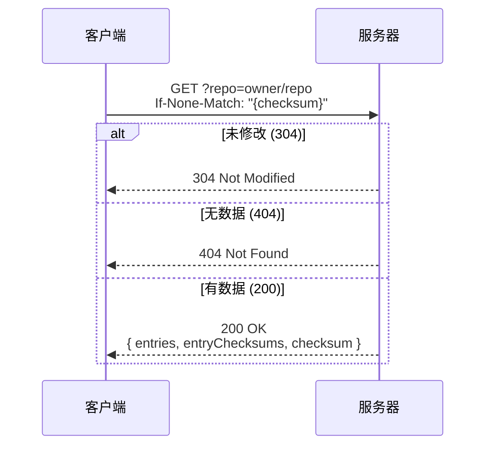
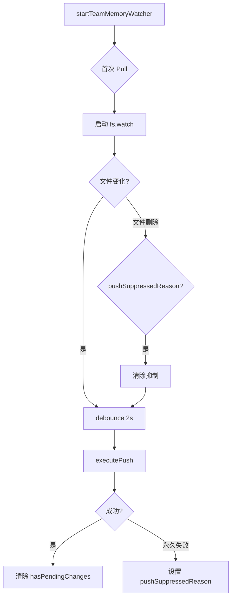

# 第 32 章：团队记忆同步

> 本章目标：理解团队记忆如何在团队成员间实现同步共享。

## 团队记忆概述

团队记忆（Team Memory）允许多个开发者在同一仓库中共享知识库。记忆按仓库（通过 git remote 标识）作用域，并在所有经过身份验证的组织成员间共享。

### 架构概览

```mermaid
graph TB
    subgraph "本地环境 A"
        A1[~/.claude/projects/repo/memory/team/]
    end

    subgraph "本地环境 B"
        B1[~/.claude/projects/repo/memory/team/]
    end

    subgraph "Anthropic API"
        C1[/api/claude_code/team_memory]
    end

    A1 -->|Pull| C1
    C1 -->|Push| A1
    B1 -->|Pull| C1
    C1 -->|Push| B1

    C1 -.->|按 repo slug| C2[(服务器存储)]
```

## API 契约

### 端点定义

```typescript
// services/teamMemorySync/index.ts

/**
 * 团队记忆同步 API 契约
 *
 * GET  /api/claude_code/team_memory?repo={owner/repo}
 *      → TeamMemoryData (包含 entryChecksums)
 *
 * GET  /api/claude_code/team_memory?repo={owner/repo}&view=hashes
 *      → metadata + entryChecksums (无 entry bodies)
 *
 * PUT  /api/claude_code/team_memory?repo={owner/repo}
 *      → 上传 entries (upsert 语义)
 *
 * 404 = 尚无数据
 */
```

### 同步语义

```typescript
/**
 * 同步语义规则
 *
 * - Pull: 服务器获胜（本地被服务器内容覆盖）
 * - Push: 仅上传内容哈希与 serverChecksums 不同的键
 * - 删除: 不传播（删除本地文件不会从服务器删除，
 *   下次 pull 会恢复本地）
 */
```

## 认证与授权

### OAuth 检查

```typescript
/**
 * 检查用户是否使用第一方 OAuth 认证
 */
function isUsingOAuth(): boolean {
  if (getAPIProvider() !== 'firstParty' || !isFirstPartyAnthropicBaseUrl()) {
    return false
  }
  const tokens = getClaudeAIOAuthTokens()
  return Boolean(
    tokens?.accessToken &&
      tokens.scopes?.includes(CLAUDE_AI_INFERENCE_SCOPE) &&
      tokens.scopes.includes(CLAUDE_AI_PROFILE_SCOPE),
  )
}

/**
 * 检查团队记忆同步是否可用
 */
export function isTeamMemorySyncAvailable(): boolean {
  return isUsingOAuth()
}
```

### 请求头构建

```typescript
function getAuthHeaders(): {
  headers?: Record<string, string>
  error?: string
} {
  const oauthTokens = getClaudeAIOAuthTokens()
  if (oauthTokens?.accessToken) {
    return {
      headers: {
        Authorization: `Bearer ${oauthTokens.accessToken}`,
        'anthropic-beta': OAUTH_BETA_HEADER,
        'User-Agent': getClaudeCodeUserAgent(),
      },
    }
  }
  return { error: 'No OAuth token available for team memory sync' }
}
```

## 同步状态管理

### 状态对象

```typescript
/**
 * 团队记忆同步服务的可变状态
 * 每次会话由 watcher 创建一次，传递给所有同步函数
 */
export type SyncState = {
  /** 最后已知的服务器校验和（ETag），用于条件请求 */
  lastKnownChecksum: string | null

  /** 我们认为服务器当前持有的每键内容哈希 */
  serverChecksums: Map<string, string>

  /** 服务器强制的 max_entries 上限，从结构化 413 响应学习 */
  serverMaxEntries: number | null
}

export function createSyncState(): SyncState {
  return {
    lastKnownChecksum: null,
    serverChecksums: new Map(),
    serverMaxEntries: null,
  }
}
```

### 内容哈希

```typescript
/**
 * 计算给定内容的 sha256:<hex> 哈希
 * 格式匹配服务器的 entryChecksums 值
 */
export function hashContent(content: string): string {
  return 'sha256:' + createHash('sha256').update(content, 'utf8').digest('hex')
}
```

## Pull 操作

### Fetch 流程



### 实现代码

```typescript
async function fetchTeamMemoryOnce(
  state: SyncState,
  repoSlug: string,
  etag?: string | null,
): Promise<TeamMemorySyncFetchResult> {
  try {
    await checkAndRefreshOAuthTokenIfNeeded()

    const auth = getAuthHeaders()
    if (auth.error) {
      return {
        success: false,
        error: auth.error,
        skipRetry: true,
        errorType: 'auth',
      }
    }

    const headers: Record<string, string> = { ...auth.headers }
    if (etag) {
      headers['If-None-Match'] = `"${etag.replace(/"/g, '')}"`
    }

    const endpoint = getTeamMemorySyncEndpoint(repoSlug)
    const response = await axios.get(endpoint, {
      headers,
      timeout: TEAM_MEMORY_SYNC_TIMEOUT_MS,
      validateStatus: status =>
        status === 200 || status === 304 || status === 404,
    })

    if (response.status === 304) {
      return { success: true, notModified: true, checksum: etag ?? undefined }
    }

    if (response.status === 404) {
      state.lastKnownChecksum = null
      return { success: true, isEmpty: true }
    }

    const parsed = TeamMemoryDataSchema().safeParse(response.data)
    if (!parsed.success) {
      return {
        success: false,
        error: 'Invalid team memory response format',
        skipRetry: true,
        errorType: 'parse',
      }
    }

    const responseChecksum =
      parsed.data.checksum ||
      response.headers['etag']?.replace(/^"|"$/g, '') ||
      undefined

    if (responseChecksum) {
      state.lastKnownChecksum = responseChecksum
    }

    return {
      success: true,
      data: parsed.data,
      isEmpty: false,
      checksum: responseChecksum,
    }
  } catch (error) {
    // 错误处理...
  }
}
```

### 写入本地

```typescript
/**
 * 将远程团队记忆条目写入本地目录
 * 验证每个路径是否在团队记忆目录边界内
 * 跳过磁盘内容已匹配的条目
 */
async function writeRemoteEntriesToLocal(
  entries: Record<string, string>,
): Promise<number> {
  const results = await Promise.all(
    Object.entries(entries).map(async ([relPath, content]) => {
      let validatedPath: string
      try {
        validatedPath = await validateTeamMemKey(relPath)
      } catch (e) {
        if (e instanceof PathTraversalError) {
          logForDebugging(`team-memory-sync: ${e.message}`, { level: 'warn' })
          return false
        }
        throw e
      }

      const sizeBytes = Buffer.byteLength(content, 'utf8')
      if (sizeBytes > MAX_FILE_SIZE_BYTES) {
        return false
      }

      // 如果磁盘内容已匹配则跳过
      try {
        const existing = await readFile(validatedPath, 'utf8')
        if (existing === content) {
          return false
        }
      } catch (e) {
        // ENOENT/ENOTDIR 则继续写入
      }

      try {
        const parentDir = validatedPath.substring(
          0,
          validatedPath.lastIndexOf(sep),
        )
        await mkdir(parentDir, { recursive: true })
        await writeFile(validatedPath, content, 'utf8')
        return true
      } catch (e) {
        return false
      }
    }),
  )

  return count(results, Boolean)
}
```

## Push 操作

### Delta 上传

```typescript
/**
 * Push 使用乐观锁
 *
 * - Delta 上传: 仅上传内容哈希与 serverChecksums 不同的键
 * - 412 冲突: 探测 GET ?view=hashes 刷新 serverChecksums
 * - 重试: 重新计算 delta（自然排除队友推送的匹配内容）
 */
export async function pushTeamMemory(
  state: SyncState,
): Promise<TeamMemorySyncPushResult> {
  const startTime = Date.now()
  let conflictRetries = 0

  const repoSlug = await getGithubRepo()
  if (!repoSlug) {
    return {
      success: false,
      filesUploaded: 0,
      error: 'No git remote found',
      errorType: 'no_repo',
    }
  }

  // 读取本地条目（含秘密扫描）
  const localRead = await readLocalTeamMemory(state.serverMaxEntries)
  const entries = localRead.entries
  const skippedSecrets = localRead.skippedSecrets

  // 计算每个本地条目的哈希
  const localHashes = new Map<string, string>()
  for (const [key, content] of Object.entries(entries)) {
    localHashes.set(key, hashContent(content))
  }

  let sawConflict = false

  // 冲突解决循环
  for (let conflictAttempt = 0; conflictAttempt <= MAX_CONFLICT_RETRIES; conflictAttempt++) {
    // Delta: 仅上传哈希不同的键
    const delta: Record<string, string> = {}
    for (const [key, localHash] of localHashes) {
      if (state.serverChecksums.get(key) !== localHash) {
        delta[key] = entries[key]!
      }
    }

    const deltaCount = Object.keys(delta).length
    if (deltaCount === 0) {
      return { success: true, filesUploaded: 0 }
    }

    // 分批上传（每批 < MAX_PUT_BODY_BYTES）
    const batches = batchDeltaByBytes(delta)
    let filesUploaded = 0
    let result: TeamMemorySyncUploadResult | undefined

    for (const batch of batches) {
      result = await uploadTeamMemory(
        state,
        repoSlug,
        batch,
        state.lastKnownChecksum,
      )
      if (!result.success) break

      // 更新成功后更新 serverChecksums
      for (const key of Object.keys(batch)) {
        state.serverChecksums.set(key, localHashes.get(key)!)
      }
      filesUploaded += Object.keys(batch).length
    }

    result = result!

    if (result.success) {
      return {
        success: true,
        filesUploaded,
        checksum: result.checksum,
        ...(skippedSecrets.length > 0 && { skippedSecrets }),
      }
    }

    if (!result.conflict) {
      // 非冲突错误，返回失败
      if (result.serverMaxEntries !== undefined) {
        state.serverMaxEntries = result.serverMaxEntries
      }
      return {
        success: false,
        filesUploaded,
        error: result.error,
        errorType: result.errorType,
        httpStatus: result.httpStatus,
      }
    }

    // 412 冲突 - 刷新 serverChecksums 并重试
    sawConflict = true
    if (conflictAttempt >= MAX_CONFLICT_RETRIES) {
      return {
        success: false,
        filesUploaded: 0,
        conflict: true,
        error: 'Conflict resolution failed after retries',
      }
    }

    conflictRetries++

    // 便宜探测: 仅获取哈希，无 bodies
    const probe = await fetchTeamMemoryHashes(state, repoSlug)
    if (!probe.success || !probe.entryChecksums) {
      return {
        success: false,
        filesUploaded: 0,
        conflict: true,
        error: `Conflict resolution hashes probe failed: ${probe.error}`,
      }
    }

    state.serverChecksums.clear()
    for (const [key, hash] of Object.entries(probe.entryChecksums)) {
      state.serverChecksums.set(key, hash)
    }
  }

  return {
    success: false,
    filesUploaded: 0,
    error: 'Unexpected end of conflict resolution loop',
  }
}
```

### 分批上传

```typescript
/**
 * 将 delta 分成 PUT 大小的批次
 * 使用贪婪装箱和排序键以获得确定性批次
 */
export function batchDeltaByBytes(
  delta: Record<string, string>,
): Array<Record<string, string>> {
  const keys = Object.keys(delta).sort()
  if (keys.length === 0) return []

  const EMPTY_BODY_BYTES = Buffer.byteLength('{"entries":{}}', 'utf8')
  const entryBytes = (k: string, v: string): number =>
    Buffer.byteLength(jsonStringify(k), 'utf8') +
    Buffer.byteLength(jsonStringify(v), 'utf8') +
    2  // 冒号 + 逗号

  const batches: Array<Record<string, string>> = []
  let current: Record<string, string> = {}
  let currentBytes = EMPTY_BODY_BYTES

  for (const key of keys) {
    const added = entryBytes(key, delta[key]!)
    if (
      currentBytes + added > MAX_PUT_BODY_BYTES &&
      Object.keys(current).length > 0
    ) {
      batches.push(current)
      current = {}
      currentBytes = EMPTY_BODY_BYTES
    }
    current[key] = delta[key]!
    currentBytes += added
  }
  batches.push(current)
  return batches
}
```

## 文件监视器

### Watcher 架构



### 启动流程

```typescript
// services/teamMemorySync/watcher.ts

export async function startTeamMemoryWatcher(): Promise<void> {
  if (!feature('TEAMMEM')) return
  if (!isTeamMemoryEnabled() || !isTeamMemorySyncAvailable()) return

  const repoSlug = await getGithubRepo()
  if (!repoSlug) {
    logForDebugging('team-memory-watcher: no github.com remote', { level: 'debug' })
    return
  }

  syncState = createSyncState()

  // 初始从服务器 pull（在 watcher 启动前运行）
  let initialPullSuccess = false
  let initialFilesPulled = 0
  let serverHasContent = false

  try {
    const pullResult = await pullTeamMemory(syncState)
    initialPullSuccess = pullResult.success
    serverHasContent = pullResult.entryCount > 0
    if (pullResult.success && pullResult.filesWritten > 0) {
      initialFilesPulled = pullResult.filesWritten
    }
  } catch (e) {
    logForDebugging(`team-memory-watcher: initial pull failed`, { level: 'warn' })
  }

  // 始终启动 watcher（即使服务器为空）
  await startFileWatcher(getTeamMemPath())

  logEvent('tengu_team_mem_sync_started', {
    initial_pull_success: initialPullSuccess,
    initial_files_pulled: initialFilesPulled,
    watcher_started: true,
    server_has_content: serverHasContent,
  })
}
```

### Debounce Push

```typescript
const DEBOUNCE_MS = 2000  // 等待 2s

let debounceTimer: ReturnType<typeof setTimeout> | null = null
let pushInProgress = false
let hasPendingChanges = false

/**
 * Debounced push: 等待写入稳定后推送一次
 */
function schedulePush(): void {
  if (pushSuppressedReason !== null) return
  hasPendingChanges = true
  if (debounceTimer) {
    clearTimeout(debounceTimer)
  }
  debounceTimer = setTimeout(() => {
    if (pushInProgress) {
      schedulePush()
      return
    }
    currentPushPromise = executePush()
  }, DEBOUNCE_MS)
}
```

## 安全机制

### 秘密扫描

```typescript
/**
 * 扫描秘密（PSR M22174）
 * 使用 gitleaks 模式，包含秘密的文件被跳过
 */
async function readLocalTeamMemory(maxEntries: number | null): Promise<{
  entries: Record<string, string>
  skippedSecrets: SkippedSecretFile[]
}> {
  const teamDir = getTeamMemPath()
  const entries: Record<string, string> = {}
  const skippedSecrets: SkippedSecretFile[] = []

  async function walkDir(dir: string): Promise<void> {
    const dirEntries = await readdir(dir, { withFileTypes: true })
    await Promise.all(dirEntries.map(async entry => {
      if (entry.isFile()) {
        const content = await readFile(fullPath, 'utf8')

        // 在上传前扫描秘密
        const secretMatches = scanForSecrets(content)
        if (secretMatches.length > 0) {
          const firstMatch = secretMatches[0]!
          skippedSecrets.push({
            path: relPath,
            ruleId: firstMatch.ruleId,
            label: firstMatch.label,
          })
          return  // 跳过此文件
        }

        entries[relPath] = content
      }
    }))
  }

  await walkDir(teamDir)
  return { entries, skippedSecrets }
}
```

### 路径验证

```typescript
/**
 * 验证团队记忆键是否在目录边界内
 * 防止路径遍历攻击
 */
export async function validateTeamMemKey(
  key: string,
): Promise<string> {
  const teamDir = getTeamMemPath()

  // 规范化并检查边界
  const resolved = resolve(join(teamDir, key))
  const normalizedResolved = normalize(resolved)
  const normalizedTeamDir = normalize(teamDir)

  if (!normalizedResolved.startsWith(normalizedTeamDir)) {
    throw new PathTraversalError(
      `Invalid team memory key: path traversal detected: "${key}"`,
    )
  }

  return normalizedResolved
}
```

## 本章小结

团队记忆同步系统实现了：

1. **API 契约**：GET/PUT 端点，支持 ETag 条件请求和哈希视图
2. **Delta 上传**：仅上传变化的内容，减少带宽
3. **乐观锁**：412 冲突自动重试，本地获胜策略
4. **文件监视**：fs.watch + debounce 自动同步
5. **安全机制**：秘密扫描、路径验证、权限控制

**设计亮点：**
- 冲突解决通过哈希探测而非完整内容拉取
- 分批上传处理大量文件和网关限制
- 秘密扫描防止意外上传敏感信息
- 永久失败抑制防止无限重试循环

## 下一章预告

第 33 章将介绍 DreamTask 和 AutoDream —— 长期记忆整合系统。
