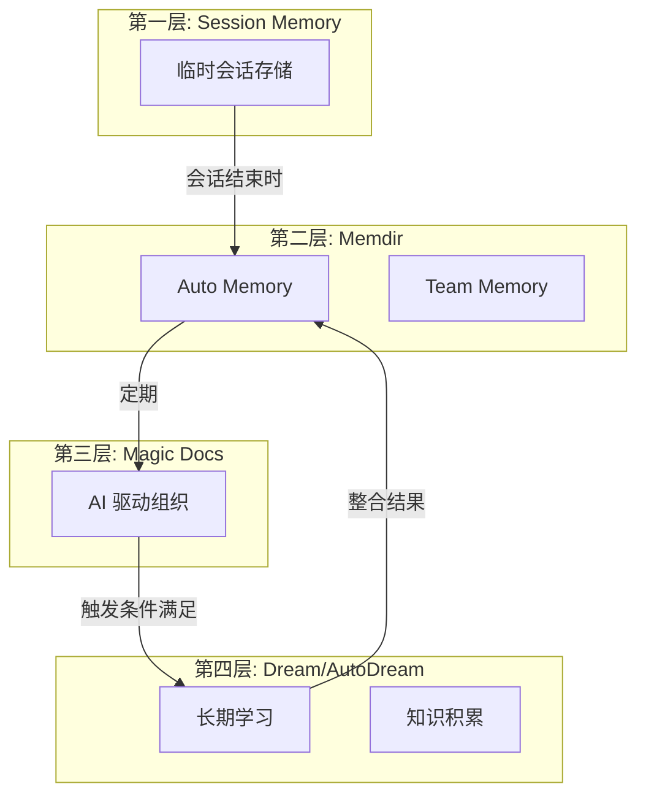
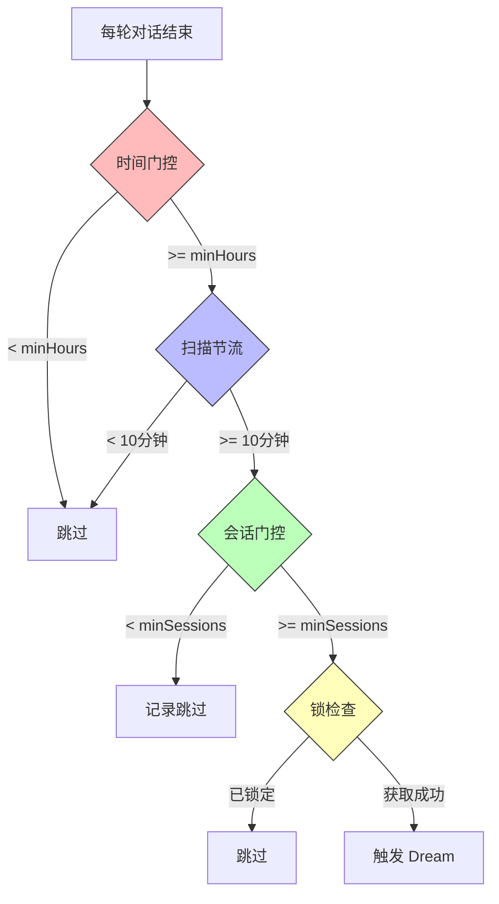

# 第 33 章：DreamTask 与 AutoDream

> 本章目标：理解记忆整合系统如何从历史会话中学习和积累知识。

## Dream 系统概述

Dream 系统实现了长期学习和知识积累，是四层记忆架构的最高层。它定期分析历史会话记录，提取有价值的信息并整合到持久记忆中。

### Dream 在记忆架构中的位置



## AutoDream 触发机制

### 触发门控

```typescript
// services/autoDream/autoDream.ts

/**
 * 检查 AutoDream 是否启用
 */
function isGateOpen(): boolean {
  if (getKairosActive()) return false  // KAIROS 模式使用磁盘技能
  if (getIsRemoteMode()) return false
  if (!isAutoMemoryEnabled()) return false
  return isAutoDreamEnabled()
}

/**
 * 配置阈值
 */
type AutoDreamConfig = {
  minHours: number    // 最小间隔小时数
  minSessions: number // 最小会话数
}

const DEFAULTS: AutoDreamConfig = {
  minHours: 24,
  minSessions: 5,
}
```

### 触发条件



### 执行流程

```typescript
/**
 * AutoDream 执行函数
 */
export async function executeAutoDream(
  context: REPLHookContext,
  appendSystemMessage?: AppendSystemMessageFn,
): Promise<void> {
  const cfg = getConfig()

  // --- 时间门控 ---
  let lastAt: number
  try {
    lastAt = await readLastConsolidatedAt()
  } catch (e) {
    return
  }
  const hoursSince = (Date.now() - lastAt) / 3_600_000
  if (hoursSince < cfg.minHours) return

  // --- 扫描节流 ---
  const sinceScanMs = Date.now() - lastSessionScanAt
  if (sinceScanMs < SESSION_SCAN_INTERVAL_MS) {
    return
  }
  lastSessionScanAt = Date.now()

  // --- 会话门控 ---
  let sessionIds: string[]
  try {
    sessionIds = await listSessionsTouchedSince(lastAt)
  } catch (e) {
    return
  }

  // 排除当前会话
  const currentSession = getSessionId()
  sessionIds = sessionIds.filter(id => id !== currentSession)
  if (sessionIds.length < cfg.minSessions) {
    return
  }

  // --- 锁 ---
  let priorMtime: number | null
  try {
    priorMtime = await tryAcquireConsolidationLock()
  } catch (e) {
    return
  }
  if (priorMtime === null) return

  // --- 运行 Dream ---
  logEvent('tengu_auto_dream_fired', {
    hours_since: Math.round(hoursSince),
    sessions_since: sessionIds.length,
  })

  // ... 运行 forked agent
}
```

## 整合锁

### 锁文件机制

```typescript
// services/autoDream/consolidationLock.ts

const LOCK_FILE_NAME = 'consolidation.lock'

/**
 * 尝试获取整合锁
 * 返回之前的 mtime，如果获取成功则为 null
 */
export async function tryAcquireConsolidationLock(): Promise<number | null> {
  const lockPath = join(getAutoMemPath(), LOCK_FILE_NAME)
  const fs = getFsImplementation()

  try {
    const stats = await fs.stat(lockPath)
    const mtime = stats.mtimeMs
    const ageMs = Date.now() - mtime

    // 锁年龄 < 1 小时：另一个会话正在整合
    if (ageMs < 60 * 60 * 1000) {
      logForDebugging('[autoDream] lock held by another session')
      return null
    }
    // 锁年龄 >= 1 小时：可能已死锁，继续获取
  } catch {
    // ENOENT: 锁文件不存在，可以获取
  }

  // 创建/更新锁文件
  await fs.writeFile(lockPath, Date.now().toString())
  return Date.now()
}

/**
 * 回滚整合锁（恢复旧的 mtime）
 */
export async function rollbackConsolidationLock(priorMtime: number): Promise<void> {
  const lockPath = join(getAutoMemPath(), LOCK_FILE_NAME)
  const fs = getFsImplementation()

  try {
    const utimes = fs.promises?.utimes || fs.utimes
    await utimes(lockPath, priorMtime, priorMtime)
  } catch (e) {
    logForDebugging(`[autoDream] rollbackConsolidationLock failed`)
  }
}
```

### 会话扫描

```typescript
/**
 * 列出自指定时间以来修改的会话
 * 扫描项目目录下的 .jsonl 会话日志
 */
export async function listSessionsTouchedSince(
  since: number,
): Promise<string[]> {
  const projectDir = getProjectDir(getOriginalCwd())
  const fs = getFsImplementation()

  const sessionIds: string[] = []

  try {
    const entries = await fs.readdir(projectDir, { withFileTypes: true })
    for (const entry of entries) {
      if (!entry.name.endsWith('.jsonl')) continue

      const fullPath = join(projectDir, entry.name)
      const stats = await fs.stat(fullPath)

      if (stats.mtimeMs > since) {
        const sessionId = entry.name.replace('.jsonl', '')
        sessionIds.push(sessionId)
      }
    }
  } catch (e) {
    // 目录不存在或无法读取
  }

  return sessionIds
}
```

## Dream 提示构建

### 整合提示结构

```typescript
// services/autoDream/consolidationPrompt.ts

/**
 * 构建整合提示
 */
export function buildConsolidationPrompt(
  memoryRoot: string,
  transcriptDir: string,
  extra: string,
): string {
  return `You are a memory consolidation agent. Your task is to review past conversation transcripts and improve the auto memory system by:

1. **Orient**: Understand the current state of memory (read MEMORY.md and topic files)
2. **Gather**: Read recent session transcripts to extract new information
3. **Consolidate**: Merge new insights into existing memory files
4. **Prune**: Remove outdated or redundant information

**Memory root:** \`${memoryRoot}\`
**Transcript directory:** \`${transcriptDir}\`

${extra}

## Important Guidelines

- Read the current MEMORY.md first to understand what's already stored
- Focus on information that would be useful in FUTURE conversations
- Extract patterns, preferences, and decisions (not derivable from code)
- Update existing files when possible rather than creating new ones
- Keep MEMORY.md entries concise (~150 chars per line)
- Use the Edit tool for targeted changes

## Process

1. List the memory directory to see what files exist
2. Read MEMORY.md to understand the current memory structure
3. Read 2-3 of the most recent session transcripts
4. Identify information worth remembering
5. Update or create memory files as needed
6. Update MEMORY.md index if you created new files

Begin by listing the memory directory contents.`
}
```

## DreamTask 状态管理

### 任务类型

```typescript
// tasks/DreamTask/DreamTask.ts

export type DreamPhase = 'starting' | 'updating'

export type DreamTurn = {
  text: string
  toolUseCount: number
}

export type DreamTaskState = TaskStateBase & {
  type: 'dream'
  phase: DreamPhase
  sessionsReviewing: number
  filesTouched: string[]
  turns: DreamTurn[]
  abortController?: AbortController
  priorMtime: number
}
```

### 任务注册

```typescript
/**
 * 注册 Dream 任务
 */
export function registerDreamTask(
  setAppState: SetAppState,
  opts: {
    sessionsReviewing: number
    priorMtime: number
    abortController: AbortController
  },
): string {
  const id = generateTaskId('dream')
  const task: DreamTaskState = {
    ...createTaskStateBase(id, 'dream', 'dreaming'),
    type: 'dream',
    status: 'running',
    phase: 'starting',
    sessionsReviewing: opts.sessionsReviewing,
    filesTouched: [],
    turns: [],
    abortController: opts.abortController,
    priorMtime: opts.priorMtime,
  }
  registerTask(task, setAppState)
  return id
}
```

### 进度监视

```typescript
/**
 * 监视 forked 代理的消息
 * 提取文本块（推理/摘要）和 Edit/Write 路径
 */
function makeDreamProgressWatcher(
  taskId: string,
  setAppState: SetAppState,
): (msg: Message) => void {
  return msg => {
    if (msg.type !== 'assistant') return

    let text = ''
    let toolUseCount = 0
    const touchedPaths: string[] = []

    for (const block of msg.message.content) {
      if (block.type === 'text') {
        text += block.text
      } else if (block.type === 'tool_use') {
        toolUseCount++
        if (
          block.name === FILE_EDIT_TOOL_NAME ||
          block.name === FILE_WRITE_TOOL_NAME
        ) {
          const input = block.input as { file_path?: unknown }
          if (typeof input.file_path === 'string') {
            touchedPaths.push(input.file_path)
          }
        }
      }
    }

    addDreamTurn(
      taskId,
      { text: text.trim(), toolUseCount },
      touchedPaths,
      setAppState,
    )
  }
}
```

### 任务完成

```typescript
/**
 * 完成 Dream 任务
 */
export function completeDreamTask(
  taskId: string,
  setAppState: SetAppState,
): void {
  updateTaskState<DreamTaskState>(taskId, setAppState, task => ({
    ...task,
    status: 'completed',
    endTime: Date.now(),
    notified: true,
    abortController: undefined,
  }))
}

/**
 * Dream 任务失败
 */
export function failDreamTask(taskId: string, setAppState: SetAppState): void {
  updateTaskState<DreamTaskState>(taskId, setAppState, task => ({
    ...task,
    status: 'failed',
    endTime: Date.now(),
    notified: true,
    abortController: undefined,
  }))
}
```

## Forked Agent 执行

### 执行配置

```typescript
/**
 * 运行 AutoDream
 */
async function runAutoDream(context: REPLHookContext): Promise<void> {
  // ... 门控检查 ...

  const setAppState = context.toolUseContext.setAppState
  const abortController = new AbortController()

  const taskId = registerDreamTask(setAppState, {
    sessionsReviewing: sessionIds.length,
    priorMtime,
    abortController,
  })

  try {
    const memoryRoot = getAutoMemPath()
    const transcriptDir = getProjectDir(getOriginalCwd())

    const extra = `
**Tool constraints for this run:** Bash is restricted to read-only commands.

Sessions since last consolidation (${sessionIds.length}):
${sessionIds.map(id => `- ${id}`).join('\n')}`

    const prompt = buildConsolidationPrompt(memoryRoot, transcriptDir, extra)

    const result = await runForkedAgent({
      promptMessages: [createUserMessage({ content: prompt })],
      cacheSafeParams: createCacheSafeParams(context),
      canUseTool: createAutoMemCanUseTool(memoryRoot),
      querySource: 'auto_dream',
      forkLabel: 'auto_dream',
      skipTranscript: true,
      overrides: { abortController },
      onMessage: makeDreamProgressWatcher(taskId, setAppState),
    })

    completeDreamTask(taskId, setAppState)

    // 内联完成摘要
    const dreamState = context.toolUseContext.getAppState().tasks?.[taskId]
    if (appendSystemMessage && isDreamTask(dreamState) && dreamState.filesTouched.length > 0) {
      appendSystemMessage({
        ...createMemorySavedMessage(dreamState.filesTouched),
        verb: 'Improved',
      })
    }

    logEvent('tengu_auto_dream_completed', {
      cache_read: result.totalUsage.cache_read_input_tokens,
      cache_created: result.totalUsage.cache_creation_input_tokens,
      output: result.totalUsage.output_tokens,
      sessions_reviewed: sessionIds.length,
    })
  } catch (e) {
    if (abortController.signal.aborted) {
      return
    }
    logForDebugging(`[autoDream] fork failed`)
    failDreamTask(taskId, setAppState)
    await rollbackConsolidationLock(priorMtime)
  }
}
```

### 工具约束

```typescript
/**
 * 创建 Auto Memory 专用的 canUseTool
 * 限制为只读 Bash + 记忆目录的 Edit/Write
 */
export function createAutoMemCanUseTool(memoryRoot: string): CanUseToolFn {
  return async (tool: Tool, input: unknown) => {
    const toolName = tool.name

    // Bash: 只读命令
    if (toolName === BASH_TOOL_NAME) {
      if (typeof input === 'object' && input !== null && 'command' in input) {
        const command = String(input.command)
        const readOnlyPattern = /^(ls|find|grep|cat|stat|wc|head|tail|echo|pwd|cd|dirname|basename)\b/
        if (readOnlyPattern.test(command.trim())) {
          return { behavior: 'allow' as const, updatedInput: input }
        }
      }
      return {
        behavior: 'deny' as const,
        message: 'Bash is restricted to read-only commands during memory consolidation',
        decisionReason: { type: 'other' as const, reason: 'bash-read-only' },
      }
    }

    // Edit/Write: 仅限记忆目录
    if (toolName === FILE_EDIT_TOOL_NAME || toolName === FILE_WRITE_TOOL_NAME) {
      if (typeof input === 'object' && input !== null && 'file_path' in input) {
        const filePath = String(input.file_path)
        if (isAutoMemPath(filePath)) {
          return { behavior: 'allow' as const, updatedInput: input }
        }
      }
      return {
        behavior: 'deny' as const,
        message: `Only memory files can be edited during consolidation`,
        decisionReason: { type: 'other' as const, reason: 'memory-files-only' },
      }
    }

    // Read: 总是允许
    if (toolName === FILE_READ_TOOL_NAME) {
      return { behavior: 'allow' as const, updatedInput: input }
    }

    // 其他工具: 拒绝
    return {
      behavior: 'deny' as const,
      message: `Tool ${toolName} is not available during memory consolidation`,
      decisionReason: { type: 'other' as const, reason: 'tool-not-available' },
    }
  }
}
```

## KAIROS 模式下的差异

在 KAIROS（assistant）模式下，Dream 系统有不同的行为：

```typescript
// KAIROS 使用每日日志模式
if (feature('KAIROS') && autoEnabled && getKairosActive()) {
  return false  // AutoDream 被禁用
}
```

KAIROS 模式使用磁盘技能（`/dream` skill）进行记忆整合，而不是自动触发。

## 任务管理

### DreamTask 类型

```typescript
export const DreamTask: Task = {
  name: 'DreamTask',
  type: 'dream',

  async kill(taskId, setAppState) {
    let priorMtime: number | undefined
    updateTaskState<DreamTaskState>(taskId, setAppState, task => {
      if (task.status !== 'running') return task
      task.abortController?.abort()
      priorMtime = task.priorMtime
      return {
        ...task,
        status: 'killed',
        endTime: Date.now(),
        notified: true,
        abortController: undefined,
      }
    })

    // 回滚锁 mtime
    if (priorMtime !== undefined) {
      await rollbackConsolidationLock(priorMtime)
    }
  },
}
```

## 本章小结

Dream 系统实现了长期学习和知识积累：

1. **触发门控**：时间间隔 + 最小会话数双重条件
2. **整合锁**：防止多会话并发整合
3. **Forked Agent**：独立代理运行，隔离主对话
4. **进度跟踪**：DreamTask 状态管理和 UI 显示
5. **工具约束**：只读 Bash + 记忆目录限制

**设计亮点：**
- 多层门控确保合理的触发时机
- 锁机制防止并发整合冲突
- Forked 上下文保证主对话不受影响
- 进度监视提供用户可见的反馈
- 失败回滚允许重试

**与 ExtractMemories 的区别：**
- **AutoDream**：定期分析历史会话，整合长期记忆
- **ExtractMemories**：每轮对话后立即提取遗漏的记忆

两者互补，共同构建完整的记忆系统。

## 章节回顾

至此，我们已完成了记忆与智能模块的全部章节：

- 第 29 章：四层记忆架构总览
- 第 30 章：Memdir 系统详解
- 第 31 章：Magic Docs 详解
- 第 32 章：团队记忆同步
- 第 33 章：DreamTask 与 AutoDream

这四层记忆系统使 Claude Code 能够跨越会话限制，在团队成员间共享知识，自动组织和检索信息，并持续学习和改进。

## 下一章预告

第 34 章将介绍安全模型总论 —— 了解 Claude Code 如何保障用户安全。
